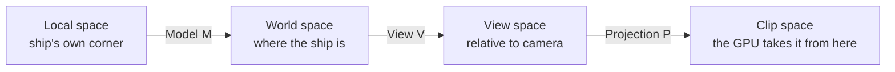

# 04 · The math you need 🧠🛠️

> **You'll leave this chapter with:** enough linear algebra to read every matrix
> in the project, an understanding of *why we orient ships with quaternions*, and
> your first real file — built one function at a time and verified by a number
> you can check.
>
> **Files created:** `Sources/SpaceFighter/Core/Math.swift`

You don't need to love math to build this. You need four things: vectors, the
model/view/projection chain, quaternions for rotation, and the `simd` library
that makes all of it one-liners.

---

## Our conventions (pin these up)

Everything you write from here obeys these four rules. Most 3D bugs are a
violation of one of them.

1. **Right-handed world space.** +X is right, +Y is up, +Z points *toward* the
   viewer. So a ship's **forward is its local −Z**. (Point your right hand's
   fingers from +X to +Y; your thumb points +Z, out of the screen.)
2. **Column-major matrices.** A transform applies as `M * v`, and composition
   reads **right-to-left**: `translate * rotate * scale` scales first, rotates
   next, translates last. This is what Metal and `simd_float4x4` expect.
3. **Clip-space depth in [0, 1].** Metal's normalised depth runs 0 (near) to 1
   (far). OpenGL used −1…1; a projection matrix copied from an OpenGL tutorial
   will render a depth-fighting mess.
4. **Angles in radians.** `simd` trig is radians; we'll add a helper for the
   degrees humans think in.

---

## Vectors: two operations do all the work

**Dot product** — `simd_dot(a, b)` — a single number measuring alignment. For
unit vectors it's the cosine of the angle between them: `1` same direction, `0`
perpendicular, `−1` opposite. Our entire lighting model will be one dot product:
how aligned is a surface normal with the direction to the light?

**Cross product** — `simd_cross(a, b)` — a new vector *perpendicular to both*.
We'll use it to build coordinate frames (the camera's right axis is `up × back`)
and to find a rotation axis: to turn a homing enemy toward you, rotate about
`currentHeading × desiredHeading`.

Everything else is `simd_length` and `simd_normalize`. Normalize directions
before you use them.

---

## Start the file

The scaffolding first: the type aliases that keep every later signature short,
and the degrees helper.

**`Sources/SpaceFighter/Core/Math.swift`** — new file:

```swift
import Foundation
import simd

typealias Vec3 = SIMD3<Float>
typealias Vec4 = SIMD4<Float>
typealias Mat4 = simd_float4x4
typealias Quat = simd_quatf

extension Float {
    var radians: Float { self * .pi / 180 }
}

enum Math {
    static let identity = matrix_identity_float4x4
}
```

`Foundation` is there for scalar `tan`, which the projection needs later; `simd`
brings everything else. `Math` is an `enum` with no cases — a Swift idiom for a
namespace you can't accidentally instantiate.

Those aliases aren't just brevity. `SIMD3<Float>` maps to a single CPU vector
register *and* matches the memory layout Metal expects for `float3`, which is
what will let us hand Swift structs straight to a shader in chapter 06 with no
marshalling.

---

## Why matrices: one type for every transform

We want to move, rotate and scale geometry and — crucially — *compose* those.
A 4×4 matrix expresses all of it and composes by multiplication. The trick that
makes translation fit is the **homogeneous coordinate**: tack a `w = 1` onto each
3D point, making it 4D. Now the matrix's last column can add a translation,
something a 3×3 can't do.

```
| Rx  Ux  Fx  Tx |   the upper-left 3×3 is rotation × scale
| Ry  Uy  Fy  Ty |   (the object's right/up/forward axes, scaled)
| Rz  Uz  Fz  Tz |
|  0   0   0   1 |   the last column T is translation
```

That last column is the whole point, so translation is the first function.

**`Math.swift`**, in `enum Math` — after `identity`:

```diff
 enum Math {
     static let identity = matrix_identity_float4x4
+
+    static func translation(_ t: Vec3) -> Mat4 {
+        Mat4(columns: (
+            Vec4(1, 0, 0, 0),
+            Vec4(0, 1, 0, 0),
+            Vec4(0, 0, 1, 0),
+            Vec4(t.x, t.y, t.z, 1)
+        ))
+    }
 }
```

Note `Mat4(columns:)` — you're giving *columns*, not rows. The translation lands
in the fourth column, matching the diagram. If you ever build a matrix that
transposes what you expected, this is why.

Scale is the diagonal. Two overloads, because uniform scale is the common case:

**`Math.swift`**, in `enum Math` — after `translation`:

```diff
             Vec4(t.x, t.y, t.z, 1)
         ))
     }
+
+    static func scale(_ s: Float) -> Mat4 { scale(Vec3(repeating: s)) }
+
+    static func scale(_ s: Vec3) -> Mat4 {
+        Mat4(columns: (
+            Vec4(s.x, 0, 0, 0),
+            Vec4(0, s.y, 0, 0),
+            Vec4(0, 0, s.z, 0),
+            Vec4(0, 0, 0, 1)
+        ))
+    }
 }
```

---

## Rotation: quaternions, not Euler angles

Here's the one genuinely non-obvious choice in the project.

The tempting way to store orientation is three angles — pitch, yaw, roll. It's
readable and it's a trap. Applying three sequential angle-rotations has a failure
mode called **gimbal lock**: at certain orientations (nose straight up) two of
your three axes line up, you lose a degree of freedom, and the ship snaps or
sticks. A flight game pitches and rolls through *every* orientation, so it hits
this constantly.

A **quaternion** stores orientation as four numbers — think "an axis and an
amount of spin about it," encoded so that composition is just multiplication. No
gimbal lock, cheap composition (`q * delta`), and smooth interpolation when you
later want a camera or missile to ease toward a target.

`simd` gives us `simd_quatf`, so we get the hard parts free:

```swift
Quat(angle: θ, axis: Vec3(1, 0, 0))   // a rotation
q1 * q2                                // compose
q.act(Vec3(0, 0, -1))                  // rotate a vector: "which way is forward?"
simd_normalize(q)                      // keep it unit after many multiplies
```

What `simd` does *not* give us in a form the GPU can use is a matrix. The vertex
shader multiplies matrices, so we need the quaternion→matrix expansion. You will
never derive this by hand; you just need to know this is where orientation
becomes something the GPU understands.

**`Math.swift`**, in `enum Math` — after `scale`:

```diff
             Vec4(0, 0, 0, 1)
         ))
     }
+
+    static func rotation(_ q: Quat) -> Mat4 {
+        let x = q.vector.x, y = q.vector.y, z = q.vector.z, w = q.vector.w
+        let xx = x * x, yy = y * y, zz = z * z
+        let xy = x * y, xz = x * z, yz = y * z
+        let wx = w * x, wy = w * y, wz = w * z
+        return Mat4(columns: (
+            Vec4(1 - 2 * (yy + zz), 2 * (xy + wz),     2 * (xz - wy),     0),
+            Vec4(2 * (xy - wz),     1 - 2 * (xx + zz), 2 * (yz + wx),     0),
+            Vec4(2 * (xz + wy),     2 * (yz - wx),     1 - 2 * (xx + yy), 0),
+            Vec4(0, 0, 0, 1)
+        ))
+    }
 }
```

We write the expansion out by hand rather than reaching for a
`simd_float4x4(quat)` initializer so it's visible and portable across toolchains.
`q.vector` is `(x, y, z, w)` — note `w` is *last*, which trips people who expect
the mathematical `(w, x, y, z)` ordering.

### Composing all three

Now the function that makes a model matrix out of a position, an orientation and
a size:

**`Math.swift`**, in `enum Math` — after `rotation`:

```diff
             Vec4(2 * (xz + wy),     2 * (yz - wx),     1 - 2 * (xx + yy), 0),
             Vec4(0, 0, 0, 1)
         ))
     }
+
+    static func trs(translation t: Vec3, rotation r: Quat, scale s: Vec3) -> Mat4 {
+        translation(t) * rotation(r) * scale(s)
+    }
 }
```

One line, and the order in it is load-bearing. Read right-to-left: scale the mesh
about its own origin, *then* spin it, *then* move it into the world. Flip any two
and you get nonsense — scale after translating and the object's distance from the
origin scales too, so it slides across the map as it grows. The checkpoint at the
end of this chapter will catch exactly that mistake, so resist the urge to
"tidy" the order.

---

## The MVP chain, and the last two matrices

A vertex of the ship mesh starts in **local space**, relative to the ship's own
origin. Three matrices carry it to the screen:



`trs` gives you **M**. The other two are the camera, and they're the last things
this file needs.

**Projection** applies perspective — far things shrink — and squashes depth into
Metal's [0, 1]:

**`Math.swift`**, in `enum Math` — after `trs`:

```diff
     static func trs(translation t: Vec3, rotation r: Quat, scale s: Vec3) -> Mat4 {
         translation(t) * rotation(r) * scale(s)
     }
+
+    static func perspective(fovyRadians: Float, aspect: Float, near: Float, far: Float) -> Mat4 {
+        let ys = 1 / tan(fovyRadians * 0.5)
+        let xs = ys / aspect
+        let zs = far / (near - far)
+        return Mat4(columns: (
+            Vec4(xs, 0, 0, 0),
+            Vec4(0, ys, 0, 0),
+            Vec4(0, 0, zs, -1),
+            Vec4(0, 0, zs * near, 0)
+        ))
+    }
 }
```

Three things to feel rather than memorise. `ys` comes from the **vertical** field
of view, so a narrower FOV means a bigger `ys` and everything looks zoomed in.
Dividing by `aspect` to get `xs` is what stops the image stretching when you
resize the window — we'll pass the live window aspect every frame. And `zs` is
the line that makes this *Metal's* projection: `far / (near - far)` produces
depth in [0, 1]. An OpenGL matrix uses a different form for [−1, 1] and will look
subtly, maddeningly wrong.

**View** moves the world so the camera sits at the origin looking down −Z:

**`Math.swift`**, in `enum Math` — after `perspective`:

```diff
             Vec4(0, 0, zs * near, 0)
         ))
     }
+
+    static func lookAt(eye: Vec3, center: Vec3, up: Vec3) -> Mat4 {
+        let z = simd_normalize(eye - center)
+        let x = simd_normalize(simd_cross(up, z))
+        let y = simd_cross(z, x)
+        return Mat4(columns: (
+            Vec4(x.x, y.x, z.x, 0),
+            Vec4(x.y, y.y, z.y, 0),
+            Vec4(x.z, y.z, z.z, 0),
+            Vec4(-simd_dot(x, eye), -simd_dot(y, eye), -simd_dot(z, eye), 1)
+        ))
+    }
 }
```

Those first three lines build an orthonormal camera frame: `z` points *backward*
from the target toward the eye (because the camera looks down −z), `x` is
right-handed-perpendicular to `up` and `z`, and `y` is the *true* up — which is
why the caller's `up` doesn't have to be exactly perpendicular. Feed it world-up
and this re-orthogonalises for you, a property chapter 11 leans on heavily.

The last column is the inverse translation. A view matrix is the camera's
transform *inverted*, and for an orthonormal frame the inverse is the transpose
plus `-dot(axis, eye)` — which is what those three dot products are.

One small easing helper, and the file is done:

**`Math.swift`**, in `enum Math` — after `lookAt`:

```diff
             Vec4(-simd_dot(x, eye), -simd_dot(y, eye), -simd_dot(z, eye), 1)
         ))
     }
+
+    static func moveToward(_ current: Float, _ target: Float, _ maxDelta: Float) -> Float {
+        let d = target - current
+        if abs(d) <= maxDelta { return target }
+        return current + (d < 0 ? -maxDelta : maxDelta)
+    }
 }
```

---

## Checkpoint

It rotates a point on the ship's nose and checks where it lands.

**`main.swift`** — replace the whole file (this is throwaway; chapter 08 writes
the real one):

```swift
import Foundation
import simd

// Put a point 1 unit down the ship's nose (local -Z), rotate the ship 90 degrees
// about +Y, and move it to (10, 0, 0). The nose should end up pointing down -X,
// so the point lands at (9, 0, 0).
let rotation = Quat(angle: Float(90).radians, axis: Vec3(0, 1, 0))
let model = Math.trs(translation: Vec3(10, 0, 0), rotation: rotation, scale: Vec3(repeating: 1))
let nose = model * Vec4(0, 0, -1, 1)

print(String(format: "nose -> (%.2f, %.2f, %.2f)", nose.x, nose.y, nose.z))
```

The reasoning: a point one unit down the ship's nose is at local `(0, 0, −1)`.
Yaw the ship 90° about +Y and its nose swings from −Z to −X. Then move the ship
to `x = 10`. So the point should end up one unit *short* of 10:

```console
$ swift run
nose -> (9.00, 0.00, 0.00)
```

Three ways this goes wrong, and what each tells you:

- **`11.00`** — your rotation went the other way. Check the sign convention in
  `rotation`, or that you passed `+Y` as the axis.
- **`10.00, 0.00, -1.00`** — the rotation didn't apply at all. The `rotation`
  matrix is probably returning identity; check `q.vector` component order.
- **`-1.00` or a wildly scaled result** — your `trs` multiplies in the wrong
  order. It must be `translation(t) * rotation(r) * scale(s)`.

Try that last one deliberately. Swap `trs` to `scale(s) * rotation(r) * translation(t)`,
re-run, and watch the number change. Put it back. That's five seconds of work and
it permanently fixes the right-to-left rule in your head.

---

## Challenge

`moveToward` eases a `Float` without overshooting. Write the `Vec3` version:
move a point toward a target by at most `maxDelta` *in a straight line*, landing
exactly on the target when it's within reach. It's three lines, and the trap is
what happens when the two points coincide — `simd_normalize` of a zero vector is
not your friend.

---

**Next:** the engine core — entities, components, and the storage that makes
them fast. → [Chapter 05: Designing the ECS](05-designing-the-ecs.md)
