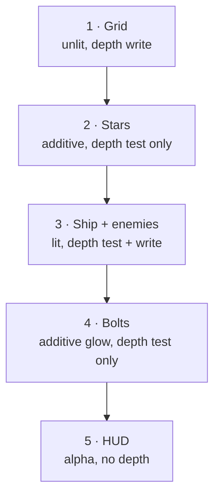

# 05 · The render pipeline 🛠️

> **You'll leave this chapter with:** the ability to read and modify our Metal
> shaders, a solid grip on **instancing** (one mesh → many entities → one draw
> call), the CPU↔GPU struct-layout contract, and a full tour of
> `Renderer.swift` and
> `Shaders.swift`.

---

## The seam, restated

`RenderSystem` (chapter 04's last system) hands the renderer a dictionary:
*for each mesh, the list of instances to draw.*

```swift
[MeshID: [InstanceData]]    // e.g. .enemy → [ {model, color}, {model, color}, … ]
```

That's the entire interface. The renderer knows nothing about entities; gameplay
knows nothing about Metal. Everything below is how the right side of that seam
turns those arrays into pixels.

---

## Three structs the CPU and GPU must agree on

The shaders read Swift data directly out of buffers, so the memory layout has to
match on both sides *exactly*. These pairs must stay in lockstep — the Swift ones
in `RenderTypes.swift`,
the MSL ones at the top of `Shaders.swift`:

| Swift (`RenderTypes.swift`) | MSL (`Shaders.swift`) | Bytes | Purpose |
|---|---|---|---|
| `Vertex { position, normal }` | `struct Vertex { float3; float3; }` | 32 | one mesh vertex |
| `InstanceData { model, color }` | `struct InstanceData { float4x4; float4; }` | 80 | one entity's transform + tint |
| `FrameUniforms { viewProjection, cameraPosition, lightDirection }` | matching | 96 | shared per-frame constants |

We get this for free because `SIMD3<Float>` ↔ `float3`, `SIMD4<Float>` ↔
`float4`, `simd_float4x4` ↔ `float4x4` have identical size and alignment.

> **The one trap:** `float3` is **16-byte aligned**, not 12. Put a lone `Float`
> right after a `float3` in a struct and it silently gains 4 bytes of padding on
> one side but maybe not the other — instant garbage. The rule that saves you:
> keep everything in `SIMD*` types (as we do), or pad by hand. Our
> `FrameUniforms` sidesteps it by using two `SIMD3`s back to back, each already
> 16 bytes.

If you ever change one of these structs and the screen goes to noise, this is
almost always why.

---

## The shaders, read in full

All four shader pairs live in one MSL string compiled at launch. Let's read the
lit pair — the ship and enemies — because it shows every idea.

### The pull-vertex model

Rather than describe a vertex layout with an `MTLVertexDescriptor`, we let the
vertex shader **pull** vertices from a buffer by index:

```metal
vertex LitInOut lit_vertex(uint vid              [[vertex_id]],
                           uint iid              [[instance_id]],
                           constant Vertex*       verts     [[buffer(0)]],
                           constant InstanceData* instances [[buffer(1)]],
                           constant FrameUniforms& frame    [[buffer(2)]]) {
    Vertex v = verts[vid];              // vid = this vertex's index
    InstanceData inst = instances[iid]; // iid = which copy we're drawing
    float4 world = inst.model * float4(v.position, 1.0);
    ...
    out.position = frame.viewProjection * world;
```

- `[[vertex_id]]` is the running vertex index; with an indexed draw it's the
  value read from the index buffer. We use it to index `verts` directly. Simple,
  and flexible.
- `[[instance_id]]` is *which instance* we're drawing — the key to instancing,
  next section.
- `[[buffer(N)]]` binds to the slot the CPU set with `setVertexBuffer(_, index:
  N)`. This numbering is a **contract** both sides must honour; ours is fixed:

  ```
  buffer(0) = vertices   buffer(1) = instances
  buffer(2) = frame uniforms   buffer(3) = star params
  ```

The fragment side is a four-line directional light — the single dot product from
chapter 03:

```metal
fragment float4 lit_fragment(LitInOut in [[stage_in]],
                             constant FrameUniforms& frame [[buffer(0)]]) {
    float3 N = normalize(in.worldNormal);
    float3 L = normalize(-frame.lightDirection);   // direction toward the light
    float  diffuse = max(dot(N, L), 0.0);
    return float4(in.color.rgb * (0.25 + diffuse * 0.85), in.color.a);
}
```

`0.25` is ambient so shadowed faces aren't pure black; `0.85` is how hard the
sun hits. That's the entire lighting model, and it's plenty for faceted low-poly
shapes.

The other three pairs are variations on this skeleton:

- **`unlit_*`** — same vertex transform, but the fragment just returns the
  instance colour. Used for the grid and the glowing bolts (no lighting wanted).
- **`star_*`** — wraps points around the camera (chapter 06's tiling trick) and
  outputs `[[point_size]]`; the fragment rounds each square point into a soft dot
  with `point_coord`.
- **`hud_*`** — takes 2D positions already in clip space and passes colour
  straight through (chapter 11).

---

## Instancing: one mesh, many entities, one draw call

Twenty enemies share one octahedron mesh. Naively that's twenty draw calls, each
re-binding the same vertices. **Instancing** collapses them: bind the mesh once,
hand the GPU an *array* of per-entity data, and issue **one** call that draws the
mesh N times. The shader reads its slot via `[[instance_id]]`.

```swift
// Renderer.drawMesh — the whole idea in five lines
let instanceBuffer = device.makeBuffer(bytes: instances, length: ..., options: .storageModeShared)!
enc.setVertexBuffer(mesh.vertexBuffer, offset: 0, index: 0)   // the shared geometry
enc.setVertexBuffer(instanceBuffer,    offset: 0, index: 1)   // per-entity model+color
enc.drawIndexedPrimitives(type: mesh.primitive, indexCount: mesh.indexCount,
                          indexType: .uint16, indexBuffer: mesh.indexBuffer!,
                          indexBufferOffset: 0, instanceCount: instances.count)
```

The GPU runs the vertex shader `vertexCount × instanceCount` times, and for each
run `instance_id` tells the shader which model matrix and colour to use. This is
how a bullet-hell game draws thousands of sprites at 120 fps — and the reason our
`RenderSystem` *buckets by mesh* is to make exactly these grouped calls possible.

> For a teaching prototype we allocate the instance buffer per draw with
> `makeBuffer(bytes:)`. That's simple and fine at our counts. A shipping game
> reuses a small ring of pre-sized buffers to avoid per-frame allocation —
> chapter 12.

---

## Frame constants without a buffer

`FrameUniforms` is small (96 bytes) and changes every frame, so instead of a
managed buffer we blit it straight into the encoder:

```swift
enc.setVertexBytes(&frame, length: MemoryLayout<FrameUniforms>.stride, index: 2)
enc.setFragmentBytes(&frame, length: MemoryLayout<FrameUniforms>.stride, index: 0)
```

`setVertexBytes`/`setFragmentBytes` copy the bytes into the command buffer for
you — perfect for small, per-frame constants (Metal caps this at 4 KB). Note the
vertex and fragment stages have **separate** binding tables, which is why the
same struct is bound at vertex `index: 2` *and* fragment `index: 0` — matching
the `[[buffer(2)]]` and `[[buffer(0)]]` in the two shader functions.

---

## Blend modes: how colours combine

When a fragment survives the depth test, the GPU **blends** it with what's
already there, per the pipeline's blend settings. We bake three presets into the
pipelines (`BlendMode` in `Renderer.swift`):

- **`.opaque`** — replace. The ship and enemies overwrite whatever's behind.
- **`.additive`** — `source + destination`. Colours *add*, so overlaps get
  brighter — that's the glow on bolts, stars and the neon grid over the dark sky.
- **`.alpha`** — standard transparency (`src·α + dst·(1−α)`). The HUD, so its
  panels sit translucently over the scene.

Blend mode is frozen into the pipeline state, so "make bolts glow" was a
one-line choice at pipeline-creation time, not a per-draw toggle.

---

## Putting a frame together: `Renderer.render`

The draw order is deliberate, and it's a marriage of **painter's order** (for the
blended stuff) and the **depth buffer** (for the solids). Passes run in this
sequence:



Why this order and these depth settings:

1. **Grid** writes depth, laying down a floor solids can test against.
2. **Stars** test depth (so the grid can occlude ones below the horizon) but
   *don't* write it — a star must never block a ship drawn later.
3. **Ship + enemies** test *and* write depth: this is what makes near ships hide
   far ones correctly, no manual sorting.
4. **Bolts** glow additively and test-but-don't-write, so a bolt in front of the
   ship brightens it rather than punching a hole in the depth buffer.
5. **HUD** ignores depth entirely and always draws on top.

Each pass is a few lines: set pipeline, set the matching depth state, (re)bind
the frame uniforms, then one `drawMesh` per mesh group. Read the five private
`draw…` methods in `Renderer.swift` alongside this list and each one will map to
a row above.

---

## A note on runtime shader compilation

We compile MSL from a Swift string at launch (`device.makeLibrary(source:)`).
The upside: the package builds with `swift run`, and the shader sits next to the
CPU structs it must match. The downside: shader errors surface at **launch**, not
build time, and there's a few-millisecond compile at startup. A production build
ships a precompiled `.metallib` (shaders in `.metal` files, compiled by the build
system, errors at build time). For learning, runtime compilation keeps the whole
renderer in two readable files — worth it. Chapter 01 notes how to switch when
you move to Xcode.

---

**Next:** where all those vertices come from — geometry generated in code. →
[Chapter 06: Meshes & simple geometry](06-meshes-and-geometry.md)
