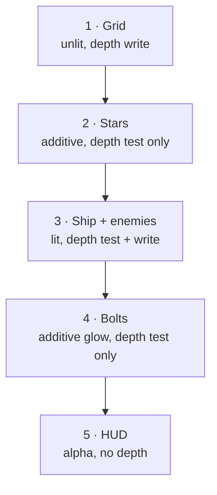

# 06 · The render pipeline 🛠️

> **You'll leave this chapter with:** working Metal shaders, a renderer that
> draws instanced geometry, and **a ship on your screen**. This is the big one.
>
> **Files created:** `Sources/SpaceFighter/Render/Shaders.swift`,
> `Render/Renderer.swift`, and a real `main.swift`

Chapter 02 gave you the vocabulary; chapter 05 gave you geometry. Now we put
them together.

---

## The seam we're building

The renderer's entire input will be a dictionary:

```swift
[MeshID: [InstanceData]]    // e.g. .enemy -> [ {model, color}, {model, color}, … ]
```

*For each mesh, the list of instances to draw.* That's the whole interface
between gameplay and rendering. The renderer knows nothing about entities;
gameplay knows nothing about Metal. Chapter 07 fills this dictionary from the
ECS; this chapter hand-builds one entry so we have something to look at.

---

## Writing shaders in MSL

Metal Shading Language is C++-flavoured. Four ideas carry our shaders:

**The pull-vertex model.** Rather than describing a vertex layout with an
`MTLVertexDescriptor`, we let the vertex shader **pull** vertices from a buffer
by index. `[[vertex_id]]` is the running vertex index, and we use it to index the
buffer directly. Simple and flexible.

**`[[instance_id]]`.** Which copy we're drawing — the key to instancing, below.

**`[[buffer(N)]]`.** Binds to the slot the CPU set with `setVertexBuffer(_,
index: N)`. This numbering is a **contract** both sides must honour. Ours:

```
buffer(0) = vertices        buffer(1) = per-instance data
buffer(2) = frame uniforms  buffer(3) = star params
```

**Separate binding tables per stage.** The vertex and fragment stages have
independent buffer slots, which is why `FrameUniforms` is bound at vertex
`index: 2` *and* fragment `index: 0`.

### Create `Sources/SpaceFighter/Render/Shaders.swift`

We keep the shaders in a Swift string and compile them at launch, so the package
builds with a plain `swift run` — no `.metal` files in a build phase.

```swift
import Foundation

/// The Metal Shading Language source for the whole game, compiled at runtime by
/// `device.makeLibrary(source:options:)`.
///
/// The `struct`s below must stay byte-for-byte compatible with the Swift structs
/// in `RenderTypes.swift`. Buffer indices are a fixed convention:
///   buffer(0) = vertices     buffer(1) = per-instance data
///   buffer(2) = frame uniforms   buffer(3) = extra params (star field)
enum Shaders {
    static let source = """
    #include <metal_stdlib>
    using namespace metal;

    struct Vertex        { float3 position; float3 normal; };
    struct InstanceData  { float4x4 model; float4 color; };
    struct FrameUniforms { float4x4 viewProjection; float3 cameraPosition; float3 lightDirection; };
    struct HUDVertex     { float2 position; float4 color; };
    struct StarParams    { float span; float pointSize; };

    struct LitInOut   { float4 position [[position]]; float3 worldNormal; float4 color; };
    struct FlatInOut  { float4 position [[position]]; float4 color; };
    struct PointInOut { float4 position [[position]]; float4 color; float pointSize [[point_size]]; };
    struct HUDInOut   { float4 position [[position]]; float4 color; };

    // --- Lit: ship + enemies, simple directional (Lambert) shading ---------

    vertex LitInOut lit_vertex(uint vid              [[vertex_id]],
                               uint iid              [[instance_id]],
                               constant Vertex*       verts     [[buffer(0)]],
                               constant InstanceData* instances [[buffer(1)]],
                               constant FrameUniforms& frame    [[buffer(2)]]) {
        Vertex v = verts[vid];
        InstanceData inst = instances[iid];
        float4 world = inst.model * float4(v.position, 1.0);
        // Uniform scale only, so the model's upper-left 3x3 is a valid normal
        // matrix — no inverse-transpose needed.
        float3x3 nm = float3x3(inst.model[0].xyz, inst.model[1].xyz, inst.model[2].xyz);
        LitInOut out;
        out.position    = frame.viewProjection * world;
        out.worldNormal = normalize(nm * v.normal);
        out.color       = inst.color;
        return out;
    }

    fragment float4 lit_fragment(LitInOut in [[stage_in]],
                                 constant FrameUniforms& frame [[buffer(0)]]) {
        float3 N = normalize(in.worldNormal);
        float3 L = normalize(-frame.lightDirection);   // toward the light
        float  diffuse = max(dot(N, L), 0.0);
        float  ambient = 0.25;
        float3 lit = in.color.rgb * (ambient + diffuse * 0.85);
        return float4(lit, in.color.a);
    }

    // --- Unlit: grid lines + glowing bolts, flat instance colour -----------

    vertex FlatInOut unlit_vertex(uint vid              [[vertex_id]],
                                  uint iid              [[instance_id]],
                                  constant Vertex*       verts     [[buffer(0)]],
                                  constant InstanceData* instances [[buffer(1)]],
                                  constant FrameUniforms& frame    [[buffer(2)]]) {
        Vertex v = verts[vid];
        InstanceData inst = instances[iid];
        FlatInOut out;
        out.position = frame.viewProjection * (inst.model * float4(v.position, 1.0));
        out.color    = inst.color;
        return out;
    }

    fragment float4 unlit_fragment(FlatInOut in [[stage_in]]) {
        return in.color;
    }

    // --- Starfield: points wrapped into a cube centred on the camera -------

    vertex PointInOut star_vertex(uint vid              [[vertex_id]],
                                  uint iid              [[instance_id]],
                                  constant Vertex*       verts     [[buffer(0)]],
                                  constant InstanceData* instances [[buffer(1)]],
                                  constant FrameUniforms& frame    [[buffer(2)]],
                                  constant StarParams&   params    [[buffer(3)]]) {
        Vertex v = verts[vid];
        // Tile the star cube endlessly around the camera: shift each star into
        // the [-span/2, span/2] box relative to the camera.
        float3 rel = v.position - frame.cameraPosition;
        rel = rel - round(rel / params.span) * params.span;
        float3 world = frame.cameraPosition + rel;

        PointInOut out;
        out.position  = frame.viewProjection * float4(world, 1.0);
        out.pointSize = params.pointSize;
        // normal.x carries a per-star brightness (see MeshLibrary.starfield).
        out.color     = float4(instances[iid].color.rgb * v.normal.x, 1.0);
        return out;
    }

    fragment float4 star_fragment(PointInOut in [[stage_in]],
                                  float2 pc [[point_coord]]) {
        float d = distance(pc, float2(0.5));
        if (d > 0.5) discard_fragment();          // round the square point
        float glow = 1.0 - smoothstep(0.0, 0.5, d);
        return float4(in.color.rgb, glow);
    }

    // --- HUD: 2D shapes straight in normalised device coordinates ----------

    vertex HUDInOut hud_vertex(uint vid [[vertex_id]],
                               constant HUDVertex* verts [[buffer(0)]]) {
        HUDInOut out;
        out.position = float4(verts[vid].position, 0.0, 1.0);
        out.color    = verts[vid].color;
        return out;
    }

    fragment float4 hud_fragment(HUDInOut in [[stage_in]]) {
        return in.color;
    }
    """
}
```

The lighting is four lines: `max(dot(normal, toLight), 0)`, plus `0.25` ambient
so shadowed faces aren't pure black. That's chapter 03's dot product doing its
one job, and it's plenty for faceted low-poly shapes.

The star shader is worth a second look. `rel - round(rel / span) * span` snaps
each star into the cube centred on the camera, so a few thousand points tile
infinitely as you fly. That's the rule expressed *once* in a shader instead of
thousands of CPU updates per frame — the habit worth taking from this chapter.

---

## Instancing: one mesh, many entities, one draw call

Twenty enemies share one octahedron. Naively that's twenty draw calls, each
re-binding the same vertices. **Instancing** collapses them: bind the mesh once,
hand the GPU an *array* of per-entity data, and issue **one** call that draws the
mesh N times. The shader reads its slot via `[[instance_id]]`.

The GPU then runs the vertex shader `vertexCount × instanceCount` times. This is
how a bullet-hell draws thousands of sprites at 120 fps — and the reason we
bucket instances by mesh.

## Blend modes

When a fragment survives the depth test, the GPU **blends** it with what's there.
We bake three presets into pipelines:

- **`.opaque`** — replace. Ship and enemies overwrite what's behind.
- **`.additive`** — `source + destination`. Colours *add*, so overlaps brighten:
  glowing bolts, stars, and the neon grid over a dark sky.
- **`.alpha`** — standard transparency. The HUD (chapter 11).

Blend mode is frozen into the pipeline state, so "make bolts glow" is a choice at
pipeline-creation time, not a per-draw toggle.

## The frame, and why the passes are ordered



1. **Grid** writes depth, laying a floor solids can test against.
2. **Stars** test depth (the grid can occlude ones below the horizon) but *don't*
   write it — a star must never block a ship drawn later.
3. **Ship + enemies** test *and* write: near ships hide far ones, no sorting.
4. **Bolts** glow additively and test-but-don't-write, so a bolt in front of the
   ship brightens it rather than punching a hole in the depth buffer.
5. **HUD** ignores depth entirely.

---

## Create `Sources/SpaceFighter/Render/Renderer.swift`

The longest file in the project, and the last one that touches Metal directly:

```swift
import Metal
import MetalKit
import simd

/// Extra per-draw parameters for the star field (kept private to the renderer).
private struct StarParams {
    var span: Float
    var pointSize: Float
}

/// Owns the Metal device, the pipeline states, and the GPU copies of every mesh.
/// Everything GPU-facing lives here; the rest of the game speaks only in
/// entities, components and `InstanceData`.
final class Renderer {

    // MARK: Tunables
    static let starSpan: Float = 480      // side length of the star tiling cube
    static let gridSpacing: Float = 6     // world units between grid lines
    static let groundY: Float = -8        // altitude of the reference grid

    let device: MTLDevice
    private let queue: MTLCommandQueue

    // Pipelines, one per shading style.
    private let litPipeline: MTLRenderPipelineState
    private let unlitPipeline: MTLRenderPipelineState
    private let starPipeline: MTLRenderPipelineState
    private let hudPipeline: MTLRenderPipelineState

    // Depth/stencil states.
    private let solidDepth: MTLDepthStencilState   // test + write (opaque)
    private let readDepth: MTLDepthStencilState    // test, no write (glows)
    private let noDepth: MTLDepthStencilState      // no test/write (HUD)

    // GPU meshes.
    private struct GPUMesh {
        var vertexBuffer: MTLBuffer
        var indexBuffer: MTLBuffer?
        var indexCount: Int
        var vertexCount: Int
        var primitive: MTLPrimitiveType
    }
    private var meshes: [MeshID: GPUMesh] = [:]
    private let starMesh: GPUMesh
    private let gridMesh: GPUMesh

    init?(view: MTKView) {
        guard let device = view.device ?? MTLCreateSystemDefaultDevice(),
              let queue = device.makeCommandQueue() else {
            return nil
        }
        self.device = device
        self.queue = queue

        // Configure the view's render targets. Setting a depth format makes
        // MetalKit manage the depth texture for us, so `currentRenderPassDescriptor`
        // arrives with a depth attachment already wired up.
        view.device = device
        view.colorPixelFormat = .bgra8Unorm
        view.depthStencilPixelFormat = .depth32Float
        view.clearColor = MTLClearColorMake(0.02, 0.02, 0.06, 1.0)

        // Compile all shaders in one library.
        let library: MTLLibrary
        do {
            library = try device.makeLibrary(source: Shaders.source, options: nil)
        } catch {
            print("Shader compilation failed: \\(error)")
            return nil
        }

        func pipeline(_ vfn: String, _ ffn: String, blend: BlendMode) -> MTLRenderPipelineState? {
            let d = MTLRenderPipelineDescriptor()
            d.vertexFunction = library.makeFunction(name: vfn)
            d.fragmentFunction = library.makeFunction(name: ffn)
            d.colorAttachments[0].pixelFormat = view.colorPixelFormat
            d.depthAttachmentPixelFormat = view.depthStencilPixelFormat
            blend.apply(to: d.colorAttachments[0])
            return try? device.makeRenderPipelineState(descriptor: d)
        }

        guard let lit = pipeline("lit_vertex", "lit_fragment", blend: .opaque),
              let unlit = pipeline("unlit_vertex", "unlit_fragment", blend: .additive),
              let star = pipeline("star_vertex", "star_fragment", blend: .additive),
              let hud = pipeline("hud_vertex", "hud_fragment", blend: .alpha) else {
            print("Pipeline creation failed")
            return nil
        }
        litPipeline = lit
        unlitPipeline = unlit
        starPipeline = star
        hudPipeline = hud

        func depth(test: Bool, write: Bool) -> MTLDepthStencilState {
            let d = MTLDepthStencilDescriptor()
            d.depthCompareFunction = test ? .less : .always
            d.isDepthWriteEnabled = write
            return device.makeDepthStencilState(descriptor: d)!
        }
        solidDepth = depth(test: true, write: true)
        readDepth = depth(test: true, write: false)
        noDepth = depth(test: false, write: false)

        // Upload every mesh once, up front.
        func upload(_ mesh: Mesh) -> GPUMesh {
            let vbuf = device.makeBuffer(bytes: mesh.vertices,
                                         length: mesh.vertices.count * MemoryLayout<Vertex>.stride,
                                         options: .storageModeShared)!
            var ibuf: MTLBuffer?
            if !mesh.indices.isEmpty {
                ibuf = device.makeBuffer(bytes: mesh.indices,
                                         length: mesh.indices.count * MemoryLayout<UInt16>.stride,
                                         options: .storageModeShared)
            }
            return GPUMesh(vertexBuffer: vbuf,
                           indexBuffer: ibuf,
                           indexCount: mesh.indices.count,
                           vertexCount: mesh.vertices.count,
                           primitive: Renderer.metalPrimitive(mesh.primitive))
        }

        meshes[.ship] = upload(MeshLibrary.ship())
        meshes[.enemy] = upload(MeshLibrary.enemy())
        meshes[.projectile] = upload(MeshLibrary.projectile())
        starMesh = upload(MeshLibrary.starfield(count: 2600, span: Renderer.starSpan))
        gridMesh = upload(MeshLibrary.grid(halfExtent: 240, spacing: Renderer.gridSpacing))
    }

    private static func metalPrimitive(_ p: Primitive) -> MTLPrimitiveType {
        switch p {
        case .triangle: return .triangle
        case .line:     return .line
        case .point:    return .point
        }
    }

    // MARK: - Frame

    /// Draw one frame. `instances` groups every visible actor by its mesh; the
    /// renderer issues one instanced draw call per group.
    func render(in view: MTKView,
                frame: FrameUniforms,
                instances: [MeshID: [InstanceData]],
                playerPosition: Vec3,
                hud: [HUDVertex]) {
        guard let rpd = view.currentRenderPassDescriptor,
              let drawable = view.currentDrawable,
              let command = queue.makeCommandBuffer(),
              let encoder = command.makeRenderCommandEncoder(descriptor: rpd) else {
            return
        }

        var frame = frame
        // Our flat-shaded meshes carry outward normals and we draw both grids and
        // thin bolts, so it's simplest to skip back-face culling entirely.
        encoder.setCullMode(.none)

        drawGrid(encoder, frame: &frame, playerPosition: playerPosition)
        drawStars(encoder, frame: &frame)
        drawLitActors(encoder, frame: &frame, instances: instances)
        drawProjectiles(encoder, frame: &frame, instances: instances)
        drawHUD(encoder, hud)

        encoder.endEncoding()
        command.present(drawable)
        command.commit()
    }

    // MARK: - Passes

    private func drawGrid(_ enc: MTLRenderCommandEncoder, frame: inout FrameUniforms, playerPosition: Vec3) {
        // Snap the grid under the player so it reads as an infinite floor
        // without the lines crawling as we move.
        let s = Renderer.gridSpacing
        let gx = (playerPosition.x / s).rounded() * s
        let gz = (playerPosition.z / s).rounded() * s
        let model = Math.translation(Vec3(gx, Renderer.groundY, gz))
        let instance = [InstanceData(model: model, color: Vec4(0.10, 0.35, 0.45, 1))]

        enc.setRenderPipelineState(unlitPipeline)
        enc.setDepthStencilState(solidDepth)
        enc.setVertexBytes(&frame, length: MemoryLayout<FrameUniforms>.stride, index: 2)
        drawMesh(enc, gridMesh, instances: instance)
    }

    private func drawStars(_ enc: MTLRenderCommandEncoder, frame: inout FrameUniforms) {
        enc.setRenderPipelineState(starPipeline)
        enc.setDepthStencilState(readDepth)
        enc.setVertexBytes(&frame, length: MemoryLayout<FrameUniforms>.stride, index: 2)
        var params = StarParams(span: Renderer.starSpan, pointSize: 2.0)
        enc.setVertexBytes(&params, length: MemoryLayout<StarParams>.stride, index: 3)
        let instance = [InstanceData(model: Math.identity, color: Vec4(1, 1, 1, 1))]
        drawMesh(enc, starMesh, instances: instance)
    }

    private func drawLitActors(_ enc: MTLRenderCommandEncoder, frame: inout FrameUniforms, instances: [MeshID: [InstanceData]]) {
        enc.setRenderPipelineState(litPipeline)
        enc.setDepthStencilState(solidDepth)
        enc.setVertexBytes(&frame, length: MemoryLayout<FrameUniforms>.stride, index: 2)
        enc.setFragmentBytes(&frame, length: MemoryLayout<FrameUniforms>.stride, index: 0)
        for id in [MeshID.ship, .enemy] {
            guard let list = instances[id], !list.isEmpty, let mesh = meshes[id] else { continue }
            drawMesh(enc, mesh, instances: list)
        }
    }

    private func drawProjectiles(_ enc: MTLRenderCommandEncoder, frame: inout FrameUniforms, instances: [MeshID: [InstanceData]]) {
        guard let list = instances[.projectile], !list.isEmpty, let mesh = meshes[.projectile] else { return }
        enc.setRenderPipelineState(unlitPipeline)
        enc.setDepthStencilState(readDepth)          // glows don't occlude
        enc.setVertexBytes(&frame, length: MemoryLayout<FrameUniforms>.stride, index: 2)
        drawMesh(enc, mesh, instances: list)
    }

    private func drawHUD(_ enc: MTLRenderCommandEncoder, _ hud: [HUDVertex]) {
        guard !hud.isEmpty else { return }
        enc.setRenderPipelineState(hudPipeline)
        enc.setDepthStencilState(noDepth)
        let buffer = device.makeBuffer(bytes: hud,
                                       length: hud.count * MemoryLayout<HUDVertex>.stride,
                                       options: .storageModeShared)!
        enc.setVertexBuffer(buffer, offset: 0, index: 0)
        enc.drawPrimitives(type: .triangle, vertexStart: 0, vertexCount: hud.count)
    }

    /// Bind a mesh + an instance array and issue one instanced draw call.
    ///
    /// For a teaching prototype we allocate the instance buffer per call, which
    /// is simple and fine at these counts. A shipping game would reuse a small
    /// ring of buffers instead (see chapter 12).
    private func drawMesh(_ enc: MTLRenderCommandEncoder, _ mesh: GPUMesh, instances: [InstanceData]) {
        let instanceBuffer = device.makeBuffer(bytes: instances,
                                               length: instances.count * MemoryLayout<InstanceData>.stride,
                                               options: .storageModeShared)!
        enc.setVertexBuffer(mesh.vertexBuffer, offset: 0, index: 0)
        enc.setVertexBuffer(instanceBuffer, offset: 0, index: 1)

        if let indexBuffer = mesh.indexBuffer {
            enc.drawIndexedPrimitives(type: mesh.primitive,
                                      indexCount: mesh.indexCount,
                                      indexType: .uint16,
                                      indexBuffer: indexBuffer,
                                      indexBufferOffset: 0,
                                      instanceCount: instances.count)
        } else {
            enc.drawPrimitives(type: mesh.primitive,
                               vertexStart: 0,
                               vertexCount: mesh.vertexCount,
                               instanceCount: instances.count)
        }
    }
}

/// Colour-attachment blend presets.
private enum BlendMode {
    case opaque    // replace destination
    case additive  // src + dst — glows and light-on-dark line art
    case alpha     // standard transparency for the HUD

    func apply(to attachment: MTLRenderPipelineColorAttachmentDescriptor?) {
        guard let a = attachment else { return }
        switch self {
        case .opaque:
            a.isBlendingEnabled = false
        case .additive:
            a.isBlendingEnabled = true
            a.rgbBlendOperation = .add
            a.alphaBlendOperation = .add
            a.sourceRGBBlendFactor = .sourceAlpha
            a.sourceAlphaBlendFactor = .one
            a.destinationRGBBlendFactor = .one
            a.destinationAlphaBlendFactor = .one
        case .alpha:
            a.isBlendingEnabled = true
            a.rgbBlendOperation = .add
            a.alphaBlendOperation = .add
            a.sourceRGBBlendFactor = .sourceAlpha
            a.sourceAlphaBlendFactor = .sourceAlpha
            a.destinationRGBBlendFactor = .oneMinusSourceAlpha
            a.destinationAlphaBlendFactor = .oneMinusSourceAlpha
        }
    }
}
```

Note the `\\(error)` in the print — in your file that's a normal `\(error)`
string interpolation; it's escaped here only because the shader source above
lives in a Swift multi-line string.

`FrameUniforms` is small (96 bytes) and changes every frame, so instead of a
managed buffer we blit it into the encoder with `setVertexBytes` /
`setFragmentBytes`. Metal copies the bytes into the command buffer for you —
perfect for small per-frame constants (capped at 4 KB).

---

## Create the real `main.swift`

**Replace `main.swift`** entirely. The window and Metal-view setup here is
permanent; the little `StaticPreview` delegate at the bottom is **temporary
scaffolding that chapter 07 deletes**, so we have something to look at now.

```swift
import AppKit
import Metal
import MetalKit
import simd

// Entry point. A SwiftPM executable runs the top-level code in `main.swift`, so
// we build the AppKit app by hand here — no storyboard, no app delegate.

guard let device = MTLCreateSystemDefaultDevice() else {
    fatalError("No Metal-capable GPU found. This project requires a Mac that supports Metal.")
}

let app = NSApplication.shared
app.setActivationPolicy(.regular)

// A minimal menu so ⌘Q works like any Mac app.
let mainMenu = NSMenu()
let appItem = NSMenuItem()
mainMenu.addItem(appItem)
let appMenu = NSMenu()
appMenu.addItem(withTitle: "Quit Space Fighter",
                action: #selector(NSApplication.terminate(_:)),
                keyEquivalent: "q")
appItem.submenu = appMenu
app.mainMenu = mainMenu

// Window + Metal view.
let contentRect = NSRect(x: 0, y: 0, width: 1280, height: 720)
let window = NSWindow(contentRect: contentRect,
                      styleMask: [.titled, .closable, .resizable, .miniaturizable],
                      backing: .buffered,
                      defer: false)
window.title = "Space Fighter"
window.center()

let mtkView = MTKView(frame: contentRect, device: device)
mtkView.preferredFramesPerSecond = 60
window.contentView = mtkView

guard let renderer = Renderer(view: mtkView) else {
    fatalError("Failed to initialise the Metal renderer (see console for shader/pipeline errors).")
}

// ---------------------------------------------------------------------------
// TEMPORARY: draws one static ship so this chapter has a visible result.
// Chapter 07 replaces this with RenderCoordinator in GameView.swift.
// ---------------------------------------------------------------------------
final class StaticPreview: NSObject, MTKViewDelegate {
    private let renderer: Renderer
    init(renderer: Renderer) { self.renderer = renderer }

    func mtkView(_ view: MTKView, drawableSizeWillChange size: CGSize) {}

    func draw(in view: MTKView) {
        let size = view.drawableSize
        let aspect = Float(size.width / max(size.height, 1))

        // A fixed camera looking at the origin from behind and above.
        let eye = Vec3(0, 3, 12)
        let view4 = Math.lookAt(eye: eye, center: Vec3(0, 0, 0), up: Vec3(0, 1, 0))
        let projection = Math.perspective(fovyRadians: 65.radians, aspect: aspect,
                                          near: 0.1, far: 1200)
        let frame = FrameUniforms(viewProjection: projection * view4,
                                  cameraPosition: eye,
                                  lightDirection: simd_normalize(Vec3(-0.3, -1.0, -0.55)))

        // One ship at the origin, hand-built instead of coming from the ECS.
        let instances: [MeshID: [InstanceData]] = [
            .ship: [InstanceData(model: Math.identity, color: Vec4(0.82, 0.9, 1.0, 1))]
        ]

        renderer.render(in: view, frame: frame, instances: instances,
                        playerPosition: .zero, hud: [])
    }
}

let preview = StaticPreview(renderer: renderer)
mtkView.delegate = preview       // MTKView holds this weakly

window.makeKeyAndOrderFront(nil)
app.activate(ignoringOtherApps: true)

_ = preview                      // keep it alive for the life of the process
app.run()
```

---

## Checkpoint

```console
$ swift run
```

A 1280×720 window opens on a near-black background. You should see:

- a pale, faceted **ship** at the centre, lit from above-left so its four faces
  read as distinctly different shades,
- a faint cyan **grid** stretching to a horizon below it, and
- a scattering of **stars**.

That's your whole rendering stack working end to end: geometry generated in
chapter 05, uploaded to GPU buffers, transformed by chapter 03's matrices, shaded
by the MSL you just wrote, composited with three different blend and depth
policies.

**If the window is black:** check the console for shader compilation errors — the
message names the exact MSL line. **If you see a solid silhouette with no
shading**, your normals aren't reaching the fragment shader; re-check that
`Vertex` in `RenderTypes.swift` and `struct Vertex` in the MSL string have the
same field order. **If everything is a smear**, the two structs disagree on
layout — that's the `float3` alignment trap.

---

## A note on runtime shader compilation

We compile MSL from a Swift string at launch. The upside: the package builds with
`swift run`, and the shader sits next to the CPU structs it must match. The
downside: shader errors surface at **launch**, not build time, plus a few
milliseconds of startup compile. A production build ships a precompiled
`.metallib` (shaders in `.metal` files, errors at build time). For learning,
runtime compilation keeps the whole renderer in two readable files.

---

**Next:** replace that hand-built instance with a real ECS and a real game loop.
→ [Chapter 07: The game loop & timing](07-the-game-loop.md)
