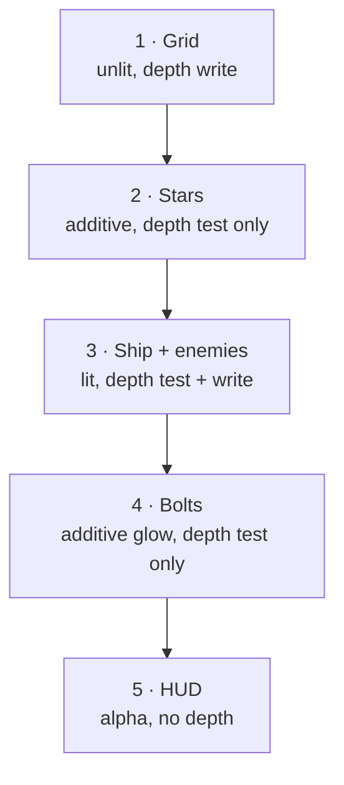

# 06.B · The renderer 🛠️

> **You'll leave this chapter with:** a working Metal renderer and **a ship on
> your screen**. This is the payoff for chapters 02–06.A.
>
> **Files created:** `Sources/SpaceFighter/Render/Renderer.swift`, and a real
> `main.swift`

06.A wrote the programs that run on the GPU. This chapter writes the Swift that
compiles them, feeds them geometry, and drives a frame.

A warning about shape: `Renderer` is the largest type in the project, and Swift
requires every `let` property to be assigned in `init`. That means the class
**will not compile until we finish `init`**, about halfway through the chapter.
We build it in passes anyway, because the alternative is a 130-line paste with no
explanation of why any line is there.

---

## The seam we're building

The renderer's entire input will be one dictionary:

```swift
[MeshID: [InstanceData]]    // for each mesh, the list of copies to draw
```

That's the whole interface between gameplay and rendering. The renderer never
sees an entity; gameplay never sees Metal. Chapter 07 fills this from the ECS;
today we hand-build one entry so there's something to look at.

Start the file with two small pieces that don't depend on anything.

**`Sources/SpaceFighter/Render/Renderer.swift`** — new file:

```swift
import Metal
import MetalKit
import simd

/// Extra per-draw parameters for the star field. Private to the renderer, which
/// is why it has no twin in RenderTypes.swift.
private struct StarParams {
    var span: Float
    var pointSize: Float
}
```

That's the Swift half of the `StarParams` you declared in MSL last chapter.

---

## Blend modes: how a new colour meets an old one

When a fragment survives the depth test, the GPU combines it with whatever is
already in the colour buffer. *How* it combines them is fixed per pipeline, so
it's a decision you make once, up front — and it's the difference between a
bullet that glows and a bullet that looks like a plastic brick.

Three presets cover everything we draw.

**`Renderer.swift`** — after `StarParams`:

```diff
 private struct StarParams {
     var span: Float
     var pointSize: Float
 }
+
+/// Colour-attachment blend presets.
+private enum BlendMode {
+    case opaque    // replace destination
+    case additive  // src + dst — glows and light-on-dark line art
+    case alpha     // standard transparency for the HUD
+
+    func apply(to attachment: MTLRenderPipelineColorAttachmentDescriptor?) {
+        guard let a = attachment else { return }
+        switch self {
+        case .opaque:
+            a.isBlendingEnabled = false
+        }
+    }
+}
```

`opaque` is the simplest: blending off, the new colour replaces the old one
entirely. That's what solid geometry wants — the ship should hide what's behind
it, not tint it.

The switch is incomplete, so this won't build yet. Fill in the second case:

**`Renderer.swift`**, in `BlendMode.apply` — after the `.opaque` case:

```diff
         case .opaque:
             a.isBlendingEnabled = false
+        case .additive:
+            a.isBlendingEnabled = true
+            a.rgbBlendOperation = .add
+            a.alphaBlendOperation = .add
+            a.sourceRGBBlendFactor = .sourceAlpha
+            a.sourceAlphaBlendFactor = .one
+            a.destinationRGBBlendFactor = .one
+            a.destinationAlphaBlendFactor = .one
         }
```

**Additive** is `source + destination`: the new colour is *added* to what's
there. Nothing ever gets darker, and two overlapping bright things get brighter
than either alone. That is exactly what light does, which is why this mode is
how you draw glows, sparks, stars and neon on a dark background — no texture, no
bloom pass, just arithmetic. It's also why our bolts will look hot rather than
painted on.

**`Renderer.swift`**, in `BlendMode.apply` — after the `.additive` case:

```diff
             a.destinationRGBBlendFactor = .one
             a.destinationAlphaBlendFactor = .one
+        case .alpha:
+            a.isBlendingEnabled = true
+            a.rgbBlendOperation = .add
+            a.alphaBlendOperation = .add
+            a.sourceRGBBlendFactor = .sourceAlpha
+            a.sourceAlphaBlendFactor = .sourceAlpha
+            a.destinationRGBBlendFactor = .oneMinusSourceAlpha
+            a.destinationAlphaBlendFactor = .oneMinusSourceAlpha
         }
```

**Alpha** is ordinary transparency: `src·α + dst·(1−α)`, a weighted average. A
50%-alpha panel shows half of what's behind it. That's the HUD in chapter 11, and
it's the only one of the three where **draw order matters**, because averaging
isn't commutative the way addition is.

---

## The class, and its properties

Now the renderer itself. Everything here is created once and reused for the life
of the program — that's the split chapter 02 drew.

**`Renderer.swift`** — after `BlendMode`:

```diff
             a.destinationAlphaBlendFactor = .oneMinusSourceAlpha
         }
     }
 }
+
+final class Renderer {
+
+    // MARK: Tunables
+    static let starSpan: Float = 480      // side length of the star tiling cube
+    static let gridSpacing: Float = 6     // world units between grid lines
+    static let groundY: Float = -8        // altitude of the reference grid
+
+    let device: MTLDevice
+    private let queue: MTLCommandQueue
+}
```

`device` is the GPU; `queue` is the ordered pipe we submit frames to. One of
each, forever — creating a command queue per frame is a classic and expensive
beginner mistake.

The three tunables are `static` because chapter 07's `Game` will need
`gridSpacing` and `groundY` too, and it's better to have one source of truth than
two constants that quietly drift apart.

**`Renderer.swift`**, in `Renderer` — after the `queue` property:

```diff
     let device: MTLDevice
     private let queue: MTLCommandQueue
+
+    // Pipelines, one per shading style.
+    private let litPipeline: MTLRenderPipelineState
+    private let unlitPipeline: MTLRenderPipelineState
+    private let starPipeline: MTLRenderPipelineState
+    private let hudPipeline: MTLRenderPipelineState
+
+    // Depth/stencil states.
+    private let solidDepth: MTLDepthStencilState   // test + write (opaque)
+    private let readDepth: MTLDepthStencilState    // test, no write (glows)
+    private let noDepth: MTLDepthStencilState      // no test/write (HUD)
 }
```

Four pipelines, matching the four shader pairs from 06.A. A pipeline state is an
immutable, pre-compiled bundle of "which shaders, what pixel format, what
blending" — the GPU can't afford to re-derive that per triangle, so you bake it
once and switch between baked objects at draw time.

Three depth states, matching the three policies from chapter 02: test-and-write
for solids, test-but-don't-write for glows, and ignore-depth for the HUD.

Meshes need one more type, because a `Mesh` from chapter 05 is CPU-side and the
GPU needs buffers:

**`Renderer.swift`**, in `Renderer` — after the depth properties:

```diff
     private let noDepth: MTLDepthStencilState      // no test/write (HUD)
+
+    // GPU meshes.
+    private struct GPUMesh {
+        var vertexBuffer: MTLBuffer
+        var indexBuffer: MTLBuffer?
+        var indexCount: Int
+        var vertexCount: Int
+        var primitive: MTLPrimitiveType
+    }
+    private var meshes: [MeshID: GPUMesh] = [:]
+    private let starMesh: GPUMesh
+    private let gridMesh: GPUMesh
 }
```

`indexBuffer` is optional, mirroring chapter 05's decision that points and lines
draw non-indexed. The star and grid meshes get their own properties rather than
living in the dictionary, because they're not addressable by `MeshID` — gameplay
never asks for them; the renderer draws them on its own initiative.

---

## Building it all: `init`

Four passes. The class starts compiling again at the end of the fourth.

**`Renderer.swift`**, in `Renderer` — after the `gridMesh` property:

```diff
     private let starMesh: GPUMesh
     private let gridMesh: GPUMesh
+
+    init?(view: MTKView) {
+        guard let device = view.device ?? MTLCreateSystemDefaultDevice(),
+              let queue = device.makeCommandQueue() else {
+            return nil
+        }
+        self.device = device
+        self.queue = queue
+
+        view.device = device
+        view.colorPixelFormat = .bgra8Unorm
+        view.depthStencilPixelFormat = .depth32Float
+        view.clearColor = MTLClearColorMake(0.02, 0.02, 0.06, 1.0)
+    }
 }
```

A **failable** initializer, because every step here can genuinely fail on a
machine without a Metal device or with a broken shader, and a renderer that half
exists is worse than none.

Those four `view.` lines matter more than they look. Setting
`depthStencilPixelFormat` is what makes MetalKit create and manage a depth
texture for us — without it, `currentRenderPassDescriptor` arrives with no depth
attachment and every depth state you set is silently ignored, which presents as
"my geometry draws in the wrong order and I can't see why". The clear colour is
near-black with a blue lift, so space isn't pure `#000`.

Next, compile the shaders and bake the pipelines:

**`Renderer.swift`**, in `init` — after the `view.clearColor` line:

```diff
         view.clearColor = MTLClearColorMake(0.02, 0.02, 0.06, 1.0)
+
+        // Compile all shaders in one library.
+        let library: MTLLibrary
+        do {
+            library = try device.makeLibrary(source: Shaders.source, options: nil)
+        } catch {
+            print("Shader compilation failed: \(error)")
+            return nil
+        }
+
+        func pipeline(_ vfn: String, _ ffn: String, blend: BlendMode) -> MTLRenderPipelineState? {
+            let d = MTLRenderPipelineDescriptor()
+            d.vertexFunction = library.makeFunction(name: vfn)
+            d.fragmentFunction = library.makeFunction(name: ffn)
+            d.colorAttachments[0].pixelFormat = view.colorPixelFormat
+            d.depthAttachmentPixelFormat = view.depthStencilPixelFormat
+            blend.apply(to: d.colorAttachments[0])
+            return try? device.makeRenderPipelineState(descriptor: d)
+        }
     }
```

`makeLibrary(source:)` is where 06.A's string becomes GPU code. **Print that
error and read it** — Metal reports the exact MSL line and column, and it is the
single most useful diagnostic in this project.

The nested `pipeline` function exists because we're about to do the same six-step
dance four times. Note it captures `library` and `view`, which is why it lives
inside `init` rather than being a method: at method scope those wouldn't be
available yet.

**`Renderer.swift`**, in `init` — after the nested `pipeline` function:

```diff
             return try? device.makeRenderPipelineState(descriptor: d)
         }
+
+        guard let lit = pipeline("lit_vertex", "lit_fragment", blend: .opaque),
+              let unlit = pipeline("unlit_vertex", "unlit_fragment", blend: .additive),
+              let star = pipeline("star_vertex", "star_fragment", blend: .additive),
+              let hud = pipeline("hud_vertex", "hud_fragment", blend: .alpha) else {
+            print("Pipeline creation failed")
+            return nil
+        }
+        litPipeline = lit
+        unlitPipeline = unlit
+        starPipeline = star
+        hudPipeline = hud
     }
```

There is the whole materials table in four lines: the ship and enemies opaque,
the grid and bolts additive, the HUD alpha-blended. Every shader-name string here
must match a function name in 06.A exactly — `makeFunction(name:)` returns `nil`
for a typo, and you'll get "Pipeline creation failed" with no further clue.

Depth states are three more one-liners:

**`Renderer.swift`**, in `init` — after `hudPipeline = hud`:

```diff
         starPipeline = star
         hudPipeline = hud
+
+        func depth(test: Bool, write: Bool) -> MTLDepthStencilState {
+            let d = MTLDepthStencilDescriptor()
+            d.depthCompareFunction = test ? .less : .always
+            d.isDepthWriteEnabled = write
+            return device.makeDepthStencilState(descriptor: d)!
+        }
+        solidDepth = depth(test: true, write: true)
+        readDepth = depth(test: true, write: false)
+        noDepth = depth(test: false, write: false)
     }
```

`depthCompareFunction = .always` with writes off is how you say "ignore depth
entirely" — there's no separate switch for it.

Last pass: get the geometry onto the GPU.

**`Renderer.swift`**, in `init` — after the `noDepth` assignment:

```diff
         noDepth = depth(test: false, write: false)
+
+        // Upload every mesh once, up front.
+        func upload(_ mesh: Mesh) -> GPUMesh {
+            let vbuf = device.makeBuffer(bytes: mesh.vertices,
+                                         length: mesh.vertices.count * MemoryLayout<Vertex>.stride,
+                                         options: .storageModeShared)!
+            var ibuf: MTLBuffer?
+            if !mesh.indices.isEmpty {
+                ibuf = device.makeBuffer(bytes: mesh.indices,
+                                         length: mesh.indices.count * MemoryLayout<UInt16>.stride,
+                                         options: .storageModeShared)
+            }
+            return GPUMesh(vertexBuffer: vbuf,
+                           indexBuffer: ibuf,
+                           indexCount: mesh.indices.count,
+                           vertexCount: mesh.vertices.count,
+                           primitive: Renderer.metalPrimitive(mesh.primitive))
+        }
     }
```

`MemoryLayout<Vertex>.stride` — **stride, not `size`**. Size is how many bytes
the fields occupy; stride is how far apart consecutive elements sit in an array,
including any padding. For `Vertex` they differ, because of chapter 05's
`float3` alignment rule, and using `size` here hands the GPU a buffer that's too
short and reads past the end of it.

`.storageModeShared` puts the buffer in memory both processors can see, which on
Apple silicon's unified memory is free.

**`Renderer.swift`**, in `init` — after the nested `upload` function:

```diff
                            primitive: Renderer.metalPrimitive(mesh.primitive))
         }
+
+        meshes[.ship] = upload(MeshLibrary.ship())
+        meshes[.enemy] = upload(MeshLibrary.enemy())
+        meshes[.projectile] = upload(MeshLibrary.projectile())
+        starMesh = upload(MeshLibrary.starfield(count: 2600, span: Renderer.starSpan))
+        gridMesh = upload(MeshLibrary.grid(halfExtent: 240, spacing: Renderer.gridSpacing))
     }
```

Five uploads, once, at startup. From here the per-frame cost of drawing a ship is
a matrix — never a mesh.

One tiny translation function and `init` is behind us:

**`Renderer.swift`**, in `Renderer` — after `init`:

```diff
         gridMesh = upload(MeshLibrary.grid(halfExtent: 240, spacing: Renderer.gridSpacing))
     }
+
+    private static func metalPrimitive(_ p: Primitive) -> MTLPrimitiveType {
+        switch p {
+        case .triangle: return .triangle
+        case .line:     return .line
+        case .point:    return .point
+        }
+    }
 }
```

It's boilerplate, but it's *load-bearing* boilerplate: it's the only place that
knows our `Primitive` and Metal's `MTLPrimitiveType` are related, which is what
keeps `Mesh.swift` free of any Metal import.

---

## One frame

Now the per-frame half. Everything below is created fresh every time.

**`Renderer.swift`**, in `Renderer` — after `metalPrimitive`:

```diff
         case .point:    return .point
         }
     }
+
+    func render(in view: MTKView,
+                frame: FrameUniforms,
+                instances: [MeshID: [InstanceData]],
+                playerPosition: Vec3,
+                hud: [HUDVertex]) {
+        guard let rpd = view.currentRenderPassDescriptor,
+              let drawable = view.currentDrawable,
+              let command = queue.makeCommandBuffer(),
+              let encoder = command.makeRenderCommandEncoder(descriptor: rpd) else {
+            return
+        }
+    }
 }
```

The four `guard` bindings are
chapter 02's per-frame cast: a place to draw into, the texture that will be
shown, a buffer to record commands in, and the encoder that records them.
Returning early when any is `nil` is normal, not exceptional — MetalKit legitimately
has no drawable available sometimes, and skipping that frame is the correct
response.

Closing the frame gives us something that runs and draws nothing:

**`Renderer.swift`**, in `render` — after the `guard`:

```diff
             return
         }
+
+        var frame = frame
+        encoder.setCullMode(.none)
+
+        encoder.endEncoding()
+        command.present(drawable)
+        command.commit()
     }
```

`var frame = frame` shadows the parameter so we can pass it `inout` to the pass
methods; they need a mutable reference to hand to `setVertexBytes`.

We switch culling **off** entirely. Normally you'd discard triangles facing away
from the camera as a free optimisation, but chapter 05's self-correcting normals
mean our winding order is deliberately unreliable, and lines and points have no
facing at all. Correctness over a micro-optimisation at this scale.

Now the passes, in the order they must run:

**`Renderer.swift`**, in `render` — between `setCullMode` and `endEncoding`:

```diff
         encoder.setCullMode(.none)
 
+        drawGrid(encoder, frame: &frame, playerPosition: playerPosition)
+        drawStars(encoder, frame: &frame)
+        drawLitActors(encoder, frame: &frame, instances: instances)
+        drawProjectiles(encoder, frame: &frame, instances: instances)
+        drawHUD(encoder, hud)
+
         encoder.endEncoding()
```

That order is a real rendering decision, not an arbitrary sequence:



The grid writes depth first, laying down a floor. Stars test against it — so ones
below the horizon are hidden — but don't write, because a star must never occlude
a ship drawn later. Solids both test and write, which is what makes near ships
hide far ones with no sorting on our part. Bolts test but don't write, so a bolt
in front of the hull brightens it instead of punching a hole in the depth buffer.
The HUD ignores depth completely.

---

## The five passes

**`Renderer.swift`**, in `Renderer` — after `render`:

```diff
         command.present(drawable)
         command.commit()
     }
+
+    private func drawGrid(_ enc: MTLRenderCommandEncoder, frame: inout FrameUniforms, playerPosition: Vec3) {
+        let s = Renderer.gridSpacing
+        let gx = (playerPosition.x / s).rounded() * s
+        let gz = (playerPosition.z / s).rounded() * s
+        let model = Math.translation(Vec3(gx, Renderer.groundY, gz))
+        let instance = [InstanceData(model: model, color: Vec4(0.10, 0.35, 0.45, 1))]
+
+        enc.setRenderPipelineState(unlitPipeline)
+        enc.setDepthStencilState(solidDepth)
+        enc.setVertexBytes(&frame, length: MemoryLayout<FrameUniforms>.stride, index: 2)
+        drawMesh(enc, gridMesh, instances: instance)
+    }
 }
```

This is chapter 05's promise being kept. The grid is a finite patch, but we slide
it under the player *and* **snap it to whole cells** with `.rounded() * s`. Snapping
is the entire trick: the pattern only ever jumps by exactly one cell, which is
invisible because every cell looks identical. Drop the rounding and the lines
crawl continuously under you, which reads instantly as fake.

`setVertexBytes` is how small, per-frame constants get to the GPU without a
managed buffer — Metal copies the bytes into the command buffer for you. It's
capped around 4 KB; `FrameUniforms` is 96 bytes.

**`Renderer.swift`**, in `Renderer` — after `drawGrid`:

```diff
         drawMesh(enc, gridMesh, instances: instance)
     }
+
+    private func drawStars(_ enc: MTLRenderCommandEncoder, frame: inout FrameUniforms) {
+        enc.setRenderPipelineState(starPipeline)
+        enc.setDepthStencilState(readDepth)
+        enc.setVertexBytes(&frame, length: MemoryLayout<FrameUniforms>.stride, index: 2)
+        var params = StarParams(span: Renderer.starSpan, pointSize: 2.0)
+        enc.setVertexBytes(&params, length: MemoryLayout<StarParams>.stride, index: 3)
+        let instance = [InstanceData(model: Math.identity, color: Vec4(1, 1, 1, 1))]
+        drawMesh(enc, starMesh, instances: instance)
+    }
 }
```

`span` here must be the same `starSpan` the mesh was generated with, or the
wrap-around in 06.A's star shader tiles at the wrong size and you get visible
seams or duplicated stars. That's why it's a `static let` and not two literals.

**`Renderer.swift`**, in `Renderer` — after `drawStars`:

```diff
         drawMesh(enc, starMesh, instances: instance)
     }
+
+    private func drawLitActors(_ enc: MTLRenderCommandEncoder, frame: inout FrameUniforms, instances: [MeshID: [InstanceData]]) {
+        enc.setRenderPipelineState(litPipeline)
+        enc.setDepthStencilState(solidDepth)
+        enc.setVertexBytes(&frame, length: MemoryLayout<FrameUniforms>.stride, index: 2)
+        enc.setFragmentBytes(&frame, length: MemoryLayout<FrameUniforms>.stride, index: 0)
+        for id in [MeshID.ship, .enemy] {
+            guard let list = instances[id], !list.isEmpty, let mesh = meshes[id] else { continue }
+            drawMesh(enc, mesh, instances: list)
+        }
+    }
 }
```

Note `FrameUniforms` bound **twice** — vertex slot 2 and fragment slot 0. That's
06.A's "separate binding tables per stage" made concrete: the lit fragment shader
needs `lightDirection`, and the vertex stage's bindings are invisible to it.

**`Renderer.swift`**, in `Renderer` — after `drawLitActors`:

```diff
             drawMesh(enc, mesh, instances: list)
         }
     }
+
+    private func drawProjectiles(_ enc: MTLRenderCommandEncoder, frame: inout FrameUniforms, instances: [MeshID: [InstanceData]]) {
+        guard let list = instances[.projectile], !list.isEmpty, let mesh = meshes[.projectile] else { return }
+        enc.setRenderPipelineState(unlitPipeline)
+        enc.setDepthStencilState(readDepth)          // glows don't occlude
+        enc.setVertexBytes(&frame, length: MemoryLayout<FrameUniforms>.stride, index: 2)
+        drawMesh(enc, mesh, instances: list)
+    }
 }
```

Bolts use the *same* mesh and the *same* unlit pipeline as the grid — the only
difference is the depth state and the colour.

**`Renderer.swift`**, in `Renderer` — after `drawProjectiles`:

```diff
         enc.setVertexBytes(&frame, length: MemoryLayout<FrameUniforms>.stride, index: 2)
         drawMesh(enc, mesh, instances: list)
     }
+
+    private func drawHUD(_ enc: MTLRenderCommandEncoder, _ hud: [HUDVertex]) {
+        guard !hud.isEmpty else { return }
+        enc.setRenderPipelineState(hudPipeline)
+        enc.setDepthStencilState(noDepth)
+        let buffer = device.makeBuffer(bytes: hud,
+                                       length: hud.count * MemoryLayout<HUDVertex>.stride,
+                                       options: .storageModeShared)!
+        enc.setVertexBuffer(buffer, offset: 0, index: 0)
+        enc.drawPrimitives(type: .triangle, vertexStart: 0, vertexCount: hud.count)
+    }
 }
```

`drawHUD` early-returns on an empty array, which is what lets chapter 07 pass
`[]` and add the real HUD in chapter 11 with a one-line change.

---

## Instancing: one draw call, many ships

The last method is the one that makes the whole design worthwhile.

**`Renderer.swift`**, in `Renderer` — after `drawHUD`:

```diff
         enc.drawPrimitives(type: .triangle, vertexStart: 0, vertexCount: hud.count)
     }
+
+    private func drawMesh(_ enc: MTLRenderCommandEncoder, _ mesh: GPUMesh, instances: [InstanceData]) {
+        let instanceBuffer = device.makeBuffer(bytes: instances,
+                                               length: instances.count * MemoryLayout<InstanceData>.stride,
+                                               options: .storageModeShared)!
+        enc.setVertexBuffer(mesh.vertexBuffer, offset: 0, index: 0)
+        enc.setVertexBuffer(instanceBuffer, offset: 0, index: 1)
+    }
 }
```

Those two `setVertexBuffer` calls are the whole idea. Twenty enemies share one
octahedron. Naively that's twenty draw calls, each
rebinding the same vertices. Instead we bind the geometry once at slot 0, bind an
*array* of per-entity data at slot 1, and issue **one** call with
`instanceCount: 20`. The GPU runs the vertex shader `vertexCount × instanceCount`
times, and `[[instance_id]]` tells each run which transform and colour to use.

This is why `RenderSystem` in chapter 07 buckets entities by mesh: those buckets
exist precisely to become these calls. It's also how bullet-hell games draw
thousands of sprites at 120 fps.

The draw call itself just has to pick a form, because chapter 05 left some meshes
without indices:

**`Renderer.swift`**, in `drawMesh` — after the second `setVertexBuffer`:

```diff
         enc.setVertexBuffer(instanceBuffer, offset: 0, index: 1)
+
+        if let indexBuffer = mesh.indexBuffer {
+            enc.drawIndexedPrimitives(type: mesh.primitive,
+                                      indexCount: mesh.indexCount,
+                                      indexType: .uint16,
+                                      indexBuffer: indexBuffer,
+                                      indexBufferOffset: 0,
+                                      instanceCount: instances.count)
+        } else {
+            enc.drawPrimitives(type: mesh.primitive,
+                               vertexStart: 0,
+                               vertexCount: mesh.vertexCount,
+                               instanceCount: instances.count)
+        }
     }
```

Both branches pass `instanceCount`, which is the parameter doing the work; drop
it (or pass 1) and you get exactly one enemy no matter how many you spawned.

One honest caveat: we allocate a fresh instance buffer on **every draw, every
frame**. That's a per-frame heap allocation in the hot path, and it's the first
thing you'd fix if profiling said to — a shipping renderer cycles through two or
three pre-sized buffers with a semaphore, so the CPU can build frame N+1 while
the GPU still reads frame N. At our entity counts it doesn't register. Chapter 12
returns to it.

---

## A window to draw in

The renderer is done. Now something has to own a window and call it.

**`main.swift`** — replace the whole file:

```swift
import AppKit
import Metal
import MetalKit
import simd

guard let device = MTLCreateSystemDefaultDevice() else {
    fatalError("No Metal-capable GPU found. This project requires a Mac that supports Metal.")
}

let app = NSApplication.shared
app.setActivationPolicy(.regular)

let mainMenu = NSMenu()
let appItem = NSMenuItem()
mainMenu.addItem(appItem)
let appMenu = NSMenu()
appMenu.addItem(withTitle: "Quit Space Fighter",
                action: #selector(NSApplication.terminate(_:)),
                keyEquivalent: "q")
appItem.submenu = appMenu
app.mainMenu = mainMenu
```

No storyboard and no app delegate — a SwiftPM executable runs the top-level code
in `main.swift`, so we assemble the application by hand. `setActivationPolicy(.regular)`
is what gives the process a Dock icon and lets it take keyboard focus; without it
you get a window that can't be clicked into. The menu exists so `⌘Q` works.

**`main.swift`** — after `app.mainMenu = mainMenu`:

```diff
 appItem.submenu = appMenu
 app.mainMenu = mainMenu
+
+let contentRect = NSRect(x: 0, y: 0, width: 1280, height: 720)
+let window = NSWindow(contentRect: contentRect,
+                      styleMask: [.titled, .closable, .resizable, .miniaturizable],
+                      backing: .buffered,
+                      defer: false)
+window.title = "Space Fighter"
+window.center()
+
+let mtkView = MTKView(frame: contentRect, device: device)
+mtkView.preferredFramesPerSecond = 60
+window.contentView = mtkView
+
+guard let renderer = Renderer(view: mtkView) else {
+    fatalError("Failed to initialise the Metal renderer (see console for shader/pipeline errors).")
+}
```

`MTKView` is the piece doing the real work: it owns the layer that vends
drawables, and it will call a delegate at `preferredFramesPerSecond`. Chapter 07
supplies the real delegate. For now, a temporary one so this chapter has a
picture:

**`main.swift`** — after the `renderer` guard. This is throwaway scaffolding;
chapter 07 deletes the whole class:

```diff
 guard let renderer = Renderer(view: mtkView) else {
     fatalError("Failed to initialise the Metal renderer (see console for shader/pipeline errors).")
 }
+
+final class StaticPreview: NSObject, MTKViewDelegate {
+    private let renderer: Renderer
+    init(renderer: Renderer) { self.renderer = renderer }
+
+    func mtkView(_ view: MTKView, drawableSizeWillChange size: CGSize) {}
+
+    func draw(in view: MTKView) {
+        let aspect = Float(view.drawableSize.width / max(view.drawableSize.height, 1))
+        let eye = Vec3(0, 3, 12)
+        let view4 = Math.lookAt(eye: eye, center: Vec3(0, 0, 0), up: Vec3(0, 1, 0))
+        let projection = Math.perspective(fovyRadians: 65.radians, aspect: aspect,
+                                          near: 0.1, far: 1200)
+        let frame = FrameUniforms(viewProjection: projection * view4,
+                                  cameraPosition: eye,
+                                  lightDirection: simd_normalize(Vec3(-0.3, -1.0, -0.55)))
+        let instances: [MeshID: [InstanceData]] = [
+            .ship: [InstanceData(model: Math.identity, color: Vec4(0.82, 0.9, 1.0, 1))]
+        ]
+        renderer.render(in: view, frame: frame, instances: instances,
+                        playerPosition: .zero, hud: [])
+    }
+}
+
+let preview = StaticPreview(renderer: renderer)
+mtkView.delegate = preview
+
+window.makeKeyAndOrderFront(nil)
+app.activate(ignoringOtherApps: true)
+
+_ = preview
+app.run()
```

That `instances` literal is the dictionary from the top of the chapter, built by
hand: one ship, at the origin, in pale blue. Chapter 07 replaces it with the
output of a real ECS query and nothing in `Renderer` changes — which is the seam
working.

`_ = preview` is not decoration. `MTKView.delegate` is a **weak** reference, so
without a strong one here the delegate would be deallocated immediately and you'd
get a window that renders exactly nothing.

---

## Checkpoint

```console
$ swift run
```

A 1280×720 window opens on near-black. You should see:

- a pale, faceted **ship** at the centre, its four faces in clearly different
  shades because the light hits them at different angles,
- a faint cyan **grid** receding to a horizon below it, and
- a scattering of **stars**.

That is the entire rendering stack: geometry generated in chapter 05, uploaded to
GPU buffers, transformed by chapter 03's matrices, shaded by 06.A's MSL, and
composited with three blend modes and three depth policies.

Diagnosing what you actually got:

- **Black window, console errors** — MSL didn't compile. The message names the
  line; check it against 06.A.
- **Black window, "Pipeline creation failed"** — a shader function name in
  `init` doesn't match one in the MSL string. Compare them character by
  character.
- **A flat silhouette with no shading** — normals aren't reaching the fragment
  shader. Check that `Vertex` in `RenderTypes.swift` and `struct Vertex` in the
  MSL declare their fields in the same order.
- **Geometry smeared into noise** — the two sides disagree on struct layout.
  That's the `float3` alignment trap from chapter 05, or `size` where you needed
  `stride`.
- **Ship visible but the grid draws over it** — your depth states are swapped, or
  `depthStencilPixelFormat` was never set on the view.

Before moving on, break one thing on purpose: change `.opaque` to `.additive` for
the lit pipeline and re-run. The ship turns into a translucent glowing shape,
because additive blending never darkens. Change it back. You now know what each
blend mode looks like rather than what it's called.

---

## Challenge

The ship sits at the origin and never moves, which makes the depth buffer easy.
Draw a *second* ship behind the first by adding another `InstanceData` to the
array with a `Math.translation(Vec3(0, 0, -6))` model matrix. Two questions worth
answering: how many draw calls did that cost, and how would you find out? Then
give the second ship a different colour and confirm which one occludes the other
— and predict, before you run it, what changes if you swap `solidDepth` for
`readDepth` in `drawLitActors`.

---

**Next:** replace the hand-built instance with a real ECS and a real frame loop.
→ [Chapter 07: The game loop & timing](07-the-game-loop.md)
