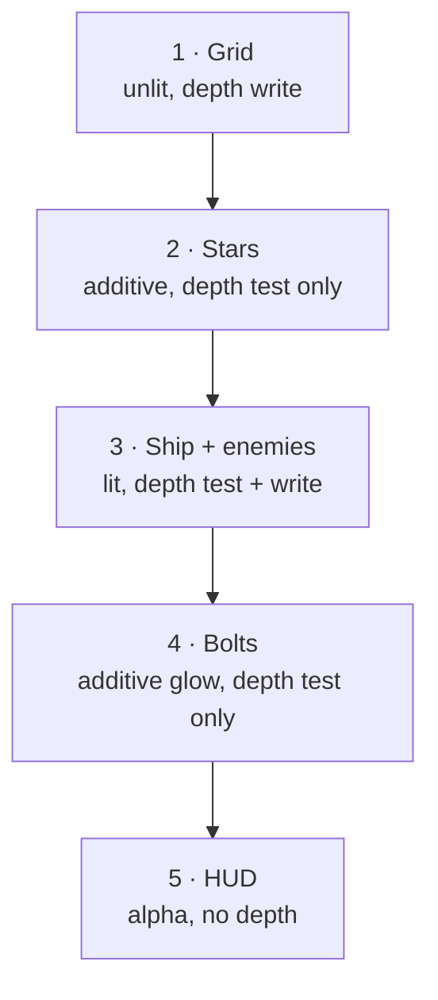

# 08 · The renderer 🛠️

> **You'll leave this chapter with:** a working Metal renderer and **a ship on
> your screen**. This is the payoff for chapters 03–07.
>
> **Files created:** `Sources/SpaceFighter/Render/RHI/Device.swift`,
> `Sources/SpaceFighter/Render/RHI/Buffers.swift`,
> `Sources/SpaceFighter/Render/RHI/Pipelines.swift`,
> `Sources/SpaceFighter/Render/MeshRegistry.swift`,
> `Sources/SpaceFighter/Render/Renderer.swift`, and a real `main.swift`

07 wrote the programs that run on the GPU. This chapter writes the Swift that
compiles them, feeds them geometry, and drives a frame.

It arrives in five files rather than one, and the split is the same one every
graphics engine draws. **`RHI/`** — Render Hardware Interface, Unreal's name for
it — is the part that knows Metal exists: making a device, baking a pipeline
state, filling a buffer. **`Renderer.swift`** is the part that knows what a frame
looks like: which passes run, in what order, with which state. The first is about
the machine; the second is about the picture.

There's a practical payoff too. Swift requires every `let` property to be
assigned before `init` returns, so a single 300-line `Renderer` **would not
compile until `init` was finished** — you'd write half a chapter of code with a
red build the whole way. Split up, each piece compiles and can be reasoned about
on its own, and `Renderer.init` shrinks to about ten lines of assembly.

---

## The seam we're building

The renderer's entire input will be one dictionary:

```swift
[MeshID: [InstanceData]]    // for each mesh, the list of copies to draw
```

That's the whole interface between gameplay and rendering. The renderer never
sees an entity; gameplay never sees Metal. Chapter 09 fills this from the ECS;
today we hand-build one entry so there's something to look at.

Almost the whole interface. The last pass of the frame draws a 2D overlay, and it
needs a vertex type of its own — no normal, no matrix, positions already in clip
space. It's a GPU contract struct like the ones in chapter 06, so it lives beside
them:

**`Sources/SpaceFighter/Render/Types/HUDVertex.swift`** — new file:

```swift
import simd

/// A 2D vertex for the HUD, positioned directly in normalised device
/// coordinates. Its layout must match `HUDVertex` in `hud.metal`.
struct HUDVertex {
    var position: SIMD2<Float>
    var color: Vec4
}
```

It gets its own file rather than joining `GPUContract.swift`, because the three
structs in there describe *geometry in a scene* and this one describes paint on
the glass. They share chapter 06's alignment rule and nothing else.

Chapter 13 is where the HUD gets built and this type gets interesting. It's
declared here because `render` is about to take an array of them, and a signature
that mentions a type the project doesn't have yet is how you get a chapter that
doesn't compile.

Everything below builds toward one method that consumes it.

---

## The device, and the view it draws into

Two objects exist once for the life of the program: the GPU itself, and the
ordered pipe we submit work to.

**`Sources/SpaceFighter/Render/RHI/Device.swift`** — new file:

```swift
import Metal
import MetalKit

/// The GPU, the command queue, and the view settings everything else assumes.
@MainActor
struct RHIDevice {
    let device: MTLDevice
    let queue: MTLCommandQueue

    init?(view: MTKView) {
        guard let device = view.device ?? MTLCreateSystemDefaultDevice(),
              let queue = device.makeCommandQueue() else {
            return nil
        }
        self.device = device
        self.queue = queue

        view.device = device
        view.colorPixelFormat = .bgra8Unorm
        view.depthStencilPixelFormat = .depth32Float
        view.clearColor = MTLClearColorMake(0.02, 0.02, 0.06, 1.0)
    }
}
```

One device and one queue, forever — creating a command queue per frame is a
classic and expensive beginner mistake.

The initializer is **failable** because a machine without a Metal device is a
real thing, and a renderer that half exists is worse than none. This is the first
of three failable initializers in the chapter; each one guards a step that can
genuinely fail on someone else's hardware.

### `@MainActor`, once, up front

`MTKView` is a view, and in Swift 6 every AppKit view is isolated to the main
actor — touching `view.colorPixelFormat` from anywhere else is a data race the
compiler now knows about. Leave the annotation off and this project builds with
about ten warnings like:

```
warning: main actor-isolated property 'colorPixelFormat' can not be
         referenced from a nonisolated context
```

They're warnings today and errors under stricter settings, so we take the
annotation now rather than learn to read past them.

Three types touch `MTKView` — `RHIDevice`, `Pipelines` and `Renderer` — and all
three get `@MainActor`. That isn't a workaround; it's true. Every one of them
runs from `MTKViewDelegate.draw(in:)`, which the SDK already isolates to the main
actor, so marking them costs nothing at the call site and the coordinator in
chapter 09 needs no annotation of its own.

Nothing else in the project gets it. The ECS, the systems, the mesh generators
and `MeshRegistry` never see a view, so they stay free of the main actor and
could move to a background thread later without a fight — which is the useful
half of Swift's concurrency model doing its job.

Those four `view.` lines matter more than they look. Setting
`depthStencilPixelFormat` is what makes MetalKit create and manage a depth
texture for us — without it, `currentRenderPassDescriptor` arrives with no depth
attachment and every depth state you set is silently ignored, which presents as
"my geometry draws in the wrong order and I can't see why". The clear colour is
near-black with a blue lift, so space isn't pure `#000`.

---

## Meshes, uploaded

A `Mesh` from chapter 06 is CPU-side arrays. The GPU needs buffers, so this file
does the translation and nothing else.

**`Sources/SpaceFighter/Render/RHI/Buffers.swift`** — new file:

```swift
import Metal

/// A `Mesh` after upload: the same geometry, now in GPU memory.
struct GPUMesh {
    var vertexBuffer: MTLBuffer
    var indexBuffer: MTLBuffer?
    var indexCount: Int
    var vertexCount: Int
    var primitive: MTLPrimitiveType
}

/// The only place that knows our `Primitive` and Metal's are related — which is
/// what keeps `Render/Types/Mesh.swift` free of any Metal import.
private func metalPrimitive(_ p: Primitive) -> MTLPrimitiveType {
    switch p {
    case .triangle: return .triangle
    case .line:     return .line
    case .point:    return .point
    }
}
```

`indexBuffer` is optional, mirroring chapter 06's decision that points and lines
draw non-indexed.

Now the upload itself, as a method on `MTLDevice` so the call site reads
`device.upload(mesh)`:

**`Buffers.swift`** — after `metalPrimitive`:

```diff
     case .point:    return .point
     }
 }
+
+extension MTLDevice {
+    /// Copy a CPU mesh into GPU buffers. Called once per mesh, at startup.
+    func upload(_ mesh: Mesh) -> GPUMesh {
+        let vbuf = makeBuffer(bytes: mesh.vertices,
+                              length: mesh.vertices.count * MemoryLayout<Vertex>.stride,
+                              options: .storageModeShared)!
+        var ibuf: MTLBuffer?
+        if !mesh.indices.isEmpty {
+            ibuf = makeBuffer(bytes: mesh.indices,
+                              length: mesh.indices.count * MemoryLayout<UInt16>.stride,
+                              options: .storageModeShared)
+        }
+        return GPUMesh(vertexBuffer: vbuf,
+                       indexBuffer: ibuf,
+                       indexCount: mesh.indices.count,
+                       vertexCount: mesh.vertices.count,
+                       primitive: metalPrimitive(mesh.primitive))
+    }
+}
```

`MemoryLayout<Vertex>.stride` — **stride, not `size`**. Size is how many bytes
the fields occupy; stride is how far apart consecutive elements sit in an array,
including any padding. For `Vertex` they differ, because of chapter 06's
`float3` alignment rule, and using `size` here hands the GPU a buffer that's too
short and reads past the end of it.

`.storageModeShared` puts the buffer in memory both processors can see, which on
Apple silicon's unified memory is free.

---

## The mesh registry

Chapter 06 built the *asset* registry — `MeshID`, and the exhaustive switch that
turns an id into geometry. This is its GPU counterpart: the same ids, mapped to
buffers.

**`Sources/SpaceFighter/Render/MeshRegistry.swift`** — new file:

```swift
import Metal

/// Every mesh in the game, uploaded once and kept for the life of the program.
struct MeshRegistry {
    private var actors: [MeshID: GPUMesh] = [:]
    private var scenery: [SceneryID: GPUMesh] = [:]

    init(device: MTLDevice) {
        for id in MeshID.allCases    { actors[id]  = device.upload(id.mesh) }
        for id in SceneryID.allCases { scenery[id] = device.upload(id.mesh) }
    }

    subscript(id: MeshID) -> GPUMesh? { actors[id] }
    subscript(id: SceneryID) -> GPUMesh? { scenery[id] }
}
```

Every mesh uploaded, once, at startup. From here the per-frame cost of drawing a
ship is a matrix — never a mesh.

Two lines do the work, and note what *isn't* in them: any mention of a ship, an
enemy or a grid. Chapter 06 put the generator on the id and made the switch
exhaustive, so this loop covers whatever `MeshID` currently holds. Adding a shape
means adding a case and the `switch` arm the compiler then demands — the renderer
is finished with the subject.

That's worth contrasting with the version that writes out one `actors[.ship] =
device.upload(ShipMesh.make())` line per shape. It reads fine and it works, but
it puts the *list of everything in the game* inside the renderer, where nothing
forces it to stay complete. A new mesh that nobody uploaded fails at draw time
with a missing dictionary key, which is a long way from the line you actually got
wrong.

Two dictionaries, because chapter 06 gave us two id types that mean different
things. `actors` is entity art, requested by gameplay through `Renderable`.
`scenery` is backdrop the renderer draws on its own initiative. Same storage,
same upload path, different callers — and the two subscripts overload on the id
type, so the compiler picks the right table and there is no way to look a
`SceneryID` up in the wrong one.

---

## Blend modes: how a new colour meets an old one

When a fragment survives the depth test, the GPU combines it with whatever is
already in the colour buffer. *How* it combines them is fixed per pipeline, so
it's a decision you make once, up front — and it's the difference between a
bullet that glows and a bullet that looks like a plastic brick.

Three presets cover everything we draw. They start the third and last `RHI/`
file, the one that bakes pipeline states.

**`Sources/SpaceFighter/Render/RHI/Pipelines.swift`** — new file:

```swift
import Metal
import MetalKit

/// Colour-attachment blend presets.
enum BlendMode {
    case opaque    // replace destination
    case additive  // src + dst — glows and light-on-dark line art
    case alpha     // standard transparency for the HUD

    func apply(to attachment: MTLRenderPipelineColorAttachmentDescriptor?) {
        guard let a = attachment else { return }
        switch self {
        case .opaque:
            a.isBlendingEnabled = false
        }
    }
}
```

`opaque` is the simplest: blending off, the new colour replaces the old one
entirely. That's what solid geometry wants — the ship should hide what's behind
it, not tint it.

The switch is incomplete, so this won't build yet. Fill in the second case:

**`Pipelines.swift`**, in `BlendMode.apply` — after the `.opaque` case:

```diff
         case .opaque:
             a.isBlendingEnabled = false
+        case .additive:
+            a.isBlendingEnabled = true
+            a.rgbBlendOperation = .add
+            a.alphaBlendOperation = .add
+            a.sourceRGBBlendFactor = .sourceAlpha
+            a.sourceAlphaBlendFactor = .one
+            a.destinationRGBBlendFactor = .one
+            a.destinationAlphaBlendFactor = .one
         }
```

**Additive** is `source + destination`: the new colour is *added* to what's
there. Nothing ever gets darker, and two overlapping bright things get brighter
than either alone. That is exactly what light does, which is why this mode is
how you draw glows, sparks, stars and neon on a dark background — no texture, no
bloom pass, just arithmetic. It's also why our bolts will look hot rather than
painted on.

**`Pipelines.swift`**, in `BlendMode.apply` — after the `.additive` case:

```diff
             a.destinationRGBBlendFactor = .one
             a.destinationAlphaBlendFactor = .one
+        case .alpha:
+            a.isBlendingEnabled = true
+            a.rgbBlendOperation = .add
+            a.alphaBlendOperation = .add
+            a.sourceRGBBlendFactor = .sourceAlpha
+            a.sourceAlphaBlendFactor = .sourceAlpha
+            a.destinationRGBBlendFactor = .oneMinusSourceAlpha
+            a.destinationAlphaBlendFactor = .oneMinusSourceAlpha
         }
```

**Alpha** is ordinary transparency: `src·α + dst·(1−α)`, a weighted average. A
50%-alpha panel shows half of what's behind it. That's the HUD in chapter 13, and
it's the only one of the three where **draw order matters**, because averaging
isn't commutative the way addition is.

---
## Baking the pipelines

A **pipeline state** is an immutable, pre-compiled bundle of "which shaders, what
pixel format, what blending". The GPU can't afford to re-derive that per
triangle, so you bake it once and switch between baked objects at draw time. We
need four, one per shader pair from 07.

Depth states are the same idea for a different question — test against the depth
buffer? write to it? — and we need three, matching the three policies from
chapter 03.

They're built together because they're built the same way, from the same
`MTKView` formats, at the same moment.

**`Pipelines.swift`** — after `BlendMode`:

```diff
             a.destinationAlphaBlendFactor = .oneMinusSourceAlpha
         }
     }
 }
+
+/// Every baked render and depth state the renderer switches between.
+@MainActor
+struct Pipelines {
+    let lit: MTLRenderPipelineState
+    let unlit: MTLRenderPipelineState
+    let star: MTLRenderPipelineState
+    let hud: MTLRenderPipelineState
+
+    let solidDepth: MTLDepthStencilState   // test + write (opaque)
+    let readDepth: MTLDepthStencilState    // test, no write (glows)
+    let noDepth: MTLDepthStencilState      // no test/write (HUD)
+}
```

Now the initializer that fills it. It takes the compiled shader library and the
view whose formats every pipeline must match:

**`Pipelines.swift`**, in `Pipelines` — after the `noDepth` property:

```diff
     let noDepth: MTLDepthStencilState      // no test/write (HUD)
+
+    init?(device: MTLDevice, view: MTKView, library: MTLLibrary) {
+        func pipeline(_ vfn: String, _ ffn: String, blend: BlendMode) -> MTLRenderPipelineState? {
+            let d = MTLRenderPipelineDescriptor()
+            d.vertexFunction = library.makeFunction(name: vfn)
+            d.fragmentFunction = library.makeFunction(name: ffn)
+            d.colorAttachments[0].pixelFormat = view.colorPixelFormat
+            d.depthAttachmentPixelFormat = view.depthStencilPixelFormat
+            blend.apply(to: d.colorAttachments[0])
+            return try? device.makeRenderPipelineState(descriptor: d)
+        }
+    }
 }
```

The nested `pipeline` function exists because we're about to do the same six-step
dance four times. It captures `library`, `device` and `view`, which is why it's
nested rather than a method.

**`Pipelines.swift`**, in `init` — after the nested `pipeline` function:

```diff
             return try? device.makeRenderPipelineState(descriptor: d)
         }
+
+        guard let lit = pipeline("lit_vertex", "lit_fragment", blend: .opaque),
+              let unlit = pipeline("unlit_vertex", "unlit_fragment", blend: .additive),
+              let star = pipeline("star_vertex", "star_fragment", blend: .additive),
+              let hud = pipeline("hud_vertex", "hud_fragment", blend: .alpha) else {
+            print("Pipeline creation failed")
+            return nil
+        }
+        self.lit = lit
+        self.unlit = unlit
+        self.star = star
+        self.hud = hud
     }
```

There is the whole materials table in four lines: the ship and enemies opaque,
the grid and bolts additive, the HUD alpha-blended. Every shader-name string here
must match a function name in 07 exactly — `makeFunction(name:)` returns `nil`
for a typo, and you'll get "Pipeline creation failed" with no further clue.

Depth states are three more one-liners:

**`Pipelines.swift`**, in `init` — after `self.hud = hud`:

```diff
         self.star = star
         self.hud = hud
+
+        func depth(test: Bool, write: Bool) -> MTLDepthStencilState {
+            let d = MTLDepthStencilDescriptor()
+            d.depthCompareFunction = test ? .less : .always
+            d.isDepthWriteEnabled = write
+            return device.makeDepthStencilState(descriptor: d)!
+        }
+        solidDepth = depth(test: true, write: true)
+        readDepth = depth(test: true, write: false)
+        noDepth = depth(test: false, write: false)
     }
```

`depthCompareFunction = .always` with writes off is how you say "ignore depth
entirely" — there's no separate switch for it.

That's `RHI/` finished. Three files, none of which knows there is a game: a
device, a way to move geometry onto it, and a table of baked states. Point them
at different shaders and different meshes and they'd render anything.

---

## The renderer

Now the part that knows what a frame looks like. It owns the three `RHI` pieces
and adds the only thing they don't have: an opinion about drawing order.

**`Sources/SpaceFighter/Render/Renderer.swift`** — new file:

```swift
import Metal
import MetalKit
import simd

/// Extra per-draw parameters for the star field. Private to the renderer, which
/// is why it has no twin in GPUContract.swift.
private struct StarParams {
    var span: Float
    var pointSize: Float
}

@MainActor
final class Renderer {

    // MARK: Tunables
    static let groundY: Float = -8        // altitude of the reference grid

    private let rhi: RHIDevice
    private let pipelines: Pipelines
    private let meshes: MeshRegistry

    var device: MTLDevice { rhi.device }

    init?(view: MTKView) {
        guard let rhi = RHIDevice(view: view) else { return nil }

        let library: MTLLibrary
        do {
            library = try ShaderLibrary.make(device: rhi.device)
        } catch {
            print("Shader compilation failed: \(error)")
            return nil
        }

        guard let pipelines = Pipelines(device: rhi.device, view: view, library: library)
        else { return nil }

        self.rhi = rhi
        self.pipelines = pipelines
        self.meshes = MeshRegistry(device: rhi.device)
    }
}
```

`StarParams` is the Swift half of the struct you declared in MSL last chapter.

That's the whole of construction: get a device, compile the shaders, bake the
states, upload the meshes. Ten lines, because the four hard parts each live
somewhere else and each already compiled on its own. Compare that to assembling
the same four steps inline and discovering at the end whether any of them
type-checks.

`ShaderLibrary.make` is where 07's files become GPU code. **Print that error and
read it** — thanks to the `#line` directives the loader emits, Metal names the
exact `.metal` file, line and column, and it is the single most useful diagnostic
in this project. If you ran 07's checkpoint, this call is the same one you
already watched succeed.

`groundY` is the only tunable here, and it's `static` so anything else that wants
to know where the floor is can ask without an instance. It's a *placement*
decision — where to put the grid — which is why it belongs to the renderer.

The two numbers that describe the scenery's *shape*, `starSpan` and `gridSpacing`,
live on `SceneryID` in chapter 06 instead, right next to the generators that
consume them. That placement pays off twice in this chapter.

---

## One frame

Now the per-frame half. Everything below is created fresh every time.

**`Renderer.swift`**, in `Renderer` — after `init`:

```diff
         self.meshes = MeshRegistry(device: rhi.device)
     }
+
+    func render(in view: MTKView,
+                frame: FrameUniforms,
+                instances: [MeshID: [InstanceData]],
+                focus: Vec3,
+                hud: [HUDVertex]) {
+        guard let rpd = view.currentRenderPassDescriptor,
+              let drawable = view.currentDrawable,
+              let command = rhi.queue.makeCommandBuffer(),
+              let encoder = command.makeRenderCommandEncoder(descriptor: rpd) else {
+            return
+        }
+    }
 }
```

The four `guard` bindings are
chapter 03's per-frame cast: a place to draw into, the texture that will be
shown, a buffer to record commands in, and the encoder that records them.
Returning early when any is `nil` is normal, not exceptional — MetalKit legitimately
has no drawable available sometimes, and skipping that frame is the correct
response.

`focus` is the point the scenery arranges itself around — the grid slides under
it, the starfield tiles around it. In practice it will be the player's position,
and it is deliberately **not called** `playerPosition`. The renderer has no
concept of a player, and chapter 02's boundary test will say so out loud if you
give it one. Naming the parameter after what the renderer does with it, rather
than after where the caller got it, is the difference between a seam and a leak.

Closing the frame gives us something that runs and draws nothing:

**`Renderer.swift`**, in `render` — after the `guard`:

```diff
             return
         }
+
+        var frame = frame
+        encoder.setCullMode(.none)
+
+        encoder.endEncoding()
+        command.present(drawable)
+        command.commit()
     }
```

`var frame = frame` shadows the parameter so we can pass it `inout` to the pass
methods; they need a mutable reference to hand to `setVertexBytes`.

We switch culling **off** entirely. Normally you'd discard triangles facing away
from the camera as a free optimisation, but chapter 06's self-correcting normals
mean our winding order is deliberately unreliable, and lines and points have no
facing at all. Correctness over a micro-optimisation at this scale.

Now the passes, in the order they must run:

**`Renderer.swift`**, in `render` — between `setCullMode` and `endEncoding`:

```diff
         encoder.setCullMode(.none)
 
+        drawGrid(encoder, frame: &frame, focus: focus)
+        drawStars(encoder, frame: &frame)
+        drawLit(encoder, frame: &frame, instances: instances)
+        drawGlow(encoder, frame: &frame, instances: instances)
+        drawHUD(encoder, hud)
+
         encoder.endEncoding()
```

That order is a real rendering decision, not an arbitrary sequence:



The grid writes depth first, laying down a floor. Stars test against it — so ones
below the horizon are hidden — but don't write, because a star must never occlude
a ship drawn later. Solids both test and write, which is what makes near ships
hide far ones with no sorting on our part. Bolts test but don't write, so a bolt
in front of the hull brightens it instead of punching a hole in the depth buffer.
The HUD ignores depth completely.

---

## The five passes

**`Renderer.swift`**, in `Renderer` — after `render`:

```diff
         command.present(drawable)
         command.commit()
     }
+
+    private func drawGrid(_ enc: MTLRenderCommandEncoder, frame: inout FrameUniforms, focus: Vec3) {
+        guard let mesh = meshes[SceneryID.grid] else { return }
+        let s = SceneryID.gridSpacing
+        let gx = (focus.x / s).rounded() * s
+        let gz = (focus.z / s).rounded() * s
+        let model = Math.translation(Vec3(gx, Renderer.groundY, gz))
+        let instance = [InstanceData(model: model, color: Vec4(0.10, 0.35, 0.45, 1))]
+
+        enc.setRenderPipelineState(pipelines.unlit)
+        enc.setDepthStencilState(pipelines.solidDepth)
+        enc.setVertexBytes(&frame, length: MemoryLayout<FrameUniforms>.stride, index: 2)
+        drawMesh(enc, mesh, instances: instance)
+    }
 }
```

`SceneryID.gridSpacing` is the same constant `SceneryID.grid` built the mesh with
in chapter 06 — the snapping step and the line spacing have to agree or the grid
jumps by a fraction of a cell, which looks exactly like the crawl we're avoiding.

This is chapter 06's promise being kept. The grid is a finite patch, but we slide
it under the focus point *and* **snap it to whole cells** with `.rounded() * s`. Snapping
is the entire trick: the pattern only ever jumps by exactly one cell, which is
invisible because every cell looks identical. Drop the rounding and the lines
crawl continuously under you, which reads instantly as fake.

`setVertexBytes` is how small, per-frame constants get to the GPU without a
managed buffer — Metal copies the bytes into the command buffer for you. It's
capped around 4 KB; `FrameUniforms` is 96 bytes.

**`Renderer.swift`**, in `Renderer` — after `drawGrid`:

```diff
         drawMesh(enc, mesh, instances: instance)
     }
+
+    private func drawStars(_ enc: MTLRenderCommandEncoder, frame: inout FrameUniforms) {
+        guard let mesh = meshes[SceneryID.starfield] else { return }
+        enc.setRenderPipelineState(pipelines.star)
+        enc.setDepthStencilState(pipelines.readDepth)
+        enc.setVertexBytes(&frame, length: MemoryLayout<FrameUniforms>.stride, index: 2)
+        var params = StarParams(span: SceneryID.starSpan, pointSize: 2.0)
+        enc.setVertexBytes(&params, length: MemoryLayout<StarParams>.stride, index: 3)
+        let instance = [InstanceData(model: Math.identity, color: Vec4(1, 1, 1, 1))]
+        drawMesh(enc, mesh, instances: instance)
+    }
 }
```

Same story, and this one is sharper. `span` here must be the same value the mesh
was generated with, or the wrap-around in 07's star shader tiles at the wrong
size and you get visible seams or duplicated stars. Because `SceneryID` owns both
the constant and the generator that used it, there is exactly one number and no
way to update the mesh without updating the draw.

**`Renderer.swift`**, in `Renderer` — after `drawStars`:

```diff
         drawMesh(enc, mesh, instances: instance)
     }
+
+    private func drawLit(_ enc: MTLRenderCommandEncoder, frame: inout FrameUniforms, instances: [MeshID: [InstanceData]]) {
+        enc.setRenderPipelineState(pipelines.lit)
+        enc.setDepthStencilState(pipelines.solidDepth)
+        enc.setVertexBytes(&frame, length: MemoryLayout<FrameUniforms>.stride, index: 2)
+        enc.setFragmentBytes(&frame, length: MemoryLayout<FrameUniforms>.stride, index: 0)
+        for id in MeshID.allCases where id.material == .lit {
+            guard let list = instances[id], !list.isEmpty, let mesh = meshes[id] else { continue }
+            drawMesh(enc, mesh, instances: list)
+        }
+    }
 }
```

Note `FrameUniforms` bound **twice** — vertex slot 2 and fragment slot 0. That's
07's "separate binding tables per stage" made concrete: the lit fragment shader
needs `lightDirection`, and the vertex stage's bindings are invisible to it.

The loop is where chapter 06's `material` property earns its place. The obvious
version of this line is `for id in [MeshID.ship, .enemy]` — a hand-written list
of which meshes are lit, living in the renderer. It works, and it is wrong in two
ways at once. It rots silently: add a lit mesh, forget this line, and the mesh
simply never draws, with no error anywhere. And it puts the words *ship* and
*enemy* inside `Render/`, which is precisely what chapter 02's boundary test
forbids — run `swift test` after typing the bracket version and watch it fail.

Iterating `allCases` and asking each id what it is fixes both. The list can't fall
behind, because it isn't a list; and the renderer never learns what a ship is.

`allCases` also gives a **stable order**, which a dictionary iteration would not.
That matters more than it sounds: two meshes drawn in a different order on
different frames can flicker where they overlap.

**`Renderer.swift`**, in `Renderer` — after `drawLit`:

```diff
             drawMesh(enc, mesh, instances: list)
         }
     }
+
+    private func drawGlow(_ enc: MTLRenderCommandEncoder, frame: inout FrameUniforms, instances: [MeshID: [InstanceData]]) {
+        enc.setRenderPipelineState(pipelines.unlit)
+        enc.setDepthStencilState(pipelines.readDepth)   // glows don't occlude
+        enc.setVertexBytes(&frame, length: MemoryLayout<FrameUniforms>.stride, index: 2)
+        for id in MeshID.allCases where id.material == .glow {
+            guard let list = instances[id], !list.isEmpty, let mesh = meshes[id] else { continue }
+            drawMesh(enc, mesh, instances: list)
+        }
+    }
 }
```

Same shape, different material — which is the point. Adding a second glowing
thing later needs no change here at all.

Bolts use the *same* unlit pipeline as the grid; the only difference is the depth
state and the colour.

**`Renderer.swift`**, in `Renderer` — after `drawGlow`:

```diff
         enc.setVertexBytes(&frame, length: MemoryLayout<FrameUniforms>.stride, index: 2)
         drawMesh(enc, mesh, instances: list)
     }
+
+    private func drawHUD(_ enc: MTLRenderCommandEncoder, _ hud: [HUDVertex]) {
+        guard !hud.isEmpty else { return }
+        enc.setRenderPipelineState(pipelines.hud)
+        enc.setDepthStencilState(pipelines.noDepth)
+        let buffer = device.makeBuffer(bytes: hud,
+                                       length: hud.count * MemoryLayout<HUDVertex>.stride,
+                                       options: .storageModeShared)!
+        enc.setVertexBuffer(buffer, offset: 0, index: 0)
+        enc.drawPrimitives(type: .triangle, vertexStart: 0, vertexCount: hud.count)
+    }
 }
```

`drawHUD` early-returns on an empty array, which is what lets chapter 09 pass
`[]` and add the real HUD in chapter 13 with a one-line change.

---

## Instancing: one draw call, many ships

The last method is the one that makes the whole design worthwhile.

**`Renderer.swift`**, in `Renderer` — after `drawHUD`:

```diff
         enc.drawPrimitives(type: .triangle, vertexStart: 0, vertexCount: hud.count)
     }
+
+    private func drawMesh(_ enc: MTLRenderCommandEncoder, _ mesh: GPUMesh, instances: [InstanceData]) {
+        let instanceBuffer = device.makeBuffer(bytes: instances,
+                                               length: instances.count * MemoryLayout<InstanceData>.stride,
+                                               options: .storageModeShared)!
+        enc.setVertexBuffer(mesh.vertexBuffer, offset: 0, index: 0)
+        enc.setVertexBuffer(instanceBuffer, offset: 0, index: 1)
+    }
 }
```

Those two `setVertexBuffer` calls are the whole idea. Twenty enemies share one
octahedron. Naively that's twenty draw calls, each
rebinding the same vertices. Instead we bind the geometry once at slot 0, bind an
*array* of per-entity data at slot 1, and issue **one** call with
`instanceCount: 20`. The GPU runs the vertex shader `vertexCount × instanceCount`
times, and `[[instance_id]]` tells each run which transform and colour to use.

This is why `SceneSystem` in chapter 09 buckets entities by mesh: those buckets
exist precisely to become these calls. It's also how bullet-hell games draw
thousands of sprites at 120 fps.

The draw call itself just has to pick a form, because chapter 06 left some meshes
without indices:

**`Renderer.swift`**, in `drawMesh` — after the second `setVertexBuffer`:

```diff
         enc.setVertexBuffer(instanceBuffer, offset: 0, index: 1)
+
+        if let indexBuffer = mesh.indexBuffer {
+            enc.drawIndexedPrimitives(type: mesh.primitive,
+                                      indexCount: mesh.indexCount,
+                                      indexType: .uint16,
+                                      indexBuffer: indexBuffer,
+                                      indexBufferOffset: 0,
+                                      instanceCount: instances.count)
+        } else {
+            enc.drawPrimitives(type: mesh.primitive,
+                               vertexStart: 0,
+                               vertexCount: mesh.vertexCount,
+                               instanceCount: instances.count)
+        }
     }
```

Both branches pass `instanceCount`, which is the parameter doing the work; drop
it (or pass 1) and you get exactly one enemy no matter how many you spawned.

One honest caveat: we allocate a fresh instance buffer on **every draw, every
frame**. That's a per-frame heap allocation in the hot path, and it's the first
thing you'd fix if profiling said to — a shipping renderer cycles through two or
three pre-sized buffers with a semaphore, so the CPU can build frame N+1 while
the GPU still reads frame N. At our entity counts it doesn't register. Chapter 15
returns to it.

---

## A window to draw in

The renderer is done. Now something has to own a window and call it.

**`main.swift`** — replace the whole file:

```swift
import AppKit
import Metal
import MetalKit
import simd

guard let device = MTLCreateSystemDefaultDevice() else {
    fatalError("No Metal-capable GPU found. This project requires a Mac that supports Metal.")
}

let app = NSApplication.shared
app.setActivationPolicy(.regular)

let mainMenu = NSMenu()
let appItem = NSMenuItem()
mainMenu.addItem(appItem)
let appMenu = NSMenu()
appMenu.addItem(withTitle: "Quit Space Fighter",
                action: #selector(NSApplication.terminate(_:)),
                keyEquivalent: "q")
appItem.submenu = appMenu
app.mainMenu = mainMenu
```

No storyboard and no app delegate — a SwiftPM executable runs the top-level code
in `main.swift`, so we assemble the application by hand. `setActivationPolicy(.regular)`
is what gives the process a Dock icon and lets it take keyboard focus; without it
you get a window that can't be clicked into. The menu exists so `⌘Q` works.

**`main.swift`** — after `app.mainMenu = mainMenu`:

```diff
 appItem.submenu = appMenu
 app.mainMenu = mainMenu
+
+let contentRect = NSRect(x: 0, y: 0, width: 1280, height: 720)
+let window = NSWindow(contentRect: contentRect,
+                      styleMask: [.titled, .closable, .resizable, .miniaturizable],
+                      backing: .buffered,
+                      defer: false)
+window.title = "Space Fighter"
+window.center()
+
+let mtkView = MTKView(frame: contentRect, device: device)
+mtkView.preferredFramesPerSecond = 60
+window.contentView = mtkView
+
+guard let renderer = Renderer(view: mtkView) else {
+    fatalError("Failed to initialise the Metal renderer (see console for shader/pipeline errors).")
+}
```

`MTKView` is the piece doing the real work: it owns the layer that vends
drawables, and it will call a delegate at `preferredFramesPerSecond`. Chapter 09
supplies the real delegate. For now, a temporary one so this chapter has a
picture:

**`main.swift`** — after the `renderer` guard. This is throwaway scaffolding;
chapter 09 deletes the whole class:

```diff
 guard let renderer = Renderer(view: mtkView) else {
     fatalError("Failed to initialise the Metal renderer (see console for shader/pipeline errors).")
 }
+
+final class StaticPreview: NSObject, MTKViewDelegate {
+    private let renderer: Renderer
+    init(renderer: Renderer) { self.renderer = renderer }
+
+    func mtkView(_ view: MTKView, drawableSizeWillChange size: CGSize) {}
+
+    func draw(in view: MTKView) {
+        let aspect = Float(view.drawableSize.width / max(view.drawableSize.height, 1))
+        let eye = Vec3(0, 3, 12)
+        let view4 = Math.lookAt(eye: eye, center: Vec3(0, 0, 0), up: Vec3(0, 1, 0))
+        let projection = Math.perspective(fovyRadians: Float(65).radians, aspect: aspect,
+                                          near: 0.1, far: 1200)
+        let frame = FrameUniforms(viewProjection: projection * view4,
+                                  cameraPosition: eye,
+                                  lightDirection: simd_normalize(Vec3(-0.3, -1.0, -0.55)))
+        let instances: [MeshID: [InstanceData]] = [
+            .ship: [InstanceData(model: Math.identity, color: Vec4(0.82, 0.9, 1.0, 1))]
+        ]
+        renderer.render(in: view, frame: frame, instances: instances,
+                        focus: .zero, hud: [])
+    }
+}
+
+let preview = StaticPreview(renderer: renderer)
+mtkView.delegate = preview
+
+window.makeKeyAndOrderFront(nil)
+app.activate(ignoringOtherApps: true)
+
+_ = preview
+app.run()
```

That `instances` literal is the dictionary from the top of the chapter, built by
hand: one ship, at the origin, in pale blue. Chapter 09 replaces it with the
output of a real ECS query and nothing in `Renderer` changes — which is the seam
working.

`_ = preview` is not decoration. `MTKView.delegate` is a **weak** reference, so
without a strong one here the delegate would be deallocated immediately and you'd
get a window that renders exactly nothing.

---

## Checkpoint

```console
$ swift run
```

A 1280×720 window opens on near-black. You should see:

- a pale, faceted **ship** at the centre, its four faces in clearly different
  shades because the light hits them at different angles,
- a faint cyan **grid** receding to a horizon below it, and
- a scattering of **stars**.

That is the entire rendering stack: geometry generated in chapter 06, uploaded to
GPU buffers, transformed by chapter 04's matrices, shaded by 07's MSL, and
composited with three blend modes and three depth policies.

Diagnosing what you actually got:

- **Black window, console errors** — MSL didn't compile. The message names the
  file and the line; open that file at that line.
- **Black window, "Pipeline creation failed"** — a shader function name in
  `init` doesn't match one in the `.metal` files. Compare them character by
  character. 07's checkpoint catches this one before you get here.
- **A flat silhouette with no shading** — normals aren't reaching the fragment
  shader. Check that `Vertex` in `GPUContract.swift` and `struct Vertex` in
  `Shaders/ShaderTypes.metal` declare their fields in the same order.
- **Geometry smeared into noise** — the two sides disagree on struct layout.
  That's the `float3` alignment trap from chapter 06, or `size` where you needed
  `stride`.
- **Ship visible but the grid draws over it** — your depth states are swapped, or
  `depthStencilPixelFormat` was never set on the view.

Before moving on, break one thing on purpose: change `.opaque` to `.additive` for
the lit pipeline and re-run. The ship turns into a translucent glowing shape,
because additive blending never darkens. Change it back. You now know what each
blend mode looks like rather than what it's called.

---

## Challenge

The ship sits at the origin and never moves, which makes the depth buffer easy.
Draw a *second* ship behind the first by adding another `InstanceData` to the
array with a `Math.translation(Vec3(0, 0, -6))` model matrix. Two questions worth
answering: how many draw calls did that cost, and how would you find out? Then
give the second ship a different colour and confirm which one occludes the other
— and predict, before you run it, what changes if you swap `solidDepth` for
`readDepth` in `drawLit`.

---

**Next:** replace the hand-built instance with a real ECS and a real frame loop.
→ [Chapter 09: The game loop & timing](09-the-game-loop.md)
