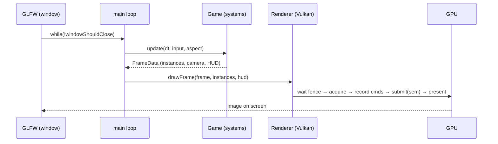

# 01 · Project setup & toolchain 🛠️

> **You'll leave this chapter with:** the project scaffolded and building, the
> Vulkan toolchain installed with **validation layers on**, a clear picture of
> what Vulkan and an ECS each buy us, and a map of what one frame will do — so the
> rest of the guide has somewhere to hang.

This is an **implementation guide**: you build the engine and the game as you
read, and every piece is shown and explained in full. This chapter installs the
toolchain and sets up the empty project the following chapters fill in.

---

## The toolchain

Vulkan is not "one download." It's a loader, a driver, and a small
constellation of libraries. Here's the whole kit, and why each is here:

| Piece | What it is | Why we need it |
|---|---|---|
| **Vulkan SDK** (LunarG) | The loader, headers, **validation layers**, and `glslc`/shaderc. | The core API and — crucially — the layers that turn misuse into readable errors. |
| **GLFW** | Cross-platform window + input + Vulkan surface creation. | Vulkan has no windowing of its own; GLFW gives us a window, a `VkSurfaceKHR`, and keyboard input on Linux/Windows/macOS. |
| **GLM** | Header-only vector/matrix/quaternion math, GLSL-shaped. | Our `simd` equivalent — `vec3`, `mat4`, `quat` in GLSL's shapes. (Their *layout* still has rules — the std140 padding trap, chapter 07.) |
| **VMA** | Vulkan Memory Allocator (AMD). | Real GPU memory management is fiddly; VMA does the allocation/sub-allocation so we don't hand-roll a memory heap. |
| **shaderc** | GLSL → **SPIR-V** compiler (ships in the SDK). | Vulkan consumes SPIR-V bytecode, not GLSL text. We compile ours at build time. |

Install the **Vulkan SDK** first, from [vulkan.lunarg.com](https://vulkan.lunarg.com)
(Linux packages, or the Windows installer). It sets `VULKAN_SDK` and puts `glslc`
on your `PATH`. Verify it:

```console
$ vulkaninfo | head            # prints your device + supported version
$ glslc --version              # the shader compiler is on PATH
```

GLFW and GLM you can install from your system package manager
(`apt install libglfw3-dev libglm-dev`, `vcpkg install glfw3 glm`, or Homebrew),
and **VMA** is a single header we vendor into the project (below). That's it —
now the project.

---

## Set up the project

The whole game is a single native executable driven by **CMake**. Create the
tree:

```console
$ mkdir SpaceFighter && cd SpaceFighter
$ mkdir -p src src/ecs src/systems src/render shaders third_party
```

Vendor VMA's header (it's genuinely one file):

```console
$ curl -L -o third_party/vk_mem_alloc.h \
    https://raw.githubusercontent.com/GPUOpen-LibrariesAndSDKs/VulkanMemoryAllocator/master/include/vk_mem_alloc.h
```

Now the top-level `CMakeLists.txt`. It finds Vulkan, GLFW and GLM, wires in VMA,
and — the one Vulkan-specific build step — **compiles every `.vert`/`.frag` in
`shaders/` to SPIR-V** with `glslc`:

```cmake
cmake_minimum_required(VERSION 3.19)   # 3.19+ for the Vulkan::glslc target
project(SpaceFighter LANGUAGES CXX)

set(CMAKE_CXX_STANDARD 17)
set(CMAKE_CXX_STANDARD_REQUIRED ON)

find_package(Vulkan REQUIRED)          # loader + headers from the SDK
find_package(glfw3 3.3 REQUIRED)       # windowing + input + surface
find_package(glm REQUIRED)             # math

add_executable(SpaceFighter
    src/main.cpp
    # append each new .cpp here as the chapters create them:
    #   src/Game.cpp  src/Mesh.cpp  src/HUD.cpp
    #   src/render/VulkanContext.cpp  src/render/Swapchain.cpp  src/render/Renderer.cpp
)

target_include_directories(SpaceFighter PRIVATE src third_party)
target_link_libraries(SpaceFighter PRIVATE Vulkan::Vulkan glfw glm::glm)

# --- Compile GLSL → SPIR-V at build time --------------------------------
file(GLOB SHADERS CONFIGURE_DEPENDS
     "${CMAKE_SOURCE_DIR}/shaders/*.vert"
     "${CMAKE_SOURCE_DIR}/shaders/*.frag")
foreach(shader ${SHADERS})
    get_filename_component(name ${shader} NAME)
    set(spv "${CMAKE_BINARY_DIR}/shaders/${name}.spv")
    add_custom_command(
        OUTPUT ${spv}
        COMMAND ${CMAKE_COMMAND} -E make_directory "${CMAKE_BINARY_DIR}/shaders"
        COMMAND Vulkan::glslc ${shader} -o ${spv}
        DEPENDS ${shader}
        COMMENT "glslc ${name} → ${name}.spv")
    list(APPEND SPV_FILES ${spv})
endforeach()
add_custom_target(shaders DEPENDS ${SPV_FILES})
add_dependencies(SpaceFighter shaders)
```

Two notes on that file. First, it lists only `src/main.cpp` — CMake errors at
configure time on source files that don't exist, so **create a stub now** and the
project builds from day one:

```cpp
// src/main.cpp — replaced wholesale in chapter 09
int main() { return 0; }
```

As later chapters create real files, add each to the `add_executable` list.
Second, `CONFIGURE_DEPENDS` on the shader glob makes CMake re-scan the folder
when you *add* a shader file — without it, a new shader is silently ignored until
you re-run `cmake` by hand.

The shader step is worth pausing on: unlike Metal, where we compiled MSL from a
string at launch, **Vulkan wants SPIR-V bytecode**, so shaders are compiled
*ahead of time* by `glslc` and loaded as `.spv` files at runtime (chapter 06).
That's why they're their own build target with `DEPENDS` — edit a `.frag`, and
CMake recompiles just that one.

Build and run with the usual CMake dance:

```console
$ cmake -S . -B build
$ cmake --build build
$ cd build && ./SpaceFighter
```

Run from inside `build/` — the renderer loads its compiled shaders by the
relative path `shaders/….spv` (the loading code is in chapter 06), and that's
where the build wrote them. Once the swapchain and frame loop exist (chapter 05)
running opens a window cleared to deep space blue; the first ship appears when
the pipelines and buffers land (chapters 06–07). Until then it just compiles.
You'll live in this edit–build–run loop for the rest of the guide.

### The files you'll create

Each chapter says which files to add under `src/`. Here's the whole map, so you
can see where things land:

```
src/
├── main.cpp                 window + loop + input glue, the entry point   (ch 09)
├── Game.hpp / .cpp          the world, and the per-frame system schedule  (ch 09, 12)
├── Input.hpp                InputState + GLFW key handling                (ch 10)
├── Math.hpp                 GLM helpers: MVP, projection, the Y-flip      (ch 03)
├── Components.hpp           every component (pure data structs)           (ch 04)
├── HUD.hpp / .cpp           crosshair, hull bar, hit-flash geometry       (ch 13)
├── Mesh.hpp / .cpp          procedural ship / enemy / bolt / stars / grid (ch 08)
├── ecs/                     Entity, ComponentStore, World                 (ch 04)
├── systems/                 one file per behaviour                        (ch 09–12)
└── render/                  VulkanContext, Swapchain, Renderer, RenderTypes (ch 02, 05–07)

shaders/
├── lit.vert / lit.frag      ship & enemies (directional light)           (ch 06)
├── unlit.vert / unlit.frag  grid & bolts                                 (ch 06)
├── star.vert / star.frag    the tiling starfield                         (ch 06, 08)
└── hud.vert / hud.frag      the 2D overlay                               (ch 06, 13)
```

### What you're building toward

By the end you'll fly a low-poly fighter with these controls (wired up in
chapter 10), enemies warping in ahead of you:

| Key | Action |
|---|---|
| `W` `S` / `↑` `↓` | Pitch down / up |
| `A` `D` / `←` `→` | Yaw left / right (banks automatically) |
| `Q` `E` | Roll |
| `Left Shift` | Boost |
| `Space` | Fire |
| `Esc` | Quit |

Score, hull and deaths will show in the **window title** (chapter 13 explains why
text goes there and not on the HUD).

---

## Why Vulkan?

**Vulkan** is Khronos' low-level, cross-vendor GPU API — the modern successor to
OpenGL, and the layer game engines target on Windows, Linux and Android (and, via
MoltenVK, on Apple hardware). "Low-level" here is more literal than Metal's: you
don't just describe a pipeline and submit commands, you also **choose the GPU,
create the swapchain, manage the memory, and synchronize the CPU and GPU
yourself.** There is no scene graph, no "draw a sphere," and — unlike Metal — no
framework quietly handling the window's images or pacing your frames. You see the
whole machine, wires included.

The alternatives frame the choice:

- **A game engine (Unity, Unreal, Godot)** — the right tool to *ship* a game, the
  wrong tool to *learn what an engine does*.
- **OpenGL** — cross-platform and far gentler, but its hidden global state and
  driver-guesswork are exactly what Vulkan was designed to replace; it teaches an
  older model.
- **Metal** — modern and clean, but Apple-only, and MetalKit hides the swapchain
  and sync we most want to understand (that's the [sibling guide](../../space-fighter-metal/)).
- **Vulkan** — explicit, cross-platform, and the current industry baseline.
  Verbose, yes — but the verbosity *is* the lesson. That's us.

We accept Vulkan's up-front cost because it pays a specific dividend: after this,
you know what a frame is made of, down to the fence that tells the CPU the GPU is
done.

## Why an ECS?

A space shooter has ships, bullets, enemies, pickups, explosions — hundreds of
things that are *mostly alike but not quite*. The object-oriented instinct is an
inheritance tree: `Entity → Vehicle → Ship → PlayerShip`. It works until an
enemy needs to be *both* a homing thing *and* a shielded thing *and* a splitter,
and single inheritance can't express it. You get deep hierarchies, `dynamic_cast`
checks, and copy-pasted behaviour.

An **Entity–Component–System** turns the model inside out:

- an **entity** is just an id (a number),
- a **component** is a plain struct of data with no behaviour, and
- a **system** is a function that runs over all entities that have a given set
  of components.

A "homing shielded splitter" is just an entity holding a `Homing`, a `Shield`
and a `Splitter` component. New behaviour is a new component plus a new system —
nothing else changes. And because components of one type live packed together in
memory, systems iterate them fast and cache-friendly. Chapter 04 builds ours;
for now, just know *data lives in components, behaviour lives in systems, and
they meet in the `World`.* (This half of the design is identical to the Metal
guide — an ECS is renderer-agnostic by construction.)

---

## The shape of a frame

Here is the whole program in one breath. Our own loop in `main.cpp` (chapter 09)
runs until the window closes, and each iteration does two things:

1. **Simulate.** `Game::update` measures the time since the last frame and runs
   every system in order — read input, fly the ship, spawn and steer enemies,
   move everything, expire bolts, resolve collisions, and finally collect what's
   visible.
2. **Draw.** `Renderer::drawFrame` takes that collection and performs the Vulkan
   frame: **wait on a fence**, **acquire** a swapchain image, record a command
   buffer (begin render pass, draw grid → stars → ships → bolts → HUD, end),
   **submit** it with the right semaphores, and **present** the result.



Every chapter zooms into one part of that loop. Keep the picture: **simulate,
then draw, sixty times a second** — but note that in Vulkan the "then draw" step
is itself a careful sequence of *acquire, record, submit, present*, guarded by
sync primitives. Metal did that part for us; chapter 05 is where we do it
ourselves.

---

## Validation layers: turn them on now

This is the most important paragraph in the chapter. Vulkan's core API does
almost **no error checking** — pass a wrong enum or forget a synchronization step
and you get undefined behaviour, often a blank window with no clue why. The
**validation layers** (shipped in the SDK) sit between your code and the driver
and check *everything*: object lifetimes, correct usage flags, synchronization
hazards, descriptor mismatches. They print precise, actionable messages.

We enable them from the very first line of Vulkan code (chapter 02), gated on a
build flag so a release build can drop them:

```cpp
#ifdef NDEBUG
constexpr bool kEnableValidation = false;
#else
constexpr bool kEnableValidation = true;      // on for every debug build
#endif
```

Leave them on for the entire guide. When something renders wrong, read the
validation output *first* — nine times in ten it names the mistake.

---

## Build issues you might hit

- **`Could NOT find Vulkan`.** The SDK isn't on CMake's radar. Source the SDK's
  `setup-env.sh` (Linux) or ensure `VULKAN_SDK` is set (Windows), then re-run
  `cmake`.
- **`glslc: not found` / shaders don't compile.** `glslc` ships with the SDK; if
  CMake can't find it, `find_package(Vulkan)` didn't locate the SDK. A shader
  syntax error prints the exact file and line at *build* time (unlike Metal's
  launch-time errors) — fix and rebuild.
- **A window opens, then instantly closes with a validation error.** Read it —
  that's the layers doing their job. The most common early one is a
  swapchain/format mismatch (chapter 05).
- **`vkCreateInstance` fails with `VK_ERROR_LAYER_NOT_PRESENT`.** The validation
  layers aren't installed. Install the SDK's validation package
  (`vulkan-validationlayers` on Linux), or set `kEnableValidation = false` to
  build without them (not recommended while learning).
- **The window ignores the keyboard.** GLFW input needs the window focused and
  the key callback registered — chapter 10. Click the window.

---

**Next:** the object model — instance, device, queues — and *why* Vulkan makes
you name every one. → [Chapter 02: Vulkan fundamentals](02-vulkan-fundamentals.md)
