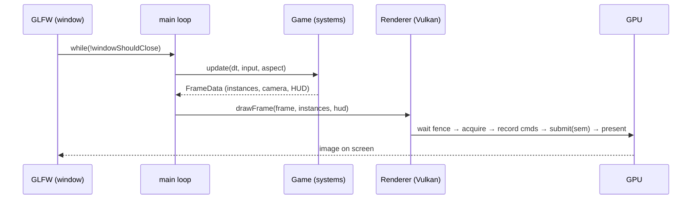

# 01 · Project setup & toolchain 🛠️

> **You'll leave this chapter with:** the project scaffolded and building, the
> Vulkan toolchain installed with **validation layers on**, a clear picture of
> what Vulkan and an ECS each buy us, and a map of what one frame will do — so the
> rest of the guide has somewhere to hang.

This is an **implementation guide**: you build the engine and the game as you
read, and every piece is shown and explained in full. This chapter installs the
toolchain and sets up the empty project the following chapters fill in.

---

## The toolchain

Vulkan is not "one download." It's a loader, a driver, and a small
constellation of libraries. Here's the whole kit, and why each is here:

| Piece | What it is | Why we need it |
|---|---|---|
| **Vulkan SDK** (LunarG) | The loader, headers, **validation layers**, and `glslc`/shaderc. | The core API and — crucially — the layers that turn misuse into readable errors. |
| **GLFW** | Cross-platform window + input + Vulkan surface creation. | Vulkan has no windowing of its own; GLFW gives us a window, a `VkSurfaceKHR`, and keyboard input on Linux/Windows/macOS. |
| **GLM** | Header-only vector/matrix/quaternion math, GLSL-shaped. | Our `simd` equivalent — `vec3`, `mat4`, `quat` in GLSL's shapes. (Their *layout* still has rules — the std140 padding trap, chapter 08.) |
| **VMA** | Vulkan Memory Allocator (AMD). | Real GPU memory management is fiddly; VMA does the allocation/sub-allocation so we don't hand-roll a memory heap. |
| **shaderc** | GLSL → **SPIR-V** compiler (ships in the SDK). | Vulkan consumes SPIR-V bytecode, not GLSL text. We compile ours at build time. |

Install the **Vulkan SDK** first, from [vulkan.lunarg.com](https://vulkan.lunarg.com)
(Linux packages, or the Windows installer). It sets `VULKAN_SDK` and puts `glslc`
on your `PATH`. Verify it:

```console
$ vulkaninfo | head            # prints your device + supported version
$ glslc --version              # the shader compiler is on PATH
```

GLFW and GLM you can install from your system package manager
(`apt install libglfw3-dev libglm-dev`, `vcpkg install glfw3 glm`, or Homebrew),
and **VMA** is a single header we vendor into the project (below). That's it —
now the project.

---

## Set up the project

The whole game is a single native executable driven by **CMake**. Create the
tree:

```console
$ mkdir SpaceFighter && cd SpaceFighter
$ mkdir -p src/{core,ecs,input,components,systems,archetypes}
$ mkdir -p src/render/{types,rhi}
$ mkdir -p src/content/{meshes,shaders}
$ mkdir -p tests third_party
```

Ten empty directories before a line of code is a lot to take on faith, so
chapter 02 is the argument for each of them. The one-line version: they split
**engine** from **game** from **content**, and that split is what keeps the
renderer from ever learning what a spaceship is. If you want the shape without
the argument, it's the tree further down this chapter.

Vendor VMA's header (it's genuinely one file):

```console
$ curl -L -o third_party/vk_mem_alloc.h \
    https://raw.githubusercontent.com/GPUOpen-LibrariesAndSDKs/VulkanMemoryAllocator/master/include/vk_mem_alloc.h
```

Now the top-level `CMakeLists.txt`. It finds Vulkan, GLFW and GLM, wires in VMA,
and — the one Vulkan-specific build step — **compiles every `.vert`/`.frag` in
`src/content/shaders/` to SPIR-V** with `glslc`:

```cmake
cmake_minimum_required(VERSION 3.19)   # 3.19+ for the Vulkan::glslc target
project(SpaceFighter LANGUAGES CXX)

set(CMAKE_CXX_STANDARD 17)
set(CMAKE_CXX_STANDARD_REQUIRED ON)

find_package(Vulkan REQUIRED)          # loader + headers from the SDK
find_package(glfw3 3.3 REQUIRED)       # windowing + input + surface
find_package(glm REQUIRED)             # math

add_executable(SpaceFighter
    src/main.cpp
    # append each new .cpp here as the chapters create them, grouped by layer:
    #   engine   src/render/rhi/*.cpp  src/render/Renderer.cpp
    #            src/render/MeshRegistry.cpp  src/input/Input.cpp
    #   game     src/Game.cpp  src/systems/*.cpp  src/archetypes/*.cpp
    #   content  src/content/meshes/*.cpp
)

target_include_directories(SpaceFighter PRIVATE src third_party)
target_link_libraries(SpaceFighter PRIVATE Vulkan::Vulkan glfw glm::glm)

# --- Compile GLSL → SPIR-V at build time --------------------------------
file(GLOB SHADERS CONFIGURE_DEPENDS
     "${CMAKE_SOURCE_DIR}/src/content/shaders/*.vert"
     "${CMAKE_SOURCE_DIR}/src/content/shaders/*.frag")
foreach(shader ${SHADERS})
    get_filename_component(name ${shader} NAME)
    set(spv "${CMAKE_BINARY_DIR}/shaders/${name}.spv")
    add_custom_command(
        OUTPUT ${spv}
        COMMAND ${CMAKE_COMMAND} -E make_directory "${CMAKE_BINARY_DIR}/shaders"
        COMMAND Vulkan::glslc ${shader} -o ${spv}
        DEPENDS ${shader}
        COMMENT "glslc ${name} → ${name}.spv")
    list(APPEND SPV_FILES ${spv})
endforeach()
add_custom_target(shaders DEPENDS ${SPV_FILES})
add_dependencies(SpaceFighter shaders)
```

Three notes on that file. First, it lists only `src/main.cpp` — CMake errors at
configure time on source files that don't exist, so **create a stub now** and the
project builds from day one:

```cpp
// src/main.cpp — replaced wholesale in chapter 10
int main() { return 0; }
```

As later chapters create real files, add each to the `add_executable` list.

Second, `target_include_directories(... PRIVATE src ...)` is what makes every
include in this project read as a path from `src/` — `#include "ecs/World.hpp"`,
`#include "render/types/Mesh.hpp"`. Never `#include "../../ecs/World.hpp"`.
Relative includes hide which layer a file depends on inside a pile of `../`, and
chapter 02's boundary test reads exactly those include lines to enforce the
layering — so keep them rooted.

Third, `CONFIGURE_DEPENDS` on the shader glob makes CMake re-scan the folder when
you *add* a shader file — without it, a new shader is silently ignored until you
re-run `cmake` by hand.

The shader step is worth pausing on twice. Unlike Metal, where we compiled MSL
from a string at launch, **Vulkan wants SPIR-V bytecode**, so shaders are
compiled *ahead of time* by `glslc` and loaded as `.spv` files at runtime
(chapter 07). That's why they're their own build target with `DEPENDS` — edit a
`.frag`, and CMake recompiles just that one. And note the asymmetry in the paths:
the GLSL **sources** live under `src/content/shaders/` with the rest of the
content, but the compiled **output** lands flat in `build/shaders/`. The source
tree is organised for a reader; the build directory is organised for the loader,
which just wants a short stable path (chapter 07 loads `shaders/lit.vert.spv`).

This `CMakeLists.txt` grows exactly once more: chapter 02 adds a test target.

Build and run with the usual CMake dance:

```console
$ cmake -S . -B build
$ cmake --build build
$ cd build && ./SpaceFighter
```

Run from inside `build/` — the renderer loads its compiled shaders by the
relative path `shaders/….spv` (the loading code is in chapter 07), and that's
where the build wrote them. Once the swapchain and frame loop exist (chapter 06)
running opens a window cleared to deep space blue; the first ship appears when
the pipelines and buffers land (chapters 07–08). Until then it just compiles.
You'll live in this edit–build–run loop for the rest of the guide.

### The files you'll create

Each chapter says which files to add under `src/`. Here's the whole map, so you
can see where things land:

```
SpaceFighter/
├── CMakeLists.txt
├── third_party/
│   └── vk_mem_alloc.h            VMA, vendored — one header               (ch 01)
├── src/
│   ├── main.cpp                  window + loop + input glue, entry point  (ch 10)
│   ├── Game.hpp / .cpp           the world, and the per-frame schedule    (ch 10, 13)
│   ├── core/
│   │   └── Math.hpp              GLM helpers: MVP, projection, the Y-flip (ch 04)
│   ├── ecs/
│   │   ├── Entity.hpp
│   │   ├── ComponentStore.hpp    the sparse set, a template per type
│   │   └── World.hpp             entities, type-erased stores, deferred destroy (ch 05)
│   ├── input/
│   │   └── Input.hpp / .cpp      InputState, and the GLFW producer        (ch 11)
│   ├── components/
│   │   ├── Spatial.hpp           Transform, Velocity
│   │   ├── Rendering.hpp         Renderable
│   │   ├── Physics.hpp           Collider, Layer
│   │   └── Gameplay.hpp          Player, Weapon, Enemy, Projectile, Lifetime, … (ch 10, 13)
│   ├── systems/
│   │   ├── MovementSystem.hpp / .cpp
│   │   ├── FlightControlSystem.hpp / .cpp
│   │   ├── CameraSystem.hpp / .cpp
│   │   ├── WeaponSystem.hpp / .cpp
│   │   ├── EnemySystem.hpp / .cpp
│   │   ├── LifetimeSystem.hpp / .cpp
│   │   ├── CollisionSystem.hpp / .cpp
│   │   ├── RenderSystem.hpp / .cpp   walks the world, emits flat draw data
│   │   └── HUDSystem.hpp / .cpp      reticle, hull bar, hit-flash geometry (ch 10–14)
│   ├── archetypes/
│   │   ├── Player.hpp / .cpp     which components a player ship is made of
│   │   ├── Enemy.hpp / .cpp
│   │   └── Projectile.hpp / .cpp                                          (ch 10, 13)
│   ├── render/
│   │   ├── types/
│   │   │   ├── GPUContract.hpp   InstanceData, FrameUniforms — mirror the shaders
│   │   │   ├── Mesh.hpp          Vertex, MeshData — CPU geometry, no Vulkan
│   │   │   └── HUDVertex.hpp     the 2D overlay vertex                    (ch 08, 09)
│   │   ├── rhi/
│   │   │   ├── Context.hpp / .cpp      instance, device, queues, VMA      (ch 03)
│   │   │   ├── Swapchain.hpp / .cpp    surface, images, depth, framebuffers (ch 06)
│   │   │   ├── Buffers.hpp / .cpp      Buffer, staging uploads, mapped writes (ch 08)
│   │   │   ├── Descriptors.hpp / .cpp  set layout, pool, per-frame sets   (ch 08)
│   │   │   └── Pipelines.hpp / .cpp    shader modules, the five pipelines (ch 07)
│   │   ├── MeshRegistry.hpp / .cpp  every mesh, uploaded once, keyed by id (ch 09)
│   │   └── Renderer.hpp / .cpp      the frame, and the passes in order    (ch 06–09)
│   └── content/
│       ├── MeshID.hpp            the ids gameplay uses to name art        (ch 09)
│       ├── meshes/
│       │   ├── MeshBuilder.hpp / .cpp  flat shading, quads, shared helpers
│       │   ├── ShipMesh.cpp
│       │   ├── EnemyMesh.cpp
│       │   ├── ProjectileMesh.cpp
│       │   └── SceneryMesh.cpp         the starfield and the ground grid  (ch 09)
│       └── shaders/
│           ├── lit.vert / lit.frag      ship & enemies (directional light)
│           ├── unlit.vert / unlit.frag  grid & bolts
│           ├── star.vert / star.frag    the tiling starfield
│           └── hud.vert / hud.frag      the 2D overlay                    (ch 07)
└── tests/
    └── BoundaryTest.cpp          keeps the layers from leaking into each other (ch 02)
```

Four groups, and the split is the whole architecture:

- **Engine** — `core/`, `ecs/`, `input/`, `render/`. Nothing here knows this is a
  space game.
- **Game** — `components/`, `systems/`, `archetypes/`, `Game.cpp`. Everything here
  knows.
- **Content** — `content/`. The geometry, the shaders, and the ids that name them.
  Referenced by the game, owned by neither.
- **Launch** — `main.cpp`.

Chapter 02 is why those four exist, why `content/` is a sibling of the code
rather than a subfolder of anything, and what `tests/BoundaryTest.cpp` is for.

### What you'll create, and when

Keep this table handy — it's the whole project. Every path is relative to `src/`
unless it starts with `tests/`.

| Chapter | Files you create | After it, you can… |
|---|---|---|
| 01 | `main.cpp` (stub), `CMakeLists.txt` | build and run a binary |
| 02 | `tests/BoundaryTest.cpp` | keep the layers honest |
| 03 | `render/rhi/Context.*` | pick a GPU and open a device |
| 04 | `core/Math.hpp` | print a transformed point |
| 05 | `ecs/Entity.hpp`, `ecs/ComponentStore.hpp`, `ecs/World.hpp` | create entities and attach data |
| 06 | `render/rhi/Swapchain.*`, `render/Renderer.*` | **clear a window to deep space blue** |
| 07 | `content/shaders/*.vert`, `content/shaders/*.frag`, `render/rhi/Pipelines.*` | compile SPIR-V and build the five pipelines |
| 08 | `render/types/*.hpp`, `render/rhi/Buffers.*`, `render/rhi/Descriptors.*` | put real memory behind a draw |
| 09 | `content/MeshID.hpp`, `content/meshes/*`, `render/MeshRegistry.*` | **see a ship on screen** |
| 10 | `components/*.hpp`, `systems/MovementSystem.*`, `systems/RenderSystem.*`, `archetypes/Player.*`, `Game.*`, `main.cpp` (real) | watch it move, driven by the ECS |
| 11 | `input/Input.*`, `systems/FlightControlSystem.*` | **fly it** |
| 12 | `systems/CameraSystem.*` | fly it with a camera that feels right |
| 13 | `systems/{Weapon,Enemy,Lifetime,Collision}System.*`, `archetypes/Enemy.*`, `archetypes/Projectile.*` | **play it** — shoot, get hit, score |
| 14 | `render/types/HUDVertex.hpp`, `systems/HUDSystem.*` | see a reticle and a hull bar |
| 15 | *(none — roadmap)* | — |

Most files you create once and never touch again. Three grow with the guide:
`Game.cpp`, which accumulates the system schedule; `Renderer.cpp`, which
accumulates passes; and `CMakeLists.txt`, which accumulates source files.

### What you're building toward

By the end you'll fly a low-poly fighter with these controls (wired up in
chapter 11), enemies warping in ahead of you:

| Key | Action |
|---|---|
| `W` `S` / `↑` `↓` | Pitch down / up |
| `A` `D` / `←` `→` | Yaw left / right (banks automatically) |
| `Q` `E` | Roll |
| `Left Shift` | Boost |
| `Space` | Fire |
| `Esc` | Quit |

Score, hull and deaths will show in the **window title** (chapter 14 explains why
text goes there and not on the HUD).

---

## Why Vulkan?

**Vulkan** is Khronos' low-level, cross-vendor GPU API — the modern successor to
OpenGL, and the layer game engines target on Windows, Linux and Android (and, via
MoltenVK, on Apple hardware). "Low-level" here is more literal than Metal's: you
don't just describe a pipeline and submit commands, you also **choose the GPU,
create the swapchain, manage the memory, and synchronize the CPU and GPU
yourself.** There is no scene graph, no "draw a sphere," and — unlike Metal — no
framework quietly handling the window's images or pacing your frames. You see the
whole machine, wires included.

The alternatives frame the choice:

- **A game engine (Unity, Unreal, Godot)** — the right tool to *ship* a game, the
  wrong tool to *learn what an engine does*.
- **OpenGL** — cross-platform and far gentler, but its hidden global state and
  driver-guesswork are exactly what Vulkan was designed to replace; it teaches an
  older model.
- **Metal** — modern and clean, but Apple-only, and MetalKit hides the swapchain
  and sync we most want to understand (that's the [sibling guide](../../space-fighter-metal/)).
- **Vulkan** — explicit, cross-platform, and the current industry baseline.
  Verbose, yes — but the verbosity *is* the lesson. That's us.

We accept Vulkan's up-front cost because it pays a specific dividend: after this,
you know what a frame is made of, down to the fence that tells the CPU the GPU is
done.

## Why an ECS?

A space shooter has ships, bullets, enemies, pickups, explosions — hundreds of
things that are *mostly alike but not quite*. The object-oriented instinct is an
inheritance tree: `Entity → Vehicle → Ship → PlayerShip`. It works until an
enemy needs to be *both* a homing thing *and* a shielded thing *and* a splitter,
and single inheritance can't express it. You get deep hierarchies, `dynamic_cast`
checks, and copy-pasted behaviour.

An **Entity–Component–System** turns the model inside out:

- an **entity** is just an id (a number),
- a **component** is a plain struct of data with no behaviour, and
- a **system** is a function that runs over all entities that have a given set
  of components.

A "homing shielded splitter" is just an entity holding a `Homing`, a `Shield`
and a `Splitter` component. New behaviour is a new component plus a new system —
nothing else changes. And because components of one type live packed together in
memory, systems iterate them fast and cache-friendly. Chapter 05 builds ours;
for now, just know *data lives in components, behaviour lives in systems, and
they meet in the `World`.* (This half of the design is identical to the Metal
guide — an ECS is renderer-agnostic by construction.)

---

## The shape of a frame

Here is the whole program in one breath. Our own loop in `main.cpp` (chapter 10)
runs until the window closes, and each iteration does two things:

1. **Simulate.** `Game::update` measures the time since the last frame and runs
   every system in order — read input, fly the ship, spawn and steer enemies,
   move everything, expire bolts, resolve collisions, and finally collect what's
   visible.
2. **Draw.** `Renderer::drawFrame` takes that collection and performs the Vulkan
   frame: **wait on a fence**, **acquire** a swapchain image, record a command
   buffer (begin render pass, draw grid → stars → ships → bolts → HUD, end),
   **submit** it with the right semaphores, and **present** the result.


```mermaid
sequenceDiagram
    participant OS as GLFW (window)
    participant MA as main loop
    participant GA as Game (systems)
    participant RE as Renderer (Vulkan)
    participant GPU
    OS->>MA: while(!windowShouldClose)
    MA->>GA: update(dt, input, aspect)
    GA-->>MA: FrameData (instances, camera, HUD)
    MA->>RE: drawFrame(frame, instances, hud)
    RE->>GPU: wait fence → acquire → record cmds → submit(sem) → present
    GPU-->>OS: image on screen
```

Every chapter zooms into one part of that loop. Keep the picture: **simulate,
then draw, sixty times a second** — but note that in Vulkan the "then draw" step
is itself a careful sequence of *acquire, record, submit, present*, guarded by
sync primitives. Metal did that part for us; chapter 06 is where we do it
ourselves.

---

## Validation layers: turn them on now

This is the most important paragraph in the chapter. Vulkan's core API does
almost **no error checking** — pass a wrong enum or forget a synchronization step
and you get undefined behaviour, often a blank window with no clue why. The
**validation layers** (shipped in the SDK) sit between your code and the driver
and check *everything*: object lifetimes, correct usage flags, synchronization
hazards, descriptor mismatches. They print precise, actionable messages.

We enable them from the very first line of Vulkan code (chapter 03), gated on a
build flag so a release build can drop them:

```cpp
#ifdef NDEBUG
constexpr bool kEnableValidation = false;
#else
constexpr bool kEnableValidation = true;      // on for every debug build
#endif
```

Leave them on for the entire guide. When something renders wrong, read the
validation output *first* — nine times in ten it names the mistake.

---

## Build issues you might hit

- **`Could NOT find Vulkan`.** The SDK isn't on CMake's radar. Source the SDK's
  `setup-env.sh` (Linux) or ensure `VULKAN_SDK` is set (Windows), then re-run
  `cmake`.
- **`glslc: not found` / shaders don't compile.** `glslc` ships with the SDK; if
  CMake can't find it, `find_package(Vulkan)` didn't locate the SDK. A shader
  syntax error prints the exact file and line at *build* time (unlike Metal's
  launch-time errors) — fix and rebuild.
- **A window opens, then instantly closes with a validation error.** Read it —
  that's the layers doing their job. The most common early one is a
  swapchain/format mismatch (chapter 06).
- **`vkCreateInstance` fails with `VK_ERROR_LAYER_NOT_PRESENT`.** The validation
  layers aren't installed. Install the SDK's validation package
  (`vulkan-validationlayers` on Linux), or set `kEnableValidation = false` to
  build without them (not recommended while learning).
- **The window ignores the keyboard.** GLFW input needs the window focused and
  the key callback registered — chapter 11. Click the window.

---

**Next:** why the tree above looks like that, and the one test that keeps it
honest. → [Chapter 02: Architecture](02-architecture.md)
