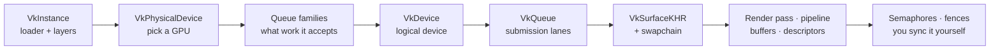

# 02 · Vulkan fundamentals 🧠

> **You'll leave this chapter with:** a working mental model of the GPU as a
> service you *configure by hand*, names for the dozen-odd Vulkan objects that
> show up before you can draw a single triangle, and an honest answer to **why
> Vulkan is so verbose** — and when that verbosity earns its keep. This is where
> the object model stops being intimidating and starts reading like prose.

---

## The GPU is a separate computer — and Vulkan hands you the wiring

Like Metal, Vulkan treats the GPU as a second machine on the far end of a wire:
you don't call functions on it, you **write down a list of commands**, hand the
list over, and it runs them and signals when it's done. That much is identical to
the Metal mental model, and to every modern GPU API.

The difference is everything *around* that list. Metal — through MetalKit —
handed you a device, a drawable to render into, a depth texture, and a display
link to pace frames. **Vulkan hands you none of it.** Before your first triangle
you walk a fixed initialisation path:



The first four boxes are **this chapter** (device setup); the rest have their own
chapters (surface/swapchain and sync in 05, pipeline in 06, buffers/descriptors
in 07). That chain *is* Vulkan's reputation. The payoff for walking it: nothing
about how your frame reaches the screen stays hidden.

---

## The cast of objects

Here's everyone you'll meet, roughly in the order they appear. The top group is
this chapter; the rest are forward pointers so the whole model is visible at once.

| Object | What it is | Lifetime | Chapter |
|---|---|---|---|
| `VkInstance` | Your handle to the Vulkan loader; holds global config + layers. | Once, at startup | 02 |
| `VkPhysicalDevice` | A specific GPU in the machine (you *query* it, don't create it). | Enumerated once | 02 |
| `VkDevice` | The **logical device** — your configured connection to one GPU. | Once | 02 |
| `VkQueue` | A lane you submit command buffers to (graphics, present). | Once | 02 |
| `VkSurfaceKHR` | The window you'll present to (created by GLFW). | Once | 05 |
| `VkSwapchainKHR` | The ring of images shown on screen. | Once (rebuilt on resize) | 05 |
| `VkImageView` / `VkFramebuffer` | How a pass addresses an image; what it renders into. | Per swapchain image | 05 |
| `VkRenderPass` | The declared structure of a rendering operation. | Once | 05 |
| `VkPipeline` | The frozen recipe: shaders + *all* fixed-function state. | Once per material | 06 |
| `VkPipelineLayout` / `VkDescriptorSetLayout` | The shape of the inputs a pipeline expects. | Once | 06, 07 |
| `VkBuffer` + `VmaAllocation` | GPU-accessible memory (vertices, instances, uniforms). | Meshes once; per-frame data cycled | 07 |
| `VkDescriptorSet` | A bound bundle of resources the shader reads. | Per frame-in-flight | 07 |
| `VkCommandPool` / `VkCommandBuffer` | Where commands are allocated / recorded. | Pool once; buffers each frame | 05 |
| `VkSemaphore` / `VkFence` | GPU↔GPU and GPU↔CPU synchronization. | Per frame-in-flight | 05 |

The split that mattered in Metal still matters here — build the top rows **once**
and reuse; create the command buffer, sync objects and per-frame buffers **every
frame** — but the list is three times longer, because Vulkan externalises what
other APIs keep inside. Our `VulkanContext` (assembled in chapter 05) owns the
once-only handles; the `Renderer` owns the per-frame ones.

---

## Every call has the same shape

Before the four steps, learn the pattern once and the rest of the API reads
itself. Almost nothing in Vulkan is passed as loose arguments. You **fill a
`Vk…CreateInfo` struct** — whose first field is always its own type tag, `sType`
— and pass a pointer to a `vkCreate…` function that writes a handle back:

```cpp
VkThingCreateInfo ci{VK_STRUCTURE_TYPE_THING_CREATE_INFO};  // sType first, always
ci.someField = …;                                           // fill the knobs
VkThing thing;
vkCreateThing(device, &ci, nullptr, &thing);                // handle written back
```

It's verbose, but it's *regular*: extensible (new fields chain off `pNext`),
self-describing (validation reads `sType` to know what it's inspecting), and once
your eye learns it, a 20-line struct fill is skimmable. Every object below is this
pattern. The `nullptr` is the allocation-callbacks slot — we never use it.

---

## Step 1 — the instance

The **instance** is your process's connection to the Vulkan loader. Creating it
is where you declare which **layers** (validation!) and **extensions** (the
surface support GLFW needs) you want. GLFW tells you exactly which extensions the
window system requires:

```cpp
VkApplicationInfo app{VK_STRUCTURE_TYPE_APPLICATION_INFO};
app.pApplicationName = "SpaceFighter";
app.apiVersion       = VK_API_VERSION_1_2;

uint32_t glfwCount = 0;
const char** glfwExt = glfwGetRequiredInstanceExtensions(&glfwCount);  // surface exts
std::vector<const char*> extensions(glfwExt, glfwExt + glfwCount);

std::vector<const char*> layers;
if (kEnableValidation) {
    layers.push_back("VK_LAYER_KHRONOS_validation");                   // ← the layers
    extensions.push_back(VK_EXT_DEBUG_UTILS_EXTENSION_NAME);           // for messages
}

VkInstanceCreateInfo ci{VK_STRUCTURE_TYPE_INSTANCE_CREATE_INFO};
ci.pApplicationInfo        = &app;
ci.enabledExtensionCount   = (uint32_t)extensions.size();
ci.ppEnabledExtensionNames = extensions.data();
ci.enabledLayerCount       = (uint32_t)layers.size();
ci.ppEnabledLayerNames     = layers.data();

VkInstance instance;
vkCreateInstance(&ci, nullptr, &instance);
```

The load-bearing habit here: **you opt in to everything.** Layers, extensions,
and later every device feature and image format — Vulkan enables *nothing* by
default. If you didn't ask for it, it isn't on. That's the flip side of "nothing
hidden," and it's why validation catches a missing extension as a clear error
rather than a silent no-op.

### Wiring up the debug messenger

With the debug-utils extension on, register a callback so validation messages
reach your console:

```cpp
VkDebugUtilsMessengerCreateInfoEXT dbg{VK_STRUCTURE_TYPE_DEBUG_UTILS_MESSENGER_CREATE_INFO_EXT};
dbg.messageSeverity = VK_DEBUG_UTILS_MESSAGE_SEVERITY_WARNING_BIT_EXT
                    | VK_DEBUG_UTILS_MESSAGE_SEVERITY_ERROR_BIT_EXT;
dbg.messageType     = VK_DEBUG_UTILS_MESSAGE_TYPE_VALIDATION_BIT_EXT
                    | VK_DEBUG_UTILS_MESSAGE_TYPE_PERFORMANCE_BIT_EXT;
dbg.pfnUserCallback = [](auto severity, auto type, auto* data, void*) -> VkBool32 {
    std::fprintf(stderr, "[vulkan] %s\n", data->pMessage);
    return VK_FALSE;                    // VK_FALSE = "don't abort the offending call"
};
// vkCreateDebugUtilsMessengerEXT is itself an extension function, loaded via
// vkGetInstanceProcAddr(instance, "vkCreateDebugUtilsMessengerEXT").
```

From here on, misuse *talks to you*. That callback firing — with a message that
names the object and the rule you broke — is the single most useful thing that
can happen while you're learning Vulkan.

---

## Step 2 — picking a physical device

`vkEnumeratePhysicalDevices` lists the GPUs in the machine. Unlike Metal's
`MTLCreateSystemDefaultDevice()`, Vulkan won't choose for you: you **inspect each
candidate and decide.** For our game, "suitable" means it supports the swapchain
extension and has a queue family that can do graphics *and* present to our
surface. We score the survivors and take the best:

```cpp
int scoreDevice(VkPhysicalDevice dev, VkSurfaceKHR surface) {
    VkPhysicalDeviceProperties props;
    vkGetPhysicalDeviceProperties(dev, &props);

    if (!hasSwapchainExtension(dev))            return -1;   // must present at all
    if (!findQueueFamilies(dev, surface).ok())  return -1;   // must have the right lane

    int score = 0;
    if (props.deviceType == VK_PHYSICAL_DEVICE_TYPE_DISCRETE_GPU) score += 1000;
    score += props.limits.maxImageDimension2D;               // rough "bigger is better"
    return score;
}
// pick the highest-scoring device with score >= 0
```

This is a real decision Metal never surfaced. A laptop might have integrated *and*
discrete GPUs; a workstation might have two discrete cards. You say which, and you
can read `props.limits` to know exactly what it supports *before* you rely on
anything — so you never hit a "the default device can't do X" wall at runtime,
because you checked first.

---

## Step 3 — queue families: the kinds of work a GPU accepts

A **queue** is a lane you submit work to; a **queue family** is a group of lanes
that accept the same kinds of work. A GPU advertises its families and what each
supports — graphics, compute, transfer — and, separately, whether a given family
can **present** to a given surface:

```cpp
struct QueueFamilies { std::optional<uint32_t> graphics, present; bool ok() const {…} };

QueueFamilies findQueueFamilies(VkPhysicalDevice dev, VkSurfaceKHR surface) {
    uint32_t n = 0;
    vkGetPhysicalDeviceQueueFamilyProperties(dev, &n, nullptr);
    std::vector<VkQueueFamilyProperties> fams(n);
    vkGetPhysicalDeviceQueueFamilyProperties(dev, &n, fams.data());

    QueueFamilies out;
    for (uint32_t i = 0; i < n; i++) {
        if (fams[i].queueFlags & VK_QUEUE_GRAPHICS_BIT) out.graphics = i;
        VkBool32 canPresent = false;
        vkGetPhysicalDeviceSurfaceSupportKHR(dev, i, surface, &canPresent);
        if (canPresent) out.present = i;
    }
    return out;
}
```

On most desktop GPUs one family does both, so `graphics == present`. But they
*can* differ (some drivers split them), and correct Vulkan code handles that —
which is why we track two indices even though we'll usually get the same one. The
whole pattern of these device chapters in one line: **query, don't assume.**

---

## Step 4 — the logical device and its queues

The **logical device** (`VkDevice`) is your configured handle to the chosen GPU.
Creating it is where you say which queue families to pull lanes from, which device
extensions to enable (the swapchain), and which optional features to switch on:

```cpp
float priority = 1.0f;
std::set<uint32_t> uniqueFamilies = {fam.graphics.value(), fam.present.value()};
std::vector<VkDeviceQueueCreateInfo> queueInfos;
for (uint32_t f : uniqueFamilies) {
    VkDeviceQueueCreateInfo q{VK_STRUCTURE_TYPE_DEVICE_QUEUE_CREATE_INFO};
    q.queueFamilyIndex = f; q.queueCount = 1; q.pQueuePriorities = &priority;
    queueInfos.push_back(q);
}

const char* deviceExt[] = { VK_KHR_SWAPCHAIN_EXTENSION_NAME };   // we WILL present

VkDeviceCreateInfo ci{VK_STRUCTURE_TYPE_DEVICE_CREATE_INFO};
ci.queueCreateInfoCount    = (uint32_t)queueInfos.size();
ci.pQueueCreateInfos       = queueInfos.data();
ci.enabledExtensionCount   = 1;
ci.ppEnabledExtensionNames = deviceExt;

VkDevice device;
vkCreateDevice(physical, &ci, nullptr, &device);

VkQueue graphicsQueue, presentQueue;                            // pull the lanes out
vkGetDeviceQueue(device, fam.graphics.value(), 0, &graphicsQueue);
vkGetDeviceQueue(device, fam.present.value(),  0, &presentQueue);
```

Now you have the two things every later chapter needs: a `VkDevice` to create
resources from, and queues to submit work to. Note you don't *create* queues —
they come with the device, and `vkGetDeviceQueue` just hands you a handle to one.
In `VulkanContext::init` these four steps run in order, and the rest of the
renderer builds on the handles they leave behind (`instance`, `physical`,
`device`, `graphicsQueue`, `presentQueue`, and the two family indices).

---

## Why so verbose? The honest answer

You've now written ~150 lines and drawn nothing. It's fair to ask what that
bought. Three real things:

1. **Explicit is debuggable.** Every capability was queried, every feature opted
   into. There's no hidden default to fight — when something's wrong, the object
   that's wrong is one *you* created, with a validation message attached.
2. **Explicit is portable and predictable.** By choosing the device, queues,
   formats and sync yourself, the same code behaves the same across vendors and
   drivers. OpenGL's "the driver will figure it out" is precisely the
   unpredictability Vulkan removes.
3. **Explicit is fast — when you need it.** All the state you're forced to name is
   state a high-level API was *guessing at* per draw. Naming it once, up front,
   lets the driver skip per-draw validation, which is how Vulkan feeds the GPU at
   counts convenience APIs can't.

And the counterpoint, just as honest: **for a small game none of that is free,
and some you won't feel.** This guide doesn't pretend the verbosity is always
worth it — it's worth it *to learn*, because it shows you the machine, and it's
worth it *at scale*, because that's where the control pays off. For a weekend
prototype, Metal or an engine is less code. You're here to see how it works.

---

## The one-screen summary

- Vulkan treats the GPU as a **separate computer you configure by hand**: nothing
  is enabled by default, everything is opted into.
- The init path is fixed: **instance** (loader + layers) → **physical device**
  (query and choose the GPU) → **queue families** (which work it accepts) →
  **logical device + queues** (your configured handle and submission lanes).
- Every call is a **`sType`'d Info struct** — verbose, extensible, and legible to
  the validation layers, which you keep on.
- The verbosity buys **debuggability, portability and speed**; it costs lines. For
  learning and for scale, that's the trade — and you're learning.

You now have a configured GPU and nowhere to draw. Chapter 05 builds the
swapchain and the synchronized frame — but first, the matrices the shaders will
multiply by, and the Vulkan clip-space rules that trip up everyone exactly once.

---

**Next:** the vectors, matrices and quaternions — and Vulkan's Y-down, 0..1-depth
NDC. → [Chapter 03: The math you need](03-the-math-you-need.md)
