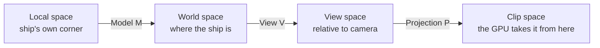

# 03 · The math you need 🧠

> **You'll leave this chapter with:** enough linear algebra to read every matrix
> in the project, an understanding of *why we orient ships with quaternions*, a
> line-by-line grip on `Math.hpp`, and — the Vulkan-specific part — the **three
> rules that differ from every OpenGL tutorial**: Y points down in NDC (fixed by
> the projection Y-flip), depth is 0..1, and shared structs obey std140 padding.

You do not need to love math to build this. You need four things: vectors, the
model/view/projection chain, quaternions for rotation, and the **GLM** library
that makes all of it one-liners. We'll take them in order, and end on the Vulkan
gotchas.

---

## Our conventions (pin these up)

Everything in the codebase obeys these five rules. Most 3D bugs are a violation
of one of them — and in Vulkan, rules 3 and 4 are where people who ported an
OpenGL matrix get a black screen.

1. **Right-handed world space.** +X is right, +Y is up, +Z points *toward* the
   viewer. So a ship's **forward is its local −Z**. (Point your right hand's
   fingers from +X to +Y; your thumb points +Z, out of the screen.)
2. **Column-major matrices.** A transform applies as `M * v`, and composition
   reads **right-to-left**: `translate * rotate * scale` scales first, rotates
   next, translates last. This is what GLM stores and what GLSL expects.
3. **Clip-space depth in [0, 1].** Vulkan's normalised depth runs 0 (near) to 1
   (far) — *not* OpenGL's −1…1. GLM defaults to the OpenGL range, so we **must**
   tell it otherwise (below), or every depth test is wrong.
4. **Vulkan NDC has +Y pointing *down*.** In clip space, `y = +1` is the *bottom*
   of the screen, `y = −1` the top — the opposite of OpenGL and Metal. Left
   unhandled, your whole world renders upside down. We fix it with one sign flip
   in the projection (below).
5. **Angles in radians.** GLM trig is radians; `glm::radians(deg)` converts from
   the degrees humans think in.

### Telling GLM the Vulkan rules

GLM is an OpenGL-shaped library. Two `#define`s, set **before** you include it,
retune it for Vulkan — put these at the top of `Math.hpp`:

```cpp
#define GLM_FORCE_RADIANS             // trig in radians (also GLM's modern default)
#define GLM_FORCE_DEPTH_ZERO_TO_ONE   // projection maps depth to [0,1], not [-1,1]  ← Vulkan
#include <glm/glm.hpp>
#include <glm/gtc/matrix_transform.hpp>
#include <glm/gtc/quaternion.hpp>
```

`GLM_FORCE_DEPTH_ZERO_TO_ONE` is the one nobody warns you about until the depth
buffer is a fighting mess. Rule 4 (the Y-flip) GLM *can't* fix for you, because
it doesn't know you're on Vulkan — you do it yourself, and we'll see exactly where.

---

## Vectors

A `glm::vec3` is a point or a direction. Two operations do almost all the work:

**Dot product** — `glm::dot(a, b)` — a single number that measures alignment. For
unit vectors it's the cosine of the angle between them: `1` same direction, `0`
perpendicular, `−1` opposite. Our lighting is one dot product: how aligned is a
surface normal with the direction to the light?

```
diffuse = max(dot(surfaceNormal, directionToLight), 0)
```

**Cross product** — `glm::cross(a, b)` — a new vector *perpendicular to both*. We
use it to build coordinate frames (the camera's right axis is `up × forward`) and
to find a rotation axis (to turn a homing enemy toward you, rotate about
`currentHeading × desiredHeading`).

**Length & normalize** — `glm::length(v)` gives magnitude; `glm::normalize(v)`
scales a vector to length 1 while keeping its direction. Directions should almost
always be normalized before you use them.

---

## Why matrices: one type for every transform

We want to move, rotate and scale geometry, and — crucially — *compose* those. A
4×4 matrix expresses all of it and composes by multiplication. The trick that
makes translation fit into a matrix is the **homogeneous coordinate**: we tack a
`w = 1` onto each 3D point, making it 4D. Now a matrix's last column can add a
translation, something a 3×3 can't do.

A model matrix has this anatomy:

```
| Rx  Ux  Fx  Tx |   the upper-left 3×3 is rotation × scale
| Ry  Uy  Fy  Ty |   (the object's right/up/forward axes, scaled)
| Rz  Uz  Fz  Tz |
|  0   0   0   1 |   the last column T is translation
```

`Transform::matrix()` builds exactly this via `Math::trs`:

```cpp
inline glm::mat4 trs(const glm::vec3& t, const glm::quat& r, const glm::vec3& s) {
    return glm::translate(glm::mat4(1.0f), t)   // read right-to-left:
         * glm::mat4_cast(r)                     //   scale, then rotate,
         * glm::scale(glm::mat4(1.0f), s);       //   then translate
}
```

`glm::mat4_cast(q)` is the quaternion→matrix conversion (more below). Because GLM
is column-major and multiplies `M * v`, this reads exactly like the Metal guide's
`translate * rotate * scale` — same convention, same order.

---

## The MVP chain: from a local corner to a screen pixel

A vertex of the ship mesh starts in **local space** (relative to the ship's own
origin). Three matrices carry it to the screen. This is *the* pipeline; memorise
its shape.



- **Model (M)** — places the mesh in the world: the ship's `Transform::matrix()`.
- **View (V)** — moves the world so the camera sits at the origin looking down
  −Z. Built by `Math::lookAt`.
- **Projection (P)** — applies perspective: far things shrink, and depth maps into
  [0, 1]. Built by `Math::perspective` — and this is where the Vulkan Y-flip
  lives.

The vertex shader does the multiply. We pre-multiply `P * V` on the CPU once per
frame (into `FrameUniforms.viewProjection`) so the shader is a single matrix per
vertex:

```glsl
gl_Position = frame.viewProjection * inst.model * vec4(inVertex.position, 1.0);
```

### Projection, derived — and the Y-flip

`Math::perspective` builds a right-handed, [0,1]-depth matrix and then applies the
one correction Vulkan needs:

```cpp
inline glm::mat4 perspective(float fovyRadians, float aspect, float near, float far) {
    glm::mat4 p = glm::perspectiveRH_ZO(fovyRadians, aspect, near, far);
    p[1][1] *= -1.0f;          // ← flip Y for Vulkan's downward NDC (rule 4)
    return p;
}
```

Two things are doing real work:

- **`perspectiveRH_ZO`** is the *explicit* GLM constructor: **R**ight-**H**anded,
  **Z**ero-to-**O**ne depth. Even with `GLM_FORCE_DEPTH_ZERO_TO_ONE` set, naming
  it removes all doubt. (The plain `glm::perspective` would inherit the define,
  but being explicit is cheap insurance.)
- **`p[1][1] *= -1`** is the famous Vulkan Y-flip. `p[1][1]` is the term that
  scales Y into clip space; negating it flips the axis so our +Y-up world lands
  right-side-up on Vulkan's +Y-down screen. It's *one character* of difference
  from an OpenGL projection, and forgetting it renders everything upside down with
  no error — validation can't catch "your world is inverted."

> **Two ways to flip, one chosen.** The other common fix is a **negative-height
> viewport** (`VkViewport.height = -extent.height`, with `y` offset to match),
> which flips Y at rasterisation instead of in the matrix. Both are correct and
> standard; we flip the matrix because it keeps the fix in one readable place —
> `Math::perspective` — instead of in the render loop. Pick one and never mix
> them, or the two flips cancel and you're upside down again.

Beyond the flip, feel two things rather than memorise them: a **narrower FOV zooms
in** (a bigger Y scale), and dividing by `aspect` is what stops the image
stretching when you resize the window. We pass the live window aspect every frame
from `Game::update`.

### View, derived

`Math::lookAt(eye, center, up)` builds an orthonormal camera frame and its
inverse in one shot. GLM's right-handed `lookAt` does exactly what we want:

```cpp
inline glm::mat4 lookAt(const glm::vec3& eye, const glm::vec3& center, const glm::vec3& up) {
    return glm::lookAtRH(eye, center, up);
}
```

Under the hood it computes the camera's axes — `forward = normalize(center − eye)`,
`right = normalize(cross(forward, up))`, `trueUp = cross(right, forward)` — and
packs them (plus a translation that undoes the eye position) into a matrix.
Multiplying a world point by it expresses that point *relative to the camera* —
exactly what projection expects. Chapter 11 uses it. Note the view matrix needs
**no** Vulkan-specific fix; the whole clip-space adjustment lives in the
projection.

---

## Rotation: quaternions, not Euler angles

Here's the one genuinely non-obvious choice in the project — and it's identical to
the Metal guide, because the math doesn't care what API draws it.

The tempting way to store orientation is three angles — pitch, yaw, roll. It's
readable and it's a trap. Applying three sequential angle-rotations has a failure
mode called **gimbal lock**: at certain orientations (nose straight up), two of
your three axes line up and you lose a degree of freedom — the ship gets stuck or
snaps. Interpolating Euler angles is also ugly. A flight game, where the ship
pitches and rolls through *every* orientation, hits these constantly.

A **quaternion** stores orientation as four numbers `(x, y, z, w)` — think of it
as "an axis and an amount of spin about it," encoded so that composition is just
multiplication. It has none of the pathologies:

- **No gimbal lock.** Every orientation has a clean representation.
- **Composes by multiplication.** "Then rotate a bit more" is `q * delta`.
- **Interpolates smoothly** (`glm::slerp`), which matters the moment you want a
  camera or missile to ease toward a target.

GLM gives us `glm::quat` with everything we need:

```cpp
glm::angleAxis(theta, glm::vec3(1,0,0));  // a rotation: angle θ about an axis
q1 * q2;                                   // compose (apply q2 in q1's frame)
q * glm::vec3(0,0,-1);                      // rotate a vector — here, "which way is forward?"
glm::normalize(q);                          // keep it unit after many multiplies
```

That last one matters: repeatedly multiplying quaternions accumulates tiny
floating-point error, so we renormalise after each update (see
`FlightControlSystem`, chapter 10).

### Local-space rotation, the heart of the flight feel

When you pitch the ship, you want it to pitch about *its own* wings, not the
world's X axis. That's the difference between `q * delta` and `delta * q`:

```cpp
// FlightControlSystem: build this frame's tumble from pitch/yaw/roll...
glm::quat delta = glm::angleAxis(pitch*dt, glm::vec3(1,0,0))
                * glm::angleAxis(yaw*dt,   glm::vec3(0,1,0))
                * glm::angleAxis(roll*dt,  glm::vec3(0,0,1));
// ...and apply it on the RIGHT, so it's relative to the current orientation.
t.rotation = glm::normalize(t.rotation * delta);
```

Multiplying on the right means "in the ship's local frame." Roll ninety degrees
and now "pitch up" tilts you sideways — exactly what a real aircraft does, and
what makes the controls feel like flying rather than steering a cursor. (GLM's
quaternion multiplication uses the same "apply the right operand first" convention
as Metal's `simd_quatf`, so this line is a character-for-character port.)

### From quaternion to matrix

The vertex shader wants a matrix, so `Transform::matrix()` calls
`glm::mat4_cast(rotation)` — the classic quaternion→3×3 expansion, padded to 4×4:

```
mat3 R = | 1-2(yy+zz)   2(xy-wz)    2(xz+wy)  |
         | 2(xy+wz)    1-2(xx+zz)   2(yz-wx)  |
         | 2(xz-wy)     2(yz+wx)   1-2(xx+yy) |
```

You never have to derive that expansion; you just have to know *this* is where
orientation becomes a matrix the GPU can use. And for "which way am I pointing?",
we skip the matrix entirely and rotate the forward vector directly:
`forward = glm::normalize(rotation * glm::vec3(0,0,-1))`.

---

## GLM, and the std140/std430 layout you must respect

GLM gives us `glm::vec3`, `glm::vec4`, `glm::mat4`, `glm::quat` and their
operators, mapping to tight vector code **and** — mostly — matching the memory
layout GLSL expects. That "mostly" is a Vulkan trap worth stating now, because
it's the sibling of Metal's `float3`-alignment warning and it *will* bite once.

GLSL's uniform blocks use **std140** rules (storage blocks use **std430**), and
under std140 a `vec3` is aligned to **16 bytes**, and any struct member is aligned
to its own size. Put a lone `float` right after a `vec3` and the CPU-side
`glm::vec3` (12 bytes) and the GLSL `vec3` (padded to 16) disagree about where the
next field starts — instant garbage in the shader, with no error. The rule that
saves you, which our render structs follow:

- **Pad `vec3`s to `vec4`** in any struct shared with a shader, and keep `mat4`s
  (already 16-aligned) and `vec4`s as they are.
- Our `FrameUniforms` uses `vec4` for `cameraPosition` and `lightDirection` for
  exactly this reason (chapter 07 lays the structs out in full and revisits this).

```cpp
using Vec3 = glm::vec3;   using Vec4 = glm::vec4;
using Mat4 = glm::mat4;    using Quat = glm::quat;
```

If you ever change a shared struct and the shader reads noise, this alignment
mismatch is almost always why.

---

## The one-screen summary

- **Directions:** dot = alignment (and our lighting); cross = a perpendicular
  (and our coordinate frames). Normalize directions.
- **Transforms:** `translate * rotate * scale`, applied right-to-left; the MVP
  chain carries a vertex local → world → view → clip.
- **Orientation is a quaternion**, integrated as `q = normalize(q * delta)` in the
  ship's local frame — that's the flight feel, and it's gimbal-lock-free.
- **The three Vulkan rules:** `GLM_FORCE_DEPTH_ZERO_TO_ONE` for 0..1 depth,
  `p[1][1] *= -1` for the Y-flip, and pad `vec3`→`vec4` in shared structs. Get
  these once and they stay gotten.

---

**Next:** with math in hand, we build the engine core. →
[Chapter 04: Designing the ECS](04-designing-the-ecs.md)
