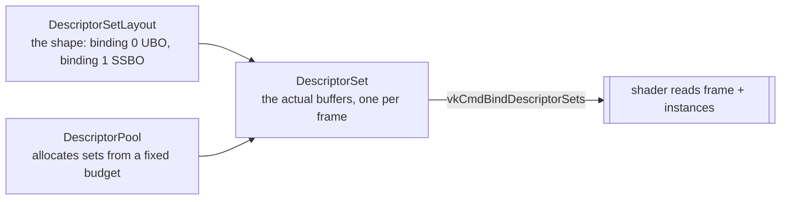

# 06 · Buffers, memory (VMA) & descriptors 🛠️

> **You'll leave this chapter with:** every byte of GPU memory this game uses,
> allocated and reachable. **VMA** doing the allocating, the difference between
> **device-local** buffers filled through a **staging** copy and **host-visible**
> buffers written directly, and the descriptor machinery — **set layout, pool,
> sets** — that finally connects a buffer to a shader.
>
> **Files created:** none. `src/render/Renderer.{hpp,cpp}` grow.

Nothing new appears on screen this chapter. What appears is the memory everything
after it lives in.

---

## Where should this buffer live?

A discrete GPU has its own fast VRAM across a bus, and **the fastest memory for the
GPU is often not visible to the CPU at all.** So Vulkan makes you decide, per
buffer, where the memory lives and how it is reached. Two answers cover everything
we need:

- **Static geometry** — mesh vertices and indices, uploaded once and read every
  frame. These want **device-local** memory: fast for the GPU, unreachable from the
  CPU. Getting data in means a temporary **staging buffer** and a GPU-side copy.
- **Per-frame data** — the camera matrices, the instance array, the HUD vertices.
  These change every single frame, so round-tripping them through staging would be
  absurd. They live in **host-visible, permanently mapped** memory that the CPU
  writes into directly.

Raw Vulkan makes both fiddly: you query memory *types*, match one against your
buffer's requirements, and call `vkAllocateMemory` — except real GPUs cap the
*number* of allocations, so you are also expected to sub-allocate many buffers out
of a few big blocks. **VMA**, which chapter 02 already created an allocator for,
does all of that behind one call.

---

## A buffer, and one way to make one

**`Renderer.hpp`** — before `struct FrameSync`:

```diff
 constexpr int MAX_FRAMES_IN_FLIGHT = 2;
+
+/// A VkBuffer plus the VMA allocation backing it. `mapped` is non-null only for
+/// buffers we asked VMA to keep permanently mapped.
+struct Buffer {
+    VkBuffer buffer = VK_NULL_HANDLE;
+    VmaAllocation alloc = VK_NULL_HANDLE;
+    void* mapped = nullptr;
+};
 
 struct FrameSync {
```

A `VkBuffer` on its own is just a *description* of some bytes — a size and a set of
usage flags — with no memory behind it. Pairing it with its `VmaAllocation` in one
struct means we can never destroy one and leak the other.

**`Renderer.hpp`** — after `MAX_FRAMES_IN_FLIGHT`:

```diff
 constexpr int MAX_FRAMES_IN_FLIGHT = 2;
+constexpr uint32_t kMaxInstances = 4096;
+constexpr uint32_t kMaxHudVertices = 4096;
```

Both are fixed ceilings, and both are a labelled shortcut. We size each per-frame
buffer once, at its maximum, and never grow it — which is fine at our entity counts
and would not be in a real engine. Chapter 14 says what growing them looks like.

The buffers need types from the shared-struct header, and the allocation helper
takes a callable:

**`Renderer.hpp`** — in the include block, before `Swapchain.hpp`:

```diff
 #pragma once
 
+#include "render/RenderTypes.hpp"
 #include "render/Swapchain.hpp"
 #include "render/VulkanContext.hpp"
 
 #include <array>
+#include <functional>
+#include <vector>
```

**`Renderer.hpp`**, in `class Renderer` — after `recordFrame`:

```diff
     void recordFrame(VkCommandBuffer cmd, uint32_t imageIndex);
+
+    Buffer createBuffer(VkDeviceSize size, VkBufferUsageFlags usage,
+                        VmaAllocationCreateFlags flags);
+    void destroyBuffer(Buffer& b);
+    void immediateSubmit(const std::function<void(VkCommandBuffer)>& record);
+    Buffer uploadStatic(const void* data, VkDeviceSize size, VkBufferUsageFlags usage);
+    void createPerFrameBuffers();
+    void createDescriptors();
```

**`Renderer.hpp`**, in `class Renderer` — after the `sync` member:

```diff
     std::array<FrameSync, MAX_FRAMES_IN_FLIGHT> sync{};
+
+    std::array<Buffer, MAX_FRAMES_IN_FLIGHT> uniformBuffers{};
+    std::array<Buffer, MAX_FRAMES_IN_FLIGHT> instanceBuffers{};
+    std::array<Buffer, MAX_FRAMES_IN_FLIGHT> hudBuffers{};
+
+    VkDescriptorSetLayout setLayout = VK_NULL_HANDLE;
+    VkDescriptorPool descriptorPool = VK_NULL_HANDLE;
+    std::array<VkDescriptorSet, MAX_FRAMES_IN_FLIGHT> descriptorSets{};
 
     uint32_t currentFrame = 0;
```

Look at what is `MAX_FRAMES_IN_FLIGHT`-sized and what isn't. **Three buffers and a
descriptor set per frame slot**; one layout and one pool shared. That split is the
memory half of chapter 05.B's frames-in-flight: while the GPU reads frame *N*'s
uniform buffer, the CPU is writing frame *N+1*'s. One shared buffer would corrupt
the frame that is still in flight — you'd see the camera jitter, and you would spend
a long time blaming the camera.

Now the implementation.

**`Renderer.cpp`** — after `createSyncObjects`:

```diff
         vkCheck(vkCreateFence(ctx->device, &fci, nullptr, &s.inFlight), "vkCreateFence");
     }
 }
+
+Buffer Renderer::createBuffer(VkDeviceSize size, VkBufferUsageFlags usage,
+                              VmaAllocationCreateFlags flags) {
+    VkBufferCreateInfo bi{};
+    bi.sType = VK_STRUCTURE_TYPE_BUFFER_CREATE_INFO;
+    bi.size = size;
+    bi.usage = usage;
+    bi.sharingMode = VK_SHARING_MODE_EXCLUSIVE;
+
+    VmaAllocationCreateInfo ai{};
+    ai.usage = VMA_MEMORY_USAGE_AUTO;
+    ai.flags = flags;
+
+    Buffer b;
+    VmaAllocationInfo info{};
+    vkCheck(vmaCreateBuffer(ctx->allocator, &bi, &ai, &b.buffer, &b.alloc, &info),
+            "vmaCreateBuffer");
+    b.mapped = info.pMappedData;
+    return b;
+}
```

`vmaCreateBuffer` creates the `VkBuffer`, allocates or sub-allocates memory for it,
and binds the two — the three-step raw dance in one call.
`VMA_MEMORY_USAGE_AUTO` means "infer the memory type", and what it infers from is
the pair of flags we pass: the *buffer* usage says what the GPU will do with it, and
the *allocation* flags say what the CPU needs. Ask for nothing CPU-side and you get
device-local; ask for host access and you get memory you can write.

`info.pMappedData` is only non-null when we asked for a persistently mapped
allocation, which makes `Buffer::mapped` a reliable "can I `memcpy` into this?"

**`Renderer.cpp`** — after `createBuffer`:

```diff
     b.mapped = info.pMappedData;
     return b;
 }
+
+void Renderer::destroyBuffer(Buffer& b) {
+    if (b.buffer) vmaDestroyBuffer(ctx->allocator, b.buffer, b.alloc);
+    b = {};
+}
```

`b = {}` resets all three fields, so a double `destroyBuffer` is harmless — which
matters because chapter 08's meshes have an index buffer that is sometimes null.

---

## Getting data into device-local memory

Device-local memory is the fast stuff the CPU usually cannot write. The way in is a
one-time GPU copy, which needs a command buffer, which needs somewhere to submit it.

**`Renderer.cpp`** — after `destroyBuffer`:

```diff
     if (b.buffer) vmaDestroyBuffer(ctx->allocator, b.buffer, b.alloc);
     b = {};
 }
+
+/// Allocate a throwaway command buffer, record `record` into it, submit, and
+/// block until the GPU is done. Only ever used at startup.
+void Renderer::immediateSubmit(const std::function<void(VkCommandBuffer)>& record) {
+    VkCommandBufferAllocateInfo ai{};
+    ai.sType = VK_STRUCTURE_TYPE_COMMAND_BUFFER_ALLOCATE_INFO;
+    ai.commandPool = commandPool;
+    ai.level = VK_COMMAND_BUFFER_LEVEL_PRIMARY;
+    ai.commandBufferCount = 1;
+
+    VkCommandBuffer cmd = VK_NULL_HANDLE;
+    vkCheck(vkAllocateCommandBuffers(ctx->device, &ai, &cmd), "vkAllocateCommandBuffers");
+}
```

**`Renderer.cpp`**, in `immediateSubmit` — after the allocation:

```diff
     vkCheck(vkAllocateCommandBuffers(ctx->device, &ai, &cmd), "vkAllocateCommandBuffers");
+
+    VkCommandBufferBeginInfo bi{};
+    bi.sType = VK_STRUCTURE_TYPE_COMMAND_BUFFER_BEGIN_INFO;
+    bi.flags = VK_COMMAND_BUFFER_USAGE_ONE_TIME_SUBMIT_BIT;
+    vkCheck(vkBeginCommandBuffer(cmd, &bi), "vkBeginCommandBuffer");
+    record(cmd);
+    vkCheck(vkEndCommandBuffer(cmd), "vkEndCommandBuffer");
+
+    VkSubmitInfo submit{};
+    submit.sType = VK_STRUCTURE_TYPE_SUBMIT_INFO;
+    submit.commandBufferCount = 1;
+    submit.pCommandBuffers = &cmd;
+    vkCheck(vkQueueSubmit(ctx->graphicsQueue, 1, &submit, VK_NULL_HANDLE), "vkQueueSubmit");
+    vkQueueWaitIdle(ctx->graphicsQueue);
+
+    vkFreeCommandBuffers(ctx->device, commandPool, 1, &cmd);
 }
```

Note what this submit does **not** have: semaphores, and a fence. Instead it calls
`vkQueueWaitIdle`, which blocks the CPU until the entire queue is empty. That is
the crudest synchronization in the whole project, and it is correct here for a
reason worth naming — this only ever runs at startup, before the frame loop exists,
so there is nothing to stall. Call it mid-frame and you have thrown away everything
chapter 05.B built.

`ONE_TIME_SUBMIT_BIT` tells the driver the buffer will be submitted once and
discarded, which lets it skip preparing for a re-submit.

**`Renderer.cpp`** — after `immediateSubmit`:

```diff
     vkFreeCommandBuffers(ctx->device, commandPool, 1, &cmd);
 }
+
+/// Fill a device-local buffer through a temporary host-visible staging buffer.
+Buffer Renderer::uploadStatic(const void* data, VkDeviceSize size, VkBufferUsageFlags usage) {
+    Buffer staging = createBuffer(size, VK_BUFFER_USAGE_TRANSFER_SRC_BIT,
+                                  VMA_ALLOCATION_CREATE_HOST_ACCESS_SEQUENTIAL_WRITE_BIT
+                                      | VMA_ALLOCATION_CREATE_MAPPED_BIT);
+    std::memcpy(staging.mapped, data, size_t(size));
+    vkCheck(vmaFlushAllocation(ctx->allocator, staging.alloc, 0, VK_WHOLE_SIZE),
+            "vmaFlushAllocation");
+}
```

Three flags, three jobs. `TRANSFER_SRC_BIT` is the *buffer* usage: this is
something we copy out of. `HOST_ACCESS_SEQUENTIAL_WRITE_BIT` tells VMA the CPU will
write it front to back and never read it, which lets it pick write-combined memory.
`MAPPED_BIT` asks for it to stay mapped so `staging.mapped` is usable.

That `vmaFlushAllocation` is easy to skip and free to include.
`HOST_ACCESS_SEQUENTIAL_WRITE` does **not** guarantee `HOST_COHERENT` memory, and on
non-coherent memory the CPU's writes are not visible to the GPU until flushed. On
desktop, the memory you actually get is almost always coherent — which makes the
flush a no-op there, and makes the bug invisible right up until the day you run on
hardware where it isn't. Flush after every write to a mapped allocation and the
question never comes up.

**`Renderer.cpp`**, in `uploadStatic` — after the flush:

```diff
     vkCheck(vmaFlushAllocation(ctx->allocator, staging.alloc, 0, VK_WHOLE_SIZE),
             "vmaFlushAllocation");
+
+    Buffer dst = createBuffer(size, usage | VK_BUFFER_USAGE_TRANSFER_DST_BIT, 0);
+
+    immediateSubmit([&](VkCommandBuffer cmd) {
+        VkBufferCopy region{0, 0, size};
+        vkCmdCopyBuffer(cmd, staging.buffer, dst.buffer, 1, &region);
+    });
+
+    destroyBuffer(staging);
+    return dst;
 }
```

The destination takes `0` allocation flags — no host access requested — which is
what makes VMA choose device-local. It also needs `TRANSFER_DST_BIT` on top of its
real usage, because "can be copied into" is a capability you declare up front like
every other.

`Renderer.cpp` needs one more header for the `memcpy`:

**`Renderer.cpp`** — after the `Renderer.hpp` include:

```diff
 #include "render/Renderer.hpp"
+
+#include <cstring>
```

---

## Per-frame data: mapped and written directly

`FrameUniforms`, the instance array and the HUD vertices change every frame, so
they skip staging entirely.

**`Renderer.cpp`** — after `uploadStatic`:

```diff
     destroyBuffer(staging);
     return dst;
 }
+
+void Renderer::createPerFrameBuffers() {
+    const VmaAllocationCreateFlags hostWrite =
+        VMA_ALLOCATION_CREATE_HOST_ACCESS_SEQUENTIAL_WRITE_BIT | VMA_ALLOCATION_CREATE_MAPPED_BIT;
+
+    for (int i = 0; i < MAX_FRAMES_IN_FLIGHT; i++) {
+        uniformBuffers[i] = createBuffer(sizeof(FrameUniforms),
+                                         VK_BUFFER_USAGE_UNIFORM_BUFFER_BIT, hostWrite);
+        instanceBuffers[i] = createBuffer(sizeof(InstanceData) * kMaxInstances,
+                                          VK_BUFFER_USAGE_STORAGE_BUFFER_BIT, hostWrite);
+        hudBuffers[i] = createBuffer(sizeof(HUDVertex) * kMaxHudVertices,
+                                     VK_BUFFER_USAGE_VERTEX_BUFFER_BIT, hostWrite);
+    }
+}
```

Three different buffer usages, and the choice of each is a real decision.
`FrameUniforms` is 96 bytes read identically by every vertex — a **uniform buffer**,
which GPUs can put in fast constant caches. The instance array is 4096 × 80 bytes
indexed per-instance by the shader — a **storage buffer**, because uniform buffers
have a size limit (guaranteed only 16 KB) that 320 KB blows straight past. The HUD
is a **vertex buffer** because it goes through vertex input like any other geometry.

On a discrete GPU this memory is a little slower for the GPU to read than
device-local would be. For small data written once per frame that is the right
trade, and on integrated GPUs it is the same memory anyway.

---

## Descriptors: telling the shader where the buffers are

A shader cannot reach a `VkBuffer` directly. A **descriptor** binds a resource to a
`set`/`binding` slot the shader names, and Vulkan builds this in three layers.



### 1. The layout — the shape of the inputs

**`Renderer.cpp`** — after `createPerFrameBuffers`:

```diff
                                      VK_BUFFER_USAGE_VERTEX_BUFFER_BIT, hostWrite);
     }
 }
+
+void Renderer::createDescriptors() {
+    VkDescriptorSetLayoutBinding bindings[2]{};
+    bindings[0].binding = 0;
+    bindings[0].descriptorType = VK_DESCRIPTOR_TYPE_UNIFORM_BUFFER;
+    bindings[0].descriptorCount = 1;
+    bindings[0].stageFlags = VK_SHADER_STAGE_VERTEX_BIT | VK_SHADER_STAGE_FRAGMENT_BIT;
+    bindings[1].binding = 1;
+    bindings[1].descriptorType = VK_DESCRIPTOR_TYPE_STORAGE_BUFFER;
+    bindings[1].descriptorCount = 1;
+    bindings[1].stageFlags = VK_SHADER_STAGE_VERTEX_BIT;
+
+    VkDescriptorSetLayoutCreateInfo li{};
+    li.sType = VK_STRUCTURE_TYPE_DESCRIPTOR_SET_LAYOUT_CREATE_INFO;
+    li.bindingCount = 2;
+    li.pBindings = bindings;
+    vkCheck(vkCreateDescriptorSetLayout(ctx->device, &li, nullptr, &setLayout),
+            "vkCreateDescriptorSetLayout");
+}
```

These two bindings are a contract with GLSL you have not written yet. In chapter
07.A `lit.vert` will say `layout(set = 0, binding = 0) uniform FrameUniforms` and
`layout(set = 0, binding = 1) readonly buffer Instances` — the numbers and the
types have to line up on both sides or validation rejects the pipeline.

`stageFlags` is a real optimisation, not paperwork: binding 0 is visible to both
stages because `lit.frag` reads the light direction from it, while binding 1 is
vertex-only because nothing in a fragment shader ever looks at an instance matrix.
Naming the narrower set lets the driver bind less.

### 2. The pool — a budget, sized up front

**`Renderer.cpp`**, in `createDescriptors` — after the layout:

```diff
     vkCheck(vkCreateDescriptorSetLayout(ctx->device, &li, nullptr, &setLayout),
             "vkCreateDescriptorSetLayout");
+
+    VkDescriptorPoolSize sizes[2]{};
+    sizes[0] = {VK_DESCRIPTOR_TYPE_UNIFORM_BUFFER, MAX_FRAMES_IN_FLIGHT};
+    sizes[1] = {VK_DESCRIPTOR_TYPE_STORAGE_BUFFER, MAX_FRAMES_IN_FLIGHT};
+
+    VkDescriptorPoolCreateInfo pi{};
+    pi.sType = VK_STRUCTURE_TYPE_DESCRIPTOR_POOL_CREATE_INFO;
+    pi.poolSizeCount = 2;
+    pi.pPoolSizes = sizes;
+    pi.maxSets = MAX_FRAMES_IN_FLIGHT;
+    vkCheck(vkCreateDescriptorPool(ctx->device, &pi, nullptr, &descriptorPool),
+            "vkCreateDescriptorPool");
 }
```

The pool does not describe the *layout*; it describes the **total budget** across
every set that will ever be allocated from it. Two sets, each holding one uniform
and one storage descriptor, means two of each and room for two sets. Writing
`MAX_FRAMES_IN_FLIGHT` rather than `2` is the point: change the frame count and the
pool follows.

Over-running that budget is one of the friendlier Vulkan failures — you get
`VK_ERROR_OUT_OF_POOL_MEMORY` from `vkAllocateDescriptorSets`, or, on an
implementation that chooses to be generous, nothing at all. Since Vulkan 1.1 it is
explicitly *allowed* to succeed, so this is one place you cannot rely on the layers
to catch you.

### 3. The sets — one per frame

**`Renderer.cpp`**, in `createDescriptors` — after the pool:

```diff
     vkCheck(vkCreateDescriptorPool(ctx->device, &pi, nullptr, &descriptorPool),
             "vkCreateDescriptorPool");
+
+    std::array<VkDescriptorSetLayout, MAX_FRAMES_IN_FLIGHT> layouts;
+    layouts.fill(setLayout);
+
+    VkDescriptorSetAllocateInfo ai{};
+    ai.sType = VK_STRUCTURE_TYPE_DESCRIPTOR_SET_ALLOCATE_INFO;
+    ai.descriptorPool = descriptorPool;
+    ai.descriptorSetCount = MAX_FRAMES_IN_FLIGHT;
+    ai.pSetLayouts = layouts.data();
+    vkCheck(vkAllocateDescriptorSets(ctx->device, &ai, descriptorSets.data()),
+            "vkAllocateDescriptorSets");
 }
```

Every frame slot uses the same *shape*, so `layouts` is the one layout repeated —
`vkAllocateDescriptorSets` wants an array parallel to the sets it produces.

### Pointing the sets at real buffers

Allocating a set gets you an empty slot. `vkUpdateDescriptorSets` is what finally
connects buffer to binding.

**`Renderer.cpp`**, in `createDescriptors` — after `vkAllocateDescriptorSets`:

```diff
     vkCheck(vkAllocateDescriptorSets(ctx->device, &ai, descriptorSets.data()),
             "vkAllocateDescriptorSets");
+
+    for (int i = 0; i < MAX_FRAMES_IN_FLIGHT; i++) {
+        VkDescriptorBufferInfo ubo{uniformBuffers[i].buffer, 0, sizeof(FrameUniforms)};
+        VkDescriptorBufferInfo ssbo{instanceBuffers[i].buffer, 0, VK_WHOLE_SIZE};
+    }
 }
```

**`Renderer.cpp`**, in `createDescriptors` — inside that loop, after `ssbo`:

```diff
         VkDescriptorBufferInfo ssbo{instanceBuffers[i].buffer, 0, VK_WHOLE_SIZE};
+
+        VkWriteDescriptorSet writes[2]{};
+        writes[0].sType = VK_STRUCTURE_TYPE_WRITE_DESCRIPTOR_SET;
+        writes[0].dstSet = descriptorSets[i];
+        writes[0].dstBinding = 0;
+        writes[0].descriptorCount = 1;
+        writes[0].descriptorType = VK_DESCRIPTOR_TYPE_UNIFORM_BUFFER;
+        writes[0].pBufferInfo = &ubo;
+        writes[1].sType = VK_STRUCTURE_TYPE_WRITE_DESCRIPTOR_SET;
+        writes[1].dstSet = descriptorSets[i];
+        writes[1].dstBinding = 1;
+        writes[1].descriptorCount = 1;
+        writes[1].descriptorType = VK_DESCRIPTOR_TYPE_UNIFORM_BUFFER;
+        writes[1].pBufferInfo = &ssbo;
+
+        vkUpdateDescriptorSets(ctx->device, 2, writes, 0, nullptr);
     }
```

`descriptorSets[i]` is paired with `uniformBuffers[i]` and `instanceBuffers[i]`,
and that pairing is the whole design: bind set *i* and the shader automatically
reads frame slot *i*'s data, with no per-frame descriptor churn at all.

`VK_WHOLE_SIZE` on the storage buffer means "from offset 0 to the end". The uniform
gets an explicit `sizeof` because it is exactly one struct and being specific lets
validation catch a size mismatch against the shader's block.

Call the two new steps from `init` and run it:

**`Renderer.cpp`**, in `Renderer::init` — after `createSyncObjects`:

```diff
     createCommandResources();
     createSyncObjects();
+    createPerFrameBuffers();
+    createDescriptors();
 }
```

```console
$ cmake --build build && cd build && ./SpaceFighter
[vulkan] using NVIDIA GeForce RTX 4070 (Vulkan 1.3)
[vulkan] Validation Error: [ VUID-VkWriteDescriptorSet-descriptorType-00319 ]
   vkUpdateDescriptorSets(): pDescriptorWrites[1].descriptorType
   (VK_DESCRIPTOR_TYPE_UNIFORM_BUFFER) is different from pBinding[1].descriptorType
   (VK_DESCRIPTOR_TYPE_STORAGE_BUFFER) …
[vulkan] Validation Error: [ VUID-VkWriteDescriptorSet-descriptorType-00330 ]
   … pBufferInfo[0].buffer was created with VK_BUFFER_USAGE_2_STORAGE_BUFFER_BIT_KHR,
   but descriptorType is VK_DESCRIPTOR_TYPE_UNIFORM_BUFFER …
[vulkan] Validation Error: [ VUID-VkWriteDescriptorSet-descriptorType-00332 ]
   … the effective range [size (327680) - offset (0) = 327680] is greater than
   maxUniformBufferRange (65536) for descriptorType VK_DESCRIPTOR_TYPE_UNIFORM_BUFFER …
[swapchain] 1280x720  format 50  3 images
```

That is what a copy-paste slip looks like: `writes[1]` was cloned from `writes[0]`
and its `descriptorType` never updated. It is the single most common mistake in
this function, and it costs nothing to make, because the two structs are identical
in every other respect.

Read the three complaints in order, because they build an argument:

1. The write's type doesn't match the **layout's** binding type. That's the direct
   contradiction, and on its own it might read as pedantry.
2. The **buffer** was created with storage-buffer usage, so it could not serve as a
   uniform buffer even if the layout agreed. Usage flags are declared at creation
   and there is no reinterpreting later.
3. And the reason we chose a storage buffer in the first place, stated by the
   driver: 327,680 bytes is far past `maxUniformBufferRange`, which is **65,536**
   here and guaranteed to be only 16,384. The instance array *cannot* be a uniform
   buffer. That limit is exactly why `createPerFrameBuffers` asks for
   `STORAGE_BUFFER_BIT`, and now you have the number.

One word fixes it:

**`Renderer.cpp`**, in `createDescriptors` — correct the second write's type:

```diff
         writes[1].descriptorCount = 1;
-        writes[1].descriptorType = VK_DESCRIPTOR_TYPE_UNIFORM_BUFFER;
+        writes[1].descriptorType = VK_DESCRIPTOR_TYPE_STORAGE_BUFFER;
         writes[1].pBufferInfo = &ssbo;
```

Note the HUD buffer is not in here. It is bound as a **vertex buffer** with
`vkCmdBindVertexBuffers` (chapter 13), not read through a descriptor — different
mechanism, no descriptor needed.

---

## Push constants: the small-data fast path

Descriptors are right for buffers and heavy for a handful of bytes. For those,
Vulkan has **push constants** — a tiny block (guaranteed at least 128 bytes)
written straight into the command buffer, with no descriptor, no allocation and no
buffer at all.

We use exactly one, for the starfield's tiling `span` (chapter 08's `StarParams`
from `RenderTypes.hpp`). The declaration lives on the pipeline layout, which
chapter 07.B builds; the write is one `vkCmdPushConstants` call at draw time.

Rule of thumb: **push constants for a few bytes that change per draw; descriptors
for anything array-sized or shared.** `FrameUniforms` at 96 bytes would *fit* in
push constants, but binding it as a UBO is the more teachable choice and leaves the
push-constant budget — which is small and shared across all stages — free.

---

## Teardown

**`Renderer.cpp`**, in `Renderer::destroy` — before the `sync` loop:

```diff
 void Renderer::destroy() {
     vkDeviceWaitIdle(ctx->device);
 
+    if (descriptorPool) vkDestroyDescriptorPool(ctx->device, descriptorPool, nullptr);
+    if (setLayout) vkDestroyDescriptorSetLayout(ctx->device, setLayout, nullptr);
+
+    for (int i = 0; i < MAX_FRAMES_IN_FLIGHT; i++) {
+        destroyBuffer(uniformBuffers[i]);
+        destroyBuffer(instanceBuffers[i]);
+        destroyBuffer(hudBuffers[i]);
+    }
+
     for (FrameSync& s : sync) {
```

Destroying the pool frees every set allocated from it — there is no
`vkFreeDescriptorSets` here and there does not need to be.

---

## Checkpoint

```console
$ cmake --build build && cd build && ./SpaceFighter
[vulkan] using NVIDIA GeForce RTX 4070 (Vulkan 1.3)
[swapchain] 1280x720  format 50  3 images
```

The same deep space blue window as last chapter, and — the actual result — **still
no validation output**, on the way in, during the run, or at exit. You have just
allocated three buffers per frame slot, a descriptor pool, two descriptor sets and
four descriptor writes, and the layers have nothing to say about any of it.

| Symptom | Likely cause |
|---|---|
| `VK_ERROR_OUT_OF_POOL_MEMORY` | `maxSets` or a pool size is smaller than `MAX_FRAMES_IN_FLIGHT`. Note some drivers succeed anyway — don't rely on hitting this. |
| `VUID-VkWriteDescriptorSet-descriptorType-00319` | A write's `descriptorType` disagrees with its layout binding. |
| Validation: "descriptor set was destroyed" at exit | `destroy()` frees the pool after the buffers rather than before, or the order got reversed. |
| Validation: "VkBuffer has not been destroyed" | A `destroyBuffer` call is missing from the teardown loop — all three arrays need one. |
| `memcpy` into a null pointer, crash at startup | `MAPPED_BIT` missing from `hostWrite`, so `mapped` stayed null. Nothing warns; it is a plain segfault. |
| `vmaCreateBuffer failed with VkResult -2` | `-2` is `OUT_OF_DEVICE_MEMORY`. `kMaxInstances` set very large — 4096 × 80 bytes is 320 KB, but a slipped zero is 3 MB per frame slot. |

**Try breaking it on purpose.** In `createPerFrameBuffers`, drop
`VMA_ALLOCATION_CREATE_MAPPED_BIT` from `hostWrite` and rebuild. Startup still
succeeds and the window still comes up blue — because nothing has tried to write
into those buffers yet. The crash arrives in chapter 08, in a `memcpy`, five
hundred lines from the flag that caused it. Put it back, and note the shape of it:
**allocation flags fail late.**

---

## Challenge

Make the instance buffer grow on demand instead of being capped at
`kMaxInstances`, so a scene with 10,000 entities doesn't silently drop the overflow.

Three things to get right. The buffer is referenced by a **descriptor set** written
once at startup, so reallocating it means re-running `vkUpdateDescriptorSets` for
that frame slot — a new `VkBuffer` handle in an old descriptor is a use-after-free
the layers will catch loudly. You can only safely resize slot *i*'s buffer after
that slot's fence has been waited on, which means the resize belongs inside
`drawFrame` after step 1, not wherever the count is discovered. And decide on a
growth policy: doubling wastes memory on a one-frame spike, exact-fit reallocates
every frame during a fight, and either is fine as long as you picked it on purpose.

---

**Next:** the programs that run on the GPU — GLSL, SPIR-V, and the four shader
pairs. → [Chapter 07.A: Shaders & SPIR-V](07.A-shaders-and-spirv.md)
