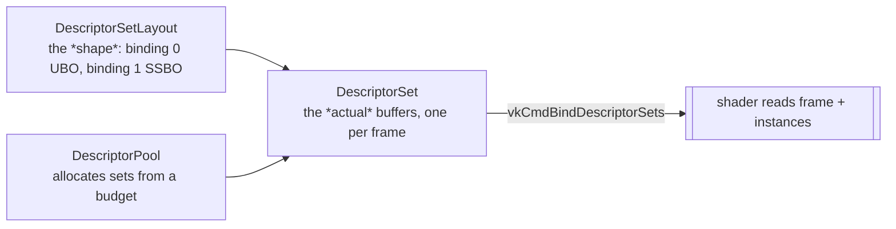

# 07 · Buffers, memory (VMA) & descriptors 🛠️

> **You'll leave this chapter with:** the CPU↔GPU struct-layout contract in
> Vulkan's std140/std430 rules, **VMA** doing the allocating, the difference
> between **device-local** buffers (filled through a **staging** copy) and
> **host-visible** buffers and when to use each, and the descriptor machinery — **set layouts, pools, sets and push
> constants** — that finally connects a buffer to a shader. This is where the
> uniforms and instancing of chapters 03 and 06 become real memory.

Metal ran on Apple silicon's *unified memory*, so a buffer the CPU wrote was a
buffer the GPU read — `.storageModeShared`, done. Desktop Vulkan can't assume
that: a discrete GPU has its own fast VRAM across a bus, and the fastest memory
for the GPU is often *not* visible to the CPU at all. So Vulkan makes you decide,
per buffer, **where the memory lives and how it's reached** — and gives you VMA to
handle the fiddly parts.

---

## Three structs the CPU and shader must agree on

The shaders read our C++ data straight out of buffers, so the memory layout has to
match on both sides *exactly*. These are the render types (`render/RenderTypes.hpp`)
and their GLSL counterparts from chapter 06:

| C++ (`RenderTypes.hpp`) | GLSL | Bytes | Where it's used |
|---|---|---|---|
| `Vertex { vec3 position; vec3 normal; }` | vertex `in`s | 24 | vertex input (not std140) |
| `InstanceData { mat4 model; vec4 color; }` | SSBO array element (std430) | 80 | per-entity transform + tint |
| `FrameUniforms { mat4 viewProjection; vec4 cameraPosition; vec4 lightDirection; }` | UBO (std140) | 96 | shared per-frame constants |

Two layout worlds are in play, and confusing them is the classic Vulkan
"screen goes to noise" bug:

- **Vertex buffers** are laid out by *your* binding stride and attribute offsets
  (chapter 06). `Vertex` packs tight at 24 bytes because we declared
  `offsetof(Vertex, normal) == 12`. Std140/std430 does **not** apply here.
- **UBOs use std140, SSBOs use std430.** In both, a `vec3` is 16-byte aligned and a
  `mat4`/`vec4` is 16-byte aligned. This is why `FrameUniforms` uses **`vec4`** for
  `cameraPosition` and `lightDirection` — a bare `vec3` there (12 bytes CPU-side,
  16 padded GLSL-side) would slide every following field out of alignment. The
  chapter 03 warning, cashed out.

`InstanceData` is std430-clean: `mat4` (64) + `vec4` (16) = 80, and the array
stride is 80 with no gaps. `FrameUniforms` is std140-clean at 96. Keep these
structs `vec4`-padded and the GPU reads exactly what you wrote. Change one and see
garbage, and this table is the first place to look.

---

## VMA: memory management you don't want to write

Raw Vulkan memory allocation is a chore: you query memory *types* (device-local,
host-visible, coherent, cached), find one matching your buffer's requirements, and
`vkAllocateMemory` — but real GPUs cap the number of allocations, so you're also
expected to sub-allocate many buffers out of a few big blocks. **VMA** (AMD's
Vulkan Memory Allocator) does all of that behind one call. Set it up once, next to
the device:

```cpp
// In exactly ONE .cpp, before including the header:
#define VMA_IMPLEMENTATION
#include "vk_mem_alloc.h"

VmaAllocatorCreateInfo aci{};
aci.physicalDevice   = physical;
aci.device           = device;
aci.instance         = instance;
aci.vulkanApiVersion = VK_API_VERSION_1_2;
vmaCreateAllocator(&aci, &allocator);
```

Now every buffer is one call. We wrap it so the rest of the renderer never touches
raw memory types:

```cpp
struct Buffer { VkBuffer buffer; VmaAllocation alloc; void* mapped = nullptr; };

Buffer createBuffer(VkDeviceSize size, VkBufferUsageFlags usage,
                    VmaAllocationCreateFlags flags, VmaMemoryUsage memUsage) {
    VkBufferCreateInfo bi{VK_STRUCTURE_TYPE_BUFFER_CREATE_INFO};
    bi.size = size; bi.usage = usage; bi.sharingMode = VK_SHARING_MODE_EXCLUSIVE;

    VmaAllocationCreateInfo ai{};
    ai.usage = memUsage;                       // VMA_MEMORY_USAGE_AUTO, usually
    ai.flags = flags;

    Buffer b;
    VmaAllocationInfo info{};
    vmaCreateBuffer(allocator, &bi, &ai, &b.buffer, &b.alloc, &info);
    b.mapped = info.pMappedData;               // non-null if we asked for MAPPED
    return b;
}
```

`vmaCreateBuffer` creates the `VkBuffer`, allocates (or sub-allocates) memory, and
binds them together — the three-step raw dance in one line. `VMA_MEMORY_USAGE_AUTO`
lets VMA pick the memory type from the usage flags and the access flags below.

---

## Staging vs host-visible: two kinds of buffer, two jobs

The decision Vulkan forces (and Metal's unified memory dissolved): **where should
this buffer live?**

### Static geometry → device-local, filled via a staging buffer

Mesh vertices and indices are uploaded once and read every frame. They want to live
in **device-local** memory (fast VRAM the GPU reaches at full speed) — but that
memory is often not CPU-writable. So we use a **staging buffer**: a temporary
host-visible buffer we `memcpy` into, then a GPU copy command moves the bytes into
the device-local destination.

```cpp
Buffer uploadStatic(const void* data, VkDeviceSize size, VkBufferUsageFlags usage) {
    // 1. host-visible staging buffer, mapped for a straight memcpy
    Buffer staging = createBuffer(size, VK_BUFFER_USAGE_TRANSFER_SRC_BIT,
        VMA_ALLOCATION_CREATE_HOST_ACCESS_SEQUENTIAL_WRITE_BIT | VMA_ALLOCATION_CREATE_MAPPED_BIT,
        VMA_MEMORY_USAGE_AUTO);
    memcpy(staging.mapped, data, size);

    // 2. device-local destination (TRANSFER_DST + its real usage: VERTEX or INDEX)
    Buffer dst = createBuffer(size, usage | VK_BUFFER_USAGE_TRANSFER_DST_BIT,
        0, VMA_MEMORY_USAGE_AUTO);

    // 3. a one-time command buffer that copies staging → dst, submitted and waited on
    immediateSubmit([&](VkCommandBuffer cmd) {
        VkBufferCopy region{0, 0, size};
        vkCmdCopyBuffer(cmd, staging.buffer, dst.buffer, 1, &region);
    });

    destroyBuffer(staging);                    // staging's job is done
    return dst;
}
```

`immediateSubmit` is a tiny helper that allocates a throwaway command buffer,
records the lambda, submits it, and blocks on a fence — fine for startup uploads.
The ship, enemy, bolt, star and grid meshes each go through this once in
`Renderer::init` (chapter 08 generates them).

### Per-frame data → host-visible, mapped and written directly

`FrameUniforms` and the instance array change *every frame*. Round-tripping them
through staging would be absurd. Instead they live in **host-visible, persistently
mapped** memory — we keep a pointer and `memcpy` straight in each frame. On a
discrete GPU this memory is a little slower for the GPU to read than device-local,
but for small, once-per-frame data that's the right trade (and on integrated GPUs
it's the same memory anyway):

```cpp
uniformBuffers[i] = createBuffer(sizeof(FrameUniforms),
    VK_BUFFER_USAGE_UNIFORM_BUFFER_BIT,
    VMA_ALLOCATION_CREATE_HOST_ACCESS_SEQUENTIAL_WRITE_BIT | VMA_ALLOCATION_CREATE_MAPPED_BIT,
    VMA_MEMORY_USAGE_AUTO);
// each frame:  memcpy(uniformBuffers[currentFrame].mapped, &frame, sizeof frame);
// then:        vmaFlushAllocation(allocator, uniformBuffers[currentFrame].alloc, 0, VK_WHOLE_SIZE);
```

That `vmaFlushAllocation` is easy to forget and free to include:
`HOST_ACCESS_SEQUENTIAL_WRITE` does **not** guarantee the memory is
`HOST_COHERENT`, and on non-coherent memory CPU writes aren't visible to the GPU
until flushed. On desktop the memory you'll actually get is almost always
coherent — which makes the flush a no-op there, and makes the bug invisible right
up until it isn't. Flush after every write to a mapped allocation and the
question never comes up.

Crucially, these are allocated **per frame-in-flight** (chapter 05). While the GPU
reads frame *N*'s uniform buffer, the CPU writes frame *N+1*'s — different buffer,
no race. One shared buffer would corrupt the in-flight frame; this is the memory
side of frames-in-flight.

### And the depth image, finally

Chapter 05 deferred the depth image to here, because it needs VMA. It's the same
`createBuffer` idea for an *image* — device-local, no CPU access:

```cpp
VkImageCreateInfo ii{VK_STRUCTURE_TYPE_IMAGE_CREATE_INFO};
ii.imageType = VK_IMAGE_TYPE_2D;
ii.format    = VK_FORMAT_D32_SFLOAT;
ii.extent    = {extent.width, extent.height, 1};
ii.mipLevels = 1; ii.arrayLayers = 1;
ii.samples   = VK_SAMPLE_COUNT_1_BIT;
ii.usage     = VK_IMAGE_USAGE_DEPTH_STENCIL_ATTACHMENT_BIT;

VmaAllocationCreateInfo ai{}; ai.usage = VMA_MEMORY_USAGE_AUTO;
vmaCreateImage(allocator, &ii, &ai, &depthImage, &depthAlloc, nullptr);
// then a VkImageView with aspect = VK_IMAGE_ASPECT_DEPTH_BIT (chapter 05's framebuffers use it)
```

---

## Descriptors: telling the shader where the buffers are

A shader can't reach a `VkBuffer` directly. A **descriptor** is the handle that
binds a resource to a `set`/`binding` slot the shader names — and Vulkan builds
this in three layers, which is the part that feels heavy the first time:



### 1. The layout — the shape of the inputs

Declares *what kinds* of resource live at each binding, matching the shader's
`layout(set=0, binding=N)`:

```cpp
VkDescriptorSetLayoutBinding bindings[2]{};
bindings[0] = {0, VK_DESCRIPTOR_TYPE_UNIFORM_BUFFER, 1,          // binding 0: FrameUniforms
               VK_SHADER_STAGE_VERTEX_BIT | VK_SHADER_STAGE_FRAGMENT_BIT, nullptr};
bindings[1] = {1, VK_DESCRIPTOR_TYPE_STORAGE_BUFFER, 1,          // binding 1: instances
               VK_SHADER_STAGE_VERTEX_BIT, nullptr};
// vkCreateDescriptorSetLayout(...) → setLayout
```

This layout also feeds the **pipeline layout** (chapter 06), so the pipeline knows
the shape of resources it'll be handed.

### 2. The pool — a budget to allocate sets from

You don't `new` descriptor sets; you allocate them from a pool sized up front:

```cpp
VkDescriptorPoolSize sizes[] = {
    {VK_DESCRIPTOR_TYPE_UNIFORM_BUFFER, MAX_FRAMES_IN_FLIGHT},
    {VK_DESCRIPTOR_TYPE_STORAGE_BUFFER, MAX_FRAMES_IN_FLIGHT},
};
// vkCreateDescriptorPool(..., maxSets = MAX_FRAMES_IN_FLIGHT, ...) → pool
```

### 3. The sets — one per frame, pointed at that frame's buffers

Allocate one set per frame-in-flight and write the actual buffers into it. `vkUpdateDescriptorSets` is what finally connects buffer to binding:

```cpp
for (int i = 0; i < MAX_FRAMES_IN_FLIGHT; i++) {
    VkDescriptorBufferInfo ubo{uniformBuffers[i].buffer, 0, sizeof(FrameUniforms)};
    VkDescriptorBufferInfo ssbo{instanceBuffers[i].buffer, 0, VK_WHOLE_SIZE};
    VkWriteDescriptorSet writes[2]{};
    writes[0] = {…, descriptorSets[i], /*binding*/0, …, VK_DESCRIPTOR_TYPE_UNIFORM_BUFFER, …, &ubo};
    writes[1] = {…, descriptorSets[i], /*binding*/1, …, VK_DESCRIPTOR_TYPE_STORAGE_BUFFER, …, &ssbo};
    vkUpdateDescriptorSets(device, 2, writes, 0, nullptr);
}
```

Each frame, `drawFrame` binds that frame's set once, before any draws:

```cpp
vkCmdBindDescriptorSets(cmd, VK_PIPELINE_BIND_POINT_GRAPHICS, pipelineLayout,
                        0, 1, &descriptorSets[currentFrame], 0, nullptr);
```

Because the set is bound once and the instance buffer holds *all* the frame's
instances, we don't rebind per mesh — we just draw each mesh group with a
`firstInstance` offset (next section).

---

## Push constants: the small-data fast path (Metal's `setBytes`)

Descriptors are the right tool for buffers, but they're heavy for a handful of
bytes that change per draw. For that, Vulkan has **push constants** — a tiny block
(guaranteed ≥128 bytes) written directly into the command buffer, no descriptor, no
allocation. This is the direct analogue of Metal's `setVertexBytes`/`setBytes`.

We use one for the star field's tiling `span` (chapter 08), passed straight to the
star pipeline:

```cpp
// pipeline layout declares the range:
VkPushConstantRange range{VK_SHADER_STAGE_VERTEX_BIT, 0, sizeof(StarParams)};

// at draw time, no buffer needed:
StarParams sp{ /*span*/ 220.0f };
vkCmdPushConstants(cmd, pipelineLayout, VK_SHADER_STAGE_VERTEX_BIT, 0, sizeof sp, &sp);
```

```glsl
layout(push_constant) uniform StarParams { float span; } params;   // in star.vert
```

Rule of thumb, same as it was in Metal: **push constants for a few bytes that
change per draw; descriptors (UBO/SSBO) for anything array-sized or shared.**
`FrameUniforms` at 96 bytes could *fit* in push constants, but binding it as a UBO
is the teaching-richer choice and leaves the push-constant budget free.

---

## Putting a frame's instances together

Here's how chapter 06's instancing actually gets fed. Each frame, `RenderSystem`
produces the `byMesh` map; the renderer flattens it into one contiguous array,
remembering each mesh group's offset and count, uploads it to the frame's instance
SSBO, and draws each group with `firstInstance` pointing at its slice:

```cpp
std::vector<InstanceData> all;
struct Group { MeshID mesh; uint32_t first, count; };
std::vector<Group> groups;
for (auto& [mesh, list] : byMesh) {
    groups.push_back({mesh, (uint32_t)all.size(), (uint32_t)list.size()});
    all.insert(all.end(), list.begin(), list.end());
}
memcpy(instanceBuffers[currentFrame].mapped, all.data(), all.size() * sizeof(InstanceData));
vmaFlushAllocation(allocator, instanceBuffers[currentFrame].alloc, 0, VK_WHOLE_SIZE);

for (const Group& g : groups) {
    const Mesh& m = meshes[g.mesh];
    vkCmdBindVertexBuffers(cmd, 0, 1, &m.vertexBuffer, &zeroOffset);
    vkCmdBindIndexBuffer(cmd, m.indexBuffer, 0, VK_INDEX_TYPE_UINT16);
    vkCmdDrawIndexed(cmd, m.indexCount, g.count, 0, 0, g.first);   // firstInstance = g.first
}
```

The trick is that `gl_InstanceIndex` in the shader **includes `firstInstance`**, so
`instances[gl_InstanceIndex]` reads the right slice with no per-group descriptor
rebinding — one SSBO, one descriptor set, one `memcpy`, N draws.

Two meshes never enter `byMesh`: the **grid** and the **starfield**. They aren't
entities — the renderer draws each once per frame through its own tiny path, with
a plain non-indexed `vkCmdDraw` (they carry no index buffer, chapter 08). The
grid contributes one hand-built `InstanceData` — its snapped model matrix,
chapter 08 — appended after the entity groups; the stars need none at all, since
`star.vert` positions them from the camera alone.

> **The teaching-prototype shortcut, labelled.** We size each frame's instance
> buffer to a generous max and re-`memcpy` the whole thing per frame. That's
> simple and fine at our counts. A shipping engine would grow the buffer on demand
> and avoid re-uploading unchanged data — chapter 14.

---

## The one-screen summary

- Desktop Vulkan has **separate CPU and GPU memory**; you choose per buffer where
  it lives. **VMA** does the allocation and sub-allocation.
- **Static geometry → device-local via a staging buffer**; **per-frame data →
  host-visible, mapped, one buffer per frame-in-flight.**
- **std140 (UBO) / std430 (SSBO) alignment** governs shared structs — pad `vec3`→
  `vec4`; vertex buffers use your own stride and are exempt.
- **Descriptors** bind buffers to shader slots in three layers (layout → pool →
  set); **push constants** are the `setBytes`-style path for a few per-draw bytes.
- Instancing is fed by one **flattened SSBO** drawn per mesh group with a
  `firstInstance` offset.

You now have every rendering primitive. The rest of the guide is the *game* —
starting with the geometry those buffers hold.

---

**Next:** the shapes themselves, generated in code — zero art assets. →
[Chapter 08: Meshes & simple geometry](08-meshes-and-geometry.md)
