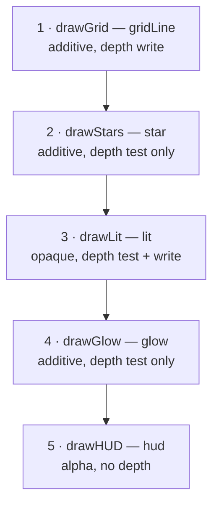

# 07 · The graphics pipeline & SPIR-V 🛠️

> **You'll leave this chapter with:** the ability to read and modify our shaders,
> an understanding of **SPIR-V** and how GLSL becomes it, a full accounting of
> *every fixed-function state* a `VkPipeline` freezes (this is where Vulkan is far
> more explicit than Metal), and a grip on **instancing** via `gl_InstanceIndex`.

---

## The seam, restated

`RenderSystem` (the last thing chapter 10's schedule runs) hands the renderer a
map: *for each mesh, the list of instances to draw.*

```cpp
std::unordered_map<MeshID, std::vector<InstanceData>> byMesh;
// e.g. MeshID::Enemy → [ {model, color}, {model, color}, … ]
```

That's the entire interface. The renderer knows nothing about entities; gameplay
knows nothing about Vulkan. Everything below is how the right side of that seam
turns those arrays into pixels — starting with the pipeline that all drawing runs
through.

---

## SPIR-V: shaders as bytecode, not text

Metal compiled MSL from a string at launch. Vulkan does **not** consume GLSL text
at all — it consumes **SPIR-V**, a portable binary intermediate representation.
The upside is that shader compilation is decoupled from the driver (no more
vendor-specific GLSL quirks), errors surface at *build* time, and the driver's job
shrinks to translating well-formed bytecode. The cost is a build step, which
chapter 01's CMake already set up: `glslc lit.vert -o lit.vert.spv`.

At runtime we load the `.spv` bytes and wrap them in a `VkShaderModule` — a thin
handle the pipeline references:

```cpp
VkShaderModule loadShader(VkDevice device, const std::string& path) {
    std::vector<char> code = readFile(path);            // raw .spv bytes
    VkShaderModuleCreateInfo ci{VK_STRUCTURE_TYPE_SHADER_MODULE_CREATE_INFO};
    ci.codeSize = code.size();
    ci.pCode    = reinterpret_cast<const uint32_t*>(code.data());
    VkShaderModule module;
    vkCreateShaderModule(device, &ci, nullptr, &module);
    return module;
}
```

> **Compiling at runtime instead.** You *can* skip the build step and compile GLSL
> in-process with the **shaderc** library (`shaderc_compile_into_spv`), which puts
> the shader source next to the CPU structs it must match — closer to Metal's
> launch-time model. We compile ahead of time because it keeps the runtime lean
> and gives build-time errors, but the shaderc path is a drop-in swap if you
> prefer it.

---

## The pipeline: one immutable object, *every* decision frozen

A `VkPipeline` is the Metal `MTLRenderPipelineState`'s bigger, stricter cousin. It
bundles the two programmable stages (vertex + fragment shaders) **and every
fixed-function decision** the GPU makes around them — and unlike Metal, where a
few of these lived on the encoder or came with sensible defaults, Vulkan makes you
**name all of them, up front, in one struct.** That's a lot of ceremony for a
triangle, but it means the driver validates and compiles the whole configuration
once and does zero per-draw state checking.

Here's the full cast of state, and what each does:

| State struct | What it decides | Ours |
|---|---|---|
| `VertexInputState` | The layout of vertex buffers: bindings + attributes. | mesh layout (pos+normal) or HUD layout (vec2+vec4) |
| `InputAssemblyState` | How vertices group into primitives (topology). | triangle / line / point per pipeline |
| `ViewportState` | The viewport + scissor rectangles. | **dynamic** (set each frame) |
| `RasterizationState` | Fill mode, cull mode, winding, line width, depth bias. | fill, **cull none**, CCW |
| `MultisampleState` | MSAA sample count. | 1 sample (off) |
| `DepthStencilState` | Depth test/write, compare op, stencil. | per pipeline (see below) |
| `ColorBlendState` | How fragments combine with the target. | opaque / additive / alpha |
| `DynamicState` | Which states are set at record time, not baked. | viewport + scissor |
| `PipelineLayout` | Descriptor set layouts + push-constant ranges. | shared (chapter 08) |

### Vertex input: the layout contract

The GPU needs to know how to pull `position` and `normal` out of a vertex buffer.
We describe one **binding** (the buffer, its stride) and two **attributes** (each
field's location, format and offset) — the Vulkan equivalent of an
`MTLVertexDescriptor`:

```cpp
VkVertexInputBindingDescription binding{};
binding.binding   = 0;
binding.stride    = sizeof(Vertex);                     // 24 bytes: vec3 + vec3
binding.inputRate = VK_VERTEX_INPUT_RATE_VERTEX;

VkVertexInputAttributeDescription attrs[2]{};
attrs[0] = {0, 0, VK_FORMAT_R32G32B32_SFLOAT, offsetof(Vertex, position)};  // location 0
attrs[1] = {1, 0, VK_FORMAT_R32G32B32_SFLOAT, offsetof(Vertex, normal)};    // location 1
```

`location` here matches `layout(location = N) in` in the vertex shader — a contract
both sides must honour, exactly like Metal's buffer-index numbering. Note we feed
*vertices* through the vertex-input machinery but *instances* through a storage
buffer the shader indexes itself (below) — a deliberate split we'll justify in a
moment.

One pipeline breaks the pattern: the **HUD** (chapter 14) consumes a different
vertex — `HUDVertex { vec2 position; vec4 color; }` — so it needs its own binding
and attributes:

```cpp
VkVertexInputBindingDescription hudBinding{0, sizeof(HUDVertex), VK_VERTEX_INPUT_RATE_VERTEX};
VkVertexInputAttributeDescription hudAttrs[2]{};
hudAttrs[0] = {0, 0, VK_FORMAT_R32G32_SFLOAT,       offsetof(HUDVertex, position)};  // vec2
hudAttrs[1] = {1, 0, VK_FORMAT_R32G32B32A32_SFLOAT, offsetof(HUDVertex, color)};     // vec4
```

Miss this and you get the nastiest kind of bug: both structs happen to be 24
bytes, so with the mesh layout the HUD still *draws* — positions land — but
attribute 1 reads three floats at offset 12 and every HUD color arrives shifted
as `(g, b, a, 1)`, with no error to save you. Vulkan permits component-count
mismatches (missing components default to `0,0,0,1`), which is exactly what makes
it silent.

### Depth and blend: the real per-pipeline choices

Two of these states carry actual rendering decisions, not boilerplate — and they
map one-to-one onto the Metal guide's depth-stencil states and blend modes:

```cpp
// SOLIDS (ship, enemies, grid): test against depth AND write it.
depth.depthTestEnable  = VK_TRUE;  depth.depthWriteEnable = VK_TRUE;
depth.depthCompareOp   = VK_COMPARE_OP_LESS;

// GLOWS (bolts, stars): test so solids occlude them, but DON'T write depth.
depth.depthTestEnable  = VK_TRUE;  depth.depthWriteEnable = VK_FALSE;

// HUD: ignore depth entirely, always draw on top.
depth.depthTestEnable  = VK_FALSE; depth.depthWriteEnable = VK_FALSE;
```

```cpp
// OPAQUE — replace.                     blendEnable = FALSE
// ADDITIVE — src + dst (glow).          srcColor = ONE, dstColor = ONE
// ALPHA — src·α + dst·(1−α) (HUD).      srcColor = SRC_ALPHA, dstColor = ONE_MINUS_SRC_ALPHA
```

Getting depth right is why the ship correctly hides the grid behind it while a
glowing bolt in front still lets you see the ship through its halo — and getting
blend right is why bolts and stars *add* light instead of overwriting. In Metal
these were `MTLDepthStencilState` objects and a `BlendMode` enum; in Vulkan they're
fields on the pipeline. Same decisions, frozen a little earlier.

### Four shader pairs, five pipelines

Here's a Vulkan wrinkle the Metal guide never hit. In Metal, one `unlit` pipeline
drew *both* the line grid and the triangle bolts — because primitive type and depth
state were set per-draw on the *encoder*, not baked into the pipeline. Vulkan bakes
topology, depth mode **and** blend mode into the pipeline object, so two things that
differ in *any* of those need **two pipelines**, even when they share a shader.

Our grid (lines, depth-write) and our glowing bolts (triangles, depth-test-only)
share the `unlit` shaders but differ in topology and depth — so they're two
pipelines. That gives us **four shader pairs but five pipelines**, built in
`render/rhi/Pipelines.cpp`. A helper takes the knobs so each call is one line:

```cpp
enum class VertexLayout { Mesh, Hud };            // which binding/attribute set to bake in

VkPipeline makePipeline(const char* vert, const char* frag,
                        VkPrimitiveTopology topology,
                        DepthMode depthMode, BlendMode blendMode,
                        VertexLayout layout = VertexLayout::Mesh);

lit      = makePipeline("shaders/lit.vert.spv",   "shaders/lit.frag.spv",   TRIANGLE, TestWrite, Opaque);
gridLine = makePipeline("shaders/unlit.vert.spv", "shaders/unlit.frag.spv", LINE,     TestWrite, Additive);
glow     = makePipeline("shaders/unlit.vert.spv", "shaders/unlit.frag.spv", TRIANGLE, TestOnly,  Additive);
star     = makePipeline("shaders/star.vert.spv",  "shaders/star.frag.spv",  POINT,    TestOnly,  Additive);
hud      = makePipeline("shaders/hud.vert.spv",   "shaders/hud.frag.spv",   TRIANGLE, NoDepth,   Alpha,
                        VertexLayout::Hud);
```

The `.spv` paths are where chapter 01's build wrote them, relative to the `build/`
directory you run from — the GLSL sources they came from live in
`src/content/shaders/`.

Each pipeline is created once at startup with `vkCreateGraphicsPipelines` and
switched mid-frame with `vkCmdBindPipeline` — the direct analogue of
`encoder.setRenderPipelineState`, just with more state welded in.

### Why the third one is called `glow` and not `bolt`

It draws bolts. Nothing else draws through it. Calling it `bolt` would be honest
and it is still the wrong name, because `render/rhi/Pipelines.cpp` is not allowed
to know that bolts exist — chapter 02's boundary test fails the build over the
word `Projectile`, and would fail over `Bolt` too if the list were longer.

That constraint sounds like bookkeeping and isn't. A pipeline is a *material*:
additive blend, depth-test-without-write, unlit fragment. Those four words
describe a glow, and they describe a glow whether the thing glowing is a plasma
bolt, an engine trail, a shield impact or a warp effect. `bolt` names today's only
caller; `glow` names what the object actually is, so the second caller doesn't
have to either rename it or live with a lie. The same reasoning is why the
grid's pipeline is `gridLine` — the grid is *scenery*, a content concept, and
content is fair game for the renderer to name. `Enemy` is not.

> **This is the "pipeline explosion" in miniature.** Bake enough state into
> pipelines and a real engine ends up with hundreds of near-identical ones. Vulkan's
> answers are a **pipeline cache** (so recompiling a variant is nearly free) and
> **extended dynamic state** (move topology/depth/blend to record time, so one
> pipeline covers many combinations). We keep five explicit pipelines because they're
> readable; chapter 15 points at both escape hatches.

> **Dynamic state earns its keep here, too.** Because viewport and scissor are
> already dynamic, a window resize (chapter 06) doesn't invalidate a single
> pipeline — we just call `vkCmdSetViewport`/`vkCmdSetScissor` with the new extent
> each frame. Bake them in instead and every resize would mean rebuilding all five.

---

## The shaders, read in full

All four pairs live in `src/content/shaders/`. Let's read the lit pair — the ship and enemies
— because it shows every idea.

### `lit.vert`

```glsl
#version 450

layout(location = 0) in vec3 inPosition;      // matches the vertex-input attributes
layout(location = 1) in vec3 inNormal;

struct InstanceData { mat4 model; vec4 color; };

layout(set = 0, binding = 0) uniform FrameUniforms {
    mat4 viewProjection;
    vec4 cameraPosition;
    vec4 lightDirection;
} frame;

layout(set = 0, binding = 1) readonly buffer Instances {   // one entry per instance
    InstanceData instances[];
};

layout(location = 0) out vec3 vNormal;
layout(location = 1) out vec4 vColor;

void main() {
    InstanceData inst = instances[gl_InstanceIndex];       // ← which copy we're drawing
    vec4 world  = inst.model * vec4(inPosition, 1.0);
    gl_Position = frame.viewProjection * world;
    vNormal     = mat3(inst.model) * inNormal;             // rotate normal into world space
    vColor      = inst.color;
}
```

- `gl_InstanceIndex` is Vulkan's built-in "which instance" — the key to instancing,
  next section, and the exact counterpart of Metal's `[[instance_id]]`.
- The `frame` UBO and `instances` storage buffer are bound via **descriptor sets**
  (chapter 08). `set = 0, binding = N` is the contract the descriptor set layout
  must match.
- `mat3(inst.model) * inNormal` rotates the normal by the model's rotation (dropping
  translation) so lighting is computed in world space. (We use uniform scale, so we
  can skip the inverse-transpose a non-uniform scale would demand.)

### `lit.frag`

The fragment side is the single dot product from chapter 04:

```glsl
#version 450
layout(location = 0) in vec3 vNormal;
layout(location = 1) in vec4 vColor;

layout(set = 0, binding = 0) uniform FrameUniforms {
    mat4 viewProjection; vec4 cameraPosition; vec4 lightDirection;
} frame;

layout(location = 0) out vec4 outColor;

void main() {
    vec3 N = normalize(vNormal);
    vec3 L = normalize(-frame.lightDirection.xyz);     // direction toward the light
    float diffuse = max(dot(N, L), 0.0);
    outColor = vec4(vColor.rgb * (0.25 + diffuse * 0.85), vColor.a);
}
```

`0.25` is ambient so shadowed faces aren't pure black; `0.85` is how hard the sun
hits. That's the entire lighting model, and it's plenty for faceted low-poly
shapes — byte-for-byte the same math as the Metal guide's `lit_fragment`, in GLSL.

The other three pairs are variations on this skeleton:

- **`unlit.*`** — same vertex transform, but the fragment just returns
  `inst.color`. Used for the grid and the glowing bolts (no lighting wanted).
- **`star.*`** — wraps points around the camera (chapter 09's tiling trick) and
  writes `gl_PointSize`; the fragment rounds each square point into a soft dot using
  `gl_PointCoord`.
- **`hud.*`** — takes 2D positions already in clip space, applies the Vulkan Y-flip
  for the overlay, and passes color straight through (chapter 14).

---

## Instancing: one mesh, many entities, one draw call

Twenty enemies share one octahedron mesh. Naively that's twenty draw calls, each
re-binding the same vertices. **Instancing** collapses them: bind the mesh once,
give the shader an *array* of per-entity data, and issue **one** call that draws
the mesh N times. The shader reads its slot via `gl_InstanceIndex`.

In Metal we bound the instance array as a plain buffer read by `[[instance_id]]`.
In Vulkan we have two idiomatic choices, and it's worth knowing why we picked one:

- **Per-instance vertex attributes** (`VK_VERTEX_INPUT_RATE_INSTANCE`) — the
  instance data flows through the same vertex-input machinery, advancing once per
  instance instead of per vertex. Fine, but a `mat4` costs four attribute slots and
  the layout gets fiddly.
- **A storage buffer indexed by `gl_InstanceIndex`** — bind the instance array as
  an SSBO and let the shader index it directly (as `lit.vert` does above). This
  reads exactly like the Metal "pull" model, scales to huge instance counts, and
  keeps the vertex layout to just position + normal. **We use this.**

The draw call itself is then tiny:

```cpp
vkCmdBindPipeline(cmd, VK_PIPELINE_BIND_POINT_GRAPHICS, lit);
vkCmdBindVertexBuffers(cmd, 0, 1, &mesh.vertexBuffer, &zeroOffset);   // shared geometry
vkCmdBindIndexBuffer(cmd, mesh.indexBuffer, 0, VK_INDEX_TYPE_UINT16);
vkCmdBindDescriptorSets(cmd, …, &frameSet, …);   // frame UBO + the frame's instance SSBO (ch 08)
vkCmdDrawIndexed(cmd, mesh.indexCount, instanceCount, 0, 0, 0);       // ← one call, N copies
```

The GPU runs the vertex shader `indexCount × instanceCount` times, and for each run
`gl_InstanceIndex` tells the shader which model matrix and color to use. This is how
a bullet-hell game draws thousands of objects at 120 fps — and the reason our
`RenderSystem` *buckets by mesh* is to make exactly these grouped calls possible.
Chapter 08 shows where the instance SSBO comes from each frame.

---

## Putting a frame together: the draw order

With five pipelines built, `Renderer::recordFrame` (chapter 06) plays them in a
deliberate order — a marriage of **painter's order** (for the blended stuff) and
the **depth buffer** (for the solids):



Why this order and these depth settings:

1. **The grid** writes depth, laying down a floor solids can test against.
2. **The stars** test depth (so the grid can occlude ones below the horizon) but
   *don't* write it — a star must never block a solid drawn later.
3. **Lit solids** test *and* write depth: this is what makes near objects hide far
   ones correctly, no manual sorting.
4. **Glows** blend additively and test-but-don't-write, so a glow in front of a
   solid brightens it rather than punching a hole in the depth buffer.
5. **The HUD** ignores depth entirely and always draws on top.

Each pass is a few lines inside the render pass: bind the pipeline, draw. And
here's a small Vulkan dividend: because each pass's depth and blend state is
frozen *into* its pipeline (above), the "set the right depth state" step Metal
did per-encoder is here just *which pipeline you bind* — get the order right and
the states come with it.

### Which groups go to which pass

Steps 3 and 4 both walk the same list of mesh groups from chapter 08 and each
takes the half that belongs to it. The question is *how they decide*, and the
obvious answer is the wrong one:

```cpp
// render/Renderer.cpp — don't write this
for (const Group& g : groups)
    if (g.mesh == MeshID::Ship || g.mesh == MeshID::Enemy) drawGroup(cmd, g);
```

That doesn't compile past chapter 02's boundary test — `Enemy` is a gameplay name
in a renderer file — and the test is right for a reason that outlives the test:
the renderer would now need editing every time content adds a mesh, and it would
be *silently wrong* until someone noticed a new ship rendering unlit. The fix is
to let content classify its own art, in `content/MeshID.hpp`:

```cpp
enum class MeshID   : uint8_t { Ship, Enemy, Bolt };
enum class Material : uint8_t { Lit, Glow };

constexpr Material materialOf(MeshID id) {
    switch (id) {
        case MeshID::Ship:
        case MeshID::Enemy: return Material::Lit;    // shaded by the sun direction
        case MeshID::Bolt:  return Material::Glow;   // emissive, doesn't occlude
    }
    return Material::Lit;
}
```

and let each pass filter on the material:

```cpp
void Renderer::drawLit(VkCommandBuffer cmd, const std::vector<Group>& groups) {
    vkCmdBindPipeline(cmd, VK_PIPELINE_BIND_POINT_GRAPHICS, pipelines.lit);
    for (const Group& g : groups)
        if (materialOf(g.mesh) == Material::Lit) drawGroup(cmd, g);
}

void Renderer::drawGlow(VkCommandBuffer cmd, const std::vector<Group>& groups) {
    vkCmdBindPipeline(cmd, VK_PIPELINE_BIND_POINT_GRAPHICS, pipelines.glow);
    for (const Group& g : groups)
        if (materialOf(g.mesh) == Material::Glow) drawGroup(cmd, g);
}
```

Now adding `MeshID::Asteroid` means one line in `materialOf`, and the renderer
never learns the word. Two details make this better in C++ than the enum-loop it
replaces:

- **`switch` on an enum class with no `default` is a checked exhaustive match.**
  Add `MeshID::Asteroid` and forget to classify it, and GCC and Clang both warn
  (`-Wswitch`, on by default; it's `/w14062` on MSVC) at the exact line. Silent
  misclassification is the failure mode this design is guarding against, so having
  the compiler catch it is most of the value. The trailing `return` after the
  switch is there for the ill-formed-but-legal case of a `MeshID` holding a value
  no enumerator names — it must not swallow the warning, so keep it *outside* the
  switch, never as a `default:` label.
- **`constexpr` means it costs nothing.** The classification is resolved at compile
  time; the loop above compiles to the same comparison the hardcoded version would
  have, minus the coupling.

Steps 1 and 2 need none of this — the grid and the starfield aren't entities and
never enter `groups` at all. Chapter 08 shows the path they take instead.

---

## The one-screen summary

- Vulkan runs **SPIR-V bytecode**, compiled from GLSL by `glslc` at build time (or
  shaderc at runtime); each shader stage is a `VkShaderModule`.
- A `VkPipeline` freezes the two shaders **and every fixed-function state** —
  vertex input, topology, viewport, rasterization, depth, blend — in one immutable
  object. Vulkan makes you name all of it; the payoff is zero per-draw validation.
- We build **five pipelines from four shader pairs** (`lit`; `gridLine` and `glow`
  both from `unlit`; `star`; `hud`) — Vulkan bakes topology/depth/blend into the
  pipeline, so states that differ need their own object. Each is named for the
  *material* it applies, never for the thing that happens to use it.
- **Instancing** uses `gl_InstanceIndex` to read a per-entity **storage buffer**,
  collapsing many entities into one `vkCmdDrawIndexed` — the pull-model port of
  Metal's `[[instance_id]]`.
- The frame draws **grid → stars → lit → glow → HUD** — painter's order for the
  blended passes, the depth buffer for the solids — and each pass's state rides in
  its pipeline, so the order is just which pipeline you bind next.
- A pass picks its groups by `materialOf(MeshID)`, a `constexpr` exhaustive
  `switch` in `content/MeshID.hpp`, so content classifies its own art and the
  renderer never names a ship.

---

**Next:** where the buffers behind all this come from — memory, VMA, and the
descriptors that point the shader at them. →
[Chapter 08: Buffers, memory (VMA) & descriptors](08-buffers-memory-descriptors.md)
