# Space Impact — Build an ECS on PixiJS, From Scratch

> A hands-on guide to writing a **side-scrolling space shooter** — Nokia's
> *Space Impact* in spirit — on **PixiJS v8** with a hand-rolled
> **Entity–Component–System**. PixiJS is a renderer, not a game framework: it
> draws, and nothing else. So we build the framework — entities, components, a
> system schedule, a spawner, collisions, weapons, a HUD — in plain TypeScript,
> and let PixiJS do what it's good at: put pixels on the screen fast.

<p align="center">
  <em>"An entity is a number. A component is data. A system is a verb. PixiJS is
  the last verb — <code>draw</code> — and it doesn't get a vote on the rest."</em>
</p>

---

## What this guide is (and isn't)

This is a **from-scratch implementation guide**. The [`docs/`](docs/) chapters
build the whole thing — the ECS storage, the game loop, the render seam that
marries the ECS to PixiJS's scene graph, input, spawning, enemy AI, collisions,
weapons, power-ups, a HUD and a boss — and show every piece of code in full,
inline, as you go. You end with a small **Vite + TypeScript** project you wrote
yourself and run with `npm run dev`.

- Chapter [01](docs/01-project-setup.md) scaffolds the project (a Vite
  `vanilla-ts` app plus `pixi.js`); each later chapter says which files to
  create and fills them in.
- The code is presented and explained where it's introduced — there's no
  separate codebase to cross-reference; the guide *is* the source.

The skill this builds isn't "type what I typed"; it's **understanding a small,
honest game framework well enough to know where every piece lives and why** — so
that when you reach for `bitECS` or `miniplex` later, you already know the shape
they're selling you.

> **Note:** this guide is for learning. It is not official PixiJS documentation.
> Cross-check the [PixiJS](https://pixijs.com/8.x/guides) references (and the
> other links in [`resources.md`](resources.md)) before relying on a detail; web
> APIs and PixiJS both drift, and v8 broke a lot from v7.

---

## Why not just use PixiJS "objects"?

PixiJS gives you a **scene graph**: a tree of `Container`s (and `Sprite`s,
`Graphics`, `Text`) each with a transform, that it walks and rasterizes every
frame. The tempting first move — the one most tutorials make, and the one the
`playground/javascript/pixijs` scaffold in this repo makes — is to treat that
tree as your game objects: subclass `Container` into an `Actor`, give it
`update(dt)`, subclass *that* into `Player`, `Enemy`, `Bullet`.

It works until it doesn't. A `HomingBullet` is a `Bullet` is an `Actor`, but it
*also* wants the enemy's targeting logic and the power-up's lifetime timer, and
now you're either copy-pasting behaviour down the hierarchy or inventing
mixins. The scene graph is a **rendering** structure; forcing it to also be your
**simulation** structure is the mistake. This guide keeps the two apart:

> **The ECS is the simulation. PixiJS is the renderer. A single `RenderSystem`
> is the thin seam between them** — it copies each entity's `Transform` onto a
> PixiJS display object once per frame, and PixiJS draws. Nothing in your game
> logic ever subclasses `Container` again.

---

## Mental model (read this first)

Two ideas carry the whole project. Hold both and everything else is detail.

**1. The ECS separates *data* from *behaviour*.** Nothing is a "Ship object"
with a `fly()` method. An entity (a number) *has* a `Transform`, a `Velocity`, a
`Player` tag, a `Weapon`, a `Renderable` handle. Separate systems read those and
act. A homing missile is the same `Transform` + `Velocity` a straight bullet
uses, plus a `Homing` component and one extra system. Composition, not
inheritance.

**2. A frame is a fixed pipeline: simulate on a fixed timestep, then draw.**
Every frame the systems run in a set order to advance the world; then the
`RenderSystem` copies the survivors' transforms onto PixiJS objects and PixiJS
rasterizes the tree. The seam between them is deliberately thin — a `Renderable`
component holding one `Container` — so neither side knows the other's internals.

```mermaid
flowchart LR
  I[Input] --> P[PlayerControl]
  P --> W[Weapon / fire]
  W --> SP[Spawner / waves]
  SP --> AI[EnemyAI]
  AI --> M[Movement]
  M --> H[Homing]
  H --> L[Lifetime]
  L --> C[Collision]
  C --> D[Damage / Destroy]
  D --> R[RenderSystem]
  R -->|Transform → Container.x/y| G[[PixiJS renderer]]
  G -->|background · entities · particles · HUD| SCR[(Canvas)]
```



Each box is one system you'll build; the arrows are the order they run in the
schedule (chapter 07). That list, in that order, *is* the game.

| Idea | One-liner | Chapter |
| --- | --- | --- |
| **Entities & components** | Identity is a number; everything it *is* comes from data attached to it | [04](docs/04-designing-the-ecs.md) |
| **Systems & schedule** | Behaviour is functions over components, run in a fixed order per frame | [04](docs/04-designing-the-ecs.md), [07](docs/07-the-game-loop.md) |
| **The render seam** | One system copies `Transform` → a PixiJS `Container`; PixiJS never drives logic | [05](docs/05-the-render-seam.md) |
| **Fixed timestep** | Simulate in constant `1/60 s` steps so collisions are deterministic | [03](docs/03-the-math-and-the-frame.md), [07](docs/07-the-game-loop.md) |
| **Deferred destroy** | Systems flag entities dead; the world removes them once, at a safe point | [04](docs/04-designing-the-ecs.md), [10](docs/10-collisions-and-combat.md) |

---

## What you'll build

A horizontal shoot-'em-up you fly with the keyboard:

- a **player ship** that moves freely in 2D inside a scrolling starfield, and
  **fires** on a cooldown;
- **enemies** that warp in from the right in data-driven **waves** — some fly
  straight, some **home** in on you, some **shoot back**;
- **circle collisions** with **layers** (your bolts hit enemies, their bolts hit
  you), damage, a **hit-flash**, explosions, score;
- **power-ups** — spread-shot, rockets, a shield, an extra life — that drift in
  and change your `Weapon`;
- **lives, respawn and invulnerability frames**, a **HUD** (score, lives, a hull
  bar), title / game-over / level-clear states, and a **boss** with phases;
- all of it drawn with **procedural `Graphics`** (no art assets required),
  through a **sparse-set ECS** you wrote, rendered by **PixiJS v8**.

Everything is simple geometry generated in code — chapter
[13](docs/13-where-to-go-next.md) maps the road from here to real sprites,
audio, tilemaps, object pooling and a production ECS library.

---

## Prerequisites

- **Node.js 18+** and a browser with WebGL2 (any current Chrome/Firefox/Safari;
  PixiJS v8 uses WebGPU when available and falls back to WebGL).
- **Working TypeScript** — generics and classes, mostly. No prior game, graphics
  or ECS experience assumed; that's what the guide is for.
- **A little vector math.** Chapter 03 re-derives the 2D vectors, timestep and
  overlap tests you need from scratch.

You do **not** need any prior PixiJS, WebGL, or ECS knowledge. If you've read the
[`space-fighter-metal`](../space-fighter-metal/) or
[`space-fighter-vulkan`](../space-fighter-vulkan/) guides in this repo, this is
the same ECS idea in 2D on the web — and much less GPU plumbing.

---

## Repository layout

```
space-impact-pixijs/
├── README.md                 ← you are here (the map)
├── resources.md              ← primary sources & further reading
└── docs/                     ← the guide, one chapter per file
    ├── 01-project-setup.md
    ├── 02-pixijs-fundamentals.md
    ├── 03-the-math-and-the-frame.md
    ├── 04-designing-the-ecs.md
    ├── 05-the-render-seam.md
    ├── 06-sprites-and-procedural-art.md
    ├── 07-the-game-loop.md
    ├── 08-input-and-the-player.md
    ├── 09-enemies-waves-and-ai.md
    ├── 10-collisions-and-combat.md
    ├── 11-powerups-weapons-and-lives.md
    ├── 12-hud-and-game-states.md
    └── 13-where-to-go-next.md
```

The Vite project you build lives wherever you scaffold it in chapter 01 — the
guide walks you through creating it file by file.

---

## The learning path

Concept chapters (🧠) build understanding; build chapters (🛠️) walk the code that
uses it. Read 01–07 in order — they assemble the framework. 08–12 are the game
on top of it, and 13 is the horizon.

| # | Chapter | What you'll learn |
| --- | --- | --- |
| 01 | 🛠️ [Project setup](docs/01-project-setup.md) | What we're building and why PixiJS + a hand-rolled ECS; scaffolding the Vite + TS project; the shape of a frame; why *not* to subclass `Container`. |
| 02 | 🧠 [PixiJS fundamentals](docs/02-pixijs-fundamentals.md) | PixiJS as a renderer, not a framework: the async `Application`, the `Container` scene graph, `Graphics`/`Sprite`/`Text`, the `Ticker`, and everything v8 changed from v7. |
| 03 | 🧠 [The math & the frame](docs/03-the-math-and-the-frame.md) | The 2D (y-down) coordinate system; a tiny `Vec2`; delta time; **fixed vs variable timestep** and the accumulator; circle & AABB overlap tests. |
| 04 | 🛠️ [Designing the ECS](docs/04-designing-the-ecs.md) | Entities, components, systems; `Map`-per-type vs **sparse set** vs archetypes; our `World`, `ComponentStore`, queries, resources, and safe deferred destruction. |
| 05 | 🛠️ [The render seam](docs/05-the-render-seam.md) | Data vs display objects; a `Renderable` component holding a `Container`; the `RenderSystem`; mount/unmount on spawn/destroy; layers and z-order. |
| 06 | 🛠️ [Sprites & procedural art](docs/06-sprites-and-procedural-art.md) | Drawing the ship, enemies, bolts and pickups with `Graphics` — zero assets; a parallax starfield; baking `Graphics` to a texture; explosions with `ParticleContainer`. |
| 07 | 🛠️ [The game loop & scheduling](docs/07-the-game-loop.md) | The `Ticker` heartbeat and ticker priorities; the fixed-timestep accumulator; the `Schedule`; why system *order* is the logic; pause and game-over. |
| 08 | 🛠️ [Input & the player](docs/08-input-and-the-player.md) | Abstracting keyboard/pointer/touch into an `Input` resource; the player movement system clamped to the viewport; firing with a cooldown. |
| 09 | 🛠️ [Enemies, waves & AI](docs/09-enemies-waves-and-ai.md) | A data-driven `Spawner`; the three Space Impact archetypes — straight, homing, shooter — as components + systems; enemy bullets. |
| 10 | 🛠️ [Collisions & combat](docs/10-collisions-and-combat.md) | Collision layers & masks; a uniform-grid broad phase; damage, health, hit-flash, destruction and score; deferred destroy in anger. |
| 11 | 🛠️ [Power-ups, weapons & lives](docs/11-powerups-weapons-and-lives.md) | Pickups that drift in; swappable `Weapon` components (single/spread/rocket); a shield; lives, respawn and invulnerability frames. |
| 12 | 🛠️ [HUD & game states](docs/12-hud-and-game-states.md) | A UI layer *outside* world space with `Text`/`Graphics`; a tiny state machine (title → play → game-over → level-clear); and a multi-phase **boss**. |
| 13 | 🧠 [Where to go next](docs/13-where-to-go-next.md) | Archetypes and `bitECS`/`miniplex`; object pooling & culling; audio; tilemaps & real sprites; determinism, save/replay, and netcode; packaging. |

---

## How to use this guide

- **Build as you read, and run early.** Scaffold in chapter 01 and `npm run dev`
  often — every chapter lands harder once you've seen the thing it explains move.
- **Follow the schedule.** The heart of the game is the `Schedule` (chapter 07):
  the list of systems, in order, is the entire game logic. Keep that chapter
  close.
- **Change one number.** Halve the spawn interval, double the fire rate, tint the
  ship red. Fast feedback is the whole reason to build on something small.
- **Add one behaviour end-to-end.** A new component, a new system, one line in
  the schedule. Doing that once makes the ECS click for good — chapter 13 has
  starter ideas.

---

## Credits & lineage

This guide stands on the standard references: the
[PixiJS v8](https://pixijs.com/8.x/guides) documentation; the data-oriented ECS
lineage popularised by Mike Acton's talks and libraries like `EnTT`, `bitECS`,
`miniplex` and Bevy; Robert Nystrom's *Game Programming Patterns* and Glenn
Fiedler's "Fix Your Timestep!" for the loop; and the arcade feel of Nokia's
*Space Impact* that we're chasing, not cloning. Full references live in
[`resources.md`](resources.md).

---

*Start here → [Chapter 01: Project setup](docs/01-project-setup.md)*
