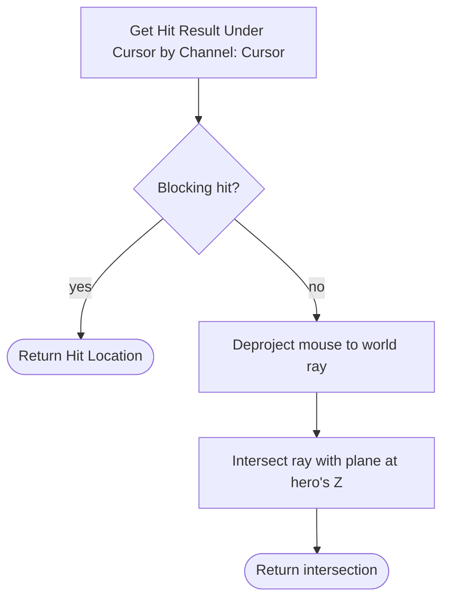

# Chapter 2 — Movement, Camera & Cursor Targeting

> **Goal of this chapter:** a hero that moves like an ARPG hero — a locked top-down camera, both click-to-move *and* WASD control schemes the player can switch between, a dash with i-frames, and one function — `GetCursorWorldLocation` — that every skill in the game will aim with.

---

## 2.1 The camera rig

The Top Down template gives you a working SpringArm + Camera on the character. It's close; tune it to genre spec. On `BP_Hero`, select the **SpringArm**:

| Setting | Value | Why |
|---|---|---|
| Rotation | Pitch **-55°**, Yaw -45° or 0° (taste) | steeper than the template's default; you want to *read a horde*, not admire the skybox |
| Target Arm Length | **1400** | enough to see a screen of monsters; Diablo-ish framing |
| Use Pawn Control Rotation | **OFF** | the camera never rotates with the character — ever |
| Inherit Pitch / Yaw / Roll | **OFF** (all three) | absolute rotation; the character spins freely underneath a fixed camera |
| Do Collision Test | **OFF** | a top-down camera probing for walls zooms into the hero's ear every time a tree passes overhead |
| Enable Camera Lag | **ON**, Lag Speed **5–8** | slight smoothing so the camera glides instead of being bolted to the capsule |

And on **Character Movement**:

| Setting | Value | Why |
|---|---|---|
| Orient Rotation to Movement | **ON**, Rotation Rate Z ≈ **720** | the character faces where it *moves* — top-down standard |
| Use Controller Desired Rotation | OFF | |
| Max Walk Speed | **600** | matches the hero's base `MoveSpeed` stat; [Chapter 3](03-stats-and-modifiers.md) will drive this from `AC_Stats` instead of a hardcoded number |

On `BP_Hero` itself (Class Defaults): **Use Controller Rotation Yaw = OFF**. If you skip this, the mouse never rotates the pawn (good), but a gamepad's right stick will fight Orient-Rotation-to-Movement (bad).

Finally, on `BP_ARPGPlayerController`: **Show Mouse Cursor = ON**, Default Mouse Cursor = Crosshairs (or leave Default). This is a mouse game; the cursor *is* the aiming reticle.

> **Pitfall:** if the camera still rotates when you drag the mouse, you missed one of the three *Inherit* checkboxes on the SpringArm or left *Use Pawn Control Rotation* on. There are four switches that all have to be off; check all four before debugging anything else.

## 2.2 Control scheme A — click-to-move

This is the template's scheme, and half your players expect it. Wire `IA_MoveClick` (created in [Chapter 1](01-project-setup.md)) in `BP_ARPGPlayerController`:

```text
[IA_MoveClick Triggered]                       ◄ fires every frame while held
 → [GetCursorWorldLocation] (2.4)
 → [Branch: input held > 0.15 s]               ◄ short press vs drag-to-steer
     True  → [Add Movement Input (WorldDir = (CursorLoc - HeroLoc).Normalize)]
                                               ◄ held: steer directly toward cursor,
                                                 repathing implicitly every frame
[IA_MoveClick Completed]
 → [Branch: was a short press (< 0.15 s)]
     True → [Simple Move To Location (Controller, CursorLoc)]
                                               ◄ tap: pathfind there and go
```

That split — tap pathfinds, hold steers — is exactly what the template ships, and it's the classic Diablo feel: tap to cross the room, hold to kite.

> **Pitfall:** `Simple Move To Location` silently does nothing without a NavMesh. The template map has a `NavMeshBoundsVolume`; your `L_Dev_Gym` from Chapter 1 needs one too. Press **P** in the viewport — no green floor, no pathing.

## 2.3 Control scheme B — WASD direct (the guide's default)

`IA_Move` is a 2D axis. Because the camera's yaw is fixed and absolute (2.1), "camera space" is just the SpringArm's yaw applied to the input:

```text
[IA_Move Triggered (ActionValue: Vector2D)]           ◄ on BP_Hero
 → [Make Rotator (Yaw = SpringArm World Rotation.Yaw)]
 → [Get Forward Vector] → [Add Movement Input (Scale = ActionValue.Y)]
 → [Get Right Vector]   → [Add Movement Input (Scale = ActionValue.X)]
```

That's the whole scheme. No pathfinding, no NavMesh dependency, instant response.

> **Design note:** WASD is this guide's default going forward because it's the more *arcade* choice: movement is always live, kiting is a skill, and — the important one — **movement and aiming are separate channels**. Your left hand repositions while your right hand aims skills at the cursor. Click-to-move overloads one input with both jobs. Hades, V Rising, and modern ARPG controller schemes all landed here. Build both anyway — it's twenty nodes, and letting the player choose costs you nothing.

## 2.4 Player-selectable schemes

Create `E_ControlScheme` (Enum) in `/Game/ARPG/Data/`: `ClickToMove, DirectWASD`. Store the chosen value as `ControlScheme` on `BP_ARPGGameInstance` (it must survive level transitions; the GameInstance is the cross-level bag from Chapter 1). Default: `DirectWASD`.

Gate the two schemes at the input events — one Branch at the top of each:

```text
[IA_Move Triggered]      → [Branch: GI.ControlScheme == DirectWASD]  → True: (2.3 graph)
[IA_MoveClick Triggered] → [Branch: GI.ControlScheme == ClickToMove] → True: (2.2 graph)
```

Both mappings stay live in `IMC_Default`; the branch decides which one *does* anything. A settings toggle can flip the enum at runtime with zero re-wiring. (A fancier version swaps Input Mapping Contexts; the Branch is fine at this scale.)

## 2.5 Cursor projection — the function everything aims with

Every skill in [Chapter 5](05-skills-as-data.md) — fireballs, ground slams, telegraphed AoEs — asks the same question: *where in the world is the cursor?* Answer it once, in one place.

**Trace channel first.** Project Settings → Collision → New Trace Channel: **`Cursor`**, Default Response = **Block**. Then set actors that should *not* catch the cursor to Ignore it: projectiles, corpses, pickups, foliage, VFX meshes. The template traces the `Visibility` channel, which works until a fence post or a loot label starts eating your fireball aim — a dedicated channel means *you* decide what the cursor sees, forever, in one collision preset.

Add to `BP_ARPGPlayerController` a **pure function** `GetCursorWorldLocation` (returns Vector). Two-stage: trace, then a math fallback for when the cursor is over the void (off the edge of the map, over a bottomless pit):

```text
[Function GetCursorWorldLocation → Vector]           ◄ on BP_ARPGPlayerController
 → [Get Hit Result Under Cursor by Channel (Trace Channel = Cursor)]
 → [Branch: Blocking Hit?]
     True  → Return [Hit Result → Location]
     False → [Get Mouse Position] → [Deproject Screen to World]
           → [Line Plane Intersection (Origin & Normal):
                Line Start = WorldPosition,
                Line End   = WorldPosition + WorldDirection × 10000,
                Plane Origin = Hero → GetActorLocation,
                Plane Normal = (0,0,1)]
           → Return [Intersection]                   ◄ cursor projected onto the
                                                       hero's ground plane
```



The fallback matters more than it looks: without it, aiming a projectile over a chasm returns a zero vector and your fireball fires at the world origin. With it, skills aim sensibly even when the cursor is over nothing.

> **Pitfall:** the trace hits *tops of things*. Aim at a tall pillar and the hit location is on its roof, 400uu above the hero — and a ground-targeted skill telegraphs up there. If it bugs you, flatten the result to the hero's Z for ground-targeted skills (Chapter 5's `BP_Exec_GroundAoE` does exactly this). Don't fix it globally; projectiles legitimately want the 3D point.

## 2.6 Facing the cursor

Orient-Rotation-to-Movement points the hero where it *walks*. While attacking, the hero must face the *cursor* instead — smoothly, not snapping. Add to `BP_Hero`:

| Variable | Type | Default | Purpose |
|---|---|---|---|
| `bFaceCursor` | bool | false | true while casting/attacking ([Ch. 5](05-skills-as-data.md) sets it around `TryCast`) |
| `FaceCursorSpeed` | float | 12.0 | RInterp speed; higher = snappier |

```text
[Event Tick]                                          ◄ on BP_Hero
 → [Branch: bFaceCursor]
     True → [Find Look at Rotation (HeroLoc → GetCursorWorldLocation)]
          → [RInterp To (Current = Actor Rotation, Target = (Yaw only),
                         Interp Speed = FaceCursorSpeed)]
          → [Set Actor Rotation]                      ◄ yaw only — never pitch the capsule
```

While `bFaceCursor` is true, also set Character Movement → Orient Rotation to Movement **OFF** (and restore it when cleared), or the two systems arm-wrestle over yaw every frame.

> **Design note:** this rotate/move separation *is* the "attack while repositioning" feel — strafing backward while lobbing fireballs at the thing chasing you. It's the single biggest reason WASD + cursor (2.3) plays better than click-to-move here: with WASD both channels are live simultaneously; with click-to-move you're either walking or attacking. This one Tick branch is doing a lot of genre work.

## 2.7 The dash

`IA_Dash` (Space, from Chapter 1) → a short burst of velocity with i-frames. No root motion, no montage dependency — `Launch Character` and two timers:

| Variable | Type | Default | Purpose |
|---|---|---|---|
| `DashSpeed` | float | 2500 | launch velocity |
| `DashDuration` | float | 0.25 | i-frame window length |
| `DashCooldown` | float | 2.0 | time between dashes |
| `bDashOnCooldown` | bool | false | gate |

The i-frame flag itself — `bDashing` (bool, default false) — lives on **`AC_Stats`** (the empty shell from Chapter 1), *not* on the hero. Why: [Chapter 4](04-damage-and-ailments.md)'s `ReceiveDamage` runs inside `AC_Stats` and checks the flag before applying anything; keeping flag and check in the same component means the damage pipeline never reaches out to ask an actor about its state.

```text
[IA_Dash Triggered]                                   ◄ on BP_Hero
 → [Branch: NOT bDashOnCooldown]
     True → [Set AC_Stats.bDashing = true]            ◄ Ch. 4's ReceiveDamage ignores
                                                        all damage while this is set
          → [Dir = Last non-zero move input; fallback = Actor Forward]
                                                      ◄ dash where you're GOING, not
                                                        where you face — you face the
                                                        cursor while attacking (2.6)
          → [Launch Character (Velocity = Dir × DashSpeed, XY Override = true)]
          → [Set bDashOnCooldown = true]
          → [Set Timer by Event (DashDuration)]  → [Set AC_Stats.bDashing = false]
          → [Set Timer by Event (DashCooldown)]  → [Set bDashOnCooldown = false]
```

Cache "last non-zero move input" as a Vector in the 2.3 graph (one Set node when `ActionValue` isn't zero). Under click-to-move, fall back to dashing toward the cursor instead — that's what that scheme's players expect.

> **Pitfall:** `Launch Character` with XY Override replaces your horizontal velocity but friction eats it fast. If the dash feels like a hiccup instead of a dash, temporarily raise Character Movement → Ground Friction (or set Braking Friction Factor to 0) for the dash window and restore it on the same `DashDuration` timer. Tune until the dash covers ~450–600uu.

> **Multiplayer note:** in single-player, "press key → instant launch" is the whole implementation. Networked, a dash with i-frames needs client prediction and server validation — the [co-op soulslike guide's dodge roll](../coop-soulslike-ue5/04-character-locomotion.md) walks that exact pattern, and [Chapter 13](13-coop-multiplayer.md) applies it to this dash.

## 2.8 Test before moving on

Run these in `L_Dev_Gym`. Everything later assumes this chapter's feel is locked.

| Test | Expected |
|---|---|
| Drag the mouse around | Camera never rotates; cursor stays visible |
| Tap-click across the room (ClickToMove) | Hero pathfinds around obstacles to the click |
| Hold-click and steer (ClickToMove) | Hero follows the cursor continuously, repathing as you drag |
| Flip `ControlScheme` to DirectWASD | WASD moves in screen directions; clicks no longer move the hero |
| Walk with WASD | Hero rotates to face its movement direction |
| Print `GetCursorWorldLocation` on Tick | Sane world coordinates everywhere — including with the cursor over a pit or off the map edge |
| Set `bFaceCursor` = true (debug key) | Hero smoothly tracks the cursor while strafing with WASD |
| Dash mid-strafe | Bursts in the *movement* direction, ~450–600uu, ~0.25 s |
| Spam Space | One dash per 2 s; cooldown gate holds |
| Check `AC_Stats.bDashing` during a dash | True for the dash window, false after — [Chapter 4](04-damage-and-ailments.md) will turn this into i-frames |

---

**Next:** [Chapter 3 — The Stat System: One Modifier Pipeline](03-stats-and-modifiers.md) — the load-bearing one. Every number in the rest of the guide flows through what you build next.
