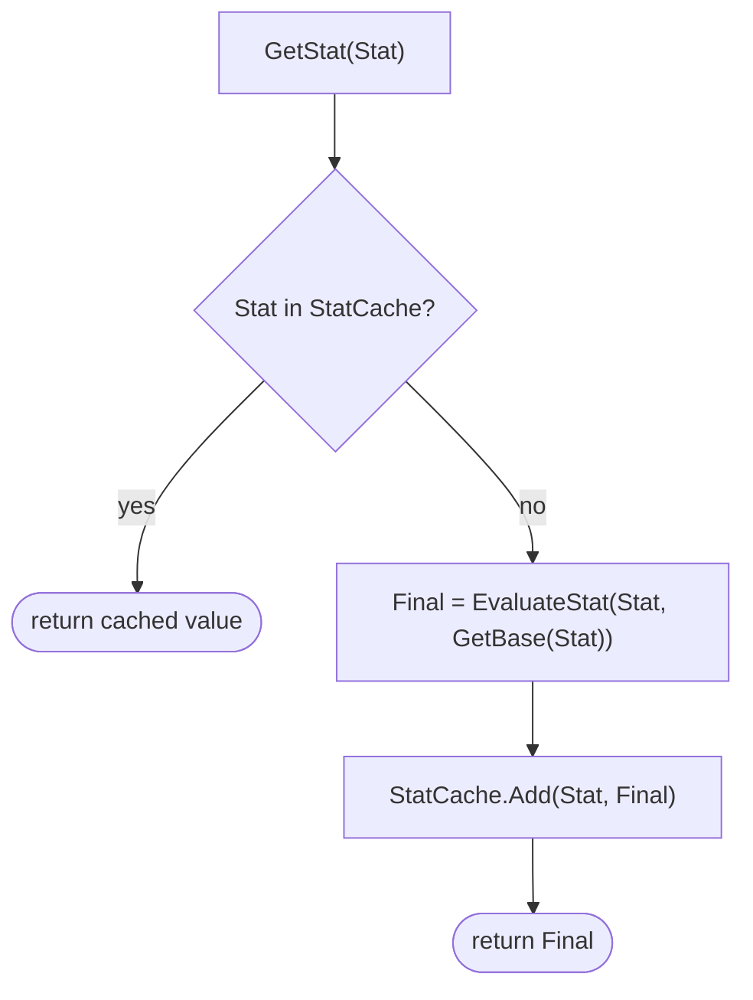

# Chapter 3 — The Stat System: One Modifier Pipeline

> **Goal of this chapter:** one component, `AC_Stats`, through which **every number in the game flows**. A ring, a passive node, a chill debuff, and a rare monster's "Fiery" mod will all be the same struct applied the same way — so Chapters 4, 6, 8 and 9 become content entry instead of new systems. This is the load-bearing hour of the whole guide; don't skim it.

---

## 3.1 The three buckets: flat, increased, more

Every ARPG stat modifier is one of three operations. Path of Exile made the vocabulary famous, and we steal it wholesale because it's the cleanest model in the genre:

| Op | Wording on gear | What it does | How multiples combine |
|---|---|---|---|
| **Flat** | "+20 to Fire Damage" | added to the base | all flats **sum** |
| **Increased** | "40% increased Fire Damage" | percentage scaling | all increases **add together**, then apply once |
| **More** | "30% more Fire Damage" | percentage scaling | each one **multiplies separately** |

The formula — memorize it, it's the whole chapter:

```
Final = (Base + Σ Flat) × (1 + Σ Increased / 100) × Π (1 + More_i / 100)
```

The guide's worked example, which we'll reuse from here to Chapter 12: **100 base fire damage**, one **+20 flat** mod, two *increased* mods (**40%** and **20%**), and one **30% more** multiplier:

```
(100 + 20) × (1 + 0.40 + 0.20) × (1 + 0.30)
= 120 × 1.60 × 1.30
= 249.6
```

Why two categories of percentage? Because they behave completely differently at scale:

- **Increased adds together, so it has diminishing returns.** Your first 40% increased takes you from ×1.0 to ×1.4 — a 40% gain. Stacking another 40% on top takes you from ×1.4 to ×1.8 — only a ~29% gain. Most of the mods in the game (gear affixes, passive nodes) are *increased*, so players can stack them freely without the math exploding.
- **More multiplies, so it never dilutes.** A 30% more multiplier is worth exactly 30% no matter what else you have — which is why PoE support gems say "more" and why they're the chase. *More* mods are rare and deliberate: keystones with a downside, ailments, monster rarity bonuses.

If both had multiplied, ten cheap 10% affixes would be ×2.59 and the game balances itself off a cliff. If both had added, big build-defining multipliers would feel weaker the more gear you found. Two buckets solve both problems. When you author content later, the rule of thumb: **commodity mods are increased; special mods are more.**

> **Design note:** *Reduced* is negative increased and *less* is negative more — same buckets, negative `Value`. Chapter 4's Chill is literally `More −30% MoveSpeed`. You get debuffs for free.

## 3.2 The data: two enums and one struct

Create these in `/Game/ARPG/Data`. First `E_Stat` — every number the game knows about. Ship with these twenty; adding one later is a one-line enum edit:

```
MaxLife, LifeRegen, MaxMana, ManaRegen, MoveSpeed,
AttackSpeed, CastSpeed, CritChance, CritMulti, Armour,
FireRes, ColdRes, LightningRes,
DamagePhys, DamageFire, DamageCold, DamageLightning,
AreaOfEffect, ProjectileCount, CooldownRate
```

Then `E_ModOp` with exactly three values: `Flat`, `Increased`, `More`. And the struct that the *entire rest of the guide* is built from:

**`F_StatMod`**

| Field | Type | Purpose |
|---|---|---|
| `Stat` | `E_Stat` | which number this touches |
| `Op` | `E_ModOp` | which bucket |
| `Value` | float | +20 flat, 40 (increased %), 30 (more %)... |

That's it. A ring is an array of these. A passive node is an array of these. Chill is one of these on a timer. When Chapter 7 generates a random item, it's generating `F_StatMod`s. **Content is data; Blueprints are executors** — this struct is the data.

One more struct, internal to `AC_Stats`: **`F_AppliedMod`** = an `F_StatMod` plus `Source` (Name). More on `Source` in 3.4 — it's the best decision in this guide.

## 3.3 AC_Stats: state and initialization

Open the empty `AC_Stats` shell from [Chapter 1](01-project-setup.md) and add:

| Variable | Type | Default | Purpose |
|---|---|---|---|
| `BaseStats` | Map<`E_Stat`, float> | empty | set from `DT_StatDefaults` on init |
| `ActiveMods` | `F_AppliedMod`[] | empty | every live modifier, from every source |
| `StatCache` | Map<`E_Stat`, float> | empty | computed finals; **absence = dirty** (3.5) |
| `CurrentLife` | float | 0 | a POOL, not a stat — see 3.6 |
| `CurrentMana` | float | 0 | ditto |
| `bIsDead` | bool | false | checked by Ch. 4's damage entry |
| `bDashing` | bool | false | i-frame flag, set by [Chapter 2](02-movement-and-input.md)'s dash |

Dispatchers (create now, even the ones Chapter 4 fires — consumers bind to `AC_Stats`, so the component owns the events):

| Dispatcher | Payload | Fired by |
|---|---|---|
| `OnLifeChanged` | New, Max | this chapter (pools, regen) |
| `OnManaChanged` | New, Max | this chapter |
| `OnStatsChanged` | Stat | `AddMods` / `RemoveModsFromSource` |
| `OnDamaged` | Packet, Mitigated | [Chapter 4](04-damage-and-ailments.md)'s `ReceiveDamage` |
| `OnDeath` | Killer | Chapter 4 |

Base values live in a Data Table, `DT_StatDefaults` (row struct `F_StatDefaults`: one field, `Stats`: Map<`E_Stat`, float>), with a `Hero` row now and one row per enemy archetype when [Chapter 6](06-enemies-and-hordes.md) needs them. The `Hero` row:

| Stat | Base | Convention |
|---|---|---|
| MaxLife / MaxMana | 100 / 50 | absolute |
| LifeRegen / ManaRegen | 0 / 2 | per second |
| MoveSpeed | 600 | uu/s |
| AttackSpeed / CastSpeed / CooldownRate / AreaOfEffect | 1.0 | multipliers — 1.0 = 100% |
| CritChance / CritMulti | 5 / 150 | percent |
| Armour, all Res, all Damage*, ProjectileCount | 0 | flat gear/passive power lands here |

> **Design note:** MaxLife stays 100 forever — there is **no** automatic per-level growth in this game. All power comes from passives and gear ([Chapter 9](09-progression-and-passives.md) argues why). If a number isn't in the DT row, `GetBase` treats it as 0.

```text
Blueprint: AC_Stats — function InitFromRow (RowName: Name)
──────────────────────────────────────────────────────────
[Get Data Table Row (DT_StatDefaults, RowName)]
 → [Set BaseStats = Row.Stats]
 → [Set CurrentLife = GetStat(MaxLife)] ; [Set CurrentMana = GetStat(MaxMana)]
 → [Call OnLifeChanged] ; [Call OnManaChanged]
 → [Set Timer by Event (RegenTick, 0.1 s, looping)]     ◄ see 3.6 — never Tick
```

`BP_Hero` calls `InitFromRow("Hero")` on BeginPlay. Enemies will pass their archetype row.

## 3.4 The API: sources in, numbers out

Four public functions. Everything else in the game talks to stats through these:

```text
AddMods(Source: Name, Mods: F_StatMod[])      ◄ a source arrives (ring equipped, buff applied)
RemoveModsFromSource(Source: Name)            ◄ that source leaves — no bookkeeping by caller
GetStat(Stat: E_Stat) → float                 ◄ the formula, cached (3.5)
GetBase(Stat: E_Stat) → float                 ◄ BaseStats lookup, 0 if absent
```

The signature detail that makes this guide work: **mods are applied under a `Source` key, and removed by that key.** Callers never hold references to what they added; they just remember one Name. The conventions, used verbatim by later chapters:

| Source key | Used by | Lifecycle |
|---|---|---|
| `Item_<Guid>` | [Chapter 8](08-inventory-and-equipment.md) equipment | equip → unequip |
| `Passive_<NodeId>` | [Chapter 9](09-progression-and-passives.md) tree | allocate → respec |
| `Status_<Effect>` | [Chapter 4](04-damage-and-ailments.md) ailments/buffs | apply → timer expiry |
| `MonsterMod_<Id>` | [Chapter 6](06-enemies-and-hordes.md) rare monsters | spawn → (never) |

This is the loud part, so here it is loudly: **because of this one decision, four future systems are each about five nodes long.** Unequipping a ring is `RemoveModsFromSource(Item_<Guid>)` — no "subtract what I think I added" math that drifts out of sync. Chill expiring is `RemoveModsFromSource(Status_Chill)` on a timer. A full passive respec is a loop of `RemoveModsFromSource`. Two rings with identical affixes coexist because their Guids differ. Every stat bug you'd otherwise spend a month on ("my ring stopped stacking with my buff") is structurally impossible, because nothing ever mutates a stat — sources come, sources go, and the formula recomputes from `ActiveMods`.

```text
Blueprint: AC_Stats — function AddMods (Source, Mods)
─────────────────────────────────────────────────────
[For Each (Mods)]
 → [Make F_AppliedMod (Mod, Source)] → [Add to ActiveMods]
 → [MarkDirty (Mod.Stat)]                      ◄ 3.5 — also handles MaxLife/MaxMana pools
 → [Call OnStatsChanged (Mod.Stat)]

Blueprint: AC_Stats — function RemoveModsFromSource (Source)
────────────────────────────────────────────────────────────
[Reverse For Each (ActiveMods)]                ◄ reverse: removing while iterating
 → [Branch: Element.Source == Source]
     True → [MarkDirty (Element.Stat)] → [Remove Index]
            → [Call OnStatsChanged (Element.Stat)]
```

> **Pitfall:** `OnStatsChanged` is how the world reacts — this chapter's first consumer is movement: on `BP_Hero` BeginPlay, bind `OnStatsChanged`, and when `Stat == MoveSpeed`, `Set Max Walk Speed = AC_Stats → GetStat(MoveSpeed)`. If you skip this, MoveSpeed mods "work" on the stat sheet and do nothing in the world. Every stat needs exactly one such consumer — that's the audit question to ask whenever you add an enum entry.

## 3.5 GetStat: the formula, cached with a dirty flag

`GetStat` will be called several times per hit, per enemy, at horde scale — Chapter 4 reads resists and armour on every packet, Chapter 5 reads AttackSpeed on every cast. Recomputing a 60-element mod array each time is wasteful *and* unnecessary: stats only change when mods change. So: compute lazily, cache, and invalidate on change.

The trick that keeps it Blueprint-cheap: **the cache map's key-absence is the dirty flag.** `MarkDirty(Stat)` is just `Remove (StatCache, Stat)` — plus one special case: if the stat is `MaxLife` or `MaxMana`, rescale the pool first (3.6).



The actual math lives in one pure function, `EvaluateStat(Stat, Base) → float`, so [Chapter 4](04-damage-and-ailments.md) can run a *skill's* rolled damage through the same pipeline (a Fireball's 9–14 roll is the Base; your gear's `DamageFire` mods do the rest):

```text
Blueprint: AC_Stats — function EvaluateStat (Stat, Base)   (Pure)
─────────────────────────────────────────────────────────────────
[Locals: Flat = 0.0, Increased = 0.0, MoreProduct = 1.0]
[For Each (ActiveMods)] → [Branch: Element.Stat == Stat]
    True → [Switch on E_ModOp (Element.Op)]
        Flat      → [Flat += Element.Value]
        Increased → [Increased += Element.Value]              ◄ SUM — this is the whole point
        More      → [MoreProduct *= (1 + Element.Value/100)]  ◄ PRODUCT — and this
[Return (Base + Flat) × (1 + Increased/100) × MoreProduct]
```

Sanity-check it against 3.1: base 100, mods `(Flat 20)`, `(Increased 40)`, `(Increased 20)`, `(More 30)` → **249.6**. If you get 262.08 you multiplied the increases; if 228 you added the more.

> **Multiplayer note:** in single-player, "who computes stats" has one answer. If you ever go online, this entire component must become server-authoritative — the sibling guide's [Chapter 2](../coop-soulslike-ue5/02-multiplayer-foundations.md) shows the model, and [Chapter 12](12-saving-packaging-cpp.md) notes that GAS's `FAggregator` implements literally this Flat/Increased/More pipeline for you.

## 3.6 Pools vs computed stats

`MaxLife` is **computed** — a pure function of base + mods, cacheable, never "set". `CurrentLife` is **state** — it only changes when something happens (damage, regen, potion). Confusing the two is the classic beginner stat-system bug: if you store `MaxLife` as a plain variable and add to it on equip, you've built the drifting bookkeeping this chapter exists to kill.

The one place they touch: when `MaxLife` changes, **preserve the life percentage**. Equipping a +100 MaxLife belt at 50/100 life should leave you at 100/200 — not 50/200 (feels like the belt hurt you) and not full (free heal by swap-equipping). Inside `MarkDirty`, before invalidating:

```text
[MarkDirty (Stat)] — MaxLife branch (MaxMana is identical)
──────────────────────────────────────────────────────────
[Branch: Stat == MaxLife]
 True → [Pct = CurrentLife / GetStat(MaxLife)]     ◄ read OLD max before invalidating
      → [Remove (StatCache, MaxLife)]
      → [Set CurrentLife = Pct × GetStat(MaxLife)] ◄ recomputes NEW max
      → [Call OnLifeChanged (CurrentLife, GetStat(MaxLife))]
 False → [Remove (StatCache, Stat)]
```

Pools change through two clamped helpers — `ModifyLife(Delta)` and `ModifyMana(Delta)`, each `Clamp(Current + Delta, 0, GetStat(Max...))` + fire the dispatcher. Chapter 4 spends life through one; Chapter 5 spends mana through the other. Regen is the 0.1 s timer from 3.3, **not** Tick — 10 Hz is indistinguishable for a resource bar, it's one timer instead of per-frame work on every actor that has stats (Chapter 6 puts this component on sixty monsters), and [Chapter 11](11-arcade-layer.md)'s performance pass will thank you:

```text
[RegenTick]  (looping, 0.1 s)
 → [Branch: bIsDead] → true: return
 → [ModifyLife (GetStat(LifeRegen) × 0.1)] ; [ModifyMana (GetStat(ManaRegen) × 0.1)]
```

## 3.7 The debug stat sheet

You'll be staring at these numbers for nine more chapters, so build the window now: `WBP_StatSheet` in `/Game/ARPG/UI` — a scrollbox of rows, one per `E_Stat` enum entry, each `Name — GetBase → GetStat` (e.g. `MoveSpeed — 600 → 900`). Refresh every row from `OnStatsChanged` plus once on open; no Tick, no bindings-with-Tick. Add `IA_StatSheet` (C key) to `IMC_Default` from [Chapter 1](01-project-setup.md), toggle the widget in `BP_ARPGPlayerController`.

Then give yourself the test harness this chapter needs — a debug event on `BP_Hero` (delete it in Chapter 8 when real items exist):

```text
[Keyboard Event T]                              ◄ debug only — not an IA, it's throwaway
 → [FlipFlop]
     A → [AC_Stats → AddMods (Source="Debug_Test", Mods=
            (DamageFire, Flat, 20), (DamageFire, Increased, 40),
            (DamageFire, Increased, 20), (DamageFire, More, 30),
            (MoveSpeed, More, 50), (MaxLife, Flat, 100))]
       → [Print String: AC_Stats → EvaluateStat(DamageFire, 100.0)]   ◄ expect 249.6
     B → [AC_Stats → RemoveModsFromSource ("Debug_Test")]
```

## 3.8 Test before moving on

In `L_Dev_Gym`, stat sheet open:

| Test | Expected |
|---|---|
| Open the sheet (C) with no mods | every stat shows its `DT_StatDefaults` Hero value (life 100, mana 50, MoveSpeed 600...) |
| Press T (debug mods on) | Print String shows **249.6** — not 262.08, not 228 |
| MoveSpeed row after T | `600 → 900`, and the hero is *visibly* faster (the `OnStatsChanged` consumer works) |
| Press T again (mods off) | sheet back to bases; speed back to 600 |
| Two sources on one stat: add a second `AddMods("Debug_B", (MoveSpeed, Increased, 50))`, then remove only `Debug_Test` | Debug_B's 50% increased survives: MoveSpeed 900 |
| Life % preserved: `ModifyLife(-50)` (50/100), then press T (+100 flat MaxLife) | life reads **100/200** — still 50% |
| Regen | mana climbs ~2/s and stops exactly at max; life doesn't move (LifeRegen 0) |
| Cache: temp Print String inside `EvaluateStat`, then call `GetStat(Armour)` from a 1000-iteration debug loop | the print fires **once**; remove the print after |

Green across the board? Then you own the pipeline every remaining chapter plugs into. Next we make numbers hurt.

**Next:** [Chapter 4 — The Damage Pipeline & Status Effects](04-damage-and-ailments.md)
