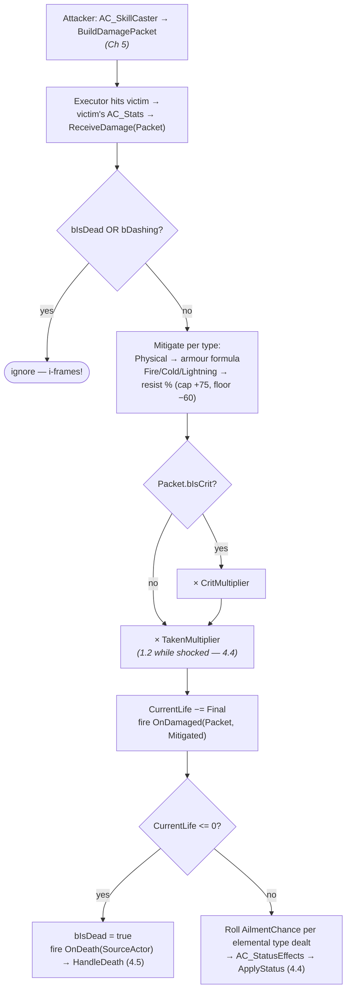

# Chapter 4 — The Damage Pipeline & Status Effects

> **Goal of this chapter:** one pipeline that every point of damage in the game flows through — hero skills, monster claws, ignite ticks, a Volatile monster's death explosion. A hit is a struct (`F_DamagePacket`), mitigation is math that lives in one function (`AC_Stats → ReceiveDamage`), and ignite/chill/shock are nothing but *timed stat mods* — the first real payoff of the source-keyed modifier system you built in [Chapter 3](03-stats-and-modifiers.md).

---

## 4.1 The shape of a hit: `F_DamagePacket`

Skills don't call "subtract 12 life" on their victims. They build a **packet** describing the hit and hand it over; the *victim* decides what that hit is worth after armour, resists, and shock. That split — attacker describes, defender resolves — is what lets one function serve every attacker in the game, and it's the same split PoE and Diablo use internally.

First the enum. Create `E_Stat`'s little sibling in `/Game/ARPG/Data`:

**`E_DamageType`** — `Physical`, `Fire`, `Cold`, `Lightning`. Four is enough; chaos/poison is a rerun of fire/ignite with different colors, and you can add it in an afternoon later precisely *because* everything below is keyed on this enum.

Then the struct, `F_DamagePacket`:

| Field | Type | Purpose |
|---|---|---|
| `DamageByType` | Map: `E_DamageType` → float | pre-mitigation damage per type — one hit can carry several |
| `bIsCrit` | bool | rolled **once per use** on the build side, not per victim |
| `CritMultiplier` | float | attacker's CritMulti stat *at build time* (150 = ×1.5) |
| `AilmentChance` | float | % chance per elemental type to inflict its ailment |
| `SourceActor` | Actor (soft ref) | killer credit, knockback direction, Ch 11 feedback |
| `SourceLevel` | int | attacker level — feeds XP penalty (Ch 9) and item level (Ch 7) |
| `SkillTags` | `E_SkillTag[]` | the hitting skill's tags — future-proofing ("30% more Area damage") |

> **Design note:** damage values are snapshot into the packet when it's built. If the caster dies while their fireball is mid-flight, the fireball still hits with the stats it left with. Snapshots make projectiles, DoTs, and delayed AoEs *deterministic* — resist the urge to "read live stats on impact."

## 4.2 The build side — sketched only, Chapter 5 owns it

`BuildDamagePacket` lives on `AC_SkillCaster`, because building a hit requires the skill row (base min–max per type) and the caster's stats — both of which are that component's business. [Chapter 5](05-skills-as-data.md) implements it properly; here is the shape so the receive side has something to test against:

```text
Blueprint: AC_SkillCaster — function BuildDamagePacket (SkillRow) → F_DamagePacket   (SKETCH — built in Ch 5)
──────────────────────────────────────────────────────────────────
[For Each: SkillRow.DamageMin/Max per E_DamageType]
 → [Random Float in Range (Min, Max)]                    ◄ the roll
 → [Apply AC_Stats Damage<Type> mods via the Ch 3 formula]   ◄ (Base+Flat) × (1+ΣInc) × Π(1+More)
[Branch: Random Float in Range (0, 100) < GetStat(CritChance)]   ◄ CritChance is percent
 → [Set bIsCrit]                                         ◄ ONE roll per use — every hit of this
                                                           cast crits or none do (PoE-style; arcade-
                                                           simple, and AoE crits feel amazing)
[Set CritMultiplier = GetStat(CritMulti)] ; [Set AilmentChance, SourceActor, SourceLevel, SkillTags]
```

Note what's *absent*: no reference to the victim. A packet is built once per use and delivered to everyone the executor hits.

## 4.3 The receive side: `AC_Stats → ReceiveDamage`

Add `ReceiveDamage(Packet: F_DamagePacket)` to `AC_Stats`, plus two state flags it guards on: `bIsDead` (set here) and `bDashing` (set by the [Chapter 2](02-movement-and-input.md) dash — this line is where those i-frames actually happen). The whole pipeline, end to end:



```text
Blueprint: AC_Stats — function ReceiveDamage (Packet: F_DamagePacket)
─────────────────────────────────────────────────────────────────────
[Branch: bIsDead OR bDashing] → true: return          ◄ dash i-frames from Ch 2, honored in ONE place
[For Each: Packet.DamageByType (Type, Raw)]
   Physical → [Reduction = Armour / (Armour + 10 × Raw)]        ◄ armour is worse vs big hits — see below
              [Mitigated += Raw × (1 − Reduction)]
   else     → [Res = Clamp(GetStat(<Type>Res), −60, 75)]        ◄ cap +75%, floor −60%
              [Mitigated += Raw × (1 − Res / 100)]
[Branch: Packet.bIsCrit]
   true → [Mitigated ×= Packet.CritMultiplier / 100]            ◄ crit multiplies AFTER mitigation
[Mitigated ×= AC_StatusEffects → GetTakenMultiplier]            ◄ 1.0 normally, 1.2 shocked; IsValid-check
                                                                  the component — dummies might lack it
[Set CurrentLife = Clamp(CurrentLife − Mitigated, 0, GetStat(MaxLife))]
[Call OnDamaged (Packet, Mitigated)]                            ◄ Ch 11 hangs damage numbers here
[Branch: CurrentLife <= 0]
   true  → [Set bIsDead] → [Call OnDeath (Packet.SourceActor)]
   false → [TryApplyAilments (Packet)]                          ◄ 4.4 — corpses don't get chilled
```

**Why that armour formula.** `Reduction = Armour / (Armour + 10 × Raw)` is PoE-shaped: mitigation *depends on the size of the incoming hit*. 400 armour reduces a 50-damage scratch by `400 / (400 + 500)` = 44%, but a 300-damage slam by only `400 / (400 + 3000)` = 12%. Armour eats chip damage from hordes and does little against the boss telegraph you were supposed to dodge — which is exactly the gameplay statement you want armour to make. A flat percentage can't say that.

**Why resists are capped and floored.** Uncapped resists hit 100% and trivially delete a damage type from the game; the +75 cap keeps elemental damage forever relevant and makes "max your resists" a real gearing goal (Ch 8). The −60 floor exists so cursed/penalty content (rare monster auras, future map mods) can push resists negative without one-shot absurdity.

**Why crit multiplies after mitigation.** It's one multiplier on one number, instead of inflating four per-type values before armour gets to distort them non-linearly. Same final feel, half the graph — and the damage number Ch 11 shows is exactly `Mitigated`.

> **Multiplayer note:** in single-player, whoever calls `ReceiveDamage` is fine. In co-op, this entire function must run server-side and `CurrentLife` becomes replicated state — the [co-op soulslike guide's damage chapter](../coop-soulslike-ue5/05-stats-and-damage.md) is this exact pipeline rebuilt with authority checks, and [Chapter 13](13-coop-multiplayer.md) makes that move here (it costs one Authority branch — the single-entry-point design is why).

## 4.4 `AC_StatusEffects`: ailments are timed stat mods

Here's the Chapter 3 payoff, and it's worth saying loudly: **chill is not a system — it's two `F_StatMod`s with a timer on them.** Because every number already flows through `AC_Stats`, and mods are keyed by source Name, a debuff is just `AddMods("Status_Chill", ...)` now and `RemoveModsFromSource("Status_Chill")` two seconds later. No special-case slow code in movement, no "check if chilled" branches anywhere. You built this machinery last chapter; ailments ride it for free.

Open the empty `AC_StatusEffects` shell from Chapter 1 (it's on `BP_Hero` *and* `BP_EnemyBase` — monsters chill you right back) and add:

| Variable | Type | Default | Purpose |
|---|---|---|---|
| `TakenMultiplier` | float | 1.0 | read by `ReceiveDamage` — shock's whole implementation |
| `IgniteDPS` | float | 0 | current ignite damage per second |
| `ActiveTimers` | Map: `E_StatusEffect` → Timer Handle | — | one expiry timer per ailment — refresh, don't stack |
| `ActiveVFX` | Map: `E_StatusEffect` → Niagara Component | — | so EndStatus can kill the right flames |

**`E_StatusEffect`** — `Ignite`, `Chill`, `Shock`. The three ailments, one per elemental type:

| Ailment | Inflicted by | Effect | Duration |
|---|---|---|---|
| Ignite | Fire damage | DoT: DPS = 20% of the hit's fire damage (so 80% of the hit again over the duration) | 4 s |
| Chill | Cold damage | `More −30%` MoveSpeed, AttackSpeed, CastSpeed — source `Status_Chill` | 2 s |
| Shock | Lightning damage | victim takes `More +20%` damage from ALL hits (`TakenMultiplier = 1.2`) | 4 s |

```text
Blueprint: AC_Stats — function TryApplyAilments (Packet)      ◄ called at the end of ReceiveDamage
──────────────────────────────────────────────────────────
[For Each elemental Type in Packet.DamageByType where Raw > 0]
 → [Branch: Random Float in Range (0,100) < Packet.AilmentChance]     ◄ one roll PER TYPE present
     true → [AC_StatusEffects → ApplyStatus (Type's ailment,
              Magnitude = Raw for Ignite / 30 for Chill / 20 for Shock, Duration from table)]

Blueprint: AC_StatusEffects — function ApplyStatus (Type: E_StatusEffect, Magnitude, Duration)
──────────────────────────────────────────────────────────────────────────────────────────────
[Switch on Type]
  Ignite → [Set IgniteDPS = Magnitude × 0.2]
           [Set Timer by Function Name ("IgniteTick", 0.5 s, Looping)]   ◄ tick fn below
  Chill  → [AC_Stats → RemoveModsFromSource ("Status_Chill")]            ◄ refresh = wipe, re-apply
           [AC_Stats → AddMods ("Status_Chill",
              [More −Magnitude MoveSpeed] [More −Magnitude AttackSpeed] [More −Magnitude CastSpeed])]
  Shock  → [Set TakenMultiplier = 1.0 + Magnitude / 100]
[Set Timer by Event (Duration) → EndStatus(Type)]        ◄ store handle in ActiveTimers, keyed by Type —
                                                           re-setting the SAME handle restarts the clock:
                                                           that's the whole refresh-don't-stack rule
[Spawn System Attached (NS_Status_<Type>, Mesh)] → store in ActiveVFX   ◄ the "am I on fire" hook

Blueprint: AC_StatusEffects — IgniteTick (every 0.5 s while burning)
─────────────────────────────────────────────────────────────────────
[Make F_DamagePacket: DamageByType = {Fire: IgniteDPS × 0.5}, AilmentChance = 0, bIsCrit = false]
 → [AC_Stats → ReceiveDamage]     ◄ DoT ticks are just tiny fire hits: fire res mitigates the burn
                                    (PoE-correct!), death check and Ch 11 damage numbers come free

EndStatus(Type): clear looping timer / RemoveModsFromSource / TakenMultiplier = 1.0, destroy the NS component.
```

Ignite's `Magnitude` is the packet's **pre-mitigation** fire damage — the ticks flow back through `ReceiveDamage` and get resisted there, so mitigation applies exactly once per tick instead of being baked in twice.

> **Design note:** *refresh, don't stack.* PoE juggles stacking ignites with complicated rules; Diablo doesn't, and neither do we. A second ignite while burning restarts the 4 s clock at the new magnitude. One rule, zero bookkeeping, and the player-facing read is binary: "it's burning." Arcade games are legible games.

> **Pitfall:** the chill mods are `More`, not `Increased` — on purpose. An `Increased −30%` would get *added* into the same bucket as the hero's "20% increased movement speed" boots and partially cancel out. `More` is its own multiplier: chill always cuts exactly 30% of whatever your speed currently is, regardless of gear. Debuffs should be `More` almost without exception.

## 4.5 Death: `HandleDeath` and the `OnEnemyKilled` contract

`OnDeath` fired; someone has to clean up. Bind it in `BP_EnemyBase` BeginPlay:

```text
Blueprint: BP_EnemyBase — HandleDeath (Killer)     ◄ bound to AC_Stats.OnDeath
────────────────────────────────────────────────
[Stop AI]                                          ◄ once AIC_Enemy exists (Ch 6): Stop Movement +
                                                     stop brain logic; today, nothing to stop
[Set Actor Enable Collision: capsule → ignore Pawn]   ◄ corpses must not body-block the horde
[Set Simulate Physics on Mesh]                     ◄ ragdoll now; the dissolve upgrade is Ch 11's
[BP_ARPGGameMode → Call OnEnemyKilled (EnemyDef, Rarity, Level, Location)]
[Set Timer by Event (10 s) → Destroy Actor]        ◄ placeholder — Ch 11 replaces with the corpse cap
```

Create the `OnEnemyKilled` dispatcher on `BP_ARPGGameMode` **now, with its full signature** — `EnemyDef` and `Rarity` don't mean anything until [Chapter 6](06-enemies-and-hordes.md) fills them in (pass defaults today), but locking the signature means loot ([Chapter 7](07-loot-generator.md)) and XP ([Chapter 9](09-progression-and-passives.md)) can subscribe to it without anyone rewiring this chapter. Death is an *announcement*; the enemy neither knows nor cares who's listening.

The hero side is simpler for now: bind `OnDeath` in `BP_Hero` → disable input, play a death anim or ragdoll, `Open Level (current)` after 3 s. Real death flow (respawn at waypoint) lands with zones in [Chapter 10](10-zones-and-maps.md).

## 4.6 `BP_TrainingDummy` and a debug melee

Skills don't exist yet, so build the punching bag and a temporary fist. `BP_TrainingDummy`: parent `Character` (free capsule + mesh), components `AC_Stats` + `AC_StatusEffects`, stats from a `DT_StatDefaults` row — give it MaxLife 500, Armour 400, FireRes 0 so every number in this chapter is testable. Place three in `L_Dev_Gym`. Then a throwaway attack on `BP_Hero` (delete it in Chapter 5 — its replacement is the whole point of that chapter):

```text
[IA_Skill_LMB Triggered]                                   ◄ TEMP — Ch 5 rewires this into TryCast
 → [Multi Sphere Trace For Objects (Pawn), start = actor loc, end = loc + forward × 150, r = 60]
 → [For Each hit: get AC_Stats]
     → [Make F_DamagePacket: {Physical: 10, Fire: 8}, AilmentChance = 25,
        bIsCrit = (Random < 5), CritMultiplier = 150, SourceActor = self, SourceLevel = 1]
     → [ReceiveDamage]
```

Hand-rolling the packet here instead of calling the (unbuilt) `BuildDamagePacket` is deliberate: it proves the receive side stands alone. Open `WBP_StatSheet` (C, from Ch 3) on a dummy-clicked… no — simpler: bind a `Print String` to the dummy's `OnDamaged` showing `Mitigated`, and one to `OnStatsChanged` to watch chill land. Now punch things and check the math: 10 phys into 400 armour → `400/(400+100)` = 80% reduction → 2.0; 8 fire at 0 res → 8.0; total **10.0** per non-crit punch, **15.0** on a crit.

## 4.7 Test before moving on

| Test | Expected |
|---|---|
| Punch the dummy (no crit) | damage number/print = 10.0 exactly (2 phys after armour + 8 fire) |
| Punch ~20 times | roughly 1 in 20 prints 15.0 — the 5% CritChance, ×1.5 after mitigation |
| Set dummy FireRes to 75 | fire part drops to 2.0/hit; set −60 → 12.8/hit (floor works) |
| Punch until ignite procs (~25%) | dummy loses fire-hit × 0.2/s for 4 s in 0.5 s ticks; flames NS on mesh; ticks shrink if FireRes > 0 |
| Re-proc ignite mid-burn | duration restarts, ticks change to new magnitude — no stacking |
| Give debug punch Cold damage, proc chill | dummy's MoveSpeed/AttackSpeed final stats drop exactly 30% in the stat sheet; restore after 2 s |
| Proc shock, then punch | every hit for 4 s prints ×1.2 damage |
| Dash through an enemy hit (Ch 2) | zero damage — `bDashing` honored in `ReceiveDamage` |
| Kill a dummy | ragdolls, stops blocking movement, `OnEnemyKilled` prints on GameMode, corpse gone in 10 s |
| Kill via ignite tick alone | death path fires from the DoT — proof there's only one pipeline |

---

**Next:** [Chapter 5 — Skills as Data](05-skills-as-data.md) — where `BuildDamagePacket` gets built for real, and the debug fist becomes six data-driven skills.
