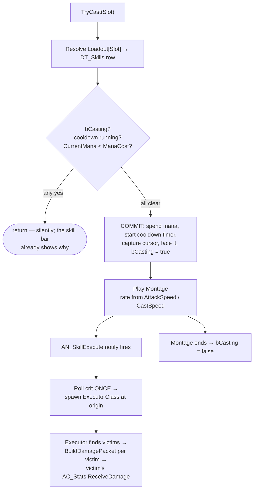

# Chapter 5 — Skills as Data

> **Goal of this chapter:** every skill in the game is a Data Table row. One component (`AC_SkillCaster`) validates and casts; three tiny executor Blueprints do the geometry; the [Chapter 4](04-damage-and-ailments.md) pipeline does the rest. By the end you have six working skills on a proper skill bar — and adding a seventh takes five minutes and zero new Blueprints.

---

## 5.1 The thesis: a skill is not a Blueprint

The naive way to build Fireball is a `BP_Fireball` actor with its damage, cost, and cooldown typed into it. Do that six times and you have six snowflakes; do it forty times and balancing your game means opening forty Blueprints. The guide's One Rule says no: **content is data; Blueprints are executors.**

Look at what actually differs between Fireball and Lightning Bolt: numbers and an executor shape. Both are "spawn projectile(s) toward the cursor." Fireball and Ground Slam differ more — one is a projectile, one is a cursor-targeted circle — but that's still just *which* of a handful of delivery shapes fires. So the split is:

- **`DT_Skills`** — one row per skill: costs, damage ranges, tags, montage, and *which executor class* to spawn with *what parameters*.
- **Executors** — exactly three damage-dealing Blueprints (`BP_Exec_MeleeSweep`, `BP_Exec_Projectile`, `BP_Exec_GroundAoE`) plus `BP_Exec_Buff`. Every skill you will ever add is a row pointing at one of these.
- **`AC_SkillCaster`** — the component that owns slots, cooldowns, mana checks, montages, and packet building. It never knows what a "Fireball" is.

## 5.2 DT_Skills and the row struct

Create `F_SkillDef` (in `/Game/ARPG/Data/`) and a Data Table `DT_Skills` from it (in `/Game/ARPG/Skills/`). First the supporting types — `E_SkillTag` (Attack, Spell, Melee, Projectile, Area, Duration, Movement) and the executor parameter block:

**`F_ExecutorParams`** — the shape knobs, interpreted by whichever executor the row names:

| Variable | Type | Default | Purpose |
|---|---|---|---|
| `ProjectileClass` | Soft Class Ref (`BP_SkillProjectile`) | none | which projectile actor to fire |
| `ProjectileCount` | int | 1 | base count — the `ProjectileCount` *stat* adds to it |
| `ProjectileSpeed` | float | 2000 | uu/s |
| `Radius` | float | 0 | impact/nova radius — scaled by the `AreaOfEffect` stat |
| `Range` | float | 0 | melee reach, projectile lifetime range, or max cursor distance |
| `ConeAngle` | float | 90 | melee sweep arc, degrees |
| `BuffMods` | `F_StatMod[]` | empty | for `BP_Exec_Buff`: the mods to apply |
| `BuffDurationS` | float | 0 | how long the buff lasts |

**`F_SkillDef`** — the row itself:

| Variable | Type | Purpose |
|---|---|---|
| `Id` | Name | matches the row name; used everywhere as the skill key |
| `DisplayName` | Text | UI |
| `Icon` | Texture 2D (soft ref) | skill bar + tooltips |
| `Tags` | `E_SkillTag[]` | Attack vs Spell picks the speed stat; Ch. 8 weapons and Ch. 9 passives filter on these |
| `ManaCost` | float | spent at commit |
| `CooldownS` | float | 0 = spammable; divided by the `CooldownRate` stat |
| `BaseUseTime` | float | seconds per use at 100% attack/cast speed |
| `DamageMin` / `DamageMax` | Map `E_DamageType` → float | per-type roll range; empty for non-damage skills |
| `AilmentChance` | float | % chance to apply the matching ailment ([Ch. 4](04-damage-and-ailments.md)) |
| `DamagePerLevelPct` | float | % more damage per caster level above 1 — keeps skills alive while leveling |
| `Montage` | Anim Montage (soft ref) | must contain the `AN_SkillExecute` notify |
| `ExecutorClass` | Soft Class Ref (Actor) | one of the four executors |
| `ExecutorParams` | `F_ExecutorParams` | see above |

> **Design note:** `ExecutorClass` is a *soft* class reference on purpose: a Data Table with hard refs to every projectile, montage, and Niagara system in the game loads them all the moment anything touches the table. Soft refs keep `DT_Skills` cheap; `AC_SkillCaster` sync-loads on first cast (fine at these asset sizes) — swap to async load if a hitch ever shows up.

## 5.3 AC_SkillCaster: slots, validation, TryCast

You created the empty `AC_SkillCaster` in Chapter 1 on both `BP_Hero` and `BP_EnemyBase`. Now it grows a brain. Add `E_SkillSlot` (LMB, RMB, Q, W, E, R) and:

| Variable | Type | Default | Purpose |
|---|---|---|---|
| `Loadout` | Map `E_SkillSlot` → Name | see 5.6 | which `DT_Skills` row sits in which slot |
| `Cooldowns` | Map `E_SkillSlot` → Timer Handle | empty | live cooldown timers |
| `bCasting` | bool | false | one cast at a time |
| `CurrentTargetLoc` | Vector | — | cursor world position, captured at commit |
| `bCurrentCastCrit` | bool | — | crit rolled once per use (5.4) |
| `OnCastCommitted` | Dispatcher (Slot, SkillId) | — | `WBP_SkillBar` starts its sweep here |

Input is one line per action — all six of Chapter 1's skill actions route into the same function:

```text
[IA_Skill_Q Triggered]
 → [AC_SkillCaster → TryCast (Slot=Q)]      ◄ all validation lives in the component;
                                              input events stay one node long
```

`TryCast` is the whole cast pipeline:



```text
Blueprint: AC_SkillCaster — function TryCast (Slot)
───────────────────────────────────────────────────
[Find Loadout[Slot]] → not found: return
[Get Data Table Row (DT_Skills, RowName)] → Skill
[Branch: bCasting OR GetCooldownRemaining(Slot) > 0 OR CurrentMana < Skill.ManaCost]
   true → return                             ◄ fail silently — no error spam;
                                               the bar grays/sweeps the slot
[AC_Stats → ModifyMana (−Skill.ManaCost)]    ◄ spend at COMMIT, not on hit —
[StartCooldown (Slot, Skill.CooldownS)]        refund logic is a bug farm
[Set CurrentTargetLoc = BP_ARPGPlayerController → GetCursorWorldLocation()]
                                             ◄ Chapter 6 adds an AI aim override here
[Face CurrentTargetLoc]                      ◄ the RInterp yaw from Chapter 2
[Set bCasting = true]
[Rate = (Montage Play Length / Skill.BaseUseTime)
        × GetStat(Attack tag ? AttackSpeed : CastSpeed)]   ◄ speed stats are 1.0-based
[Play Anim Montage (Skill.Montage, Rate)]    ◄ any-length montage compresses to
 → [On Completed / Interrupted]                BaseUseTime at speed stat 1.0
     → [Set bCasting = false]
[Call OnCastCommitted (Slot, Skill.Id)]

[StartCooldown (Slot, CooldownS)]
 → [Effective = CooldownS / GetStat(CooldownRate)]   ◄ CooldownRate is 1.0-based
 → [Set Timer by Event (Effective, no loop)] → [Cooldowns.Add(Slot, Handle)]

[GetCooldownRemaining (Slot) → float]        ◄ pure; UI reads this every frame
 → [Get Timer Remaining Time by Handle (Cooldowns[Slot])]  (invalid handle → 0)
```

The damage moment is an anim notify, not a delay node: add `AN_SkillExecute` (plain AnimNotify) on the swing/release frame of every skill montage. Its `Received_Notify` calls back into the caster:

```text
[AN_SkillExecute → Received_Notify]
 → [Owner.AC_SkillCaster → ExecuteCurrentSkill]

[ExecuteCurrentSkill]
 → [Set bCurrentCastCrit = Random Bool with Weight (GetStat(CritChance) / 100)]
 → [Spawn Actor (Skill.ExecutorClass)]       ◄ origin: melee/buff = caster;
      Transform: at caster, facing CurrentTargetLoc          projectile = chest
      Expose on Spawn: Caster (self), SkillRow, TargetLoc    height socket;
                                                             AoE = TargetLoc
```

> **Pitfall:** capture the cursor at *commit*, not inside the notify. If you re-read it at execute time, a player who flicks the mouse during the windup fires a projectile sideways out of a character who hasn't turned yet. Committed aim also matches how the genre feels: the click *is* the decision.

> **Multiplayer note:** in a networked ARPG, `TryCast` becomes a Server RPC and every check reruns with authority — the [co-op soulslike guide's Chapter 6](../coop-soulslike-ue5/06-melee-combat.md) shows that shape, and [Chapter 13](13-coop-multiplayer.md) performs the split. Until then we simply don't care, and the code above stays this short.

## 5.4 BuildDamagePacket — the build side of Chapter 4

[Chapter 4](04-damage-and-ailments.md) built the *receive* side (`ReceiveDamage`: armour, resists, ailments, death) and sketched this function's contract. It lives here, on `AC_SkillCaster`, because only the caster knows the skill row and its own stats. Executors call it **once per victim** — each hit rolls its own damage — but the crit was rolled **once per use** in 5.3, PoE-style: one roll, every hit of that cast crits together. Simpler, and a full-crit nova is an arcade moment worth having.

```text
Blueprint: AC_SkillCaster — function BuildDamagePacket (Skill) → F_DamagePacket
───────────────────────────────────────────────────────────────────────────────
[For Each (Skill.DamageMin keys)]                    ◄ one entry per damage type
 → [Roll = Random Float in Range (Min[Type], Max[Type])]
 → [Roll += Σ Flat mods for Damage<Type>]            ◄ the Chapter 3 formula,
 → [Roll ×= (1 + Σ Increased / 100)]                   fed by GetStat's cached
 → [Roll ×= Π (1 + More_i / 100)]                      aggregation per type
 → [Roll ×= 1 + Skill.DamagePerLevelPct/100 × (CasterLevel − 1)]
 → [Packet.DamageByType.Add (Type, Roll)]
[Packet.bIsCrit        = bCurrentCastCrit]
[Packet.CritMultiplier = GetStat(CritMulti)]         ◄ stays in percent (150 = ×1.5);
                                                       ReceiveDamage divides by 100
[Packet.AilmentChance  = Skill.AilmentChance]
[Packet.SourceActor    = Owner] ; [Packet.SourceLevel = CasterLevel]
[Packet.SkillTags      = Skill.Tags]
[Return Packet]
```

Worked numbers, so you can verify in-game: Fireball rolls 9–14 fire. Say it rolls **12**, and the caster has +20 flat fire, 40% + 20% increased fire, one 30% more multiplier (Chapter 3's exact worked example, smaller base): `(12 + 20) × 1.60 × 1.30 = 66.6` fire, before the victim's resists. If your damage number doesn't match your hand math, the bug is on exactly one side of the packet — that's the point of the split.

Attack-tagged skills will eventually add the *equipped weapon's* damage range into this roll — that's [Chapter 8](08-inventory-and-equipment.md)'s one-line change here. Until then, `BasicSlash` carries its own numbers.

## 5.5 The executors

Every executor is spawned with `Caster`, `SkillRow`, `TargetLoc` exposed on spawn, reads the caster's stats **at spawn time** (a buff that expires mid-flight shouldn't retroactively weaken a projectile), and destroys itself when done.

**`BP_Exec_MeleeSweep`** — a cone in front of the caster, one frame of work:

```text
[Event BeginPlay]
 → [Radius = SkillRow.ExecutorParams.Range]
 → [Multi Sphere Trace For Objects (Pawn), start = end = Caster loc, r = Radius]
 → [For Each Hit] → [Dir = Normalize(Hit.Actor loc − Caster loc), flatten Z]
     → [Branch: Acos(Dot(Caster forward, Dir)) ≤ ConeAngle / 2]    ◄ the cone
     → [Victim.AC_Stats → ReceiveDamage (Caster.BuildDamagePacket(SkillRow))]
 → [Destroy Actor]
```

**`BP_Exec_Projectile`** — spawns N × `BP_SkillProjectile` in a fan:

```text
[Event BeginPlay]
 → [Count  = ExecutorParams.ProjectileCount + Round(Caster.GetStat(ProjectileCount))]
 → [Spread = (Count − 1) × 12°, centered on aim direction]    ◄ fan, PoE-style
 → [For i in Count] → [Spawn BP_SkillProjectile (yaw offset_i)]
      Expose on Spawn: Caster, SkillRow, Speed, MaxRange = ExecutorParams.Range
 → [Destroy Actor]
```

`BP_SkillProjectile` (in `/Game/ARPG/Skills/`): sphere collision (overlap Pawn only) + `ProjectileMovement` (speed set on spawn, no gravity) + a `NS_` trail. On overlap: ignore the caster and anything already in its `HitActors` set (the hit-once list — one projectile, one hit per enemy), `BuildDamagePacket` → `ReceiveDamage`, then destroy — unless its `bPierce` flag (a class default; make `BP_SkillProjectile_Piercing` when a skill needs it) lets it keep flying. If `ExecutorParams.Radius > 0`, the impact instead does a radial hit like GroundAoE below — that's Fireball's 150uu splash. Destroy after traveling `Range` or 3 s, whichever first.

**`BP_Exec_GroundAoE`** — telegraph, then boom, at the cursor:

```text
[Event BeginPlay]
 → [Loc = TargetLoc clamped to ExecutorParams.Range from Caster]
      ◄ Range 0 = cast on self, skip the telegraph (that's FrostNova)
 → [FinalRadius = ExecutorParams.Radius × Caster.GetStat(AreaOfEffect)]
      ◄ AreaOfEffect is a 1.0-based multiplier; "increased AoE" mods already
        multiplied into it by the Chapter 3 pipeline
 → [Spawn decal (M_Telegraph, size = FinalRadius)] → [Delay (TelegraphTime)]
      ◄ TelegraphTime: class default 0.6 s; 0 when self-cast
 → [Sphere Overlap Actors (Pawn, Loc, FinalRadius)]
 → [For Each victim ≠ Caster] → [ReceiveDamage (Caster.BuildDamagePacket(SkillRow))]
 → [Spawn NS_ impact] → [Destroy Actor]
```

> **Design note:** the telegraph decal looks like over-engineering for a player skill — until [Chapter 6](06-enemies-and-hordes.md), where enemy casters use *this same executor* and the telegraph is what makes their AoE dodgeable instead of cheap. Building it now costs one decal.

**`BP_Exec_Buff`** — no geometry at all; it's a thin bridge into Chapter 3:

```text
[Event BeginPlay]
 → [Caster.AC_Stats → AddMods (Source = "Status_" + SkillRow.Id,
                               Mods = ExecutorParams.BuffMods)]
 → [Set Timer by Event (ExecutorParams.BuffDurationS)]
     → [RemoveModsFromSource ("Status_" + SkillRow.Id)] → [Destroy Actor]
```

Recasting refreshes cleanly because `AddMods` under the same Source key replaces — the refresh-don't-stack rule from Chapter 4, for free, because everything is the same `F_StatMod` machinery.

## 5.6 Six skills, zero new Blueprints

Fill `DT_Skills` (damage per use; ProjectileCount 1 and unlisted params default unless noted):

| Row (Id) | Tags | Mana | CD | UseTime | Damage | Ailment% | Executor | Params |
|---|---|---|---|---|---|---|---|---|
| `BasicSlash` | Attack, Melee | 0 | 0 | 0.6 | Phys 6–10 | 0 | MeleeSweep | Range 220, Cone 100° |
| `Fireball` | Spell, Projectile | 12 | 0 | 0.8 | Fire 9–14 | 25 (ignite) | Projectile | Speed 2200, Radius 150, Range 3000 |
| `FrostNova` | Spell, Area | 18 | 4 | 0.7 | Cold 8–12 | 40 (chill) | GroundAoE | Radius 320, Range 0 (self) |
| `LightningBolt` | Spell, Projectile | 9 | 0 | 0.5 | Ltng 3–16 | 20 (shock) | Projectile | Speed 3200, Range 3200 |
| `GroundSlam` | Attack, Melee, Area | 15 | 6 | 0.9 | Phys 18–26 | 0 | GroundAoE | Radius 250, Range 800 |
| `WarCry` | Spell, Duration | 20 | 10 | 0.5 | — | 0 | Buff | BuffMods: DamagePhys **Increased +30**, AttackSpeed **Increased +20**; 6 s |

(Lightning's wide 3–16 roll is the genre's oldest tradition — spiky damage is lightning's personality; shock evens it out over a fight. All `DamagePerLevelPct`: 4.)

Default `Loadout` on `BP_Hero`'s caster: LMB `BasicSlash`, RMB `Fireball`, Q `FrostNova`, W `LightningBolt`, E `GroundSlam`, R `WarCry`. Point every montage at your placeholder attack/cast anims with `AN_SkillExecute` dropped on the contact frame — real animation polish is a [Chapter 11](11-arcade-layer.md) problem.

## 5.7 WBP_SkillBar

Six `WBP_SkillSlot` children in a horizontal box, bottom-center of `WBP_HUD`. Each slot owns one `E_SkillSlot`, resolves its row for icon and cost, and shows three states:

- **Cooldown radial sweep:** an Image over the icon using `MI_CooldownSweep` (a radial-gradient material with a `Percent` scalar). Update from one 0.1 s widget timer per bar — **not** Tick — setting `Percent = GetCooldownRemaining(Slot) / EffectiveCooldown`. Timers over Tick is a rule this guide repeats until Chapter 11 makes it law.
- **Mana gate:** bind to `AC_Stats.OnManaChanged`; when `CurrentMana < ManaCost`, desaturate the icon (opacity 0.4 or a grayscale MID param). Event-driven, zero polling.
- **Cast flash:** bind `OnCastCommitted` → quick highlight animation on the matching slot.

> **Pitfall:** don't drive the sweep by binding the Image's property to a function — UMG property bindings evaluate every frame, which is Tick wearing a hat. With six slots polling a pure getter at 10 Hz you'll never see this widget in a profile.

## 5.8 The closing argument: enemies already have this

Scroll back through this chapter and notice what's missing: the word "player." `AC_SkillCaster` needs an owner with `AC_Stats`, a target location, and a montage slot — nothing else. It's already sitting on `BP_EnemyBase` (Chapter 1), so in [Chapter 6](06-enemies-and-hordes.md) an enemy's Behavior Tree attack task is *one node*: `TryCast(Slot=LMB)` with `CurrentTargetLoc` fed from the Blackboard instead of the cursor. A ranged skeleton is a `DT_Skills` row plus a loadout entry. An enemy fire-mage *is* your Fireball — same row if you want, same ignite, same telegraph on its ground AoE, same `BuildDamagePacket` reading *its* stats, which means Chapter 6's monster mods (a Fiery rare with `Increased DamageFire`) work on day one without touching a single skill.

That's the load-bearing part. You didn't build the player's skills this chapter — you built *the game's* skills. Everything after this is rows.

## 5.9 Test before moving on

In `L_Dev_Gym`, with a line of `BP_TrainingDummy` targets from Chapter 4:

| Test | Expected |
|---|---|
| BasicSlash into 3 clustered dummies | all 3 take Phys damage once each; dummy behind you takes none (cone filter) |
| Fireball a dummy | fire damage on impact; ~25% of hits ignite (DoT ticks on the dummy); splash hits an adjacent dummy inside 150uu |
| Fireball with 30 mana → cast ×3 | third cast refused: no mana spent, no montage, slot grayed on the bar |
| FrostNova mid-pack | instant, self-centered, no telegraph; chilled dummies show the Ch. 4 slow (watch a moving one) |
| GroundSlam at max cursor range + beyond | clamps to 800uu; telegraph decal shows for 0.6 s before damage lands |
| GroundSlam twice fast | second press refused during cooldown; radial sweep on the bar matches `GetCooldownRemaining` |
| WarCry, then BasicSlash | slash numbers up ~30%, swings visibly faster; both revert after 6 s; recast mid-buff refreshes, doesn't stack |
| Add `AreaOfEffect +50 Increased` via a debug `AddMods` | FrostNova/GroundSlam circles visibly grow; telegraph decal matches the real radius |
| Add `ProjectileCount +2` the same way | Fireball fires a 3-projectile fan; each enemy hit only once per projectile |
| Crit check: set CritChance 100 | *every* projectile of one cast crits together (one roll per use) |
| New row `IceShard` (copy LightningBolt, Cold, chill) in `DT_Skills`, slot it | fully working skill; **you opened zero Blueprints** |
