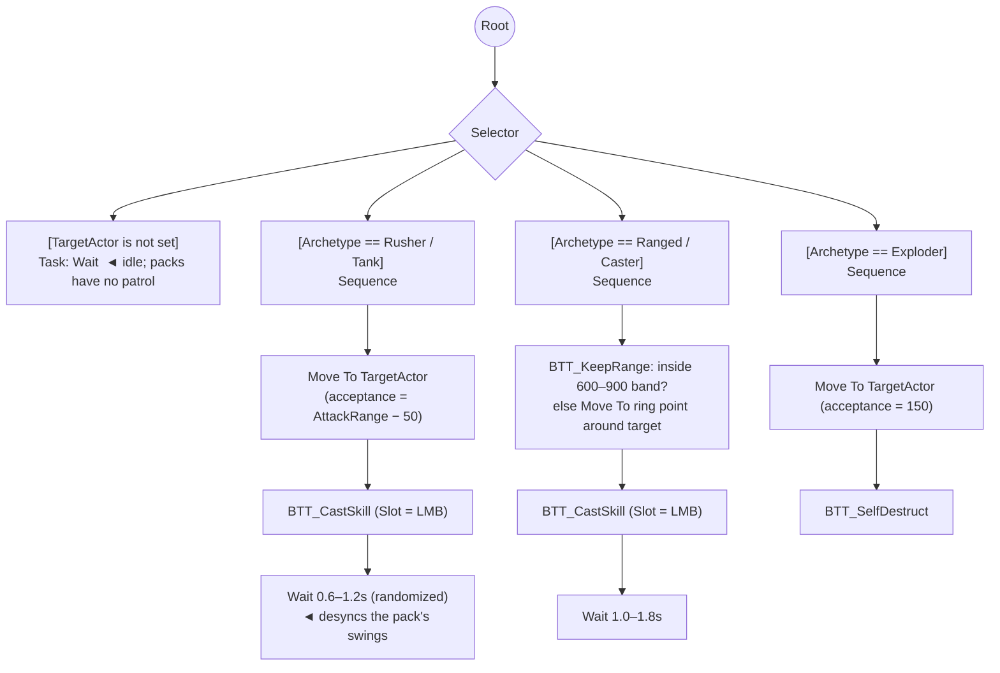

# Chapter 6 — Enemies at Horde Scale

> **Goal of this chapter:** monster packs that make an ARPG feel like an ARPG — dozens of enemies on screen, five archetypes running on *one* Behavior Tree, magic and rare monsters with rolled modifiers, and spawners that keep it all cheap. Everything the enemy *does* to you reuses Chapters 3–5: enemies cast skills through the same `AC_SkillCaster`, take and deal damage through the same pipeline, and their modifiers are the same `F_StatMod` you built in [Chapter 3](03-stats-and-modifiers.md).

---

## 6.1 Design for sixty, not five

The sibling soulslike guide builds enemies the artisanal way: per-enemy sight perception, attack tokens, threat tables ([its Chapter 8](../coop-soulslike-ue5/08-enemy-ai.md)). That's correct for five smart enemies. It's ruinous for sixty dumb ones — every per-mob feature you add is multiplied by the horde. So this chapter's rule: **spend per-pack, not per-mob.** Concretely:

- **No AI Perception components.** Sixty sight-sense updates per frame buys you nothing a single sphere on the spawner doesn't. Aggro is a *pack* decision.
- **Dormant until woken.** A mob the player hasn't met yet has no tick, no running brain, and a nearly free animation budget.
- **One Behavior Tree** for all archetypes. Five trees means five things to debug; one tree with archetype branches means the Rusher fix also fixes the Caster.
- **No attack tokens.** Souls enemies queue politely because each hit is a negotiation. ARPG mobs are fodder — the *swarm* is the threat, and you have a screen-clearing Fireball precisely because eight things are allowed to swing at you at once. (Escape hatch in 6.5 if it ever feels unfair.)

And the One Rule holds: a monster is a **row**, not a Blueprint. You'll ship five archetypes and six monster mods this chapter and could ship fifty more without opening a graph.

## 6.2 Enemies as data: `DT_EnemyTypes`

`E_EnemyArchetype`: `Rusher, Ranged, Caster, Tank, Exploder`. Then `F_EnemyDef`, the row struct for `DT_EnemyTypes` (in `/Game/ARPG/Data`):

| Field | Type | Purpose |
|---|---|---|
| `Id` | Name | row key, e.g. `Zombie` |
| `Name` | Text | display name ("Rotting Zombie") |
| `Mesh` / `AnimBP` | soft refs | visuals — soft so the table doesn't load every monster |
| `Archetype` | `E_EnemyArchetype` | which BT branch runs (6.6) |
| `StatDefaultsRow` | Name | row in `DT_StatDefaults` (Ch. 3) — base life, armour, damage |
| `Skills` | Name[] | rows in `DT_Skills` — yes, *the* skill table from [Chapter 5](05-skills-as-data.md) |
| `XP` | float | base XP, consumed in [Chapter 9](09-progression-and-passives.md) |
| `LootTableRow` | Name | consumed in [Chapter 7](07-loot-generator.md) |
| `MoveSpeed` | float | walk speed (Rusher ~450, Tank ~280) |

Ship four rows now: `Zombie` (Rusher), `SkeletonArcher` (Ranged), `Cultist` (Caster, give it the Fireball row — enemies literally cast your Fireball), `BloatSpore` (Exploder). Tank comes free later; it's just a Rusher row with a fat `StatDefaultsRow`.

**Level scaling:** create `CT_MonsterScaling`, a Curve Table with two curves — `LifeMulti` and `DamageMulti` over monster level (1.0 at level 1, roughly ×1.35 per 5 levels; tune later). The zone decides the level ([Chapter 10](10-zones-and-maps.md) owns `BP_ZoneInfo`); until then the spawner has an editable `MonsterLevel` int. The multipliers are applied as — you guessed it — `F_StatMod`s with op `More`, Source `MonsterLevel`, on spawn. No hardcoded numbers on actors, ever.

## 6.3 `BP_EnemyBase` and enemy skills

`BP_EnemyBase` (Character, in `/Game/ARPG/Enemies`) carries `AC_Stats`, `AC_SkillCaster`, `AC_StatusEffects` — the exact components on `BP_Hero`. Class Defaults: AI Controller Class = `AIC_Enemy`, **Auto Possess AI = Placed in World or Spawned**, capsule blocks Pawn on the `Cursor` channel (so enemies are clickable/hoverable later).

One initializer, called by the spawner:

```text
[InitFromDef (DefRow: Name, Level: int, Rarity: E_MonsterRarity)]
 → [Get Data Table Row (DT_EnemyTypes, DefRow)]
 → [Set Skeletal Mesh / Set Anim Instance Class]        ◄ async-load the soft refs
 → [AC_Stats → InitFromRow (Def.StatDefaultsRow)]
 → [AC_Stats → AddMods ("MonsterLevel",
      [{MaxLife,  More, (LifeMulti@Level − 1) × 100},
       {DamagePhys..., More, (DamageMulti@Level − 1) × 100}])]
 → [ApplyRarity (Rarity)]                               ◄ 6.4
 → [AC_SkillCaster → Set Loadout: LMB = Def.Skills[0], RMB = Def.Skills[1]…]
 → [CharacterMovement → Set Max Walk Speed = AC_Stats.GetStat(MoveSpeed)]
                                                        ◄ NOT Def.MoveSpeed — chill
                                                          and the Fast mod must land
```

Enemies aim without a cursor: give `AC_SkillCaster` an `AimLocationOverride` (Vector, optional). `TryCast` uses it when set, else falls back to `BP_ARPGPlayerController → GetCursorWorldLocation()`. The AI writes the target's location into it before casting — four nodes, and the entire Chapter 5 machinery (mana, cooldowns, montages scaled by AttackSpeed/CastSpeed, executors, `BuildDamagePacket`) now serves sixty monsters. This was Chapter 5's closing argument; here's the receipt.

## 6.4 Rarity and monster mods — the Chapter 3 payoff

`E_MonsterRarity`: `Normal, Magic, Rare, Unique`. Then `DT_MonsterMods`, six rows, each a name fragment plus a plain `F_StatMod[]`:

| Id | Name fragment | Mods (F_StatMod[]) & wiring |
|---|---|---|
| `Fast` | "Swift" | MoveSpeed +30% Increased, AttackSpeed +20% Increased |
| `Fiery` | "Burning" | DamageFire +40% flat-of-phys equivalent via Flat fire, +25% ignite chance (bump `AilmentChance` on outgoing packets) |
| `Frozen` | "Chilling" | on-hit: `AC_StatusEffects → ApplyStatus (Chill, …)` on victims (Ch. 4) |
| `Regenerating` | "Regenerating" | LifeRegen Flat +3% of MaxLife/s |
| `Armoured` | "Armoured" | Armour +100% Increased |
| `Volatile` | "Volatile" | bind to own `AC_Stats.OnDeath` → 6.7 explosion |

`ApplyRarity` is embarrassingly small, and that's the point:

```text
[ApplyRarity (Rarity)]
 → Magic: [pick 1 random DT_MonsterMods row]  + [AddMods ("RarityLife", {MaxLife, More, 50})]
 → Rare:  [pick 2–3 rows, no repeats]         + [AddMods ("RarityLife", {MaxLife, More, 150})]
                                              + [Set Actor Scale 3D = 1.15]
 → per picked row: [AC_Stats → AddMods (Source = "MonsterMod_" + Row.Id, Row.Mods)]
```

That `MonsterMod_<Id>` source key is the same convention as `Item_<Guid>` and `Passive_<NodeId>` from Chapter 3 — which is why a rare monster's kit needed zero new systems. A "Swift Armoured Cultist" is three table rows meeting in one component. If you skipped Chapter 3's source-key section, this is what it bought you.

Cosmetics: prefix the name fragments onto `Name` and tint the overhead label — Magic `#4E9EFF`, Rare `#FFDF33` (the same rarity colors items use in Chapter 7, which also reads rarity for its loot/XP multipliers — stash `Rarity` on the enemy, 6.7 forwards it). Uniques are hand-authored rows, not rolled; skip them until you need a boss.

## 6.5 `BP_PackSpawner`: dormant until it matters

Never place enemies in levels. Place `BP_PackSpawner` (Actor): a billboard, plus **one** Sphere Collision (`WakeRadius`, default 2200, overlaps Pawn only).

| Variable | Type | Default | Purpose |
|---|---|---|---|
| `EnemyDefRow` | Name | — | what to spawn |
| `PackSizeMin/Max` | int | 3 / 8 | rolled at BeginPlay |
| `MonsterLevel` | int | 1 | until `BP_ZoneInfo` overrides it (Ch. 10) |
| `RarityWeights` | struct | 90/8/2/0 | Normal/Magic/Rare/Unique, rolled per mob |
| `WakeRadius` | float | 2200 | just past a screen at genre camera height |

```text
[BeginPlay]
 → [ForLoop 1..RandInt(Min,Max)]
     → [Spawn Actor BP_EnemyBase (scatter within 400uu, adjust to navmesh)]
     → [InitFromDef (EnemyDefRow, MonsterLevel, RollRarity(RarityWeights))]
     → [Sleep(Mob)]:
         [Set Actor Tick Enabled = false]
         ◄ AIC_Enemy.OnPossess does NOT run the BT — the spawner starts brains
         [Mesh → Set Component Tick Interval = 0.5]     ◄ plus VisibilityBased Anim
                                                          Tick Option = Only Tick
                                                          Pose When Rendered, and
                                                          URO on — set in BP_EnemyBase
                                                          defaults, it's the dormant state
 → [add mobs to Pack array; bind each AC_Stats.OnDeath → pack bookkeeping]

[Sphere → On Component Begin Overlap (BP_Hero)]
 → [WakePack]: per mob → [Set Actor Tick Enabled = true]
             → [Mesh → Set Component Tick Interval = 0]
             → [AIC_Enemy → Run Behavior Tree (BT_Enemy)]
             → [Blackboard → SetValueAsObject TargetActor = Hero]
 → [Sphere → Destroy Component]                         ◄ fired once, never again
```

Note what's *absent*: no per-mob perception, no per-mob overlap spheres, no sight traces. **One** overlap event per pack, ever, and it's on the spawner. Sixty mobs cost you eight overlap primitives instead of sixty ticking perception components — this single decision is most of the chapter's perf budget. Aggro is shared for free: the pack wakes as one, which also reads better ("I kicked the hornet's nest") than mobs noticing you one by one.

> **Pitfall:** dormant means *no brain*, so nothing re-checks the target. If the player can damage a sleeping pack from beyond `WakeRadius` (they can — Fireball outranges it), also wake the pack from `AC_Stats.OnDamaged` on each mob. Two lines now, or "why do snipers fight back but zombies don't" later.

## 6.6 One Behavior Tree to rule five archetypes

`AIC_Enemy`: reparent to **DetourCrowdAIController**. That's the whole avoidance implementation — Detour Crowd resolves mob-vs-mob shoving at the pathfinding layer and scales to crowds, unlike RVO (leave `Use RVO Avoidance` **off** on CharacterMovement; running both makes mobs vibrate). With sixty capsules funneling through a doorway, this is not optional polish.

Blackboard `BB_Enemy`: `TargetActor` (Object), `AttackRange` (float, set from the mob's first skill's `Range` at wake), `Archetype` (enum, set at wake). `BT_Enemy`:



All three attack branches converge on one task:

```text
[BTT_CastSkill (Receive Execute AI)]
 → [Pawn → AC_SkillCaster → Set AimLocationOverride = TargetActor.GetActorLocation]
 → [TryCast (Slot)]                       ◄ mana, cooldown, montage rate from
                                            CastSpeed stat, executor spawn — all
                                            Ch. 5, none of it rewritten here
 → [Bind OnCastFinished → Finish Execute (Success)]
     failed (cooldown/mana) → [Finish Execute (false)]  ◄ selector just re-enters;
                                                          ALWAYS Finish Execute
```

`BTT_KeepRange` is the pragmatic version: if distance to target is outside 600–900, `Move To` a point at 750uu from the target along the current direction (`Find Point on Nav` first). An EQS donut query is the deluxe version; skip it until mobs visibly stand in melee like idiots. `BTT_SelfDestruct` (Exploder): 0.6 s windup — scale the mob up 1.3× and flash emissive — then build an `F_DamagePacket` directly (Fire, from its stats via the Ch. 4 build path), `Sphere Overlap Actors` radius 300, `ReceiveDamage` each victim, then `HandleDeath` on itself. No `ApplyStatus`, no skill row — it's a death, not a cast. The Volatile monster mod (6.4) binds this same explosion to `OnDeath` on any archetype.

**Where the soulslike guide's machinery went:** no `E_AIState` enum (dormancy replaced Passive/Investigating — a woken mob has exactly one mood), no threat tables (single-player: the target is always the hero), and no attack tokens. Tokens exist to make five enemies *legible*; a horde is supposed to be illegible pressure you answer with AoE. If melee swarms ever feel like a mugging, don't import the token system — add an `ActiveAttackers` int on `BP_Hero`, have `BTT_CastSkill` increment/decrement around melee casts and return failure above ~4. Same effect, one counter, no [token-leak bug class](../coop-soulslike-ue5/08-enemy-ai.md) to audit.

> **Design note:** resist per-archetype Behavior Trees. Every behavior addition (flee at low life, pack leader buffs) lands in *one* asset with an archetype decorator. The row's `Archetype` field is content; `BT_Enemy` is the executor. Same rule as everywhere else in this guide.

## 6.7 Death at scale

`HandleDeath` on `BP_EnemyBase` (built in [Chapter 4](04-damage-and-ailments.md)) gains its last responsibility. Recap plus the new line:

```text
[AC_Stats.OnDeath (Killer)]
 → [AIC_Enemy → Stop Logic] ; [Capsule → Set Collision Enabled = No Collision]
 → [ragdoll or dissolve — Ch. 11 makes this juicy; corpse timer cleans up]
 → [GameMode → OnEnemyKilled (EnemyDef, Rarity, Level, Location)]   ◄ NEW: dispatcher
```

`OnEnemyKilled` is a dispatcher on `BP_ARPGGameMode` and it is the *only* thing downstream systems know about enemies: [Chapter 7](07-loot-generator.md) binds it to roll drops (rarity feeds the loot multiplier), [Chapter 9](09-progression-and-passives.md) binds it for XP. The enemy doesn't know loot exists. Keep it that way.

## 6.8 The 60-mob stress test

Before calling this chapter done, prove the perf argument. In `L_Dev_Gym`: place **10 spawners**, `PackSizeMax = 8`, spread so 2–3 packs wake together. Run `stat unit` and `stat game`:

1. **Before waking anything**, walk the level edge: Game thread should be within ~1 ms of an empty level. If dormant mobs cost real time, your dormancy leaks — usual suspects: BT running anyway (check `AIC_Enemy.OnPossess`), mesh URO not set, a Tick you forgot in `BP_EnemyBase`.
2. Wake everything and fight. Watch **Game** ms while 60 mobs path at you. Detour Crowd + no perception should hold this comfortably; if Game spikes, `stat ai` and the [Chapter 11](11-arcade-layer.md) performance pass (animation budget, significance rings) is where deeper wins live — don't fix it here with fewer monsters.
3. Throw Fireballs into the blob. Damage, ignite, chill, kill flow — the whole Ch. 3–5 stack at 60× the load it was tested at.

## 6.9 Test before moving on

| Test | Expected |
|---|---|
| Walk toward a pack, stop outside `WakeRadius` | mobs idle, no BT running (check with gameplay debugger, `'` key), near-zero Game ms cost |
| Cross `WakeRadius` | entire pack wakes and converges at once |
| Fireball a sleeping pack from max range | pack wakes from damage (the 6.5 pitfall) |
| Cultist at range | keeps 600–900 band, casts Fireball at you — *your* Fireball row, ignite and all |
| Exploder reaches you | windup telegraph, radial fire damage, self-death |
| Kill a Magic "Swift" mob | visibly faster while alive, blue-tinted name, +50% more life confirmed on `WBP_StatSheet`-style inspection |
| Rare with Frozen mod hits you | you get chilled (Ch. 4 status, `Status_Chill` source) |
| Funnel 20 mobs through a doorway | Detour Crowd spreads them, no capsule vibration |
| Kill anything | `OnEnemyKilled` fires with correct Def/Rarity/Level/Location (print-string it) |
| 60 mobs awake, `stat unit` | frame time you can live with, and you know which thread to blame if not |

**Next:** [Chapter 7 — Loot: the Item Generator](07-loot-generator.md), where `OnEnemyKilled` starts paying out.
