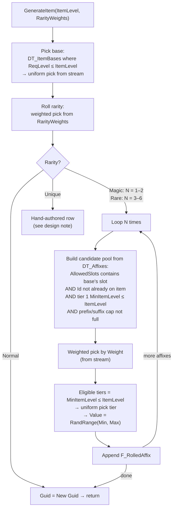

# Chapter 7 — Loot: the Item Generator

> **Goal of this chapter:** a Path-of-Exile-shaped item generator — item bases plus tiered, weighted affixes — that turns `OnEnemyKilled` into rarity-colored ground drops, and produces items as **plain data structs** that Chapter 8 can equip and Chapter 12 can save without a single extra line of code.

---

## 7.1 The thesis: an item is a base plus affixes

Strip the mystique off a PoE or Diablo item and what's left is startlingly small: a **base type** (Coral Ring, Iron Plate — fixed slot, fixed implicit) with **affixes** rolled onto it (a prefix like `+34 to Maximum Life`, a suffix like `+17% to Fire Resistance`). Rarity just controls *how many* affixes. Every value comes from a **tier table** gated by item level. That's it. There is no item AI, no clever spawner — the item generator is a **data problem**, and the guide's One Rule applies with full force: *content is data; Blueprints are executors.* You will write one function library and two Data Tables; every item your game will ever drop is a row-entry away.

And here is the design decision that pays off twice: the generated item — `F_ItemInstance` — contains **no object references**. Not a mesh pointer, not a class, not a widget. Only Names, enums, and numbers. That means it serializes into a `SaveGame` object for free ([Chapter 12](12-saving-packaging-cpp.md)), copies by value into inventories ([Chapter 8](08-inventory-and-equipment.md)), and never dangles when an asset moves. Anything visual is *looked up* from the Data Tables at display time.

Two enums first, in `/Game/ARPG/Items/`:

| Enum | Values |
|---|---|
| `E_EquipSlot` | Helmet, Body, Gloves, Boots, Belt, Amulet, Ring1, Ring2, Weapon, Offhand |
| `E_ItemRarity` | Normal, Magic, Rare, Unique |

> **Design note:** `E_EquipSlot` has `Ring1` and `Ring2` because the *character* has two ring slots (Ch. 8's `Equipped` map needs distinct keys). Item bases just say "Ring" — a ring base lists **both** ring slots in its `AllowedSlots`/`Slot` usage. Don't make two ring base rows; that way lies madness.

## 7.2 DT_ItemBases

Struct `F_ItemBase`, table `DT_ItemBases` in `/Game/ARPG/Data/`:

| Field | Type | Purpose |
|---|---|---|
| `Id` | Name | row name, referenced by `F_ItemInstance.BaseRow` |
| `Name` | Text | display name ("Coral Ring") |
| `Slot` | E_EquipSlot | where it equips (Ring bases: pick Ring1; Ch. 8 treats Ring1/Ring2 as interchangeable) |
| `Icon` | Texture2D (soft) | inventory/tooltip icon |
| `Mesh` | StaticMesh (soft) | the ground-drop mesh |
| `ReqLevel` | int | gates both *dropping* (ilvl) and *equipping* (Ch. 8) |
| `ImplicitMods` | F_StatMod[] | fixed, always-on mods (Ch. 3 struct — same one, everywhere) |
| `WeaponDamageMin` / `WeaponDamageMax` | float | weapons only |
| `WeaponDamageType` | E_DamageType | weapons only |
| `AttacksPerSecond` | float | weapons only |
| `ArmourValue` | float | armour pieces only |

Example rows — enough to test with, expand forever later:

| Id | Name | Slot | ReqLevel | Implicit / weapon / armour |
|---|---|---|---|---|
| `Base_RustedBlade` | Rusted Blade | Weapon | 1 | Phys 4–9, 1.30 APS |
| `Base_GnarledWand` | Gnarled Wand | Weapon | 1 | Phys 2–5, 1.20 APS; implicit: `CastSpeed, Increased, 10` |
| `Base_LeatherCap` | Leather Cap | Helmet | 1 | Armour 15 |
| `Base_IronPlate` | Iron Plate | Body | 8 | Armour 60 |
| `Base_CoralRing` | Coral Ring | Ring1 | 1 | implicit: `MaxLife, Flat, 15` |
| `Base_HeavyBelt` | Heavy Belt | Belt | 5 | implicit: `Armour, Flat, 25` |

## 7.3 DT_Affixes: tiered, weighted, slot-gated

Struct `F_AffixDef`, table `DT_Affixes`. This table *is* your loot game — everything else is plumbing.

| Field | Type | Purpose |
|---|---|---|
| `Id` | Name | row name; also used to forbid duplicates on one item |
| `Text` | Text | template: `+{v} to Maximum Life` — Ch. 8's tooltip formats `{v}` with the rolled value |
| `AffixSlot` | E_AffixSlot | `Prefix` or `Suffix` (two-value enum, make it now) |
| `AllowedSlots` | E_EquipSlot[] | which bases can roll it |
| `Weight` | int | relative pick chance (1000 = common, 100 = rare) |
| `Stat` | E_Stat | the Ch. 3 stat this modifies |
| `Op` | E_ModOp | Flat / Increased / More |
| `Tiers` | F_AffixTier[] | ordered **ascending** by MinItemLevel |

`F_AffixTier`: `MinItemLevel` (int), `MinValue` (float), `MaxValue` (float). A tier is *eligible* when `MinItemLevel <= ItemLevel`; roll uniformly among eligible tiers, then roll the value in that tier's range. (PoE biases toward high tiers; uniform is fine at our scale and one line instead of ten.)

Example rows (levels 1–30, matching the zone plan in [Chapter 10](10-zones-and-maps.md)):

| Id | Text | Affix | AllowedSlots | Weight | Stat / Op | Tiers (MinIlvl: Min–Max) |
|---|---|---|---|---|---|---|
| `Pre_FlatLife` | +{v} to Maximum Life | Prefix | all armour, Belt, Amulet, Ring1, Ring2 | 1000 | MaxLife / Flat | 1: 10–19 · 6: 20–34 · 12: 35–54 · 18: 55–79 |
| `Pre_IncFireDmg` | {v}% increased Fire Damage | Prefix | Weapon, Offhand, Amulet | 800 | DamageFire / Increased | 1: 10–19 · 8: 20–34 · 16: 35–49 |
| `Pre_FlatArmour` | +{v} to Armour | Prefix | Helmet, Body, Gloves, Boots | 1000 | Armour / Flat | 1: 15–30 · 8: 31–60 · 16: 61–120 |
| `Suf_FireRes` | +{v}% to Fire Resistance | Suffix | all armour, Belt, Ring1, Ring2, Amulet | 1000 | FireRes / Flat | 1: 6–11 · 6: 12–17 · 12: 18–23 · 18: 24–30 |
| `Suf_AttackSpeed` | {v}% increased Attack Speed | Suffix | Weapon, Gloves | 600 | AttackSpeed / Increased | 1: 5–7 · 10: 8–12 · 20: 13–16 |
| `Suf_CritChance` | +{v}% to Critical Strike Chance | Suffix | Weapon, Amulet, Ring1, Ring2 | 400 | CritChance / Flat | 1: 1–2 · 12: 3–4 · 22: 5–6 |
| `Pre_MoveSpeed` | {v}% increased Movement Speed | Prefix | Boots | 500 | MoveSpeed / Increased | 1: 5–9 · 10: 10–14 · 20: 15–20 |

> **Pitfall:** in UE, editing a struct that a Data Table already uses (reordering or renaming members) can silently corrupt rows. Finish the struct shape *before* mass data entry, add new fields only at the end, and keep the tables exported to CSV/JSON in source control so a corrupted table is a re-import, not a rewrite.

## 7.4 F_ItemInstance — the struct that goes in the save file

The generator's output, and the *only* representation of an item anywhere in the game:

| Field | Type | Purpose |
|---|---|---|
| `Guid` | Guid | identity — becomes Ch. 8's `Item_<Guid>` stat-mod Source key |
| `BaseRow` | Name | row name into `DT_ItemBases` |
| `Rarity` | E_ItemRarity | drives color, affix count, drop rules |
| `ItemLevel` | int | what it *could* roll — kept for tooltips and future crafting |
| `Affixes` | F_RolledAffix[] | what it *did* roll |

`F_RolledAffix`: `AffixRow` (Name, into `DT_Affixes`), `TierIndex` (int), `Value` (float).

Names, enums, ints, floats — nothing else. Resist every temptation to "just cache the icon here." The moment an object reference enters this struct, your save file grows an asset dependency, your inventory copies get reference semantics, and Chapter 12's "plain structs serialize for free" clause is void. Look everything up through `BaseRow`/`AffixRow` instead; Data Table row lookups by Name are cheap.

## 7.5 BFL_LootGen → GenerateItem

A Blueprint Function Library (`BFL_LootGen` in `/Game/ARPG/Items/`) — pure data-in, data-out, no world access. Signature: `GenerateItem(ItemLevel: int, RarityWeights: F_RarityWeights) → F_ItemInstance`. `F_RarityWeights` is four ints (Normal/Magic/Rare/Unique); zones (Ch. 10) and monster rarity (Ch. 6) hand you one.



The affix-count rules, straight from PoE, simplified: **Magic = 1–2 affixes, Rare = 3–6, and never more than half of the maximum in one AffixSlot** — Magic caps at 1 prefix + 1 suffix, Rare at 3 prefixes + 3 suffixes. When one side fills up, the candidate pool filter (step 4 below) keeps the generator honest automatically.

```text
[GenerateItem (ItemLevel, RarityWeights)]                        ◄ pure function
 → [Get Data Table Row Names (DT_ItemBases)] → filter ReqLevel <= ItemLevel
 → [Random Integer in Range from Stream (LootStream)]            ◄ 7.9 — ALWAYS the stream
 → [Set Item.BaseRow / Item.ItemLevel / Item.Guid = New Guid]
 → [WeightedPick(RarityWeights, LootStream)] → [Set Item.Rarity]
 → [Switch on E_ItemRarity]
     Normal → return
     Magic  → N = [Random Integer in Range from Stream (1, 2)]
     Rare   → N = [Random Integer in Range from Stream (3, 6)]
 → [For Loop 1..N]
     → [BuildCandidatePool]        ◄ slot match, no duplicate Id, ilvl-reachable,
                                     prefix/suffix side not at cap
     → [Branch: pool empty] → true: break                        ◄ small tables run dry — fine
     → [WeightedPick(pool by Weight, LootStream)]
     → eligible tiers where MinItemLevel <= ItemLevel
       → [Random Integer in Range from Stream (0, LastEligibleIndex)] = TierIndex
       → Value = [Random Float in Range from Stream (Tier.MinValue, Tier.MaxValue)]
     → [Add F_RolledAffix (AffixRow, TierIndex, Value) to Item.Affixes]
 → return Item
```

`WeightedPick` is the ten-line helper you'll reuse for rarity, affixes, and Ch. 10's room tiles: sum the weights, roll `Random Integer in Range from Stream (0, Sum-1)`, walk the list subtracting until you go negative.

> **Design note:** Unique items in PoE are hand-authored, not generated — a fixed base with fixed (narrow-roll) mods. Keep `Unique` in the enum now, ship zero of them, and when you want your first one, add a `DT_Uniques` table of pre-built `F_ItemInstance`-shaped rows and have `GenerateItem` pick from it. Do not try to make the generator produce them; uniques are *content*, not *math*.

## 7.6 GetItemMods — the handoff to the stat pipeline

`BFL_LootGen → GetItemMods(Item: F_ItemInstance) → F_StatMod[]` resolves an instance back into Chapter 3's lingua franca:

```text
[GetItemMods (Item)]
 → [Get Data Table Row (DT_ItemBases, Item.BaseRow)]
 → [Append Base.ImplicitMods to Out]
 → [Branch: Base.ArmourValue > 0]
     true → [Add F_StatMod (Armour, Flat, Base.ArmourValue) to Out]   ◄ armour is just
                                                                        a stat — One Rule
 → [For Each Item.Affixes]
     → [Get Data Table Row (DT_Affixes, AffixRow)]
     → [Add F_StatMod (Row.Stat, Row.Op, RolledAffix.Value) to Out]
 → return Out
```

Weapon damage and attacks-per-second deliberately do **not** become stat mods — they belong to the *weapon*, and `AC_SkillCaster` reads them off the equipped item for Attack-tagged skills in [Chapter 8](08-inventory-and-equipment.md). Chapter 8 calls `GetItemMods` on equip and feeds the array to `AC_Stats.AddMods(Item_<Guid>, Mods)` — the whole reason Chapter 3 keyed mods by Source.

## 7.7 The drop pipeline: from corpse to clickable label

Chapter 6 left `BP_ARPGGameMode` firing `OnEnemyKilled(EnemyDef, Rarity, Level, Location)`. Loot subscribes there — enemies know nothing about items:

```text
[BP_ARPGGameMode — Event BeginPlay]
 → [Bind Event to OnEnemyKilled → RollDrops]

[RollDrops (EnemyDef, Rarity, Level, Location)]
 → [Get Data Table Row (DT_DropTable, Rarity)]          ◄ monster rarity, not item rarity
 → [Branch: Random Float from Stream <= Row.ItemChance]
     true → Count = [Random Integer in Range from Stream (Row.MinItems, Row.MaxItems)]
       → [For Loop 1..Count]
           → [GenerateItem (ItemLevel = Level, ZoneInfo.RarityWeights)]
           → [SpawnGroundItem (Item, Location)]
 → gold + potion-charge rolls (7.8)
```

`DT_DropTable` (row per `E_MonsterRarity`):

| Row | ItemChance | MinItems–MaxItems | GoldChance | GoldMin–GoldMax |
|---|---|---|---|---|
| Normal | 0.20 | 1–1 | 0.35 | 5–15 |
| Magic | 1.00 | 1–2 | 1.00 | 15–40 |
| Rare | 1.00 | 2–3 | 1.00 | 40–100 |
| Unique | 1.00 | 3–4 | 1.00 | 100–250 |

`BP_GroundItem` (in `/Game/ARPG/Items/`): a StaticMesh component (physics ON), a WidgetComponent (`WBP_ItemLabel`, Screen space), and one variable — the `F_ItemInstance`. `SpawnGroundItem` sets the instance, loads the base row's `Mesh`, then tosses it: `Add Impulse` with a small random-from-stream horizontal direction and an upward kick, so a rare pack's death showers loot instead of stacking it in one Z-fighting pile ([Chapter 11](11-arcade-layer.md) adds the beam and the sound).

`WBP_ItemLabel`: a bordered text block showing the base name, tinted by rarity — **Normal white, Magic `#4E9EFF`, Rare `#FFDF33`, Unique `#C05A2A`**. Use these four colors *everywhere* an item appears (labels here, tooltips and slots in Ch. 8); players read color faster than text. Proper "Healthy Coral Ring of the Salamander" name generation is fluff — skip it, or derive fragments from affix row names later.

```text
[BP_GroundItem — label click (WBP_ItemLabel → OnMouseButtonDown, routed to owner)]
 → [Get Player Character → AC_Inventory → AddItem (ItemInstance)]
     ◄ AC_Inventory is a Ch. 1 shell; Chapter 8 implements AddItem.
       Until then: stub it — Print String the base row + rarity, return true.
 → [Branch: added] → true: [Destroy Actor]        ◄ full inventory leaves it lying there
[OnBeginCursorOver] → [Set Render Custom Depth = true]   ◄ hover highlight (outline PP
[OnEndCursorOver]   → [Set Render Custom Depth = false]     material — or just tint the label)
```

> **Pitfall:** the label widget must block the click, not the mesh — at top-down camera distance the mesh is a dozen pixels and players click *labels*. Set the WidgetComponent to receive hardware input, and keep `Draw at Desired Size` on or every label ships as a blurry 500×500 quad.

## 7.8 Gold and potions, briefly

Gold is a number, not an item — `Gold (int)` lives on `AC_Inventory` (Ch. 8 shell; stub = Print String). `RollDrops` spawns `BP_GoldPickup` (coin mesh, same toss, overlap-to-collect — Ch. 11 adds the vacuum radius). Potions are D3-flask-ish **charges**, not inventory items: `IA_Potion` spends a charge to heal 35% of MaxLife over 2 s; kills near you refill charges (Ch. 11 wires the on-kill hook). `BP_PotionPickup` drops rarely (5% on any kill) and grants a charge on overlap. None of this touches the item generator — that's the point: gold and potions are *pickups*, items are *data*.

## 7.9 Determinism: one RandomStream to rule every roll

Every roll in this chapter — base, rarity, affix, tier, value, drop count, toss direction — goes through **one `RandomStream`**, `LootStream`, living on `BP_ARPGGameInstance` and seeded per zone from the run seed (`Seed = RunSeed + ZoneIndex`, set on zone load). Never call the plain `Random Float`/`Random Integer` nodes in loot code.

Why bother in single-player? Because a seeded stream makes loot **reproducible**: the same seed produces the same drops, which turns "a rare dropped with a broken affix" from an unreproducible ghost into a bug you can replay; it lets Chapter 10 regenerate a zone's layout *and* its loot identically from one saved seed; and Chapter 12 saves a single int instead of world state. Determinism is a property you can only buy early — retrofitting it means auditing every random node you ever placed.

> **Multiplayer note:** in co-op, loot rolls are one of the five things that must become server-authoritative — the server rolls, clients receive results. The sibling guide's replication model ([co-op soulslike, Ch. 2–3](../coop-soulslike-ue5/)) shows the shape; [Chapter 13](13-coop-multiplayer.md) does the move — including per-player instanced drops built on exactly these streams.

## 7.10 Test before moving on

Kill things in `L_Dev_Gym` (Ch. 6's spawners) and verify:

| Test | Expected |
|---|---|
| Kill 20 normal mobs | roughly 4 items drop, most Normal (white labels), gold about a third of the time |
| Kill a magic (blue) monster | at least 1 item, guaranteed; label colors match rarity (`#4E9EFF` / `#FFDF33`) |
| Kill a rare (yellow) monster | 2–3 items tossed apart with physics, labels readable, hover highlights the mesh |
| Print a generated Rare's `Affixes` | 3–6 entries, no duplicate `AffixRow`, ≤ 3 prefixes and ≤ 3 suffixes |
| Generate at ItemLevel 1 vs 20 (debug key calling `GenerateItem` + Print) | ilvl 1 rolls only tier-1 ranges; ilvl 20 sometimes rolls top tiers (e.g. Life 55–79) |
| `GetItemMods` on a printed item | implicit + armour + one `F_StatMod` per affix, values matching the rolled ones |
| Set a fixed seed on `LootStream`, kill the same pack twice (PIE restart) | identical drops both runs — determinism holds |
| Click a label | stubbed `AddItem` prints the item, ground actor disappears |

**Next:** [Chapter 8 — Inventory, Equipment & Tooltips](08-inventory-and-equipment.md), where `F_ItemInstance` meets the paper doll and Chapter 3's Source keys pay for themselves.
