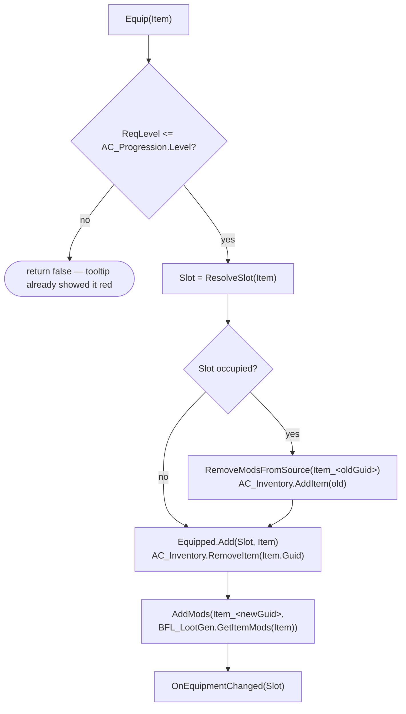

# Chapter 8 — Inventory, Equipment & Tooltips

> **Goal of this chapter:** items leave the ground and start doing something — a 40-slot inventory, a paper-doll equipment panel, drag-and-drop between them, and tooltips that read like PoE's (rarity-colored name, affix lines, hold-Alt compare). Equipping an item changes your stats through exactly one seam: the Source-keyed modifier API from [Chapter 3](03-stats-and-modifiers.md).

---

## 8.1 This is the payoff chapter

Back in Chapter 3 you made one quiet decision: every modifier enters `AC_Stats` under a **Source key** (`Item_<Guid>`, `Passive_<NodeId>`, `Status_<Effect>`), and `RemoveModsFromSource` deletes everything under a key in one call. This chapter is where that decision pays for itself. The entire stat side of "equip an item" — the thing that's a tangle of bookkeeping in most hobby ARPGs — is two lines:

```text
[AC_Stats → RemoveModsFromSource ("Item_" + OldItem.Guid)]   ◄ old ring's mods, gone — all of them
[AC_Stats → AddMods ("Item_" + NewItem.Guid, Mods)]          ◄ new ring's mods, in
```

No "subtract the old bonuses" math, no per-stat undo lists, no drift when you forget one field. If a stat is wrong after an equip, the bug is in the item's mods, never in the equip code. Everything else in this chapter is UI.

The mods themselves come from [Chapter 7](07-loot-generator.md)'s `BFL_LootGen → GetItemMods(F_ItemInstance) → F_StatMod[]`, which resolves the base's implicits plus every rolled affix. Item *generation* lives entirely in that chapter — here we only carry, wear, and read items.

## 8.2 AC_Inventory: a slot list, not a Tetris grid

`AC_Inventory` sits on `BP_Hero` (the shell exists since Chapter 1). It stores plain `F_ItemInstance` structs — no actors, no object refs, which is why saving it in Chapter 12 will be free.

| Variable | Type | Default | Purpose |
|---|---|---|---|
| `Items` | `F_ItemInstance[]` | empty | the bag; array index = slot index |
| `Capacity` | int | 40 | hard cap |
| `Gold` | int | 0 | Chapter 7's gold drops deposit here |
| `PotionCharges` | int | 3 | Chapter 7's `BP_PotionPickup` refills here |
| `OnInventoryChanged` | Dispatcher | — | UI repaints off this — never polls |
| `OnGoldChanged` | Dispatcher | — | payload: NewGold |

| Function | Signature | Notes |
|---|---|---|
| `AddItem` | `(Item) → bool` | `Items.Length >= Capacity` → return false; `BP_GroundItem` keeps the item on the ground and flashes its label — full bag rejects at the *pickup*, nothing is destroyed |
| `RemoveItem` | `(Guid) → F_ItemInstance` | find by Guid, remove, return it |
| `DropItem` | `(Guid)` | RemoveItem → spawn `BP_GroundItem` at hero + small toss impulse (reuse Chapter 7's spawn path) |

Every mutation ends with `[Call OnInventoryChanged]`. That's the whole component.

> **Design note — why not the PoE Tetris grid?** In PoE, a 2×3 armour vs a 1×1 ring is itself a game: inventory management as a pacing valve that forces town trips. It's a deliberate friction mechanic — and friction is exactly what this guide's arcade feel doesn't want. A flat slot list means pickup is always one click, "is my bag full" is one number, and the UI is a plain Uniform Grid instead of a spatial packing solver with drag previews and collision checks. D3 sided the same way (uniform-ish slots) for the same reason. If you want the grid anyway, it's a well-trodden tutorial genre — see the UMG section of [resources](resources.md) — and because we store plain structs, retrofitting one later only touches the widgets.

## 8.3 AC_Equipment: the swap

`AC_Equipment`, also on `BP_Hero`:

| Variable | Type | Default | Purpose |
|---|---|---|---|
| `Equipped` | `Map<E_EquipSlot, F_ItemInstance>` | empty | absent key = empty slot |
| `OnEquipmentChanged` | Dispatcher | — | payload: Slot — paper doll, tooltip compare, and `AC_SkillCaster` all listen |



```text
Blueprint: AC_Equipment — function Equip (Item: F_ItemInstance) → bool
──────────────────────────────────────────────────────────────────────
[Row = Get Data Table Row (DT_ItemBases, Item.BaseRow)]
[Branch: Row.ReqLevel > AC_Progression.Level] → true: return false
[Slot = ResolveSlot(Row.Slot)]        ◄ "Ring" base → Ring1 if empty, else Ring2
                                        if empty, else swap Ring1 — PoE's rule
[Old = Equipped.Find(Slot)]
[Branch: Old found]
   true → [AC_Stats → RemoveModsFromSource ("Item_" + Old.Guid)]
        → [AC_Inventory → AddItem (Old)]      ◄ swap: one out, one in — never overflows
[AC_Inventory → RemoveItem (Item.Guid)]
[Equipped.Add (Slot, Item)]
[AC_Stats → AddMods ("Item_" + Item.Guid, BFL_LootGen → GetItemMods (Item))]
[Call OnEquipmentChanged (Slot)]

Blueprint: AC_Equipment — function Unequip (Slot) → bool
────────────────────────────────────────────────────────
[Branch: AC_Inventory full] → true: return false          ◄ nowhere to put it — refuse
[Item = Equipped.Find(Slot)] → [Equipped.Remove(Slot)]
[AC_Stats → RemoveModsFromSource ("Item_" + Item.Guid)]
[AC_Inventory → AddItem (Item)] → [Call OnEquipmentChanged (Slot)]
```

Open `WBP_StatSheet` (C, from Chapter 3), equip a rare, and watch six stats jump at once. That's the pipeline doing in one call what a hand-rolled system does in six bug-prone ones.

> **Multiplayer note:** in single-player, "the client edits its own inventory" is fine. Online, inventory ops and equip validation are two of the five things that must become server-authoritative — the [co-op soulslike guide](../coop-soulslike-ue5/) shows the RPC pattern, and [Chapter 12](12-saving-packaging-cpp.md) lists the rest.

## 8.4 The weapon drives Attack skills

One special rule, and it's what makes finding a weapon exciting: **Attack-tagged skills deal the equipped weapon's damage; Spell-tagged skills ignore the weapon entirely.** BasicSlash gets better because your sword did; Fireball gets better because your *stats* did (`DamageFire` mods — which a wand's affixes can grant, so casters still care about weapons, just not the weapon's own 9–14 line).

Patch `AC_SkillCaster → BuildDamagePacket` from [Chapter 5](05-skills-as-data.md):

```text
[Branch: SkillDef.Tags contains Attack]
   true  → [W = AC_Equipment.Equipped.Find(Weapon)]
           [Row = Get Data Table Row (DT_ItemBases, W.BaseRow)]
           → base roll = [Random Float in Range (Row.WeaponDamageMin, Row.WeaponDamageMax)]
             into DamageByType under Row's E_DamageType
           → UseTime = 1 / Row.AttacksPerSecond      ◄ replaces the row's BaseUseTime;
                                                        AttackSpeed stat still multiplies on top
           ◄ no weapon equipped? Unarmed fallback: 2–4 Physical, 1.0 attacks/s
   false → base roll from the skill row's DamageMin/Max map   ◄ Chapter 5, unchanged
```

Everything downstream — the flat/increased/more application, crit roll, `ReceiveDamage` — is untouched. The weapon only changes where the *base* number comes from. Bind `OnEquipmentChanged` in `AC_SkillCaster` so a cached weapon row (if you cache) refreshes on swap.

## 8.5 The UI: bag, paper doll, drag-and-drop

Three widgets in `/Game/ARPG/UI/`, opened together by `IA_Inventory` (I/Tab) — add to viewport, `Set Input Mode Game and UI`, show cursor; same input toggles them off.

- **`WBP_Inventory`** — a Uniform Grid of 40 `WBP_ItemSlot` (8×5). On construct and on `OnInventoryChanged`: clear, re-fill from `Items`. Forty tiny widgets rebuilt on change is nothing; don't pool this.
- **`WBP_ItemSlot`** — Image (icon from the base row), rarity-colored border (Normal white, Magic `#4E9EFF`, Rare `#FFDF33`, Unique `#C05A2A` — same table as Chapter 7's ground labels), stores the item's `Guid`.
- **`WBP_EquipmentPanel`** — the paper doll: ten `WBP_ItemSlot` hand-placed on a hero silhouette (Helmet, Body, Gloves, Boots, Belt, Amulet, Ring1, Ring2, Weapon, Offhand), each tagged with its `E_EquipSlot`. Repaints on `OnEquipmentChanged`.

Drag-and-drop is stock UMG — three overrides and a payload class. Make `BP_ItemDragOp` (parent: `DragDropOperation`) with `ItemGuid: Guid`, `Origin: E_DragOrigin` (a two-value enum: Inventory, Equipment), `OriginSlot: E_EquipSlot`.

```text
WBP_ItemSlot — override OnMouseButtonDown
 → [Branch: Right Mouse Button]
     true  → [AC_Equipment → Equip / Unequip]      ◄ right-click = the fast path
     false → [Detect Drag if Pressed (Left Mouse Button)] → return handled

WBP_ItemSlot — override OnDragDetected
 → [Create Drag Drop Operation (BP_ItemDragOp)]
     ItemGuid / Origin / OriginSlot from this slot
     Default Drag Visual = a duplicate WBP_ItemSlot   ◄ the icon follows the cursor
 → return the operation

Drop targets — override OnDrop, cast Operation to BP_ItemDragOp:
 WBP_EquipmentPanel slot → [Branch: item's base Slot matches this slot] → [Equip]
 WBP_Inventory grid      → [Branch: Origin == Equipment] → [Unequip]
 WBP_HUD root (behind both panels) → [AC_Inventory → DropItem (Guid)]   ◄ drag out
                                      of the window = toss it on the ground
```

That last line is why the payload is a **Guid, not an array index**: `OnInventoryChanged` can reorder the array mid-drag; the Guid still finds the right item.

> **Pitfall:** `OnDrop` never fires? The widget under the cursor must return **Handled** from `OnMouseButtonDown` (which `Detect Drag if Pressed` does) and the drop *target*'s Visibility must be **Visible**, not the default Self Hit Test Invisible. Nine out of ten dead drag-and-drops are that visibility flag.

## 8.6 WBP_ItemTooltip

Hover any `WBP_ItemSlot` (or a `WBP_ItemLabel` on the ground) and `WBP_ItemTooltip` appears — set it as the slot's Tooltip Widget so UMG handles show/hide/positioning. It's a vertical box built by one function:

```text
[BuildTooltip (Item: F_ItemInstance)]
 → [Name line]      rarity-colored; Rare/Unique names come rolled from Chapter 7
 → [Base line]      weapon: "9–14 Physical · 1.2 attacks/s"   armour: "Armour: 23"
                    (WeaponDamageMin/Max / AttacksPerSecond / ArmourValue off the base row)
 → [Implicit line]  from the base's ImplicitMods, thin separator under it
 → [For Each Item.Affixes (F_RolledAffix)]
     → [Format Text (AffixRow.Text)]  {v} = [Round (Value)]
       ◄ "+{v} to Maximum Life" + rolled 37.2 → "+37 to Maximum Life" —
         the affix TABLE owns the sentence, the tooltip only fills the number.
         New affixes never touch UI code: content is data.
 → [Req line]       "Requires Level 12" — red if > AC_Progression.Level
```

**Hold-Alt compare.** While the tooltip is up, holding Alt shows a second tooltip beside it for whatever is currently in that item's slot — the equipped rival — so "is this an upgrade" never needs a trip to the stat sheet. Widgets only get keyboard events when focused, and we're not focusing tooltips; poll instead — but on a timer, not Tick (widget Tick is a Chapter 11 sin):

```text
WBP_ItemTooltip — Event Construct
 → [Set Timer by Event (0.1 s, looping)]
     → [Alt = Is Input Key Down (Left Alt)]        ◄ on the Player Controller
     → [CompareBox → Set Visibility (Alt ? Visible : Collapsed)]
        CompareBox = second tooltip, BuildTooltip(AC_Equipment.Equipped[item's slot]),
        header "CURRENTLY EQUIPPED"; skip if that slot is empty or this IS the equipped item
 → Event Destruct → [Clear Timer]                  ◄ tooltips come and go constantly — don't leak timers
```

For Ring bases, compare against `ResolveSlot`'s answer (the ring it would actually replace).

## 8.7 Gold & potion HUD bits

Two small HUD additions, both event-driven off `AC_Inventory`: a gold counter (icon + text, repaints on `OnGoldChanged` — Chapter 11 makes it tick up satisfyingly), and a potion widget by the skill bar showing `PotionCharges` as pips. `IA_Potion` (1): charge available → spend one, heal 40% MaxLife over 2 s (a timed `Flat` life restore tick — or simply +40% instantly; arcade says instantly is fine). Chapter 7's `BP_PotionPickup` refills charges on pickup; kills refilling charges is Chapter 11's business.

## 8.8 Test before moving on

Kill things in `L_Dev_Gym` until the bag has variety, then:

| Test | Expected |
|---|---|
| Pick up a Magic item, hover it | tooltip: blue name, base line, implicit, 1–2 affix lines with rolled numbers ("+37 to Maximum Life") |
| Equip a +Life ring (right-click) | MaxLife jumps in `WBP_StatSheet`; life bar keeps its *percentage* (Ch. 3 rule) |
| Swap that ring for another | old ring back in bag; stats show ONLY the new ring's mods — no residue, no double-dip |
| Equip a second ring | fills Ring2; a third swaps Ring1 |
| Unequip everything | stats return exactly to base + passives |
| Equip a better weapon, use BasicSlash | Attack damage jumps (weapon min–max drives it) |
| Same weapon, cast Fireball | spell damage unchanged (Spell tag ignores weapon damage) |
| Item with ReqLevel above hero | req line red, `Equip` refuses |
| Drag from bag onto matching paper-doll slot | equips; wrong slot rejects |
| Drag an item outside both panels | `BP_GroundItem` tossed at your feet, label and all |
| Bag at 40, click a ground item | pickup rejected, item stays on the ground |
| Hover bag item while a rival is equipped, hold Alt | side-by-side compare with "CURRENTLY EQUIPPED" |

---

**Next:** [Chapter 9 — XP, Levels & the Passive Tree](09-progression-and-passives.md)
