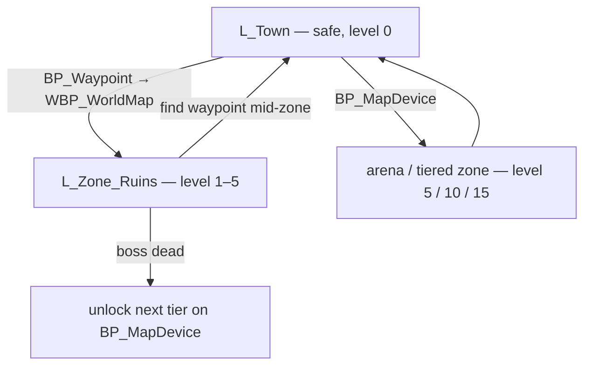

# Chapter 10 — Zones, Waypoints & Procedural Maps

> **Goal of this chapter:** a town hub with waypoints, combat zones that know their own monster level and rarity rules, and dungeons stitched at runtime from hand-built room tiles using a seeded random walk — plus the arcade endgame that gives all of it a reason to exist. This is where the systems from Chapters 6 and 7 stop living in the gym and get a world.

---

## 10.1 The zone flow: town, waypoints, world map

The genre's loop is a commute: safe town → waypoint → combat zone → kill everything → waypoint home → sell/equip → back out. Keep the world model that simple — you're not building an open world, you're building a **hub and spokes**.



- `L_Town` is a hand-built level: no enemies, a `BP_Waypoint`, and (if you want them) vendors and a stash — both are content, not systems, so this guide only mentions them. Town's zone level is **0**: nothing rolls, nothing drops.
- `BP_Waypoint` is an actor with a mesh, a glowing `NS_` ring, and an interact overlap. Interacting opens `WBP_WorldMap` — which is a **list**, not cartography. A vertical box of unlocked zone entries (name, level range, a Travel button) is one evening of UMG; a hand-illustrated world map is a month of art. The list plays identically.
- Travel is `Open Level (by Name)`. Everything that must survive the transition lives in `BP_ARPGGameInstance`: the hero's build gets snapshotted there and re-applied on the far side, plus `RunSeed` and `UnlockedWaypoints` (Name array — a zone's waypoint adds itself when you touch it). Persisting all of that to disk is [Chapter 12](12-saving-packaging-cpp.md)'s job; the GameInstance is just the courier.

> **Design note:** waypoints you must *touch* to unlock are the genre's exploration reward. Don't unlock the whole list up front — walking into a dungeon to find the waypoint halfway through is the entire pull of the first visit.

## 10.2 BP_ZoneInfo: one actor that sets the zone's rules

Every combat level contains exactly one `BP_ZoneInfo` — an invisible actor that is the level's contract with every other system. Nothing in a zone hardcodes its difficulty; they all ask this actor.

| Variable | Type | Default | Purpose |
|---|---|---|---|
| `Level` | int | 1 | monster level for the whole zone |
| `Biome` | E_Biome (Ruins, Crypt, ...) | Ruins | picks the room-tile set (10.3) |
| `PackCount` | int | 12 | how many `BP_PackSpawner` the generator places |
| `RoomCount` | int | 12 | rooms the stitcher walks (10.4) |
| `RarityWeights` | F_RarityWeights | 80/15/4/1 | Normal/Magic/Rare/Unique weights |

Who reads it:

- **Spawners** ([Chapter 6](06-enemies-and-hordes.md)): `BP_PackSpawner` pulls `Level` — which drives the `CT_MonsterScaling` life/damage multipliers — and rolls each pack's `E_MonsterRarity` against `RarityWeights`.
- **Loot** ([Chapter 7](07-loot-generator.md)): the GameMode's `RollDrops` uses monster level as the **ilvl** for `BFL_LootGen → GenerateItem`, and passes the zone's `RarityWeights` in as the item-rarity bias. One struct steering both monster and item rarity is deliberate: a "juiced" zone should feel juiced on both axes, and one knob can't drift out of tune with itself.

```text
Blueprint: BP_PackSpawner — BeginPlay (added to Ch. 6 logic)
────────────────────────────────────────────────────────────
[Get Actor Of Class (BP_ZoneInfo)]        ◄ one per level; cache it
 → [MonsterLevel = ZoneInfo.Level]
 → [Rarity = weighted roll vs ZoneInfo.RarityWeights]   ◄ use the zone RandomStream (10.4)
```

> **Pitfall:** if `Get Actor Of Class` returns null, you forgot to place `BP_ZoneInfo` — and everything silently spawns at level 1 with default weights. Add a `Print String` scream on null now; future-you will hit this the first time you duplicate a level.

## 10.3 Room tiles as Level Instances

The pragmatic route to "every dungeon is different" is not procedural *geometry* — it's procedural *arrangement* of hand-built rooms. Hand-build **8–12 room tiles** per biome as **Level Instances**:

- Each tile is a level (`L_Tile_Ruins_01` ...) exactly **3000×3000 uu**, contents authored to stay inside the footprint.
- Doorway openings sit at the midpoint of the north/east/south/west edges — same size, same position, every tile. That's the entire compatibility contract: any tile's east door lines up with any tile's west door.
- Vary the tiles' door *sets*: a corridor (N+S), an L-bend (N+E), a T (N+E+W), a four-way, and at least one single-door room (your dead-end/boss candidate). Author light bakes off; these load at runtime, so lighting must be movable.

Register them in a Data Table — content is data, even level chunks:

| DT_RoomTiles row (F_RoomTile) | Type | Purpose |
|---|---|---|
| `TileLevel` | Soft Object Ref (World) | the Level Instance asset |
| `Doors` | E_Door array (N/E/S/W) | which edges open |
| `Biome` | E_Biome | filter per zone |
| `Weight` | float | corridors common, four-ways rare |
| `bBossTile` | bool | single-door arena variants |

## 10.4 The stitcher: seeded drunkard's walk

`BP_ZoneGenerator` (place one next to `BP_ZoneInfo`) builds the dungeon at BeginPlay on a grid of `IntPoint` cells, 3000 uu apart. The algorithm is a **drunkard's walk**: stagger from the entrance one random step at a time, placing a matching-door tile in every new cell you stumble into.

All randomness comes from a `RandomStream` the GameInstance seeds per zone (`RunSeed` hashed with the zone name — the [Chapter 7](07-loot-generator.md) determinism decision paying off): same seed, same dungeon, which makes bugs reproducible and saves regenerable ([Chapter 12](12-saving-packaging-cpp.md)).

```text
Blueprint: BP_ZoneGenerator — BeginPlay
───────────────────────────────────────
[Event BeginPlay]
 → [Stream = BP_ARPGGameInstance → GetZoneStream(ZoneName)]  ◄ RandomStream: RunSeed + zone hash
 → [Grid (Map: IntPoint → placed row Name)] ; [Cursor = (0,0)]
 → [Place entrance tile at (0,0)]                ◄ has the hero PlayerStart + zone waypoint
 → [For Loop: 1 to ZoneInfo.RoomCount]
     → [Dir = Random Integer In Range From Stream (0..3)]   ◄ the drunkard's step: N/E/S/W
     → [Next = Cursor + DirOffset(Dir)]
     → [Branch: Grid Contains Next?]
         true  → [Cursor = Next]                 ◄ wander through existing rooms; no re-place
         false → [Tile = weighted pick from DT_RoomTiles      ◄ filter: Biome matches AND
                   using Stream]                                Doors contains Opposite(Dir)
               → [Grid.Add(Next, Tile)] ; [Cursor = Next]
 → [BossCell = Grid key with max Manhattan distance from (0,0)]
 → [Replace BossCell's row with a bBossTile row]  ◄ boss goes in the furthest room
 → [For Each: Grid]
     → [Load Level Instance (by Object Reference)]  ◄ Level Streaming Dynamic node;
         Level = Tile.TileLevel                       Location = Cell × 3000
 → [For Each placed tile, each door with no neighbor across it]
     → [Spawn wall-cap mesh over the opening]     ◄ cap dead ends; no doors to nowhere
 → [Spawn BP_PackSpawner × ZoneInfo.PackCount]    ◄ random placed cells via Stream;
                                                    skip entrance and boss cells
```

Why this shape works:

- **Walking through occupied cells** (the `true` branch) is what makes layouts loop and branch instead of forming one snake — the walk revisits, then exits a room through a *different* door, and that fork is a branch.
- **Boss furthest from entrance** is one `Manhattan distance` max — no pathfinding, and it guarantees the run has a direction.
- Doors are guaranteed two-way by construction: you only enter a new cell through a door the picked tile is required to have. Any door that ends up facing an empty cell gets capped; a wall cap is cheaper than backtracking the walk.

> **Pitfall:** `Load Level Instance` is *asynchronous* — the tile's actors don't exist on the next node. Bind the node's `On Loaded` (or count loads and fire a `OnZoneReady` dispatcher) before spawning anything that must stand on tile geometry. Spawning pack spawners into rooms that haven't streamed in yet drops mobs into the void — the classic first bug of runtime streaming.

## 10.5 Navmesh that follows you: Navigation Invokers

Here's the gotcha that stops most people's first procedural dungeon: **a static navmesh cannot cover runtime-stitched rooms.** Static navmesh is baked in the editor against the level as it exists *then* — your tiles don't exist then, so your enemies stand in freshly streamed rooms with no navmesh under them, refusing to move while the Behavior Tree reports Move To failures.

The fix is **Navigation Invokers** — generate navmesh at runtime, only in bubbles around the actors that need it:

1. Project Settings → Navigation Mesh → Runtime Generation = **Dynamic**, and tick **Generate Navigation Only Around Navigation Invokers**.
2. Add a **Navigation Invoker** component to `BP_EnemyBase` (generation radius ~3000, removal ~5000).
3. Keep a big Nav Mesh Bounds Volume over the whole possible grid area in the zone level — invokers generate *within* bounds volumes, they don't replace them. Make it generous; empty bounds cost nothing with invoker-only generation.

Since Chapter 6's mobs spawn dormant, tiles full of sleeping enemies generate no navmesh until the player gets close and packs wake — which is exactly when they need it. Dynamic generation lags a beat behind streaming, but dormancy hides it completely.

> **Pitfall:** if you use the click-to-move control scheme from [Chapter 2](02-movement-and-input.md), the *hero* needs navmesh too — `Simple Move To Location` path-follows. Add a Navigation Invoker to `BP_Hero` as well. WASD (the guide's default) doesn't care.

## 10.6 The deep end: the PCG framework

What you just built is deliberately the shallow end. UE 5.4+ ships the **PCG framework** — a full graph-based procedural pipeline that can scatter props, grow geometry, and drive far more organic layouts than a square grid — and the plugin ecosystem has mature dungeon generators. Both are real upgrades and real rabbit holes; a PCG graph can eat a month the way Chapter 11's juice eats a week. Links in [resources](resources.md). The room-tile stitcher's virtue is that it shipped this chapter — and hand-authored tiles keep combat readable at horde scale, which a fully generative layout has to fight for.

## 10.7 The arcade endgame: tiers and the wave arena

An ARPG without an endgame is a demo. PoE spins up maps from consumable items; that's a beautiful system you should not build — reusing `F_ItemInstance` for map items drags the whole affix machine into level generation. Keep it arcade: **difficulty tiers unlocked by boss kills.**

`BP_MapDevice` stands in town. Interacting opens a tier list (a `WBP_WorldMap` variant):

| Tier | Unlocked by | Zone level | RarityWeights | PackCount |
|---|---|---|---|---|
| 1 | first Ruins boss kill | 5 | 70/20/8/2 | 14 |
| 2 | Tier 1 boss kill | 10 | 60/25/12/3 | 16 |
| 3 | Tier 2 boss kill | 15 | 50/30/15/5 | 20 |

Selecting a tier opens the zone level and stamps the tier's row onto `BP_ZoneInfo` before generation runs — same generator, same tiles, bigger numbers. Because *every* system reads `BP_ZoneInfo` (10.2), the entire difficulty knob is four values in a table row. That's the One Rule cashing out: escalation is content entry, not code.

**The wave arena — the simplest endgame that works.** If tiered dungeons are still too much, ship this first: one hand-built arena level, one `BP_ArenaDirector` actor.

```text
Blueprint: BP_ArenaDirector — wave loop
───────────────────────────────────────
[StartRun (from BP_MapDevice, carries Tier)]
 → [Wave = 1]
 → [SpawnWave]: [spawn 2 + Wave packs via BP_PackSpawner]
       ◄ each wave: ZoneInfo.Level += 1, shift RarityWeights toward Rare
 → [Bind: GameMode.OnEnemyKilled → decrement alive count]
 → [Alive == 0?] → [Wave += 1] → [Branch: Wave > 10]
       false → [3 s breather] → [SpawnWave]
       true  → [Loot fountain: RollDrops × 15 at arena center, ilvl = final wave level]
             → [unlock next tier] → [waypoint home lights up]
```

Ten waves, escalating rarity, and a loot fountain at the end — it exercises every system in the guide in one room, and the fountain is [Chapter 11](11-arcade-layer.md)'s physics-toss feel at firehose volume. Many shipped arcade ARPGs are, honestly, this loop with art.

> **Multiplayer note:** `Open Level` transitions and a GameInstance courier are single-player luxuries — in co-op, travel becomes server-driven seamless travel, and seeds must replicate before generation. The [co-op soulslike guide](../coop-soulslike-ue5/) Chapter 2–3 replication model is where that thinking starts, and [Chapter 13](13-coop-multiplayer.md) cashes in this chapter's determinism: the whole dungeon replicates as one seed.

## 10.8 Test before moving on

| Test | Expected |
|---|---|
| Touch the Ruins waypoint, return to town, reopen `WBP_WorldMap` | Ruins is listed and travels both ways |
| Open the same zone twice with the same `RunSeed` | identical room layout both times |
| Change `RunSeed`, reopen | different layout; no doors opening onto void (all capped) |
| Set `BP_ZoneInfo.Level` 1 → 5 in Ruins | mob life/damage rise per `CT_MonsterScaling`; dropped items roll ilvl 5 affix tiers |
| Set `RarityWeights` to 0/0/100/0 | every pack rolls Rare (yellow names); item drops skew Rare |
| Walk the stitched dungeon end to end | packs wake and *pathfind* in every room (invoker navmesh works); boss room is the far end |
| `stat unit` during generation | one hitch at load at worst; steady 60 fps after streaming settles |
| Run the wave arena at Tier 1 | 10 waves, rising rarity, loot fountain, next tier unlocks on `BP_MapDevice` |

**Next:** [Chapter 11 — The Arcade Layer: Game Feel & Performance](11-arcade-layer.md)
