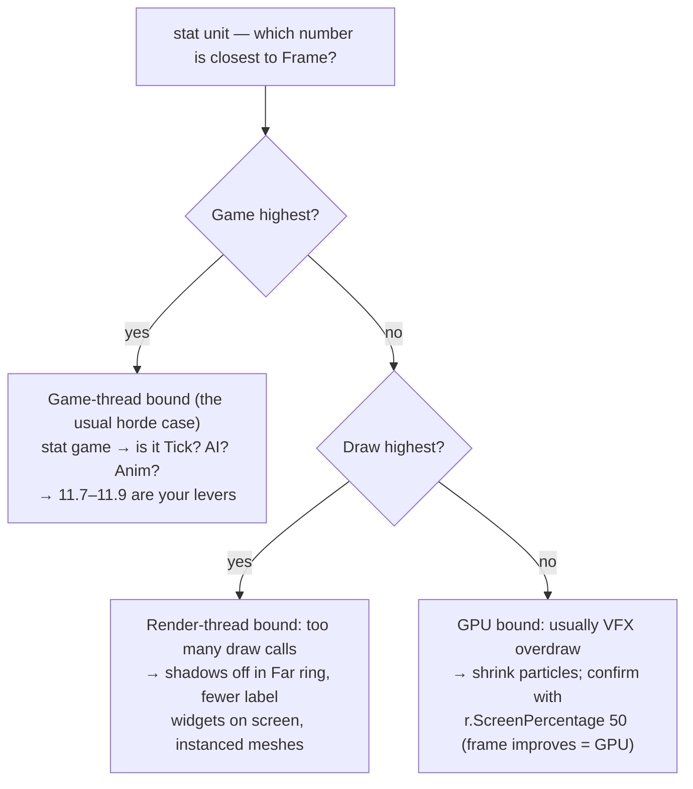

# Chapter 11 — The Arcade Layer: Game Feel & Performance

> **Goal of this chapter:** the layer that makes killing 60 monsters feel like a reward instead of a spreadsheet update — damage numbers, hit flash, hitstop, screen shake, loot fountains — and the performance pass that lets you *afford* it. Feel and performance are one chapter on purpose: every piece of juice spawns something, and everything that spawns at horde rate must be pooled or budgeted.

---

## 11.1 Two halves, one budget

By [Chapter 10](10-zones-and-maps.md) the game is *correct*: packs die, loot drops, XP flows. It just doesn't feel like an ARPG yet, because ARPG feel is feedback density — every hit answered by a number, a flash, a sound. The catch: you're about to multiply "things happening per second" by ten, on top of hordes that were already a perf problem you bought on purpose in [Chapter 6](06-enemies-and-hordes.md). So the first half of this chapter adds the juice, and the second half pays for it. Rule of thumb for everything below: **if it happens on every hit, it gets pooled; if it happens on every frame, it gets a timer or a budget instead.**

## 11.2 Damage numbers: a pool, not a widget factory

The naive version — `Create Widget` + `Add to Viewport` per hit — works in the graybox and dies in the horde. Widget construction allocates Slate objects, runs layout, and leaves garbage for the GC; at 60 mobs taking several hits a second that's hundreds of allocations per second and a visible hitch every time the garbage collector catches up. **Never Create Widget per hit.** Create 64 once, recycle them forever.

One `WBP_DamageNumberLayer` (a full-screen Canvas Panel) is added to the viewport by `BP_ARPGPlayerController` at BeginPlay — the only `Create Widget` call this system ever makes at runtime, besides filling the pool:

| Variable | Type | Default | Purpose |
|---|---|---|---|
| `Pool` | WBP_DamageNumber [ ] | 64 entries | pre-created children of the canvas |
| `NextIndex` | int | 0 | ring-buffer cursor |

```text
Blueprint: WBP_DamageNumberLayer — Event Construct
[For Loop 1..64]
 → [Create Widget (WBP_DamageNumber)] → [Add Child to Canvas]
 → [Set Visibility = Collapsed] → [Add to Pool]

Blueprint: WBP_DamageNumberLayer — event ShowDamage (WorldLoc, Amount, bIsCrit)
[Pool[NextIndex]] ; [NextIndex = (NextIndex + 1) % 64]   ◄ if all 64 are busy, we steal the
                                                           oldest — at that hit rate nobody notices
 → [Project World Location to Widget Position (WorldLoc + Z 90)]  ◄ project ONCE, at spawn
 → [Set Position in Canvas]
 → [Set Text = Round(Amount)] ; bIsCrit → [scale 1.4, color #C05A2A orange]
 → [Set Visibility = HitTestInvisible]
 → [Play Animation (Anim_RiseFade, 0.7 s)]   ◄ rise + fade live in the widget animation —
     Finished → [Set Visibility = Collapsed]    translation & opacity tracks, zero widget Tick
```

Projecting once (instead of re-projecting every frame) is a deliberate top-down cheat: the camera barely translates during a 0.7 s number, so screen-space animation is indistinguishable and costs nothing. The hook is the dispatcher [Chapter 3](03-stats-and-modifiers.md) already fires: `AC_Stats → OnDamaged (Packet, Mitigated)`. `BP_EnemyBase` and `BP_Hero` bind their own `OnDamaged` on BeginPlay and forward to the layer via `BP_ARPGPlayerController` (cache the reference — single-player, there's exactly one). Show `Mitigated` — the number that actually left the life pool. Showing pre-mitigation damage makes armour and resists invisible, and stats the player can't *see* working may as well not exist.

> **Design note:** Niagara text renderers are the other pooled route (numbers as particles, fully world-space). They scale even further but cost you font control and crit styling. The widget pool is the pragmatic pick for a first game; swap later if profiling says so.

## 11.3 The hit feedback stack

Three layers, all riding the same `OnDamaged` dispatcher, each one cheap alone and convincing together.

**Hit flash.** Author the enemy master material `M_Enemy` with a scalar parameter `HitFlash` that lerps emissive toward white. On wake ([Chapter 6](06-enemies-and-hordes.md)), each enemy creates its MID once:

```text
Blueprint: BP_EnemyBase — on Wake
[Create Dynamic Material Instance (Mesh, index 0)] → save as MID_Body   ◄ ONCE — creating a
                                                                          MID per hit is the
                                                                          widget mistake again
Blueprint: BP_EnemyBase — bound to own AC_Stats.OnDamaged
[Set Scalar Parameter Value (MID_Body, "HitFlash", 1.0)]
 → [Set Timer by Event (0.08 s)] → [Set Scalar Parameter Value ("HitFlash", 0.0)]
```

(CustomDepth + a post-process outline also works, but it's a whole PP material and a stencil pass for the same 0.08 s of white. Take the simple MID route.)

**Micro-hitstop.** A tiny freeze on the *victim* when the player lands a big hit sells impact better than any particle. "Big" = crit, kill, or a hit worth ≥ 25% of the victim's MaxLife:

```text
Blueprint: BP_EnemyBase — same OnDamaged binding, after the flash
[Branch: Packet.SourceActor == BP_Hero
         AND (Packet.bIsCrit OR Mitigated >= 0.25 × AC_Stats.GetStat(MaxLife))]
 True → [Set Custom Time Dilation = 0.05]          ◄ victim ONLY — freezing the hero too
      → [Set Timer by Event (0.06 s)]                reads as input lag at horde pace
          → [Set Custom Time Dilation = 1.0]
      → [Start Camera Shake (CS_Hit, Scale = Clamp(Mitigated / VictimMaxLife, 0.1, 1.0))]
```

Damage-scaled shake means clearing trash whispers and a crit on a Rare thumps — the screen itself becomes a damage meter.

> **Pitfall:** never reach for `Set Global Time Dilation` here. It slows the whole world including UI animation and any `Delay` node you'd use to end it, and at ARPG attack speeds a global stutter fires several times per second. Per-actor `Set Custom Time Dilation` is the only sane tool; timers (which ignore the victim's dilation) end it reliably.

> **Multiplayer note:** hitstop and shake are local-only cosmetics even in networked games — the sibling guide's [Chapter 5](../coop-soulslike-ue5/05-stats-and-damage.md) shows the replicated version of this exact stack.

## 11.4 Dying loudly, cleaning up quietly

[Chapter 4](04-damage-and-ailments.md)'s `HandleDeath` stopped the AI and promised the cosmetics to this chapter. Deliver them:

```text
Blueprint: BP_EnemyBase — HandleDeath, cosmetic tail
[Set Simulate Physics (Mesh) = true]                        ◄ capsule already off (Ch 4)
[Add Impulse (Mesh): Normalize(ActorLoc − HeroLoc) × 20000 + (0,0,8000), Vel Change = true]
    ◄ corpses fly AWAY from the hero — physically wrong, emotionally correct
[BP_ARPGGameMode → RegisterCorpse (self)]
[Set Timer by Event (3.0 s)] → [StartDissolve]

Blueprint: BP_EnemyBase — StartDissolve
[Timeline (1 s, 0→1)] → [Set Scalar Parameter Value (MID_Body, "Dissolve", α)]
 → Finished → [Destroy Actor]                               ◄ M_Enemy: Dissolve drives an
                                                              opacity-mask erosion + edge glow
```

Ragdolls are not free — a physics body per corpse adds up fast when you kill 40 things in ten seconds. Cap them, oldest-first, on the GameMode:

```text
Blueprint: BP_ARPGGameMode — RegisterCorpse (Enemy)
[Add Enemy to Corpses array]
[Branch: Length(Corpses) > 40]
 True → [Corpses[0] → StartDissolve]   ◄ skip its 3 s wait — the oldest corpse
      → [Remove Index 0]                 dissolves early to make room
```

## 11.5 Loot feel & the sound layer

The physics toss, `WBP_ItemLabel`, and rarity colors already exist on `BP_GroundItem` from [Chapter 7](07-loot-generator.md) — don't rebuild them, dress them:

- **Label pop:** a 0.15 s scale-up widget animation on `WBP_ItemLabel` at spawn. Cheap, and it makes drops read as *events* instead of things that were always there.
- **Light beam on Rare+:** at BeginPlay, `[Branch: Rarity >= Rare]` → `[Spawn System Attached (NS_LootBeam)]` → `[Set Niagara Variable (Linear Color) "BeamColor"]` — Rare `#FFDF33`, Unique `#C05A2A`. A vertical beam is visible through the horde and across the screen; labels aren't.
- **Rare-drop stinger:** `[Play Sound 2D (S_RareDropStinger)]` on the same branch. This is the Path of Exile divine-orb "ding" psychology in one line: the sound *is* the reward — players learn it in an hour and feel the dopamine before their eyes find the beam. Give rarity a sound and players will farm with their ears.

Layer the rest of the mix the same way, one cue per event class: hit (small, pitch-randomized ±10% so 60 of them don't phase), kill (meatier), level-up ([Chapter 9](09-progression-and-passives.md)'s `NS_LevelUp` gets a fanfare), loot drop (generic thud for Normal/Magic). Route hits through a Sound Concurrency asset capped at ~12 voices — at horde scale you *will* hit the voice limit, decide the winner yourself (newest, loudest) instead of letting the engine pick.

## 11.6 Kill-flow extras

- **Gold vacuum.** Nobody should click gold. Add a Sphere Collision `VacuumSphere` (radius 350) to `BP_Hero`; on overlap with a gold pickup, the pickup sets its own ProjectileMovement to homing (`Homing Target = hero`, acceleration 5000) and collects on contact. The engine does the curve — no Tick, no timeline.
- **Potion charges on kill** already flow from [Chapter 7](07-loot-generator.md)'s flask design — just add the pickup sound and a small HUD pip flash here.
- **On-kill explosions.** The Volatile monster mod from [Chapter 6](06-enemies-and-hordes.md), pointed the other way: a [Chapter 9](09-progression-and-passives.md) keystone gives kills a 20% chance to detonate the corpse (radial `F_DamagePacket`, reuse the Volatile wiring off `OnEnemyKilled`). Chains through a pack like dominoes; instant build identity for one Data Table row.

## 11.7 Performance half: tick hygiene first

Hordes are a perf problem you buy on purpose; here's the payment plan. Before touching plugins, audit Tick — it's the tax you pay even when nothing happens:

| Rule | Where it already lives / what to check |
|---|---|
| Actors: `Start with Tick Enabled` OFF unless proven otherwise | `BP_EnemyBase`, `BP_GroundItem`, pickups — AI runs on the Behavior Tree, movement on components; the actor itself has no business ticking |
| Dormant until wake | [Chapter 6](06-enemies-and-hordes.md)'s `BP_PackSpawner` — no tick, no brain, no anim until the hero is inside WakeRadius |
| Timers over Tick | regen on a 0.1 s timer ([Chapter 3](03-stats-and-modifiers.md)), significance below on 0.5 s — anything that says "every frame" but means "10 times a second" |
| No Tick in widgets | zero property bindings (they evaluate every frame); everything UI is event-driven off Ch 3's dispatchers, and 11.2's numbers animate via widget animations |
| Overlap events only where needed | `Generate Overlap Events` OFF on enemy meshes and capsules; ON only for projectiles, pickups, VacuumSphere, telegraph zones |

## 11.8 Animation at horde scale

Skeletal animation is the biggest game-thread bill 60 mobs run up. Two engine tools plus one cheap trick:

**URO + visibility gating** (per-mesh checkboxes on `BP_EnemyBase`'s mesh): `Enable Update Rate Optimizations` ON — the mesh animates at reduced rates when small/distant and interpolates between evaluations — and `Visibility Based Anim Tick Option = Only Tick Pose When Rendered`, so off-screen mobs stop evaluating pose entirely.

**Animation Budget Allocator** (Plugins → enable, restart): swap the mesh component class on `BP_EnemyBase` for `Skeletal Mesh Component Budgeted`, then `a.Budget.Enabled 1` and `a.Budget.BudgetMs 1.5` in the console. Instead of every mesh deciding its own quality, the allocator spends a fixed 1.5 ms/frame on animation and degrades the least significant meshes first. It's the difference between "60 mobs sometimes spike" and "animation costs 1.5 ms, always."

**Three-ring significance** — a poor-man's Significance Manager, driven by one looping 0.5 s timer on `BP_ARPGGameMode` over the awake-enemies list:

| Ring | Distance to hero | Animation | Shadows |
|---|---|---|---|
| Near | < 2000 uu | full rate | Cast Shadow ON |
| Mid | 2000–4500 uu | mesh `Set Component Tick Interval 0.1` (~10 Hz, URO smooths it) | ON |
| Far | > 4500 uu | `Set Component Tick Interval 0.5` — pose effectively frozen | `Set Cast Shadow` OFF |

At a −55° top-down pitch the Far ring is barely on screen, so nobody ever sees the freeze — which is exactly why top-down is the cheapest genre to fake fidelity in. (The real Significance Manager is C++; it's in [resources](resources.md) for when you get there.)

## 11.9 Pool everything that spawns at hit-rate

Damage numbers are pooled (11.2). Two more high-frequency spawners:

**Projectiles.** At 200 live `BP_SkillProjectile` actors, Spawn Actor / Destroy Actor churn costs real milliseconds and GC pressure. Add `AC_ProjectilePool` to `BP_ARPGGameMode` — a `Map<Class, Actor[]>` with two functions: `Acquire(Class)` (pop a hidden one, or spawn if empty) and `Release(Projectile)` (hide, disable collision, stop ProjectileMovement, push back). `BP_Exec_Projectile` ([Chapter 5](05-skills-as-data.md)) calls `Acquire` instead of Spawn Actor; the projectile calls `Release` where it used to Destroy (hit, pierce spent, lifespan).

> **Pitfall:** a pooled actor is a *reused* actor — reset ALL state on Acquire: clear the hit-once list, reset the pierce counter, re-enable collision, set velocity fresh. The classic pooling bug is a recycled projectile that refuses to hit an enemy its previous life already hit.

**Niagara.** Free win: every `Spawn System at Location` / `Spawn System Attached` node has a `Pooling Method` pin — set it to **Auto Release** for impacts, hit sparks, and death puffs. The system's internal buffers get recycled instead of reallocated. That's the entire change.

## 11.10 Measure it: the 60/200/60 target

The target on mid-range hardware: **60 awake mobs + 200 live projectiles at 60 fps** — a 16.6 ms frame. Load `L_Dev_Gym`, place eight `BP_PackSpawner`s, spam LightningBolt into the blob, and type `stat unit`:



`stat game` breaks the game thread down (watch *Tick Time* and *Anim*: after 11.7/11.8 both should be small even mid-horde). For anything deeper, **Unreal Insights** (Trace → start tracing, reproduce 10 seconds of horde, open the trace): the Timing view shows every tick and skill cast as bars — one afternoon in it teaches you more than a month of guessing. Profile in Standalone, not PIE; the editor inflates game-thread numbers.

## 11.11 Test before moving on

| Test | Expected |
|---|---|
| Hold Fireball on a pack for 30 s | damage numbers recycle from the pool; no hitches; `stat game` shows no widget-construction spikes |
| Land a crit | number is orange and 1.4× — final (mitigated) value shown, matching the life actually lost |
| Big hit on a Rare | victim freezes ~0.06 s, hero keeps moving; shake noticeably stronger than on trash hits |
| Kill 50+ mobs in one corner | ragdolls pop away from the hero; corpse count never exceeds 40, oldest dissolve early |
| Rare item drops off-screen-ish | you *hear* the stinger, then find the `#FFDF33` beam through the horde |
| Gold drops at vacuum edge | curves into the hero and collects, zero clicks |
| Toggle `a.Budget.Enabled 1` mid-horde | anim cost in `stat game` drops; distant mobs visibly step but Near ring stays smooth |
| Walk away from a live pack | Far-ring mobs freeze pose and drop shadows; walk back — they resume before you can tell |
| Recycled projectile hits a fresh pack | hits register normally (hit-once list was reset on Acquire) |
| 60 mobs + ~200 projectiles in `L_Dev_Gym`, Standalone | `stat unit` Frame ≤ 16.6 ms with Game thread not pinned |

**Next:** [Chapter 12 — Saving, Packaging & the Road to C++/GAS](12-saving-packaging-cpp.md)
