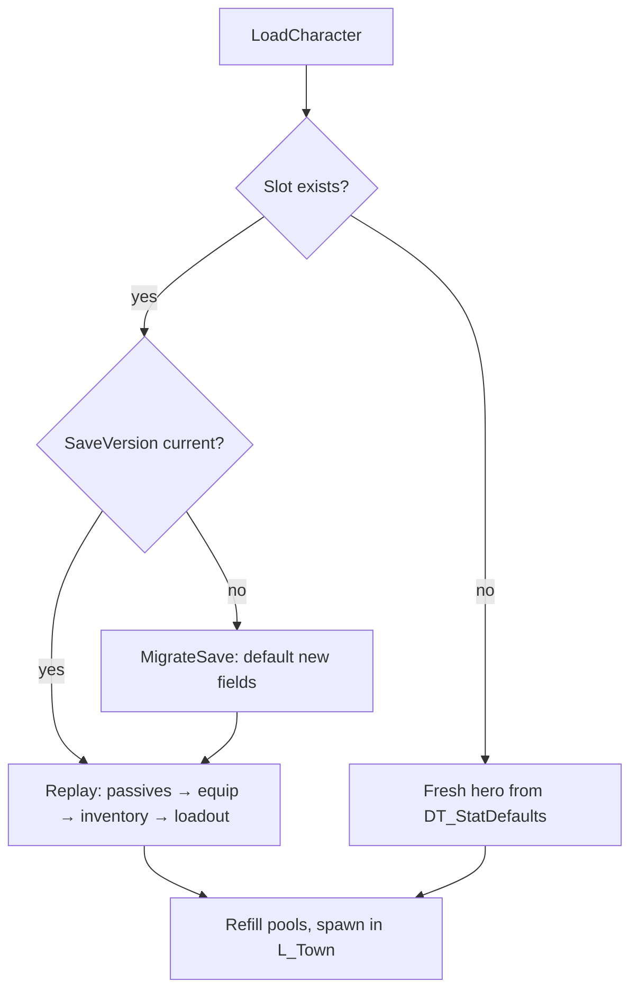

# Chapter 12 — Saving, Packaging & the Road to C++/GAS

> **Goal of this chapter:** a save system that fits in one struct-shaped SaveGame (the payoff of every data decision since [Chapter 3](03-stats-and-modifiers.md)), a packaged Windows build, and an honest map of when — and how — you'd migrate this architecture to C++ and the Gameplay Ability System. Then we close the guide.

---

## 12.1 What counts as state?

Before touching `USaveGame`, answer the design question: *what does this game actually need to remember?* The answer is smaller than you think, and it's small **on purpose**.

| Save field | Type | Source of truth |
|---|---|---|
| `SaveVersion` | int | `SG_ARPG` itself |
| `Level`, `XP` | int, float | `AC_Progression` |
| `AllocatedPassives` | Name[] | `AC_Progression` (node Ids from `DT_PassiveNodes`) |
| `SkillLoadout` | Map<E_SkillSlot, Name> | `AC_SkillCaster` |
| `InventoryItems` | F_ItemInstance[] | `AC_Inventory` |
| `EquippedItems` | Map<E_EquipSlot, F_ItemInstance> | `AC_Equipment` |
| `Gold` | int | `AC_Inventory` |
| `UnlockedWaypoints` | Name[] | `BP_ARPGGameInstance` |
| `UnlockedDifficultyTier` | int | `BP_ARPGGameInstance` (arena tiers, [Chapter 10](10-zones-and-maps.md)) |
| `RunSeed` | int | `BP_ARPGGameInstance` |

Two things make this table boring, and boring is the goal:

1. **`F_ItemInstance` serializes for free.** Back in [Chapter 7](07-loot-generator.md) we insisted the item struct hold plain data — a Guid, a `BaseRow` Name, a rarity, an item level, and rolled affix values. No object references, no actor pointers, no widget handles. `USaveGame` serializes any UPROPERTY-visible struct automatically, so your entire inventory and paper doll go into the save file as-is. If items had referenced live actors or materials, you'd be hand-writing serialization right now. This chapter is where that design decision pays rent.
2. **World state: none.** Zones regenerate from the seed. No "which chests were opened," no "which mobs are dead," no half-cleared dungeon to resurrect — the arcade, roguelite-adjacent structure means every zone entry is fresh. That single decision dodges the hardest problems in save systems (level-actor serialization, streaming-state mismatches, save-file bloat), and the genre doesn't miss it: nobody has ever reloaded a Diablo session hoping the corpses were still there.

Notice what's *not* saved: computed stats. Saves store **decisions, not results**. `MaxLife` is whatever `AC_Stats` computes after passives and gear reapply; `CurrentLife` just refills (you always load into town). Saving computed values is how you get save files that disagree with your balance patch.

## 12.2 `SG_ARPG`: slots, saving, loading

Create the SaveGame Blueprint (`/Game/ARPG/Core/`): Blueprint Class → parent `SaveGame` → `SG_ARPG`, with the variables from the 12.1 table. `SaveVersion` defaults to the *current* version (start at 1) — bump it every time you add or change a field.

One character = one slot. Ship **three character slots** (`Char0`–`Char2`, picked on a minimal main-menu widget); each slot is single — no manual save-scumming rotation, this isn't that kind of game. Save at three moments: **entering town, level-up, and quit**. All three are handled in `BP_ARPGGameInstance` so the logic survives level transitions:

```text
Blueprint: BP_ARPGGameInstance — SaveCharacter
───────────────────────────────────────────────
[SaveCharacter]
 → [Create Save Game Object (SG_ARPG)]
 → [Set SaveVersion = CURRENT_SAVE_VERSION]
 → [AC_Progression → get Level, XP, AllocatedPassives]
 → [AC_SkillCaster → get Loadout] ; [AC_Inventory → get Items, Gold]
 → [AC_Equipment → get Equipped]
 → [+ UnlockedWaypoints, UnlockedDifficultyTier, RunSeed from self]
 → [Async Save Game to Slot ("Char" + SlotIndex)]   ◄ async: no hitch on level-up mid-fight

[LoadCharacter (SlotIndex)]
 → [Does Save Game Exist?]
     False → [InitFreshHero]                         ◄ Level 1, DT_StatDefaults, BasicSlash on LMB
     True  → [Load Game from Slot → Cast to SG_ARPG]
       → [Branch: SaveVersion < CURRENT_SAVE_VERSION]
           True → [MigrateSave]                      ◄ fill new fields with defaults, per version step
       → [AC_Progression → SetLevelAndXP]
       → [ForEach AllocatedPassives → AC_Progression → Allocate]  ◄ re-applies Passive_<Id> mods
       → [ForEach EquippedItems → AC_Equipment → Equip]           ◄ re-applies Item_<Guid> mods
       → [AC_Inventory ← Items, Gold] ; [AC_SkillCaster ← Loadout]
       → [AC_Stats → refill CurrentLife/CurrentMana to max]
```

The load path **replays your decisions through the live systems** — `Allocate` and `Equip` are the same functions the UI calls, so every `F_StatMod` flows through `AC_Stats` exactly as it did originally. No parallel "restore" code path to keep in sync; if equip works, load works.



> **Pitfall:** never save mid-zone. World state isn't saved, so a mid-zone save would restore the hero into a zone that no longer exists as they remember it. Town-enter/level-up/quit covers everything; a quit inside a zone just costs the run — which is the roguelite contract the player already signed in Chapter 10.

> **Pitfall — the version int is not optional.** The first time you add a save field after players have files on disk, an unversioned load reads garbage or silently defaults *everything*. With the int, migration is a `Switch on Int` that fills only the new fields (v1→v2: `UnlockedDifficultyTier = 0`, done). Two nodes now, or corrupted-save bug reports later.

## 12.3 Packaging (the compact pass)

This is a single-player Windows build; the checklist is mercifully short. UE 5.4–5.6, same flow throughout:

1. **Project Settings → Maps & Modes:** Game Default Map = `L_Town` (or your menu map if you built one for slot select).
2. **Project Settings → Packaging:** Build Configuration = *Shipping* (Development for test builds — Shipping strips logs and the console, including your `WBP_StatSheet` debug hotkey if you gated it right). Tick *Use Pak File*. **List of maps to include:** `L_Town`, `L_Zone_Ruins`, the arena map, and **every room-tile Level Instance level from Chapter 10** — level instances are levels, and a missing tile is a runtime stitch crash only a packaged build will show you.
3. **Cook the soft references.** `F_SkillDef.ExecutorClass` is a *soft* class ref in a Data Table — the cooker can't see it from the maps list. Add `/Game/ARPG` under Packaging → *Additional Asset Directories to Cook*. Skills that fire in PIE and silently do nothing in the packaged build are this bug, every time.
4. **Size pass:** run the Size Map tool (right-click Content folder → Size Map), delete unused marketplace imports, set Max Texture Size (2048 is plenty at a −55° top-down camera height), and confirm starter content you never used isn't cooking.
5. Platforms → Windows → **Package Project**. Then *play the packaged build* for 20 minutes: town → waypoint → zone → kill → loot → equip → level → save → relaunch → load. PIE lies about cooking, paths, and save directories.

## 12.4 The road to C++ and GAS

Everything in this guide ships as-is — Blueprint carries a solo ARPG all the way to a store page. But this architecture was quietly designed as a GAS rehearsal, and when you hit one of the three real triggers — **modifier-count performance** (hundreds of active mods make `GetStat` cache churn measurable), **multiplayer**, or **team size** (BP diffs don't code-review) — here is what maps to what:

| This guide | GAS / C++ equivalent | What actually changes |
|---|---|---|
| `AC_Stats` | `UAttributeSet` + `AbilitySystemComponent` | attributes become C++ properties; the ASC owns application |
| Flat / Increased / More pipeline | **`FAggregator`** | the parallel is exact: GAS *Add* modifiers = our Flat; *Multiply* modifiers within an aggregator combine **additively** = our Increased; separate evaluation channels multiply against each other = our More. You already know GAS's math — you've been shipping it since Chapter 3 |
| `F_StatMod` (+ Source key) | `GameplayEffect` modifiers | Source Names become `FActiveGameplayEffectHandle`s; `RemoveModsFromSource` → remove-by-handle |
| `AC_StatusEffects` ailments | duration/periodic GameplayEffects | Ignite = periodic GE, Chill = duration GE with Multiply mods, Shock = a taken-damage multiplier GE — same shapes, engine-managed |
| Skills + `AC_SkillCaster` | `GameplayAbility` per executor family | `TryCast` → `TryActivateAbility`; the montage → `AN_SkillExecute` flow becomes a `PlayMontageAndWait` ability task |
| `E_SkillTag` | native `GameplayTags` | plus free block/cancel rules between tags |
| Cooldown map + mana check | Cooldown GE + Cost GE | the `Set Timer` map in `AC_SkillCaster` is deleted, not ported |

**What survives the port untouched: every Data Table and `F_ItemInstance`.** `DT_Skills`, `DT_Affixes`, `DT_ItemBases`, `DT_EnemyTypes`, `DT_MonsterMods`, `DT_PassiveNodes`, `DT_StatDefaults`, `DT_DropTable`, `BFL_LootGen`'s logic, your save files. That is the entire point of *content is data*: the executors are replaceable; the game — the content — is not welded to them.

Two practical notes. First, GAS cannot be set up in pure Blueprint — the ASC and AttributeSets are C++-only, so budget a thin C++ layer; the [soulslike guide's Chapter 12](../coop-soulslike-ue5/12-packaging-and-beyond.md) covers that on-ramp in detail. Second, migrate **behind your existing interfaces**: keep `GetStat`, `TryCast`, and the dispatchers as the public surface and swap the guts — UI, AI, and executors never notice.

> **Multiplayer note:** this guide is single-player by design, and bolting replication on afterward is a rewrite, not a patch. If co-op is the goal, the sibling guide's [Chapter 2](../coop-soulslike-ue5/02-multiplayer-foundations.md) and [Chapter 3](../coop-soulslike-ue5/03-sessions-and-joining.md) teach the authority model and session flow. Five things in *this* game that must become server-authoritative, no exceptions: **damage** (the whole Ch 4 pipeline runs on the server), **loot rolls** (`BFL_LootGen` server-side or clients print legendaries), **inventory operations** (add/remove/drop validated server-side), **skill validation** (`TryCast`'s mana/cooldown checks — clients only *request*), and **XP** (awarded by the server's `OnEnemyKilled`, never claimed by clients).

## 12.5 Cut scope, then ship

You have every system the genre requires. If you're now pointing this at a real, finite project — say three months — the systems aren't what you cut. Cut **content width** first, in this order:

| As built in this guide | 3-month version | Why this cut is safe |
|---|---|---|
| ~30 passive nodes, 3 branches | 12 nodes, 1 branch + 1 keystone | the *system* sells builds; count is content-entry later |
| Procedural room stitching (Ch 10) | 2–3 hand-built zones | proc-gen is the highest-variance week in this guide |
| 6 skills | 4 (one per executor + WarCry) | each executor already proves the pipeline |
| 5 enemy archetypes | 3 (Rusher, Ranged, Exploder) | Tank and Caster are tuning, not code |
| 6 monster mods | 3 (Fast, Fiery, Volatile) | rare monsters still feel special |
| Arena endgame + difficulty tiers | one endless arena, no tiers | the loop matters, the meta doesn't yet |
| 3 character slots | 1 | nobody playtests slot two |

What you don't cut: the modifier pipeline, skills-as-data, or the item generator. Those three chapters *are* the game; everything else is dressing on them.

And that's the guide. You built an ARPG the way the studios that define the genre build them — content in tables, one stat pipeline, executors that don't know what they're executing — and you have a packaged build to prove it. The gap between you and a shipped game is no longer systems; it's content, tuning, and the discipline to stop adding chapters of your own. Zip the build, send it to three friends, and watch the first one instinctively hover an item label. **Ship something.**

## 12.6 Ship checklist

| Test | Expected |
|---|---|
| New character → level 3, loot equipped → quit to desktop → relaunch → load | Level, XP, gold, inventory, equipment, passives, and skill bar identical; life/mana full |
| Open `WBP_StatSheet` before quit and after load | Final stats match exactly — mods replayed once, not doubled (load twice to be sure) |
| Hand-edit a save to `SaveVersion = 0`, load | Migration branch runs, new fields defaulted, no crash |
| Quit from inside a zone, reload | Hero in town with pre-zone state; run lost, character intact |
| All three character slots | Independent heroes; deleting one doesn't touch the others |
| Packaged **Shipping** build: full loop (town → zone → kill → loot → level → save → load) | Works outside PIE; every skill's executor fires (soft refs cooked) |
| Packaged build: waypoint to every zone + arena | No missing-map crash; stitched rooms navigate (invokers working) |
| Packaged build in the 60-mob horde | Chapter 11's 60 fps target holds in Shipping config |

---

*All green? Then you're done reading guides — you're patching a game. Every doc, talk, and repo referenced along the way lives in the [Resources appendix](resources.md).*
