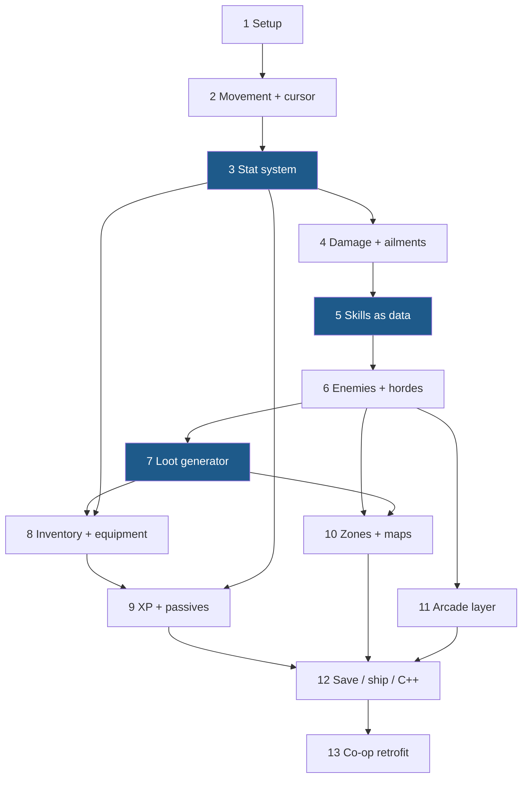

# Building a Top-Down ARPG in Unreal Engine 5 — A Step-by-Step Guide

A 13-chapter, Blueprint-first implementation guide for a Path of Exile / Diablo-style top-down action RPG — hordes of monsters, data-driven skills, randomly generated loot with affixes, a passive tree, and procedurally stitched zones — with a deliberately arcade-y feel: fast, loud, and generous with feedback. Written to be followed in order.

> **The one rule the whole guide is built on:** *content is data; Blueprints are executors* — and **every number flows through one modifier pipeline**. Every skill, monster, affix, and passive node is a row in a Data Table, and anything that changes a stat (an equipped ring, a passive node, a chill debuff, a monster mod) is the same `F_StatMod` applied to the same component. Get this right in Chapters 3–5 and the rest of the game is content entry.

This guide is **single-player first, co-op last**. The ARPG-specific systems — stat math, the skill system, the item generator — are a full guide on their own, so Chapters 1–12 build the game solo (leaving deliberate multiplayer breadcrumbs along the way), and [Chapter 13](13-coop-multiplayer.md) then takes it online as 2–4 player drop-in co-op. The networking *fundamentals* are not re-taught: Chapter 13 leans on the sibling [co-op soulslike guide](../coop-soulslike-ue5/)'s documentation for the authority model and sessions, and spends its pages purely on the ARPG-specific problems (server-side loot rolls, instanced drops, seed-replicated procedural zones, bring-your-own-hero saves).

---

## What you'll have at the end

- A top-down hero with click-to-move *and* WASD + cursor-aim control schemes, a dash with i-frames, and a camera that behaves like the genre expects
- A stat system that speaks fluent ARPG: flat / increased / more modifiers, resistances, armour, crits — with one aggregation pipeline every source plugs into
- Six data-driven skills (melee sweep, projectiles, ground AoE, a buff) cast from a PoE-style skill bar, with ignite/chill/shock ailments riding on hits
- Monster packs at horde scale: five enemy archetypes on one Behavior Tree, magic/rare monsters with rolled modifiers, spawners that keep 60+ mobs cheap
- A loot generator: item bases + tiered, weighted affixes → rarity-colored ground drops with labels, inventory, equipment that feeds straight back into the stat pipeline, comparison tooltips
- XP, levels, and a hand-authored ~30-node passive tree with keystones
- A town hub, waypoints, seeded procedurally stitched dungeon zones, and an arcade endgame arena
- The full arcade feedback layer — pooled damage numbers, hit flash, hitstop, loot fountains — *and* the performance work that keeps hordes at 60 fps
- Save slots, a packaged Windows build, and a mapped migration path to C++/GAS
- 2–4 player drop-in co-op: server-authoritative skills/damage/loot, instanced drops, monster scaling by player count, shared procedural zones that replicate as a single seed

## Chapters

| # | Chapter | You build |
|---|---|---|
| 1 | [Project Setup & the Top-Down Frame](01-project-setup.md) | Project from the Top Down template, framework classes, folders, input actions, source control |
| 2 | [Movement, Camera & Cursor Targeting](02-movement-and-input.md) | Camera rig, click-move + WASD schemes, `GetCursorWorldLocation`, dash with i-frames |
| 3 | [The Stat System](03-stats-and-modifiers.md) | `AC_Stats`: the flat/increased/more formula, source-keyed modifiers, cached lookups, stat sheet UI |
| 4 | [The Damage Pipeline & Status Effects](04-damage-and-ailments.md) | `F_DamagePacket`, armour & resists, crits, ignite/chill/shock as timed stat mods, death |
| 5 | [Skills as Data](05-skills-as-data.md) | `DT_Skills` + `AC_SkillCaster` + three executors; six working skills on a skill bar |
| 6 | [Enemies at Horde Scale](06-enemies-and-hordes.md) | Enemy archetypes, one BT for all of them, pack spawners with dormancy, magic/rare monster mods |
| 7 | [Loot: the Item Generator](07-loot-generator.md) | Item bases, tiered weighted affixes, `F_ItemInstance`, drop tables, ground items with labels |
| 8 | [Inventory, Equipment & Tooltips](08-inventory-and-equipment.md) | Inventory, paper doll, drag-and-drop, equip → stat mods, comparison tooltips |
| 9 | [XP, Levels & the Passive Tree](09-progression-and-passives.md) | XP curve, level-up flow, a 30-node passive tree with keystones, respec |
| 10 | [Zones, Waypoints & Procedural Maps](10-zones-and-maps.md) | Town hub, zone levels, seeded room-tile dungeons via Level Instances, arena endgame |
| 11 | [The Arcade Layer](11-arcade-layer.md) | Damage numbers, hit flash, hitstop, loot feel, corpse management — and the horde performance pass |
| 12 | [Saving, Packaging & the Road to C++/GAS](12-saving-packaging-cpp.md) | Save slots, packaged build, the GAS migration map |
| 13 | [Co-op: Taking the ARPG Online](13-coop-multiplayer.md) | The multiplayer retrofit: server-authoritative everything, instanced loot, seed-replicated zones, party play |
| A | [Resources appendix](resources.md) | Every doc, tutorial, talk, sample repo & plugin, annotated |

## System dependency map

Chapters are ordered so each system stands on finished ones:



The blue nodes are the load-bearing ones: the modifier pipeline (Ch. 3), skills-as-data (Ch. 5), and the item generator (Ch. 7). Those three *are* the genre — skimp anywhere but there.

## Suggested pacing

Working evenings/weekends, each chapter is roughly a week; Chapters 5 and 7 are closer to two, and Chapter 11 expands to fill whatever time you give it (juice always does). Don't rush Chapter 3 — it's the hour of design that saves a month of "why doesn't my ring stack with my passive" rewrites.

```mermaid
gantt
    dateFormat X
    axisFormat wk %s
    title Rough relative effort (1 unit ≈ a hobby week)
    section Foundations
    Ch 1-2 Setup + movement           :0, 2
    Ch 3 Stat system                  :2, 1
    Ch 4 Damage + ailments            :3, 1
    section The genre core
    Ch 5 Skills as data               :4, 2
    Ch 6 Enemies + hordes             :6, 1
    Ch 7 Loot generator               :7, 2
    Ch 8 Inventory + equipment        :9, 1
    section Progression & world
    Ch 9 XP + passive tree            :10, 1
    Ch 10 Zones + proc-gen            :11, 1
    section Ship it
    Ch 11 Arcade layer + perf         :12, 2
    Ch 12 Save + package              :14, 1
    section Go online
    Ch 13 Co-op retrofit              :15, 3
```



## How to read the code examples

Blueprints don't paste into Markdown, so graphs are written as structured pseudocode. `[Square brackets]` are nodes (using exact node names from the palette — e.g. `Multi Sphere Trace For Objects`, `Get Hit Result Under Cursor by Channel`, `Set Timer by Event`), indentation is execution flow, and `◄` comments explain the *why*:

```text
[IA_Skill_Q Triggered]                        ◄ Enhanced Input action event
 → [AC_SkillCaster → TryCast (Slot=Q)]        ◄ all validation lives in the component
     → [Branch: CooldownRemaining <= 0 AND CurrentMana >= Cost]
         True → [Play Anim Montage (rate = CastSpeed stat)]
```

Data Table rows are shown as tables, and struct definitions as variable tables — those details *are* the tutorial. Diagrams are [Mermaid](https://mermaid.js.org/) and render directly on GitHub.

## Prerequisites

- UE5 installed and basic editor literacy (place actors, open Blueprints, make a struct). If Blueprints are brand new to you, do Epic's free "Your First Hour in Unreal Engine 5" course first — this guide assumes you can wire nodes.
- No C++ required anywhere; Chapter 12 tells you when you'd *want* it.
- The [co-op soulslike guide](../coop-soulslike-ue5/) is **not** a prerequisite — the two share DNA (a stats component, data-driven design) but this guide stands alone.

---

*Written July 2026 against UE 5.4–5.6; current stable at time of writing is 5.8, and everything here uses core 5.x systems that are unchanged in it. Sources and further reading: [resources.md](resources.md).*
