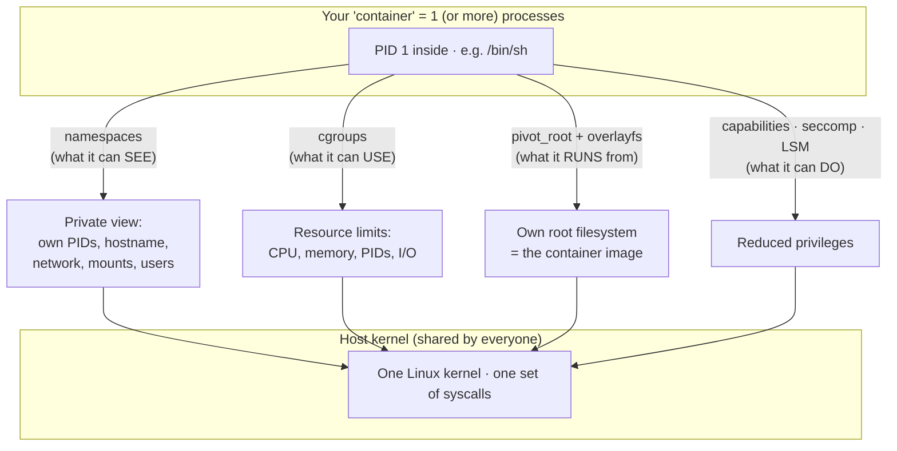
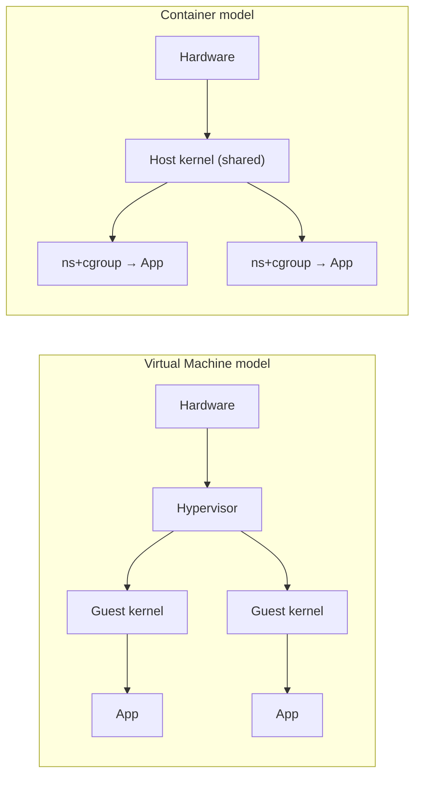
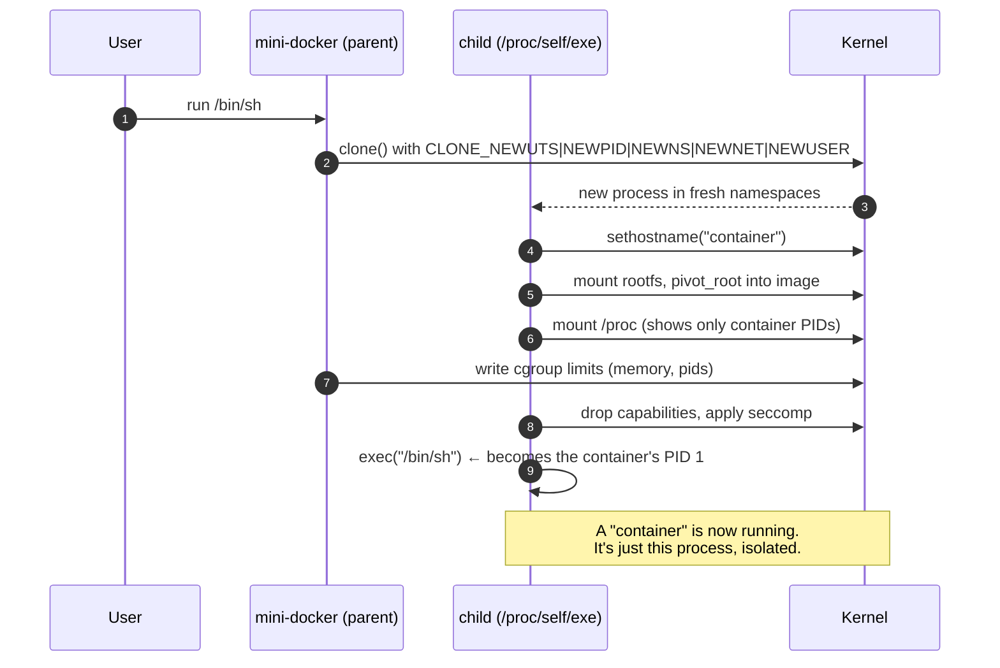

# Container From Scratch — Build Your Own Docker in Go

> A hands-on, deeply illustrated guide to how OS-level containerization *actually*
> works — and how to build a working mini "Docker" in Go, one Linux primitive at a
> time. Along the way we compare how **Linux**, **macOS**, and **Windows** isolate
> code, and why "app isolation" means something very different on each of them
> (including why game/software hacks are hard on macOS but easy elsewhere, and how
> Linux **AppImage** fits into the picture).

<p align="center">
  <em>“A container is just a normal Linux process wearing a very good disguise.”</em>
</p>

---

## Why this guide exists

Most people meet containers through Docker's polished CLI and never see the machinery
underneath. But there is no `container` system call. A container is an **illusion**
assembled from a handful of ordinary Linux kernel features:

- **namespaces** — give a process its own private view of the system (its own PIDs,
  its own hostname, its own network, its own filesystem mounts),
- **cgroups** — cap how much CPU, memory, and I/O that process can consume,
- **pivot_root / chroot + overlayfs** — give it its own root filesystem (the "image"),
- **capabilities, seccomp, LSMs** — take away the dangerous powers it doesn't need.

Stack those together and you get something that *looks* like a lightweight VM but is
really just a process the kernel is lying to. This guide takes you from `fork/exec`
all the way to a tiny container runtime that can `run` a Linux image with its own
root filesystem, isolated process tree, hostname, and resource limits — in a few
hundred lines of Go.

Then we zoom out and answer the question that motivated it: **isolation is not one
thing.** What macOS, Windows, Linux containers, and AppImage each call "isolation"
are different mechanisms with different goals (security boundary vs. packaging
convenience). The final chapters map them side by side.

---

## Mental model (read this first)



Four questions, four mechanisms. Keep them in mind for the whole guide:

| Question | Mechanism | Chapter |
| --- | --- | --- |
| What can the process **see**? | namespaces | [03](docs/03-namespaces.md) |
| How much can it **use**? | cgroups | [04](docs/04-cgroups.md) |
| What does it **run from**? | pivot_root + overlayfs | [06](docs/06-rootfs-and-images.md) |
| What is it **allowed to do**? | capabilities, seccomp, LSMs | [08](docs/08-security-and-hardening.md) |

A **VM** virtualizes *hardware* and runs a second kernel. A **container** virtualizes
the *operating system's view* and shares the host kernel. That single difference
explains almost everything about their trade-offs.



---

## What you'll build

By the end you'll have a runnable Go program, `mini-docker`, that does roughly this:

```console
# ./mini-docker run /bin/sh
[inside] hostname is 'container', I am PID 1,
[inside] I have my own /proc, my own root filesystem,
[inside] and I can't use more than 100 MB of RAM.
```

Each step is a self-contained, compilable Go program under [`src/`](src/), building up
from "just exec a command" to the full thing. You can read the code and run each step
as you go.

---

## Prerequisites

- **A Linux host** (or Linux VM) with a reasonably recent kernel (≥ 4.6; the guide
  notes where 5.x/6.x features help). Namespaces and cgroups are Linux kernel
  features — the runnable code **does not work on macOS or Windows natively**, which
  is itself one of the lessons of this guide (see chapters
  [11](docs/11-macos-isolation.md) and [12](docs/12-windows-isolation.md)).
- **root / sudo** — creating most namespaces and cgroups needs privilege (we cover
  *rootless* containers via user namespaces in chapter [08](docs/08-security-and-hardening.md)).
- **Go ≥ 1.21** (developed against 1.24).
- Comfort with a terminal. No prior kernel knowledge assumed.

> ⚠️ **Safety:** several commands mount filesystems, create network interfaces, and
> `pivot_root`. Run them in a throwaway VM or container, not your daily driver. Every
> destructive step in this guide is flagged.

---

## Repository layout

```
container-from-scratch/
├── README.md                 ← you are here (the map)
├── docs/                     ← the guide, one chapter per file
│   ├── 01-what-is-a-container.md
│   ├── 02-the-linux-toolbox.md
│   ├── 03-namespaces.md
│   ├── 04-cgroups.md
│   ├── 05-building-a-container-in-go.md
│   ├── 06-rootfs-and-images.md
│   ├── 07-networking.md
│   ├── 08-security-and-hardening.md
│   ├── 09-how-docker-really-works.md
│   ├── 10-appimage.md
│   ├── 11-macos-isolation.md
│   ├── 12-windows-isolation.md
│   └── 13-comparison-and-further-reading.md
└── src/                      ← working Go code, one program per step
    ├── go.mod
    ├── Makefile
    ├── README.md
    ├── step1-exec/
    ├── step2-uts-namespace/
    ├── step3-reexec/
    ├── step4-pid-and-proc/
    ├── step5-rootfs-pivot-root/
    ├── step6-cgroups/
    └── step7-mini-docker/
```

---

## The learning path

Read the chapters in order — each builds on the last. Concept chapters (🧠) explain a
kernel feature; build chapters (🛠️) write Go code that uses it.

| # | Chapter | What you'll learn |
| --- | --- | --- |
| 01 | 🧠 [What *is* a container?](docs/01-what-is-a-container.md) | Containers vs VMs, the "process in disguise" model, a tour of the moving parts. |
| 02 | 🧠 [The Linux toolbox](docs/02-the-linux-toolbox.md) | The kernel features containers are made of, and the syscalls that expose them (`clone`, `unshare`, `setns`, `mount`, `pivot_root`). |
| 03 | 🧠 [Namespaces](docs/03-namespaces.md) | All eight namespace types, with `unshare(1)` demos you can run in a terminal. |
| 04 | 🧠 [cgroups](docs/04-cgroups.md) | Resource limits with cgroups v1 and v2; capping memory, CPU, and PID count. |
| 05 | 🛠️ [Building a container in Go](docs/05-building-a-container-in-go.md) | The core build. The `/proc/self/exe` re-exec trick, `SysProcAttr.Cloneflags`, and steps 1→4 of the code. |
| 06 | 🛠️ [Root filesystems & images](docs/06-rootfs-and-images.md) | `chroot` vs `pivot_root`, overlayfs layers, and how OCI/Docker images are just tarballs + JSON. |
| 07 | 🛠️ [Networking](docs/07-networking.md) | Network namespaces, `veth` pairs, bridges, NAT, and port publishing. |
| 08 | 🛠️ [Security & hardening](docs/08-security-and-hardening.md) | Dropping capabilities, seccomp syscall filters, user namespaces, and rootless containers. |
| 09 | 🧠 [How Docker really works](docs/09-how-docker-really-works.md) | `docker` → `containerd` → `runc`, the OCI runtime & image specs, and the full `pull`+`run` flow. |
| 10 | 🧠 [AppImage](docs/10-appimage.md) | SquashFS + FUSE + `AppRun`: portable app packaging, and why it's *not* a security sandbox. |
| 11 | 🧠 [macOS isolation](docs/11-macos-isolation.md) | App Sandbox, Seatbelt/TrustedBSD MAC, entitlements, code signing, SIP — why "no hacks" on Mac, and how Docker runs there at all. |
| 12 | 🧠 [Windows isolation](docs/12-windows-isolation.md) | Job objects, server silos, Hyper-V isolation, AppContainer/UWP — and why hacks stay easy. |
| 13 | 🧠 [Comparison & further reading](docs/13-comparison-and-further-reading.md) | One table to rule them all: isolation mechanisms across OSes, "boundary vs. packaging", and where to go next. |

---

## The big picture — what a `run` does

This is the whole journey of the guide in one diagram. Don't worry if it's opaque now;
by chapter 09 every arrow will make sense.



---

## How to use the code

```console
$ cd src
$ make            # build every step
$ sudo ./bin/step2-uts-namespace run /bin/sh   # try an early step
$ sudo ./bin/step7-mini-docker run /bin/sh     # the capstone
```

See [`src/README.md`](src/README.md) for per-step build/run instructions, what each
step demonstrates, and how to prepare a root filesystem to run inside.

---

## Credits & lineage

This guide stands on the shoulders of the community that popularized "containers from
scratch," especially Liz Rice's *"Containers From Scratch"* talks and demos, Julian
Friedman's early *"Build Your Own Container Using Less than 100 Lines of Go"*, and the
`runc`/OCI maintainers whose specs turned these tricks into a standard. Full references
are collected in chapter [13](docs/13-comparison-and-further-reading.md).

---

*Start here → [Chapter 01: What is a container?](docs/01-what-is-a-container.md)*
