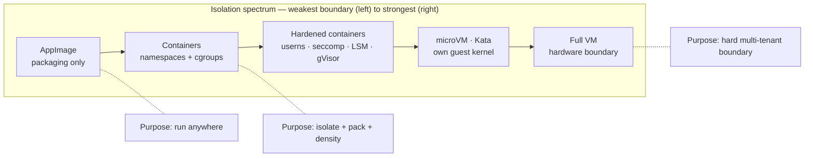

# Chapter 13 — Comparison & further reading

> You built a container from `fork/exec` up. You watched macOS refuse to let one
> process read another's memory, and Windows shrug and hand it over. Now let's put
> every system we've met on one table, answer the questions that started this guide,
> and point you at where to go deeper.

This is the synthesis chapter. No new code, no new syscalls — just the map that
makes the previous twelve chapters click together.

## What you'll learn

- Why **"isolation" is a spectrum**, not a yes/no property — and where each system sits.
- A single comparison table across Linux containers, rootless containers, gVisor,
  Kata, full VMs, macOS App Sandbox, Windows containers/AppContainer, AppImage,
  Flatpak, and Snap.
- Direct answers to the guide's framing questions: why "no hacks" on macOS, why
  classic Linux/Windows apps *are* hackable, and where AppImage fits.
- Concrete next features to add to your `mini-docker`.
- A curated, categorized reading list to keep going.

---

## The thesis: isolation is a spectrum, not a switch

The single biggest misconception about containers is that "isolated" means one thing.
It does not. Every mechanism in this guide draws a boundary, but the boundaries differ
in **what they're for** and **how hard they are to cross**:

- Some boundaries exist purely for **packaging** — bundle an app with its
  dependencies so it runs anywhere. They protect *nothing*. (AppImage.)
- Some exist for **isolation and density** — give each workload its own view of the
  system and a cap on resources, so many can share one host cheaply. They *do* form a
  security boundary, but a softer one, because everyone shares the kernel. (Linux
  containers, [namespaces](03-namespaces.md) + [cgroups](04-cgroups.md).)
- Some exist as a **hard security boundary** — the whole point is that code on one
  side cannot reach the other, even if it's malicious. (Full VMs; microVMs like Kata;
  and, on the desktop, the mandatory macOS App Sandbox from [chapter 11](11-macos-isolation.md).)

The mistake is comparing them as if they were competing at the same job. AppImage
isn't a "weak container"; it isn't trying to be a container at all. A Docker container
isn't a "cheap VM"; it's trading a slice of the VM's security for enormous gains in
speed and density. Read the whole guide through that lens and the contradictions
dissolve.

Moving right, two things increase together: the **strength of the boundary** and the
**cost** (memory, startup time, syscall/hardware overhead). Moving left, you gain
speed and density and give up protection. There is no free lunch; there is only the
right point on the curve for your threat model.

---

## The one table

Read "Shares host kernel?" as the master variable — it predicts almost everything
else. "Inject/edit memory from outside?" is the question that motivated this guide:
can a *different* process (same user, or the host) reach in and tamper with this one?

| System | Mechanism | Shares host kernel? | Isolation unit | Resource limits | Boundary strength | Inject memory from outside? | Primary purpose |
| --- | --- | --- | --- | --- | --- | --- | --- |
| **Linux containers** (Docker / runc) | namespaces + cgroups + seccomp + caps | Yes | Process group | Yes (cgroups) | Moderate (shared kernel) | Host root / same-UID via `ptrace` yes; cross-container no | Packaging + isolation + density |
| **Rootless + userns** | user namespace maps "root" to unprivileged host UID | Yes | Process group | Yes (cgroups v2) | Moderate+ (container root ≠ host root) | Host can; container can't reach host | Isolation without host root |
| **gVisor** | userspace kernel (Sentry, in Go) intercepts syscalls | Partially (app hits Sentry, not host) | Sandbox process | Yes (via runsc/cgroups) | Strong (tiny host syscall surface) | Host can; workload boxed in | Security + container UX |
| **Kata / microVM** | lightweight VM per pod, own guest kernel via KVM | No | microVM | Yes (VM sizing + cgroups) | Strong (hardware virt) | Only from hypervisor; cross-VM no | Security + container UX |
| **Full VM** | hypervisor virtualizes hardware, full guest OS | No | Virtual machine | Yes (vCPU / RAM alloc) | Strongest (hardware boundary) | Only from host/hypervisor | Multi-tenancy / other OSes |
| **macOS App Sandbox** | Seatbelt profile via TrustedBSD MACF + entitlements | Yes (XNU) | Per-app process | Not the goal | Strong for same-user apps | No — `task_for_pid` blocked by AMFI/SIP on signed/hardened apps | Security sandbox (default) |
| **Windows AppContainer** (UWP) | low integrity level + capability SIDs | Yes | Per-app process | Via job objects | Moderate (access-control sandbox) | Restricted by integrity level | Sandbox packaged apps |
| **Windows process container** | server silos + job objects (namespace-like) | Yes | Silo | Yes (job objects) | Moderate (shared kernel) | Host can; cross-container no | Packaging + isolation |
| **Windows Hyper-V container** | container inside a utility VM, own kernel | No | Utility VM | Yes | Strong (hardware virt) | Only from host | Stronger multi-tenant boundary |
| **AppImage** | SquashFS + FUSE + `AppRun`, one file | Yes | None (your normal user) | None | **None** (packaging only) | Trivially — it's an ordinary process | Portability / packaging |
| **Flatpak** | bubblewrap (userns) + seccomp + portals | Yes | Process sandbox | Not primary | Real, but configurable | Restricted inside sandbox; host user still can | Packaging + desktop sandbox |
| **Snap** | AppArmor (LSM) + seccomp + namespaces | Yes | Process sandbox | Not primary | Strict: real; classic: none | Restricted under *strict*; open under *classic* | Packaging + confinement |

A few honest caveats packed into that grid:

- **"Shares host kernel? Yes"** is the softness. Every shared-kernel row is only as
  strong as the kernel's syscall surface — one kernel bug and the boundary is gone.
  That's exactly why gVisor and Kata exist: they shrink or replace that surface.
- **Snap's strength depends on AppArmor being enabled.** On Ubuntu it is; on Fedora
  or Arch, `snapd` may fall back to partial confinement, and *classic* snaps disable
  most of it by design.
- **Flatpak's sandbox is real but negotiable** — apps request broad permissions
  (`--filesystem=home`) and many get them, so "sandboxed" is not automatically "safe".

---

## Answering the questions that started this guide

### Why is there "no hacks" on macOS?

Because on macOS the sandbox is **mandatory, kernel-enforced, and on by default** —
it's a security boundary by design, not an afterthought. Four layers stack up (all
detailed in [chapter 11](11-macos-isolation.md)):

1. **App Sandbox (Seatbelt)** — a per-app profile enforced at the syscall level by
   the **TrustedBSD MAC framework (MACF)** inside XNU. The app can only touch what its
   entitlements allow.
2. **Code signing + AMFI** — Apple Mobile File Integrity refuses to run or inject
   unsigned/tampered code, and gates who may obtain another process's task port.
3. **Hardened Runtime** — opts an app into protections against code injection, DYLD
   insertion, and debugging of its memory.
4. **SIP + `task_for_pid` restrictions** — with System Integrity Protection on (the
   default), obtaining the Mach **task port** of a platform binary or a hardened,
   signed app is denied. No task port means no `mach_vm_write` — no reaching into
   another process's memory.

That last point is the crux. A game trainer works by getting a *handle* to the
target process and writing its memory. On macOS, even as the same user, the OS simply
won't give you the handle. The boundary is the default.

### Why are classic Linux and Windows apps so hackable?

Because on those systems, for ordinary same-user desktop apps, **isolation is opt-in
and aimed at packaging/resource control, not at protecting one process's memory from
another process owned by the same user.** The tools to reach in ship in the box:

- **Linux:** `ptrace(2)` and `process_vm_writev(2)` let a same-user process read and
  write another's memory (subject to the Yama `ptrace_scope` sysctl, and always
  available to root). See [chapter 8](08-security-and-hardening.md).
- **Windows:** `OpenProcess` + `ReadProcessMemory`/`WriteProcessMemory` do the same
  for a same-user or privileged process. See [chapter 12](12-windows-isolation.md).

A Docker container changes what a process can *see* and *use*, but two processes in
the *same* container, or the host looking in, still have full `ptrace`/`OpenProcess`
reach. Container isolation was never trying to stop that; it separates *workloads*,
not *a user from their own processes*. Newer opt-in sandboxes (Flatpak, Snap-strict,
AppContainer) close the gap, but they aren't the default the way macOS's is.

### Where does AppImage fit?

Squarely on the far-left, **packaging** end of the spectrum ([chapter 10](10-appimage.md)).
An AppImage is a SquashFS image with an `AppRun` entry point, mounted via FUSE and
executed as your normal, unconfined user. It solves "ship one file that runs on any
distro." It provides **no sandbox, no resource limits, and no security boundary** —
an AppImage process is exactly as inspectable and injectable as any binary you double-
click. That's not a flaw; it's simply not what the format is for.

### So what *are* containers, honestly?

Primarily **isolation + packaging + density**: a real but *softer* security boundary
than a VM, because the kernel is shared. For most workloads that trade is exactly
right. When you need more, you harden the same primitives — drop capabilities, add a
seccomp filter, enable a user namespace, turn on an LSM ([chapter 8](08-security-and-hardening.md)) —
or you move right on the spectrum to gVisor or a Kata microVM and accept the cost.

---

## What to build next with `mini-docker`

Your capstone ([src/step7-mini-docker](../src/step7-mini-docker/main.go)) already does
namespaces, `pivot_root`, and cgroups. Natural next features, each mapping to a chapter:

- **Networking** — a `veth` pair into a bridge with NAT and port publishing, so the
  container can actually talk to the world ([chapter 7](07-networking.md)).
- **Capability drop + seccomp** — strip `CAP_SYS_ADMIN` and friends, then install a
  syscall allowlist so a compromised process can't reach the dangerous kernel surface
  ([chapter 8](08-security-and-hardening.md)).
- **OverlayFS layers** — stack a read-only image over a writable upper dir so `run`
  is instant and disposable, the way real images work ([chapter 6](06-rootfs-and-images.md)).
- **An image puller** — fetch and unpack an OCI image from a registry (manifest →
  layers → tarballs) instead of hand-preparing a rootfs ([chapter 9](09-how-docker-really-works.md)).
- **Rootless mode** — run the whole thing inside a user namespace with UID/GID maps so
  no `sudo` is required ([chapter 8](08-security-and-hardening.md)).

Ship two or three of those and you have, genuinely, a tiny container runtime.

---

## Further reading

### Talks & books

| Resource | Author | Why |
| --- | --- | --- |
| [Containers From Scratch (GOTO 2018)](https://www.youtube.com/watch?v=8fi7uSYlOdc) · [code](https://github.com/lizrice/containers-from-scratch) | Liz Rice | The live-coded Go container that inspired a genre. |
| [Container Security](https://www.oreilly.com/library/view/container-security/9781492056690/) (O'Reilly) | Liz Rice | The book on the *boundary* side — kernel sharing, hardening, threat models. |
| [Build Your Own Container Using Less than 100 Lines of Go](https://www.infoq.com/articles/build-a-container-golang/) | Julian Friedman | The original short, sharp walkthrough. |
| [Cgroups, namespaces, and beyond: what are containers made from?](https://www.slideshare.net/jpetazzo/cgroups-namespaces-and-beyond-what-are-containers-made-from-dockercon-europe-2015) (DockerCon EU 2015) | Jérôme Petazzoni | Hand-crafting a container from raw primitives, with demos. |

### man pages (your primary sources)

These are authoritative and worth reading in full:

- [namespaces(7)](https://man7.org/linux/man-pages/man7/namespaces.7.html) ·
  [user_namespaces(7)](https://man7.org/linux/man-pages/man7/user_namespaces.7.html) ·
  [cgroups(7)](https://man7.org/linux/man-pages/man7/cgroups.7.html) ·
  [capabilities(7)](https://man7.org/linux/man-pages/man7/capabilities.7.html)
- [clone(2)](https://man7.org/linux/man-pages/man2/clone.2.html) ·
  [unshare(1)](https://man7.org/linux/man-pages/man1/unshare.1.html) ·
  [pivot_root(2)](https://man7.org/linux/man-pages/man2/pivot_root.2.html) ·
  [mount(2)](https://man7.org/linux/man-pages/man2/mount.2.html) ·
  [seccomp(2)](https://man7.org/linux/man-pages/man2/seccomp.2.html)

### LWN deep dives

- [Namespaces in operation, part 1](https://lwn.net/Articles/531114/) — Michael
  Kerrisk's seven-part series is the clearest prose ever written on how namespaces
  work. Start at part 1 and follow the links.

### Specs & projects

- [OCI Runtime Spec](https://github.com/opencontainers/runtime-spec) &
  [OCI Image Spec](https://github.com/opencontainers/image-spec) — the standards that
  turn these tricks into interoperable formats.
- [runc](https://github.com/opencontainers/runc) · [containerd](https://containerd.io/) —
  the real runtime your `mini-docker` is a toy version of ([chapter 9](09-how-docker-really-works.md)).
- [CNI](https://github.com/containernetworking/cni) — the container networking
  standard behind [chapter 7](07-networking.md).

### Vendor docs (the cross-platform chapters)

- Apple: [App Sandbox](https://developer.apple.com/documentation/security/app-sandbox)
  and [Hardened Runtime](https://developer.apple.com/documentation/security/hardened-runtime).
- Microsoft: [Windows container isolation modes](https://learn.microsoft.com/en-us/virtualization/windowscontainers/manage-containers/hyperv-container)
  and the AppContainer / UWP application isolation docs on Microsoft Learn.
- Linux desktop packaging: [AppImage docs](https://docs.appimage.org/),
  [Flatpak docs](https://docs.flatpak.org/), and [Snap docs](https://snapcraft.io/docs).

---

## Recap

- **Isolation is a spectrum**, from packaging convenience (AppImage) through
  containers and hardened containers to microVMs and full VMs — increasing boundary
  strength and cost as you move right.
- The master variable is **"shares the host kernel?"**: shared-kernel systems are
  faster and denser but softer; VM-class systems are stronger but heavier.
- **macOS has "no hacks" by design** — a mandatory App Sandbox plus AMFI, Hardened
  Runtime, and SIP-gated `task_for_pid` deny the memory access that trainers rely on.
- **Classic Linux/Windows apps are hackable** because their isolation targets
  packaging and resource control, not protecting a process from same-user
  `ptrace`/`OpenProcess`.
- A **container** is a real security boundary — just a softer one than a VM — and you
  harden it with userns, seccomp, and LSMs rather than by pretending the kernel isn't
  shared.

You started with "there is no `container` syscall" and ended able to place every
isolation technology you'll meet on one honest axis. That's the whole game.

*Next → [back to the guide index](../README.md)*
