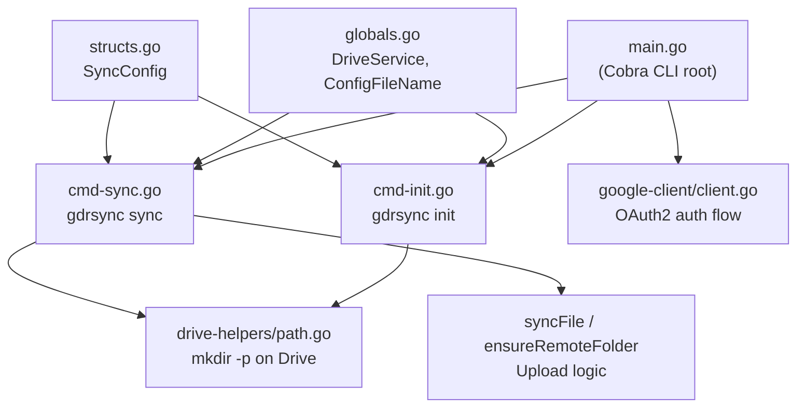

# Drive-Rsync — Codebase Analysis & Next Steps

## Project Overview

A Go CLI tool (`gdrsync`) that synchronizes local directories with Google Drive, using the Google Drive API v3. The project is in an **early-stage prototype** — core authentication and one-way upload sync are functional, but most of the features described in the requirements are not yet implemented.

---

## Current Architecture



### File-by-File Breakdown

| File | Lines | Purpose | Status |
|------|-------|---------|--------|
| [main.go](file:///home/erancihan/w/github.com/erancihan/erancihan/playground/go/drive-rsync/main.go) | 82 | Cobra root command, OAuth2 setup, registers `init` and `sync` subcommands | ✅ Working |
| [globals.go](file:///home/erancihan/w/github.com/erancihan/erancihan/playground/go/drive-rsync/internal/application/globals.go) | 8 | Global `DriveService` var, config file name constant (`.gdrsync.json`) | ✅ Working |
| [structs.go](file:///home/erancihan/w/github.com/erancihan/erancihan/playground/go/drive-rsync/internal/application/structs.go) | 10 | `SyncConfig` struct — stores remote folder ID, path name, last sync time | ⚠️ Minimal |
| [cmd-init.go](file:///home/erancihan/w/github.com/erancihan/erancihan/playground/go/drive-rsync/internal/application/cmd-init.go) | 42 | `gdrsync init <path>` — creates remote folder path and writes `.gdrsync.json` | ✅ Working |
| [cmd-sync.go](file:///home/erancihan/w/github.com/erancihan/erancihan/playground/go/drive-rsync/internal/application/cmd-sync.go) | 191 | `gdrsync sync` — walks local dir, creates remote folders, uploads/updates files using MD5 comparison | ⚠️ Upload only |
| [path.go](file:///home/erancihan/w/github.com/erancihan/erancihan/playground/go/drive-rsync/internal/drive-helpers/path.go) | 87 | `GetOrCreatePath` — `mkdir -p` equivalent on Google Drive | ✅ Working |
| [client.go](file:///home/erancihan/w/github.com/erancihan/erancihan/playground/go/drive-rsync/internal/google-client/client.go) | 134 | OAuth2 flow with local HTTP callback server + cross-platform browser open | ✅ Working |

### What Works Today

1. **Google OAuth2 Authentication** — full flow with local callback server, token caching, cross-platform browser open
2. **`init` command** — creates a nested folder path on Drive (`mkdir -p` style), writes `.gdrsync.json`
3. **`sync` command** — one-way **upload** only:
   - Recursively walks the local directory
   - Creates missing folders on Drive
   - Skips unchanged files (MD5 comparison)
   - Uploads new files, updates changed files
   - Skips hidden files and the config file itself
4. **Subfolder support** — path-based folder creation on Drive (e.g., `butler/testsync`)

---

## Gap Analysis: Requirements vs. Implementation

### ❌ Not Implemented

| # | Requirement | Notes |
|---|-------------|-------|
| 1 | **Background daemon mode** | Currently runs as a one-shot CLI command, no daemon/service |
| 2 | **Bidirectional sync** | Only upload (local→remote). No download (remote→local) |
| 3 | **Sync direction detection** | `LastSync` is stored but not used to determine upload vs download |
| 4 | **`.grsync` dotfile (database)** | Currently uses `.gdrsync.json` with minimal fields. Missing: file/folder tracking, per-file timestamps, hashes, remote IDs |
| 5 | **`.grsyncignore` file support** | No ignore mechanism at all (only skips hidden `.*` files) |
| 6 | **Default auto-generated folder ignore** | `node_modules`, `__pycache__`, `.git`, etc. not filtered |
| 7 | **`.grsynclock` mutex lock** | No locking mechanism; concurrent runs could corrupt state |
| 8 | **Configurable data directory** | Hardcoded `secrets/` path; no `~/.gdrsync/` dot folder |
| 9 | **Charmbracelet TUI** | No TUI at all; plain `fmt.Println` output |
| 10 | **Cross-platform testing** | No tests exist at all |
| 11 | **Remote file deletion tracking** | Deletions not tracked or synced in either direction |
| 12 | **Conflict resolution** | No strategy for files changed on both sides |
| 13 | **Error handling** | Minimal; many errors silently ignored (e.g., `json.Unmarshal` result) |

### ⚠️ Partially Implemented

| # | Feature | Current State | What's Missing |
|---|---------|---------------|----------------|
| 1 | Config file name | `.gdrsync.json` | Should be `.grsync` per spec |
| 2 | Config file location | In the synced folder root | Should also track file-level metadata |
| 3 | Subfolder structure on Drive | ✅ `GetOrCreatePath` works | Needs integration with download path |
| 4 | Credentials path | Configurable via `--credentials` flag | Should default to `~/.gdrsync/credentials.json` |

---

## Recommended Next Steps (Priority Order)

### Phase 1: Foundation & Configuration
> Get the fundamentals right before adding features.

- [ ] **1.1 — Rename config file** from `.gdrsync.json` → `.grsync`
- [ ] **1.2 — Create app data directory** (`~/.gdrsync/` by default, project dir in dev mode)
  - Store credentials, tokens, and app-level config here
  - Make path configurable via env var or flag
- [ ] **1.3 — Enhance `.grsync` dotfile schema** to act as a local database:
  ```json
  {
    "remote_folder_id": "...",
    "remote_path_name": "...",
    "last_sync": "...",
    "files": {
      "relative/path/to/file.txt": {
        "remote_id": "...",
        "local_hash": "...",
        "remote_hash": "...",
        "local_modified": "...",
        "remote_modified": "...",
        "size": 1234
      }
    }
  }
  ```
- [ ] **1.4 — Proper error handling** throughout (no ignored errors)

### Phase 2: Ignore System
- [ ] **2.1 — Implement default ignore list** (`node_modules`, `__pycache__`, `.git`, `.DS_Store`, `vendor`, `dist`, `build`, `target`, etc.)
- [ ] **2.2 — Implement `.grsyncignore`** parser (gitignore-style pattern matching)
- [ ] **2.3 — Override logic**: if `.grsyncignore` exists, replace default rules

### Phase 3: Bidirectional Sync
- [ ] **3.1 — Download logic** — fetch files from Drive to local
- [ ] **3.2 — Sync direction detection** — compare `LastSync` with local/remote `modifiedTime`
- [ ] **3.3 — Conflict detection** — flag files modified on both sides since last sync
- [ ] **3.4 — Deletion tracking** — detect and propagate deletions both ways

### Phase 4: Locking & Safety
- [ ] **4.1 — Implement `.grsynclock`** — create lock file at sync start, remove on completion
- [ ] **4.2 — Stale lock detection** — handle crashes (timestamp-based expiry or PID check)
- [ ] **4.3 — Graceful signal handling** — clean up lock on `SIGINT`/`SIGTERM`

### Phase 5: Background Daemon
- [ ] **5.1 — Watch mode / polling loop** — periodically trigger sync
- [ ] **5.2 — File system watcher** (fsnotify) for real-time change detection
- [ ] **5.3 — System service integration** (systemd, launchd, Windows service)

### Phase 6: TUI with Charmbracelet
- [ ] **6.1 — Add Bubble Tea** for interactive terminal UI
- [ ] **6.2 — Status dashboard** — show sync progress, file counts, errors
- [ ] **6.3 — Interactive init** — folder selection, Drive path browser
- [ ] **6.4 — Log viewer** — scrollable sync history

### Phase 7: Testing & Quality
- [ ] **7.1 — Unit tests** for core logic (hash, ignore patterns, config parsing)
- [ ] **7.2 — Integration tests** with mock Drive API
- [ ] **7.3 — Cross-platform CI** (GitHub Actions for Linux, macOS, Windows)

---

## Bonus: Possible Future Features

| Feature | Description |
|---------|-------------|
| **🔄 Selective sync** | Choose specific subfolders to sync instead of the entire tree |
| **📊 Bandwidth throttling** | Limit upload/download speed to avoid saturating the network |
| **🗜️ Compression** | Compress files before upload for faster transfer |
| **🔐 Encryption** | Encrypt files before uploading to Drive (at-rest encryption) |
| **📝 Sync log / audit trail** | Persistent log of all sync operations with timestamps |
| **🔔 Desktop notifications** | Notify on sync completion, conflicts, or errors |
| **🌐 Multi-account support** | Sync to multiple Google accounts simultaneously |
| **📂 Shared Drive support** | Support Team Drives / Shared Drives in addition to My Drive |
| **⏱️ Scheduled sync** | Cron-like scheduling (e.g., sync every 15 minutes) |
| **📋 Dry-run mode** | Show what would happen without actually syncing |
| **↩️ Rollback / versioning** | Leverage Drive's version history for rollback |
| **🧩 Plugin system** | Hooks for pre/post-sync actions (e.g., run a build before sync) |
| **📱 Web dashboard** | Optional local web UI for monitoring sync status |
| **🔗 Symlink handling** | Decide whether to follow or skip symbolic links |
| **📦 Large file chunked upload** | Resumable uploads for files > 5MB |
| **🏷️ Google Drive labels/properties** | Tag synced files with metadata for easy identification |
| **⚡ Parallel uploads** | Upload multiple files concurrently with a worker pool |
| **🧹 Orphan cleanup** | Detect and optionally remove remote files not present locally |

---

## Code Quality Observations

> [!WARNING]
> Several issues should be addressed before adding new features:

1. **Global mutable state** — `DriveService` and `folderCache` are package globals. Consider dependency injection
2. **No tests** — zero test coverage makes refactoring risky
3. **Silent error swallowing** — `json.Unmarshal(data, &config)` return value ignored in sync command
4. **Hardcoded paths** — `secrets/credentials.json` default is dev-only
5. **No logging framework** — mix of `fmt.Println` and `log.Fatalf`; should use structured logging (e.g., `slog`, `zerolog`)
6. **HTTP handler leak** — `getTokenFromWeb` uses `http.HandleFunc` on the default mux, which persists for the process lifetime
7. **No pagination** — Drive API `Files.List()` calls don't handle pagination (will miss results beyond the default page size)
