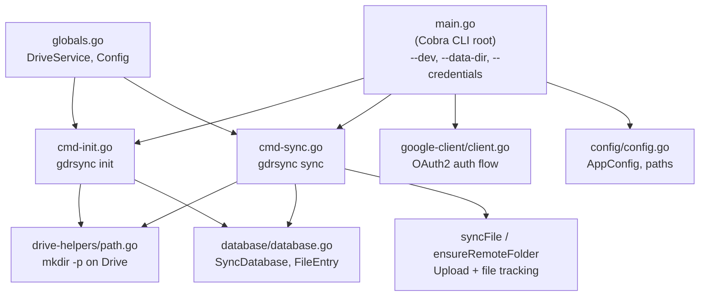

# Drive-Rsync — Codebase Analysis & Next Steps

## Project Overview

A Go CLI tool (`gdrsync`) that synchronizes local directories with Google Drive, using the Google Drive API v3. **Phase 1 (Foundation & Configuration) is complete** — the project now has proper config management, a file-tracking database, and robust error handling.

---

## Current Architecture

### File Breakdown

| File | Purpose | Status |
|------|---------|--------|
| [main.go](file:///home/erancihan/w/github.com/erancihan/erancihan/playground/go/drive-rsync/main.go) | Cobra root, OAuth2, `--dev`/`--data-dir`/`--credentials` flags | ✅ |
| [config.go](file:///home/erancihan/w/github.com/erancihan/erancihan/playground/go/drive-rsync/internal/config/config.go) | `AppConfig` — data dir, credentials/token paths, dev mode | ✅ |
| [database.go](file:///home/erancihan/w/github.com/erancihan/erancihan/playground/go/drive-rsync/internal/database/database.go) | `SyncDatabase` + `FileEntry` — per-file tracking, atomic save | ✅ |
| [globals.go](file:///home/erancihan/w/github.com/erancihan/erancihan/playground/go/drive-rsync/internal/application/globals.go) | Global `DriveService` + `Config` | ✅ |
| [cmd-init.go](file:///home/erancihan/w/github.com/erancihan/erancihan/playground/go/drive-rsync/internal/application/cmd-init.go) | `gdrsync init <path>` — creates remote folder, writes `.grsync` | ✅ |
| [cmd-sync.go](file:///home/erancihan/w/github.com/erancihan/erancihan/playground/go/drive-rsync/internal/application/cmd-sync.go) | Upload sync with MD5 dedup + database tracking | ✅ |
| [path.go](file:///home/erancihan/w/github.com/erancihan/erancihan/playground/go/drive-rsync/internal/drive-helpers/path.go) | `GetOrCreatePath` — `mkdir -p` on Drive | ✅ |
| [client.go](file:///home/erancihan/w/github.com/erancihan/erancihan/playground/go/drive-rsync/internal/google-client/client.go) | OAuth2 flow, dedicated ServeMux, cross-platform browser | ✅ |

### Test Coverage

- `config_test.go` — 5 tests (default dir, dev mode, custom dir, production, EnsureDataDir)
- `database_test.go` — 10 tests (save/load, track/remove, atomic save, corrupt file, etc.)

---

## Roadmap

### ✅ Phase 1: Foundation & Configuration — COMPLETE
- [x] Config file renamed `.gdrsync.json` → `.grsync`
- [x] App data dir `~/.gdrsync/` with `--dev` / `--data-dir` flags
- [x] Enhanced `.grsync` schema with per-file tracking (`FileEntry`)
- [x] Proper error handling throughout (`RunE`, wrapped errors)

### Phase 2: Ignore System
- [ ] **2.1** — Default ignore list (`node_modules`, `__pycache__`, `.git`, etc.)
- [ ] **2.2** — `.grsyncignore` parser (gitignore-style patterns)
- [ ] **2.3** — Override logic: `.grsyncignore` replaces defaults

### Phase 3: Bidirectional Sync
- [ ] **3.1** — Download logic (remote → local)
- [ ] **3.2** — Sync direction detection via timestamps
- [ ] **3.3** — Conflict detection
- [ ] **3.4** — Deletion tracking

### Phase 4: Locking & Safety
- [ ] **4.1** — `.grsynclock` mutex file
- [ ] **4.2** — Stale lock detection
- [ ] **4.3** — Graceful signal handling

### Phase 5–7: Daemon, TUI, Testing (future)

---

## Bonus: Possible Future Features

| Feature | Description |
|---------|-------------|
| 🔄 Selective sync | Choose specific subfolders |
| 📊 Bandwidth throttling | Limit transfer speed |
| 🔐 Encryption | Encrypt before upload |
| 📋 Dry-run mode | Preview without syncing |
| ⚡ Parallel uploads | Worker pool concurrency |
| 📦 Chunked upload | Resumable uploads > 5MB |
| 🧹 Orphan cleanup | Remove stale remote files |

---

## Remaining Code Quality Items

> [!NOTE]
> Items 2–4, 6 from the original list were fixed in Phase 1.

1. **Global mutable state** — `DriveService`/`folderCache` are globals; consider DI later
2. **No logging framework** — should use `slog` or `zerolog`
3. **No Drive API pagination** — `Files.List()` may miss results beyond default page size
