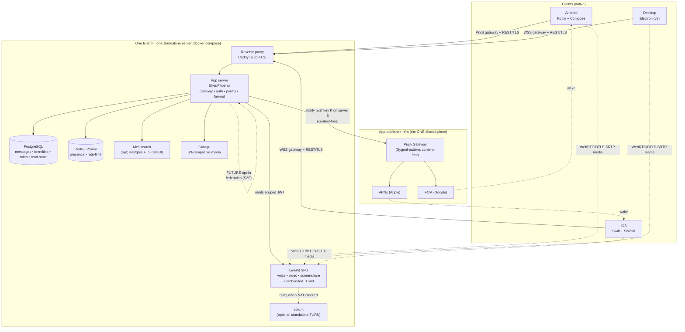

# Archipelago — Master Planning Document

*A self-hosted, privacy-respecting chat + voice platform that replaces both Discord and TeamSpeak. Working codename "Archipelago" (provisional) — it captures the one idea everything else hangs off: a sea of independent islands, each fully standalone.*

*Status: v1 architecture plan. Lead architect draft. Every recommendation below is a decision, not a menu — alternatives are recorded so we know what we chose against.*

---

## 1. Executive summary

We are building a **self-hostable communications server plus first-class native mobile clients** that together replace **Discord** (communities, text channels, roles, threads, reactions, bots, rich messaging) **and TeamSpeak** (low-latency, always-on group voice) in a single product. You run a server; people connect to it by address (`host:port`), exactly like joining an IRC network, a Mumble server, or a TeamSpeak instance.

**The locked decisions (these do not re-open in v1):**

| # | Decision | Rationale in one line |
|---|----------|----------------------|
| 1 | **Topology = isolated islands.** Each server is fully standalone. No central service, no global account, no federation in v1. Separate identity per server. | It is the product's spine; it is also the natural state of a standalone server, so we fight nothing to get it. |
| 2 | **Voice AND text both ship in v1.** | We replace TeamSpeak and Discord at once or we replace neither. |
| 3 | **Privacy model = TLS in transit + DTLS-SRTP for voice + trust-the-host.** The operator (usually the user) can read data at rest. No E2EE in v1. | Honest, coherent, and strictly better than Discord for most users. E2EE breaks search, bots, moderation, and good push UX — documented as a later, opt-in layer. |
| 4 | **Native mobile is a hard requirement:** Kotlin + Jetpack Compose (Android), Swift + SwiftUI (iOS). No React Native, no Flutter for the primary clients. | The user disliked Element/Matrix mobile UX and wants a genuinely native feel. |
| 5 | **Build the text/community layer; adopt mature OSS for the hard infrastructure.** Foremost: **adopt LiveKit** (Apache-2.0 WebRTC SFU) for voice/video/screen-share — do not build media plumbing. | Reinventing an SFU is a multi-quarter trap; reinventing the islands/identity model is a weekend's schema design. Spend effort where it differentiates. |
| 6 | **Server runtime = Elixir/Phoenix** (Channels + Presence + PubSub). Go is the sanctioned fallback. | Presence, fan-out, and multi-device broadcast — the three hardest realtime problems — come for free on a single node with no Redis. |
| 7 | **Mobile shared core = Kotlin Multiplatform (KMP)**, native UI per platform. Rust/UniFFI is the documented alternative if we commit to early E2EE. | Write the bug-prone logic (reconnect, sync, account registry) once; keep every pixel native. |

**What this is NOT:** it is not Matrix (no federation-first design, no portable global `@user:server` identity, no AGPL homeserver baggage). It is not a fork of Discord-alternative platforms (all ship non-native mobile and bend the wrong way for islands). It is not E2EE-by-default (that fights v1's own must-have features).

**The one honest asterisk:** *background push cannot be fully self-hosted on stock mobile.* Waking a killed iOS app requires Apple's APNs; reliable Android background delivery effectively requires Google's FCM. Both bind credentials to the **app**, not the server. So the app publisher (us) must run one small, stateless, content-free push gateway — the single "central-ish" component in an otherwise decentralized system. Section 11 confronts this directly.

---

## 2. Vision & non-negotiable principles

1. **Islands, not a network.** A server is a world unto itself. There is no directory, no shared login, no cross-server anything in v1. Joining is `connect(host, port) → authenticate → you exist here and nowhere else.` This is the IRC/TeamSpeak/Mumble/SSH mental model.
2. **The operator is the trust anchor.** Usually the operator *is* the user or someone they chose. Data at rest is readable by the host. We protect the wire (TLS/DTLS-SRTP) and cold storage (full-disk encryption), harden secrets, and minimize metadata — but we never pretend the host can't read messages. We say so in plain language at join time.
3. **Native feel is sacred.** The reason this project exists is that Element-class cross-platform mobile UX felt wrong. Every client decision is subordinate to "does this feel like a first-class native app?"
4. **Assemble, don't reinvent — except the core product.** Voice (LiveKit), storage (Garage), search (Meilisearch), TLS (Caddy), TURN (coturn), auth primitives (libsodium, optionally Ory Kratos), push relay (Sygnal-pattern) are adopted. The community/text domain, the gateway protocol, the permission model, and the two native clients are ours.
5. **Self-hosting must be humane.** The target operator is a hobbyist with a VPS or a home box, not an SRE. The deployment unit is a curated `docker compose up`, not a pile of manuals.
6. **Leave clean seams, promise nothing early.** Design the identity namespace as server-scoped, route all cross-node traffic through PubSub, and keep message storage abstracted — so a *future opt-in* federation layer and *future opt-in* E2EE can attach without a rewrite. We build neither in v1, and we do not imply we have.

**Anti-goals:** federation-in-v1, a global account, E2EE-in-v1, cross-platform UI toolkits for mobile, chasing Discord-planet scale (an island is tens to low-thousands of concurrent users), and any hard dependency on a third-party SaaS for a core feature.

---

## 3. Product scope

### 3.1 The Discord half (communities & rich messaging)

**In v1:**
- Servers/communities (each = one island), channels, categories.
- Text messaging with edits, deletes, pins, replies, and **threads** (basic).
- **DMs and group DMs**, scoped to a single server (no cross-server DMs — there is no cross-server identity).
- **Roles & granular per-channel permission overrides** (Discord-style allow/deny/override calculus).
- Reactions + **custom (server-uploaded) emoji**.
- Mentions (`@user`, `@role`, `@everyone`) with per-user/per-channel notification preferences.
- Presence (online/idle/DND), typing indicators, read/unread state across devices.
- File/image/audio/video **uploads with server-side transcoding + thumbnails**, EXIF stripped by default.
- **Full-text search** over messages, users, channels (permission-filtered at query time).
- **Invites** (expiring/limited-use codes) and **moderation**: kick/ban/mute/timeout, an append-only audit log, and rate-limiting.
- Localization scaffolding and baseline accessibility from day one.

**In v2:**
- **Bots, webhooks, slash commands, and a scoped bot API** (a subset of the real API with bot tokens + permission scopes). This is a major community-growth lever (Discord's ecosystem lesson) but needs the core API to stabilize first.
- Rich embeds / link unfurling (SSRF-hardened, operator-toggleable).
- Stickers and a GIF picker (see the Tenor note in §14).
- Custom statuses; deeper moderation tooling.

### 3.2 The TeamSpeak half (real-time voice)

**In v1:**
- **Persistent, always-on voice channels** (the TeamSpeak "lounge" model), low-latency, self-hosted.
- **Video and screen-share** on the same media path.
- **Push-to-talk** (client-side) and open-mic / voice-activity modes; "who's speaking" indicators.
- Server-side mute/deafen that propagates to the media layer (a moderator timeout kills the offender's audio track at the SFU, not just in the UI).

**In v2+:** optional server-side voice recording (LiveKit Egress), positional/spatial audio niceties.

### 3.3 Deliberately OUT of scope for v1

| Excluded | Why | Where it hooks in later |
|----------|-----|--------------------------|
| **Federation / server-to-server** | Contradicts islands; adds enormous complexity (Matrix's whole burden). | Server-scoped ID namespace + PubSub message router are designed now so a future opt-in S2S module attaches without a schema break (§10, §15). |
| **E2EE (content the host can't read)** | Breaks server-side search, bots, moderation, and rich push — all v1 must-haves. Also fights the trust-the-host model. | DM-first double-ratchet or MLS 1:1, then MLS (RFC 9420) groups. Keep message storage abstracted (§12). |
| **Central / global account** | The core anti-vision. | A future portable-identity concept could reuse the per-server keypair (§10); not assumed. |
| **Media E2EE for voice** | SFU must see plaintext to route; Insertable Streams/SFrame is hard and fights recording/moderation. | Documented future; DTLS-SRTP covers hop encryption in v1 (§7, §12). |

---

## 4. THE BIG DECISION — Foundation: build vs. adopt

This is the centerpiece. Everything downstream (identity, mobile, deployment) follows from it.

### 4.1 The core tension, stated once

No single existing protocol or platform natively delivers **all three** of the vision's hardest constraints simultaneously:

1. **Isolated islands / per-server identity / no central account / no federation.**
2. **Low-latency group voice AND rich text, both in v1.**
3. **First-class native Kotlin/Compose + Swift/SwiftUI mobile.**

Different projects satisfy different pairs; none satisfies the triple. Two structural facts settle the debate:

- **Voice is a separate hard subsystem in *every* option.** No text protocol — custom, IRCv3, XMPP, or Matrix — ships production group voice. Every real system (including Discord itself, and Matrix's own Element Call) pairs a text/gateway layer with a **dedicated WebRTC SFU**. Matrix's "voice" is literally LiveKit + a JWT shim (`lk-jwt-service`). So voice is a constant across all foundation choices; it does not discriminate between them. **We will adopt LiveKit regardless.** That removes voice from the foundation debate entirely.
- **Given that, the foundation question collapses to: "which text/community layer best fits isolated islands + native mobile, with the least reinvention?"**

### 4.2 The candidates, compared

| Foundation | Islands / per-server identity fit | Voice | Native mobile story | Rich Discord-grade messaging | License | Verdict |
|---|---|---|---|---|---|---|
| **Purpose-built protocol + server** (+ LiveKit) | **Native — it's the default state** of a standalone server | Adopt LiveKit | We write both clients against our own clean WS+REST protocol (best fit-to-UI) | We define exactly what exists | Ours (any) | **RECOMMENDED** |
| **XMPP** (Prosody MIT / ejabberd GPL-2.0) | **Excellent** — JIDs are `user@server`, federation opt-in/disable-able | Jingle is 1:1 only; group voice ⇒ external SFU/focus agent (bridge to LiveKit/Jitsi) anyway | Real, proven: Smack (Apache-2.0) + XMPPFramework (BSD); Conversations shows polish | Off-the-shelf via XEPs (MUC, MAM, push, HTTP-upload) but a curation/version-matrix grind; MIX still not universal | MIT / GPL-2.0 | **Strong runner-up** — the best "don't reinvent" path |
| **Matrix** (Synapse/Dendrite AGPL; continuwuity/tuwunel Apache) | **Poor as a base** — federation- and `@user:server`-identity-centric by design; "islands" means fighting the grain (empty federation allowlist) | Element Call = LiveKit + `lk-jwt-service` (same SFU work) | **Best-in-class**: Element X is genuinely native (Kotlin/Compose + SwiftUI) — *study it* | Richest already-spec'd (rooms, threads, spaces, E2EE) | AGPL-3.0 homeservers (real product consideration) | **Reference only** — the anti-vision on identity |
| **IRCv3** (Ergo, MIT) | **Excellent topology** — "join a server, get a local nick" is literally IRC | None | No modern native SDK comparable to the above | Thin: weak media/threads/reactions; history via maturing `chathistory` | MIT | **Steal the wire ideas, not the whole thing** |
| **Fork Revolt/Stoat** (AGPL-3.0) | **Best of the fork candidates** — genuinely standalone, no central account, Rust API + LiveKit voice | Has it (LiveKit) | React Native — **fails the hard requirement** (we'd rewrite clients anyway) | Yes (Discord-shaped) | AGPL-3.0 | Adopt-as-backend only if greenfield feels too costly; still write native clients |
| **Fork Rocket.Chat / Mattermost** | Fine (single-server) | Bolt-on / meeting-oriented, not TeamSpeak-grade | React Native | Mature, but **open-core walls** SSO/roles/HA | MIT-core + source-available EE | No — wrong product shape, license walls, non-native mobile |
| **Fork Mumble** (BSD) | **Perfect** topology + **gold-standard voice** | **The** voice reference | Community mobile clients, not first-class | **~Zero** rich text/community | BSD | Learn from its audio pipeline; can't carry the Discord half |
| **Nostr / SimpleX / Tox / Jami** | **Wrong topology** — global-keypair or no-identity or serverless P2P | Varies | Bespoke | No community/roles model | Varies | Not foundations |

### 4.3 Ranked recommendation

**1st — BUILD a purpose-built protocol + server for the text/community layer, with LiveKit as the voice SFU.**

This is the Discord architecture: a persistent WebSocket "gateway" for real-time events + REST for history/uploads + a separate WebRTC SFU for media. The reasoning, tied point-by-point to the vision:

- **Islands and per-server identity are the *default*, not a fight.** One server process = one community; accounts are local rows; clients join by `host:port`. There is no framework pushing back toward federation or a global account.
- **The wire format is ours to tune for native mobile** — a compact JSON/MessagePack (later Protobuf) protocol over one long-lived socket maps cleanly to Kotlin/Swift models. This directly answers the "Element felt wrong" complaint at the protocol level.
- **Federation is a clean future add-on**, not something to rip out: a standalone server gains an opt-in S2S module later without reworking identity.
- **Voice is a solved integration, not a research project.** We embed LiveKit and mint scoped room tokens; the SFU never has its own account system — perfect for islands.

**The cost is real and we accept it eyes-open:** we own the spec, versioning, auth, moderation, history/sync/read-state, presence, reconnect/resume, rate-limiting, abuse handling, and (in v2) a bot API. This is the long tail that consumes years elsewhere. We mitigate it by (a) choosing Elixir/Phoenix, which hands us presence + fan-out + multi-device broadcast nearly for free (§6), and (b) stealing shamelessly from the runners-up (below).

**2nd — XMPP on Prosody.** If, at the last responsible moment, the team decides that owning a bespoke protocol is too much for a small crew, Prosody is the fallback that best preserves the vision: per-server JIDs = per-server identity by construction, federation is a toggle we leave off, and native mobile has *proven* libraries (Smack, XMPPFramework). The costs are the XEP version-matrix grind, an XML wire format heavier than we'd design today, and the fact that group voice still means bridging to an SFU — i.e., the same LiveKit work. We rank it second, not first, because "curate 15 XEPs to Discord-grade UX" is comparable effort to "design a focused protocol," and a focused protocol yields the native mobile ergonomics the vision prizes most.

**Reference, not base — Matrix.** We will **study Element X and `matrix-rust-sdk`** as the gold standard of native-feeling mobile chat, and **copy the MatrixRTC pattern verbatim** (SFU + a tiny JWT authorization service). We will not inherit Matrix's federation-first, portable-identity model or its AGPL homeservers.

### 4.4 What to steal from the runners-up

- **From IRCv3:** the capability-negotiation and **message-tagging** model — message-ids, `server-time`, labeled-response, and a `chathistory`-style backfill command. This is the best wire-format inspiration for our gateway.
- **From Matrix:** the **`lk-jwt-service` token-broker pattern** for voice (our app server mints scoped LiveKit tokens), the **read-receipts / spaces / threads** data-model shapes, and Element X's client architecture. Also: how to *later* layer E2EE (their Olm/Megolm pain teaches us the multi-device/key-backup cost we're deferring).
- **From XMPP:** **MAM-style message archive** semantics and **XEP-0357-style push** design (content-free wake, client pulls) — we adopt the push shape even though we don't adopt XMPP.
- **From Mumble:** the **low-latency Opus pipeline, jitter-buffer tuning, and per-server certificate identity** — informs both our voice defaults (LiveKit lets us tune these) and our TOFU keypair identity (§10).
- **From Revolt/Stoat:** its permission model and standalone data-model are the closest existing analog — a reference schema to sanity-check ours against.

---

## 5. High-level architecture



**Reading the diagram:** the **app server is the sole authority** for identity, permissions, and history. It authenticates the per-island identity, checks channel permissions, and **mints short-lived LiveKit tokens**; the client's media then flows **directly to the SFU over WebRTC** (the app server is not in the media path). The **push gateway is the only component shared across islands**, and it only ever forwards a content-free "wake" — never message text (§11). The **dotted federation loop** is the documented future seam, absent in v1.

---

## 6. Server architecture & the self-hosting deployment story

### 6.1 Runtime: Elixir/Phoenix (Go is the sanctioned fallback)

The app server's real job is: auth + per-server identity, channel/message persistence, presence, fan-out, read-state/multi-device sync, and minting voice tokens. Phoenix nails the hardest three:

- **Phoenix Channels** (WebSocket) are our client gateway transport for text and control/signaling.
- **Phoenix Presence** is CRDT-based and needs no central store — it gives online/typing state with zero extra infrastructure, and its conflict-free design *philosophically matches islands* and eases a future clustering story.
- **Phoenix.PubSub** does message fan-out in-process on a single node — **no Redis required** for the base case.

The BEAM's cheap per-connection concurrency and fault isolation (one crashing socket doesn't touch others) are ideal for an unattended self-host. The classic objection — "no single static binary" — **evaporates** because the real deployment unit is a Docker Compose bundle anyway (below); `mix release` ships a self-contained runtime tree in the image.

**Choose Go instead** if the core team lacks BEAM experience or targets sub-128 MB VPS boxes. Go gives a tiny static binary and the same language as LiveKit/coturn, but you hand-build presence/typing/fan-out and add **Valkey** (BSD; the Redis fork after the 2024 relicense) or **NATS** for pub/sub. Everything else in the stack is unchanged. **Rust (Axum/Tokio) is not recommended for the app server** — its performance ceiling is irrelevant at island scale and its build-out cost is highest; reserve Rust for components (Garage, Meilisearch are already Rust) or the *mobile core* if we go that route (§8).

### 6.2 Data & transport choices

- **PostgreSQL is the single source of truth**: messages (partitioned by channel, monotonic snowflake IDs for stable pagination), per-server identities, roles, invites, and **per-user/per-channel read markers** for multi-device sync. Multi-device is a *solved, server-authoritative problem* here precisely because there is a normal per-server account and no E2EE in v1. **Scylla/Cassandra is explicitly out** — that's Discord-planet scale; a single island never needs it (documented only as a far-future escape hatch).
- **Search default = PostgreSQL full-text (GIN/tsvector)** — zero extra service, transactionally consistent, adequate at island scale. **Meilisearch (MIT, disk-based)** is the opt-in upgrade for larger islands wanting typo-tolerant instant search; prefer it over Typesense (GPL-3, RAM-bound, no sharding). Either way, **search results are permission-filtered at query time** by the user's visible channels.
- **Object storage = Garage** (S3-compatible, Rust, tiny footprint ~50 MB, single binary) as the default; **SeaweedFS** (Apache-2.0) when scale is expected; plain filesystem behind the same S3 abstraction for the smallest installs. **Do NOT default to MinIO** — its CE admin console was stripped in 2025 and the repo was marked unmaintained (Feb 2026) then archived (April 2026). Code to the S3 API so any backend is swappable.
- **Transport = WebSocket** for text + control/signaling. It traverses reverse proxies/NAT/corporate firewalls, is trivially supported by mobile HTTP stacks, and is what both Phoenix Channels and LiveKit signaling already use. Framing: JSON/MessagePack now, Protobuf later if needed. The client protocol must include a **resume/replay** step so a dropped mobile socket doesn't lose messages.

### 6.3 The deployment unit: a curated Docker Compose bundle

Because voice (LiveKit) + TURN + Postgres + a TLS-terminating reverse proxy are all required regardless of app language, the **romantic "single binary" is a dead end** as the actual product. The honest deliverable is:

```
docker compose up -d
```

...bringing up: `phoenix-app` + `postgres` + `livekit` + `caddy` (automatic Let's Encrypt TLS) + `garage` + optional `coturn` + optional `meilisearch`.

- **TLS: Caddy** (Apache-2.0) for one-line automatic HTTPS for operators with a domain. Traefik (MIT) documented as the Docker-native alternative; nginx+Certbot for those who insist. For bare-IP/LAN/self-signed operators, TOFU pinning in the app covers the gap (§12).
- **Upgrades:** image-tag based; **Ecto migrations run automatically on container boot**.
- **Backups:** a bundled **nightly `pg_dump` + object-store snapshot**, encrypted with **age**, using **restic/BorgBackup**, with a **documented, tested restore** and a short DR runbook. (The most likely real-world breach is a leaked unencrypted backup, not a wire attack — so this is a first-class deliverable, not an afterthought.)
- **The fiddly part, called out honestly:** LiveKit's UDP port range + TURN/TLS is where novice self-hosters get stuck. The bundle ships sane firewall/port defaults, uses LiveKit's **embedded TURN on 5349** by default (so coturn is optional), and documents TURN-over-TLS on 443 for restrictive networks.

---

## 7. Real-time voice/video stack

**Decision: WebRTC + LiveKit SFU + coturn, Opus audio, app server as token authority.** Not a raw/custom UDP protocol.

### 7.1 Why WebRTC + an SFU, and why LiveKit specifically

- **WebRTC gives us, for free:** Opus (the codec Discord/Mumble/TeamSpeak-class apps use, mandatory-to-implement per RFC 7874), **mandatory DTLS-SRTP encryption** (RFC 8827 — no unencrypted mode), congestion control, NAT traversal (ICE/STUN/TURN), and echo-cancel/noise-suppression on device. A raw-UDP/Opus design (the Mumble model) can shave latency but forces us to hand-roll all of the above **and** two native audio+network stacks — a bad trade against a native-mobile-first, screen-share-in-v1 vision.
- **Topology = SFU, not mesh or MCU.** Mesh dies past ~4 peers and murders mobile battery/uplink; MCU (server mixing) is CPU-heavy and adds latency. An SFU just forwards selected streams. Audio-only Opus is ~20–40 kbps/stream, so **one modest VPS comfortably carries dozens of concurrent voice participants**.
- **LiveKit (Apache-2.0, Go/Pion) wins on the decisive axis: first-class native Swift and Kotlin SDKs** that connect to a self-hosted server. That single fact means voice/video/screen-share on both mandated platforms is *SDK integration, not from-scratch WebRTC*. It also ships **simulcast/dynacast**, an **embedded TURN**, and a **JWT room-token model** that keeps identity in our app server and out of the SFU.

**Rejected alternatives:** mediasoup (ISC) — top control but no official native mobile SDKs and you build all signaling; Janus (GPLv3) — copyleft hazard for a distributed product, no native SDKs; ion-sfu (MIT) — dormant since 2021; Galène (**MIT**, note: *not* AGPL — a common misconception) — lovely and tiny but web-first with no native SDKs; Jitsi Videobridge (Apache-2.0) — heavy JVM, its mobile story is a whole app, not a lean client lib.

### 7.2 Signaling, tokens, and the isolated-islands fit

The **app server is the sole identity/permission authority**. Flow:

1. Client authenticates to the app server (per-island identity, §10).
2. App server checks the user's permission for the target voice channel.
3. App server mints a **short-lived, scoped LiveKit access token** (JWT signed with the LiveKit API key/secret, encoding room + grants).
4. Client's LiveKit SDK connects WebRTC directly to the SFU with that token.

The SFU holds **no accounts** — perfect for islands. This is exactly Matrix's `lk-jwt-service` pattern, stolen wholesale. **Future-federation seam:** because the app server already brokers tokens, a home server could later mint a *guest* token to a remote island's SFU — a clean hook we design toward but do not build.

### 7.3 Codecs, screen share, PTT, mobile specifics

- **Audio: Opus** with FEC + DTX (packet-loss resilience + silence suppression); **rnnoise** available for neural noise suppression.
- **Video + screen share ride the same SFU.** Simulcast lets weak clients pull a lower layer. **iOS screen share requires a ReplayKit Broadcast Upload Extension** + entitlements — budget explicit client work for it. Android screen share via the LiveKit SDK + MediaProjection.
- **Push-to-talk is purely client-side** (mute/unmute the local track — zero server change) with global hotkeys on desktop; on-screen control on mobile. Offer both PTT and VAD-gated open-mic, like TeamSpeak. Server-enforced "who may talk" (moderation) is a small signaling extension that disables a participant's publish grant.
- **NAT traversal: coturn (BSD)** is the fallback when LiveKit's embedded TURN isn't enough; run **TURN over TLS on 443** to punch through corporate/carrier firewalls (needs `CAP_NET_BIND_SERVICE` and a valid cert). **Sleeper cost to plan for:** symmetric-NAT peers relay *all* media through TURN, consuming operator egress — the self-hoster hits bandwidth limits before CPU limits.
- **Voice-media E2EE is out of v1.** DTLS-SRTP encrypts each hop; the SFU sees plaintext (it must, to route). True media E2EE (Insertable Streams/SFrame) is a documented future that conflicts with recording/moderation.

---

## 8. Native mobile clients & the code-sharing decision

**Decision: Kotlin Multiplatform (KMP) shared non-UI core + 100% native UI** — Jetpack Compose (Android), SwiftUI (iOS). This is strategy (b) of four evaluated.

### 8.1 The four strategies, decided

| Strategy | What's shared | Verdict |
|---|---|---|
| (a) Fully separate Kotlin + Swift | nothing | Best native purity, **worst** maintainability — doubles the most bug-prone code (reconnect, sync, account state). Rejected as primary. |
| **(b) KMP core + native UI** | protocol client, models, reconnect state machine, offline store, **multi-server/multi-identity account registry**, token/key abstractions | **RECOMMENDED.** Write the high-value bug-prone logic once; every pixel stays native. KMP is production-ready and Google-endorsed (Room/DataStore/ViewModel ship KMP). |
| (c) Rust core via UniFFI | same surface as (b), in Rust | **Documented alternative** — pick *only* if we commit to a bespoke binary protocol and early E2EE and have Rust skills. UniFFI is production-used (Firefox) but pre-1.0, async-across-FFI is the hard part, and CI/cross-compile is the heaviest. Its payoff: one audited crypto core for future MLS. |
| (d) Schema-only sharing | wire types | Shares the least valuable code, duplicates the most. Adopt the schema layer *under* (b), not as the strategy. |

### 8.2 What lives where

- **Shared KMP core:** Ktor (HTTP + WebSocket), **SQLDelight** as the single cross-platform typed-SQL store, kotlinx.coroutines, the account registry, offline/sync logic, and `expect/actual` wrappers over secure storage and push.
- **Native UI:** Compose + SwiftUI, no compromise. (Compose Multiplatform for iOS is Stable since 1.8.0 / May 2025, but using it would mean *not* SwiftUI — so it's deliberately excluded to honor the native-feel mandate.)
- **Voice stays native, not in the core.** LiveKit's SDKs are platform-native, so voice integration is per-platform regardless of code-sharing. **This narrows KMP's advantage** and must be budgeted: CallKit/AVAudioSession (iOS), ConnectionService/foreground service (Android), and the iOS broadcast extension are real work.

### 8.3 Secure storage & the multi-server/multi-identity UX

- **Keys/tokens live only in iOS Keychain (+ Secure Enclave for the P-256 device key) and Android Keystore/StrongBox** — never app-readable storage, never silent cloud sync. Use `kSecAttrAccessibleAfterFirstUnlock` on iOS (so a backgrounded/VoIP process can read while locked) and Keystore-wrapped keys on Android. Store **one credential set per (serverAddress, identity)** — there is no global secret.
- **Multi-identity UX = a mail-client / Mumble-favorites account list.** Each row = `{host:port, display identity, key reference}`. The user adds a server by address, picks or creates an identity there, and the app manages a local credential vault. Centralize all per-island reconnection and "which server am I sending to" logic **in the shared core** and test it hard — a bug that leaks one island's identity to another is catastrophic.
- **Connection lifecycle vs. OS constraints:** iOS kills background sockets — so text notifications go via APNs data pushes and incoming voice via **PushKit VoIP push → CallKit** (§11); Android uses a foreground service for active calls + FCM data messages to wake. Design each island to reconnect independently on foreground.

### 8.4 The `matrix-rust-sdk`/Element X lesson

Element X *is* genuinely native (element-x-android is ~99% Kotlin/Compose; element-x-ios is SwiftUI) — proof the native bar is reachable and a reference to study for UX, offline sync, and connection handling. We study it; we do not adopt Matrix.

---

## 9. Desktop client options & recommendation

**Decision: Electron for the v2 desktop client, with all real-time media routed through LiveKit's JS SDK.** Tauri is the documented alternative *iff* we choose the Rust mobile core.

### 9.1 Why Electron, given the KMP mobile core

The dominant desktop constraint is **reliable low-latency voice AND screen share on Windows, macOS, and Linux**. That single requirement reshuffles the usual "Tauri is lighter" ranking:

| Option | Voice + screenshare across all 3 OSes | Reuse with our stack | Verdict |
|---|---|---|---|
| **Electron** (MIT) | **Uniform, turnkey** — bundled Chromium gives full WebRTC + `desktopCapturer` window/screen picker; **LiveKit ships a JS SDK** | Reuses a web UI; no direct KMP reuse (protocol reimplemented in TS or via a web client) | **RECOMMENDED (v2)** |
| **Tauri v2** (MIT/Apache) | System webview has **real media gaps** — macOS WKWebView lacks `getDisplayMedia` (hard wall); Linux WebKitGTK has WebRTC only if custom-compiled; Windows WebView2 ≈ Chromium. Must run media natively via **LiveKit Rust SDK** | **Best reuse *iff* mobile core is Rust** | **Alternative** — only coherent with strategy (c) |
| Compose MP desktop | **Weakest** — no first-class desktop WebRTC; would force JxBrowser (paid) or a bespoke libwebrtc JNI binding; **LiveKit has no JVM/desktop SDK** | Great *iff* mobile is Compose-shared (it isn't) | Rejected for a voice-critical v1/v2 |
| Flutter desktop | `flutter_webrtc` has decent screen share but **no system-audio capture on Win/mac**; near-zero reuse with Kotlin/Swift | none | Rejected |
| Qt / native-per-OS | Native but no reuse; Qt's LGPL/commercial friction; native-per-OS triples effort | none | Rejected |

Because our mobile core is **KMP (not Rust)**, Tauri's headline advantage (share the Rust core across mobile + desktop) doesn't apply, and its media-gap engineering cost is real. **Electron is the risk-minimizing coherent choice**: it reuses a web frontend and the mature LiveKit JS SDK, and it makes the isolated-islands "connect by host:port" model a trivial connection dialog + per-server session store. We accept Electron's costs (≈150–250 MB installed, higher idle RAM, DIY `electron-updater` + code signing/notarization).

**If** the org later decides to adopt the Rust core (strategy c) for early E2EE, the coherent desktop flips to **Tauri + LiveKit Rust SDK** (media in the Rust layer, webview as UI only) — smaller footprint, full core reuse.

**Desktop is v2**, after mobile ships. Auto-update runs off a **self-hosted update feed we (the publisher) run** — note this does not violate islands: operators host the *server*; we host *client updates*, same as we host the push gateway.

---

## 10. Identity & auth without a central account

**Decision: a hybrid, keypair-primary, per-server identity.** Core = client-generated keypair with challenge-response; SCRAM password as low-friction fallback; OIDC as an operator toggle for orgs.

### 10.1 Two layers

**Layer 1 — how you prove you own an account on *one* server.** The strongest fit is a **client-generated keypair (SSH/CertFP style)**: on first join the app generates a keypair, the server stores **only the public key**, and login is a signed challenge-response (nonce → client signs → server verifies). Passwordless, phishing-proof, nothing replayable leaves the device, no server-side secret to steal. This is a *proven, deployed* pattern (SSH pubkey auth; SASL EXTERNAL; IRC's `ECDSA-NIST256P-CHALLENGE`) — though that specific IRC mechanism is niche, so we build our own challenge-response rather than reuse an IRC library.

**Layer 2 — how the *client* juggles many independent identities.** Exactly the §8.3 mail-client account list: `{host:port, display identity, key reference}`.

### 10.2 The load-bearing crypto decision: P-256 device keys

Use **P-256 / ES256 for the device key.** It is the **only curve hardware-bound in both Apple's Secure Enclave and Android StrongBox** today. Ed25519/Curve25519 is hardware-backed only on Android 13+ and **never** in the Secure Enclave. So a P-256 device key can be **non-exportable and biometric-gated on both platforms** — the native-security + native-UX win. (Even on Android 13+, Secure-Element-backed keys fall back to P-256, reinforcing the choice.) Optionally derive an **Ed25519 software "account master key"** (encrypted at rest) if we want one portable identity across a user's devices, chosen with the future MLS ciphersuite in mind.

### 10.3 Multi-device, recovery, fallback, orgs

- **Multi-device = SSH `authorized_keys`:** each device enrolls its own key, authorized by an already-trusted device (QR / short-code device-authorization flow) or by the account master key. The server keeps a per-account **device registry** so any one device is revocable without rotating the identity.
- **Recovery, faithful to trust-the-host:** primary = a one-time recovery code / passphrase-encrypted key backup the user keeps; secondary = **operator-assisted reset** (admin re-authorizes a new key). This is acceptable *precisely because* the operator can already read data at rest. (A future E2EE layer would weaken operator-assisted recovery — a documented tradeoff.)
- **SCRAM password (RFC 5802) as an optional fallback** for low-friction onboarding: plaintext never on the wire or disk (only a salted verifier via argon2id). It buys familiarity at the cost of portability and per-device revocation, so it is a fallback, not the core.
- **OIDC/SSO as an operator toggle** for org deployments, via **Ory Kratos** (Apache-2.0, headless — we own the native UI), or Keycloak/Authentik. **It must stay per-server-scoped** (the OIDC subject namespaced to that island) so it never becomes a Matrix-style global identity. Note **Zitadel relicensed to AGPL-3.0 (2025)** if considered.
- **Build vs. buy:** for v0/v1, a **lightweight built-in keypair+SCRAM path with no external IdP** keeps small islands simple; offer Kratos/Keycloak as the operator-choice upgrade.

### 10.4 Why NOT platform passkeys as the sole primitive

Passkeys maximize native UX and are hardware-backed, so **offer them as an optional login mechanism.** But they **cannot be the foundation**: WebAuthn credentials are RP-ID (DNS-domain) scoped and the app/RP can never read the private key, so they **cannot prove the same identity across independent servers** (the future cross-server-proof goal). Worse for islands, a **bare `host:port` or IP has no valid WebAuthn RP** — many self-hosted islands literally can't register a passkey. (FIDO's Credential Exchange lets passkeys migrate *between vendors*, but that doesn't change RP scoping.)

### 10.5 The federation & E2EE seam

Because **the client owns the private key**, a *future* opt-in cross-server proof needs no central authority: sign the same public key into N servers (SSH-agent / PGP-web-of-trust style, Keyoxide pattern), optionally with a signed cross-account attestation. **Design the identity namespace as server-scoped now** so a later federation layer can prefix IDs without a migration. Keep the account-key curve chosen with a future **OpenMLS** (MIT) ciphersuite in mind.

**TOFU caveat:** first-connect enrollment trusts blindly (like SSH). Mitigate by embedding the server's cert **SPKI fingerprint in invite links/QR codes** for out-of-band verification (§12).

---

## 11. Push notifications — the hard problem

This is the sharpest tension with "no central service," so we state the reality without euphemism.

### 11.1 The unavoidable truth

- **iOS gives no supported way to keep a background socket alive.** The only sanctioned wake path is **APNs** (Apple-controlled).
- **Android *can* run a foreground-service socket, but on OEM battery-killers (Xiaomi/Samsung/Huawei/OnePlus/Oppo) it's unreliable**, so **FCM** (Google-controlled) is the pragmatic default.
- **APNs and FCM credentials are bound to the APP (bundle ID / signing / Firebase project), not to any server.** Therefore even a perfectly decentralized architecture needs *someone who owns the app's push credentials* to run or proxy a gateway. There is no way around this while shipping through the App Store / Play Store.

### 11.2 Decision: the Matrix/Sygnal model, adapted

**The app publisher (us) runs ONE small, stateless push gateway keyed to the app's APNs/FCM credentials** — the pattern proven across thousands of self-hosted Matrix homeservers. Concretely:

1. The client **registers a "pusher"** with each server it joins: `{gateway URL, opaque per-install pushkey}`.
2. When a server must notify a user, it **POSTs to the publisher gateway** with the pushkey.
3. The gateway rewrites to APNs/FCM.
4. **Payloads are content-free** — only "an event is pending on server S for pushkey K", never message text. The client wakes and **pulls the real content over TLS directly from the origin server**.

This preserves trust-the-host privacy (Apple/Google/our gateway see only wake-metadata, never plaintext), keeps servers isolated (they know only an opaque URL + key, no shared account), and gives us a clean federation seam (the gateway is the one shared piece; federation slots beside it). **We can reuse Sygnal itself** (Apache-2.0) — noting it is now in *low-maintenance mode under Element*, so we plan to be ready to run a Sygnal-equivalent.

### 11.3 Voice calls — the stricter layer

- **iOS: PushKit VoIP push → CallKit.** Since iOS 13, the VoIP push handler **must report the incoming call to CallKit in the same run loop**, or the OS terminates the app and stops delivering VoIP pushes. So the **call-setup payload (caller identity, call id) must be self-sufficient** in the push (≤ ~5 KB), enabling instant ring with no round-trip.
- **Android: high-priority FCM data message → full-screen intent + ConnectionService.** Note `USE_FULL_SCREEN_INTENT` is, since 2024, auto-granted only to genuine calling/alarm apps (Play Console declaration required from May 31 2024; from Jan 22 2025 restricted for Android-14+ targets). We qualify as a calling app, but must declare it and **degrade gracefully** to a normal notification if denied.

### 11.4 The de-Googled opt-in path (honest about iOS)

Ship a **second, opt-in path via UnifiedPush + self-hosted ntfy** (ntfy is dual Apache-2.0 / GPLv2): on Android, a user-chosen distributor holds one socket and fans out — **genuinely Google-free**. Be honest that **on iOS this collapses back to APNs** (self-hosted ntfy must relay through `ntfy.sh` → FCM/APNs), because Apple leaves no alternative. Make it a first-class advanced setting, not the default.

**The ultimate escape valve** (documented, not mainstream): an operator who refuses any publisher involvement can rebuild + resign the app with their **own** APNs/FCM credentials (needs a paid Apple Developer account and App Store review). Feasible on Android (sideload/F-Droid), largely blocked on iOS by store gatekeeping.

### 11.5 Risks to own

Wake-metadata (which pushkey, roughly when, optionally which server) transits Apple/Google/our gateway even with content-free payloads — TLS-to-origin can't hide it. The gateway is a **single point of failure** across all islands (needs redundancy + monitoring). We maintain APNs keys/FCM accounts indefinitely. **Do not tell iOS users "no Google/Apple"** — it isn't true.

---

## 12. Security, privacy & ops posture

### 12.1 The honest threat model

| Adversary | Protected in v1? | By what |
|---|---|---|
| Passive network eavesdropper | **Yes** | TLS (text/REST) + DTLS-SRTP (voice) |
| MITM after first connect | **Yes** | TOFU SPKI pinning detects cert swaps |
| MITM *at* first connect | Partial | Mitigate via SPKI fingerprint in invite/QR (out-of-band) |
| Thief of a powered-off disk | **Yes** | LUKS full-disk encryption |
| DB-only leak (backup exfil, SQLi) of *secrets* | **Yes** | App-layer per-field encryption of tokens/TOTP seeds/API keys |
| DB leak of *message content* | **No** | (Would need E2EE — deferred) |
| **The operator / root on a live box** | **No — by design** | trust-the-host; documented plainly |
| Apple/Google seeing message content | **Yes (protected)** | Content-free push; client pulls over TLS |
| Apple/Google seeing wake-metadata | **No** | Inherent to APNs/FCM |
| Traffic-analysis of who-talks-to-whom | **No** | Metadata is visible to the host; not claimed private |

**We publish a plain-language "what self-hosting protects and what it does NOT" page**, shown at join time. Users joining *someone else's* island must understand it is trust-the-host, not Signal.

### 12.2 Certificates & TOFU — the key UX decision

Because users connect by address, two realities coexist:
- **Domain operators** get automatic Let's Encrypt via Caddy.
- **Bare-IP / LAN / self-signed operators** are covered by **TOFU SPKI pinning in the native apps** (SSH-style): pin the **public key (SPKI)**, not the leaf cert, so ACME renewals (90-day, or the new ~6-day Let's Encrypt **IP certs**, GA Jan 2026) don't trip false alarms. On a changed pin, warn loudly and require explicit re-approval; keep the dialog clear to avoid warning fatigue. Let's Encrypt IP certs help public-IP operators but do nothing for RFC1918/LAN — so **TOFU remains necessary**.

### 12.3 At rest & metadata minimization

- **LUKS baseline** (protects cold/stolen disks only — framed honestly; a live server exposes plaintext to root/operator).
- **App-layer per-field encryption for secrets only** (libsodium/age), argon2id password hashing. **Never encrypt message bodies server-side** — the operator holds the key anyway (no confidentiality gain) and it kills search.
- **Minimize metadata:** short log retention, **no message content in logs**, EXIF stripped from uploads by default, content-light push, per-server "hide notification preview" toggle.
- **Anti-spam for open registration:** default to **invite links / registration tokens** (strongest, fits small communities); layer a **self-hostable proof-of-work CAPTCHA — ALTCHA (MIT — note: *not* AGPL) or mCaptcha (AGPL-3.0)** — plus optional email verification and rate limits. Avoid reCAPTCHA/hCaptcha (cloud-only, leak metadata). No cross-server blocklist in v1 (no federation) — each island moderates alone; document the CSAM/illegal-content liability reality for hobbyist operators.
- **SSRF is the sharpest code-level edge:** link-unfurling and outbound webhooks (v2) fetch attacker-controlled URLs — block internal IPs/metadata endpoints, cap redirects, timeout, sandbox, and make unfurling operator-toggleable.

### 12.4 Where E2EE could land later, and its cost

E2EE is a documented **future, opt-in** layer, **DMs first** (Signal-style double-ratchet via libsignal, or MLS 1:1), then **MLS (RFC 9420; OpenMLS MIT / mls-rs Apache-or-MIT)** for group channels. The costs are not free and are exactly why it's not v1:

- **Breaks server-side search** (server sees ciphertext → must move to heavy client-side indexing, à la Matrix's Seshat).
- **Breaks server-side bots/integrations/bridges** unless the bot becomes an in-room key holder (undermining E2EE).
- **Breaks rich push previews** (encrypted push says only "new message"; client must fetch+decrypt).
- **Breaks easy multi-device** — needs device verification, cross-signing, and key backup: the exact UX pain the user disliked in Element.
- **Fights moderation** — kicking a member requires group re-keying.

So we **design the message-storage and transport layers to accept opt-in DM E2EE later without a rewrite**, and we hedge roadmap language so users never assume present-day confidentiality they don't have. LiveKit's built-in E2EE is *shared-secret per room*; true per-participant/rotating keys need a custom key provider — noted for any future voice-E2EE ambition.

---

## 13. Full feature matrix

Legend — **Build**: our code. **Adopt**: third-party tool named. **Both**: build the domain, back it with a tool.

| Feature | Build / Adopt | Named tool(s) | Phase |
|---|---|---|---|
| Server/community core, channels, categories | Build | Phoenix + PostgreSQL | v0/v1 |
| Real-time gateway (WS fan-out) | Build | Phoenix Channels (Centrifugo/NATS if scaling) | v0 |
| Threads | Build | PostgreSQL | v1 basic → v2 polish |
| DMs / group DMs | Build | PostgreSQL | v1 |
| **Voice channels (persistent)** | **Adopt** | **LiveKit** + coturn + Opus | v0 (1 room) → v1 |
| Video + screen share | Adopt | LiveKit (+ ReplayKit ext on iOS) | v1 |
| Push-to-talk | Build (client) | LiveKit track control | v1 |
| NAT traversal | Adopt | coturn / LiveKit embedded TURN | v0 |
| Roles & per-channel permission overrides | Build | in-app bitfield calc (OpenFGA/Casbin only if graph grows) | model v0 → ship v1 |
| Moderation (kick/ban/mute/timeout) + audit log | Build | PostgreSQL (+ Redis/Valkey rate-limit) | v1 |
| Anti-spam / CAPTCHA | Both | ALTCHA (MIT) / mCaptcha; invite tokens | v1 |
| Invites | Build | PostgreSQL | v1 |
| Presence / typing / read-state | Build | Phoenix Presence + Redis/Valkey | v1 |
| Reactions + custom emoji | Build | Garage (assets); Twemoji/OpenMoji | v1 |
| Stickers / GIFs | Both | Klipy or Giphy or self-curated + Meilisearch | v2 |
| Rich embeds / link unfurling | Build (SSRF-hardened) | OG/oEmbed parser + imgproxy | v2 |
| Uploads + transcoding + thumbnails | Adopt | ffmpeg, libvips, imgproxy | v1 |
| Media/object storage | Adopt | Garage (default) / SeaweedFS | v0 |
| Full-text search | Adopt | PostgreSQL FTS (default) / Meilisearch | v1 |
| Message history / edits / pins | Build | PostgreSQL | v0/v1 |
| Mentions + notification routing | Build | Phoenix gateway | v1 |
| **Push delivery** | **Adopt** | **APNs + FCM via publisher gateway (Sygnal-pattern)**; UnifiedPush/ntfy opt-in | v1 |
| Bots / webhooks / slash commands / bot API | Build | (matterbridge for IRC-spirit bridging) | v2 |
| Per-server identity & auth | Both | libsodium keypair + SCRAM; Ory Kratos/Keycloak optional | v0 |
| TLS / reverse proxy | Adopt | Caddy (Traefik/nginx alt) | v0 |
| At-rest encryption | Adopt | LUKS; libsodium/age for secrets | v0 |
| Backups / DR | Adopt | restic/Borg + age | v0/v1 |
| i18n / accessibility | Build + tool | Weblate; native a11y (Compose semantics, SwiftUI Accessibility) | v1 scaffold → v2 |
| Android client | Build | Kotlin/Compose + KMP core + LiveKit SDK | v0 |
| iOS client | Build | Swift/SwiftUI + KMP core + LiveKit SDK | v0 |
| Desktop client | Build | Electron + LiveKit JS (Tauri if Rust core) | v2 |
| **Federation (S2S)** | — | seam only | Later / opt-in |
| **E2EE (DMs → groups)** | — | libsignal → OpenMLS/mls-rs | Later / opt-in |

---

## 14. Third-party tools catalog

| Tool | Purpose | License | Self-hostable |
|---|---|---|---|
| **LiveKit** | WebRTC SFU: voice/video/screenshare; native Swift+Kotlin SDKs; embedded TURN | Apache-2.0 | Yes |
| mediasoup | Alt SFU library (no native SDKs) | ISC | Yes |
| Janus | Alt SFU/gateway | GPLv3 (+ commercial) | Yes |
| Jitsi Videobridge | Alt SFU (JVM, heavy) | Apache-2.0 | Yes |
| Mumble/Murmur | Voice reference (Opus/jitter tuning, cert identity) | BSD-3 | Yes |
| **coturn** | STUN/TURN NAT traversal (TURN-over-TLS on 443) | BSD-3 | Yes |
| Opus | Low-latency audio codec (WebRTC mandatory) | BSD-3 | Yes |
| rnnoise | Neural noise suppression | BSD | Yes |
| Pion | Go WebRTC underlying LiveKit | MIT | Yes |
| **Elixir / Phoenix** | App server, gateway, Presence, PubSub | Apache-2.0 | Yes |
| **PostgreSQL** | Primary datastore + FTS default | PostgreSQL License | Yes |
| Redis / **Valkey** | Presence/cache/rate-limit/pub-sub (Valkey = BSD fork post-relicense) | Valkey BSD-3 / Redis RSALv2-SSPL/AGPL | Yes |
| Centrifugo / NATS | Scale-out realtime bus (if clustering) | MIT / Apache-2.0 | Yes |
| **Garage** | S3-compatible object storage (default) | AGPL-3.0 | Yes |
| SeaweedFS | Alt scalable object storage | Apache-2.0 | Yes |
| ~~MinIO~~ | **AVOID** — CE gutted 2025, repo archived Apr 2026 | AGPL-3.0 (archived) | (unmaintained) |
| **Meilisearch** | Search upgrade (typo-tolerant, disk-based) | MIT core (some 2025+ Enterprise features are BUSL-1.1; standard self-hosted search stays MIT) | Yes |
| Typesense | Alt search (RAM-bound, no sharding) | GPL-3 | Yes |
| ffmpeg / libvips / imgproxy | Transcoding / image resize / on-the-fly resize | LGPL-GPL / LGPL / MIT | Yes |
| **Caddy** | Reverse proxy, automatic Let's Encrypt TLS | Apache-2.0 | Yes |
| Traefik / nginx+Certbot | Alt reverse proxies | MIT / BSD-2 + Apache-2.0 | Yes |
| **libsodium** | Keypair identity, challenge-response, secret encryption | ISC | Yes |
| argon2id | Password hashing | CC0/Apache-2.0 | Yes |
| age / restic / BorgBackup | Encrypted, tested backups + DR | BSD-3 / BSD-2 / BSD | Yes |
| LUKS/dm-crypt | Full-disk encryption baseline | GPL-2.0 | Yes |
| **ALTCHA** / mCaptcha | Self-hosted PoW CAPTCHA (ALTCHA is MIT) | MIT / AGPL-3.0 | Yes |
| Ory Kratos | Optional headless per-server identity (reg/login/recovery/MFA/WebAuthn) | Apache-2.0 | Yes |
| Keycloak / Authentik | Optional org OIDC/SSO | Apache-2.0 / MIT-core | Yes |
| **Sygnal (pattern)** | Publisher push gateway → APNs/FCM (content-free) | Apache-2.0 | Yes (publisher) |
| APNs / FCM | iOS / Android background push | Proprietary | No |
| ntfy + UnifiedPush | Opt-in de-Googled Android push | Apache-2.0 / GPLv2; open spec | Yes (Android) |
| **Kotlin Multiplatform** + Ktor + SQLDelight | Shared mobile core | Apache-2.0 | Yes |
| LiveKit Swift/Kotlin/JS SDKs | Native voice clients | Apache-2.0 | Yes |
| Mozilla UniFFI | Alt Rust-core bindings (if strategy c) | MPL-2.0 | Yes |
| Electron / Tauri | Desktop shell (Electron primary) | MIT / MIT-Apache | Yes |
| Twemoji / OpenMoji | Emoji assets | CC-BY-4.0 / CC-BY-SA-4.0 | Yes |
| Klipy / Giphy | GIF search (**Tenor API shut down Jun 30 2026**) | Proprietary | No |
| Weblate | Translation management | GPL | Yes |
| matterbridge | Bridge to IRC/others (IRC-spirit) | Apache-2.0 | Yes |
| OpenMLS / mls-rs / libsignal | **FUTURE** E2EE | MIT / Apache-or-MIT / AGPL-3.0 | Yes |
| Element X / matrix-rust-sdk | **Reference only** (native mobile study) | AGPL-3.0 / Apache-2.0 | — |
| Stoat (ex-Revolt) | **Reference only** (islands data model) | AGPL-3.0 | Yes |

---

## 15. Phased roadmap

### v0 — Prototype (prove the two riskiest, most differentiating things)
Prove **low-latency self-hosted voice** and **native mobile feel** first.
- Phoenix app server + PostgreSQL + Redis/Valkey; WebSocket gateway with basic auth (keypair challenge-response) and a single always-on LiveKit voice room; coturn; Garage.
- Android (Compose) + iOS (SwiftUI) on a KMP core doing: connect-by-address, per-server keypair identity, plain text channel, and **join voice**.
- **Milestone:** two phones on two networks hold a clear, low-latency voice call through a self-hosted server, and text arrives in real time. TOFU pinning works against a self-signed cert.

### v1 — Usable Discord + TeamSpeak replacement
- **Discord half:** channels/categories/threads; roles + per-channel permission overrides (the model designed in v0); DMs/group DMs; reactions + custom emoji; uploads + transcoding + thumbnails; Postgres-FTS search (permission-filtered); presence/typing/read-state; invites; moderation + audit log + rate-limiting; mentions + notification routing.
- **TeamSpeak half:** many voice channels; video + screen share on the same SFU; PTT + open-mic; server-enforced mute.
- **Platform:** publisher push gateway (APNs + PushKit, FCM + full-screen-intent), content-free payloads; i18n scaffolding; baseline a11y.
- **Ops:** the `docker compose` bundle with Caddy auto-TLS, auto-migrations, encrypted tested backups, DR runbook, and the plain-language privacy page.
- **Milestone:** a community of ~100 runs its entire text + voice life on one self-hosted island, from two native apps, with reliable background notifications.

### v2 — Ecosystem & desktop
- Bots + webhooks + slash commands + scoped bot API (once the core API is stable and versioned).
- Rich embeds/link unfurling (SSRF-hardened); stickers/GIFs (Klipy/Giphy/self-curated); custom statuses; deeper moderation.
- UnifiedPush/ntfy opt-in push path.
- **Electron desktop client** (LiveKit JS), reusing a web UI.
- Meilisearch as an opt-in search upgrade.

### Later / opt-in
- **Federation seam activated:** server-scoped IDs get an opt-in S2S module; the token-broker mints guest tokens to remote SFUs. Nothing before this assumes it exists.
- **E2EE:** DM-first (libsignal double-ratchet or MLS 1:1) → MLS (OpenMLS) groups, accepting the search/bots/moderation/push/multi-device costs of §12.4.

### Suggested tech stack summary
`Elixir/Phoenix` (app) · `PostgreSQL` (+FTS) · `Redis/Valkey` · `LiveKit` + `coturn` + `Opus` (voice) · `Garage` (media) · `Caddy` (TLS) · `KMP + Ktor + SQLDelight` core · `Compose`/`SwiftUI` UI · `LiveKit` native SDKs · publisher `Sygnal`-pattern gateway + `APNs`/`FCM` · `Electron` desktop (v2) · `libsodium` P-256 keypair identity.

---

## 16. Key risks & mitigations

| # | Risk | Mitigation |
|---|---|---|
| 1 | **Voice is the make-or-break subsystem** and the top self-host cost driver (CPU/bandwidth; TURN egress on symmetric NAT). A small VPS won't serve large video rooms. | Adopt LiveKit (don't build); publish capacity guidance; embedded TURN + documented 443 fallback; prove it in v0. |
| 2 | **Push forces a proprietary, publisher-run dependency** — the one central-ish piece; also a single point of failure across islands. | Content-free payloads; publisher-run redundant Sygnal-pattern gateway with monitoring; UnifiedPush opt-in; state it honestly. |
| 3 | **We own the whole protocol long tail** (sync, read-state, reconnect/resume, moderation, bot API). Under-scoping this is the top schedule risk. | Phoenix removes presence/fan-out; steal IRCv3/Matrix/XMPP patterns; version the API before v2 bots exist; ship reconnect/resume in v0. |
| 4 | **Three-to-four client codebases will diverge**; the native-feel bar is high. | KMP shared core for the bug-prone logic; keep the core's public API small and Swift-friendly; centralize account/reconnect logic and test hard. |
| 5 | **Permission model is on every hot path** and easy to get subtly wrong. | Design + test the bitfield/override calculator in v0; cache; consider OpenFGA only if the graph grows. |
| 6 | **Ecosystem churn already burned common defaults** (MinIO archived; Tenor API dead; Redis relicensed; Revolt→Stoat). | Avoid MinIO (use Garage/SeaweedFS); GIF as operator-optional Klipy/self-curated; Valkey over Redis; re-verify licenses near build time. |
| 7 | **Copyleft/AGPL** (Garage, mCaptcha, future libsignal) affects redistribution. | Consumed as network services / standalone → copyleft doesn't reach our source; keep S3 API + token-mint boundaries swappable; clear licenses against our distribution model. |
| 8 | **iOS background execution** (PushKit-must-report-CallKit; no persistent socket) is a hard wall. | Design lifecycle around it from day one; self-sufficient VoIP payloads; correct Keychain accessibility + Keystore usage. |
| 9 | **Trust-the-host misunderstood** by members joining someone else's island. | Plain-language privacy page at join; loud TOFU warnings; hedge any E2EE roadmap language. |
| 10 | **BEAM talent pool is smaller** than Go/Node for an OSS project seeking contributors. | Sanctioned Go fallback with Valkey/NATS; keep the app-server surface conventional and documented. |
| 11 | **Vendor drift** (LiveKit is VC-backed with a Cloud tier). | Self-host path is Apache-2.0 today; isolate behind the token-mint boundary so mediasoup/Janus is a swap, not a rewrite; monitor licensing. |

---

## 17. Open decisions / immediate next steps

**Decisions to lock before v0 code:**
1. **Confirm mobile core = KMP** (default) vs. **Rust/UniFFI** (only if we commit to early E2EE and have Rust skills). *This single choice also decides desktop: KMP → Electron; Rust → Tauri.* **Recommendation: KMP.**
2. **Voice UX shape:** always-on persistent voice channels (TeamSpeak style) is the primary model — confirm, since it affects SFU sizing and room-presence semantics.
3. **Per-island scale target** (dozens vs. low-thousands concurrent) — confirms single-node Phoenix suffices for v1 and sets SFU capacity math.
4. **Push commitment:** we (the publisher) *will* operate a Sygnal-pattern gateway indefinitely — confirm, and confirm the de-Googled UnifiedPush path is opt-in, and that we also ship rebuild-your-own-credentials tooling for max-sovereignty operators.
5. **TOFU invite format:** confirm invite links/QR codes embed the server **SPKI fingerprint** for out-of-band first-connect verification.
6. **E2EE stance:** DM-only later vs. eventual MLS groups — decide now (it shapes whether we keep the message model MLS-compatible and how we word the roadmap).

**First engineering actions (v0 sprint):**
- Stand up the Docker Compose skeleton: Phoenix + Postgres + LiveKit + Caddy + coturn + Garage, one-command up.
- Define the gateway protocol v0 (WS framing, auth challenge-response, reconnect/resume, snowflake IDs, message-tags à la IRCv3).
- Implement per-server P-256 keypair identity end-to-end with Secure Enclave / StrongBox + TOFU pinning in both apps.
- Wire the LiveKit token-mint endpoint (copy the `lk-jwt-service` pattern) and get two phones into one voice room.
- Prototype the KMP core (Ktor socket + SQLDelight + account registry) consumed by minimal Compose and SwiftUI shells.
- Prove the end-to-end push wake (content-free) through a throwaway Sygnal instance on both platforms — this is the riskiest platform integration and should be de-risked early.

**Design-now-build-later seams to keep honest:** server-scoped identity namespace (federation), abstracted message storage (E2EE), token-broker boundary (federated guest voice + SFU swap), and the S3 API boundary (storage swap). Build none of them in v1; make all of them cheap to add.

---

## Appendix A — Core data model sketch (v0/v1)

Not a final schema — a shared vocabulary to start from. Everything is **per-island** (one server process = one community); there is no cross-server row anywhere. IDs are **snowflakes** (time-sortable, stable for pagination). "The operator can read all of this" is a design fact, not a bug (§2, §12).

| Entity | Key fields | Notes |
|---|---|---|
| `Island` (server config) | id, name, description, icon, registration_mode (`open`/`invite`/`approval`), spki_fingerprint | One row; the island's own identity/config. |
| `Account` (per-server identity) | id, handle, display_name, avatar, created_at, disabled | Local to this island only. No email required. |
| `Device` | id, account_id, public_key (P-256/ES256), label, enrolled_at, revoked_at | SSH-`authorized_keys` model; revocable without rotating the account (§10). |
| `Credential` (optional) | account_id, scram_verifier (argon2id) / oidc_subject | Only if password/OIDC fallback is enabled. |
| `Pusher` | id, device_id, gateway_url, opaque_pushkey, kind (`data`/`voip`) | Registered per device; content-free wake target (§11). |
| `Role` | id, name, color, permissions (bitfield), position, hoist, mentionable | Base permissions. |
| `RoleMember` | role_id, account_id | Many-to-many. |
| `Category` | id, name, position | Channel grouping. |
| `Channel` | id, category_id, type (`text`/`voice`/`announcement`), name, topic, position, slowmode | Voice channels carry SFU room config. |
| `PermissionOverride` | channel_id, target (`role`/`account`) id, allow_bits, deny_bits | Discord-style allow/deny calculus resolved at send/read time. |
| `Message` | id (snowflake), channel_id, author_id, content, created_at, edited_at, reply_to, thread_root_id, pinned | Partition by channel; monotonic IDs for pagination. |
| `Attachment` | id, message_id, object_key (S3), mime, width/height/duration, thumb_key | Bytes live in Garage; row holds metadata only. EXIF stripped on ingest. |
| `Reaction` | message_id, account_id, emoji (unicode or custom_emoji_id) | |
| `CustomEmoji` | id, name, object_key | Server-uploaded. |
| `ReadMarker` | account_id, channel_id, last_read_message_id | Powers cross-device unread state — server-authoritative because no E2EE in v1. |
| `Invite` | code, created_by, expires_at, max_uses, uses | Primary anti-spam gate (§12). |
| `Ban` / `Mute` / `Timeout` | account_id, moderator_id, reason, expires_at | Mute/timeout also disables the SFU publish grant (§7.3). |
| `AuditLogEntry` | id, actor_id, action, target, metadata, created_at | Append-only. |
| `VoiceSession` (ephemeral) | account_id, channel_id, livekit_room, joined_at | Mirrors SFU state for presence/moderation; source of truth is LiveKit. |

**Presence, typing, and "who's speaking"** are ephemeral (Phoenix Presence + SFU events), never persisted.

## Appendix B — Gateway protocol shape (v0 sketch)

One long-lived authenticated WebSocket per island (the "gateway"), plus REST for history/uploads, plus a direct WebRTC leg to the SFU. Framing: JSON/MessagePack now, Protobuf later. This is the Discord-gateway pattern, tuned for native mobile and stolen-from-IRCv3 message tagging (§4.4).

**Connect & authenticate (keypair challenge-response, §10):**

```
C → S  HELLO            { client, capabilities:[...] }
S → C  AUTH_CHALLENGE   { nonce }
C → S  AUTH             { device_id, signature(nonce) }      // P-256 key in Secure Enclave / StrongBox
S → C  READY            { account, island, channels, roles, unread, session_id, resume_token }
```

**Resume after a dropped mobile socket (mandatory in v0 — §6.2):**

```
C → S  RESUME           { session_id, resume_token, last_event_seq }
S → C  REPLAY           { events:[ ...missed since last_event_seq ] }
```

**Representative events** (each carries a monotonic `seq` + a `msgid` tag):

| Direction | Event | Payload gist |
|---|---|---|
| S → C | `MESSAGE_CREATE` / `_UPDATE` / `_DELETE` | the message + channel + author |
| C → S | `SEND_MESSAGE` | channel_id, content, reply_to?, nonce (client-dedupe) |
| S → C | `TYPING` | channel_id, account_id |
| S → C | `PRESENCE_UPDATE` | account_id, status |
| S → C | `READ_UPDATE` | channel_id, last_read (fan-out to the user's other devices) |
| C → S | `VOICE_JOIN` | channel_id → server replies `VOICE_TOKEN` |
| S → C | `VOICE_TOKEN` | short-lived scoped LiveKit JWT (§7.2); client then connects WebRTC directly to the SFU |
| S → C | `VOICE_STATE` | who is in the room, muted/deafened, speaking |
| S → C | `MODERATION` | kick/ban/mute/timeout applied (also revokes SFU publish grant) |

The app server is the **sole authority** for identity, permissions, and history; the SFU holds no accounts and only ever trusts a token the app server minted. Nothing in this protocol references another island — that absence is the federation seam (§10, §15).