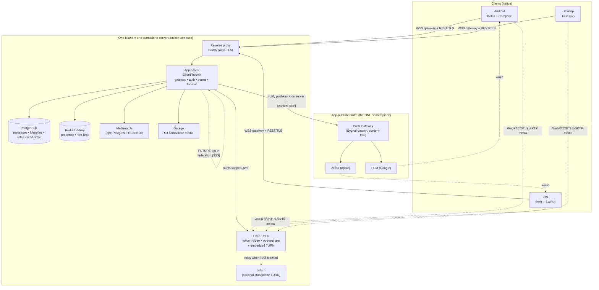

# Archipelago — Master Planning Document

*A self-hosted, privacy-respecting chat + voice platform that replaces both Discord and TeamSpeak. Working codename "Archipelago" (provisional) — it captures the one idea everything else hangs off: a sea of independent islands, each fully standalone.*

*Status: v1 architecture plan. Lead architect draft. Every recommendation below is a decision, not a menu — alternatives are recorded so we know what we chose against.*

---

## 1. Executive summary

We are building a **self-hostable communications server plus first-class native mobile clients** that together replace **Discord** (communities, text channels, roles, threads, reactions, bots, rich messaging) **and TeamSpeak** (low-latency, always-on group voice) in a single product. You run a server; people connect to it by address (`host:port`), exactly like joining an IRC network, a Mumble server, or a TeamSpeak instance.

**The locked decisions (these do not re-open in v1):**

| # | Decision | Rationale in one line |
|---|----------|----------------------|
| 1 | **Topology = isolated islands.** Each server is fully standalone. No central service, no global account, no federation in v1. Separate identity per server. | It is the product's spine; it is also the natural state of a standalone server, so we fight nothing to get it. |
| 2 | **Voice AND text both ship in v1.** | We replace TeamSpeak and Discord at once or we replace neither. |
| 3 | **Privacy model = TLS in transit + DTLS-SRTP for voice + trust-the-host.** The operator (usually the user) can read data at rest. No E2EE in v1. | Honest, coherent, and strictly better than Discord for most users. E2EE breaks search, bots, moderation, and good push UX — documented as a later, opt-in layer. |
| 4 | **Native mobile is a hard requirement:** Kotlin + Jetpack Compose (Android), Swift + SwiftUI (iOS). No React Native, no Flutter for the primary clients. | The user disliked Element/Matrix mobile UX and wants a genuinely native feel. |
| 5 | **Build the text/community layer; adopt mature OSS for the hard infrastructure.** Foremost: **adopt LiveKit** (Apache-2.0 WebRTC SFU) for voice/video/screen-share — do not build media plumbing. | Reinventing an SFU is a multi-quarter trap; reinventing the islands/identity model is a weekend's schema design. Spend effort where it differentiates. |
| 6 | **Server runtime = Elixir/Phoenix** (Channels + Presence + PubSub). Go is the sanctioned fallback. | Presence, fan-out, and multi-device broadcast — the three hardest realtime problems — come for free on a single node with no Redis. |
| 7 | **Mobile shared core = Kotlin Multiplatform (KMP)**, native UI per platform, **plus a small Rust crypto module (UniFFI) for the future MLS engine.** | Write the bug-prone logic (reconnect, sync, account registry) once in Kotlin; keep every pixel native; keep crypto in the one language that has a real MLS implementation. |
| 8 | **E2EE is pre-invested, not pre-built.** Still no E2EE in v1, but the message envelope, key-storage seam, and crypto module boundary are designed for MLS from day one. | Retrofitting E2EE into a plaintext message model is the rewrite we are paying a small tax now to avoid. |
| 9 | **Desktop = Tauri** (LiveKit Rust SDK for media), Electron as the documented fallback. | The Rust crypto module (#7) gives Tauri the code-reuse rationale it previously lacked; the team already has Tauri experience; and a small binary is simply less to ship and maintain. |
| 10 | **Non-profit, no central service — defined precisely (§2.1).** No central account, directory, or anything in the data path. The project ships apps and one content-free push relay; it does not run the network. | "Nothing centralized" needs a testable definition or it becomes a slogan. The test is: *if the project disappears tomorrow, every island keeps working.* |
| 11 | **Licensing: AGPL-3.0 server · Apache-2.0 clients + crypto module · CC0 protocol spec** (§2.2). | Copyleft protects the server from closed SaaS forks; the clients **must not** be GPL/AGPL because those licenses are incompatible with App Store terms — the VLC precedent. |
| 12 | **Tune for a small personal island; never build in a ceiling** (§6.4). Defaults target ~10–50 people on one cheap box; four coding rules keep multi-node possible without building it. | No operator should be obliged to run infrastructure for strangers — but growth should cost a bigger box, never a rewrite. |

**What this is NOT:** it is not Matrix (no federation-first design, no portable global `@user:server` identity, no AGPL homeserver baggage). It is not a fork of Discord-alternative platforms (all ship non-native mobile and bend the wrong way for islands). It is not E2EE-by-default (that fights v1's own must-have features).

**The one honest asterisk:** *background push cannot be fully self-hosted on stock iOS.* **Android can be made genuinely Google-free** — UnifiedPush with a self-hosted ntfy is the default, and a foreground-service socket is available for people who want zero third parties (§11.2). **iOS cannot.** Waking a killed iOS app requires Apple's APNs, credentials are bound to the *app* rather than the server, and even a self-hosted ntfy must relay iOS wakes through an APNs-connected upstream. So exactly one small, content-free relay survives — and §2.1 defines precisely why that does not make this a centralized system, while §11 confronts the cost and the escape hatches.

---

## 2. Vision & non-negotiable principles

1. **Islands, not a network.** A server is a world unto itself. There is no directory, no shared login, no cross-server anything in v1. Joining is `connect(host, port) → authenticate → you exist here and nowhere else.` This is the IRC/TeamSpeak/Mumble/SSH mental model.
2. **The operator is the trust anchor.** Usually the operator *is* the user or someone they chose. Data at rest is readable by the host. We protect the wire (TLS/DTLS-SRTP) and cold storage (full-disk encryption), harden secrets, and minimize metadata — but we never pretend the host can't read messages. We say so in plain language at join time.
3. **Native feel is sacred.** The reason this project exists is that Element-class cross-platform mobile UX felt wrong. Every client decision is subordinate to "does this feel like a first-class native app?"
4. **Assemble, don't reinvent — except the core product.** Voice (LiveKit), storage (Garage), search (Meilisearch), TLS (Caddy), TURN (coturn), auth primitives (libsodium, optionally Ory Kratos), push relay (Sygnal-pattern) are adopted. The community/text domain, the gateway protocol, the permission model, and the two native clients are ours.
5. **Self-hosting must be humane.** The target operator is a hobbyist with a VPS or a home box, not an SRE. The deployment unit is a curated `docker compose up`, not a pile of manuals.
6. **Leave clean seams, promise nothing early.** Design the identity namespace as server-scoped, route all cross-node traffic through PubSub, and keep message storage abstracted — so a *future opt-in* federation layer and *future opt-in* E2EE can attach without a rewrite. We build neither in v1, and we do not imply we have.

7. **Non-profit and community-run.** There is no company, no revenue, no growth target, and no investor. Every user is expected to self-host, or to join an island someone they know self-hosts. This is a design constraint with teeth: it caps what ongoing infrastructure we are allowed to depend on, and it means **maintainer time is the scarcest resource in the project** — scarcer than CPU, bandwidth, or money. When two designs are close, pick the one with less to operate and less to maintain.
8. **No telemetry. Ever.** No analytics, no phone-home, no crash reporting to a service we run, not even anonymized. Operators may opt into their *own* self-hosted error reporting (e.g. GlitchTip). This is not a setting to be flipped later; it is a promise the architecture should make it awkward to break.
9. **The project must be survivable.** Assume the current maintainers eventually stop. Nothing in the design may make the network depend on their continued existence — see the death test in §2.1.

**Anti-goals:** federation-in-v1, a global account, E2EE-in-v1, cross-platform UI toolkits for mobile, chasing Discord-planet scale (an island is tens to low-thousands of concurrent users), any hard dependency on a third-party SaaS for a core feature, and **any component whose ongoing cost scales with the number of users or islands.**

### 2.1 What "no centralization" precisely means

"Nothing centralized" has to be defined or it degrades into a slogan that the push chapter then quietly violates. Two tests decide whether a component is acceptable:

- **The data-path test.** Does user content, identity, social graph, or island directory flow through it? If yes, it is forbidden — no exceptions.
- **The death test.** If the project and its maintainers vanish tomorrow, does the network keep working? Existing islands must keep running indefinitely, and existing clients must keep talking to them.

Applying both honestly:

| Component | Central? | Verdict |
|---|---|---|
| Islands (servers) | No — each fully standalone | The network *is* these, and they are wholly operator-owned |
| Accounts / identity | No — per-server keypairs, no global ID | Passes both tests |
| Island directory / discovery | **Does not exist.** You connect by address | Deliberately absent; a directory would be a central chokepoint and a moderation liability |
| Voice (SFU) | No — every island runs its own | Passes both tests |
| **iOS push relay** | **Yes — one, unavoidably (§11)** | **Content-free** (no data-path violation) and **not load-bearing** (if it dies, iOS loses background wakes; text, voice, and every island keep working). Passes the data-path test; degrades rather than fails the death test |
| App binaries + update feed | Yes, in the sense that someone publishes them | Distribution, not network. Old clients keep working; the source is public and forkable |

**The line we are drawing:** the project ships *software* and one *content-free relay*. It does not run *the network*, hold *any user data*, or know *which islands exist*. That is a materially different thing from Discord, from Matrix.org-as-default-homeserver, and even from Signal — and it is the strongest form of "no centralization" that shipping a native iOS app permits. §11 documents the escape hatches for anyone who rejects even this much.

### 2.2 Licensing — the project-model decision that constrains code *today*

Most project-model questions (funding, distribution accounts, code-signing, legal entity, key custody) are **release-time concerns and are parked in Appendix C** — they change nothing about what we build now. Licensing is the exception: it dictates which dependencies we are allowed to adopt, starting with the first commit, and a violation discovered late can make a client unshippable.

| Component | License | Why |
|---|---|---|
| **Server** | **AGPL-3.0** | Strong copyleft is exactly right here: it costs a self-hoster nothing (pointing at the public repo satisfies the source offer) while preventing a company from running a closed SaaS fork of a project built by volunteers. |
| **Clients** (Android, iOS, desktop) | **Apache-2.0** | **Not a preference — a constraint.** GPL-family licenses are incompatible with the App Store's terms, which is why [VLC](https://www.fsf.org/blogs/licensing/vlc-enforcement) and GNU Go were pulled. An AGPL iOS client is not shippable. |
| **Rust crypto module** (§8.5) | **Apache-2.0 / MIT** | It links into the iOS client, so it inherits the same constraint. |
| **Protocol specification** + reference schemas | **CC0 / public domain** | Anyone should be able to write a competing client or server without asking permission. This is the strongest anti-lock-in move available and it costs nothing. |

**The consequence that bites immediately:** **libsignal is AGPL-3.0, so it cannot go in the iOS client.** The "DM-first double-ratchet via libsignal" option from §12.4 is therefore off the table for a store-distributed app. This is not a setback — it removes a fork in the road and confirms **OpenMLS (MIT) or mls-rs (Apache-2.0 OR MIT)** as the E2EE path (§12.5).

**The one standing rule:** every dependency entering the **client or crypto** tree must be permissive. Enforce it in CI from v0 (§16 risk 14), while the dependency graph is still small enough that a violation is a five-minute fix rather than a re-architecture.

---

## 3. Product scope

### 3.1 The Discord half (communities & rich messaging)

**In v1:**
- Servers/communities (each = one island), channels, categories.
- Text messaging with edits, deletes, pins, replies, and **threads** (basic).
- **DMs and group DMs**, scoped to a single server (no cross-server DMs — there is no cross-server identity).
- **Roles & granular per-channel permission overrides** (Discord-style allow/deny/override calculus).
- Reactions + **custom (server-uploaded) emoji**.
- Mentions (`@user`, `@role`, `@everyone`) with per-user/per-channel notification preferences.
- Presence (online/idle/DND), typing indicators, read/unread state across devices.
- File/image/audio/video **uploads with server-side transcoding + thumbnails**, EXIF stripped by default.
- **Full-text search** over messages, users, channels (permission-filtered at query time).
- **Invites** (expiring/limited-use codes) and **moderation**: kick/ban/mute/timeout, an append-only audit log, and rate-limiting.
- Localization scaffolding and baseline accessibility from day one.

**In v2:**
- **Bots, webhooks, slash commands, and a scoped bot API** (a subset of the real API with bot tokens + permission scopes). This is a major community-growth lever (Discord's ecosystem lesson) but needs the core API to stabilize first.
- Rich embeds / link unfurling (SSRF-hardened, operator-toggleable).
- Stickers and a GIF picker (see the Tenor note in §14).
- Custom statuses; deeper moderation tooling.

### 3.2 The TeamSpeak half (real-time voice)

**The model, confirmed: persistent always-on channels — a board, not a call log.**

Voice channels are **permanent objects that always exist**, like the lists on a Trello board. They are not calls you create, schedule, or invite people to. The board is the primary view: **every channel and everyone currently in it is visible at a glance**, without joining anything, and you move yourself between channels by clicking — the TeamSpeak lounge model. Four consequences follow, and they simplify more than they cost:

1. **Nothing rings.** Walking into a lounge does not notify anyone. This removes incoming-call semantics from v1 entirely — which, per §11.4, also removes the PushKit/CallKit work from v1. *Direct 1:1 calls, which do ring, move to v2.*
2. **Occupancy is global, not per-room.** Every connected client sees who is in every voice channel at all times, so occupancy is broadcast to the whole island rather than only to participants. Cheap (tiny payloads, changes only on join/leave) but it must be designed as island-wide state from the start, not bolted on.
3. **Channels exist in the database; SFU rooms do not exist until needed.** A voice channel is always a row; its LiveKit room is created lazily on first join and torn down when the last person leaves. Empty channels cost nothing, so an island can offer as many as it likes (§7.2).
4. **Moving people is a first-class action.** Users drag themselves between channels; moderators with permission can drag *others* — the TeamSpeak "move user" action, and the natural reading of the board metaphor.

**In v1:**
- Persistent always-on voice channels as above, low-latency, self-hosted.
- **Video and screen-share** on the same media path.
- **Push-to-talk** (client-side) and open-mic / voice-activity modes; "who's speaking" indicators on the board.
- Server-side mute/deafen that propagates to the media layer (a moderator timeout kills the offender's audio track at the SFU, not just in the UI).

**In v2+:** **direct 1:1 calls** (the ringing case — brings PushKit/CallKit and full-screen intents with it), optional server-side recording (LiveKit Egress), positional/spatial audio niceties.

### 3.3 Deliberately OUT of scope for v1

| Excluded | Why | Where it hooks in later |
|----------|-----|--------------------------|
| **Federation / server-to-server** | Contradicts islands; adds enormous complexity (Matrix's whole burden). | Server-scoped ID namespace + PubSub message router are designed now so a future opt-in S2S module attaches without a schema break (§10, §15). |
| **E2EE (content the host can't read)** | Breaks server-side search, bots, moderation, and rich push — all v1 must-haves. Also fights the trust-the-host model. | **PRE-INVESTED (§12.5).** Not shipped in v1, but the message envelope, crypto-module boundary, and key-storage seam are MLS-shaped from day one. DM-first, then MLS (RFC 9420) groups. |
| **Central / global account** | The core anti-vision. | A future portable-identity concept could reuse the per-server keypair (§10); not assumed. |
| **Media E2EE for voice** | SFU must see plaintext to route; Insertable Streams/SFrame is hard and fights recording/moderation. | Documented future; DTLS-SRTP covers hop encryption in v1 (§7, §12). |

---

## 4. THE BIG DECISION — Foundation: build vs. adopt

This is the centerpiece. Everything downstream (identity, mobile, deployment) follows from it.

### 4.1 The core tension, stated once

No single existing protocol or platform natively delivers **all three** of the vision's hardest constraints simultaneously:

1. **Isolated islands / per-server identity / no central account / no federation.**
2. **Low-latency group voice AND rich text, both in v1.**
3. **First-class native Kotlin/Compose + Swift/SwiftUI mobile.**

Different projects satisfy different pairs; none satisfies the triple. Two structural facts settle the debate:

- **Voice is a separate hard subsystem in *every* option.** No text protocol — custom, IRCv3, XMPP, or Matrix — ships production group voice. Every real system (including Discord itself, and Matrix's own Element Call) pairs a text/gateway layer with a **dedicated WebRTC SFU**. Matrix's "voice" is literally LiveKit + a JWT shim (`lk-jwt-service`). So voice is a constant across all foundation choices; it does not discriminate between them. **We will adopt LiveKit regardless.** That removes voice from the foundation debate entirely.
- **Given that, the foundation question collapses to: "which text/community layer best fits isolated islands + native mobile, with the least reinvention?"**

### 4.2 The candidates, compared

| Foundation | Islands / per-server identity fit | Voice | Native mobile story | Rich Discord-grade messaging | License | Verdict |
|---|---|---|---|---|---|---|
| **Purpose-built protocol + server** (+ LiveKit) | **Native — it's the default state** of a standalone server | Adopt LiveKit | We write both clients against our own clean WS+REST protocol (best fit-to-UI) | We define exactly what exists | Ours (any) | **RECOMMENDED** |
| **XMPP** (Prosody MIT / ejabberd GPL-2.0) | **Excellent** — JIDs are `user@server`, federation opt-in/disable-able | Jingle is 1:1 only; group voice ⇒ external SFU/focus agent (bridge to LiveKit/Jitsi) anyway | Real, proven: Smack (Apache-2.0) + XMPPFramework (BSD); Conversations shows polish | Off-the-shelf via XEPs (MUC, MAM, push, HTTP-upload) but a curation/version-matrix grind; MIX still not universal | MIT / GPL-2.0 | **Strong runner-up** — the best "don't reinvent" path |
| **Matrix** (Synapse/Dendrite AGPL; continuwuity/tuwunel Apache) | **Poor as a base** — federation- and `@user:server`-identity-centric by design; "islands" means fighting the grain (empty federation allowlist) | Element Call = LiveKit + `lk-jwt-service` (same SFU work) | **Best-in-class**: Element X is genuinely native (Kotlin/Compose + SwiftUI) — *study it* | Richest already-spec'd (rooms, threads, spaces, E2EE) | AGPL-3.0 homeservers (real product consideration) | **Reference only** — the anti-vision on identity |
| **IRCv3** (Ergo, MIT) | **Excellent topology** — "join a server, get a local nick" is literally IRC | None | No modern native SDK comparable to the above | Thin: weak media/threads/reactions; history via maturing `chathistory` | MIT | **Steal the wire ideas, not the whole thing** |
| **Fork Revolt/Stoat** (AGPL-3.0) | **Best of the fork candidates** — genuinely standalone, no central account, Rust API + LiveKit voice | Has it (LiveKit) | React Native — **fails the hard requirement** (we'd rewrite clients anyway) | Yes (Discord-shaped) | AGPL-3.0 | Adopt-as-backend only if greenfield feels too costly; still write native clients |
| **Fork Rocket.Chat / Mattermost** | Fine (single-server) | Bolt-on / meeting-oriented, not TeamSpeak-grade | React Native | Mature, but **open-core walls** SSO/roles/HA | MIT-core + source-available EE | No — wrong product shape, license walls, non-native mobile |
| **Fork Mumble** (BSD) | **Perfect** topology + **gold-standard voice** | **The** voice reference | Community mobile clients, not first-class | **~Zero** rich text/community | BSD | Learn from its audio pipeline; can't carry the Discord half |
| **Nostr / SimpleX / Tox / Jami** | **Wrong topology** — global-keypair or no-identity or serverless P2P | Varies | Bespoke | No community/roles model | Varies | Not foundations |

### 4.3 Ranked recommendation

**1st — BUILD a purpose-built protocol + server for the text/community layer, with LiveKit as the voice SFU.**

This is the Discord architecture: a persistent WebSocket "gateway" for real-time events + REST for history/uploads + a separate WebRTC SFU for media. The reasoning, tied point-by-point to the vision:

- **Islands and per-server identity are the *default*, not a fight.** One server process = one community; accounts are local rows; clients join by `host:port`. There is no framework pushing back toward federation or a global account.
- **The wire format is ours to tune for native mobile** — a compact JSON/MessagePack (later Protobuf) protocol over one long-lived socket maps cleanly to Kotlin/Swift models. This directly answers the "Element felt wrong" complaint at the protocol level.
- **Federation is a clean future add-on**, not something to rip out: a standalone server gains an opt-in S2S module later without reworking identity.
- **Voice is a solved integration, not a research project.** We embed LiveKit and mint scoped room tokens; the SFU never has its own account system — perfect for islands.

**The cost is real and we accept it eyes-open:** we own the spec, versioning, auth, moderation, history/sync/read-state, presence, reconnect/resume, rate-limiting, abuse handling, and (in v2) a bot API. This is the long tail that consumes years elsewhere. We mitigate it by (a) choosing Elixir/Phoenix, which hands us presence + fan-out + multi-device broadcast nearly for free (§6), and (b) stealing shamelessly from the runners-up (below).

**2nd — XMPP on Prosody.** If, at the last responsible moment, the team decides that owning a bespoke protocol is too much for a small crew, Prosody is the fallback that best preserves the vision: per-server JIDs = per-server identity by construction, federation is a toggle we leave off, and native mobile has *proven* libraries (Smack, XMPPFramework). The costs are the XEP version-matrix grind, an XML wire format heavier than we'd design today, and the fact that group voice still means bridging to an SFU — i.e., the same LiveKit work. We rank it second, not first, because "curate 15 XEPs to Discord-grade UX" is comparable effort to "design a focused protocol," and a focused protocol yields the native mobile ergonomics the vision prizes most.

**Reference, not base — Matrix.** We will **study Element X and `matrix-rust-sdk`** as the gold standard of native-feeling mobile chat, and **copy the MatrixRTC pattern verbatim** (SFU + a tiny JWT authorization service). We will not inherit Matrix's federation-first, portable-identity model or its AGPL homeservers.

### 4.4 What to steal from the runners-up

- **From IRCv3:** the capability-negotiation and **message-tagging** model — message-ids, `server-time`, labeled-response, and a `chathistory`-style backfill command. This is the best wire-format inspiration for our gateway.
- **From Matrix:** the **`lk-jwt-service` token-broker pattern** for voice (our app server mints scoped LiveKit tokens), the **read-receipts / spaces / threads** data-model shapes, and Element X's client architecture. Also: how to *later* layer E2EE (their Olm/Megolm pain teaches us the multi-device/key-backup cost we're deferring).
- **From XMPP:** **MAM-style message archive** semantics and **XEP-0357-style push** design (content-free wake, client pulls) — we adopt the push shape even though we don't adopt XMPP.
- **From Mumble:** the **low-latency Opus pipeline, jitter-buffer tuning, and per-server certificate identity** — informs both our voice defaults (LiveKit lets us tune these) and our TOFU keypair identity (§10).
- **From Revolt/Stoat:** its permission model and standalone data-model are the closest existing analog — a reference schema to sanity-check ours against.

---

## 5. High-level architecture


```mermaid
flowchart TB
  subgraph Clients["Clients (native)"]
    A["Android<br/>Kotlin + Compose"]
    I["iOS<br/>Swift + SwiftUI"]
    D["Desktop<br/>Tauri (v2)"]
  end

  subgraph Publisher["App-publisher infra (the ONE shared piece)"]
    PG["Push Gateway<br/>(Sygnal-pattern, content-free)"]
    APNs["APNs (Apple)"]
    FCM["FCM (Google)"]
    PG --> APNs
    PG --> FCM
  end

  subgraph Island["One Island = one standalone server (docker compose)"]
    RP["Reverse proxy<br/>Caddy (auto-TLS)"]
    APP["App server<br/>Elixir/Phoenix<br/>gateway • auth • perms • fan-out"]
    DBP[("PostgreSQL<br/>messages • identities • roles • read-state")]
    CACHE[("Redis / Valkey<br/>presence • rate-limit")]
    SEARCH["Meilisearch<br/>(opt; Postgres FTS default)"]
    OBJ["Garage<br/>S3-compatible media"]
    SFU["LiveKit SFU<br/>voice • video • screenshare<br/>+ embedded TURN"]
    TURN["coturn<br/>(optional standalone TURN)"]
  end

  A -- "WSS gateway + REST/TLS" --> RP
  I -- "WSS gateway + REST/TLS" --> RP
  D -- "WSS gateway + REST/TLS" --> RP
  RP --> APP
  APP --> DBP
  APP --> CACHE
  APP --> SEARCH
  APP --> OBJ
  APP -- "mints scoped JWT" --> SFU

  A -. "WebRTC/DTLS-SRTP media" .-> SFU
  I -. "WebRTC/DTLS-SRTP media" .-> SFU
  D -. "WebRTC/DTLS-SRTP media" .-> SFU
  SFU -. "relay when NAT-blocked" .-> TURN

  APP -- "notify pushkey K on server S<br/>(content-free)" --> PG
  APNs -. "wake" .-> I
  FCM -. "wake" .-> A

  %% future seam
  APP -. "FUTURE opt-in<br/>federation (S2S)" .-> APP
```

**Reading the diagram:** the **app server is the sole authority** for identity, permissions, and history. It authenticates the per-island identity, checks channel permissions, and **mints short-lived LiveKit tokens**; the client's media then flows **directly to the SFU over WebRTC** (the app server is not in the media path). The **push gateway is the only component shared across islands**, and it only ever forwards a content-free "wake" — never message text (§11). The **dotted federation loop** is the documented future seam, absent in v1.

---

## 6. Server architecture & the self-hosting deployment story

### 6.1 Runtime: Elixir/Phoenix (Go is the sanctioned fallback)

The app server's real job is: auth + per-server identity, channel/message persistence, presence, fan-out, read-state/multi-device sync, and minting voice tokens. Phoenix nails the hardest three:

- **Phoenix Channels** (WebSocket) are our client gateway transport for text and control/signaling.
- **Phoenix Presence** is CRDT-based and needs no central store — it gives online/typing state with zero extra infrastructure, and its conflict-free design *philosophically matches islands* and eases a future clustering story.
- **Phoenix.PubSub** does message fan-out in-process on a single node — **no Redis required** for the base case.

The BEAM's cheap per-connection concurrency and fault isolation (one crashing socket doesn't touch others) are ideal for an unattended self-host. The classic objection — "no single static binary" — **evaporates** because the real deployment unit is a Docker Compose bundle anyway (below); `mix release` ships a self-contained runtime tree in the image.

**Choose Go instead** if the core team lacks BEAM experience or targets sub-128 MB VPS boxes. Go gives a tiny static binary and the same language as LiveKit/coturn, but you hand-build presence/typing/fan-out and add **Valkey** (BSD; the Redis fork after the 2024 relicense) or **NATS** for pub/sub. Everything else in the stack is unchanged. **Rust (Axum/Tokio) is not recommended for the app server** — its performance ceiling is irrelevant at island scale and its build-out cost is highest; reserve Rust for components (Garage, Meilisearch are already Rust) or the *mobile core* if we go that route (§8).

### 6.2 Data & transport choices

- **PostgreSQL is the single source of truth**: messages (partitioned by channel, monotonic snowflake IDs for stable pagination), per-server identities, roles, invites, and **per-user/per-channel read markers** for multi-device sync. Multi-device is a *solved, server-authoritative problem* here precisely because there is a normal per-server account and no E2EE in v1. **Scylla/Cassandra is explicitly out** — that's Discord-planet scale; a single island never needs it (documented only as a far-future escape hatch).
- **Search default = PostgreSQL full-text (GIN/tsvector)** — zero extra service, transactionally consistent, adequate at island scale. **Meilisearch (MIT, disk-based)** is the opt-in upgrade for larger islands wanting typo-tolerant instant search; prefer it over Typesense (GPL-3, RAM-bound, no sharding). Either way, **search results are permission-filtered at query time** by the user's visible channels.
- **Object storage = Garage** (S3-compatible, Rust, tiny footprint ~50 MB, single binary) as the default; **SeaweedFS** (Apache-2.0) when scale is expected; plain filesystem behind the same S3 abstraction for the smallest installs. **Do NOT default to MinIO** — its CE admin console was stripped in 2025 and the repo was marked unmaintained (Feb 2026) then archived (April 2026). Code to the S3 API so any backend is swappable.
- **Transport = WebSocket** for text + control/signaling. It traverses reverse proxies/NAT/corporate firewalls, is trivially supported by mobile HTTP stacks, and is what both Phoenix Channels and LiveKit signaling already use. Framing: JSON/MessagePack now, Protobuf later if needed. The client protocol must include a **resume/replay** step so a dropped mobile socket doesn't lose messages.

### 6.3 The deployment unit: a curated Docker Compose bundle

Because voice (LiveKit) + TURN + Postgres + a TLS-terminating reverse proxy are all required regardless of app language, the **romantic "single binary" is a dead end** as the actual product. The honest deliverable is:

```
docker compose up -d
```

...bringing up: `phoenix-app` + `postgres` + `livekit` + `caddy` (automatic Let's Encrypt TLS) + `garage` + optional `coturn` + optional `meilisearch`.

- **TLS: Caddy** (Apache-2.0) for one-line automatic HTTPS for operators with a domain. Traefik (MIT) documented as the Docker-native alternative; nginx+Certbot for those who insist. For bare-IP/LAN/self-signed operators, TOFU pinning in the app covers the gap (§12).
- **Upgrades:** image-tag based; **Ecto migrations run automatically on container boot**.
- **Backups:** a bundled **nightly `pg_dump` + object-store snapshot**, encrypted with **age**, using **restic/BorgBackup**, with a **documented, tested restore** and a short DR runbook. (The most likely real-world breach is a leaked unencrypted backup, not a wire attack — so this is a first-class deliverable, not an afterthought.)
- **The fiddly part, called out honestly:** LiveKit's UDP port range + TURN/TLS is where novice self-hosters get stuck. The bundle ships sane firewall/port defaults, uses LiveKit's **embedded TURN on 5349** by default (so coturn is optional), and documents TURN-over-TLS on 443 for restrictive networks.

**Reachability — the blocker nobody mentions until it bites.** If the expectation is that *whoever uses this hosts it* (principle 7), then many operators will try to host at home, and a large share of home connections **cannot accept inbound traffic at all** because the ISP puts them behind CGNAT. No amount of TURN fixes this: TURN helps *clients* traverse NAT, but here it is the *server* that is unreachable. Be honest and prescriptive rather than letting people discover it after an hour of port-forwarding:

| Situation | Works? | Guidance |
|---|---|---|
| VPS with a public IP | **Yes, fully** | The recommended default. A Tier-1 island fits a cheap VPS (§6.4). |
| Home + public IPv4 + port forwarding | **Yes** | Add dynamic DNS; document the router steps and the TOFU pinning path for bare IPs (§12.2). |
| Home + IPv6 only | **Partly** | Fine for IPv6 clients, but breaks IPv4-only mobile networks — so it fails exactly when someone is out of the house. Not sufficient alone. |
| **Home behind CGNAT** | **No** | Requires an overlay (**Headscale**, the self-hostable Tailscale control server, or plain WireGuard) or a small VPS as a front. Ship a documented recipe; do not suggest a proprietary tunnel, which would reintroduce a central dependency (§2.1). |

The installer should **detect and report reachability up front** — check inbound TCP/UDP and tell the operator plainly "your island is not reachable from the internet, here are your three options" — rather than yielding a server that silently only works on the LAN.

### 6.4 Sizing: tune for a small island, but never build in a ceiling

Two different things get confused here, so state them separately:

- **What the reference island is tuned for: Tier 1 — a personal island.** Friends and a small circle, ~10–50 people, run on one cheap box. Defaults, docs, and the Compose bundle are written for *this* operator. Nobody should have to run infrastructure for hundreds of strangers to use this software, and no operator should feel obliged to.
- **What the software must be capable of: Tier 3 and beyond.** If someone's island grows, or someone wants to host a large community, the *software* must not be what stops them. Growth should cost money and a bigger box — never a rewrite.

| Tier | Registered / concurrent voice | Box | What changes |
|---|---|---|---|
| **1 — Personal (REFERENCE TARGET)** | ~10–50 / ≤10 voice, occasional screen share | 2 vCPU, 4 GB, 80 GB | Nothing — this is the default bundle, and it is comfortable. |
| **2 — Community** | ≤500 / ≤50 voice, 2–3 screen shares | 4 vCPU, 8 GB + generous transfer | Bigger box. Still one node, one `docker compose up`. |
| **3 — Large** | ≤5,000 / ~200 voice | App box + **separate LiveKit box** | Point `LIVEKIT_URL` at another host. Add Valkey when presence/rate-limit traffic justifies it. |
| **Beyond** | more | Multiple app nodes | Cluster the BEAM (`libcluster` + a distributed PubSub adapter). Possible *only if* we keep the discipline below. |

**The engineering discipline that keeps the ceiling open.** Scalability here is not about building distributed systems now — it is about **not writing code that forecloses them later**. Four rules, all free if followed from v0 and expensive to retrofit:

1. **Never assume a single node.** Every cross-connection message goes through **`Phoenix.PubSub`**, even when it is trivially in-process today. Swapping the local adapter for a distributed one then becomes config, not a refactor.
2. **No global in-memory state.** Anything authoritative lives in Postgres; anything ephemeral lives in Phoenix Presence (already CRDT-based, already clusters). No module-level mutable maps holding truth.
3. **Nothing is `localhost`.** The SFU, object store, and search are addressed by **URL from config**, never assumed co-resident. This is what makes "move LiveKit to its own box" a one-line change.
4. **No local-filesystem assumptions.** All media goes through the S3 API even when the backend is a directory on the same disk.

Follow those and single-node is a *deployment choice*, not an architectural one — which is exactly the property being asked for.

**Where the limits actually bite** — worth knowing, because the intuition is usually wrong:

- **Text is not the constraint, and it is not close.** Phoenix holds tens of thousands of idle WebSockets on modest hardware; a chat island's message rate is trivial next to that. Message rows are small — roughly a million messages fits in a few hundred MB with indexes. **Uploaded media, not messages, is what fills the disk**, so size storage from attachment retention policy.
- **Voice is cheap; video is not.** SFU forwarding does no transcoding, so CPU stays low and **bandwidth is the real ceiling.** With Opus at ~32 kbps, a 10-person voice room costs roughly `10 × 9 × 32 kbps ≈ 2.9 Mbps` of server egress — so even a Tier 1 island barely notices voice. By contrast **a single 1080p screen share to nine viewers is ~22 Mbps — one screen share costs about as much egress as fifty concurrent voice users.** Simulcast/dynacast mitigate this; capacity planning should still treat video as the expensive case.
- **TURN relay is the sleeper cost (§7.3).** Participants behind symmetric NAT relay *all* their media through the server, converting a peer's bandwidth into the operator's. A self-hoster typically hits their VPS transfer cap long before a CPU limit — so publish guidance in **monthly transfer**, not just cores and RAM.


---

## 7. Real-time voice/video stack

**Decision: WebRTC + LiveKit SFU + coturn, Opus audio, app server as token authority.** Not a raw/custom UDP protocol.

### 7.1 Why WebRTC + an SFU, and why LiveKit specifically

- **WebRTC gives us, for free:** Opus (the codec Discord/Mumble/TeamSpeak-class apps use, mandatory-to-implement per RFC 7874), **mandatory DTLS-SRTP encryption** (RFC 8827 — no unencrypted mode), congestion control, NAT traversal (ICE/STUN/TURN), and echo-cancel/noise-suppression on device. A raw-UDP/Opus design (the Mumble model) can shave latency but forces us to hand-roll all of the above **and** two native audio+network stacks — a bad trade against a native-mobile-first, screen-share-in-v1 vision.
- **Topology = SFU, not mesh or MCU.** Mesh dies past ~4 peers and murders mobile battery/uplink; MCU (server mixing) is CPU-heavy and adds latency. An SFU just forwards selected streams. Audio-only Opus is ~20–40 kbps/stream, so **one modest VPS comfortably carries dozens of concurrent voice participants**.
- **LiveKit (Apache-2.0, Go/Pion) wins on the decisive axis: first-class native Swift and Kotlin SDKs** that connect to a self-hosted server. That single fact means voice/video/screen-share on both mandated platforms is *SDK integration, not from-scratch WebRTC*. It also ships **simulcast/dynacast**, an **embedded TURN**, and a **JWT room-token model** that keeps identity in our app server and out of the SFU.

**Rejected alternatives:** mediasoup (ISC) — top control but no official native mobile SDKs and you build all signaling; Janus (GPLv3) — copyleft hazard for a distributed product, no native SDKs; ion-sfu (MIT) — dormant since 2021; Galène (**MIT**, note: *not* AGPL — a common misconception) — lovely and tiny but web-first with no native SDKs; Jitsi Videobridge (Apache-2.0) — heavy JVM, its mobile story is a whole app, not a lean client lib.

### 7.2 Signaling, tokens, and the isolated-islands fit

The **app server is the sole identity/permission authority**. Flow:

1. Client authenticates to the app server (per-island identity, §10).
2. App server checks the user's permission for the target voice channel.
3. App server mints a **short-lived, scoped LiveKit access token** (JWT signed with the LiveKit API key/secret, encoding room + grants).
4. Client's LiveKit SDK connects WebRTC directly to the SFU with that token.

The SFU holds **no accounts** — perfect for islands. This is exactly Matrix's `lk-jwt-service` pattern, stolen wholesale. **Future-federation seam:** because the app server already brokers tokens, a home server could later mint a *guest* token to a remote island's SFU — a clean hook we design toward but do not build.

**Room lifecycle under the persistent-channel model (§3.2).** A voice channel is permanent *in the database* but its LiveKit room is **created lazily on first join and destroyed when the last participant leaves**. This is what makes "always-on channels" affordable: an island can expose thirty voice channels and pay for none of them while they sit empty. Two design notes follow:

- **Occupancy state is the app server's, not the SFU's.** The board view (§3.2) must show who is where even for clients that have joined no room at all, so the app server tracks membership from LiveKit webhooks and broadcasts it island-wide over PubSub. Never make the client query the SFU to render the board.
- **Sizing is driven by concurrent *participants*, not channel count** — so the §6.4 capacity math is unaffected by how many channels an island defines.

### 7.3 Codecs, screen share, PTT, mobile specifics

- **Audio: Opus** with FEC + DTX (packet-loss resilience + silence suppression); **rnnoise** available for neural noise suppression.
- **Video + screen share ride the same SFU.** Simulcast lets weak clients pull a lower layer. **iOS screen share requires a ReplayKit Broadcast Upload Extension** + entitlements — budget explicit client work for it. Android screen share via the LiveKit SDK + MediaProjection.
- **Push-to-talk is purely client-side** (mute/unmute the local track — zero server change) with global hotkeys on desktop; on-screen control on mobile. Offer both PTT and VAD-gated open-mic, like TeamSpeak. Server-enforced "who may talk" (moderation) is a small signaling extension that disables a participant's publish grant.
- **NAT traversal: coturn (BSD)** is the fallback when LiveKit's embedded TURN isn't enough; run **TURN over TLS on 443** to punch through corporate/carrier firewalls (needs `CAP_NET_BIND_SERVICE` and a valid cert). **Sleeper cost to plan for:** symmetric-NAT peers relay *all* media through TURN, consuming operator egress — the self-hoster hits bandwidth limits before CPU limits.
- **Voice-media E2EE is out of v1.** DTLS-SRTP encrypts each hop; the SFU sees plaintext (it must, to route). True media E2EE (Insertable Streams/SFrame) is a documented future that conflicts with recording/moderation.

---

## 8. Native mobile clients & the code-sharing decision

**Decision: Kotlin Multiplatform (KMP) shared non-UI core + 100% native UI** — Jetpack Compose (Android), SwiftUI (iOS) — **plus a narrow Rust module, bound via UniFFI, that owns cryptography only** (§8.5). This is strategy (b), with the one part of strategy (c) that genuinely earns its keep.

### 8.1 The four strategies, decided

| Strategy | What's shared | Verdict |
|---|---|---|
| (a) Fully separate Kotlin + Swift | nothing | Best native purity, **worst** maintainability — doubles the most bug-prone code (reconnect, sync, account state). Rejected as primary. |
| **(b) KMP core + native UI** | protocol client, models, reconnect state machine, offline store, **multi-server/multi-identity account registry**, token/key abstractions | **RECOMMENDED.** Write the high-value bug-prone logic once; every pixel stays native. KMP is production-ready and Google-endorsed (Room/DataStore/ViewModel ship KMP). |
| (c) Rust core via UniFFI | same surface as (b), in Rust | **Rejected as the whole core, adopted for crypto only.** Putting the *entire* core in Rust buys little (async-across-FFI is the weak spot, CI/cross-compile is heaviest) — but crypto is the one domain where Rust is not a preference, it is where the MLS implementations actually live. See §8.5. |
| (d) Schema-only sharing | wire types | Shares the least valuable code, duplicates the most. Adopt the schema layer *under* (b), not as the strategy. |

### 8.2 What lives where

- **Shared KMP core:** Ktor (HTTP + WebSocket), **SQLDelight** as the single cross-platform typed-SQL store, kotlinx.coroutines, the account registry, offline/sync logic, and `expect/actual` wrappers over secure storage and push.
- **Native UI:** Compose + SwiftUI, no compromise. (Compose Multiplatform for iOS is Stable since 1.8.0 / May 2025, but using it would mean *not* SwiftUI — so it's deliberately excluded to honor the native-feel mandate.)
- **Voice stays native, not in the core.** LiveKit's SDKs are platform-native, so voice integration is per-platform regardless of code-sharing. **This narrows KMP's advantage** and must be budgeted: AVAudioSession (iOS), foreground service (Android), and the iOS broadcast extension for screen share are real work. **CallKit and ConnectionService are *not* v1** — they belong to ringing 1:1 calls in v2 (§11.4).

### 8.3 Secure storage & the multi-server/multi-identity UX

- **Keys/tokens live only in iOS Keychain (+ Secure Enclave for the P-256 device key) and Android Keystore/StrongBox** — never app-readable storage, never silent cloud sync. Use `kSecAttrAccessibleAfterFirstUnlock` on iOS (so a backgrounded/VoIP process can read while locked) and Keystore-wrapped keys on Android. Store **one credential set per (serverAddress, identity)** — there is no global secret.
- **Multi-identity UX = a mail-client / Mumble-favorites account list.** Each row = `{host:port, display identity, key reference}`. The user adds a server by address, picks or creates an identity there, and the app manages a local credential vault. Centralize all per-island reconnection and "which server am I sending to" logic **in the shared core** and test it hard — a bug that leaks one island's identity to another is catastrophic.
- **Connection lifecycle vs. OS constraints:** iOS kills background sockets, so background delivery there depends on APNs — which is **deferred with publishing** (§11 sequencing note), leaving the iOS client foreground-only for now. Android holds a foreground service while in a voice channel and wakes via the user's chosen push tier (§11.2). Design each island to reconnect independently on foreground, and keep the push layer behind a platform-agnostic interface so iOS slots in later.

### 8.4 The `matrix-rust-sdk`/Element X lesson

Element X *is* genuinely native (element-x-android is ~99% Kotlin/Compose; element-x-ios is SwiftUI) — proof the native bar is reachable and a reference to study for UX, offline sync, and connection handling. We study it; we do not adopt Matrix.

### 8.5 The Rust crypto module — how KMP and E2EE pre-investment coexist

There is a real tension between "KMP core" and "pre-invest in E2EE," and it resolves cleanly: **KMP owns the application, Rust owns the crypto.**

The reason is not taste. **There is no mature pure-Kotlin MLS (RFC 9420) implementation.** Every credible MLS engine is Rust — **OpenMLS** (MIT) and **AWS mls-rs** (Apache-2.0 OR MIT). If we ever want MLS groups, we will be calling Rust; the only question is whether we discover that in year two with a Kotlin crypto layer to unpick, or design for it now.

**The precedent is exact.** Wire's [`core-crypto`](https://github.com/wireapp/core-crypto) is a Rust MLS engine with encrypted persistent storage, exposed to Kotlin, Swift, and WASM via **UniFFI** — shipping in production mobile apps. Wire even maintains [its own fork of the UniFFI Kotlin-Multiplatform bindings](https://github.com/wireapp/uniffi-kotlin-multiplatform-bindings). Our target architecture is the same shape, so we are following a proven path rather than inventing one.

**The boundary (design it in v0, keep it narrow):**

| Layer | Language | Owns |
|---|---|---|
| UI | Kotlin/Compose, Swift/SwiftUI | every pixel |
| App core | **Kotlin (KMP)** | protocol client, reconnect/resume, offline store, account registry, sync |
| **Crypto module** | **Rust, via UniFFI** | key generation, challenge-response signing, key storage encryption — **and later, the whole MLS engine** |
| Platform | Kotlin / Swift `expect/actual` | Keystore/Keychain, LiveKit SDK, push |

**What "pre-invest" concretely means in v0/v1 — cheap now, decisive later:**

1. **Ship the Rust crypto module in v0**, even though v0 crypto is trivial (keypair generation + challenge-response signing, §10). The point is that the FFI boundary, the build, and the CI cross-compilation exist and are exercised from day one. Standing this up later, under E2EE deadline pressure, is where projects lose quarters.
2. **All message content crosses the app↔transport boundary through an envelope**, never as a bare string: `{ envelope_version, content_type, ciphertext_or_plaintext, key_epoch?, sender_key_id? }`. In v1 it carries plaintext and the optional fields are null. E2EE later fills them in — no schema migration, no protocol break.
3. **Never let the server's plaintext assumptions leak into the client's data model.** Client-side, treat "the server can render this message" as a *capability that may be withdrawn*, so search, previews, and notification text already route through a client-side path that can later become the only path.
4. **Keep a client-side search index from v1** (even though server FTS is authoritative), because client-side indexing is the thing E2EE forces and the hardest to retrofit (Matrix needed Seshat for exactly this).
5. **Choose the MLS ciphersuite now** so key material lines up — see §10.2.

**The cost we are accepting:** a Rust toolchain in mobile CI from day one, cross-compilation for both platforms, and dependence on **community KMP-UniFFI binding forks** (Ubique's, Wire's, or Gobley) that chase upstream UniFFI releases rather than being first-party. That is a real maintenance tax and the main risk of this choice (§16). It is bounded by keeping the Rust surface *small* — if the bindings ever become untenable, a narrow crypto module can be consumed through plain per-platform `expect/actual` bindings instead, which is not true of a whole-app Rust core.

---

## 9. Desktop client options & recommendation

**Decision: Tauri for the v2 desktop client, with media handled by the LiveKit *Rust* SDK in the Tauri backend rather than in the webview.** Electron is the documented fallback if remote-video rendering proves too costly (§9.2). This reverses an earlier draft recommendation, for two reasons that did not hold before: the project now contains a **Rust crypto module** (§8.5) that Tauri reuses directly, and the team already has **production Tauri experience** on another project.

### 9.1 The options

The dominant desktop constraint is **reliable low-latency voice AND screen share on Windows, macOS, and Linux**. That single requirement reshuffles the usual "Tauri is lighter" ranking:

| Option | Voice + screenshare across all 3 OSes | Reuse with our stack | Verdict |
|---|---|---|---|
| **Tauri v2** (MIT/Apache) | Webview path has media gaps (macOS WKWebView lacks `getDisplayMedia` — a hard wall; Linux WebKitGTK *does* support WebRTC/`getDisplayMedia` via GStreamer + PipeWire but depends on build config; Windows WebView2 ≈ Chromium). **We bypass all of it by running media in the Rust backend via the LiveKit Rust SDK** (§9.2) | **Reuses the Rust crypto module (§8.5)**; UI is web | **RECOMMENDED (v2)** — pending the §9.3 spike |
| **Electron** (MIT) | **Uniform, turnkey** — bundled Chromium gives full WebRTC + `desktopCapturer` window/screen picker; **LiveKit ships a JS SDK** | Reuses the same web UI; no Rust/KMP reuse | **Documented fallback** — ship this if remote-video bridging in Tauri proves costly |
| Compose MP desktop | **Weakest** — no first-class desktop WebRTC; would force JxBrowser (paid) or a bespoke libwebrtc JNI binding; **LiveKit has no JVM/desktop SDK** | Great *iff* mobile is Compose-shared (it isn't) | Rejected for a voice-critical v1/v2 |
| Flutter desktop | `flutter_webrtc` has decent screen share but **no system-audio capture on Win/mac**; near-zero reuse with Kotlin/Swift | none | Rejected |
| Qt / native-per-OS | Native but no reuse; Qt's LGPL/commercial friction; native-per-OS triples effort | none | Rejected |

### 9.2 The one real risk, stated precisely

Tauri's media problem is **not** "Tauri can't do WebRTC." It is that there are two paths and each has a distinct cost:

| Path | How | Cost |
|---|---|---|
| **A — media in the webview** (JS LiveKit SDK) | Standard web WebRTC inside the system webview | **Hard wall on macOS:** embeddable WKWebView does not expose `getDisplayMedia`, so **screen share cannot work on macOS**. No build flag fixes this. |
| **B — media in the Rust backend** (LiveKit Rust SDK) ← **our choice** | Media never touches the webview; audio goes straight to the OS audio device | **Audio: clean and elegant.** **Video/screenshare: you must bridge decoded frames from Rust into the UI**, which is the genuinely hard part. |

The decisive observation for *this* product: **we are voice-first** (the TeamSpeak half is the real-time requirement; video/screenshare is the Discord half's nice-to-have). On path B, **audio requires no frame bridging at all** — the Rust SDK captures the mic and plays remote audio through the system device, and the webview only renders UI state ("who's in the channel, who's speaking"). So the hardest, most latency-sensitive requirement is also the one Tauri handles most naturally.

Video and screen share are the part to de-risk, not assume. Note also that LiveKit's Rust SDK **targets native platforms and does not build for `wasm32`**, so path A and path B are genuinely different SDKs — this is an architectural fork, not a config flag.

### 9.3 The performance spike (do this before committing)

Since a head-to-head number is wanted and there is existing Tauri experience to compare against, **v2 opens with a two-week spike, not a decision**: build the same minimal client — connect to an island, join a voice channel, show a channel list — in **both** Tauri (LiveKit Rust SDK) and Electron (LiveKit JS SDK), then measure on the same machine:

| Metric | Why it matters |
|---|---|
| Installed size, cold-start time | The headline Tauri claim; verify it rather than repeat it |
| Idle RSS (app open, not in a call) | The always-running-in-tray case, which is how chat apps actually live |
| RSS + CPU during a 10-person voice call | The real workload; where the Rust-SDK path should win |
| Audio round-trip latency, CPU under load | The TeamSpeak-grade requirement |
| Effort to render one remote video tile | **The go/no-go for Tauri** — if frame bridging is painful here, it will be worse for screen share |

**Decision rule agreed in advance:** if Tauri wins on footprint *and* remote-video rendering costs less than roughly a week of work, ship Tauri. If video bridging turns into a research project, ship Electron and revisit — the UI layer is web in both cases, so the spike is not wasted either way.

Caveat on the footprint comparison so it stays honest: Tauri's famous "3–10 MB" figures are *bundle* sizes and assume the OS webview (WebView2/WKWebView); on Linux the WebKitGTK dependency is substantial and usually uncounted. Electron's ≈150–250 MB installed is a fair figure. Measure effective footprint, not bundle size.

**Either way, desktop remains v2** — after mobile ships. Auto-update runs off a self-hosted update feed we (the publisher) run; this does not violate islands, since operators host the *server* while we host *client updates*, same as the push gateway.

**Desktop is v2**, after mobile ships. Auto-update runs off a **self-hosted update feed we (the publisher) run** — note this does not violate islands: operators host the *server*; we host *client updates*, same as we host the push gateway.

---

## 10. Identity & auth without a central account

**Decision: a hybrid, keypair-primary, per-server identity.** Core = client-generated keypair with challenge-response; SCRAM password as low-friction fallback; OIDC as an operator toggle for orgs.

### 10.1 Two layers

**Layer 1 — how you prove you own an account on *one* server.** The strongest fit is a **client-generated keypair (SSH/CertFP style)**: on first join the app generates a keypair, the server stores **only the public key**, and login is a signed challenge-response (nonce → client signs → server verifies). Passwordless, phishing-proof, nothing replayable leaves the device, no server-side secret to steal. This is a *proven, deployed* pattern (SSH pubkey auth; SASL EXTERNAL; IRC's `ECDSA-NIST256P-CHALLENGE`) — though that specific IRC mechanism is niche, so we build our own challenge-response rather than reuse an IRC library.

**Layer 2 — how the *client* juggles many independent identities.** Exactly the §8.3 mail-client account list: `{host:port, display identity, key reference}`.

### 10.2 The load-bearing crypto decision: P-256 device keys

Use **P-256 / ES256 for the device key.** It is the **only curve hardware-bound in both Apple's Secure Enclave and Android StrongBox** today. Ed25519/Curve25519 is hardware-backed only on Android 13+ and **never** in the Secure Enclave. So a P-256 device key can be **non-exportable and biometric-gated on both platforms** — the native-security + native-UX win. (Even on Android 13+, Secure-Element-backed keys fall back to P-256, reinforcing the choice.)

**The MLS curve question, settled now (it is a pre-investment decision — §12.5).** The instinct is to align MLS with the hardware curve and pick the P-256 ciphersuite (`MLS_128_DHKEMP256_AES128GCM_SHA256_P256`, one of RFC 9420's defined suites). **Resist it.** MLS requires the library to hold and operate on its own key material — HPKE decapsulation, frequent leaf-key signing, and a continuously ratcheting key schedule — and neither OpenMLS nor mls-rs delegates those operations to Secure Enclave or StrongBox. **MLS keys will live in software no matter which curve we choose,** so the hardware-alignment argument for P-256 buys nothing real.

Given that, pick on cryptographic and ecosystem merit instead:

- **MLS ciphersuite: `MLS_128_DHKEMX25519_AES128GCM_SHA256_Ed25519`** — the most widely deployed suite, the best-supported path in both OpenMLS and mls-rs, and RFC 9420 notes that Ed25519 (as specified there) satisfies SUF-CMA while ECDSA satisfies only the weaker EUF-CMA.
- **The hardware key's job is to protect the software keystore, not to be an MLS key.** The hardware-bound, biometric-gated **P-256 device key wraps the encryption key for the Rust crypto module's persistent keystore** — the same shape as Wire `core-crypto`'s encrypted persistent storage. The device key still does what it is uniquely good at (non-exportable, biometric-gated challenge-response auth, §10.1), and it gates *access* to MLS state without pretending to hold it.

So the two curves coexist deliberately: **P-256 in hardware for authentication and keystore protection; Ed25519/X25519 in software for MLS.** This mixed hierarchy is intentional and documented here so it does not later look like an accident.

### 10.3 Multi-device, recovery, fallback, orgs

- **Multi-device = SSH `authorized_keys`:** each device enrolls its own key, authorized by an already-trusted device (QR / short-code device-authorization flow) or by the account master key. The server keeps a per-account **device registry** so any one device is revocable without rotating the identity.
- **Recovery, faithful to trust-the-host:** primary = a one-time recovery code / passphrase-encrypted key backup the user keeps; secondary = **operator-assisted reset** (admin re-authorizes a new key). This is acceptable *precisely because* the operator can already read data at rest. (A future E2EE layer would weaken operator-assisted recovery — a documented tradeoff.)
- **SCRAM password (RFC 5802) as an optional fallback** for low-friction onboarding: plaintext never on the wire or disk (only a salted verifier via argon2id). It buys familiarity at the cost of portability and per-device revocation, so it is a fallback, not the core.
- **OIDC/SSO as an operator toggle** for org deployments, via **Ory Kratos** (Apache-2.0, headless — we own the native UI), or Keycloak/Authentik. **It must stay per-server-scoped** (the OIDC subject namespaced to that island) so it never becomes a Matrix-style global identity. Note **Zitadel relicensed to AGPL-3.0 (2025)** if considered.
- **Build vs. buy:** for v0/v1, a **lightweight built-in keypair+SCRAM path with no external IdP** keeps small islands simple; offer Kratos/Keycloak as the operator-choice upgrade.

### 10.4 Why NOT platform passkeys as the sole primitive

Passkeys maximize native UX and are hardware-backed, so **offer them as an optional login mechanism.** But they **cannot be the foundation**: WebAuthn credentials are RP-ID (DNS-domain) scoped and the app/RP can never read the private key, so they **cannot prove the same identity across independent servers** (the future cross-server-proof goal). Worse for islands, a **bare `host:port` or IP has no valid WebAuthn RP** — many self-hosted islands literally can't register a passkey. (FIDO's Credential Exchange lets passkeys migrate *between vendors*, but that doesn't change RP scoping.)

### 10.5 The federation & E2EE seam

Because **the client owns the private key**, a *future* opt-in cross-server proof needs no central authority: sign the same public key into N servers (SSH-agent / PGP-web-of-trust style, Keyoxide pattern), optionally with a signed cross-account attestation. **Design the identity namespace as server-scoped now** so a later federation layer can prefix IDs without a migration. Keep the account-key curve chosen with a future **OpenMLS** (MIT) ciphersuite in mind.

**TOFU caveat:** first-connect enrollment trusts blindly (like SSH). Mitigate by embedding the server's cert **SPKI fingerprint in invite links/QR codes** for out-of-band verification (§12).

---

## 11. Push notifications — the hard problem

This is the sharpest tension with "no central service," so we state the reality without euphemism.

> **Sequencing note — read before scoping v0.** Because publishing is deliberately deferred (Appendix C), **iOS push is out of scope until an Apple Developer membership exists.** A free personal team [cannot enable the Push Notifications capability](https://developer.apple.com/forums/thread/718388) at all, so there is no way to build or even test it on a free account. This is not a blocker, it is a sequencing fact: **Android push works today with no accounts, no Google, and nothing published** (§11.2), so push gets built and proven on Android first, and the iOS client runs foreground-only until the account question is revisited. Design the client's push layer platform-agnostically so iOS is a later implementation of an existing interface, not a retrofit.

### 11.1 The constraint — and why the two platforms get different answers

The universal fact: **APNs and FCM credentials are bound to the APP** (bundle ID / signing / Firebase project), **not to any server.** So no amount of decentralization on the server side changes who is allowed to wake a phone. But the two platforms diverge sharply, and lumping them together is what makes this problem look unsolvable:

- **Android is escapable.** The OS permits a long-lived foreground-service socket, and **UnifiedPush** provides a real standard for user-chosen, self-hostable push distributors. A Google-free Android path genuinely exists.
- **iOS is not.** There is no supported way to keep a background socket alive; **APNs is the only sanctioned wake path**, and it is Apple-controlled. Even self-hosted ntfy cannot escape it — its own docs are explicit that iOS instant notifications require forwarding `poll_request` messages to an **APNs-connected upstream**. Self-hosting the server does not self-host the wake.

Given principle 7 (non-profit) and §2.1 (the death test), this dictates the shape: **make Android fully sovereign by default, and shrink iOS's irreducible dependency to the smallest, most replaceable thing possible.**

### 11.2 Android — sovereign by default, three tiers

Android is where the vision can be honoured fully, so it should be, even though it costs a little onboarding friction. Ship all three and let the user choose:

| Tier | Mechanism | Third parties | Trade-off |
|---|---|---|---|
| **1 — UnifiedPush (DEFAULT)** | User's chosen distributor (self-hosted **ntfy**, or their own) holds one socket and fans out to apps | **None** | Requires installing a distributor app — acceptable friction for a self-hosting audience, and the ntfy Android app is both distributor and receiver |
| **2 — Foreground-service socket** | Our own persistent connection, no intermediary at all | **None** | Battery cost; unreliable on OEM battery-killers (Xiaomi/Samsung/Huawei/OnePlus/Oppo). For enthusiasts who want zero relays |
| **3 — FCM (opt-in)** | Google, via the project relay | Google + project | Most reliable on stock devices; the convenience option, never the default |

**This choice pays a second dividend: F-Droid.** With UnifiedPush as the default rather than FCM, the Android app is FOSS-clean and ships on **F-Droid without a "NonFreeNet" anti-feature** — which makes F-Droid our *primary* Android channel, with Play Store ($25 one-time) optional and direct APKs always available. A non-profit project distributing through the un-Googled channel by default is coherent in a way that "FCM by default, UnifiedPush hidden in settings" would not be.

### 11.3 iOS — the one irreducible relay, made as small and replaceable as we can

iOS forces exactly one shared component. We accept it, and then spend our effort making it **content-free, stateless, forkable, and non-load-bearing** so it passes §2.1's data-path test and merely degrades the death test rather than failing it.

The mechanism is the Matrix/Sygnal pattern, proven across thousands of self-hosted homeservers:

1. The client **registers a "pusher"** with each island it joins: `{gateway URL, opaque per-install pushkey}`.
2. When an island must notify a user, it **POSTs to that gateway URL** with the pushkey.
3. The gateway rewrites to APNs.
4. **Payloads are content-free** — only "an event is pending on island S for pushkey K", never message text. The client wakes and **pulls the real content over TLS directly from the origin island**.

Islands know only an opaque URL and key; they share no account and never learn about each other. We can reuse **Sygnal** itself (Apache-2.0), noting it is in *low-maintenance mode under Element*, so plan to run a Sygnal-equivalent we are willing to maintain.

**The four things that keep this from being a centralization sin:**

1. **The gateway URL is client-configurable, per island.** Ours is a *default*, not a chokepoint. Anyone running their own relay (with their own app build) points at it in settings.
2. **We publish the relay as a container image**, so running one is a `docker run`, not a research project.
3. **It stores nothing and sees nothing** — no accounts, no message content, no island directory. Wake-metadata transits it and is not retained.
4. **Its load is flat, not per-user.** It forwards content-free wakes and stores nothing, so it stays a small box no matter how many islands exist — the property that makes it sustainable to operate at all.

**If it disappears, iOS users lose background wakes and nothing else.** Text, voice, every island, and every other platform keep working. That is the honest boundary of the compromise.

### 11.4 Ringing calls — deferred to v2, and why that is a real simplification

**The persistent-channel model (§3.2) means nothing rings in v1.** Walking into an always-on lounge notifies no one, so v1 needs only ordinary content-free message wakes — not the far stricter incoming-call machinery below. That machinery arrives with **direct 1:1 calls in v2**, and it is worth recording now precisely because it is the most constrained platform work in the whole plan:

- **iOS: PushKit VoIP push → CallKit.** Since iOS 13, the VoIP push handler **must report the incoming call to CallKit in the same run loop**, or the OS terminates the app and stops delivering VoIP pushes to it. So the **call-setup payload (caller identity, call id) must be self-sufficient** in the push (≤ ~5 KB), enabling an instant ring with no round-trip.
- **Android: high-priority data message → full-screen intent + ConnectionService.** `USE_FULL_SCREEN_INTENT` is, since 2024, auto-granted only to genuine calling/alarm apps (Play Console declaration required from May 31 2024; from Jan 22 2025 restricted for Android-14+ targets). A calling app qualifies, but must declare it and **degrade gracefully** to a normal notification if denied.

Deferring this is one of the larger wins from confirming the channel model: v1 ships voice without touching CallKit, PushKit, ConnectionService, or full-screen-intent permissions at all.

### 11.5 Escape hatches for those who reject even this

Documented and supported, though not the mainstream path:

- **Android: complete.** Choose tier 1 or 2 (§11.2), or rebuild and self-sign the app entirely. F-Droid and sideloading mean no gatekeeper can stop this. An operator can be fully sovereign today.
- **iOS: partial, and honestly so.** Rebuilding with your own APNs credentials requires your own Apple Developer membership and App Store review, or TestFlight (90-day builds, capped testers), or — in the EU only — alternative distribution under the DMA. **We ship the build tooling and document the process**, but we will not pretend this is practical for a typical user. It is a genuine option for a determined operator and a genuine dead end for everyone else.

**What we must not claim:** that iOS users are free of Apple. They are not, we cannot make them so, and saying otherwise would be the kind of privacy theatre this project exists to avoid.

### 11.6 Risks to own

- **Wake-metadata leaks even with content-free payloads** — which pushkey, roughly when, optionally which island — transiting Apple and our relay. TLS-to-origin cannot hide it. Android tiers 1 and 2 avoid this entirely; iOS cannot.
- **The relay is a shared dependency for iOS**, so it needs monitoring and more than one person able to redeploy it (§2.2 key custody). It is deliberately *not* a single point of failure for the network — only for iOS background wakes.
- **Someone must maintain APNs credentials indefinitely**, which for a volunteer project is a continuity commitment, not a technical one. This is the strongest argument for the fiscal-host route in §2.2: an entity can hold the account, a person eventually cannot.
- **Never tell iOS users "no Google/Apple."** It isn't true. Say plainly, in the app, which push path they are on and who can see the wake.

---

## 12. Security, privacy & ops posture

### 12.1 The honest threat model

| Adversary | Protected in v1? | By what |
|---|---|---|
| Passive network eavesdropper | **Yes** | TLS (text/REST) + DTLS-SRTP (voice) |
| MITM after first connect | **Yes** | TOFU SPKI pinning detects cert swaps |
| MITM *at* first connect | Partial | Mitigate via SPKI fingerprint in invite/QR (out-of-band) |
| Thief of a powered-off disk | **Yes** | LUKS full-disk encryption |
| DB-only leak (backup exfil, SQLi) of *secrets* | **Yes** | App-layer per-field encryption of tokens/TOTP seeds/API keys |
| DB leak of *message content* | **No** | (Would need E2EE — deferred) |
| **The operator / root on a live box** | **No — by design** | trust-the-host; documented plainly |
| Apple/Google seeing message content | **Yes (protected)** | Content-free push; client pulls over TLS |
| Apple/Google seeing wake-metadata | **No** | Inherent to APNs/FCM |
| Traffic-analysis of who-talks-to-whom | **No** | Metadata is visible to the host; not claimed private |

**We publish a plain-language "what self-hosting protects and what it does NOT" page**, shown at join time. Users joining *someone else's* island must understand it is trust-the-host, not Signal.

### 12.2 Certificates & TOFU — the key UX decision

Because users connect by address, two realities coexist:
- **Domain operators** get automatic Let's Encrypt via Caddy.
- **Bare-IP / LAN / self-signed operators** are covered by **TOFU SPKI pinning in the native apps** (SSH-style): pin the **public key (SPKI)**, not the leaf cert, so ACME renewals (90-day, or the new ~6-day Let's Encrypt **IP certs**, GA Jan 2026) don't trip false alarms. On a changed pin, warn loudly and require explicit re-approval; keep the dialog clear to avoid warning fatigue. Let's Encrypt IP certs help public-IP operators but do nothing for RFC1918/LAN — so **TOFU remains necessary**.

### 12.3 At rest & metadata minimization

- **LUKS baseline** (protects cold/stolen disks only — framed honestly; a live server exposes plaintext to root/operator).
- **App-layer per-field encryption for secrets only** (libsodium/age), argon2id password hashing. **Never encrypt message bodies server-side** — the operator holds the key anyway (no confidentiality gain) and it kills search.
- **Minimize metadata:** short log retention, **no message content in logs**, EXIF stripped from uploads by default, content-light push, per-server "hide notification preview" toggle.
- **Anti-spam for open registration:** default to **invite links / registration tokens** (strongest, fits small communities); layer a **self-hostable proof-of-work CAPTCHA — ALTCHA (MIT — note: *not* AGPL) or mCaptcha (AGPL-3.0)** — plus optional email verification and rate limits. Avoid reCAPTCHA/hCaptcha (cloud-only, leak metadata). No cross-server blocklist in v1 (no federation) — each island moderates alone; document the CSAM/illegal-content liability reality for hobbyist operators.
- **SSRF is the sharpest code-level edge:** link-unfurling and outbound webhooks (v2) fetch attacker-controlled URLs — block internal IPs/metadata endpoints, cap redirects, timeout, sandbox, and make unfurling operator-toggleable.

### 12.4 What E2EE costs — and why it is therefore deferred, not dropped

E2EE is a **committed but deferred** layer (see §12.5 for what we pre-invest now): **DMs first**, then group channels, both on **MLS (RFC 9420)** via **OpenMLS (MIT)** or **mls-rs (Apache-2.0 OR MIT)**.

**Note the option that licensing already removed:** a Signal-style double ratchet via **libsignal is not available to us** — libsignal is **AGPL-3.0**, and a GPL-family dependency cannot ship in an App Store client (§2.2). MLS is therefore the path for both DMs and groups, which is simpler anyway: one engine, one ciphersuite, one keystore.

The costs below are real, and they are precisely why E2EE is not in v1 — every one of them collides with a v1 must-have:

- **Breaks server-side search** (server sees ciphertext → must move to heavy client-side indexing, à la Matrix's Seshat).
- **Breaks server-side bots/integrations/bridges** unless the bot becomes an in-room key holder (undermining E2EE).
- **Breaks rich push previews** (encrypted push says only "new message"; client must fetch+decrypt).
- **Breaks easy multi-device** — needs device verification, cross-signing, and key backup: the exact UX pain the user disliked in Element.
- **Fights moderation** — kicking a member requires group re-keying.

So we **design the message-storage and transport layers to accept opt-in DM E2EE later without a rewrite**, and we hedge roadmap language so users never assume present-day confidentiality they don't have. LiveKit's built-in E2EE is *shared-secret per room*; true per-participant/rotating keys need a custom key provider — noted for any future voice-E2EE ambition.

### 12.5 E2EE pre-investment — what we build in v1 to make E2EE possible later

E2EE is a **committed direction, deliberately not shipped in v1.** The distinction matters: we are not leaving a vague "we could add it someday" note, we are paying a small, specific tax now so that adding it later is a feature, not a rewrite. Retrofitting E2EE into a system whose message model assumes server-readable plaintext is one of the most expensive migrations in this product category.

**What we do in v0/v1 (all cheap now, all very expensive later):**

| # | Pre-investment | Cost now | What it saves |
|---|---|---|---|
| 1 | **Rust crypto module + UniFFI boundary exists from v0** (§8.5), even though it only does keygen and challenge-response signing | Rust in mobile CI from day one | The FFI boundary, build, and cross-compilation are proven before MLS lands — the part teams underestimate |
| 2 | **Every message crosses the wire in an envelope**: `{ envelope_version, content_type, body, key_epoch?, sender_key_id? }` — v1 fills `body` with plaintext and leaves the rest null | A few nullable columns and a version field | No schema migration and no protocol break when ciphertext arrives |
| 3 | **MLS ciphersuite chosen now** — X25519/Ed25519, with the hardware P-256 key wrapping the software keystore (§10.2) | One decision | Key material and the crypto module's storage layout do not have to be re-derived |
| 4 | **Client-side search index shipped in v1**, alongside authoritative server FTS | Duplicate indexing work | Client-side search is the single hardest E2EE retrofit (Matrix needed Seshat); having it already working turns E2EE search from a project into a switch |
| 5 | **Client treats "server can read this" as a withdrawable capability** — previews, search, and notification text already flow through a client-side path | Slight indirection in the client | The client does not have to be re-architected around plaintext assumptions |
| 6 | **Per-device identity + device registry from v0** (§10.3) | Already required for auth | MLS needs per-device keys and revocation; we get the substrate for free |

**What we explicitly do NOT do in v1:** no double ratchet, no MLS groups, no key backup/cross-signing UX, no encrypted search, and **no claim of confidentiality from the operator**. §12.1's threat model stands exactly as written — the operator can read message content in v1, and the join-time privacy page says so plainly.

**The order when we do build it:** DMs first (smallest blast radius, no bot/moderation entanglement) → private channels → optionally public channels, where the cost/benefit is worst because bots, search, and moderation all matter most there. Group voice E2EE stays out of scope beyond DTLS-SRTP hop encryption (§7.3).

---

## 13. Full feature matrix

Legend — **Build**: our code. **Adopt**: third-party tool named. **Both**: build the domain, back it with a tool.

| Feature | Build / Adopt | Named tool(s) | Phase |
|---|---|---|---|
| Server/community core, channels, categories | Build | Phoenix + PostgreSQL | v0/v1 |
| Real-time gateway (WS fan-out) | Build | Phoenix Channels (Centrifugo/NATS if scaling) | v0 |
| Threads | Build | PostgreSQL | v1 basic → v2 polish |
| DMs / group DMs | Build | PostgreSQL | v1 |
| **Voice channels (persistent)** | **Adopt** | **LiveKit** + coturn + Opus | v0 (1 room) → v1 |
| Video + screen share | Adopt | LiveKit (+ ReplayKit ext on iOS) | v1 |
| Push-to-talk | Build (client) | LiveKit track control | v1 |
| NAT traversal | Adopt | coturn / LiveKit embedded TURN | v0 |
| Roles & per-channel permission overrides | Build | in-app bitfield calc (OpenFGA/Casbin only if graph grows) | model v0 → ship v1 |
| Moderation (kick/ban/mute/timeout) + audit log | Build | PostgreSQL (+ Redis/Valkey rate-limit) | v1 |
| Anti-spam / CAPTCHA | Both | ALTCHA (MIT) / mCaptcha; invite tokens | v1 |
| Invites | Build | PostgreSQL | v1 |
| Presence / typing / read-state | Build | Phoenix Presence + Redis/Valkey | v1 |
| Reactions + custom emoji | Build | Garage (assets); Twemoji/OpenMoji | v1 |
| Stickers / GIFs | Both | Klipy or Giphy or self-curated + Meilisearch | v2 |
| Rich embeds / link unfurling | Build (SSRF-hardened) | OG/oEmbed parser + imgproxy | v2 |
| Uploads + transcoding + thumbnails | Adopt | ffmpeg, libvips, imgproxy | v1 |
| Media/object storage | Adopt | Garage (default) / SeaweedFS | v0 |
| Full-text search | Adopt | PostgreSQL FTS (default) / Meilisearch | v1 |
| Message history / edits / pins | Build | PostgreSQL | v0/v1 |
| Mentions + notification routing | Build | Phoenix gateway | v1 |
| **Push — Android** | **Adopt** | **UnifiedPush + self-hosted ntfy (DEFAULT)**; foreground-service socket; FCM opt-in | v1 |
| **Push — iOS** | **Adopt** | APNs via the project's content-free relay (Sygnal-pattern), URL client-configurable | v1 |
| Android distribution | — | **F-Droid (primary)**, Play Store optional, direct APK | v1 |
| Bots / webhooks / slash commands / bot API | Build | (matterbridge for IRC-spirit bridging) | v2 |
| Per-server identity & auth | Both | libsodium keypair + SCRAM; Ory Kratos/Keycloak optional | v0 |
| TLS / reverse proxy | Adopt | Caddy (Traefik/nginx alt) | v0 |
| At-rest encryption | Adopt | LUKS; libsodium/age for secrets | v0 |
| Backups / DR | Adopt | restic/Borg + age | v0/v1 |
| i18n / accessibility | Build + tool | Weblate; native a11y (Compose semantics, SwiftUI Accessibility) | v1 scaffold → v2 |
| Android client | Build | Kotlin/Compose + KMP core + LiveKit SDK | v0 |
| iOS client | Build | Swift/SwiftUI + KMP core + LiveKit SDK | v0 |
| Desktop client | Build | Tauri + LiveKit **Rust** SDK (Electron + LiveKit JS as fallback) | v2, after the §9.3 spike |
| **Crypto module (Rust/UniFFI)** | Build | libsodium/RustCrypto; UniFFI + a KMP bindings fork | **v0** (keygen/signing) → v3 (MLS) |
| **Message envelope (E2EE-ready)** | Build | versioned envelope, nullable key fields | **v0** |
| Client-side search index | Build | SQLDelight/FTS on device | v1 (alongside server FTS) |
| **Federation (S2S)** | — | seam only | Later / opt-in |
| **E2EE (DMs → groups)** | Build on adopted engine | **OpenMLS or mls-rs** (X25519/Ed25519 suite); Wire `core-crypto` as the reference architecture | seam v0 · engine v3 |

---

## 14. Third-party tools catalog

| Tool | Purpose | License | Self-hostable |
|---|---|---|---|
| **LiveKit** | WebRTC SFU: voice/video/screenshare; native Swift+Kotlin SDKs; embedded TURN | Apache-2.0 | Yes |
| mediasoup | Alt SFU library (no native SDKs) | ISC | Yes |
| Janus | Alt SFU/gateway | GPLv3 (+ commercial) | Yes |
| Jitsi Videobridge | Alt SFU (JVM, heavy) | Apache-2.0 | Yes |
| Mumble/Murmur | Voice reference (Opus/jitter tuning, cert identity) | BSD-3 | Yes |
| **coturn** | STUN/TURN NAT traversal (TURN-over-TLS on 443) | BSD-3 | Yes |
| Opus | Low-latency audio codec (WebRTC mandatory) | BSD-3 | Yes |
| rnnoise | Neural noise suppression | BSD | Yes |
| Pion | Go WebRTC underlying LiveKit | MIT | Yes |
| **Elixir / Phoenix** | App server, gateway, Presence, PubSub | Apache-2.0 | Yes |
| **PostgreSQL** | Primary datastore + FTS default | PostgreSQL License | Yes |
| Redis / **Valkey** | Presence/cache/rate-limit/pub-sub (Valkey = BSD fork post-relicense) | Valkey BSD-3 / Redis RSALv2-SSPL/AGPL | Yes |
| Centrifugo / NATS | Scale-out realtime bus (if clustering) | MIT / Apache-2.0 | Yes |
| **Garage** | S3-compatible object storage (default) | AGPL-3.0 | Yes |
| SeaweedFS | Alt scalable object storage | Apache-2.0 | Yes |
| ~~MinIO~~ | **AVOID** — CE gutted 2025, repo archived Apr 2026 | AGPL-3.0 (archived) | (unmaintained) |
| **Meilisearch** | Search upgrade (typo-tolerant, disk-based) | MIT core (some 2025+ Enterprise features are BUSL-1.1; standard self-hosted search stays MIT) | Yes |
| Typesense | Alt search (RAM-bound, no sharding) | GPL-3 | Yes |
| ffmpeg / libvips / imgproxy | Transcoding / image resize / on-the-fly resize | LGPL-GPL / LGPL / MIT | Yes |
| **Caddy** | Reverse proxy, automatic Let's Encrypt TLS | Apache-2.0 | Yes |
| Traefik / nginx+Certbot | Alt reverse proxies | MIT / BSD-2 + Apache-2.0 | Yes |
| **libsodium** | Keypair identity, challenge-response, secret encryption | ISC | Yes |
| argon2id | Password hashing | CC0/Apache-2.0 | Yes |
| age / restic / BorgBackup | Encrypted, tested backups + DR | BSD-3 / BSD-2 / BSD | Yes |
| LUKS/dm-crypt | Full-disk encryption baseline | GPL-2.0 | Yes |
| **ALTCHA** / mCaptcha | Self-hosted PoW CAPTCHA (ALTCHA is MIT) | MIT / AGPL-3.0 | Yes |
| Ory Kratos | Optional headless per-server identity (reg/login/recovery/MFA/WebAuthn) | Apache-2.0 | Yes |
| Keycloak / Authentik | Optional org OIDC/SSO | Apache-2.0 / MIT-core | Yes |
| **Sygnal (pattern)** | Publisher push gateway → APNs/FCM (content-free) | Apache-2.0 | Yes (publisher) |
| APNs / FCM | iOS / Android background push | Proprietary | No |
| **ntfy + UnifiedPush** | **DEFAULT Android push** — self-hostable, no Google (ntfy is dual Apache-2.0 OR GPLv2) | Apache-2.0 / GPLv2; open spec | Yes (Android) |
| F-Droid | Primary Android distribution channel — clean because push defaults to UnifiedPush | AGPL-3.0 (the platform) | Yes |
| Headscale / WireGuard | Overlay networking for operators behind CGNAT (§6.3) | BSD-3 / GPL-2.0 | Yes |
| GlitchTip | Optional **self-hosted** error reporting; never a service we run | MIT | Yes |
| **Kotlin Multiplatform** + Ktor + SQLDelight | Shared mobile core | Apache-2.0 | Yes |
| LiveKit Swift/Kotlin/JS SDKs | Native voice clients | Apache-2.0 | Yes |
| **Mozilla UniFFI** | Rust↔Kotlin/Swift bindings for the crypto module (§8.5) | MPL-2.0 | Yes |
| uniffi-kotlin-multiplatform-bindings (Ubique / Wire / Gobley) | KMP targets for UniFFI — **community forks, pin a version** (§16 risk 12) | Apache-2.0 / MIT (per fork) | Yes |
| **Tauri** / Electron | Desktop shell (**Tauri primary**, Electron fallback) | MIT-Apache / MIT | Yes |
| LiveKit Rust SDK | Desktop media in the Tauri backend (native only — no `wasm32`) | Apache-2.0 | Yes |
| Twemoji / OpenMoji | Emoji assets | CC-BY-4.0 / CC-BY-SA-4.0 | Yes |
| Klipy / Giphy | GIF search (**Tenor API shut down Jun 30 2026**) | Proprietary | No |
| Weblate | Translation management | GPL | Yes |
| matterbridge | Bridge to IRC/others (IRC-spirit) | Apache-2.0 | Yes |
| **OpenMLS** / **mls-rs** | MLS (RFC 9420) engine for v3 E2EE — pick one at v3; both are Rust, which is why the crypto module is Rust (§8.5) | MIT / Apache-2.0-or-MIT | Yes |
| ~~libsignal~~ | **UNUSABLE for us** — AGPL-3.0 cannot ship in an App Store client (§2.2). MLS covers DMs instead | AGPL-3.0 | — |
| Wire **core-crypto** | **Reference architecture only** — Rust MLS engine + encrypted store exposed to Kotlin/Swift via UniFFI; the exact shape we copy. **Study the design, do not link it:** GPL-3.0 would be copyleft-viral into our clients, which is why we build on OpenMLS/mls-rs directly | GPL-3.0 | Yes |
| Element X / matrix-rust-sdk | **Reference only** (native mobile study) | AGPL-3.0 / Apache-2.0 | — |
| Stoat (ex-Revolt) | **Reference only** (islands data model) | AGPL-3.0 | Yes |

---

## 15. Phased roadmap

### v0 — Prototype (prove the two riskiest, most differentiating things)
Prove **low-latency self-hosted voice** and **native mobile feel** first.
- Phoenix app server + PostgreSQL + Redis/Valkey; WebSocket gateway with basic auth (keypair challenge-response) and a single always-on LiveKit voice room; coturn; Garage.
- Android (Compose) + iOS (SwiftUI) on a KMP core doing: connect-by-address, per-server keypair identity, plain text channel, and **join voice**.
- **E2EE pre-investment (§12.5):** stand up the **Rust crypto module + UniFFI bindings**, wired into both apps and both CI pipelines; ship the **message envelope** (versioned, with null `key_epoch`/`sender_key_id`) from the very first message the gateway sends.
  - *The v0 Rust surface is deliberately tiny* — roughly four calls: `generate_identity()`, `public_key()`, `sign_challenge(nonce)`, `wrap_keystore(bytes)`. A few hundred lines. The point is to prove the boundary and the build, not to write cryptography; the module stays this small until MLS arrives in v3.
- **Project hygiene, cheapest at day zero:** apply the §2.2 licenses to each repo, and add the **CI license check** on the client and crypto dependency trees (§16 risk 14) while the dependency graph is still small.
- **Milestone:** two phones on two networks hold a clear, low-latency voice call through a self-hosted server, and text arrives in real time. TOFU pinning works against a self-signed cert. **The Rust module builds and runs on both platforms in CI** — proving the boundary before it carries anything hard.

### v1 — Usable Discord + TeamSpeak replacement
- **Discord half:** channels/categories/threads; roles + per-channel permission overrides (the model designed in v0); DMs/group DMs; reactions + custom emoji; uploads + transcoding + thumbnails; Postgres-FTS search (permission-filtered); presence/typing/read-state; invites; moderation + audit log + rate-limiting; mentions + notification routing.
- **TeamSpeak half:** the persistent-channel **board** (§3.2) — many always-on voice channels with island-wide live occupancy, click to move between them, moderator move/mute; video + screen share on the same SFU; PTT + open-mic. **No ringing, so no CallKit/ConnectionService work.**
- **Platform:** push per §11 — **Android only for now** (UnifiedPush default, foreground-service and FCM as alternatives), behind a platform-agnostic interface so iOS slots in when publishing is revisited; i18n scaffolding; baseline a11y.
- **Ops:** the `docker compose` bundle with Caddy auto-TLS, auto-migrations, encrypted tested backups, DR runbook, and the plain-language privacy page. LiveKit factored as a separately-addressable service so it can move to its own box later (§6.4). **Installer reachability check** with the CGNAT/overlay/VPS guidance of §6.3.
- **E2EE pre-investment (§12.5):** client-side search index shipped alongside server FTS; client-side rendering path for previews/notification text; per-device registry with revocation.
- **Milestone:** a small circle runs its entire text + voice life on one self-hosted island, from two native apps — with reliable background notifications on Android, and a foreground-capable iOS client awaiting the push decision.

### v2 — Ecosystem & desktop
- **Direct 1:1 calls** — the ringing case, bringing PushKit/CallKit (iOS) and full-screen intents/ConnectionService (Android) with it (§11.4). Gated on the iOS push decision.
- Bots + webhooks + slash commands + scoped bot API (once the core API is stable and versioned).
- Rich embeds/link unfurling (SSRF-hardened); stickers/GIFs (Klipy/Giphy/self-curated); custom statuses; deeper moderation.
- UnifiedPush/ntfy opt-in push path.
- **Desktop client — opens with the §9.3 Tauri-vs-Electron spike**, then ships the winner (Tauri + LiveKit Rust SDK expected; Electron the fallback). The web UI layer is shared either way, so the spike is not wasted work.
- Meilisearch as an opt-in search upgrade.

### v3 — E2EE: cashing in the pre-investment
The committed direction from §12.5, sequenced so the blast radius grows slowly:
- **MLS engine lands in the existing Rust crypto module** (OpenMLS or mls-rs, X25519/Ed25519 suite) — the module, its FFI boundary, and its CI have already been in production since v0, so this is new logic inside a proven seam, not new infrastructure.
- **DMs first** (no bot/moderation entanglement), then private channels. Public channels last, and only if the cost/benefit justifies it.
- Device verification + key backup UX — budget this properly; it is the part users actually feel, and the part Element is criticised for.
- The v1 client-side search index becomes the primary index; rich push previews degrade to "new message" for encrypted conversations.

### Later / opt-in
- **Federation seam activated:** server-scoped IDs get an opt-in S2S module; the token-broker mints guest tokens to remote SFUs. Nothing before this assumes it exists.
- Voice media E2EE (SFrame/Insertable Streams) — still not recommended; conflicts with recording and moderation (§7.3).

### Suggested tech stack summary
`Elixir/Phoenix` (app) · `PostgreSQL` (+FTS) · `Redis/Valkey` · `LiveKit` + `coturn` + `Opus` (voice) · `Garage` (media) · `Caddy` (TLS) · `KMP + Ktor + SQLDelight` core **+ Rust crypto module via UniFFI** · `Compose`/`SwiftUI` UI · `LiveKit` native SDKs · publisher `Sygnal`-pattern gateway + `APNs`/`FCM` · `Tauri` desktop (v2, pending spike) · `libsodium` P-256 hardware identity + Ed25519/X25519 MLS suite (v3).

---

## 16. Key risks & mitigations

| # | Risk | Mitigation |
|---|---|---|
| 1 | **Voice is the make-or-break subsystem** and the top self-host cost driver (CPU/bandwidth; TURN egress on symmetric NAT). A small VPS won't serve large video rooms. | Adopt LiveKit (don't build); publish capacity guidance; embedded TURN + documented 443 fallback; prove it in v0. |
| 2 | **iOS push forces one shared, project-run relay** — the only component that fails §2.1's death test (it degrades it). | Android avoids it entirely (UnifiedPush default). For iOS: content-free payloads, client-configurable gateway URL, published container image, flat ~$5/mo cost, and honest in-app disclosure. If it dies, only iOS background wakes die. |
| 3 | **We own the whole protocol long tail** (sync, read-state, reconnect/resume, moderation, bot API). Under-scoping this is the top schedule risk. | Phoenix removes presence/fan-out; steal IRCv3/Matrix/XMPP patterns; version the API before v2 bots exist; ship reconnect/resume in v0. |
| 4 | **Three-to-four client codebases will diverge**; the native-feel bar is high. | KMP shared core for the bug-prone logic; keep the core's public API small and Swift-friendly; centralize account/reconnect logic and test hard. |
| 5 | **Permission model is on every hot path** and easy to get subtly wrong. | Design + test the bitfield/override calculator in v0; cache; consider OpenFGA only if the graph grows. |
| 6 | **Ecosystem churn already burned common defaults** (MinIO archived; Tenor API dead; Redis relicensed; Revolt→Stoat). | Avoid MinIO (use Garage/SeaweedFS); GIF as operator-optional Klipy/self-curated; Valkey over Redis; re-verify licenses near build time. |
| 7 | **Copyleft/AGPL in adopted components** (Garage, mCaptcha, Wire core-crypto) affects redistribution differently on server vs. client. | Server side is fine — those are consumed as *separate network services or processes*, so their copyleft does not reach our source, and our server is AGPL-3.0 anyway. Client side is strict: permissive-only, no exceptions (§2.2, risk 17). Keep the S3 API and token-mint boundaries swappable. |
| 8 | **iOS background execution** (no persistent socket; PushKit-must-report-CallKit once ringing exists) is a hard wall. | Largely deferred: v1 has no ringing (§3.2) and iOS push waits on the account question (§11). Still design the client lifecycle around it from day one — platform-agnostic push interface, correct Keychain accessibility — so neither is a retrofit. |
| 9 | **Trust-the-host misunderstood** by members joining someone else's island. | Plain-language privacy page at join; loud TOFU warnings; hedge any E2EE roadmap language. |
| 10 | **BEAM talent pool is smaller** than Go/Node — sharper for a *volunteer* project than a funded one, since contributors are the only labour supply. | Counterweight: Elixir means materially *less code* and *fewer moving parts* to maintain (no Redis for presence/fan-out), and maintainer time is the scarcest resource (principle 7). Keep the surface conventional and heavily documented; the Go fallback stands if a contributor drought becomes real rather than theoretical. |
| 11 | **Vendor drift** (LiveKit is VC-backed with a Cloud tier). | Self-host path is Apache-2.0 today; isolate behind the token-mint boundary so mediasoup/Janus is a swap, not a rewrite; monitor licensing. |
| 12 | **KMP↔UniFFI bindings are community forks, not first-party.** Ubique's, Wire's, and Gobley all chase upstream UniFFI releases (an open "upgrade to 0.31" issue as of Feb 2026), and only JVM + Native targets are supported. A stall here blocks the crypto module. | Keep the Rust surface deliberately **small and synchronous** — if a binding generator becomes untenable, a narrow crypto module can be consumed via hand-written per-platform `expect/actual` bindings, which would be impossible for a whole-app Rust core. Track Wire's fork specifically, since they ship this exact stack. Pin generator versions. |
| 13 | **Tauri desktop may not carry video.** Audio via the LiveKit Rust SDK is clean, but bridging decoded remote video frames into the webview is unproven for us, and macOS WKWebView cannot `getDisplayMedia` at all. | The §9.3 spike has an explicit, pre-agreed go/no-go: if remote-video rendering exceeds roughly a week, ship Electron. The web UI is shared either way, so the fallback costs the shell only. Desktop is v2, so this risk never blocks v1. |
| 14 | **License incompatibility creeps in through dependencies** — one AGPL crate in the client tree makes the iOS app unshippable, and it may not be noticed until store review, long after it is cheap to fix. | The §2.2 rule is absolute for client and crypto trees: permissive only. Add an automated license check to CI from v0, when the dependency tree is small enough that a violation is a five-minute fix. |
| 15 | **Home self-hosting often simply cannot work** (CGNAT), which collides with the expectation that people host their own island. | Detect and report reachability in the installer; ship documented Headscale/WireGuard overlay and VPS-front recipes (§6.3). Never paper over it with a proprietary tunnel. |
| 16 | **Scalability forecloses itself quietly.** Single-node assumptions (in-memory state, `localhost` addresses, direct fan-out) are invisible until the day someone needs a second node, by which point they are everywhere. | The four §6.4 rules, enforced in review from v0: everything through `Phoenix.PubSub`, no global in-memory truth, every service addressed by config URL, all media through the S3 API. Free if habitual, expensive as a retrofit. |

---

## 17. Open decisions / immediate next steps

**RESOLVED (locked):**

| Decision | Outcome |
|---|---|
| **Mobile core** | **KMP** + a narrow **Rust crypto module** via UniFFI (§8.5). Not a whole-app Rust core. |
| **E2EE stance** | **Eventual MLS groups, pre-invested from v0** (§12.5) — envelope, crypto module, ciphersuite, client-side index all designed now; nothing shipped in v1. |
| **MLS ciphersuite** | **X25519/Ed25519**, with the hardware P-256 key wrapping the software keystore (§10.2). |
| **Desktop** | **Tauri** (LiveKit Rust SDK for media), Electron as fallback, gated on the §9.3 spike. |
| **Scale posture** | **Tune for Tier 1** (a personal island, ~10–50 people, one cheap box) — **but no architectural ceiling** (§6.4). Enforced by four coding rules from v0, not by building distributed systems now. |
| **Project model** | **Non-profit, community-run, no telemetry.** "No centralization" defined by the data-path and death tests (§2.1). The project ships software and one content-free iOS relay; it does not run the network. Release logistics parked in Appendix C. |
| **Licensing** | **AGPL-3.0 server · Apache-2.0 clients and crypto module · CC0 protocol spec** (§2.2). Client/crypto trees are permissive-only, enforced in CI. |
| **Push posture** | **Android sovereign by default** (UnifiedPush + self-hosted ntfy; foreground-service and FCM as alternatives). iOS uses one content-free, client-configurable, forkable relay when it arrives (§11). |
| **Voice UX** | **Persistent always-on channels — a board, not a call log** (§3.2). Island-wide live occupancy, click to move, moderators can move others. **Nothing rings in v1**, which defers CallKit/PushKit/ConnectionService to v2 with direct 1:1 calls. |
| **TOFU invites** | Invite links and QR codes **embed the server's SPKI fingerprint** for out-of-band first-connect verification (§12.2). |
| **Rust in CI** | Accepted. Kept tolerable by holding the v0 surface to ~4 functions and a documented fallback to hand-written per-platform bindings if the KMP-UniFFI forks stall (§16 risk 12). |
| **Publishing** | **Not a concern at this stage** (Appendix C). Consequence: **iOS push is out of scope until an Apple membership exists** — free provisioning cannot enable it — so push is built and proven on Android first (§11 sequencing note). |

**Still open before v0 code:** nothing blocking. The next decisions are made *by writing code*, not by more planning:

1. **Gateway protocol v0** — pin the framing, the auth handshake, and the resume/replay semantics sketched in Appendix B, then freeze them before two clients depend on them.
2. **Permission calculus** — the role/override resolution order (§13) is on every hot path and is the easiest thing in the plan to get subtly wrong; write it with its test suite first.
3. **Revisit iOS push** once someone actually wants background delivery on a phone — the design is settled (§11.3), only the account question is open.

**First engineering actions (v0 sprint):**
- Stand up the Docker Compose skeleton: Phoenix + Postgres + LiveKit + Caddy + coturn + Garage, one-command up.
- Define the gateway protocol v0 (WS framing, auth challenge-response, reconnect/resume, snowflake IDs, message-tags à la IRCv3).
- Implement per-server P-256 keypair identity end-to-end with Secure Enclave / StrongBox + TOFU pinning in both apps.
- Wire the LiveKit token-mint endpoint (copy the `lk-jwt-service` pattern) and get two phones into one voice room.
- Prototype the KMP core (Ktor socket + SQLDelight + account registry) consumed by minimal Compose and SwiftUI shells.
- **Stand up the Rust crypto module and its UniFFI bindings on day one** — keygen + challenge-response signing only, but built and tested from both apps in CI. Evaluate Wire's and Ubique's KMP binding forks and pin one (§16 risk 12).
- **Ship the versioned message envelope with the first message the gateway ever sends** — nullable `key_epoch`/`sender_key_id` from commit one, so no message in the system's history predates the E2EE-ready shape.
- Prove the end-to-end push wake (content-free) through a throwaway Sygnal instance on both platforms — this is the riskiest platform integration and should be de-risked early.

**Design-now-build-later seams to keep honest:** server-scoped identity namespace (federation), the versioned message envelope + Rust crypto module (E2EE — actively pre-invested per §12.5, not merely noted), token-broker boundary (federated guest voice + SFU swap), separately-addressable LiveKit service (scale-out per §6.4), and the S3 API boundary (storage swap). Build none of them out in v1; make all of them cheap to add.

---

## Appendix A — Core data model sketch (v0/v1)

Not a final schema — a shared vocabulary to start from. Everything is **per-island** (one server process = one community); there is no cross-server row anywhere. IDs are **snowflakes** (time-sortable, stable for pagination). "The operator can read all of this" is a design fact, not a bug (§2, §12).

| Entity | Key fields | Notes |
|---|---|---|
| `Island` (server config) | id, name, description, icon, registration_mode (`open`/`invite`/`approval`), spki_fingerprint | One row; the island's own identity/config. |
| `Account` (per-server identity) | id, handle, display_name, avatar, created_at, disabled | Local to this island only. No email required. |
| `Device` | id, account_id, public_key (P-256/ES256), label, enrolled_at, revoked_at | SSH-`authorized_keys` model; revocable without rotating the account (§10). |
| `Credential` (optional) | account_id, scram_verifier (argon2id) / oidc_subject | Only if password/OIDC fallback is enabled. |
| `Pusher` | id, device_id, gateway_url, opaque_pushkey, kind (`data`/`voip`) | Registered per device; content-free wake target (§11). |
| `Role` | id, name, color, permissions (bitfield), position, hoist, mentionable | Base permissions. |
| `RoleMember` | role_id, account_id | Many-to-many. |
| `Category` | id, name, position | Channel grouping. |
| `Channel` | id, category_id, type (`text`/`voice`/`announcement`), name, topic, position, slowmode | Voice channels carry SFU room config. |
| `PermissionOverride` | channel_id, target (`role`/`account`) id, allow_bits, deny_bits | Discord-style allow/deny calculus resolved at send/read time. |
| `Message` | id (snowflake), channel_id, author_id, **envelope_version, content_type, body, key_epoch (null in v1), sender_key_id (null in v1)**, created_at, edited_at, reply_to, thread_root_id, pinned | Partition by channel; monotonic IDs for pagination. **The envelope columns exist from the first migration (§12.5)** — in v1 `body` holds plaintext and the key fields are null; E2EE later fills them without a migration. |
| `Attachment` | id, message_id, object_key (S3), mime, width/height/duration, thumb_key | Bytes live in Garage; row holds metadata only. EXIF stripped on ingest. |
| `Reaction` | message_id, account_id, emoji (unicode or custom_emoji_id) | |
| `CustomEmoji` | id, name, object_key | Server-uploaded. |
| `ReadMarker` | account_id, channel_id, last_read_message_id | Powers cross-device unread state — server-authoritative because no E2EE in v1. |
| `Invite` | code, created_by, expires_at, max_uses, uses | Primary anti-spam gate (§12). |
| `Ban` / `Mute` / `Timeout` | account_id, moderator_id, reason, expires_at | Mute/timeout also disables the SFU publish grant (§7.3). |
| `AuditLogEntry` | id, actor_id, action, target, metadata, created_at | Append-only. |
| `VoiceSession` (ephemeral) | account_id, channel_id, livekit_room, joined_at | Mirrors SFU state for presence/moderation; source of truth is LiveKit. |

**Presence, typing, and "who's speaking"** are ephemeral (Phoenix Presence + SFU events), never persisted.

## Appendix B — Gateway protocol shape (v0 sketch)

One long-lived authenticated WebSocket per island (the "gateway"), plus REST for history/uploads, plus a direct WebRTC leg to the SFU. Framing: JSON/MessagePack now, Protobuf later. This is the Discord-gateway pattern, tuned for native mobile and stolen-from-IRCv3 message tagging (§4.4).

**Connect & authenticate (keypair challenge-response, §10):**

```
C → S  HELLO            { client, capabilities:[...] }
S → C  AUTH_CHALLENGE   { nonce }
C → S  AUTH             { device_id, signature(nonce) }      // P-256 key in Secure Enclave / StrongBox
S → C  READY            { account, island, channels, roles, unread, session_id, resume_token }
```

**Resume after a dropped mobile socket (mandatory in v0 — §6.2):**

```
C → S  RESUME           { session_id, resume_token, last_event_seq }
S → C  REPLAY           { events:[ ...missed since last_event_seq ] }
```

**Representative events** (each carries a monotonic `seq` + a `msgid` tag):

| Direction | Event | Payload gist |
|---|---|---|
| S → C | `MESSAGE_CREATE` / `_UPDATE` / `_DELETE` | the message + channel + author |
| C → S | `SEND_MESSAGE` | channel_id, content, reply_to?, nonce (client-dedupe) |
| S → C | `TYPING` | channel_id, account_id |
| S → C | `PRESENCE_UPDATE` | account_id, status |
| S → C | `READ_UPDATE` | channel_id, last_read (fan-out to the user's other devices) |
| C → S | `VOICE_JOIN` | channel_id → server replies `VOICE_TOKEN` |
| S → C | `VOICE_TOKEN` | short-lived scoped LiveKit JWT (§7.2); client then connects WebRTC directly to the SFU |
| S → C | `VOICE_STATE` | who is in the room, muted/deafened, speaking |
| S → C | `MODERATION` | kick/ban/mute/timeout applied (also revokes SFU publish grant) |

The app server is the **sole authority** for identity, permissions, and history; the SFU holds no accounts and only ever trusts a token the app server minted. Nothing in this protocol references another island — that absence is the federation seam (§10, §15).
---

## Appendix C — Parked until release

**Publishing is explicitly not a concern at this stage.** None of the below affects what we build; it is recorded only so the research is not lost and nothing is a surprise if the project ever ships publicly. **Do not let any of it block v0, and do not spend time on it.**

The one place it leaks into engineering is sequencing, and it is handled: **iOS push needs a paid Apple membership** (free provisioning cannot enable the capability), so push is built on Android first and the push layer is kept behind a platform-agnostic interface — see the §11 sequencing note. Nothing else here has a technical consequence.

**Distribution & accounts.** iOS requires an Apple Developer membership ($99/yr) and App Store review; Apple [waives the fee for nonprofits](https://developer.apple.com/help/account/membership/fee-waivers/), but only for a *legal entity* with nonprofit status in an eligible region, and only if the apps never sell anything — so it is unavailable to an individual maintainer. Android needs none of this: **F-Droid is the primary channel** (clean, because push defaults to UnifiedPush — §11.2), with Play Store ($25 one-time) optional and direct APKs always available. Desktop signing is the awkward one: macOS notarization comes with the Apple membership, but Windows code-signing certificates run ~$200–400/yr — likely routed around via winget/Scoop/Flathub/Homebrew and a documented unsigned-binary path rather than paid for.

**Running cost.** Whatever the project ends up operating is small and, critically, **flat rather than per-user**: the iOS relay is stateless and content-free, so it stays one small box regardless of how many islands exist. Ballpark $75–175/yr all-in including the Apple membership, hosting, and a domain. Worth revisiting only when release is actually near.

**Continuity.** If the project ever has more than one maintainer, app signing keys, the push relay, the domain, and repo admin should not all sit with one person — the iOS app in particular becomes unupdatable if its signing identity is lost, and no fork can fix that. A fiscal host (Open Collective Europe, Software Freedom Conservancy) supplies both an institutional home for those credentials and the legal entity the Apple waiver needs, without anyone founding a company.

**Name.** "Archipelago" is provisional and has not been cleared. Revolt was forced to rename to Stoat by a cease-and-desist in 2025 (§16 risk 6) — a trademark search is an hour, and cheapest before anything is published under the name.
