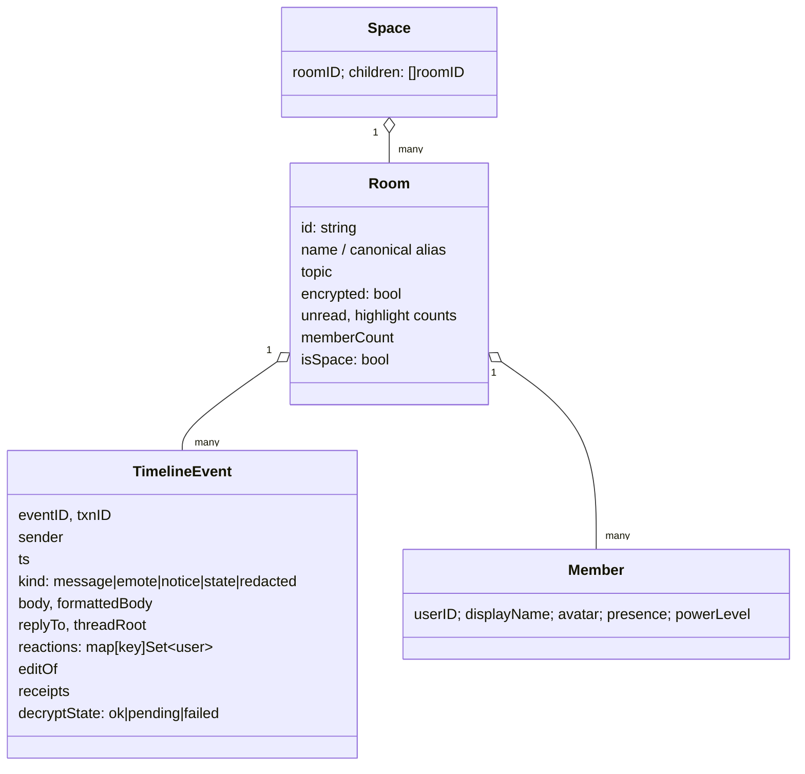
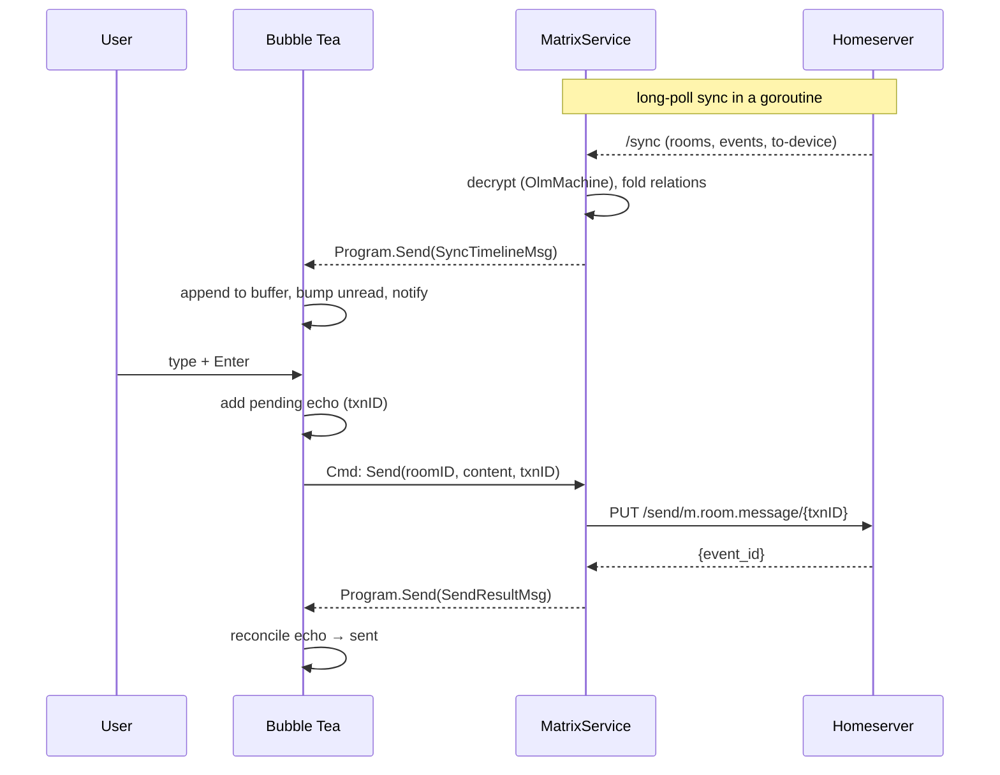
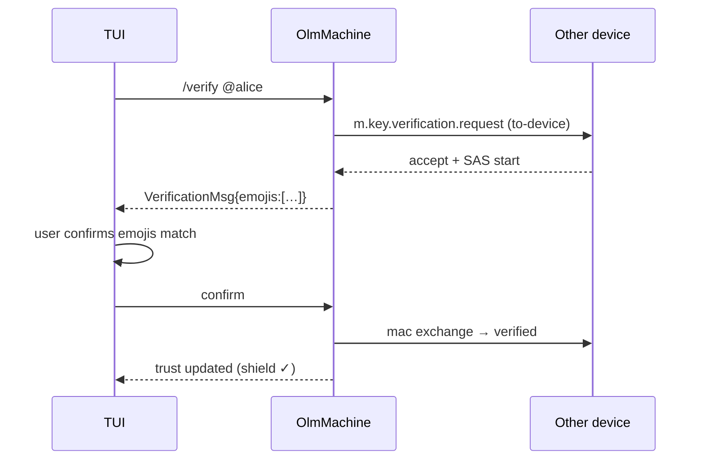

# Terminal Matrix Client — Design Doc

> **Status:** Draft / planning · **Owner:** @erancihan · **Working name:** `irx`
> (IRC-flavored Matrix, provisional — alternatives: `mxrc`, `termtrix`, `matty`)
> **Location:** provisional at `projects/matrix-tui/`; single design doc for now,
> no code scaffolded yet.

## 1. Summary

An **Element-class Matrix client that lives in the terminal and feels like IRC.**
Full-featured on the protocol side (end-to-end encryption, spaces, threads,
reactions, replies, redactions, media, read receipts, presence, typing) but
presented through a deliberately IRC-flavored TUI: numbered buffers, a
slash-command bar, server/status buffer, nick coloring, and compact one-line
messages.

Built in **Go**, with **[Bubble Tea]** (+ Bubbles / Lip Gloss / Glamour) for the
TUI and **[mautrix-go]** for the Matrix protocol, sync, and crypto.

The niche is intentional: `iamb` is Vim-modal, `gomuks` is its own TUI idiom.
Ours is **WeeChat/IRC muscle-memory over a modern Matrix stack** — the thing an
old IRC hand reaches for.

[Bubble Tea]: https://github.com/charmbracelet/bubbletea
[mautrix-go]: https://github.com/mautrix/go

## 2. Goals & non-goals

### Goals
- Full Matrix messaging parity with graphical clients for **text-centric** use:
  E2EE rooms, spaces, threads, replies, reactions, edits, redactions, receipts,
  typing, presence.
- **IRC ergonomics**: buffers, slash commands, keyboard-only, low-latency,
  runs great over SSH / inside tmux.
- Single self-contained binary. Fast cold start, low memory.
- Works on modest terminals; degrades gracefully (images → placeholders, no
  truecolor → 256-color, no unicode → ascii).

### Non-goals (for this project)
- VoIP / video calling (Element Call, WebRTC).
- Widgets, location sharing, polls UI (may render as fallback text).
- Being a bridge or a bot framework (mautrix already covers those).
- A mouse-first GUI. Mouse is supported but never required.

## 3. Prior art & our angle

| Client | Lang | Angle | Takeaway for us |
|---|---|---|---|
| [gomuks] | Go + mautrix-go | Own tcell/mauview TUI (now web) | Proves the Go + mautrix-go crypto path end to end. |
| [iamb] | Rust + matrix-rust-sdk | Vim-modal | Great threads/spaces UX to learn from; different muscle memory. |
| WeeChat + matrix.py | C/Python | IRC UX bolted on | This is the *feel* we want, natively. |
| matrix-commander | Python | Scriptable CLI | Non-interactive send/receive; complementary, not competing. |

[gomuks]: https://github.com/tulir/gomuks
[iamb]: https://github.com/ulyssa/iamb

**Our angle:** keep IRC's buffer model and command grammar as the *primary*
interface, and expose Matrix's richer primitives (threads, reactions, spaces)
as tasteful layers on top — never forcing them on someone who just wants to
type in a channel.

## 4. Tech stack

| Concern | Choice | Notes |
|---|---|---|
| Language | Go 1.22+ | Single binary, great concurrency for the sync loop. |
| TUI runtime | Bubble Tea | Elm architecture (Model / Update / View). |
| Widgets | Bubbles | `viewport`, `textarea`, `list`, `table`, `spinner`, `key`, `help`. |
| Styling | Lip Gloss | Layout, borders, adaptive light/dark, truecolor→256 fallback. |
| Markdown | Glamour | Render `m.text`/`formatted_body` HTML→terminal. |
| Matrix client | mautrix-go | Client-Server API, sync, state store. |
| Crypto | mautrix-go `crypto` + `cryptohelper` | Olm/Megolm, cross-signing, SAS, key backup. |
| Storage | SQLite via `dbutil` | State store + crypto store. cgo vs pure-Go: see §11 & §16. |
| Images | kitty / iTerm2 / sixel | Detected at runtime; placeholder otherwise. |
| Notifications | `gen2brain/beeep` | Desktop notify + terminal bell fallback. |
| Config | TOML (`BurntSushi/toml`) | XDG dirs via `adrg/xdg`. |

## 5. Architecture

Three layers, one hard boundary. The **Matrix side is concurrent** (goroutines
doing HTTP long-poll sync and crypto). The **UI side is single-threaded** (Bubble
Tea's Elm loop). They meet at exactly one seam: event handlers convert Matrix
events into `tea.Msg` values and inject them with `Program.Send`.

```mermaid
flowchart TB
  subgraph net["Matrix side (goroutines)"]
    HS[(Homeserver)]
    CLI["mautrix.Client\n+ Syncer"]
    CRY["crypto.OlmMachine\n(cryptohelper)"]
    HS <-->|CS API / long-poll| CLI
    CLI <--> CRY
  end

  subgraph core["Core / app state"]
    STORE["Store\nrooms · timelines · members\nspaces · receipts · echo"]
    SVC["MatrixService\nlogin · send · sync fan-out\nverify · backfill"]
  end

  subgraph ui["UI side (single-threaded Elm loop)"]
    PROG["Bubble Tea Program"]
    MODEL["RootModel\n(buffers, focus, layout)"]
    VIEWS["Views: buffer list ·\ntimeline · composer · statusbar"]
  end

  CLI -->|event handlers| SVC
  CRY --> SVC
  SVC --> STORE
  SVC -->|Program.Send(tea.Msg)| PROG
  PROG --> MODEL --> VIEWS
  MODEL -->|Cmd: send/join/verify| SVC
```

**Why this seam matters.** Bubble Tea forbids touching the model from other
goroutines. All async work (network, crypto, disk) happens in `tea.Cmd`s or in
mautrix's own goroutines; results re-enter the loop only as messages. This keeps
the UI deterministic and testable while the network does whatever it wants.

### 5.1 Package layout (intended)

```
projects/matrix-tui/
├── cmd/irx/main.go            # entrypoint, flag/config wiring
├── internal/
│   ├── matrix/                # mautrix-go wrapper
│   │   ├── service.go         #   login, sync fan-out, send, backfill
│   │   ├── crypto.go          #   cryptohelper setup, verification, key backup
│   │   └── events.go          #   Matrix event → domain event mapping
│   ├── store/                 # in-memory app state + SQLite persistence
│   │   ├── store.go           #   rooms, timelines, members, spaces, receipts
│   │   └── echo.go            #   local echo / txn reconciliation
│   ├── tui/                   # Bubble Tea
│   │   ├── root.go            #   RootModel: Update/View, focus, layout
│   │   ├── msg.go             #   tea.Msg types bridged from matrix layer
│   │   ├── buffers.go         #   buffer list / switching (IRC-style)
│   │   ├── timeline.go        #   scrollback viewport, rendering
│   │   ├── composer.go        #   textarea + slash-command parsing
│   │   ├── statusbar.go       #   server buffer / sync state / unread
│   │   ├── commands.go        #   slash-command registry & dispatch
│   │   ├── render/            #   message/thread/reaction/media renderers
│   │   └── theme.go           #   Lip Gloss styles, nick coloring
│   ├── notify/                # desktop + bell notifications, push-rule eval
│   └── config/                # TOML load/save, XDG paths, sessions
└── DESIGN.md                  # this file
```

### 5.2 The Elm loop, concretely

```go
type RootModel struct {
    svc      *matrix.Service
    store    *store.Store
    buffers  []Buffer      // ordered; index == IRC buffer number
    active   int
    focus    focusArea     // composer | timeline | bufferlist
    // …viewport, textarea, help, sizes…
}

func (m RootModel) Update(msg tea.Msg) (tea.Model, tea.Cmd) {
    switch msg := msg.(type) {
    case tea.KeyMsg:        return m.handleKey(msg)
    case SyncTimelineMsg:   return m.onTimeline(msg)   // from Program.Send
    case SyncReceiptMsg:    return m.onReceipt(msg)
    case VerificationMsg:   return m.onVerification(msg)
    case SendResultMsg:     return m.reconcileEcho(msg)
    case tea.WindowSizeMsg: return m.relayout(msg)
    }
    return m, nil
}
```

## 6. Domain model



Notes:
- **Local echo**: outgoing messages get a client-generated `txnID`, render
  immediately as `pending`, and reconcile to `sent` when the same `txnID`
  returns in `/sync` (or `failed` on error). This is what makes it feel as snappy
  as IRC.
- **Threads** are modeled as events with a `threadRoot`; the timeline shows a
  collapsed `[thread: N ▸]` affordance, expandable into a thread buffer.
- **Edits/reactions/redactions** are *relations*; we fold them into the target
  event rather than showing them as separate lines (with an optional "raw" mode).

## 7. Sync & event flow



Backfill (scrollback): when the timeline viewport nears the top, fire a
`Cmd` that calls `/messages` (via mautrix) with the stored `prev_batch` token,
prepend results, and keep scroll position stable.

## 8. UI / UX

### 8.1 Layout

```
┌─ spaces/rooms ─┬───────────────── #general ──────────────────────────┐
│ ▸ Home         │ topic: release planning · 12 members · 🔒 encrypted   │
│   1 #general • │──────────────────────────────────────────────────────│
│   2 #random    │ 12:31 <alice>  ship it friday?                        │
│ ▸ Work         │ 12:31 <bob>    +1  [👍 3]                             │
│   3 #dev  ‹3›  │ 12:32 <carol>  ↳ re: friday — needs QA first          │
│   4 @dan (dm)  │ 12:33 * alice waves                                   │
│                │ 12:34 <bob>    see thread [thread: 4 ▸]               │
├────────────────┤ 12:35 <you>    (sending…) on it                       │
│ status: synced │──────────────────────────────────────────────────────│
│ ~/irx  E2EE ✓  │ [#general] > /me is typing_                           │
└────────────────┴──────────────────────────────────────────────────────┘
```

- **Left:** collapsible spaces tree + buffer list. Unread `•`, highlight `‹n›`.
- **Center:** room header (topic/members/encryption), scrollback viewport,
  composer with a `[#buffer] >` prompt.
- **Bottom-left status:** the "server buffer" — homeserver, sync state, E2EE
  status, current profile — mirroring IRC's status window.

### 8.2 IRC flavor (the differentiator)

- **Buffers are numbered.** `Alt-1..9` jump; `Ctrl-N`/`Ctrl-P` cycle;
  `/win 3` or `/buffer 3` switch; `/close` closes. Buffer 0 is the server buffer.
- **Compact format:** `HH:MM <nick> message`, `* nick action` for emotes,
  nicks colored by a stable hash of the user ID.
- **MOTD on join:** print the room topic + member count like an IRC channel MOTD.
- **Slash-command grammar** mirrors IRC where it maps cleanly (full table in
  Appendix A): `/join`, `/part`, `/me`, `/msg`, `/query`, `/topic`, `/names`,
  `/whois`, `/invite`, `/kick`, `/ban`, `/nick` (→ display name).
- **Matrix-native commands** for the richer stuff: `/react`, `/reply`,
  `/thread`, `/edit`, `/redact`, `/upload`, `/verify`, `/space`.

### 8.3 Rendering the "full client" richness in a compact UI

| Feature | Compact rendering | Expanded view |
|---|---|---|
| Reply | `↳ re: <quoted first line>` above the message | `/reply` opens quoted composer |
| Reaction | `[👍 3] [😄 1]` appended to the line | `/react` picker; hover shows who |
| Thread | `[thread: N ▸]` affordance on the root | Enter → dedicated thread buffer |
| Edit | show latest, small `(edited)` marker | `raw` mode reveals edit history |
| Redaction | `<message deleted>` placeholder | keeps sender + ts |
| Media | `📎 image.png (240 KB) [view]` | inline (kitty/iTerm2/sixel) or `$PAGER`/xdg-open |
| Receipts | faint `read by 3` at latest read point | `/names` shows per-user read pos |
| Presence/typing | in member list + `alice is typing…` line | — |

### 8.4 Keybindings (default; remappable via config)

```
Enter        send            Ctrl-N / Ctrl-P   next / prev buffer
Alt-1..9     jump to buffer  PgUp / PgDn        scroll timeline
Ctrl-R       reply picker    Ctrl-T             open thread
Ctrl-U       upload file     Ctrl-K             react to selected
Tab          complete (nick / room / emoji / command)
Esc          leave mode / clear composer
Ctrl-C       quit            F1 / ?             help overlay
```

Everything routes through Bubbles' `key.Binding` so the help overlay and the
config remap file stay in sync automatically.

## 9. End-to-end encryption

Use mautrix-go's **`cryptohelper`**, which wires the `OlmMachine`, crypto store,
and sync together so encrypt/decrypt is largely transparent.

- **Device & session:** persist device ID + Olm account in the crypto store so
  we don't re-key on every launch.
- **Verification:** interactive **SAS (emoji/decimal)** flow, driven by
  `VerificationMsg` events into a modal. Support verifying *and* being verified.
- **Cross-signing:** bootstrap or reuse cross-signing keys; show room/user trust
  shields (✓ verified, ! unverified device present).
- **Key backup / recovery:** unlock via **Secure Storage** recovery key /
  passphrase (SSSS) so history decrypts across devices.
- **Undecryptable events:** render `🔒 unable to decrypt` with a retry (request
  keys via to-device), and reconcile in place when the key later arrives.
- **Sending to encrypted rooms:** share Megolm session with room devices per the
  room's trust policy (configurable: block-unverified vs. send-to-all).



## 10. Auth & config

- **Homeserver discovery** via `.well-known/matrix/client` from the user's MXID.
- **Login flows:** password, existing access token, and **SSO** (open the
  browser to the SSO URL, catch the redirect on a localhost loopback). Optional
  QR / device-code login later.
- **Session store:** access token + device ID in the OS keyring (`zalando/go-keyring`)
  with an encrypted-file fallback; never plaintext by default.
- **Config file** `~/.config/irx/config.toml`:

```toml
[account]
mxid = "@you:example.org"

[ui]
theme = "auto"          # auto | dark | light
compact = true
nick_colors = true
timestamps = "24h"

[behavior]
send_to_unverified = "warn"   # allow | warn | block
image_protocol = "auto"       # auto | kitty | iterm | sixel | none
notifications = "highlights"  # all | highlights | none

[keys]
# remaps, e.g. "next_buffer" = "ctrl+j"
```

## 11. Persistence

- **State store & crypto store** both on SQLite via mautrix-go's `dbutil`.
- **Timeline cache** for fast startup (recent N events per room) + `prev_batch`
  tokens for backfill.
- **cgo question:** libolm needs cgo; the pure-Go `goolm` path avoids it and
  keeps cross-compilation trivial. Decision tracked in §16 — leaning pure-Go
  (`modernc.org/sqlite` + `goolm`) so releases are `CGO_ENABLED=0`.

## 12. Notifications

- Evaluate **push rules** from `/sync` to decide highlight vs. normal vs. muted.
- On highlight/DM: `beeep` desktop notification + optional terminal bell +
  unread/highlight badges in the buffer list.
- Respect `notifications` config and per-room mute state.

## 13. Testing

- **Unit:** store folding (relations, echo reconciliation, redactions), command
  parser, push-rule eval, nick-color hashing.
- **TUI:** golden-file tests with **`teatest`** (`x/exp/teatest`) — drive keys,
  assert rendered frames.
- **Crypto:** verify encrypt→decrypt round-trips and SAS state machine against a
  second in-process account.
- **Integration:** spin up **Synapse or Conduit in Docker** in CI; run a
  scripted login → send → sync → decrypt → react → thread flow.
- **Manual matrix:** a checklist across kitty / iTerm2 / xterm / tmux+ssh for
  image rendering and color fallback.

## 14. Milestones

Target is the full client, but sequenced so each milestone is independently
usable and demoable.

| # | Milestone | Deliverable |
|---|---|---|
| **M0** | Skeleton | Bubble Tea app, config load, login (password/token), server buffer, sync loop wired via `Program.Send`. |
| **M1** | Read | Room/space list, timeline rendering, backfill, unread tracking, receipts display. |
| **M2** | Write | Composer, local echo, send text/emote, slash-command engine, IRC buffer switching. |
| **M3** | E2EE | cryptohelper integration, decrypt, SAS verification, cross-signing, key backup. |
| **M4** | Rich | Replies, reactions, edits, redactions, threads (collapsed + thread buffer). |
| **M5** | Media | Upload, download, inline image protocols + graceful fallback. |
| **M6** | Polish | Notifications + push rules, presence/typing, themes, keybind remap, help overlay. |
| **M7** | Ship | Docs, `goreleaser` binaries (linux/mac/arm), packaging, first tagged release. |

## 15. Risks & open questions

- **Bubble Tea ⟷ async seam:** the whole design leans on `Program.Send` from
  mautrix goroutines. Needs an early spike (in M0) to confirm throughput and
  backpressure under a busy sync.
- **Crypto correctness:** E2EE bugs are silent and dangerous. Budget real time
  for verification + key-backup edge cases; lean on mautrix's tested paths.
- **cgo vs pure-Go crypto:** affects cross-compilation and release ergonomics
  (§11). Spike `goolm` early.
- **Terminal image protocols** are a compatibility swamp — treat inline images
  as a nice-to-have with a solid text fallback, never a hard dependency.
- **Threads in a linear buffer:** UX is genuinely hard; prototype the
  collapsed-affordance + thread-buffer model before committing.
- **Naming/scope:** confirm the working name and whether this eventually becomes
  its own repo (a `projects/` submodule) vs. staying in-tree.

## Appendix A — Slash-command reference (draft)

```
IRC-mapped
  /join <alias|id>        /part [room]        /me <action>
  /msg <user> <text>      /query <user>       /topic [text]
  /names                  /whois <user>       /nick <display name>
  /invite <user>          /kick <user> [why]  /ban <user> [why]
  /win N  /buffer N  /close  /names  /clear

Matrix-native
  /react <emoji>          /reply <text>       /thread [text]
  /edit <text>            /redact [reason]    /upload <path>
  /verify <user|device>   /space <name>       /raw   /encrypt on|off
```

## Appendix B — Key libraries

- `github.com/charmbracelet/bubbletea`, `/bubbles`, `/lipgloss`, `/glamour`
- `maunium.net/go/mautrix` (client, sync, `crypto`, `crypto/cryptohelper`, `util/dbutil`)
- `modernc.org/sqlite` (pure-Go) · `github.com/adrg/xdg` · `github.com/BurntSushi/toml`
- `github.com/gen2brain/beeep` · `github.com/zalando/go-keyring`
- image: kitty graphics / iTerm2 inline / sixel (via e.g. `BourgeoisBear/rasterm`)

## Appendix C — References

- Matrix Client-Server API spec — https://spec.matrix.org/latest/client-server-api/
- mautrix-go — https://github.com/mautrix/go
- Bubble Tea — https://github.com/charmbracelet/bubbletea
- gomuks (prior art) — https://github.com/tulir/gomuks
- iamb (prior art) — https://github.com/ulyssa/iamb
