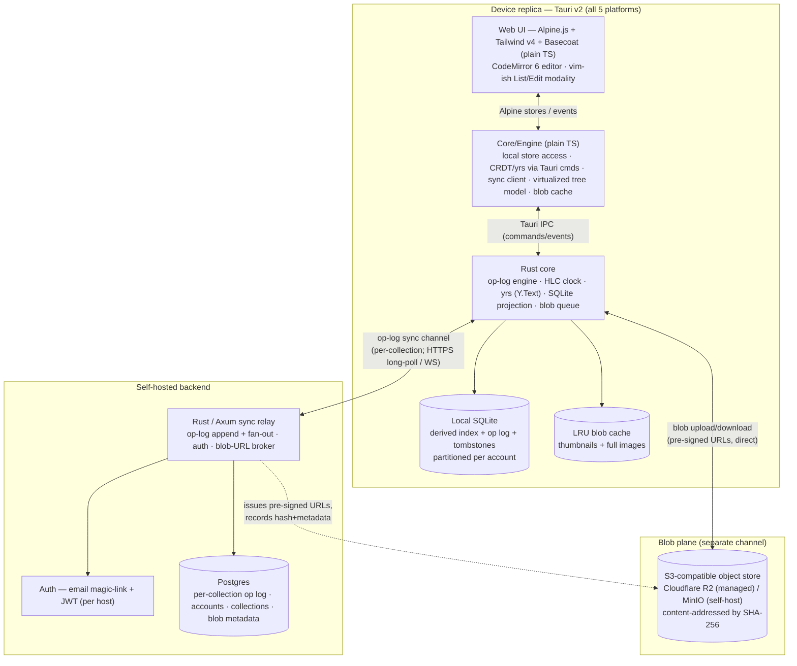
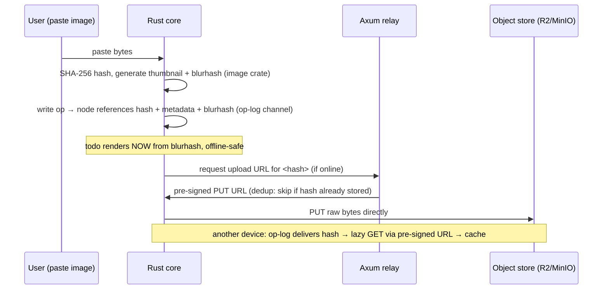
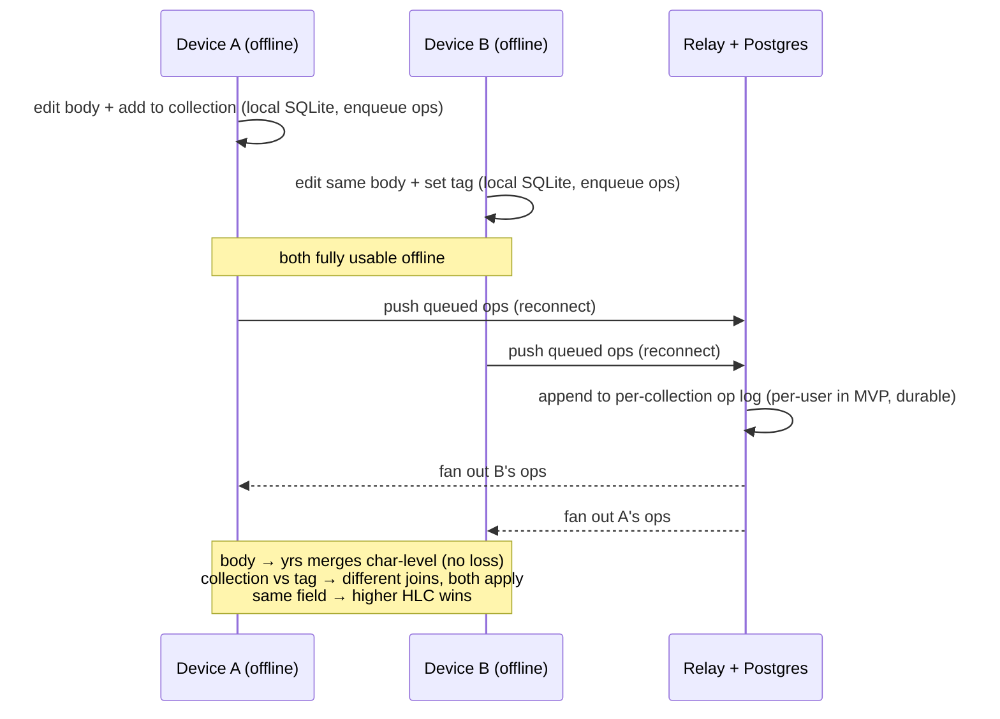

# Daybook — Technical Architecture

> How Daybook is built: a Tauri v2 (Rust core + Alpine.js / Tailwind / Basecoat web UI) client on all five platforms, a thin self-hosted Rust/Axum per-collection sync relay over Postgres, content-addressed blob storage, and a hybrid LWW + sequence-CRDT conflict model — server-agnostic and multi-account, presented as ADRs with an honest MVP-vs-scale fallback for the sync layer.

Sibling docs: [README](../README.md) · [01 — Product Requirements](01-product-requirements.md) · [03 — Data Model](03-data-model.md) · [04 — UX & Interaction](04-ux-and-interaction.md) · [05 — Roadmap](05-roadmap.md)

---

## 1. Architecture at a glance

Daybook is a **personal-first, offline-first, multi-device** application, built **sharing-ready**. Every device is a full replica: it reads and writes against a **local SQLite store** (partitioned per account) with zero network dependency, and reconciles with peers through a **thin sync relay** whenever connectivity is available. The relay is a dumb, durable pipe — it persists and fans out **per-collection operation logs** (effectively per-user in MVP); it is **not** the source of truth. The source of truth is the union of all replicas' op logs, deterministically projected into SQLite on each device.

Three properties drive every decision below:

1. **Capture must never block on the network.** All writes are local-first and enqueued; sync is a background reconciliation, never a gate.
2. **The body is a document; everything else is a record.** Markdown bodies get a real sequence CRDT (character-level merge); scalars/structure get simple, queryable last-writer-wins.
3. **The EOD report is derived, not stored.** It is a deterministic function over an append-only event log, so it must be reproducible and auditable — which shapes the data flow, not just the report engine.

Two **independent sync channels** meet at the client:

- **Op-log channel** — small, ordered, causal. Carries every state change (LWW field ops + Y.Text updates + tombstones). Relayed through Axum on **per-collection channels** (effectively per-user in MVP), persisted in Postgres.
- **Blob channel** — large, unordered, content-addressed. Carries raw image bytes directly between device and object store via pre-signed URLs. The op log carries only the SHA-256 hash + metadata + blurhash — **never the bytes**.

Keeping these planes separate is load-bearing: it keeps the op log small (fast sync, fast list render), lets a todo render instantly from its blurhash while the full image lazy-loads, and lets the blob cache evict without touching todo data.

---

## 2. Decision records (ADRs)

### ADR-001 — UI framework: Tauri v2, resolving the egui vs Tailwind + Basecoat tension

**Status:** Accepted (locked).

**Context.** The brief carries a latent contradiction the author already sensed: an interest in **egui** (Rust immediate-mode GUI) versus an explicit wish for **Tailwind + Basecoat** (Tailwind-based, shadcn/ui-compatible components). These are mutually exclusive by construction. Basecoat and Tailwind are **DOM/CSS artifacts** — they only exist inside a browser engine that has a DOM and a CSS cascade. egui/eframe is an **immediate-mode renderer** that paints its own widgets to a GPU canvas with **no DOM and no CSS**. There is no adapter that makes egui consume Tailwind classes or Basecoat components; "add Tailwind to egui later" is not a thing that can exist. Compounding this, egui's mobile story is immature (Android maturing via eframe PRs, iOS only through community `cargo-mobile` setups) — it fails the all-five-including-iOS hard requirement today.

Three further forces all point the same direction, **away from any own-widgets renderer**:

- The **markdown editing surface** (CodeMirror 6, inline live preview, image widgets) is a solved *web* problem and an unsolved *canvas* problem.
- The **heavy DOM keyboard UX** — `Ctrl+Enter` submit, `Shift+Enter`/`Enter` newline, arrow-key row navigation, `e`-to-edit, the vim-ish List/Edit modality — wants real DOM `keydown` events and focus management.
- The **notepad-simple capture** and **report-as-concatenation** goals want a plaintext text editor, which is native to the web and custom-built on a canvas.

**Decision.** Build the UI as a **web-rendered vanilla TypeScript + Alpine.js (v3, ~7KB) + Tailwind v4 + Basecoat** app, shipped to all five platforms via **Tauri v2** over a **Rust core**. Basecoat ([basecoatui.com](https://basecoatui.com)) is *"shadcn/ui without React"* — plain-HTML components driven by tiny Alpine scripts, fully compatible with shadcn/ui's OKLCH theme tokens, so the existing **"Ink" token palette is unchanged**. **Reject egui for the UI outright.** egui is retained only as a hypothetical fallback if a webview-free native binary ever outranks the Tailwind + Basecoat wish — which the brief says it does not.

**Core/engine vs Alpine view — why Alpine carries a full app.** All hard state — the local SQLite store, CRDT/`yrs` access (via Tauri commands), the sync client, the virtualized node-tree model, and the blob cache — lives in a **framework-agnostic plain-TypeScript core/engine layer**. Alpine is *only* the reactive view: `Alpine.store` + `Alpine.data`, with the `persist`, `focus`, and `intersect` plugins. The heaviest surfaces — the virtualized tree, the command palette, the CodeMirror integration — are **plain-TS modules / web components** that Alpine merely orchestrates. Honest hedge: Alpine targets *sprinkled* interactivity and a full app is the heavy end of its range — the core/engine split is the mitigation, and if any single surface strains it drops to a plain-TS web component with the core untouched. **daisyUI is the documented component fallback** if Basecoat's plain-HTML components prove too thin.

**Why Tauri v2 among web shells.** Every web-UI option honors the Tailwind + Basecoat wish, so the tiebreaker is: keep a Rust core (the thing that made egui attractive), cover all five platforms from one codebase, and stay lightweight.

| Option | 5 platforms incl. iOS | Tailwind + Basecoat | Rust core | Footprint | Verdict |
| --- | --- | --- | --- | --- | --- |
| **Tauri v2** | ✅ iOS (WKWebView) + Android (System WebView) + Win/mac/Linux, one codebase | ✅ real DOM | ✅ native Rust backend hosts sync/SQLite/blobs | ✅ OS WebView, tiny binary | **Chosen** |
| Flutter | ✅ all five, most uniform | ❌ own widget renderer — rebuild design system | ⚠️ Dart; Rust only as FFI sidecar | ⚠️ larger baseline | Fallback if native mobile polish > Tailwind + Basecoat |
| Compose Multiplatform | ✅ (iOS Stable since 1.8, May 2025) | ❌ own renderer | ❌ Kotlin/JVM; desktop ships a JVM | ⚠️ JVM on desktop | Fallback |
| Electron / Capacitor-desktop | ✅ via two runtimes | ✅ real DOM | ❌ JS/Node backend | ❌ bundles Chromium | Rejected — heavy, no Rust, split runtime |
| .NET MAUI | ❌ Linux "not planned" | ❌ XAML widgets | ❌ | — | Rejected — no first-class Linux |
| React Native + RNW | ❌ no first-party Linux desktop | ❌ RN primitives, not DOM | ❌ | — | Rejected — no React by preference; also fragmented, no Linux |
| egui / eframe | ❌ iOS not production-ready | ❌ **impossible by construction** | ✅ pure Rust | ✅ tiny | Rejected for UI |

**Consequences.**
- ✅ One codebase satisfies **both** hard constraints at once (all five incl. iOS **and** Tailwind + Basecoat), with the sync engine, SQLite, `yrs`, and image storage living natively in Rust.
- ✅ Rich text editing, DOM keyboard handling, and CSS theming are all first-class.
- ⚠️ **Tauri mobile is stable-API but not feature-complete.** Some desktop plugins lack iOS/Android implementations — budget hand-written native code for gaps (image attach, background sync). Validate an **iOS/Android build spike** (capture, image attach, background sync) *before* committing.
- ⚠️ **Mobile CI/CD is immature** — `tauri-action` mobile builds were still in progress into 2026; plan to script iOS/Android signing and release pipelines by hand.
- ⚠️ **WebView divergence** — WKWebView (iOS), Android System WebView, WebView2 (Windows), and **WebKitGTK (Linux, the weakest renderer)** differ on CSS and keyboard/IME. The heavy keyboard UX and markdown editor need per-platform QA; **avoid heavy blur/filter effects** that tax WebKitGTK (see [04 — Design System](04-ux-and-interaction.md)).

---

### ADR-002 — Backend, sync engine, and conflict model: thin Rust relay + hybrid conflict resolution

**Status:** Accepted (locked). Fallback path defined in §7.

**Context.** The workload is **personal-first — one user across a few of their own devices — write-first, and document-shaped** (markdown bodies + nested promotable sub-items + attached images), with **sharing left as a hook** (see [Sharing model](#sharing-model)). This creates a genuine tension: a **document CRDT** is right for the free-form body, but the queryable axes that power the EOD report (collection, tag, status, dates) want a **relational index**. The honest answer is a **hybrid**, not a pure play — and that hybrid is precisely why no turnkey engine fits:

| Turnkey engine | Why it's wrong here |
| --- | --- |
| PowerSync / Turso / Zero / InstantDB | Relational **LWW** — clobbers concurrent markdown text (wrong conflict model for bodies). |
| ElectricSQL (electric-next) | **Read-path only** — no offline mutation queue; you'd build the hard half yourself. |
| Convex | **Server transactions** — requires connectivity, cannot write offline. Disqualifying. |
| cr-sqlite | Would have unified schema + CRDT, but **stalled since Oct 2024** — bet-the-app risk. |

**Decision.** A **self-hosted thin Rust (Axum) sync relay** that relays and persists **per-collection operation logs to Postgres** (a **Collection** is the sync/permission boundary — see [Sharing model](#sharing-model)), with **email magic-link + JWT** auth **per host**. Each device holds a **local SQLite store** (partitioned per account) and syncs **per-collection op-log channels** — forward-looking, though MVP is effectively **one channel per user**. The conflict model is **hybrid**:

- **Per-field last-writer-wins registers** for all scalars, enums, FKs, and the fractional `order_key`, stamped with a **Hybrid Logical Clock** (HLC / Lamport) so causality — not wall-clock skew — decides the winner.
- **A sequence CRDT (Yjs `Y.Text`, hosted in the Rust core via `yrs`)** for the markdown body only.
- **Tombstone soft-deletes** with **causal-watermark GC** (never GC before every replica has observed the delete, or you resurrect deleted todos).

All CRDT access sits **behind a Rust trait** so the body engine can be swapped later.

**Why this split.** Genuine concurrent conflicts are rare (one human, a few devices), but when two devices edit the same long markdown body offline, **character-level LWW loss is the exact failure that feels broken**. So the body earns a real sequence CRDT while everything else stays simple, queryable LWW. Modeling **collections as a tombstoned many-to-many join (`NODE_COLLECTION`)** and tags as a tombstoned join keeps the two axes distinct *and* both mergeable. The append-only event log is what makes the EOD report deterministic and auditable.

**Why Yjs (not Loro) for the body.** The load-bearing integration is the editor binding — **`y-codemirror.next` is the most-proven CodeMirror↔CRDT binding**. Because the node tree and promotion are modeled with `parent_id` + fractional index under **LWW** (see [03 — Data Model](03-data-model.md)), we do **not** need Loro's movable-tree CRDT — which removes Loro's youth/bus-factor risk. `yrs` (Rust Yjs) was still closing feature parity in mid-2026, so the trait boundary + pinned versions + snapshot/update round-trip tests are mandatory, not optional.

**Consequences.**
- ✅ Offline-first by construction; capture never blocks on the network.
- ✅ EOD queries are plain SQL over a relational projection — trivial, fast.
- ✅ Body edits merge losslessly; structure/scalars stay simple and mergeable.
- ⚠️ **You own the relay, auth, and projection.** Real ops load for a small team (mitigation: managed Postgres + R2, only the thin relay self-hosted).
- ⚠️ **The SQLite index can drift from the CRDT source of truth.** Treat SQLite as a **pure deterministic projection**, rebuildable from the op log; never hand-edit it.
- ⚠️ **Op-log / CRDT / tombstone growth** over years of daily use degrades load — schedule shallow-snapshot compaction and tombstone GC **behind a causal watermark** (see §4.4).

---

### ADR-003 — Blob / image storage: content-addressed on a separate channel

**Status:** Accepted (locked).

**Context.** Todos can attach images, which must sync and store across devices, render fast in a list, and degrade gracefully offline. Putting image bytes inside synced rows (SQLite blobs in the CRDT/op log) **bloats the log, slows sync, and slows list render**. Per-todo path-only storage gives no dedup and no integrity.

**Decision.** Store blobs **content-addressed by SHA-256** in an **S3-compatible object store** (**Cloudflare R2** managed for MVP; **MinIO** as the self-host option), on a **separate sync channel** from the op log. The synced data holds only the **hash + metadata + a small thumbnail/blurhash inline**; **raw bytes live outside the CRDT**. Thumbnails are generated **on-device** via the Rust `image` crate, with an **offline upload/download queue** and an **LRU size-capped local blob cache**.

**Consequences.**
- ✅ Bytes out of the CRDT keeps the log small and list render fast.
- ✅ Content addressing gives **free dedup and integrity** (hash = identity).
- ✅ A todo renders immediately from its blurhash while the full image lazy-loads; the cache evicts without touching todo data.
- ⚠️ **The two channels can desync** — a todo may reference an attachment whose bytes haven't downloaded yet. The **UI must degrade gracefully to the blurhash/thumbnail** and retry the blob fetch.
- ⚠️ Local cache growth needs an enforced **LRU size cap**.

---

## 3. Cross-platform strategy

One **Alpine + TypeScript UI** (over a plain-TS core/engine) + one Rust core, compiled to five targets. The **web layer is identical everywhere**; only the Rust core's platform bindings and the WebView engine differ.

| Platform | WebView engine | Role | Notes |
| --- | --- | --- | --- |
| **Windows** | WebView2 (Chromium) | Full desktop | First-class; primary keyboard-driven surface. |
| **macOS** | WKWebView | Full desktop | First-class. |
| **Linux** | WebKitGTK | Full desktop | **Weakest renderer** — avoid heavy blur/filters; extra CSS/IME QA; WebKitGTK version varies by distro. |
| **iOS** | WKWebView | Fast capture + browse + report view | Soft `Return` **must stay a newline**; submit via on-screen accessory button. `contentEditable`/IME quirks handled by CodeMirror's self-managed input layer. |
| **Android** | Android System WebView | Fast capture + browse + report view | Same capture-focused scope as iOS. |

**Desktop is first-class; mobile is scoped to fast capture, read/browse, and report viewing** for MVP — matching the app's core loop and staying inside Tauri mobile's current envelope. The keymap's touch equivalents (gestures + soft-keyboard accessory Submit) are specified in [04 — UX & Interaction](04-ux-and-interaction.md).

---

## 4. Offline-first sync & conflict resolution

### 4.1 The op log

Every state change is an **operation** appended to a local, monotonic, per-device op log, then relayed. Each op carries an **HLC timestamp** `(wall_clock, logical_counter, device_id)` so peers order causally, not by unreliable wall clocks.

Op kinds:

| Kind | Payload | Merge rule |
| --- | --- | --- |
| `field_set` | `node_id`, `field`, `value`, `hlc` | **LWW register** — highest HLC wins per field. |
| `body_update` | `node_id`, Y.Text binary update | **Sequence CRDT** — `yrs` merges; commutative & idempotent. |
| `tag_add` / `tag_remove` | `node_id`, `tag_id`, `hlc` | Tombstoned join — add/remove are LWW per `(node,tag)` pair. |
| `collection_add` / `collection_remove` | `node_id`, `collection_id`, `hlc` | Tombstoned **`NODE_COLLECTION`** join — add/remove are LWW per `(node,collection)` pair (many-to-many). |
| `node_create` | `node_id` (UUIDv7/ULID), initial fields | Idempotent by id (client-generated for offline create). |
| `node_delete` | `node_id`, `hlc` | **Tombstone** — soft delete; GC only behind causal watermark. |
| `promote` | `node_id` | Sets `promoted=true` in place; emits an event (no row copy). |

Because ids are **client-generated UUIDv7/ULID**, offline creation needs no server round-trip, and every op is **idempotent** — replaying the log any number of times yields the same SQLite state.

### 4.2 The two-write model

### 4.3 Conflict resolution — worked cases

| Concurrent edit | Resolution |
| --- | --- |
| Two devices append text to the same body | **Both survive** — Y.Text merges character-level; no clobber. |
| Device A sets status=Done, B sets status=Active | **Higher HLC wins** — single enum field, LWW. The loser is lost (acceptable for a single scalar). |
| A adds tag `#urgent`, B adds tag `#home` | **Both apply** — distinct join rows. |
| A adds node to collection **Work**, B to collection **Life** | **Both apply** — distinct `NODE_COLLECTION` rows (collections are many-to-many). |
| A reorders a node, B reorders elsewhere | **Both apply** — each writes exactly one fractional `order_key`; no reindex, no server round-trip. |
| A deletes a node, B edits its body | **Tombstone wins on causal-later delete**; if edit is causally concurrent, node stays tombstoned (delete is terminal). |
| Same-position concurrent inserts (fractional index collision) | **Per-client jitter suffix** on the `order_key` breaks ties deterministically; background rebalancing bounds key growth. |

### 4.4 Tombstones & compaction

Soft-deletes leave tombstones so a delete propagates and cannot be resurrected by a straggler op. **GC runs only behind a causal watermark** — the minimum HLC every known replica has acknowledged. Premature GC (before all replicas observe the delete) resurrects deleted todos, so the watermark is a hard invariant. Op-log/CRDT compaction (shallow snapshots) and periodic fractional-index rebalancing are scheduled background jobs, deferred past MVP (see [05 — Roadmap](05-roadmap.md)).

---

## 5. Security & privacy

| Concern | MVP posture | Later |
| --- | --- | --- |
| **Auth** | **Email magic-link** (passwordless) → issues a **JWT** **per host**; refresh-token rotation. Self-hostable, no password store to breach; each account authenticates against its own host. | OAuth providers; passkeys. |
| **Transport** | TLS everywhere (op-log channel + pre-signed blob URLs). | — |
| **At rest (server)** | Postgres + object store encrypted at rest; blobs are **content-addressed** (hash = integrity check on download). | — |
| **Blob access** | Time-limited **pre-signed URLs**; clients never hold long-lived store credentials. | — |
| **End-to-end encryption** | **Explicitly deferred non-goal.** Daybook is **TLS-only** (transport); at rest, data lives on the **self-hosted server's disk/DB**. **No client-side E2EE** — deliberately traded away so **server-side search** stays feasible. | Per-user E2EE (would forfeit server-side search). |

**Why TLS-only, not E2EE.** Your todos mix sensitive **work and life** data, so client-side E2EE (encrypt bodies + blobs before they touch the server) is a tempting end state. Daybook **deliberately defers it as a non-goal**: E2EE would **block server-side search** and add key-management complexity. Instead, Daybook relies on **TLS in transit** plus **at-rest encryption on the self-hosted server's disk/DB** — and self-hosting is the privacy story: your data sits on **your** Postgres and **your** object store. Revisiting E2EE later means forfeiting server-side search (see [05 — Roadmap](05-roadmap.md), Open Questions).

### Sharing model (Collections as the ACL unit) — later

Daybook is **personal-first but sharing-ready**, and the **Collection** is the unit of sharing and the **ACL boundary**. The ownership + membership hooks land **now**, even though MVP grants no shares:

- `COLLECTION.owner_id` — every collection has an owner.
- `COLLECTION_MEMBER { collection_id, user_id, role: owner | collaborator | viewer, tombstone }` — the membership/permission join, mergeable like any other tombstoned join.
- **ACL granularity = the Collection** (not per-node). MVP ships **empty / owner-only** ACLs.
- **Sync = per-collection channels** (forward-looking); in MVP this collapses to **one channel per user**.

Because sharing rides the same tombstoned-join + per-collection-channel machinery already built for sync, opening it up later is a **policy change, not a protocol rewrite**.

### Accounts & multi-host

Daybook is **server-agnostic and multi-account**. An **Account = { host URL, credentials, identity on that host }**. One client can connect to **multiple hosts**, each with its own accounts and collections:

- The UI carries a **host / account switcher** and an **"add / select server"** flow, and on top of it presents **both** an **aggregate cross-host view** (all connected accounts combined into one list/report) **and** a **per-host detail view** (scoped to a single account).
- The local store is **partitioned per account** — namespaced (or separate) SQLite per account, so no host's data can leak into another's projection.
- **MVP may ship single-account**, but the **account model and per-account partitioning are foundational in MVP** (the switcher UI is designed in), so multi-host is not a later retrofit.

### AI / MCP — not planned

Report generation is **deterministic and offline** — a pure function over the event log, no bundled LLM, no MCP integration. AI-authored narratives and any Model Context Protocol server are **out of scope for the current design** and not on the roadmap. The TLS-only posture wouldn't preclude adding something like this someday, but it is an explicit non-goal here.

---

## 6. Component breakdown

### Client (Tauri v2 device replica)

| Component | Tech | Responsibility |
| --- | --- | --- |
| **Web UI shell** | Alpine.js (v3) + Tailwind v4 + Basecoat (plain TS) | Reactive **view layer only** (`Alpine.store` / `Alpine.data`) over the plain-TS core/engine; renders list/edit surfaces, command palette, EOD report view; owns the vim-ish List/Edit modality and keymap. |
| **Core/Engine** | Plain TypeScript (framework-agnostic) | Owns all hard client state — local store access, CRDT/`yrs` calls via Tauri commands, sync client, virtualized node-tree model, blob cache; hosts the heaviest surfaces (virtualized tree, command palette, CodeMirror integration) as plain-TS modules / web components Alpine orchestrates. |
| **Editor** | CodeMirror 6 (markdown lang, inline live preview) + `y-codemirror.next` | Notepad-simple capture; binds each body to its `Y.Text`; image paste → attach. |
| **IPC bridge** | Tauri commands + events | Typed calls UI↔core; core pushes op/sync/blob events up to the UI. |
| **Op-log engine** | Rust | Append, order (HLC), apply, and reconcile ops; drives the SQLite projection. |
| **CRDT body engine** | `yrs`, **behind a Rust trait** | Y.Text create/merge/snapshot; swappable if `yrs` parity gaps bite. |
| **SQLite projection** | Rust + `sqlx`/SQLite | Deterministic relational index of nodes/tags/collections/events for querying + EOD; **partitioned per account**. |
| **Blob subsystem** | Rust `image` crate + queue | SHA-256 hashing, thumbnail/blurhash generation, offline up/download queue, LRU cache. |
| **Sync client** | Rust (HTTPS long-poll / WS) | Pushes/pulls ops; requests pre-signed blob URLs; handles retry/backoff. |

### Server (self-hosted backend)

| Component | Tech | Responsibility |
| --- | --- | --- |
| **Sync relay** | Rust / **Axum** | Append **per-collection** ops to Postgres; fan out to the collection's members' devices (that user's own devices in MVP); broker pre-signed blob URLs. Deliberately **thin** — no business logic, no conflict resolution (that's client-side). |
| **Auth service** | Axum + JWT | Email magic-link issue/verify; token rotation; **scoped to this host** (accounts are per-host). |
| **Op-log store** | Postgres | Durable **per-collection** op log; accounts; collections + memberships; blob metadata (hash → size/type/refs). |
| **Object store** | Cloudflare R2 (managed) / MinIO (self-host) | Content-addressed raw blob bytes. |

---

## 7. Deployment: self-host vs managed, and the sync-layer fallback

### 7.1 Launch posture (recommended for MVP)

**Managed pieces + one thin self-hosted relay.** Do not stand up everything from scratch on day one.

| Piece | MVP | Full self-host option |
| --- | --- | --- |
| Blob store | **Cloudflare R2** (managed) | MinIO |
| Postgres | **Managed Postgres** | Self-run Postgres |
| Sync relay | **Small VPS** running the Axum binary | Same, bundled |
| Auth | In-relay (magic-link + JWT), **per host** | Same |

This keeps ops load proportional to a solo/small team while preserving the self-host path — the relay is a single Rust binary, and swapping R2→MinIO / managed-PG→self-PG is a config change, not a rewrite. Hosting posture is a live open question (see [05 — Roadmap](05-roadmap.md)).

### 7.2 Honest MVP-vs-scale fallback for the sync layer

The **target architecture** (ADR-002) is the hybrid: custom Axum relay + HLC-LWW + `yrs` body CRDT. It is the correct end state, **but** it means building the relay, auth, projection, and CRDT integration yourself, against a `yrs` that was still maturing in mid-2026. If that is too much to carry for a first ship, there is a clean de-risking path:

| | **MVP fallback (de-risked)** | **Target (locked architecture)** |
| --- | --- | --- |
| Sync engine | **PowerSync Open Edition** (self-host) or **Turso sync** over device SQLite | Custom Axum op-log relay |
| Conflict model | **Per-field LWW everywhere** (incl. body) | Hybrid: LWW scalars + **Y.Text CRDT** body |
| Body-merge risk | A **rare** concurrent same-body edit on two offline devices **loses one side** | **No loss** — character-level merge |
| Build cost | Low — turnkey offline queue + SQL | High — you own relay/auth/projection |
| When acceptable | Single-user-multi-device, edits rarely collide; ship fast, learn | Once the body-loss failure is worth eliminating |

**Why the fallback is safe to take and safe to leave.** For a mostly single-user app, concurrent edits to the *same* body are rare, so per-field LWW is an acceptable early trade. Crucially, **the Tauri shell, the data model, the editor, and the blob design do not change** between the two — only the body's storage/merge does, and that already sits **behind the Rust trait** (ADR-002). So the migration is: swap the body engine from an LWW field to `yrs`, and switch the sync transport from PowerSync/Turso to the Axum relay. Keep edits append-friendly and warn on multi-device concurrent editing until the CRDT lands.

> **Rule of thumb:** ship the fallback only if relay-build time is the critical-path risk. If the team can build the thin Axum relay, go straight to target — the relay is small, and retrofitting a CRDT body onto an LWW-shaped sync later is more disruptive than starting with the trait boundary in place.

---

## 8. Key risks (architecture-specific)

| Risk | Mitigation |
| --- | --- |
| Tauri mobile not feature-complete; mobile CI immature | iOS/Android build spike before commit; hand-roll signing/release; budget native-gap code. |
| WebView divergence (esp. WebKitGTK on Linux) | Per-platform keyboard/IME + CSS QA; no heavy blur/filters; CodeMirror's self-managed input layer. |
| Mobile soft `Return` must stay newline | Submit lives on an on-screen accessory button — never hijack `Return` (breaks capture on phones). |
| `yrs` parity gaps | Trait boundary + pinned versions + snapshot/update round-trip tests; swap-in path defined. |
| SQLite projection drifts from CRDT truth | SQLite is a pure derived projection, rebuildable from the op log; never hand-edited. |
| Op-log / tombstone bloat over years | Shallow-snapshot compaction + tombstone GC **only behind a causal watermark**. |
| Two channels desync (blob not yet downloaded) | UI degrades to blurhash/thumbnail; retry blob fetch. |
| Relay + PG + store + auth ops load | Managed R2 + Postgres; only the thin relay self-hosted. |
| No E2EE (deferred non-goal) | TLS in transit + at-rest server encryption + self-host; E2EE deferred deliberately (would block server-side search). |

See [05 — Roadmap](05-roadmap.md) for the full risk register and open questions, and [03 — Data Model](03-data-model.md) for the NODE schema, event log, and EOD report engine these decisions serve.
