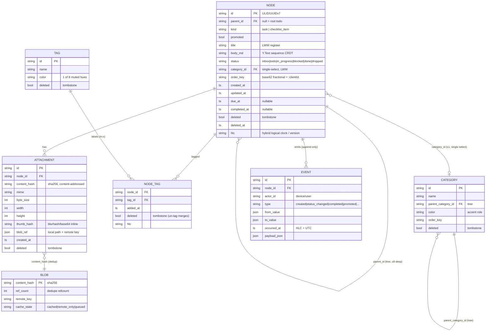
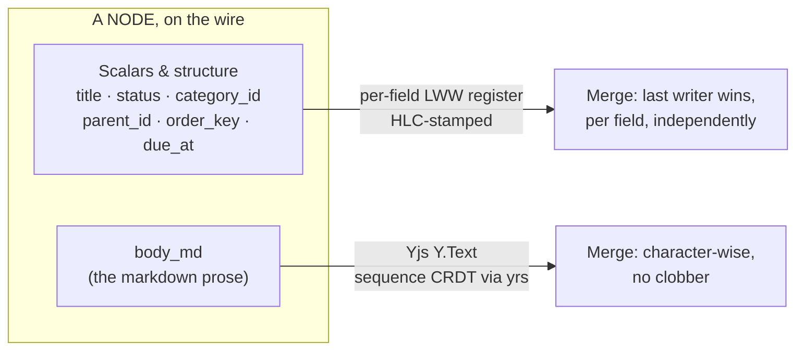
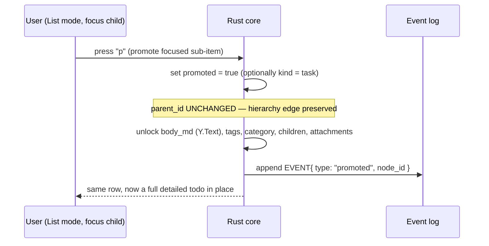
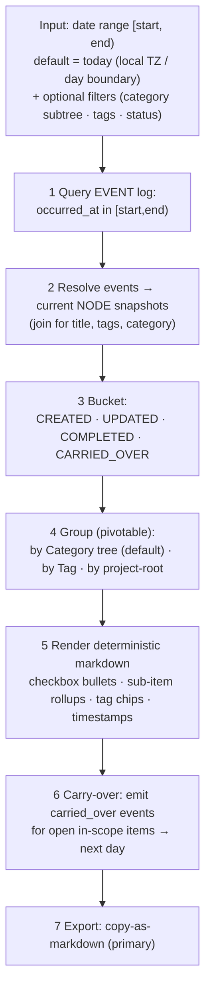

# Cadence — Data Model & EOD Report Engine

> One unified NODE table (a todo and a promoted sub-item are the same row), two distinct classification axes, a hybrid CRDT, and an append-only event log that makes the end-of-day report deterministic and auditable.

**Status:** Planning / design artifact (no application code yet).
**Related docs:** [Product Requirements](01-product-requirements.md) · [Architecture](02-architecture.md) · [UX & Interaction](04-ux-and-interaction.md) · [Roadmap](05-roadmap.md) · [Overview](../README.md)

---

## 1. Modeling Principles

Every entity choice below is driven by five hard requirements from the [PRD](01-product-requirements.md): promotable sub-items (GitHub-issue-style), two distinct organizing axes, offline-first sync, image attachments stored in the app, and an automatic EOD report.

| Principle | Consequence |
| --- | --- |
| **One node, one table.** A todo and a promoted sub-item are *the same row*. | Promotion is a flag flip, not a migration. Uniform tree query and sync. |
| **Client-generated IDs.** UUIDv7/ULID strings, minted on-device, stable, globally unique, never reused. | Create fully offline with no server round-trip; IDs sort roughly by creation time. |
| **The event log is the source of truth for history.** Every meaningful state change appends an immutable `EVENT`. | "What did I do today" is a query, not a reconstruction. The same range always reproduces the same report. |
| **SQLite is a derived projection.** The local relational store is rebuilt deterministically from the CRDT + op log. | Fast queryable index for lists and reports; never hand-edited as a primary. |
| **Two merge mechanisms, deliberately.** Per-field LWW registers for scalars/structure; a `Y.Text` sequence CRDT only for the markdown body. | Cheap scalar sync; character-level merge exactly where losing text feels broken. |
| **Blob bytes live outside the CRDT.** Attachments sync only a hash + metadata + thumbnail inline; raw bytes travel a separate channel. | The op log stays small; list rendering stays fast; images dedup by content. |

> **CRDT note (locked).** The body sequence CRDT is **Yjs `Y.Text`, hosted in the Rust core via `yrs`** — see [Architecture ADR-002](02-architecture.md#conflict-model). Loro was evaluated and rejected. All CRDT access sits behind a Rust trait so the body engine can be swapped later.

---

## 2. Entity–Relationship Diagram



---

## 3. Entities

### 3.1 NODE — the todo *and* the promoted sub-item

The core of the model. A checklist child and a full detailed todo are **the same schema**; they differ only by their `parent_id` edge, their `kind`, and the `promoted` flag. This is exactly how GitHub rebuilt sub-issues (2024–25): a real hierarchical relationship, not markdown task-list checkboxes.

| Field | Type | Merge | Notes |
| --- | --- | --- | --- |
| `id` | string (ULID/UUIDv7) | immutable | Client-generated, stable, globally unique, never reused. |
| `parent_id` | string? → NODE.id | LWW | `null` = root todo; else its parent. Self-referential 1→many tree. Cap depth ≈ 8; guard cycles client-side. |
| `kind` | enum `{task, checklist_item}` | LWW | A `checklist_item` is a lightweight child; `promoted` levels it up. |
| `promoted` | bool | LWW | `true` once "converted to an issue" — unlocks body, tags, category, children, attachments. |
| `title` | string | LWW register | Short one-line title (rendered in list rows and report bullets). |
| `body_md` | markdown text | **`Y.Text` CRDT** | Literal markdown string; concurrent edits merge character-wise. Report = concatenation of bodies. |
| `status` | enum `{inbox, todo, in_progress, blocked, done, dropped}` | LWW | Drives report buckets. `done` sets `completed_at`. |
| `category_id` | string? → CATEGORY.id | LWW | **At most one** (single-select bucket). See §4. |
| `order_key` | string | LWW | base62 fractional index + `:clientId` jitter suffix. Siblings sort lexicographically. See §5.3. |
| `created_at` | ts (HLC + UTC) | set-once | |
| `updated_at` | ts (HLC + UTC) | LWW | |
| `due_at` | ts? | LWW | Optional; feeds carry-over scope. |
| `completed_at` | ts? | LWW | Set on `status → done`; cleared on reopen. |
| `deleted` | bool | tombstone | Soft delete; row retained for merge, GC'd behind a causal watermark. |
| `deleted_at` | ts? | | |
| `hlc` / `version` | string / vector | — | Hybrid logical clock + per-field version for LWW tie-breaking. |

**Relations:** NODE 1—* NODE (parent) · NODE *—1 CATEGORY · NODE *—* TAG (via NODE_TAG) · NODE 1—* ATTACHMENT · NODE 1—* EVENT.

> **Cheap vs. heavy nodes.** A `checklist_item` that was never promoted carries no `Y.Text` doc, no tags, no category — it stays a trivial row. The `Y.Text` body and its CRDT metadata are only instantiated when a body is actually edited, so a long checklist does not pay document overhead per item.

### 3.2 CATEGORY — axis 1 (single, hierarchical bucket)

| Field | Type | Merge | Notes |
| --- | --- | --- | --- |
| `id` | string | immutable | |
| `name` | string | LWW | e.g. `ClientX`. |
| `parent_category_id` | string? → CATEGORY.id | LWW | Tree, e.g. `Work > ClientX`. |
| `color` | string | LWW | Accent/structural role in the design system. |
| `order_key` | string | LWW | Sibling ordering (same scheme as nodes). |
| `deleted` | bool | tombstone | |

A node references **at most one** category. Deleting a category tombstones it; nodes keep the FK until reassigned (UI shows "Uncategorized").

### 3.3 TAG + NODE_TAG — axis 2 (many-to-many label)

`TAG` is the vocabulary; `NODE_TAG` is a **tombstoned join** so that tagging on one device and un-tagging on another merge correctly.

| TAG | Type | Merge | Notes |
| --- | --- | --- | --- |
| `id` | string | immutable | |
| `name` | string | LWW | e.g. `p1`, `call`, `urgent`. |
| `color` | string | LWW | One of a controlled 8-hue muted chip set (kept visually distinct from category accents). |
| `deleted` | bool | tombstone | |

| NODE_TAG | Type | Merge | Notes |
| --- | --- | --- | --- |
| `node_id` | string → NODE.id | — | Composite key `(node_id, tag_id)`. |
| `tag_id` | string → TAG.id | — | |
| `added_at` | ts | — | |
| `deleted` | bool | **tombstone** | Un-tag = set `deleted=true`; a later-HLC delete wins over a concurrent re-add per policy. |
| `hlc` | string | — | Tie-breaker for concurrent add/remove. |

> **Why two axes and not one.** Category answers *"which bucket does this live in?"* (single-select, hierarchical, structural) and Tag answers *"what labels cut across buckets?"* (many-to-many, flat, cross-cutting). Merging them into one axis would violate the hard two-axis requirement and break report pivots — you could not report *only work items* (category subtree) *tagged `#urgent`* (tag) at the same time.

### 3.4 ATTACHMENT + BLOB — images stored in the app

Metadata lives in the synced data; **bytes live outside the CRDT** on a separate content-addressed channel (see [Architecture ADR-003](02-architecture.md#blob-storage)).

| ATTACHMENT | Type | Merge | Notes |
| --- | --- | --- | --- |
| `id` | string | immutable | Content-addressed **child row** of a node. |
| `node_id` | string → NODE.id | — | Owner todo. |
| `content_hash` | string | set-once | `sha256` — free dedup + integrity. |
| `mime` | string | set-once | `image/png`, `image/jpeg`, … |
| `byte_size`, `width`, `height` | int | set-once | |
| `thumb_hash` | string | set-once | Small blurhash/base64 thumbnail, inline in the synced data — renders instantly offline. |
| `blob_ref` | json | LWW | `{ local: "blobs/…", remote: "s3://…" }`. |
| `created_at` | ts | set-once | |
| `deleted` | bool | tombstone | |

`BLOB` is device-local bookkeeping for the raw bytes (not itself synced as todo data): `content_hash` PK, `ref_count` for dedupe GC, `remote_key`, and `cache_state ∈ {cached, remote_only, queued}`. The op log carries only the hash + metadata + `thumb_hash`; an offline upload/download queue moves bytes independently, and an **LRU size-capped** local cache evicts without touching todo data. If a todo references an attachment whose bytes haven't arrived, the UI degrades to the `thumb_hash` (never errors).

### 3.5 EVENT — the append-only activity log

Immutable, never edited or deleted (only compacted behind a watermark). This is the report's source of truth and doubles as the sync op stream.

| Field | Type | Notes |
| --- | --- | --- |
| `id` | string | |
| `node_id` | string → NODE.id | |
| `actor_id` | string | Originating device/user. |
| `type` | enum | `created` · `updated` · `status_changed` · `completed` · `reopened` · `promoted` · `category_set` · `tagged` · `untagged` · `attached` · `commented` · `carried_over` |
| `from_value` / `to_value` | json? | e.g. `{status: "todo"}` → `{status: "in_progress"}`. |
| `occurred_at` | ts | **HLC + UTC** — timezone-robust across DST/travel. |
| `payload_json` | json | Type-specific extras (e.g. `{attachment_id}`, `{tag_id}`, `{slipped_days}`). |

Because events are immutable and HLC-stamped, a fixed date range **always reproduces the same report** — the audit property the killer feature depends on.

---

## 4. The Two Classification Axes (side by side)

| | **Category** (axis 1) | **Tag** (axis 2) |
| --- | --- | --- |
| Cardinality on a node | Exactly **one** (or none) | **Many** (0..n) |
| Shape | Hierarchical tree | Flat set |
| Question it answers | "Which bucket?" | "Which cross-cutting labels?" |
| Storage | `NODE.category_id` FK (LWW) | `NODE_TAG` tombstoned join (m:n) |
| Visual role | Accent / structural color | 8-hue muted chip set |
| Report role | Default **group-by** headings | Filter + inline chips; alternate pivot |

---

## 5. Local-First & CRDT Concerns

### 5.1 CRDT granularity — hybrid, per field



- **Per-field LWW** for every scalar, enum, FK, and the `order_key`. A `status` flip on the phone and a `due_at` change on the laptop **both survive** because each field carries its own HLC/version — a per-*doc* CRDT would force a whole-node conflict and lose one edit.
- **Sequence CRDT (`Y.Text` via `yrs`)** only for `body_md`. Two devices editing the same long markdown body merge character-by-character instead of one device's paragraph vanishing — the exact failure that "feels broken." The editor binding is `y-codemirror.next` (see [UX §Editor](04-ux-and-interaction.md)).

### 5.2 Stable IDs & offline creation

All IDs are **client-generated ULID/UUIDv7 strings** — stable, globally unique, never reused. A device creates nodes, tags, attachments, and events entirely offline with no coordination; ULID's time prefix also gives a natural rough creation order for tie-breaking and debugging.

### 5.3 Fractional indexing for ordering

Sibling order is a **base62 fractional index** (Figma/Linear-style) stored in `order_key`, with a mandatory **`:clientId` jitter suffix**.

- **Insert / move writes exactly one key** placed strictly between its two neighbors — no list-wide reindex, no server round-trip. Reorder while offline; it merges as a normal LWW field.
- **Concurrent inserts at the same gap** on two devices could compute an *identical* fractional key; the per-client jitter suffix is a deterministic tie-breaker so keys never collide. The suffix is **required, not optional**.
- Keys can grow long under adversarial repeated same-gap inserts → schedule an occasional **background rebalance**.

```
neighbors:   "a1:c7"            "a2:c7"
insert new:  "a1:c7" < "a1V:c9" < "a2:c7"     # one key written, lexicographic sort
```

### 5.4 Tombstones & garbage collection

Never hard-delete inline. Set `deleted=true` + `deleted_at`. Merge policy: a delete with a **later HLC beats a concurrent update**, so editing an already-deleted row on a stale offline peer is discarded rather than resurrecting it. Tombstones are GC'd **only after a causal watermark** proves every peer has observed the delete — premature GC would resurrect a "deleted" todo when an old peer finally syncs.

### 5.5 Projection & drift

SQLite is a **deterministic projection** of the CRDT + op-log source of truth, rebuildable from scratch. It is queried, not authored. Long-lived stores need scheduled **op-log/CRDT compaction** and tombstone GC (both behind the watermark) to bound growth. See risks in [Roadmap §Risks](05-roadmap.md).

---

<a id="promotion"></a>

## 6. Promotion — sub-item → full todo (GitHub-issue-like)

A `checklist_item` row **already is a node**. "Promote" does not copy or migrate anything:



| Aspect | Behavior |
| --- | --- |
| Row identity | Same `id`, same row — **no copy, no migration**. |
| Hierarchy | `parent_id` **unchanged**; the node keeps its place in the tree. |
| Capabilities gained | Own `body_md`, tags, category, sub-items, attachments. |
| History | A `promoted` EVENT is appended — the report can show "promoted today." |
| Reversibility | Setting `promoted=false` is possible but discouraged; the event trail preserves the history either way. |

This mirrors GitHub choosing a real hierarchical entity over markdown checkboxes: a checkbox has no identity, no body, no tags, and cannot be promoted; a NODE can. The checklist relationship itself is just the `parent_id` edge plus `kind=checklist_item` — completion of children rolls up into the parent's report bullet (§8).

---

## 7. Example JSON — one Todo with sub-items + an image

A root task with three children (one already promoted, itself with a grandchild), an image attachment, and a slice of its event log. Bodies are shown as literal markdown strings; on the wire `body_md` is a `Y.Text` doc.

```json
{
  "id": "01J8Z9Q7...NODE_A",
  "kind": "task",
  "parent_id": null,
  "promoted": true,
  "title": "Ship EOD report v1",
  "body_md": "## Goal\nGrouped **markdown** export from the event log.",
  "status": "in_progress",
  "category_id": "cat_work_clientx",
  "tags": ["tag_reporting", "tag_p1"],
  "order_key": "a3V:client-7f2",
  "created_at": "2026-07-09T09:12:00Z",
  "updated_at": "2026-07-09T14:03:00Z",
  "due_at": "2026-07-09T17:00:00Z",
  "completed_at": null,
  "deleted": false,
  "hlc": "2026-07-09T14:03:00Z-0007-client7f2",
  "children": [
    {
      "id": "01J8Z9QB...NODE_B",
      "kind": "checklist_item",
      "parent_id": "01J8Z9Q7...NODE_A",
      "promoted": false,
      "title": "Query event log by date range",
      "status": "done",
      "order_key": "a1:client7f2",
      "completed_at": "2026-07-09T11:40:00Z",
      "deleted": false
    },
    {
      "id": "01J8Z9QF...NODE_C",
      "kind": "checklist_item",
      "parent_id": "01J8Z9Q7...NODE_A",
      "promoted": true,
      "title": "Carry-over logic",
      "body_md": "Emit `carried_over` events for open in-scope items.",
      "status": "in_progress",
      "tags": ["tag_p1"],
      "order_key": "a2:client7f2",
      "deleted": false,
      "children": [
        {
          "id": "01J8Z9QK...NODE_D",
          "kind": "checklist_item",
          "parent_id": "01J8Z9QF...NODE_C",
          "promoted": false,
          "title": "Track slipped-days count",
          "status": "todo",
          "order_key": "a1:client7f2",
          "deleted": false
        }
      ]
    }
  ],
  "attachments": [
    {
      "id": "att_01J8Z9R2",
      "node_id": "01J8Z9Q7...NODE_A",
      "content_hash": "sha256:9f2b...c1",
      "mime": "image/png",
      "byte_size": 184213,
      "width": 1280,
      "height": 720,
      "thumb_hash": "data:image/png;base64,iVBORw0K...",
      "blob_ref": { "local": "blobs/9f/2b/9f2b...c1.png", "remote": "s3://app/blobs/9f2b...c1" },
      "created_at": "2026-07-09T13:55:00Z",
      "deleted": false
    }
  ],
  "events": [
    { "id": "ev_1", "type": "created",        "occurred_at": "2026-07-09T09:12:00Z" },
    { "id": "ev_2", "type": "status_changed", "from_value": "todo", "to_value": "in_progress", "occurred_at": "2026-07-09T10:05:00Z" },
    { "id": "ev_3", "type": "promoted",        "node_id": "01J8Z9QF...NODE_C", "occurred_at": "2026-07-09T11:00:00Z" },
    { "id": "ev_4", "type": "attached",        "payload_json": { "attachment_id": "att_01J8Z9R2" }, "occurred_at": "2026-07-09T13:55:00Z" }
  ]
}
```

> The nested `children`/`tags`/`attachments`/`events` shown inline are a **read projection** for clarity. On the wire these are separate rows/joins (`NODE.parent_id`, `NODE_TAG`, `ATTACHMENT`, `EVENT`) so each merges independently.

---

<a id="eod-report-engine"></a>

## 8. EOD Report Engine

The killer feature. A report is **derived from the immutable event log** over a timezone-aware local-day range — not read off current node state (which would lose the "what changed" story). See [PRD §5.9](01-product-requirements.md).

### 8.1 Pipeline



### 8.2 Buckets

| Bucket | Definition (over the range) |
| --- | --- |
| **CREATED** | Node `created` in range. |
| **UPDATED** | Edited / tagged / moved / promoted in range but **not** completed. Surfaces the "what changed" diff — sub-items checked, promotions, status flips — that competitors miss. |
| **COMPLETED** | `status_changed → done` in range. |
| **CARRIED_OVER** | Still open **and** in-scope (due before `end`, or touched earlier but unfinished). Emits a `carried_over` event so tomorrow's report knows, and increments a **slipped-days** count. |

### 8.3 Grouping (pivotable)

Default grouping is the **Category tree** (hierarchical H2 headings) with **Tag chips** inline. Alternate pivots: **by Tag**, or **by project-root** (a root node whose children form a project). Grouping is a view over the same resolved snapshots — switching pivots never re-queries the log.

### 8.4 Markdown output (sketch)

```markdown
# EOD — 2026-07-09

## Work › ClientX
- [ ] **Ship EOD report v1**  `#reporting` `#p1` · due 17:00 · _in progress_
  - [x] Query event log by date range · done 11:40
  - [ ] Carry-over logic  `#p1` _(promoted today ↑)_
    - [ ] Track slipped-days count
- [x] **Fix sync retry backoff**  `#p1` · done 15:22

## Home › Renovation
- [ ] Call contractor  `#call` — _carried over (slipped 2 days)_

_Created 3 · Updated 4 · Completed 2 · Carried over 1_
```

Conventions: `[x]` completed / `[ ]` open or carried; nested sub-items indented under their parent (checklist rollup); tag chips inline; due/completed timestamps in mono; `_(promoted today ↑)_` and `_carried over (slipped N days)_` annotations from the event diff; optional inline thumbnails via `thumb_hash` (Could-tier).

### 8.5 Carry-over

Incomplete in-scope items roll into the next day's report; each roll appends a `carried_over` event and bumps the slipped-days count so a stale item visibly reads "slipped N days." Because carry-over is event-sourced, it is reproducible and auditable like everything else.

### 8.6 Export formats

| Format | Status | Use |
| --- | --- | --- |
| **Markdown** | MVP (primary) | Copy-paste to Slack / Jira / email — the universal target. |
| HTML | Later | Styled via the same shadcn theme. |
| JSON | Later | Machine-readable. |
| PDF / rich clipboard | Later | Formal sharing. |

A saved **EOD template** (pinned grouping + filters + range) is a later enhancement; standup format toggle (Yesterday / Today / Blockers), scheduled auto-generation, and AI narrative prose are explicitly later (see [Roadmap](05-roadmap.md)). MVP ships the **deterministic** generator only — fully offline, private by default.

---

## 9. Data-Model Risks (pointers)

| Risk | Mitigation | More |
| --- | --- | --- |
| Fractional keys grow unbounded under adversarial inserts; concurrent inserts collide. | Mandatory per-client jitter suffix; scheduled background rebalance. | §5.3 |
| Premature tombstone GC resurrects deleted todos. | GC only behind a causal watermark. | §5.4 |
| SQLite projection drifts from CRDT source of truth; log bloat over years. | Treat SQLite as a rebuildable projection; scheduled compaction. | §5.5 |
| Two channels (op log + blobs) desync — todo references bytes not yet downloaded. | UI degrades to `thumb_hash`; content-addressed queue reconciles. | §3.4 |
| Promotion enabling children risks cycles / >8-level trees. | Depth cap + cycle checks on the client. | §6 |
| EOD day boundary is timezone/DST sensitive. | Pin to user's local day; store HLC + UTC. | §8.1 |

Full risk register and open questions live in [Roadmap §Risks](05-roadmap.md).
