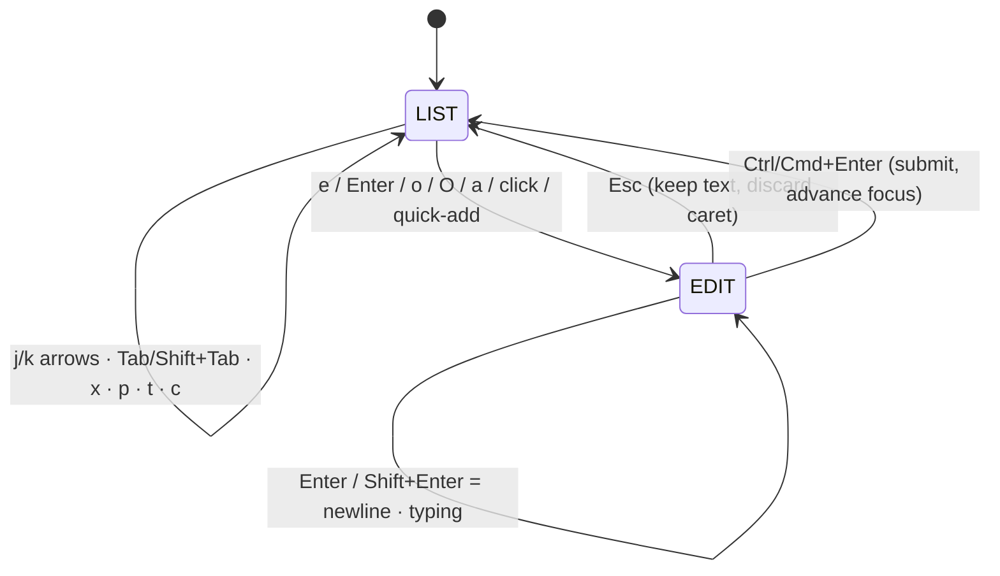
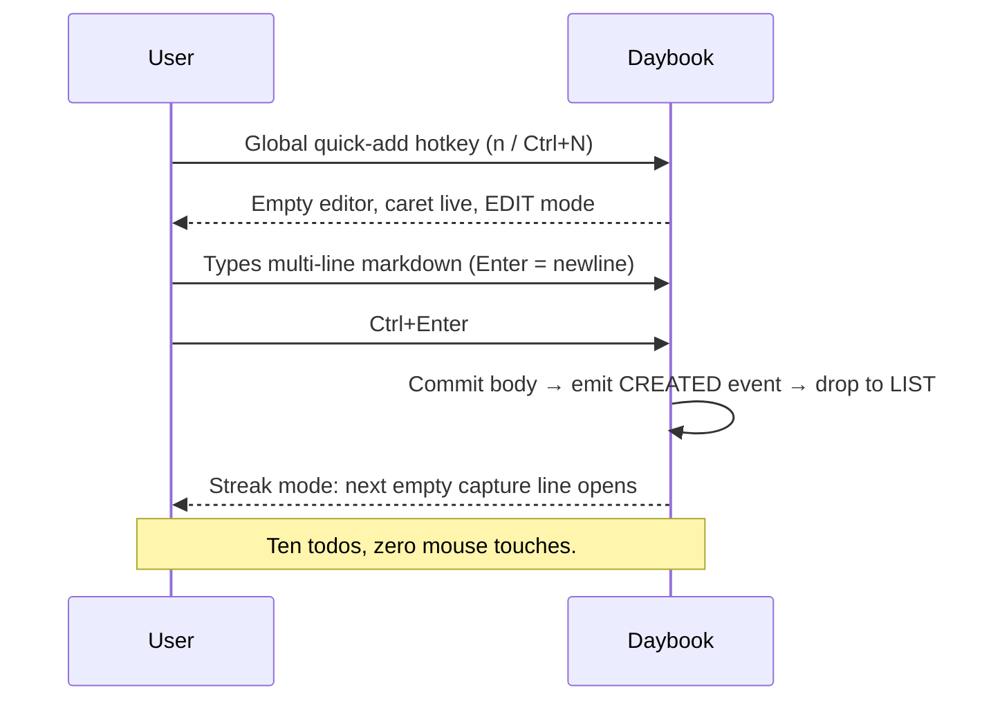
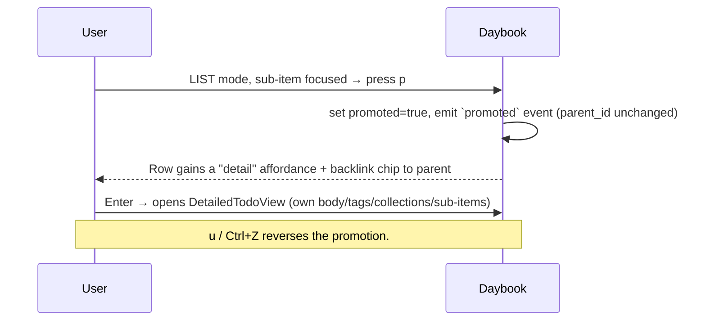

# Daybook — UX, Interaction & Design System

> How Daybook feels: notepad-fast capture through a vim-ish List/Edit modality, a CodeMirror 6 markdown surface, an unambiguous keymap that makes `Enter` a newline and `Ctrl+Enter` a submit, GitHub-issue-style promotion of sub-items, and the "Ink" Basecoat/Tailwind design system (dark-default, one indigo accent, dense desktop / comfortable touch).

Sibling docs: [README](../README.md) · [01 — Product Requirements](01-product-requirements.md) · [02 — Architecture](02-architecture.md) · [03 — Data Model](03-data-model.md) · [05 — Roadmap](05-roadmap.md)

---

## 1. Design philosophy — frictionless capture

The product lives or dies on two flows: **capture must feel like a notepad**, and **the EOD report must write itself**. Everything in this doc bends toward making the UI disappear so the keyboard can lead.

Three principles:

1. **Zero-ceremony capture.** Opening a capture surface is a single keystroke from anywhere, the caret is live on open, and you type prose — not a form. No required title, no mandatory collection, no "save" button in your way. `Ctrl+Enter` commits; in streak mode the next empty line opens instantly so you can fire off ten todos without touching the mouse.
2. **Plaintext is the substrate.** Bodies are stored as literal markdown. That is what makes the [EOD report a near-free concatenation](03-data-model.md#eod-report-engine), makes bodies human-diffable, and makes the [Y.Text CRDT merge](02-architecture.md#conflict-model) clean. The editor renders *pretty* inline (live preview) without ever leaving the plaintext model.
3. **The keyboard is the primary input; the mouse and touch are equal-but-different.** On desktop, every verb is a key. On touch — where there is no single-key layer — every verb is a gesture or an on-screen affordance, and the soft `Return` key **stays a newline** (submit moves to an accessory button). Getting this coordination right is the core of the capture loop on phones.

> **The notepad promise, stated precisely:** you should be able to write a multi-line markdown todo — headings, bullets, a pasted screenshot — and never once feel you left a text editor. Structure (tags, collections, sub-items, promotion) is added *after* the words exist, never as a gate before them.

---

## 2. Editor library — CodeMirror 6

**Decision: CodeMirror 6**, configured with the markdown language, an Obsidian-style inline live-preview plugin (hide syntax tokens when the caret leaves them; render inline image widgets), and the `y-codemirror.next` binding to each todo's `Y.Text` body. **Store the literal markdown string per body.**

### Why CodeMirror over a WYSIWYG editor

The three hardest constraints — notepad-simple capture, EOD report as near-free concatenation, and clean offline-first CRDT sync with good mobile behavior — all point to a **plaintext-model** editor.

| Editor | Model | Report export | Mobile / IME | CRDT binding | Verdict |
| --- | --- | --- | --- | --- | --- |
| **CodeMirror 6** | Literal markdown text | Report = `join(bodies)` — free | Self-managed input layer; best soft-keyboard story | First-party `y-codemirror.next` (one `Y.Text`/body) | **Chosen** |
| TipTap / ProseMirror | Document tree | Serialize tree → markdown (lossy round-trip) | `contenteditable` iOS/IME caret-jump quirks | Reference `y-prosemirror` | Fallback if full WYSIWYG (tables, drag toggles) is later required |
| Lexical (Meta) | Document tree | Serialize | `contenteditable` family caveats | `@lexical/yjs` | Viable but **pre-1.0 in 2026** |
| Milkdown + Crepe | PM + Remark tree | Remark serialize | PM `contenteditable` caveats; Crepe leans Vue 3 | Yjs supported | Overkill for zero-ceremony capture |
| Slate.js | React tree | Serialize | Known `contenteditable` edge cases | Weaker turnkey Yjs | Rejected — perpetual beta |
| Plain `textarea` + preview | Literal markdown | Free | Bulletproof native input | Loses per-token cursor/selection mapping | Fallback baseline only |

A document-model WYSIWYG fights **all three** constraints at once: it feels like a rich editor not a notepad, it stores a tree you must serialize back to markdown for the report, and its `contenteditable` core is exactly where iOS soft-keyboard/IME bugs live. CodeMirror stores literal markdown (report = join bodies), feels like a text pad, manages its own input layer, and binds one `Y.Text` per body for the cleanest merge. Live-preview plugins recover the "pretty" rendering without giving up the plaintext model.

### CodeMirror configuration

- **Markdown language** with per-language highlighting inside code fences (it *is* a code editor at heart).
- **Inline live preview** (community plugins, e.g. `atomic-editor` / `codemirror-live-markdown`): hide `**`/`#`/`` ` `` tokens when the caret leaves them; expand `#`, `-`, `1.`, `` ``` ``, `>` as-you-type; render inline image widgets from ``.
- **`y-codemirror.next`** binds the editor to the todo's `Y.Text`, giving character-level merge and remote-cursor mapping for free.
- **Image paste** (`Ctrl/Cmd+V`): custom handler uploads/attaches the blob (content-addressed by SHA-256 — see [02 — Architecture](02-architecture.md#blob-storage)), inserts ``, and renders a widget. The blob syncs on its own channel; the body only carries the reference.
- **`#tag` and `@collection` tokens** autocomplete inline so the two axes (collections are many-to-many) can be set without leaving the keyboard.

> **Isolation note:** the body CRDT sits behind a [Rust trait](02-architecture.md#conflict-model) and the editor behind a thin framework-agnostic (plain-TS) adapter, so a later swap to TipTap (if WYSIWYG wins) is a bounded change, not a rewrite of the whole capture surface. Decide early — migrating the *model* (plaintext ↔ document) is the expensive part.

---

## 3. Interaction model — vim-ish modality

Two modes, mirroring vim Normal/Insert, applied to a hierarchical list (todos → sub-items):

- **LIST mode** (default, "normal"): no text caret. Exactly one row is **focused** (highlighted). Single-key verbs act on it. Arrow navigation and single-letter verbs live here.
- **EDIT mode** (compose/insert): the focused item's CodeMirror body is active; keystrokes type text. `Esc` returns to List mode.

Why a modality rather than a single-mode editor? The exact required keys — `Enter` = newline, `Ctrl+Enter` = submit — are only unambiguous if navigation and composition are separated by mode. `Enter` can safely mean **newline** in Edit mode and **open row** in List mode because there is no text caret in List mode. Arrows navigate rows in List mode and move the caret in Edit mode. The mode split removes all ambiguity — which is precisely why this architecture is correct.



**Mode legibility.** A persistent pill bottom-right reads `LIST` or `EDIT`, and the caret color changes between modes — vim-style but discoverable. An `aria-live` region announces mode changes for screen readers.

### Focus & transition semantics

| Transition | Behavior |
| --- | --- |
| List → Edit (`e` / `Enter` / click) | Text caret enters the focused body at the **last caret position** (or end-of-body on a fresh edit). |
| Edit → List (`Esc`) | Caret discarded, text kept (autosave on); the same row re-highlights in List mode. |
| Submit (`Ctrl/Cmd+Enter`) | Body committed, drop to List mode, **advance focus to next sibling** — or open a fresh empty todo in "quick-add streak" mode for rapid capture. |
| Arrow Up/Down (List) | Move focus between **visible** rows in document order (descending into expanded sub-items). |
| Arrow Left/Right (List) | Collapse/expand sub-items; `Left` on an already-collapsed row jumps to **parent**; `Right` on an expanded row enters the **first child** (tree-nav). |

### Capture flow (zero-ceremony)



---

## 4. Complete keymap

The tables below are **authoritative and unambiguous**. Required bindings are marked **[REQUIRED]**.

### 4.1 LIST mode (focused row, no text caret)

| Key(s) | Action |
| --- | --- |
| `↓` / `j` | Move focus to next visible row |
| `↑` / `k` | Move focus to previous visible row |
| `←` / `h` | Collapse sub-items; if already collapsed, jump to parent |
| `→` / `l` | Expand sub-items; if already expanded, enter first child |
| `g g` / `G` | Jump to first / last item |
| `e` | **Edit** focused item body — enter EDIT mode, caret at end **[REQUIRED: `e` = edit]** |
| `Enter` | Edit focused item body (alias of `e`) |
| `o` | New sibling todo **below** focused, enter EDIT mode |
| `O` (`Shift+o`) | New sibling todo **above** focused, enter EDIT mode |
| `a` | Add a **sub-item** to focused todo, enter EDIT mode |
| `Tab` | Indent — make focused item a sub-item of the row above (structural) |
| `Shift+Tab` | Outdent — promote one nesting level (structural, not full-todo) |
| `x` / `Space` | Toggle done / undone on focused item |
| `p` | **Promote** sub-item into a full detailed todo (GitHub-issue style) |
| `t` | Open **tag** editor (tag axis) |
| `c` | Open **Collections** picker (multi-select, many-to-many — an item can be in several) |
| `d d` | Delete focused item (with undo) |
| `y` / `P` | Yank (copy) focused item / paste below |
| `u` / `Ctrl+Z` | Undo |
| `Ctrl+Shift+Z` / `Ctrl+Y` | Redo |
| `/` | Focus search / filter |
| `n` / `Ctrl+N` | Quick-add: new top-level todo (enter EDIT mode) |
| `Esc` | Clear search / selection; no-op if idle |

### 4.2 EDIT mode (CodeMirror body active)

| Key(s) | Action |
| --- | --- |
| `Enter` | **New line** (compose) **[REQUIRED]** |
| `Shift+Enter` | **New line** (compose) **[REQUIRED]** |
| `Ctrl+Enter` / `Cmd+Enter` | **SUBMIT** the todo, return to LIST **[REQUIRED]** |
| `Esc` | Exit to LIST mode — discards caret, keeps text (autosave on) |
| `Tab` / `Shift+Tab` | Indent / outdent list item inside the body |
| `Enter` on empty bullet | Auto-terminate the markdown list (standard notepad behavior) |
| `Ctrl/Cmd+B` / `Ctrl/Cmd+I` | Bold / italic wrap selection |
| `Ctrl/Cmd+V` | Paste; clipboard images are attached, uploaded, inserted inline as `` |
| `#` `-` `1.` `` ``` `` `>` | Expand to heading / list / fence / quote inline (live-preview) |
| Arrow keys | Move the **text caret** — do **not** navigate rows while in EDIT mode |

### 4.3 Global (any mode)

| Key(s) | Action |
| --- | --- |
| `Ctrl/Cmd+K` | Command palette (fuzzy: create, jump, tag, collection, filter, promote, export EOD) |
| `Ctrl/Cmd+Shift+E` | Generate / preview the **EOD report** from today's activity |
| `Ctrl/Cmd+F` | Search |
| `?` | Keyboard cheat-sheet overlay |

> **Rationale for the exact keys.** `Enter` = newline (not submit) inside the body is the whole point of "notepad-simple" — you must be able to write multi-line markdown freely; commit is the deliberate two-key `Ctrl+Enter`. In List mode `Enter` doubles as "edit/open row" with no conflict because there is no text caret there. Arrows navigate rows only in List mode and move the caret only in Edit mode.

### 4.4 Discoverability

Vim-ish single-key verbs can surprise non-power users, so Daybook ships three escape hatches: **insert-by-default capture** (you can just start typing), the **`?` cheat-sheet overlay**, and the **`Ctrl/Cmd+K` command palette** (every verb is fuzzy-searchable by name). A future toggle can require a modifier for List-mode verbs.

---

## 5. Mobile / touch equivalents

There is **no List-mode single-key layer** on touch, so every List verb maps to a gesture or affordance. The critical iOS/Android detail: **the soft `Return` key must stay a newline** to honor the requirement — submit lives on an on-screen accessory button, never on `Return`.

| Desktop verb | Touch equivalent |
| --- | --- |
| `e` / `Enter` (edit) | **Tap** a row = focus + open editor |
| `Esc` (leave edit) | Tap outside / keyboard "Done" |
| `Ctrl+Enter` (submit) | **Submit (✓) button** on the keyboard accessory toolbar |
| `x` (toggle done) | **Swipe right** on a row |
| delete / promote / tag / collections | **Swipe left** reveals action buttons |
| `Tab` / `Shift+Tab` (indent) | **Long-press + drag**, or horizontal drag at row start |
| reorder | Long-press + drag |
| `n` (quick-add) | **`+` FAB** |
| `p` / `t` / `c` (promote / tag / collections) | Row **overflow (…) menu** (collections = multi-select) |
| `Ctrl+K` (palette) | Bottom **command sheet** |

An **accessory toolbar docked above the soft keyboard** carries: Submit, bold/italic, list, image-attach, indent/outdent — solving both the "`Return` must be newline" conflict and thumb access to the structural verbs that live on physical keys on desktop. CodeMirror 6's self-managed input layer is what makes this accessory-bar + soft-keyboard coordination reliable (versus `contenteditable`, where the caret can jump during composition).

**Density note:** dense 28–32px desktop rows fall below the 44px touch target, so mobile auto-enables a **comfortable** density (40–44px rows, larger hit areas) — see §7.

---

## 6. Promote a sub-item into a full todo

Promotion is Daybook's GitHub-sub-issue move: a checklist line **upgrades in place** into a fully-detailed todo with its own body, sub-items, tags, collections, and attachments — **no row copy**, `parent_id` unchanged. In the [data model](03-data-model.md#promotion) this is `promoted = true` plus an emitted `promoted` event; the backlink to the parent is retained.



**In the UI:** a promoted sub-item keeps its place in the parent's checklist but gains a chevron/detail affordance and a subtle "promoted" marker. Opening it (`Enter`) navigates to its own [DetailedTodoView](#screen-3--detailed-todo-github-issue-style) that back-links the parent. On touch, promotion is in the row overflow (…) menu. Undo (`u` / `Ctrl+Z`) reverses it cleanly.

---

## 7. Design system — "Ink"

Daybook's visual language borrows the substrate-dark precision of **Linear**, the Swiss-neutral discipline and free **Geist** type of **Vercel**, and the keyboard-monk restraint of **Raycast**: a low-chroma neutral **"Ink"** ladder, hairline borders, tight 6/8/10px radii, a **single restrained indigo accent** reserved strictly for **primary action + focus ring**, and fast (120–180ms) subtle motion. Density is a first-class goal — this is a power tool, not a consumer calendar.

Built on **Alpine.js + Tailwind v4 + Basecoat** (shadcn/ui-compatible tokens; daisyUI fallback) — Basecoat is "shadcn/ui without React": plain-HTML components + tiny Alpine scripts, so all tokens remain OKLCH semantic tokens in the same Tailwind-v4 `@theme` setup (the "Ink" palette and `@theme` block are unchanged). Alpine is only a thin **view layer** over a **framework-agnostic plain-TS core** — the virtualized tree, command palette, and CodeMirror integration are plain-TS modules Alpine orchestrates. **Dark is the default/primary theme** (power users live in dark) with a **first-class light theme**. **Collections** carry the **accent/structural** role; tags get a **muted 8-hue chip set** so the two axes stay visually distinct.

### 7.1 Color tokens

**Dark theme (default) — Ink ladder**

| Token | Hex | OKLCH | Role |
| --- | --- | --- | --- |
| `background` | `#0B0C0E` | `oklch(.17 .004 265)` | Canvas |
| `card` | `#131518` | `oklch(.21 .005 265)` | Surface / card |
| `popover` | `#1A1D21` | `oklch(.25 .006 265)` | Elevated / popover |
| `muted` (hover) | `#23262B` | `oklch(.30 .007 265)` | Interactive / hover |
| `border` | `#262A30` | `oklch(.32 .006 265)` | Hairline border |
| `border-strong` | `#333841` | — | Strong border |
| `foreground` | `#E9ECF1` | `oklch(.93 .006 265)` | Primary text |
| `muted-foreground` | `#9BA3AE` | `oklch(.70 .012 265)` | Secondary text |
| `faint` | `#6B7280` | — | Tertiary / disabled |

**Light theme — Ink ladder**

| Token | Hex | OKLCH | Role |
| --- | --- | --- | --- |
| `background` | `#FCFCFD` | `oklch(.99 .002 265)` | Canvas |
| `card` | `#FFFFFF` | — | Surface / card |
| `muted` | `#F4F5F7` | `oklch(.97 .004 265)` | Muted surface / hover |
| `border` | `#E6E8EC` | `oklch(.92 .004 265)` | Hairline border |
| `foreground` | `#1A1D21` | `oklch(.25 .006 265)` | Primary text |
| `muted-foreground` | `#5B636E` | `oklch(.49 .012 265)` | Secondary text |

**Accent & semantic**

| Token | Dark | Light | Role |
| --- | --- | --- | --- |
| `primary` (accent, indigo) | `#6E7BFF` `oklch(.68 .17 268)` (hover `#808CFF`) | `#4F5BD5` `oklch(.53 .19 268)` | **Primary action + focus ONLY** |
| `ring` (focus) | accent @ 45% + 2px offset | accent @ 45% + 2px offset | Focus ring |
| `success` | `#34C77B` `oklch(.74 .16 155)` | same | Done / positive |
| `warning` | `#F5B547` `oklch(.81 .14 78)` | same | Caution |
| `destructive` | `#F26D6D` `oklch(.70 .17 20)` | `#DC4B4B` | Delete / error |
| `info` / link | = accent indigo | = accent indigo | Links / info |

> **Accent discipline (the Linear rule):** if collections, tags, links, and focus all fight for the accent, it stops signaling "primary action." Reserve indigo strictly for primary action + focus ring. Collections carry the structural/accent role via an active-bar; **tags get their own muted chip hues** below.

**Tag chip palette — 8 muted hues, distinct from the accent.** Rendered as **12–14% alpha background + full-strength text/dot** in dark.

| Hue | Hex | Hue | Hex |
| --- | --- | --- | --- |
| Slate | `#64748B` | Emerald | `#3FB984` |
| Rose | `#E5678A` | Cyan | `#3FA9C9` |
| Amber | `#E0A03A` | Violet | `#9B7BE0` |
| Pink | `#DB7BC0` | Lime | `#8DBF3F` |

### 7.2 Typography

- **UI font:** Geist Sans (fallback Inter Variable) with `cv01`/`ss03` OpenType features.
- **Mono:** Geist Mono or JetBrains Mono — code blocks, markdown source, **timestamps, and IDs**.

| Style | Size | Line | Weight | Use |
| --- | --- | --- | --- | --- |
| caption | .6875rem / 11px | 1rem | 400 | Micro-labels |
| meta / small | .75rem / 12px | 1.1rem | 400/510 | Meta, timestamps |
| body-sm | **.8125rem / 13px** | 1.25rem | 400 | **List row size** |
| body | .875rem / 14px | 1.375rem | 400 | Body copy |
| base | 1rem / 16px | 1.5rem | 400 | Editor text |
| h3 / section | .9375rem / 15px | — | 560 | Section headers |
| h2 | 1.125rem / 18px | — | 560 | Sub-view titles |
| h1 / view-title | 1.375rem / 22px | — | 590 | View / issue title |
| display | 2rem / 32px | — | 590 | EOD report header |

**Weights:** body 400; emphasis/labels **510** (variable-font sweet spot, à la Linear — provide a 500 fallback so text doesn't jump to 400/600 on load); headings 560; strong titles 590. Body tracking `-0.011em`, large headings `-0.02em`.

### 7.3 Spacing, density, radius

- **Grid:** 4px sub-grid on an **8px base grid**.
- **Row height:** dense **28–32px** (desktop default), comfortable **40–44px** (mobile/touch, auto).
- **Padding:** list row `6px 10px`; card `12–16px`; section gap `24px`.
- **Radius:** `--radius-sm` 6px · `--radius` **8px** (default control/card) · `--radius-md` 10px · `--radius-lg` 12px (modals/palette) · pill `9999px` (tag chips). Buttons/inputs 8px.

### 7.4 Elevation & motion

**Elevation (subtle; borders do the work).** `e0` = none (flush surface + hairline border). `e1` popover = `0 1px 2px rgba(0,0,0,.4), 0 2px 8px rgba(0,0,0,.35)`. `e2` palette/modal = `0 8px 32px rgba(0,0,0,.55)` + 1px border + optional 12px backdrop-blur. Light theme relies more on borders with softer neutral shadows.

**Motion.** Durations: fast **120ms** (hover/focus), base **160ms** (enter/exit), slow **220ms** (palette/modal). Easing: standard `cubic-bezier(.2,0,0,1)`; enter ease-out, exit ease-in. Prefer opacity + 2–6px transform. **Honor `prefers-reduced-motion`.** No bounce except the check-complete micro-pop (`scale 1 → 1.12 → 1`, 180ms).

> **WebView caveat:** Linux WebKitGTK is the weakest renderer — **avoid heavy blur/filter-driven elevation**; make backdrop-blur a progressive enhancement, not a load-bearing effect.

### 7.5 Iconography

**Lucide**, 16px default in dense UI (1.5px stroke), 20px in headers. Align to text baseline; use `muted-foreground` until active.

### 7.6 Starter Tailwind v4 token block

```css
/* app.css — Basecoat (shadcn/ui-compatible) + Tailwind v4 @theme-inline.
   `:root` holds LIGHT values (shadcn convention); dark lives under `.dark`.
   Daybook applies `.dark` to <html> at boot, so DARK is the shipped default —
   the app renders dark unless the user explicitly switches to light. */
:root {
  --background: oklch(0.99 0.002 265);
  --foreground: oklch(0.25 0.006 265);
  --card: oklch(1 0 0);
  --popover: oklch(1 0 0);
  --muted: oklch(0.97 0.004 265);
  --muted-foreground: oklch(0.49 0.012 265);
  --border: oklch(0.92 0.004 265);
  --input: oklch(0.92 0.004 265);
  --primary: oklch(0.53 0.19 268);          /* indigo — action + focus ONLY */
  --primary-foreground: oklch(0.99 0.002 265);
  --ring: oklch(0.53 0.19 268 / 0.45);
  --success: oklch(0.74 0.16 155);
  --warning: oklch(0.81 0.14 78);
  --destructive: oklch(0.585 0.185 25);      /* #DC4B4B — light */
  --radius: 0.5rem;                          /* 8px default */
}

.dark {
  --background: oklch(0.17 0.004 265);       /* #0B0C0E */
  --foreground: oklch(0.93 0.006 265);       /* #E9ECF1 */
  --card: oklch(0.21 0.005 265);             /* #131518 */
  --popover: oklch(0.25 0.006 265);          /* #1A1D21 */
  --muted: oklch(0.30 0.007 265);            /* #23262B hover */
  --muted-foreground: oklch(0.70 0.012 265); /* #9BA3AE */
  --border: oklch(0.32 0.006 265);           /* #262A30 hairline */
  --input: oklch(0.32 0.006 265);
  --primary: oklch(0.68 0.17 268);           /* #6E7BFF */
  --primary-foreground: oklch(0.17 0.004 265);
  --ring: oklch(0.68 0.17 268 / 0.45);
  --destructive: oklch(0.70 0.17 20);        /* #F26D6D */
}

@theme inline {
  --color-background: var(--background);
  --color-foreground: var(--foreground);
  --color-card: var(--card);
  --color-popover: var(--popover);
  --color-muted: var(--muted);
  --color-muted-foreground: var(--muted-foreground);
  --color-border: var(--border);
  --color-primary: var(--primary);
  --color-primary-foreground: var(--primary-foreground);
  --color-ring: var(--ring);
  --color-success: var(--success);
  --color-warning: var(--warning);
  --color-destructive: var(--destructive);

  --radius-sm: 6px;
  --radius: 8px;
  --radius-md: 10px;
  --radius-lg: 12px;

  --font-sans: "Geist Sans", "Inter Variable", ui-sans-serif, system-ui, sans-serif;
  --font-mono: "Geist Mono", "JetBrains Mono", ui-monospace, monospace;

  /* Tag chip hues — rendered at 12–14% alpha bg + full-strength text/dot */
  --tag-slate: #64748B;  --tag-rose:    #E5678A;
  --tag-amber: #E0A03A;  --tag-pink:    #DB7BC0;
  --tag-emerald:#3FB984;  --tag-cyan:   #3FA9C9;
  --tag-violet:#9B7BE0;  --tag-lime:    #8DBF3F;
}
```

### 7.7 Component inventory (Basecoat)

Each entry is a **plain-HTML Basecoat component** (shadcn/ui-compatible classes) wired with a **small Alpine script** over the framework-agnostic plain-TS core — the command palette, virtualized list rows, tag chips, collection picker, editor, attachments, and EOD view are plain-TS modules Alpine only presents:

Command palette (plain-TS module, `Ctrl/Cmd+K`) · AccountSwitcher (host/account picker at sidebar top, workspace-switcher pattern) · QuickCapture bar (single-line → multiline, `Ctrl+Enter` submit) · ListRow (checkbox, title, inline tag chips, collection dots, mono meta/time, sub-item count, drag handle) · TagChip (pill, colored dot + 12% alpha bg, removable) · CollectionPicker (multi-select, many-to-many) · CollectionsSidebar (collapsible tree, icon + count badge, one active-accent bar, future per-collection share affordance) · MarkdownEditor (CodeMirror, live preview, image paste) · SubItemChecklist (nested, promote button) · DetailedTodoView (GitHub-issue layout) · ImageAttachment (thumbnail grid + lightbox, drag-drop/paste) · EODReportView (date-grouped, markdown export/copy) · StatusDot · KbdHint (styled `<kbd>`) · Toast · DensityToggle · ThemeToggle.

---

## 8. Key screens

<a id="screen-1--main-list"></a>
### Screen 1 — Main list

A **host/account switcher** sits at the **top of the sidebar** (workspace-switcher pattern): it names the active account — `{ host URL, credentials }` — switches between servers, and carries an **add/select server** flow; everything below is rendered **per-account**. Below it, the **CollectionsSidebar** (240px, collapsible to a 56px icon rail): a collapsible tree of collections, each row an icon + count badge, with a single accent active-bar on the selected collection (each collection is the shareable unit — a future **share** affordance lives here, MVP owner-only). Center is a **dense list of ListRows** grouped by collection or date — checkbox, title, inline tag chips, **one or more collection dots** (an item can belong to several collections), mono timestamp, and sub-item count. Rows use **hairline dividers, no card shadows** — flat + borders keep it calm and fast. A sticky **QuickCapture bar** is pinned top or bottom, always ready. An optional right rail carries filters/tags. The focused row shows a visible focus ring; the `LIST`/`EDIT` mode pill sits bottom-right. A board/kanban view (columns = collections or status) is a later alternate.

<a id="screen-2--focused-editor"></a>
### Screen 2 — Focused editor (capture)

The QuickCapture expands inline, or opens as a **centered Raycast-style card** (`max-w 640px`, radius 12, `e2` elevation, optional backdrop-blur). The surface is markdown-friendly with monospace inside fences; `#tag` and `@collection` tokens autocomplete inline. A **KbdHint footer** shows `Ctrl+Enter to save · Esc to cancel`. **Zero chrome, cursor-ready on open** — this screen *is* the notepad promise. On mobile it is the full-width editor with the soft-keyboard accessory toolbar (Submit, bold/italic, list, image, indent) docked above the keyboard.

<a id="screen-3--detailed-todo-github-issue-style"></a>
### Screen 3 — Detailed todo (GitHub-issue style)

A **full-width reading column** (`max-w 760px`): a 22px title, a meta row (collection chips, tag chips, created/updated in mono), the **rendered markdown body**, a **SubItemChecklist** where each item carries a "promote to todo" action, and an attachment thumbnail grid. A right meta sidebar exposes dates, collections (multi-select), and tags for inline editing. **Promoting a sub-item spawns a child DetailedTodoView that back-links the parent** (see §6). This is the "issue" surface — where a captured line grows into structured work.

<a id="screen-4--eod-report"></a>
### Screen 4 — EOD report (hero)

A date selector (**Today** default, custom range supported). Daybook auto-collects completed + touched todos from the [event log](03-data-model.md#eod-report-engine), bucketed CREATED / UPDATED / COMPLETED / CARRIED-OVER, and renders **clean markdown**: `## Collection` → `- [x] item` with **sub-item rollups + tag annotations** and mono timestamps. One-click **Copy-as-Markdown / Export**; editable before send; carry-over rolls unfinished items forward with a slipped-days count. This is the **hero screen** — generous whitespace here (a deliberate contrast to the dense list), print/share-ready styling, markdown as the universal paste target for Slack/Jira/email.

---

## 9. Accessibility

- Visible **focus ring** on the List-mode focused row; full arrow/Tab operability.
- **`aria-live`** mode announcements ("edit mode" / "list mode").
- **`prefers-reduced-motion`** honored throughout (§7.4).
- Comfortable-density auto-switch keeps mobile hit targets ≥ 44px (§5, §7.3).
- If rich-structure a11y ever becomes paramount, Lexical is the standout — a reason it stays the a11y-critical WYSIWYG fallback over TipTap.

---

## 10. Interaction risks

| Risk | Mitigation |
| --- | --- |
| Mobile soft `Return` must stay a newline | Submit lives on the keyboard accessory button — **never** hijack `Return`. |
| Vim-ish modality surprises non-power users | Insert-by-default capture, `?` cheat-sheet, `Ctrl/Cmd+K` palette; optional modifier toggle. |
| CM6 inline live-preview relies on community plugins | Pin versions; accept a source+preview split as the fallback. |
| Inline pasted-image UX is custom CM6 work | Blob synced on its [separate channel](02-architecture.md#blob-storage); body carries only the `attachment:<hash>` reference. |
| Dense rows below 44px touch target | Auto-enable comfortable density on mobile. |
| Accent overuse dilutes "primary action" signal | Reserve indigo for action + focus; tags use muted chip hues. |
| WebKitGTK weakest renderer | Avoid heavy blur/filters; progressive-enhance elevation. |
| Editor swap (CM6 → TipTap) if WYSIWYG later wins | Editor behind a framework-agnostic (plain-TS) adapter + body CRDT behind a Rust trait; decide the plaintext-vs-document model early. |

See [05 — Roadmap](05-roadmap.md) for the full risk register, and [03 — Data Model](03-data-model.md) for the NODE schema, event log, and EOD engine these interactions drive.
