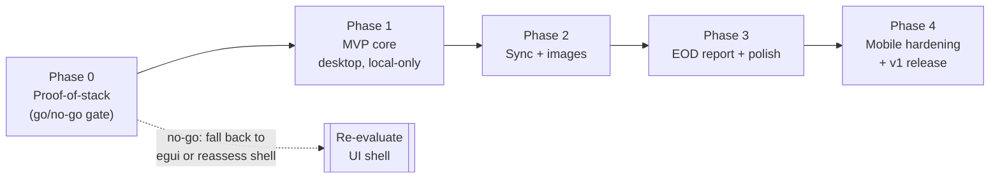

# Daybook — Roadmap

> Phased build plan from proof-of-stack to v1, sequenced to kill the two hardest bets — **iOS via Tauri v2** and the **sync engine** — before any polish is spent.

This roadmap turns the locked decisions in [../README.md](../README.md) and [02-architecture.md](02-architecture.md) into an ordered plan. It is deliberately **de-risk-first**: the earliest phases prove the scariest assumptions, not the easiest features. Everything here honors the MVP scope in [01-product-requirements.md](01-product-requirements.md) and the data model in [03-data-model.md](03-data-model.md).

---

## Guiding principles

1. **Prove the terrifying bets first.** Tauri v2 on iOS and the offline-first hybrid-CRDT sync engine are the two things that can invalidate the whole architecture. They come before capture UX, before design polish, before the EOD report.
2. **Desktop-first, mobile-scoped.** Per the brief, desktop is first-class end to end; mobile MVP is scoped to fast capture + read/browse + report view. Full mobile hardening is its own late phase.
3. **Deterministic before delightful.** The EOD report ships as a deterministic template generator (offline, private). AI narrative is a later, optional layer delivered via the **Model Context Protocol (MCP)** — never a dependency.
4. **Managed pieces first.** Cloudflare R2 + managed Postgres + a small VPS for the Axum relay. Self-hosted distribution (MinIO + bundled relay) is a later deliverable, not an MVP tax.
5. **Every hard requirement has an exit criterion.** A phase is not "done" because code exists; it is done when its exit criteria are demonstrably met on real devices.

---

## Phase map at a glance

| Phase | Theme | Primary risk retired | Rough shape |
| --- | --- | --- | --- |
| **Phase 0** | Proof-of-stack spike | Tauri v2 iOS/Android viability; yrs round-trip | Throwaway spikes, go/no-go gate |
| **Phase 1** | MVP core (desktop-first, local-only) | Capture loop + data model + keymap | The app you'd use offline on one machine |
| **Phase 2** | Sync + images | Op-log sync + hybrid conflict model + blobs | Multi-device, offline-first, image attach |
| **Phase 3** | EOD report engine + polish | The killer differentiator | Deterministic report, carry-over, design system |
| **Phase 4** | Mobile hardening + v1 | WebView divergence, mobile capture, release pipelines | Shippable v1 on all five platforms |

---

## Build order — why this sequence de-risks the hardest bets

The two bets that can sink the architecture are validated **before** feature work, in this order:

| Order | Bet under test | Where it's proven | If it fails |
| --- | --- | --- | --- |
| 1 | **Tauri v2 runs our UI on iOS + Android** (image attach, keyboard/IME, background sync hooks, signing) | Phase 0 spike | Reassess shell before any MVP code is written; egui fallback or Capacitor/native reconsideration. Cheapest possible failure. |
| 2 | **yrs (Rust Yjs) round-trips Y.Text snapshots/updates** cleanly behind our trait | Phase 0 spike | Swap body-CRDT candidate (Loro/automerge) while the surface area is a spike, not a shipped feature. |
| 3 | **Hybrid op-log sync merges without loss** (per-field LWW + Y.Text) across two devices offline | Phase 2 (built on a real, but still small, data model) | Contained: local-only MVP (Phase 1) still works; sync is additive. |
| 4 | **WebView divergence across four engines** doesn't break the heavy keyboard UX | Phase 4 (continuous QA from Phase 1, hardened here) | Per-platform patches; Linux WebKitGTK gets the most attention. |

The point: **the most expensive-to-reverse decisions are tested when reversing them is cheapest.**

---

## Phase 0 — Proof-of-stack spike

**Goal:** answer one question — *can Tauri v2 carry this product to all five platforms, and does the body-CRDT round-trip?* This is throwaway code. Ship nothing. Learn everything.

### Deliverables
- A minimal Tauri v2 app (vanilla TS + Alpine.js + Tailwind v4 + one Basecoat component) that **builds and launches on all five targets**: macOS, Windows, Linux (WebKitGTK), iOS (real device or provisioned simulator), Android.
- **iOS/Android build spike** exercising the three native-gap risks from the brief: **image attach** (paste/pick → bytes into Rust), **background sync** hook feasibility, and **fast capture** (soft keyboard + accessory toolbar with a Submit button; confirm soft `Return` can stay a newline).
- A **CodeMirror 6** instance in the webview proving `Enter`/`Shift+Enter` newline vs `Ctrl/Cmd+Enter` submit works identically across WKWebView / Android WebView / WebView2 / WebKitGTK.
- A **Rust yrs spike**: create a `Y.Text`, apply concurrent updates from two docs, encode/decode state vectors and updates, assert convergence — behind the intended `BodyCrdt` trait. Pin versions.
- A hand-rolled **signing/release smoke test** for iOS and Android (validating the brief's warning that `tauri-action` mobile CI was still in progress).

### Exit criteria (go/no-go gate)
- [ ] App visibly runs on **all five** platforms from **one** codebase.
- [ ] On iOS **and** Android: an image can be attached, the markdown editor accepts input, and the soft `Return` inserts a newline while an on-screen Submit button submits.
- [ ] `Ctrl/Cmd+Enter` submit and `Enter`/`Shift+Enter` newline behave identically on all four WebView engines.
- [ ] yrs round-trips a concurrent `Y.Text` edit to convergence; snapshot + update encode/decode verified in a unit test.
- [ ] We can produce a signed iOS `.ipa` and Android build locally, even if manually.

**No-go outcome:** stop and re-evaluate the UI shell (egui fallback per the architecture ADR, or a webview alternative) **before** writing MVP code. A no-go here is a success — it's the cheapest place to learn it.

---

## Phase 1 — MVP core (desktop-first, local-only)

**Goal:** the app becomes genuinely usable **offline on a single desktop machine**. No backend yet. This is where the capture loop, data model, and keymap become real.

### Deliverables
- **Single-table NODE model** (todos + sub-items) in local **SQLite**, with `parent_id`, base62 fractional `order_key` (+ per-client jitter suffix), `kind`, `promoted` flag, UUIDv7/ULID IDs. See [03-data-model.md](03-data-model.md).
- **Append-only EVENT log** written on every state change (this is the future report source — build it now, not later).
- **Frictionless capture** with the **vim-ish List/Edit modality** and the exact keymap: `Enter`/`Shift+Enter` = newline, `Ctrl/Cmd+Enter` = submit, arrows/`j`/`k` navigate, `e`/`Enter` edit, `o`/`O` new sibling, `Tab`/`Shift+Tab` indent/outdent, `x` toggle done, `p` promote, `/` search, `Ctrl/Cmd+K` palette. Full table in [04-ux-and-interaction.md](04-ux-and-interaction.md).
- **Insert-by-default capture** + a `?` cheat-sheet overlay + command palette so non-power-users never need to learn modes.
- **CodeMirror 6** markdown editor with Obsidian-style inline live preview (literal markdown stored per body).
- **Promotable sub-items**: in-place promotion (`promoted=true`, emit event, `parent_id` unchanged) — GitHub sub-issue model.
- **Two axes**: **Collections** (many-to-many — an item can live in multiple collections, optionally nestable; the future shareable unit) + many-to-many **Tags** (tombstoned join).
- **Account model + local store partitioning designed in**: single-account for MVP, but an **Account = host URL + credentials** and **per-account store partitioning** are foundational — every local store key is account-scoped from day one so multi-host is additive, not a rewrite.
- **Framework-agnostic core/engine**: all hard state (nodes, events, keymap, ordering) lives in a **plain-TS core**; **Alpine.js is only the view**, keeping it swappable if it strains under the dense UI.
- **Daybook design system v1**: **Basecoat**/Tailwind v4 (shadcn/ui-compatible, no React; **daisyUI fallback**), Ink neutral ladder + single indigo accent, dark default + light theme, dense desktop rows. Mode pill + caret-color modality legibility.

### Exit criteria
- [ ] A user can capture a todo with a markdown body faster than opening a notepad — measured, not asserted.
- [ ] Every required key behaves exactly as specified, on desktop.
- [ ] A sub-item can be promoted to a full todo without a row copy or losing position.
- [ ] **Collections** (many-to-many) and **Tags** are independently assignable and visually distinct.
- [ ] Local storage is **account-partitioned**: store keys are account-scoped so a second account would slot in without migration.
- [ ] Killing and relaunching the app loses nothing (SQLite durable).
- [ ] The EVENT log records create/update/complete/promote for every node.

---

## Phase 2 — Sync + images

**Goal:** retire the second big bet. Daybook becomes **multi-device and offline-first**, and images sync. This is the hardest engineering phase.

### Deliverables
- **Thin Rust (Axum) relay** persisting a per-user **op log to Postgres**; **email magic-link + JWT** auth. Deployed to a small VPS (managed Postgres).
- **Client op-log channel**: each device queues mutations offline and syncs one op-log channel when online.
- **Hybrid conflict model, end to end**: per-field **LWW (HLC/Lamport-stamped)** for scalars/enums/FKs/`order_key`; **Y.Text sequence CRDT** (yrs) for markdown bodies, behind the `BodyCrdt` trait. **Tombstone soft-deletes**.
- **Content-addressed image storage**: SHA-256 blobs to **Cloudflare R2** on a **separate sync channel**; op log carries only hash + metadata + **blurhash**/thumbnail. On-device thumbnails via the Rust `image` crate; offline upload/download queue; **LRU size-capped local blob cache**.
- **Graceful blob degradation**: a todo referencing an attachment whose bytes haven't arrived renders from blurhash/thumbnail, never breaks.
- SQLite treated as a **deterministic projection** of the CRDT/op-log source of truth (rebuildable).

### Exit criteria
- [ ] Two devices, both edited **offline**, converge with **no lost characters** in a concurrently edited markdown body.
- [ ] Concurrent scalar/structure edits resolve by HLC LWW deterministically; reorders don't collide (jitter suffix works).
- [ ] A deleted todo stays deleted across sync (tombstone honored; no resurrection).
- [ ] An image attached offline on device A appears on device B after both come online; list renders instantly from blurhash before bytes land.
- [ ] Dropping and rebuilding the local SQLite projection from the op log yields identical state.

---

## Phase 3 — EOD report engine + polish

**Goal:** ship the **killer differentiator**. Everything before this served these flows.

### Deliverables
- **EOD report engine** deriving reports from the **immutable EVENT log** over a **timezone-aware local-day range** (default: today; custom range supported).
- Event bucketing into **CREATED / UPDATED / COMPLETED / CARRIED_OVER**, resolved to current node snapshots.
- **Pivotable groupings** (by **Collection** for MVP — with a chosen primary collection when an item is in several, see open questions; tag/project pivots noted for later) rendered to clean markdown: checkbox bullets, nested sub-item rollups, tag chips, timestamps, optional inline thumbnails.
- **Carry-over**: unfinished in-scope items roll forward with a **slipped-days** count.
- **Report derived from status changes, sub-item checks, and promotions** — not only explicit completions — so report quality survives imperfect capture discipline.
- **Copy-as-markdown** as the primary export (universal paste target for Slack/Jira/email).
- `Ctrl/Cmd+Shift+E` generates the report; command-palette entry too.
- **Design system hardening**: density modes, motion honoring `prefers-reduced-motion`, GitHub-issue detailed todo view, quick-capture bar.

### Exit criteria
- [ ] The **same day + range always reproduces the same report** (deterministic, auditable).
- [ ] The report surfaces the **what-changed diff** (sub-items checked, promotions, status flips) that competitors miss.
- [ ] Report generation works **fully offline**.
- [ ] Unfinished items carry over correctly with an accurate slipped-days count.
- [ ] Copy-as-markdown pastes cleanly into Slack, Jira, and email.

---

## Phase 4 — Mobile hardening + v1

**Goal:** turn the desktop-first app into a **shippable v1 on all five platforms**, with mobile capture that honors the exact requirements.

### Deliverables
- **Mobile capture UX**: every List verb mapped to a gesture (tap=edit, swipe-right=done, swipe-left=actions, long-press-drag=reorder/indent, FAB=quick-add) + an **accessory toolbar above the soft keyboard with a dedicated Submit button** (soft `Return` stays a newline).
- Mobile scope per MVP: **fast capture + read/browse + report view** (not full desktop parity).
- **Per-platform WebView QA** across WKWebView / Android WebView / WebView2 / WebKitGTK — keyboard/IME, CSS, editor behavior. Avoid heavy blur/filters (Linux WebKitGTK is weakest).
- **Release pipelines**: hand-rolled signing + release for iOS and Android (budgeted per the Tauri mobile-CI risk), plus desktop packaging for the three OSes.
- **Comfortable/touch density** (40–44px targets) auto-enabled on mobile.
- Background sync validation on iOS/Android; blob queue behavior on flaky mobile networks.

### Exit criteria
- [ ] Capture on a phone honors the requirement: soft `Return` = newline, on-screen Submit submits.
- [ ] All four WebView engines pass the heavy-keyboard + editor QA suite.
- [ ] Signed builds exist for **all five platforms** via a repeatable (even if partly manual) pipeline.
- [ ] Touch targets meet 44px on mobile; no blur-driven jank on Linux.
- [ ] A full day's loop — capture on phone, edit on desktop, sync, generate EOD — works across devices.

**v1 = Phase 4 exit criteria met.** Everything in the "Later" list below is post-v1.

---

## Later (post-v1)

Post-v1 work. Three items are structured as phases with a one-line deliverable + exit criterion; the rest is scoped backlog.

### Post-v1 phases

- **Phase 5 — Sharing.** *Deliverable:* a **Collection** can be shared with other accounts as **owner / editor / viewer**, over a **per-collection sync channel** layered on the Phase 2 op-log. *Exit criterion:* two accounts edit a shared Collection offline and converge, with roles enforced server-side and non-members denied.
- **Phase 6 — Multi-host.** *Deliverable:* a **host/account switcher UI** and simultaneous connections to **multiple servers**, built on the per-account store partitioning from Phase 1. *Exit criterion:* a user adds a second **Account** (different host URL), switches between them, and each account's data stays partitioned and syncs only to its own host.
- **Phase 7 — AI narrative via MCP.** *Deliverable:* Daybook runs as an **MCP server** exposing todos/events as resources/tools, so any MCP-capable LLM client can author narrative EOD prose. *Exit criterion:* an external MCP client reads a day's events and returns a narrative report, with the deterministic engine and offline path unchanged.

### Scoped backlog

- **Scheduled auto-generation** of the report at a set EOD time.
- **Standup format** toggle (Yesterday / Today / Blockers) + additional group-by pivots (tag, project).
- **Board/kanban** alternate view.
- Additional **export formats** (HTML, JSON, PDF).
- **Native mobile integrations**: share-sheet capture, home-screen widgets, iOS App Intents / Live Activities.
- Carry-over **slipped-days analytics** and productivity stats.
- **Op-log/CRDT compaction**, tombstone GC tooling, periodic fractional-index rebalancing.
- **Swap-in** of an alternate body CRDT behind the Rust trait if yrs parity gaps bite.
- **Self-hosted backend distribution** (MinIO + bundled relay) as a first-class deployment option.

**Explicit non-goal (for now):** **client-side end-to-end encryption**. Transport (**TLS**) + at-rest encryption on the self-hostable backend is the shipped posture; self-hosting is the privacy lever for sensitive data.

---

## Top risks & mitigations

| # | Risk | Mitigation | Retired in |
| --- | --- | --- | --- |
| 1 | **Tauri v2 mobile isn't feature-complete**; some desktop plugins lack iOS/Android impls; `tauri-action` mobile CI in progress into 2026. | Validate an iOS/Android build spike (image attach, background sync, capture) **before committing**; budget hand-rolled signing/release pipelines and native-gap code. | Phase 0 / Phase 4 |
| 2 | **WebView divergence** (WKWebView / Android WebView / WebView2 / WebKitGTK) breaks CSS + keyboard/IME; WebKitGTK is weakest. | Per-platform QA on the heavy keyboard UX + editor from Phase 1; avoid heavy blur/filters; Linux gets the most attention. | Phase 4 (ongoing) |
| 3 | **Mobile soft `Return` must stay a newline**; submit relies entirely on an on-screen accessory button. | Design the accessory toolbar + Submit button explicitly; verify in Phase 0 spike and re-verify in Phase 4. Getting this wrong breaks the core capture loop on phones. | Phase 0 / Phase 4 |
| 4 | **yrs (Rust Yjs) parity** was still closing mid-2026. | Isolate the body CRDT behind a Rust `BodyCrdt` trait; pin versions; test snapshot/update round-trips so it can be swapped for Loro/automerge. | Phase 0 / Phase 2 |
| 5 | **Custom relay + Postgres + object store + auth = real ops load** for a small team. | Start on managed pieces (R2, managed Postgres); keep only the thin Axum relay self-hosted. Self-host distribution is a later deliverable. | Phase 2 |
| 6 | **SQLite index / op log drift** from CRDT truth and bloat over years. | Treat SQLite as a **deterministic projection** (rebuildable); schedule compaction + tombstone GC **only behind a causal watermark** — premature GC resurrects deleted todos. | Phase 2 (GC tooling: Later) |
| 7 | **Two sync channels desync** — a todo references bytes that haven't downloaded. | UI degrades gracefully to **blurhash/thumbnail**; never block on blob availability. | Phase 2 |
| 8 | **EOD report quality depends on capture discipline.** | Derive the report from **status changes, sub-item checks, and promotions** in the event log — not only explicit completions. | Phase 3 |
| 9 | **Vim-ish modality surprises non-power users.** | Ship **insert-by-default capture**, the `?` cheat-sheet, and the command palette so users can just type. | Phase 1 |
| 10 | **Fractional-index keys grow / collide** under concurrent same-position inserts. | Always append the **per-client jitter suffix**; schedule occasional background rebalancing (Later). | Phase 1 / (rebalance: Later) |
| 11 | **No client-side E2EE** — server-stored docs + R2 objects are readable server-side. | **TLS in transit + at-rest encryption** on the (self-hostable) backend is the **shipped posture**; **E2EE is an explicit non-goal for now**. Self-hosting is the privacy lever for sensitive data. | Decided (TLS-only) |
| 12 | **Positioning risk** — Sunsama owns "daily shutdown"; TickTick ships a summary. | Differentiate hard: the report is **automatic** and capture is **notepad-fast**, sourced from an event-log diff competitors don't have. Or it reads as a clone. | Cross-cutting |
| 13 | **Alpine.js may not scale** to the dense, heavy-keyboard capture UI. | Keep all hard state in a **framework-agnostic plain-TS core/engine**; Alpine is only the view, so it can be swapped without touching state. **daisyUI fallback** if Basecoat components gap out. | Phase 0 / Phase 1 |
| 14 | **Multi-host store partitioning leaks** — one account's data bleeds into another. | Make per-account partitioning **foundational in Phase 1** (every store key account-scoped), not a retrofit; the host/account switcher ships only on top of it. | Phase 1 / (multi-host: post-v1) |

---

## Open questions (residual — the launch-blocking calls are locked)

**Decided:** codename is **Daybook**; **no client-side E2EE** (**TLS** + at-rest is the shipped posture); AI narrative arrives **later via MCP**; hosting is **self-host + multi-host** (server-agnostic, multi-account); sharing scope is the **Collection** — personal-first but **designed for sharing**. What remains is narrower:

1. **Sharing / ACL role set.** Is **owner / editor / viewer** the final set, or do we need finer grains (comment-only, per-item overrides) before Phase 5 locks the schema?
2. **Multi-host view model.** With multiple Accounts connected, does the UI show an **aggregate cross-host view** or **one active account at a time**? This bounds the switcher UX and the query layer.
3. **MCP surface.** What exact **resources and tools** does the Daybook MCP server expose (read-only todos/events vs. write-back), and with what auth scoping to the LLM client?
4. **EOD grouping primary.** With Collections now many-to-many, which Collection is the **primary** for EOD report grouping when an item belongs to several?

---

## How to start

**Do the Phase 0 proof-of-stack spike first — nothing else.** Before writing a line of MVP code, build the throwaway Tauri v2 app that launches on all five platforms and, on iOS **and** Android, proves: image attach, the markdown editor's `Ctrl/Cmd+Enter` submit vs `Enter` newline, the soft-keyboard accessory Submit button, and a signed mobile build. In parallel, run the yrs `Y.Text` round-trip spike behind the `BodyCrdt` trait.

That spike is a **go/no-go gate**. If Tauri v2 can't carry the app to iOS with the required keyboard behavior, we learn it now — when the fix is "re-evaluate the shell," not "rewrite the product." Only after the gate is green do we start Phase 1.

Related reading: [02-architecture.md](02-architecture.md) (the stack ADR and fallback posture), [03-data-model.md](03-data-model.md) (NODE model + event log the report depends on), [04-ux-and-interaction.md](04-ux-and-interaction.md) (the exact keymap Phase 0 must validate).
