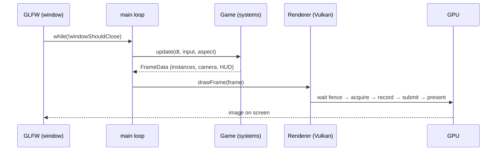

# 01 · Project setup & toolchain 🛠️

> **You'll leave this chapter with:** the project scaffolded and building, the
> Vulkan toolchain installed with **validation layers on**, and — before anything
> else — the two reading conventions this guide uses to tell you *where every
> snippet goes*.
>
> **Files created:** `CMakeLists.txt`, `src/main.cpp`.

This is an **implementation guide**. You build the engine and the game as you
read, and **every line is given** — there is no separate repository to clone and
no step where you are expected to fill in a gap. What the guide asks of you is
that you type the code where it says to, in the order it says to.

That only works if "where" is never in doubt. So we start there.

---

## How to read the code in this guide

Code arrives in small pieces, and **every piece is preceded by a bold line saying
which file it belongs to and where in that file it goes.** There are two forms.

### 1. New or replaced files

A location line ending in *new file* means exactly that — create it and type the
block into it. Here is the shape:

**`src/example/Thing.hpp`** — new file *(illustration only — don't type this one)*:

```cpp
#pragma once

struct Thing {
    int value = 0;
};
```

### 2. Changes to a file you already have

Later chapters almost never re-print a whole file. They show a **`diff`** instead
(again, illustration only — don't type this):

```diff
 struct Thing {
     int value = 0;
-    float scale;
+    float scale = 1.0f;
+    bool enabled = true;
 };
```

Read it like this:

- **Unmarked lines** are already in your file. They are there to show you *where*
  the change goes — find them, and you have found the spot.
- **`-` lines** you delete.
- **`+` lines** you add.

Neither the leading `+`/`-` nor the one space in front of unmarked lines is part
of the code. GitHub renders these blocks red and green, which is why we give up
syntax colouring for them.

The location line above a diff names the file *and* the position inside it —
"in `functionName`, after the `X` call" — so there is exactly one place it can go.

**Two files grow across many chapters:** `src/main.cpp` (the entry point) and
`src/render/Renderer.cpp` (the top-level orchestrator). Expect to see diffs
against those two again and again; that is normal, and it is why they are worth
keeping open in a tab.

A last convention: a chapter that adds no files to the project says
**"Files created: none"** at the top, and any code it shows is a preview.

---

## The toolchain

Vulkan is not "one download." It's a loader, a driver, and a small constellation
of libraries. Here's the whole kit, and why each is here:

| Piece | What it is | Why we need it |
|---|---|---|
| **Vulkan SDK** (LunarG) | The loader, headers, **validation layers**, and `glslc`. | The core API and — crucially — the layers that turn misuse into readable errors. |
| **GLFW** | Cross-platform window + input + Vulkan surface creation. | Vulkan has no windowing of its own; GLFW gives us a window, a `VkSurfaceKHR`, and keyboard input on Linux/Windows/macOS. |
| **GLM** | Header-only vector/matrix/quaternion math, GLSL-shaped. | `vec3`, `mat4`, `quat` in the shapes GLSL uses. (Their *layout* still has rules — the std140 trap, chapter 03.) |
| **VMA** | Vulkan Memory Allocator (AMD). | Real GPU memory management is fiddly; VMA does the allocation and sub-allocation so we don't hand-roll a memory heap. |

Install the **Vulkan SDK** first, from [vulkan.lunarg.com](https://vulkan.lunarg.com)
(Linux packages, or the Windows installer). It sets `VULKAN_SDK` and puts `glslc`
on your `PATH`. Verify it:

```console
$ vulkaninfo | head            # prints your device + supported version
$ glslc --version              # the shader compiler is on PATH
```

GLFW and GLM come from your package manager (`apt install libglfw3-dev libglm-dev`,
`vcpkg install glfw3 glm`, or Homebrew). **VMA** is genuinely one header, which
we vendor into the project below.

---

## Scaffolding the project

Make the tree and fetch VMA:

```console
$ mkdir SpaceFighter && cd SpaceFighter
$ mkdir -p src/ecs src/systems src/render shaders third_party scratch
$ curl -L -o third_party/vk_mem_alloc.h \
    https://raw.githubusercontent.com/GPUOpen-LibrariesAndSDKs/VulkanMemoryAllocator/master/include/vk_mem_alloc.h
```

`scratch/` is for the small throwaway programs a few chapters use to test a piece
in isolation before it has anywhere to live. Nothing in it ships.

CMake needs every source file to exist at configure time, so before the build
file, the stub it will point at:

**`src/main.cpp`** — new file:

```cpp
int main() {
    return 0;
}
```

That is the seed of the real entry point. Chapter 02 gives it a window.

---

## The build file

Now `CMakeLists.txt`. We'll build it in three passes, because the last one is the
only Vulkan-specific part and it deserves its own look.

**`CMakeLists.txt`** — new file:

```cmake
cmake_minimum_required(VERSION 3.19)
project(SpaceFighter LANGUAGES CXX)

set(CMAKE_CXX_STANDARD 17)
set(CMAKE_CXX_STANDARD_REQUIRED ON)

find_package(Vulkan REQUIRED)
find_package(glfw3 3.3 REQUIRED)
find_package(glm REQUIRED)
```

3.19 is the floor because that's the version whose `find_package(Vulkan)` started
exporting the SDK's shader compiler as a CMake target — which the third pass uses.

Next the executable. Only `main.cpp` exists so far; **each chapter that adds a
`.cpp` will add a line here**, and the guide will say so at the time.

**`CMakeLists.txt`** — after the `find_package` calls:

```diff
 find_package(glm REQUIRED)
+
+add_executable(SpaceFighter
+    src/main.cpp
+)
+
+target_include_directories(SpaceFighter PRIVATE src third_party)
+target_link_libraries(SpaceFighter PRIVATE Vulkan::Vulkan glfw)
+
+if (TARGET glm::glm)
+    target_link_libraries(SpaceFighter PRIVATE glm::glm)
+endif()
```

`target_include_directories` with `src` is what lets every file say
`#include "render/Renderer.hpp"` rather than counting `../`s, and `third_party`
is what makes `#include "vk_mem_alloc.h"` work from anywhere.

The `if (TARGET glm::glm)` guard is not superstition: GLM is header-only, and
older packaged versions export no imported target at all — they just drop headers
somewhere `find_package` already found. Link it when it exists, skip it when it
doesn't.

---

## Compiling shaders at build time

Here is the one build step you would not find in a C++ project that wasn't
talking to a GPU. Unlike Metal, where shader source can be compiled from a string
at launch, **Vulkan does not consume GLSL at all** — it consumes **SPIR-V**
bytecode. So shaders are compiled *ahead of time* and loaded as `.spv` files at
runtime (chapter 07.A).

First, pick the compiler:

**`CMakeLists.txt`** — at the end of the file:

```diff
 if (TARGET glm::glm)
     target_link_libraries(SpaceFighter PRIVATE glm::glm)
 endif()
+
+if (TARGET Vulkan::glslc)
+    set(GLSL_COMPILER Vulkan::glslc)
+    set(GLSL_FLAGS "")
+elseif (TARGET Vulkan::glslangValidator)
+    set(GLSL_COMPILER Vulkan::glslangValidator)
+    set(GLSL_FLAGS -V)
+else()
+    message(FATAL_ERROR "No GLSL compiler found. Install the Vulkan SDK.")
+endif()
```

Two compilers, because two worlds. The LunarG SDK ships `glslc`; several Linux
distributions package only `glslangValidator` (in `glslang-tools`). They produce
the same SPIR-V — `glslangValidator` just needs `-V` to be told you want the
Vulkan flavour rather than OpenGL's. Supporting both costs six lines and saves a
reader on a plain Debian box a confusing failure.

Now the rule that runs it over every shader:

**`CMakeLists.txt`** — after the compiler selection:

```diff
 else()
     message(FATAL_ERROR "No GLSL compiler found. Install the Vulkan SDK.")
 endif()
+
+file(GLOB SHADERS CONFIGURE_DEPENDS
+     "${CMAKE_SOURCE_DIR}/shaders/*.vert"
+     "${CMAKE_SOURCE_DIR}/shaders/*.frag")
+
+foreach(shader ${SHADERS})
+    get_filename_component(name ${shader} NAME)
+    set(spv "${CMAKE_BINARY_DIR}/shaders/${name}.spv")
+    add_custom_command(
+        OUTPUT ${spv}
+        COMMAND ${CMAKE_COMMAND} -E make_directory "${CMAKE_BINARY_DIR}/shaders"
+        COMMAND ${GLSL_COMPILER} ${GLSL_FLAGS} ${shader} -o ${spv}
+        DEPENDS ${shader}
+        COMMENT "compiling ${name} -> ${name}.spv")
+    list(APPEND SPV_FILES ${spv})
+endforeach()
+
+add_custom_target(shaders DEPENDS ${SPV_FILES})
+add_dependencies(SpaceFighter shaders)
```

Three details earn their keep here. `CONFIGURE_DEPENDS` makes CMake re-scan the
folder when you *add* a shader — without it a new `.frag` is silently ignored
until you re-run `cmake` by hand, and you spend twenty minutes wondering why your
edits do nothing. `DEPENDS ${shader}` means editing one shader recompiles that one
only. And the output lands in `${CMAKE_BINARY_DIR}/shaders/` — remember that
path, because it's why you'll run the game from inside `build/`.

---

## Checkpoint

Configure, build, run:

```console
$ cmake -S . -B build
$ cmake --build build
$ cd build && ./SpaceFighter ; echo "exit $?"
```

You should see CMake report `Found Vulkan`, the build produce a `SpaceFighter`
binary, and the run print `exit 0` immediately. Nothing else happens yet — the
program is one `return 0`. That's the whole goal: **a project that builds from
day one**, so that every later chapter changes something that already worked.

Run it from inside `build/` from now on. The renderer will load its compiled
shaders by the relative path `shaders/….spv`, and that is where the build wrote
them.

If it doesn't work:

| Symptom | Likely cause |
|---|---|
| `Could NOT find Vulkan` | The SDK isn't on CMake's radar. Source the SDK's `setup-env.sh` (Linux), or check `VULKAN_SDK` is set (Windows), and re-run `cmake`. |
| `Could NOT find glfw3` / `glm` | Not installed, or installed somewhere CMake doesn't look. `apt install libglfw3-dev libglm-dev`, or pass `-DCMAKE_PREFIX_PATH=…`. |
| `No GLSL compiler found` | `find_package(Vulkan)` located headers but no compiler. Install `glslang-tools`, or the full LunarG SDK. |
| `CMake 3.19 or higher is required` | Your CMake predates the `Vulkan::glslc` target. Upgrade; there is no clean workaround. |
| Build succeeds, `./SpaceFighter` says "No such file" | You're not in `build/`. |

**Try breaking it on purpose.** Add `src/Game.cpp` to the `add_executable` list
and re-run `cmake -S . -B build`. CMake fails at *configure* time — before
compiling anything — with `Cannot find source file`. That is why the stub
`main.cpp` had to exist before the build file mentioned it, and why we add source
files to this list only in the chapter that creates them. Take the line back out.

---

## The files you'll create

Every file in the finished project, and the chapter that creates it. You do not
need to make any of these now — this is the map, so that when a chapter says
"in `Renderer.cpp`" you know where you are.

| File | What lives there | Chapter |
|---|---|---|
| `CMakeLists.txt` | the build | 01, grows |
| `src/main.cpp` | window, loop, teardown | 01, **grows** |
| `src/Math.hpp` | GLM setup, MVP helpers, the Vulkan Y-flip | 03 |
| `src/render/RenderTypes.hpp` | the structs the CPU and the shaders share | 03 |
| `src/render/VulkanContext.{hpp,cpp}` | instance, device, queues, VMA | 02 |
| `src/render/VmaImplementation.cpp` | the one TU that compiles VMA | 02 |
| `src/render/Swapchain.{hpp,cpp}` | swapchain, depth, render pass, framebuffers | 05.A |
| `src/render/Renderer.{hpp,cpp}` | commands, sync, buffers, pipelines, the frame | 05.B, **grows** |
| `src/ecs/Entity.hpp` | the id | 04 |
| `src/ecs/ComponentStore.hpp` | the sparse set | 04 |
| `src/ecs/World.hpp` | entities + every store | 04 |
| `src/Components.hpp` | every component struct | 04 |
| `src/GameState.hpp` | score, hull, difficulty knobs | 09 |
| `src/Mesh.{hpp,cpp}` | procedural ship / enemy / bolt / stars / grid | 08 |
| `src/Game.{hpp,cpp}` | the world and the per-frame schedule | 09 |
| `src/Input.hpp` | keys → intent | 10 |
| `src/HUD.{hpp,cpp}` | reticle, hull bar, hit flash | 13 |
| `src/systems/*.hpp` | one file per behaviour, nine in all | 09–12 |
| `shaders/{lit,unlit,star,hud}.{vert,frag}` | the four shader pairs | 07.A |

The `systems/` files are header-only on purpose: a system is one free function
over the world, and making each a header spares you nine more edits to
`CMakeLists.txt` for no benefit.

---

## What you're building toward

A third-person space fighter you fly with the keyboard: an arcade flight model
with pitch, yaw, roll and boost; twin cannons on a cooldown; enemies that warp in
ahead of you, some homing, some tumbling past; sphere collisions, a hull bar and
a hit flash; an endless procedural starfield and a ground grid for a horizon; all
drawn by a Vulkan renderer with five pipelines, a swapchain and depth buffer you
built by hand, VMA-backed memory, and a two-deep frames-in-flight loop.

The controls, wired up in chapter 10:

| Key | Action |
|---|---|
| `W` `S` / `↑` `↓` | Pitch down / up |
| `A` `D` / `←` `→` | Yaw left / right (banks automatically) |
| `Q` `E` | Roll |
| `Left Shift` | Boost |
| `Space` | Fire |
| `Esc` | Quit |

Score, hull and deaths go in the **window title** — chapter 13 explains why text
goes there and not on the HUD.

---

## Why Vulkan?

**Vulkan** is Khronos' low-level, cross-vendor GPU API — the modern successor to
OpenGL, and the layer game engines target on Windows, Linux and Android (and, via
MoltenVK, on Apple hardware). "Low-level" here is literal: you don't just describe
a pipeline and submit commands, you also **choose the GPU, create the swapchain,
manage the memory, and synchronize the CPU and GPU yourself.** There is no scene
graph, no "draw a sphere," and no framework quietly handling the window's images
or pacing your frames.

The alternatives frame the choice:

- **A game engine (Unity, Unreal, Godot)** — the right tool to *ship* a game, the
  wrong tool to *learn what an engine does*.
- **OpenGL** — gentler, but its hidden global state and driver guesswork are
  exactly what Vulkan was designed to replace; it teaches an older model.
- **Metal** — modern and clean, but Apple-only, and MetalKit hides the swapchain
  and the synchronization we most want to understand. (That's the
  [sibling guide](../../space-fighter-metal/).)
- **Vulkan** — explicit, cross-platform, the current industry baseline. Verbose,
  yes — but the verbosity *is* the lesson.

We accept the up-front cost because it pays a specific dividend: after this you
know what a frame is made of, down to the fence that tells the CPU the GPU is done.

## Why an ECS?

A space shooter has ships, bullets, enemies, pickups, explosions — hundreds of
things that are *mostly alike but not quite*. The object-oriented instinct is an
inheritance tree: `Entity → Vehicle → Ship → PlayerShip`. It works until an enemy
needs to be *both* a homing thing *and* a shielded thing *and* a splitter, and
single inheritance can't express it.

An **Entity–Component–System** turns the model inside out: an **entity** is an id,
a **component** is a plain struct of data with no behaviour, and a **system** is a
function over every entity that has a given set of components. A "homing shielded
splitter" is an entity holding `Homing`, `Shield` and `Splitter`. New behaviour is
a new component plus a new system — nothing else changes. And because components
of one type live packed together, systems iterate them cache-friendly.

Chapter 04 builds ours. For now: *data lives in components, behaviour lives in
systems, and they meet in the `World`.*

---

## The shape of a frame

Here is the whole program in one breath. Our loop in `main.cpp` runs until the
window closes, and each iteration does two things:

1. **Simulate.** `Game::update` measures the time since the last frame and runs
   every system in order — read input, fly the ship, spawn and steer enemies, move
   everything, expire bolts, resolve collisions, and finally collect what's visible.
2. **Draw.** `Renderer::drawFrame` takes that collection and performs the Vulkan
   frame: **wait on a fence**, **acquire** a swapchain image, record a command
   buffer, **submit** it with the right semaphores, and **present** the result.



Every chapter zooms into one part of that loop. Keep the picture: **simulate, then
draw** — but note that in Vulkan "then draw" is itself a careful sequence of
*acquire, record, submit, present*, guarded by synchronization primitives. Chapter
05.B is where we build it.

---

## Validation layers: on from the first line

This is the most important paragraph in the chapter. Vulkan's core API does almost
**no error checking** — pass a wrong enum or miss a synchronization step and you
get undefined behaviour, often a blank window with no clue why. The **validation
layers** (shipped in the SDK) sit between your code and the driver and check
everything: object lifetimes, usage flags, synchronization hazards, descriptor
mismatches. They print precise, actionable messages.

We turn them on in the very first line of Vulkan code, next chapter, gated on the
build type so a release build drops them. Leave them on for the entire guide. When
something renders wrong, read the validation output *first* — nine times in ten it
names the mistake. And when it says nothing at all, that silence is information
too: every checkpoint from here on treats a silent run as part of passing.

---

**Next:** the object model — instance, device, queues — and *why* Vulkan makes you
name every one. → [Chapter 02: Vulkan fundamentals](02-vulkan-fundamentals.md)
