# 02 · Vulkan fundamentals: instance, device, queues 🛠️

> **You'll leave this chapter with:** a window on screen, a chosen GPU, a logical
> device and two queues — plus an honest answer to **why Vulkan is so verbose**.
> By the end the program prints the name of the graphics card it picked, which is
> the first thing you build in Vulkan that proves anything.
>
> **Files created:** `src/render/VulkanContext.{hpp,cpp}`,
> `src/render/VmaImplementation.cpp`. `src/main.cpp` and `CMakeLists.txt` grow.

---

## The GPU is a separate computer — and Vulkan hands you the wiring

Vulkan treats the GPU as a second machine on the far end of a wire: you don't call
functions on it, you **write down a list of commands**, hand the list over, and it
runs them and signals when it's done. That much is true of every modern GPU API.

The difference is everything *around* that list. Before your first triangle you
walk a fixed initialisation path, and you walk all of it yourself:

```mermaid
flowchart LR
  I[VkInstance<br/>loader + layers] --> SF[VkSurfaceKHR<br/>the window, via GLFW]
  SF --> P[VkPhysicalDevice<br/>pick a GPU]
  P --> Q[Queue families<br/>what work it accepts]
  Q --> D[VkDevice<br/>logical device]
  D --> QU[VkQueue<br/>submission lanes]
  QU --> SW[Swapchain<br/>images to present]
  SW --> R[Render pass · pipeline<br/>buffers · descriptors]
  R --> SY[Semaphores · fences<br/>you sync it yourself]
```



Everything through the queues is **this chapter**. The rest have their own
chapters — swapchain in 05.A, synchronization in 05.B, buffers in 06, pipelines in
07. Note the surface's position: it is created **right after the instance**,
because choosing a GPU means testing it against the window you'll present to.

That chain *is* Vulkan's reputation. The payoff for walking it: nothing about how
your frame reaches the screen stays hidden.

### The cast of objects

Everyone you'll meet, roughly in order of appearance. The top group is this
chapter; the rest are forward pointers so the whole model is visible at once.

| Object | What it is | Lifetime | Chapter |
|---|---|---|---|
| `VkInstance` | Your handle to the Vulkan loader; holds global config + layers. | Once, at startup | 02 |
| `VkPhysicalDevice` | A specific GPU in the machine (you *query* it, don't create it). | Enumerated once | 02 |
| `VkDevice` | The **logical device** — your configured connection to one GPU. | Once | 02 |
| `VkQueue` | A lane you submit command buffers to (graphics, present). | Once | 02 |
| `VkSurfaceKHR` | The window you'll present to (created by GLFW). | Once | 02 |
| `VmaAllocator` | VMA's handle; every buffer and image is allocated through it. | Once | 02 |
| `VkSwapchainKHR` | The ring of images shown on screen. | Once (rebuilt on resize) | 05.A |
| `VkImageView` / `VkFramebuffer` | How a pass addresses an image; what it renders into. | Per swapchain image | 05.A |
| `VkRenderPass` | The declared structure of a rendering operation. | Once | 05.A |
| `VkCommandPool` / `VkCommandBuffer` | Where commands are allocated / recorded. | Pool once; buffers per slot | 05.B |
| `VkSemaphore` / `VkFence` | GPU↔GPU and GPU↔CPU synchronization. | Per frame-in-flight | 05.B |
| `VkBuffer` + `VmaAllocation` | GPU-accessible memory (vertices, instances, uniforms). | Meshes once; per-frame data cycled | 06 |
| `VkDescriptorSet` | A bound bundle of resources the shader reads. | Per frame-in-flight | 06 |
| `VkPipeline` | The frozen recipe: shaders + *all* fixed-function state. | Once per material | 07.B |

Build the top group **once** and reuse it. That's what `VulkanContext` is for: it
owns every handle in this chapter and nothing that changes per frame.

---

## Every call has the same shape

Learn this pattern once and the rest of the API reads itself. Almost nothing in
Vulkan is passed as loose arguments. You **fill a `Vk…CreateInfo` struct** — whose
first field is always its own type tag, `sType` — and pass a pointer to a
`vkCreate…` function that writes a handle back (illustration only — don't type
this):

```cpp
VkThingCreateInfo ci{};
ci.sType = VK_STRUCTURE_TYPE_THING_CREATE_INFO;
ci.someField = /* … */;
VkThing thing;
vkCreateThing(device, &ci, nullptr, &thing);
```

It's verbose, but it's *regular*: extensible (new fields chain off `pNext`),
self-describing (validation reads `sType` to know what it's inspecting), and once
your eye learns it, a 20-line struct fill is skimmable. Every object in this guide
is this pattern. That `nullptr` is the allocation-callbacks slot; we never use it.

---

## The header

Start with what the rest of the renderer will `#include`. Include order matters
here more than usual — VMA's header needs Vulkan's types already in scope.

**`src/render/VulkanContext.hpp`** — new file:

```cpp
#pragma once

#include <vulkan/vulkan.h>

#include <GLFW/glfw3.h>

#include "vk_mem_alloc.h"

#include <cstdint>
#include <optional>

#ifdef NDEBUG
constexpr bool kEnableValidation = false;
#else
constexpr bool kEnableValidation = true;
#endif
```

`kEnableValidation` is the switch from chapter 01's closing section, and `NDEBUG`
is the flag CMake defines for you in a Release build. Debug builds get the layers;
release builds drop them and their cost. There is no runtime option, deliberately
— an option you can turn off while learning is an option you will turn off.

Vulkan reports failure by returning a `VkResult`, not by throwing. An unchecked
result is how a typo becomes a black screen twenty minutes later, so every call in
this project goes through one helper:

**`VulkanContext.hpp`** — after the validation flag:

```diff
 #else
 constexpr bool kEnableValidation = true;
 #endif
+
+/// Aborts with the failing call's name. Vulkan returns codes rather than
+/// throwing, and an unchecked VkResult is how a bug becomes a black screen.
+void vkCheck(VkResult result, const char* what);
```

Next, queue families. A **queue** is a lane you submit work to; a **queue family**
is a group of lanes that accept the same kinds of work. We need one that can do
graphics and one that can present to our window — usually the same family, but not
always, so we track both:

**`VulkanContext.hpp`** — after `vkCheck`:

```diff
 void vkCheck(VkResult result, const char* what);
+
+struct QueueFamilies {
+    std::optional<uint32_t> graphics;
+    std::optional<uint32_t> present;
+    bool ok() const { return graphics.has_value() && present.has_value(); }
+};
+
+QueueFamilies findQueueFamilies(VkPhysicalDevice dev, VkSurfaceKHR surface);
```

`std::optional` rather than a sentinel like `-1`: family index 0 is perfectly
valid, so "unset" needs to be a state the type can express, not a magic number.

Now the class itself. Public first — these are the handles every later chapter
reaches for:

**`VulkanContext.hpp`** — after `findQueueFamilies`:

```diff
 QueueFamilies findQueueFamilies(VkPhysicalDevice dev, VkSurfaceKHR surface);
+
+/// The once-only Vulkan objects: everything created at startup and destroyed at
+/// exit, with no per-frame state.
+class VulkanContext {
+public:
+    void init(GLFWwindow* w);
+    void destroy();
+
+    VkInstance instance = VK_NULL_HANDLE;
+    VkDebugUtilsMessengerEXT debugMessenger = VK_NULL_HANDLE;
+    VkSurfaceKHR surface = VK_NULL_HANDLE;
+    VkPhysicalDevice physical = VK_NULL_HANDLE;
+    VkPhysicalDeviceProperties properties{};
+    VkDevice device = VK_NULL_HANDLE;
+    VkQueue graphicsQueue = VK_NULL_HANDLE;
+    VkQueue presentQueue = VK_NULL_HANDLE;
+    QueueFamilies families;
+    VmaAllocator allocator = VK_NULL_HANDLE;
+};
```

Public data members, no getters. This is a bag of handles that half the renderer
needs; wrapping ten of them in accessors would add a hundred lines and hide
nothing. `VK_NULL_HANDLE` on every one matters — teardown checks these, and an
uninitialised handle passed to `vkDestroy…` is a crash.

Then the private steps, which are just the diagram above, one method each:

**`VulkanContext.hpp`**, in `class VulkanContext` — after the `allocator` member:

```diff
     QueueFamilies families;
     VmaAllocator allocator = VK_NULL_HANDLE;
+
+private:
+    void createInstance();
+    void createDebugMessenger();
+    void pickPhysicalDevice();
+    void createLogicalDevice();
+    void createAllocator();
+
+    GLFWwindow* window = nullptr;
 };
```

---

## Step 1 — the instance

The **instance** is your process's connection to the Vulkan loader. Creating it is
where you declare which **layers** (validation!) and **extensions** (the surface
support GLFW needs) you want.

**`src/render/VulkanContext.cpp`** — new file:

```cpp
#include "render/VulkanContext.hpp"

#include <cstdio>
#include <cstring>
#include <set>
#include <stdexcept>
#include <string>
#include <vector>

namespace {

const char* kValidationLayer = "VK_LAYER_KHRONOS_validation";
const char* kDeviceExtensions[] = {VK_KHR_SWAPCHAIN_EXTENSION_NAME};

} // namespace
```

Everything in that anonymous namespace is internal to this file. We'll grow it
before we write any methods. First, the function validation calls when it has
something to say:

**`VulkanContext.cpp`**, in the anonymous namespace — after `kDeviceExtensions`:

```diff
 const char* kDeviceExtensions[] = {VK_KHR_SWAPCHAIN_EXTENSION_NAME};
+
+VKAPI_ATTR VkBool32 VKAPI_CALL debugCallback(
+    VkDebugUtilsMessageSeverityFlagBitsEXT, VkDebugUtilsMessageTypeFlagsEXT,
+    const VkDebugUtilsMessengerCallbackDataEXT* data, void*) {
+    std::fprintf(stderr, "[vulkan] %s\n", data->pMessage);
+    return VK_FALSE;   // do not abort the offending call
+}
 
 } // namespace
```

Returning `VK_FALSE` means "print it, but let the call proceed." Return `VK_TRUE`
and Vulkan aborts the offending call instead — occasionally useful under a
debugger, miserable as a default. The three unnamed parameters are severity, type
and a user-data pointer; we print everything the layers give us and don't
distinguish.

Two capability checks, because Vulkan enables nothing you didn't ask for and
crashes if you ask for something absent:

**`VulkanContext.cpp`**, in the anonymous namespace — after `debugCallback`:

```diff
     return VK_FALSE;   // do not abort the offending call
 }
+
+bool hasValidationLayer() {
+    uint32_t n = 0;
+    vkEnumerateInstanceLayerProperties(&n, nullptr);
+    std::vector<VkLayerProperties> layers(n);
+    vkEnumerateInstanceLayerProperties(&n, layers.data());
+    for (const VkLayerProperties& l : layers)
+        if (std::strcmp(l.layerName, kValidationLayer) == 0) return true;
+    return false;
+}
 
 } // namespace
```

That call-it-twice shape — once with `nullptr` to learn the count, once to fill a
vector — is Vulkan's universal "give me a list" idiom. You will type it a dozen
times before the guide is out. The device-side twin:

**`VulkanContext.cpp`**, in the anonymous namespace — after `hasValidationLayer`:

```diff
     return false;
 }
+
+bool hasSwapchainExtension(VkPhysicalDevice dev) {
+    uint32_t n = 0;
+    vkEnumerateDeviceExtensionProperties(dev, nullptr, &n, nullptr);
+    std::vector<VkExtensionProperties> exts(n);
+    vkEnumerateDeviceExtensionProperties(dev, nullptr, &n, exts.data());
+    for (const VkExtensionProperties& e : exts)
+        if (std::strcmp(e.extensionName, VK_KHR_SWAPCHAIN_EXTENSION_NAME) == 0) return true;
+    return false;
+}
 
 } // namespace
```

Now `vkCheck` and the queue-family query, which is the one place we ask the GPU a
question whose answer changes what we do:

**`VulkanContext.cpp`** — after the anonymous namespace:

```diff
 } // namespace
+
+void vkCheck(VkResult result, const char* what) {
+    if (result != VK_SUCCESS)
+        throw std::runtime_error(std::string(what) + " failed with VkResult " +
+                                 std::to_string(int(result)));
+}
```

**`VulkanContext.cpp`** — after `vkCheck`:

```diff
                                  std::to_string(int(result)));
 }
+
+QueueFamilies findQueueFamilies(VkPhysicalDevice dev, VkSurfaceKHR surface) {
+    uint32_t n = 0;
+    vkGetPhysicalDeviceQueueFamilyProperties(dev, &n, nullptr);
+    std::vector<VkQueueFamilyProperties> fams(n);
+    vkGetPhysicalDeviceQueueFamilyProperties(dev, &n, fams.data());
+
+    QueueFamilies out;
+    for (uint32_t i = 0; i < n; i++) {
+        if (fams[i].queueFlags & VK_QUEUE_GRAPHICS_BIT) out.graphics = i;
+        VkBool32 canPresent = VK_FALSE;
+        vkGetPhysicalDeviceSurfaceSupportKHR(dev, i, surface, &canPresent);
+        if (canPresent) out.present = i;
+    }
+    return out;
+}
```

Note the asymmetry: whether a family does *graphics* is a property of the family
alone (`queueFlags`), but whether it can *present* depends on the surface, so it
takes its own call with the surface passed in. On most desktop GPUs one family
does both. Some drivers split them, and correct code handles that — which is why
we track two indices even though they'll usually be equal.

Here is the whole chapter's work in six lines:

**`VulkanContext.cpp`** — after `findQueueFamilies`:

```diff
     return out;
 }
+
+void VulkanContext::init(GLFWwindow* w) {
+    window = w;
+    createInstance();
+    createDebugMessenger();
+    vkCheck(glfwCreateWindowSurface(instance, window, nullptr, &surface),
+            "glfwCreateWindowSurface");
+    pickPhysicalDevice();
+    createLogicalDevice();
+    createAllocator();
+}
```

`glfwCreateWindowSurface` is GLFW earning its place: one portable call in place of
`vkCreateXcbSurfaceKHR`, `vkCreateWin32SurfaceKHR` and friends. It has to come
after the instance and before device selection, exactly as the diagram showed.

### The instance itself

**`VulkanContext.cpp`** — after `VulkanContext::init`:

```diff
     createAllocator();
 }
+
+void VulkanContext::createInstance() {
+    VkApplicationInfo app{};
+    app.sType = VK_STRUCTURE_TYPE_APPLICATION_INFO;
+    app.pApplicationName = "SpaceFighter";
+    app.applicationVersion = VK_MAKE_VERSION(1, 0, 0);
+    app.pEngineName = "SpaceFighter";
+    app.apiVersion = VK_API_VERSION_1_2;
+}
```

`apiVersion` is the version you promise to obey, not a request for features — ask
for 1.2 and the loader holds you to 1.2's rules. The name fields are pure
metadata; some drivers keep per-application tuning profiles keyed off them.

Now the two lists. GLFW knows which extensions the window system needs; we add the
debug-messenger extension only when we're actually going to use it:

**`VulkanContext.cpp`**, in `createInstance` — after `app.apiVersion`:

```diff
     app.apiVersion = VK_API_VERSION_1_2;
+
+    uint32_t glfwCount = 0;
+    const char** glfwExt = glfwGetRequiredInstanceExtensions(&glfwCount);
+    std::vector<const char*> extensions(glfwExt, glfwExt + glfwCount);
+
+    std::vector<const char*> layers;
+    bool validation = kEnableValidation && hasValidationLayer();
+    if (validation) {
+        layers.push_back(kValidationLayer);
+        extensions.push_back(VK_EXT_DEBUG_UTILS_EXTENSION_NAME);
+    } else if (kEnableValidation) {
+        std::fprintf(stderr, "[vulkan] validation layers requested but not available\n");
+    }
 }
```

That `else if` branch is small and important. Asking for a layer the machine
doesn't have makes `vkCreateInstance` fail with `VK_ERROR_LAYER_NOT_PRESENT`, and
"my program won't start" is a much worse first experience than "validation is off,
here's why". We degrade, loudly.

**`VulkanContext.cpp`**, in `createInstance` — after the layer selection:

```diff
         std::fprintf(stderr, "[vulkan] validation layers requested but not available\n");
     }
+
+    VkInstanceCreateInfo ci{};
+    ci.sType = VK_STRUCTURE_TYPE_INSTANCE_CREATE_INFO;
+    ci.pApplicationInfo = &app;
+    ci.enabledExtensionCount = uint32_t(extensions.size());
+    ci.ppEnabledExtensionNames = extensions.data();
+    ci.enabledLayerCount = uint32_t(layers.size());
+    ci.ppEnabledLayerNames = layers.data();
+
+    vkCheck(vkCreateInstance(&ci, nullptr, &instance), "vkCreateInstance");
 }
```

The load-bearing habit: **you opt in to everything.** Layers, extensions, and later
every device feature and image format — Vulkan enables *nothing* by default. If you
didn't ask for it, it isn't on.

---

## The messenger that can't see its own creation

Write the callback registration next, and notice what it can't do.

**`VulkanContext.cpp`** — after `createInstance`:

```diff
     vkCheck(vkCreateInstance(&ci, nullptr, &instance), "vkCreateInstance");
 }
+
+void VulkanContext::createDebugMessenger() {
+    if (!kEnableValidation) return;
+    auto create = reinterpret_cast<PFN_vkCreateDebugUtilsMessengerEXT>(
+        vkGetInstanceProcAddr(instance, "vkCreateDebugUtilsMessengerEXT"));
+    if (!create) return;
+
+    VkDebugUtilsMessengerCreateInfoEXT dbg{};
+    dbg.sType = VK_STRUCTURE_TYPE_DEBUG_UTILS_MESSENGER_CREATE_INFO_EXT;
+    dbg.messageSeverity = VK_DEBUG_UTILS_MESSAGE_SEVERITY_WARNING_BIT_EXT
+                        | VK_DEBUG_UTILS_MESSAGE_SEVERITY_ERROR_BIT_EXT;
+    dbg.messageType = VK_DEBUG_UTILS_MESSAGE_TYPE_VALIDATION_BIT_EXT
+                    | VK_DEBUG_UTILS_MESSAGE_TYPE_PERFORMANCE_BIT_EXT;
+    dbg.pfnUserCallback = debugCallback;
+    vkCheck(create(instance, &dbg, nullptr, &debugMessenger),
+            "vkCreateDebugUtilsMessengerEXT");
+}
```

`vkCreateDebugUtilsMessengerEXT` is itself an extension function, so it isn't in
the loader's static export table — you fetch its address by name with
`vkGetInstanceProcAddr`. That's the shape of every extension entry point.

This compiles and it works. It also has a hole, and it's a hole you will fall into
exactly once, on the day it matters most.

**The messenger is created *from* the instance. So it does not exist while the
instance is being created.** If your `VkInstanceCreateInfo` is malformed — a bad
extension name, a mistyped `sType` — validation has plenty to say about it and
absolutely nowhere to say it. You get `vkCreateInstance` failing with a numeric
code and silence.

The fix is a nice piece of Vulkan design: `pNext`. Chain a *second* messenger
create-info onto the instance create-info, and the loader spins up a temporary
messenger that lives exactly as long as `vkCreateInstance` and `vkDestroyInstance`.
Since we now need that struct filled in two places, lift it into a helper first:

**`VulkanContext.cpp`**, in the anonymous namespace — after `hasSwapchainExtension`:

```diff
         if (std::strcmp(e.extensionName, VK_KHR_SWAPCHAIN_EXTENSION_NAME) == 0) return true;
     return false;
 }
+
+void fillDebugCreateInfo(VkDebugUtilsMessengerCreateInfoEXT& dbg) {
+    dbg = {};
+    dbg.sType = VK_STRUCTURE_TYPE_DEBUG_UTILS_MESSENGER_CREATE_INFO_EXT;
+    dbg.messageSeverity = VK_DEBUG_UTILS_MESSAGE_SEVERITY_WARNING_BIT_EXT
+                        | VK_DEBUG_UTILS_MESSAGE_SEVERITY_ERROR_BIT_EXT;
+    dbg.messageType = VK_DEBUG_UTILS_MESSAGE_TYPE_VALIDATION_BIT_EXT
+                    | VK_DEBUG_UTILS_MESSAGE_TYPE_PERFORMANCE_BIT_EXT;
+    dbg.pfnUserCallback = debugCallback;
+}
 
 } // namespace
```

Now collapse the duplicated fill in `createDebugMessenger`:

**`VulkanContext.cpp`**, in `createDebugMessenger` — replace the struct fill:

```diff
     VkDebugUtilsMessengerCreateInfoEXT dbg{};
-    dbg.sType = VK_STRUCTURE_TYPE_DEBUG_UTILS_MESSENGER_CREATE_INFO_EXT;
-    dbg.messageSeverity = VK_DEBUG_UTILS_MESSAGE_SEVERITY_WARNING_BIT_EXT
-                        | VK_DEBUG_UTILS_MESSAGE_SEVERITY_ERROR_BIT_EXT;
-    dbg.messageType = VK_DEBUG_UTILS_MESSAGE_TYPE_VALIDATION_BIT_EXT
-                    | VK_DEBUG_UTILS_MESSAGE_TYPE_PERFORMANCE_BIT_EXT;
-    dbg.pfnUserCallback = debugCallback;
+    fillDebugCreateInfo(dbg);
     vkCheck(create(instance, &dbg, nullptr, &debugMessenger),
             "vkCreateDebugUtilsMessengerEXT");
 }
```

And chain one onto instance creation:

**`VulkanContext.cpp`**, in `createInstance` — after `ci.ppEnabledLayerNames`:

```diff
     ci.ppEnabledLayerNames = layers.data();
+
+    // Chained so the messenger also covers vkCreateInstance itself.
+    VkDebugUtilsMessengerCreateInfoEXT dbg{};
+    if (validation) {
+        fillDebugCreateInfo(dbg);
+        ci.pNext = &dbg;
+    }
 
     vkCheck(vkCreateInstance(&ci, nullptr, &instance), "vkCreateInstance");
 }
```

`dbg` must outlive the `vkCreateInstance` call, which is why it's declared in the
enclosing scope and not inside the `if`. Take a moment on that: `pNext` chains are
raw pointers into structs *you* own, and a create-info that points at a dead local
is one of the more baffling ways to corrupt a Vulkan call.

---

## Step 2 — picking a physical device

`vkEnumeratePhysicalDevices` lists the GPUs in the machine. Vulkan won't choose for
you: you **inspect each candidate and decide.**

**`VulkanContext.cpp`** — after `createDebugMessenger`:

```diff
     vkCheck(create(instance, &dbg, nullptr, &debugMessenger),
             "vkCreateDebugUtilsMessengerEXT");
 }
+
+void VulkanContext::pickPhysicalDevice() {
+    uint32_t n = 0;
+    vkEnumeratePhysicalDevices(instance, &n, nullptr);
+    if (n == 0) throw std::runtime_error("no Vulkan-capable GPU found");
+    std::vector<VkPhysicalDevice> devices(n);
+    vkEnumeratePhysicalDevices(instance, &n, devices.data());
+}
```

Then score the candidates. "Suitable" means it supports the swapchain extension
*and* has a queue family that can present to our surface; among the suitable ones,
prefer a discrete card:

**`VulkanContext.cpp`**, in `pickPhysicalDevice` — after the enumeration:

```diff
     vkEnumeratePhysicalDevices(instance, &n, devices.data());
+
+    int best = -1;
+    for (VkPhysicalDevice dev : devices) {
+        if (!hasSwapchainExtension(dev)) continue;
+        if (!findQueueFamilies(dev, surface).ok()) continue;
+
+        VkPhysicalDeviceProperties props;
+        vkGetPhysicalDeviceProperties(dev, &props);
+        int score = 0;
+        if (props.deviceType == VK_PHYSICAL_DEVICE_TYPE_DISCRETE_GPU) score += 1000;
+        score += int(props.limits.maxImageDimension2D);
+
+        if (score > best) {
+            best = score;
+            physical = dev;
+            properties = props;
+        }
+    }
 }
```

`maxImageDimension2D` as a tiebreaker is a crude proxy for "bigger GPU", and it's
honest to call it crude — it happens to correlate, and a real engine would score
on memory size, feature support and vendor quirks instead. The structure is the
point: *you* define suitable.

**`VulkanContext.cpp`**, in `pickPhysicalDevice` — after the scoring loop:

```diff
             properties = props;
         }
     }
+    if (physical == VK_NULL_HANDLE)
+        throw std::runtime_error("no GPU can both render and present to this surface");
+
+    families = findQueueFamilies(physical, surface);
+    std::printf("[vulkan] using %s (Vulkan %u.%u)\n", properties.deviceName,
+                VK_VERSION_MAJOR(properties.apiVersion),
+                VK_VERSION_MINOR(properties.apiVersion));
 }
```

That `printf` is this chapter's checkpoint, and it's worth keeping permanently:
"which GPU am I actually on?" is the first question of every graphics bug report.

This is a real decision Metal and OpenGL never surfaced. A laptop might have
integrated *and* discrete GPUs; a workstation might have two cards. You say which
— and you can read `props.limits` to know exactly what it supports *before* you
rely on anything.

---

## Step 3 — the logical device and its queues

The **logical device** is your configured handle to the chosen GPU. Creating it is
where you say which queue families to pull lanes from:

**`VulkanContext.cpp`** — after `pickPhysicalDevice`:

```diff
                 VK_VERSION_MINOR(properties.apiVersion));
 }
+
+void VulkanContext::createLogicalDevice() {
+    float priority = 1.0f;
+    std::set<uint32_t> unique = {*families.graphics, *families.present};
+    std::vector<VkDeviceQueueCreateInfo> queueInfos;
+    for (uint32_t f : unique) {
+        VkDeviceQueueCreateInfo q{};
+        q.sType = VK_STRUCTURE_TYPE_DEVICE_QUEUE_CREATE_INFO;
+        q.queueFamilyIndex = f;
+        q.queueCount = 1;
+        q.pQueuePriorities = &priority;
+        queueInfos.push_back(q);
+    }
+}
```

The `std::set` is doing real work: when graphics and present are the *same* family
— the common case — asking for that family twice is invalid usage. Deduplicating
turns two cases into one piece of code.

Then the features and the create-info:

**`VulkanContext.cpp`**, in `createLogicalDevice` — after the queue-info loop:

```diff
         queueInfos.push_back(q);
     }
+
+    VkPhysicalDeviceFeatures features{};
+    features.largePoints = VK_TRUE;   // stars draw as 2-px points
+
+    VkDeviceCreateInfo ci{};
+    ci.sType = VK_STRUCTURE_TYPE_DEVICE_CREATE_INFO;
+    ci.queueCreateInfoCount = uint32_t(queueInfos.size());
+    ci.pQueueCreateInfos = queueInfos.data();
+    ci.enabledExtensionCount = 1;
+    ci.ppEnabledExtensionNames = kDeviceExtensions;
+    ci.pEnabledFeatures = &features;
+
+    vkCheck(vkCreateDevice(physical, &ci, nullptr, &device), "vkCreateDevice");
 }
```

`pEnabledFeatures` is the opt-in rule again: the physical device *advertises* what
it supports, but anything you don't switch on here is off even when the hardware
has it. `largePoints` is the single optional feature this game uses — the starfield
in chapter 08 draws 2-pixel points, and without this the driver is entitled to clamp
every point to one pixel.

**`VulkanContext.cpp`**, in `createLogicalDevice` — after `vkCreateDevice`:

```diff
     vkCheck(vkCreateDevice(physical, &ci, nullptr, &device), "vkCreateDevice");
+    vkGetDeviceQueue(device, *families.graphics, 0, &graphicsQueue);
+    vkGetDeviceQueue(device, *families.present, 0, &presentQueue);
 }
```

You don't *create* queues — they come with the device, and `vkGetDeviceQueue` hands
you a handle to one that already exists.

---

## VMA, and the one translation unit that owns it

Raw Vulkan memory allocation is a chore: query memory *types*, find one matching
your buffer's requirements, call `vkAllocateMemory` — and then discover that real
GPUs cap the number of allocations, so you're expected to sub-allocate many buffers
out of a few big blocks. **VMA** does all of it. Chapter 06 uses it constantly; we
create the allocator here because it belongs to the device's lifetime.

**`VulkanContext.cpp`** — after `createLogicalDevice`:

```diff
     vkGetDeviceQueue(device, *families.present, 0, &presentQueue);
 }
+
+void VulkanContext::createAllocator() {
+    VmaAllocatorCreateInfo aci{};
+    aci.physicalDevice = physical;
+    aci.device = device;
+    aci.instance = instance;
+    aci.vulkanApiVersion = VK_API_VERSION_1_2;
+    vkCheck(vmaCreateAllocator(&aci, &allocator), "vmaCreateAllocator");
+}
```

VMA is a single-header library, which means exactly one translation unit must
define `VMA_IMPLEMENTATION` to emit its ~20,000 lines of definitions. Give it a
file of its own:

**`src/render/VmaImplementation.cpp`** — new file:

```cpp
// VMA is a single-header library: exactly one translation unit must define
// VMA_IMPLEMENTATION to emit its definitions. Giving it a file of its own means
// its ~20k lines are compiled once and its warnings never mix with ours.

#define VMA_IMPLEMENTATION

#include <vulkan/vulkan.h>

#include "vk_mem_alloc.h"
```

You could put that `#define` at the top of `VulkanContext.cpp` and save a file.
Don't: you'd recompile all twenty thousand lines every time you touch the context,
and every warning VMA emits under `-Wall` would land in the middle of your own.

---

## Teardown, in reverse

Vulkan objects must be destroyed in the opposite order they were created — a child
handle outliving its parent is undefined behaviour, and validation will tell you so
in detail.

**`VulkanContext.cpp`** — after `createAllocator`:

```diff
     vkCheck(vmaCreateAllocator(&aci, &allocator), "vmaCreateAllocator");
 }
+
+void VulkanContext::destroy() {
+    if (allocator) vmaDestroyAllocator(allocator);
+    if (device) vkDestroyDevice(device, nullptr);
+    if (debugMessenger) {
+        auto destroyMessenger = reinterpret_cast<PFN_vkDestroyDebugUtilsMessengerEXT>(
+            vkGetInstanceProcAddr(instance, "vkDestroyDebugUtilsMessengerEXT"));
+        if (destroyMessenger) destroyMessenger(instance, debugMessenger, nullptr);
+    }
+    if (surface) vkDestroySurfaceKHR(instance, surface, nullptr);
+    if (instance) vkDestroyInstance(instance, nullptr);
+}
```

Read it bottom-up and it's `init` backwards. The messenger goes after the device
on purpose — it is the last thing that can still report a mistake made during
teardown, and teardown is where mistakes hide.

---

## Opening a window

`main.cpp` is still chapter 01's stub. Replace it — this is the first of several
times it grows.

**`src/main.cpp`** — replace the whole file:

```cpp
#include "render/VulkanContext.hpp"

#include <cstdio>
#include <exception>

namespace {

constexpr int kInitialWidth = 1280;
constexpr int kInitialHeight = 720;

} // namespace
```

**`main.cpp`** — after the anonymous namespace:

```diff
 } // namespace
+
+int main() {
+    if (!glfwInit()) {
+        std::fprintf(stderr, "glfwInit failed\n");
+        return 1;
+    }
+
+    // Vulkan supplies its own surface; GLFW must not create an OpenGL context.
+    glfwWindowHint(GLFW_CLIENT_API, GLFW_NO_API);
+    GLFWwindow* window =
+        glfwCreateWindow(kInitialWidth, kInitialHeight, "Space Fighter", nullptr, nullptr);
+    if (!window) {
+        std::fprintf(stderr, "failed to create a window\n");
+        glfwTerminate();
+        return 1;
+    }
+}
```

`GLFW_CLIENT_API, GLFW_NO_API` is the one hint you cannot skip. GLFW's default is
to create an OpenGL context for the window; leave that on and you get a context you
never use, plus surface creation that fails on some drivers.

**`main.cpp`**, in `main` — after the window creation:

```diff
         glfwTerminate();
         return 1;
     }
+
+    VulkanContext ctx;
+
+    try {
+        ctx.init(window);
+    } catch (const std::exception& e) {
+        std::fprintf(stderr, "startup failed: %s\n", e.what());
+        glfwDestroyWindow(window);
+        glfwTerminate();
+        return 1;
+    }
 }
```

Catching here rather than letting the exception escape `main` means a failed
startup prints one readable line and still tears the window down, instead of
dumping a `terminate called after throwing` at the user.

**`main.cpp`**, in `main` — after the `try`/`catch` around `ctx.init`:

```diff
         glfwTerminate();
         return 1;
     }
+
+    while (!glfwWindowShouldClose(window)) {
+        glfwPollEvents();
+        if (glfwGetKey(window, GLFW_KEY_ESCAPE) == GLFW_PRESS)
+            glfwSetWindowShouldClose(window, GLFW_TRUE);
+    }
+
+    ctx.destroy();
+    glfwDestroyWindow(window);
+    glfwTerminate();
+    return 0;
 }
```

`glfwPollEvents` is what makes the keyboard and the window's close button work;
forget it and the window hangs, unresponsive, and your OS offers to kill it.

Finally, tell CMake about the two new sources:

**`CMakeLists.txt`**, in `add_executable` — after `src/main.cpp`:

```diff
 add_executable(SpaceFighter
     src/main.cpp
+    src/render/VmaImplementation.cpp
+    src/render/VulkanContext.cpp
 )
```

---

## Checkpoint

```console
$ cmake -S . -B build && cmake --build build
$ cd build && ./SpaceFighter
```

A 1280×720 window titled **Space Fighter** opens, containing whatever garbage was
in that region of the screen — we have not drawn a pixel yet, and we won't until
chapter 05.B. On stderr you should see exactly one line:

```console
[vulkan] using NVIDIA GeForce RTX 4070 (Vulkan 1.3)
```

with your own card's name. `Esc` or the close button exits, and **nothing else is
printed** — no validation output on the way in or on the way out. That silence is
the real result: it means the instance, device, queues, surface and allocator were
all created and destroyed correctly.

| Symptom | Likely cause |
|---|---|
| `validation layers requested but not available` | The layers aren't installed. `apt install vulkan-validationlayers`, or install the full SDK. The program still runs — with no safety net. |
| `no Vulkan-capable GPU found` | No ICD is installed. Install your vendor's driver; `vulkaninfo` will fail the same way. |
| `no GPU can both render and present to this surface` | Real on some headless or remote-display setups. If you're over SSH or in a container, that's why. |
| `vkCreateInstance failed with VkResult -9` | `-9` is `VK_ERROR_INCOMPATIBLE_DRIVER`. On macOS you also need the portability-enumeration flag; see chapter 14. |
| A validation error naming `VkSurfaceKHR` at exit | Destroy order. The surface must go before the instance, the device before both. |
| Window opens then closes immediately | An exception escaped `init`; the message is on stderr above it. |

**Try breaking it on purpose.** In `destroy()`, move the
`vkDestroyInstance` line to the top of the function and re-run. The instance now
dies while the device and surface still reference it, and validation says so by
name — something like *"OBJ ERROR : For VkInstance … VkSurfaceKHR object … has not
been destroyed."* That message is what the layers are for; put the line back.

---

## Why so verbose? The honest answer

You have written about 200 lines and drawn nothing. It is fair to ask what that
bought. Three real things:

1. **Explicit is debuggable.** Every capability was queried, every feature opted
   into. There is no hidden default to fight — when something's wrong, the object
   that's wrong is one *you* created, with a validation message attached to it.
2. **Explicit is predictable.** By choosing the device, queues, formats and
   synchronization yourself, the same code behaves the same across vendors.
   OpenGL's "the driver will figure it out" is exactly the unpredictability Vulkan
   was designed to remove.
3. **Explicit is fast — when you need it.** All the state you're forced to name is
   state a high-level API was *guessing at* per draw. Naming it once, up front,
   lets the driver skip per-draw validation.

And the counterpoint, just as honest: **for a small game none of that is free, and
some of it you will never feel.** The verbosity is worth it *to learn*, because it
shows you the machine, and worth it *at scale*, because that's where the control
pays. For a weekend prototype, an engine is less code. You're here to see how it
works.

---

## Challenge

Make the GPU choice controllable: read an environment variable `SF_GPU` and, if
set, prefer the first device whose `deviceName` contains that substring, falling
back to the scoring loop when nothing matches.

Three things to get right. `properties` must be updated alongside `physical` or
the printout will name a different card than the one you're using. `families` is
computed *after* the loop and depends on the winner, so it can't be hoisted.
And decide what "no match" means — silently falling back is friendlier, but a
reader who typos `SF_GPU=nvidai` will spend ten minutes wondering why nothing
changed, so print when you ignore it.

---

**Next:** the vectors, matrices and quaternions the shaders will multiply by — and
Vulkan's Y-down, 0..1-depth clip space. →
[Chapter 03: The math you need](03-the-math-you-need.md)
