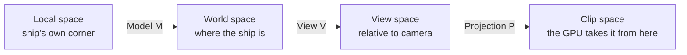

# 03 · The math you need 🛠️

> **You'll leave this chapter with:** enough linear algebra to read every matrix in
> the project, an understanding of *why we orient ships with quaternions*, and —
> the Vulkan-specific part — the **three rules that differ from every OpenGL
> tutorial**: depth runs 0..1, Y points **down** in clip space, and shared structs
> obey std140 padding. You will make each of those three mistakes deliberately and
> watch it fail.
>
> **Files created:** `src/Math.hpp`, `src/render/RenderTypes.hpp`,
> `scratch/math_check.cpp`.

You do not need to love math to build this. You need four things: vectors, the
model/view/projection chain, quaternions for rotation, and the **GLM** library that
makes all of it one-liners.

---

## Our conventions (pin these up)

Everything in the codebase obeys these five rules. Most 3D bugs are a violation of
one of them.

1. **Right-handed world space.** +X is right, +Y is up, +Z points *toward* the
   viewer. So a ship's **forward is its local −Z**. (Point your right hand's
   fingers from +X to +Y; your thumb points +Z, out of the screen.)
2. **Column-major matrices.** A transform applies as `M * v`, and composition reads
   **right-to-left**: `translate * rotate * scale` scales first, rotates next,
   translates last. This is what GLM stores and what GLSL expects.
3. **Clip-space depth in [0, 1].** Vulkan's normalised depth runs 0 (near) to 1
   (far) — *not* OpenGL's −1…1.
4. **Vulkan clip space has +Y pointing *down*.** `y = +1` is the *bottom* of the
   screen, `y = −1` the top — the opposite of OpenGL and Metal.
5. **Angles in radians.** `glm::radians(deg)` converts from the degrees humans
   think in.

Rules 3 and 4 are where people who ported an OpenGL matrix get a black screen or an
upside-down world. We're going to reproduce both on purpose.

---

## Vectors

A `glm::vec3` is a point or a direction. Two operations do almost all the work.

**Dot product** — `glm::dot(a, b)` — one number measuring alignment. For unit
vectors it is the cosine of the angle between them: `1` same direction, `0`
perpendicular, `−1` opposite. Our entire lighting model is one dot product: how
aligned is a surface normal with the direction to the light?

**Cross product** — `glm::cross(a, b)` — a new vector *perpendicular to both*. We
use it to build coordinate frames (the camera's right axis) and to find a rotation
axis (to turn a homing enemy toward you, rotate about `current × desired`).

**Length & normalize** — `glm::length(v)` gives magnitude, `glm::normalize(v)`
scales to length 1. Directions should almost always be normalized before use.

---

## Starting `Math.hpp` — the naive version

GLM is an OpenGL-shaped library. Start it the way you would if you'd learned from
an OpenGL tutorial, because that is the version we need to see fail:

**`src/Math.hpp`** — new file:

```cpp
#pragma once

#include <glm/glm.hpp>
#include <glm/gtc/matrix_transform.hpp>
#include <glm/gtc/quaternion.hpp>

namespace Math {

inline glm::mat4 perspective(float fovyRadians, float aspect, float nearZ, float farZ) {
    return glm::perspective(fovyRadians, aspect, nearZ, farZ);
}

} // namespace Math
```

`nearZ`/`farZ` rather than `near`/`far` because `<windows.h>` defines both of those
as macros, and discovering that on the day you first build on Windows is no fun.

---

## A test harness, so "wrong" is visible

We have no renderer yet, so a wrong matrix would be invisible until chapter 08 —
which is far too late to learn anything from it. Instead, ask the matrix directly
what it does to a few known points.

**`scratch/math_check.cpp`** — new file (throwaway; nothing in `scratch/` ships and
it is never added to `CMakeLists.txt`):

```cpp
#include "Math.hpp"

#include <cstdio>

int main() {
    glm::mat4 P = Math::perspective(glm::radians(65.0f), 16.0f / 9.0f, 0.1f, 1200.0f);

    auto ndc = [&](glm::vec3 viewSpacePoint) {
        glm::vec4 c = P * glm::vec4(viewSpacePoint, 1.0f);
        return glm::vec3(c) / c.w;
    };

    std::printf("near plane depth : %.3f   (want 0.000)\n", ndc({0, 0, -0.1f}).z);
    std::printf("far  plane depth : %.3f   (want 1.000)\n", ndc({0, 0, -1200.0f}).z);
    std::printf("point above eye  : y = %+.3f   (want negative)\n", ndc({0, 10, -50}).y);
    return 0;
}
```

Everything is in **view space** here — the camera at the origin looking down −Z —
so we can test the projection alone, with no camera to get wrong at the same time.

Build and run it by hand:

```console
$ g++ -std=c++17 -Isrc -o /tmp/math_check scratch/math_check.cpp && /tmp/math_check
near plane depth : -1.000   (want 0.000)
far  plane depth : 1.000   (want 1.000)
point above eye  : y = +0.314   (want negative)
```

Two of the three are wrong, and neither would have thrown an error.

**The depth line is rule 3.** GLM defaulted to OpenGL's −1…1 range. Feed that to
Vulkan, whose depth buffer is cleared to 1.0 and tested with `LESS`, and half your
scene sits at negative depth — a region the hardware simply clips away. The classic
symptom is geometry that vanishes or z-fights for no visible reason.

**The Y line is rule 4.** A point 10 units *above* the eye came out with positive
clip-space Y, and in Vulkan positive Y is the **bottom** of the screen. Your world
would render upside down, with no error anywhere, because "upside down" is not a
rule any validation layer can check.

### Fixing depth

Tell GLM which convention you want, before it is included:

**`Math.hpp`** — at the very top, before the includes:

```diff
 #pragma once
+
+#define GLM_FORCE_RADIANS
+#define GLM_FORCE_DEPTH_ZERO_TO_ONE
 
 #include <glm/glm.hpp>
```

`GLM_FORCE_DEPTH_ZERO_TO_ONE` is the one nobody warns you about until the depth
buffer is a fighting mess. `GLM_FORCE_RADIANS` is GLM's modern default anyway, but
naming it costs nothing and documents rule 5.

A `#define` that only works when it precedes an include is fragile, though — one
file that includes `<glm/glm.hpp>` before `Math.hpp` and you're back to −1…1 in
that translation unit only, which is a genuinely horrible bug to chase. So don't
rely on it: name the convention in the call as well.

**`Math.hpp`**, in `Math::perspective` — replace the body:

```diff
 inline glm::mat4 perspective(float fovyRadians, float aspect, float nearZ, float farZ) {
-    return glm::perspective(fovyRadians, aspect, nearZ, farZ);
+    return glm::perspectiveRH_ZO(fovyRadians, aspect, nearZ, farZ);
 }
```

`perspectiveRH_ZO` spells it out: **R**ight-**H**anded, **Z**ero-to-**O**ne depth.
Belt and braces, and the reader of this line never has to go looking for a define.

Re-run the check and the first two lines are right. The third still isn't.

### Fixing Y

Here is the whole famous Vulkan Y-flip:

**`Math.hpp`**, in `Math::perspective` — around the return:

```diff
 inline glm::mat4 perspective(float fovyRadians, float aspect, float nearZ, float farZ) {
-    return glm::perspectiveRH_ZO(fovyRadians, aspect, nearZ, farZ);
+    glm::mat4 p = glm::perspectiveRH_ZO(fovyRadians, aspect, nearZ, farZ);
+    p[1][1] *= -1.0f;
+    return p;
 }
```

`p[1][1]` is the term that scales Y into clip space; negating it flips the axis, so
our +Y-up world lands right-side-up on Vulkan's +Y-down screen. It is *one
character* of difference from an OpenGL projection.

```console
$ g++ -std=c++17 -Isrc -o /tmp/math_check scratch/math_check.cpp && /tmp/math_check
near plane depth : 0.000   (want 0.000)
far  plane depth : 1.000   (want 1.000)
point above eye  : y = -0.314   (want negative)
```

> **Two ways to flip, one chosen.** The other standard fix is a **negative-height
> viewport** (`VkViewport.height = -extent.height`, with `y` offset to match),
> which flips at rasterisation instead of in the matrix. Both are correct. We flip
> the matrix because it keeps the fix in one readable place instead of in the
> render loop. Pick one and never mix them — two flips cancel, and you are upside
> down again with twice as much code to search.

Add the doc comment now that the function has earned it:

**`Math.hpp`** — above `Math::perspective`:

```diff
 namespace Math {
 
+/// Right-handed, [0,1] depth, with the Y axis flipped for Vulkan's downward NDC.
 inline glm::mat4 perspective(float fovyRadians, float aspect, float nearZ, float farZ) {
```

---

## Transforms: one type for every operation

We want to move, rotate and scale geometry and — crucially — *compose* those. A 4×4
matrix expresses all of it and composes by multiplication. The trick that makes
translation fit is the **homogeneous coordinate**: tack a `w = 1` onto each 3D
point, making it 4D, and now the matrix's last column can add a translation, which
a 3×3 cannot do.

```
| Rx  Ux  Fx  Tx |   the upper-left 3×3 is rotation × scale
| Ry  Uy  Fy  Ty |   (the object's right/up/forward axes, scaled)
| Rz  Uz  Fz  Tz |
|  0   0   0   1 |   the last column T is translation
```

**`Math.hpp`**, in `namespace Math` — before `perspective`:

```diff
 namespace Math {
 
+inline glm::mat4 trs(const glm::vec3& t, const glm::quat& r, const glm::vec3& s) {
+    return glm::translate(glm::mat4(1.0f), t)
+         * glm::mat4_cast(r)
+         * glm::scale(glm::mat4(1.0f), s);
+}
+
 /// Right-handed, [0,1] depth, with the Y axis flipped for Vulkan's downward NDC.
```

Read it right-to-left: scale, then rotate, then translate. That order is not a
preference — scaling *after* rotating would stretch along world axes instead of the
object's own, and a rotated, non-uniformly scaled ship would shear.

### The MVP chain

A vertex of the ship mesh starts in **local space**, relative to the ship's own
origin. Three matrices carry it to the screen:



- **Model (M)** — places the mesh in the world: `Transform::matrix()`, chapter 04.
- **View (V)** — moves the world so the camera sits at the origin looking down −Z.
- **Projection (P)** — applies perspective, and carries the two Vulkan rules above.

We pre-multiply `P * V` on the CPU once per frame so the shader does a single
matrix multiply per vertex. The view half:

**`Math.hpp`**, in `namespace Math` — after `perspective`:

```diff
     p[1][1] *= -1.0f;
     return p;
 }
+
+inline glm::mat4 lookAt(const glm::vec3& eye, const glm::vec3& center, const glm::vec3& up) {
+    return glm::lookAtRH(eye, center, up);
+}
```

Under the hood it computes the camera's axes — `forward = normalize(center − eye)`,
`right = normalize(cross(forward, up))`, `trueUp = cross(right, forward)` — and
packs them, plus a translation undoing the eye position, into a matrix.
Multiplying a world point by it expresses that point *relative to the camera*.

Note the view matrix needs **no** Vulkan-specific fix. The whole clip-space
adjustment lives in the projection, which is exactly why it was worth putting it
there.

---

## Rotation: quaternions, not Euler angles

Here is the one genuinely non-obvious modelling choice in the project.

The tempting way to store orientation is three angles — pitch, yaw, roll. It is
readable and it is a trap. Applying three sequential angle-rotations has a failure
mode called **gimbal lock**: at certain orientations (nose straight up) two of your
three axes line up and you lose a degree of freedom — the ship snaps or sticks. A
flight game, where the ship pitches and rolls through *every* orientation, hits
this constantly.

A **quaternion** stores orientation as four numbers — think "an axis and an amount
of spin about it", encoded so composition is multiplication. No gimbal lock, every
orientation has a clean representation, composition is `q * delta`, and it
interpolates smoothly with `glm::slerp`.

The operations we use (illustration only — these go in the systems that need
them, not in `Math.hpp`):

```cpp
glm::angleAxis(theta, glm::vec3(1, 0, 0));   // a rotation: angle about an axis
q1 * q2;                                      // compose
q * glm::vec3(0, 0, -1);                      // rotate a vector
glm::normalize(q);                            // keep it unit after many multiplies
```

That last one matters: repeatedly multiplying quaternions accumulates floating-point
error, so we renormalise after each update.

"Which way is this thing pointing?" comes up in seven different systems, so it gets
three named helpers rather than seven copies of a magic vector:

**`Math.hpp`**, in `namespace Math` — after `lookAt`:

```diff
 inline glm::mat4 lookAt(const glm::vec3& eye, const glm::vec3& center, const glm::vec3& up) {
     return glm::lookAtRH(eye, center, up);
 }
+
+inline glm::vec3 forward(const glm::quat& q) { return glm::normalize(q * glm::vec3(0.0f, 0.0f, -1.0f)); }
+inline glm::vec3 up(const glm::quat& q)      { return glm::normalize(q * glm::vec3(0.0f, 1.0f,  0.0f)); }
+inline glm::vec3 right(const glm::quat& q)   { return glm::normalize(q * glm::vec3(1.0f, 0.0f,  0.0f)); }
```

`forward` encodes rule 1 — local −Z — in exactly one place. When you later read
`Math::forward(t->rotation)` in the flight, camera, weapon and enemy systems, that
is four places that cannot disagree about which way a ship faces.

---

## The structs the CPU and the shaders share

The shaders read our C++ data straight out of buffers, so the memory layout has to
match on both sides *exactly*. Those structs live in one header.

**`src/render/RenderTypes.hpp`** — new file:

```cpp
#pragma once

#include "Math.hpp"

#include <cstdint>
#include <unordered_map>
#include <vector>

/// Vertex-buffer layout. Not a std140/std430 struct — the pipeline's binding
/// stride and attribute offsets describe it, so it packs tight at 24 bytes.
struct Vertex {
    glm::vec3 position;
    glm::vec3 normal;
};
```

**`RenderTypes.hpp`** — after `Vertex`:

```diff
 struct Vertex {
     glm::vec3 position;
     glm::vec3 normal;
 };
+
+/// One element of the instance SSBO (std430). 64 + 16 = 80 bytes, no padding.
+struct InstanceData {
+    glm::mat4 model;
+    glm::vec4 color;
+};
```

Now the third rule, and the mistake worth making. `FrameUniforms` holds the
camera's position and the light's direction — both of which are, obviously,
three-component vectors. Write it that way:

**`RenderTypes.hpp`** — after `InstanceData`:

```diff
 struct InstanceData {
     glm::mat4 model;
     glm::vec4 color;
 };
+
+/// The per-frame UBO (std140).
+struct FrameUniforms {
+    glm::mat4 viewProjection;
+    glm::vec3 cameraPosition;
+    glm::vec3 lightDirection;
+};
+
+struct HUDVertex {
+    glm::vec2 position;
+    glm::vec4 color;
+};
```

That compiles. It is also wrong, and it will not fail until the GPU quietly reads
the wrong bytes and your scene lights from an impossible direction. So make it fail
now, at build time:

**`RenderTypes.hpp`** — after `HUDVertex`:

```diff
 struct HUDVertex {
     glm::vec2 position;
     glm::vec4 color;
 };
+
+// The shaders read these bytes directly. If a size changes, the GPU reads
+// garbage with no error, so pin them here where a mistake is a build failure.
+static_assert(sizeof(Vertex) == 24, "Vertex must stay tightly packed");
+static_assert(sizeof(InstanceData) == 80, "InstanceData must match std430");
+static_assert(sizeof(FrameUniforms) == 96, "FrameUniforms must match std140");
```

Include it from the harness and build:

**`scratch/math_check.cpp`** — after the `Math.hpp` include (throwaway):

```diff
 #include "Math.hpp"
+#include "render/RenderTypes.hpp"
 
 #include <cstdio>
```

```console
$ g++ -std=c++17 -Isrc -o /tmp/math_check scratch/math_check.cpp
src/render/RenderTypes.hpp:31:37: error: static assertion failed: FrameUniforms must match std140
   31 | static_assert(sizeof(FrameUniforms) == 96, "FrameUniforms must match std140");
      |               ~~~~~~~~~~~~~~~~~~~~~~^~~~~
src/render/RenderTypes.hpp:31:37: note: the comparison reduces to '(88 == 96)'
```

**88, not 96.** Here's why. GLSL's uniform blocks use **std140** rules (storage
blocks use **std430**), and under both, a `vec3` is aligned *and padded* to **16
bytes**. The GPU therefore reads `cameraPosition` as 16 bytes and expects
`lightDirection` to start at offset 80. Our C++ `glm::vec3` is 12 bytes, so
`lightDirection` starts at offset 76 — and every byte after it is shifted by four.
The GPU doesn't error; it just reads a light direction assembled from the tail of
one vector and the head of another.

The rule that saves you: **pad `vec3` to `vec4` in any struct shared with a
shader.** `mat4` and `vec4` are already 16-aligned and need nothing.

**`RenderTypes.hpp`**, in `FrameUniforms` — replace the two `vec3` members:

```diff
-/// The per-frame UBO (std140).
+/// The per-frame UBO (std140). vec4 rather than vec3 so nothing slides.
 struct FrameUniforms {
     glm::mat4 viewProjection;
-    glm::vec3 cameraPosition;
-    glm::vec3 lightDirection;
+    glm::vec4 cameraPosition;
+    glm::vec4 lightDirection;
 };
```

It builds. The spare `w` components are not waste — chapter 13 uses
`lightDirection.w == 0` as the "this is a direction, not a position" marker that
the homogeneous coordinate was invented for.

Note that `Vertex` is deliberately *not* padded. Vertex buffers are described by
your own binding stride and attribute offsets (chapter 07.B), so std140 does not
apply to them and 24 tight bytes is correct. Two layout worlds, one header;
confusing them is the classic "screen goes to noise" bug.

The rest of the header is the seam between simulation and renderer:

**`RenderTypes.hpp`** — after the static assertions:

```diff
 static_assert(sizeof(FrameUniforms) == 96, "FrameUniforms must match std140");
+
+/// Push-constant block for the star pipeline.
+struct StarParams {
+    float span;
+};
+
+enum class MeshID : uint32_t {
+    Ship,
+    Enemy,
+    Bolt,
+    Star,
+    Grid,
+};
```

**`RenderTypes.hpp`** — after the `MeshID` enum:

```diff
     Star,
     Grid,
 };
+
+/// World constants both sides of the seam need: the simulation snaps the grid
+/// to them, the renderer generates geometry from them.
+constexpr float kGridSpacing = 20.0f;
+constexpr float kGridHalfExtent = 400.0f;
+constexpr float kGroundY = -18.0f;
+constexpr float kStarSpan = 220.0f;
+constexpr int kStarCount = 3000;
+
+/// Everything the simulation hands the renderer for one frame. No Vulkan type
+/// appears here: this is the whole seam.
+struct FrameData {
+    std::unordered_map<MeshID, std::vector<InstanceData>> byMesh;
+    FrameUniforms uniforms;
+    glm::mat4 gridModel{1.0f};
+    std::vector<HUDVertex> hud;
+};
```

`FrameData` is the entire interface between gameplay and rendering, and the fact
that you can read it without knowing any Vulkan is the point. Chapter 09 fills it;
chapter 08 consumes it.

---

## Checkpoint

```console
$ g++ -std=c++17 -Isrc -o /tmp/math_check scratch/math_check.cpp && /tmp/math_check
near plane depth : 0.000   (want 0.000)
far  plane depth : 1.000   (want 1.000)
point above eye  : y = -0.314   (want negative)
```

Three lines, all matching. Then confirm the main project still builds:

```console
$ cmake --build build
```

`Math.hpp` and `RenderTypes.hpp` are headers nothing includes yet, so this should
be a no-op — but it catches a stray syntax error now rather than in chapter 08.

| Symptom | Likely cause |
|---|---|
| `static assertion failed … 88 == 96` | A `vec3` survived in `FrameUniforms`. |
| `static assertion failed … 96 == 80` on `InstanceData` | A `vec3` crept into `InstanceData` too, or `mat4` got padded — check for a stray member. |
| near depth is `-1.000` | `GLM_FORCE_DEPTH_ZERO_TO_ONE` is below an include, or you're still calling `glm::perspective`. |
| `point above eye` is positive | The `p[1][1] *= -1.0f` line is missing, or you flipped `p[1][1]` before assigning it to `p`. |
| `fatal error: glm/glm.hpp: No such file` | `-Isrc` isn't enough — GLM is a system header. `apt install libglm-dev`. |

**Try breaking it on purpose.** Change `p[1][1] *= -1.0f` to `p[0][0] *= -1.0f` and
re-run. Depth is still fine and the Y line goes positive again — but now X is
mirrored too, which nothing in this harness tests. That is the shape of the bug you
are guarding against: an axis-flip error produces a *plausible* number, not an
error. Put it back.

---

## Challenge

Add a `Math::orthographic(left, right, bottom, top, nearZ, farZ)` that obeys the
same two Vulkan rules, and prove it with two more lines in `math_check.cpp`.

Three things to get right. GLM's `orthoRH_ZO` is the right base, and like
`perspectiveRH_ZO` it does *not* know about Vulkan's Y. The flip is **not** the same
edit — an orthographic matrix's Y scale is `2/(top−bottom)`, so negating `p[1][1]`
works, but if you instead swap `top` and `bottom` you get the same result with a
sign error in the translation term, so pick one and test it. And decide what depth
means for you: an ortho projection has no perspective divide, so a bug that
perspective hides by dividing it away will show up here undisguised.

---

**Next:** identity, data and behaviour — the ECS the whole game is built on. →
[Chapter 04: Designing the ECS](04-designing-the-ecs.md)
