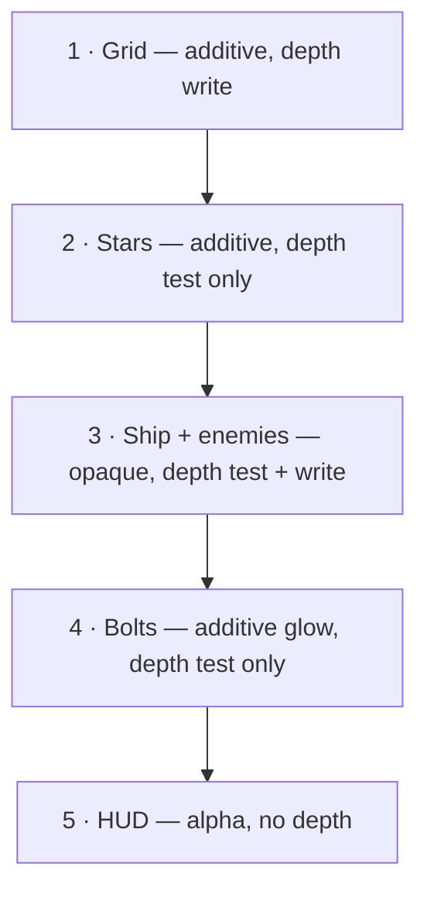

# 08 · Meshes & geometry 🛠️

> **You'll leave this chapter with:** every shape in the game generated in code —
> ship, enemy, bolt, starfield, ground grid — uploaded to the GPU and **on your
> screen**. This is the payoff for chapters 02 through 07.B. Zero art assets.
>
> **Files created:** `src/Mesh.{hpp,cpp}`. `src/render/Renderer.{hpp,cpp}`,
> `src/main.cpp` and `CMakeLists.txt` grow.

---

## What a mesh is, here

Two forms: **CPU data** we generate, and the **GPU buffers** we upload it into.

**`src/Mesh.hpp`** — new file:

```cpp
#pragma once

#include "render/RenderTypes.hpp"

#include <cstdint>
#include <vector>

/// CPU-side geometry. An empty `indices` means "draw this non-indexed".
struct MeshData {
    std::vector<Vertex> vertices;
    std::vector<uint16_t> indices;
};
```

Indices let triangles share corners: a cube has 8 corners and 12 triangles, so you
store 8 vertices and 36 indices instead of 36 vertices. `uint16_t` caps us at 65,535
vertices per mesh, which is far more than anything here needs and halves the index
buffer.

Note what is **not** on the mesh: topology. In Vulkan that lives in the pipeline
(chapter 07.B), so a mesh's topology is really "which pipeline draws it".

**`Mesh.hpp`** — after `MeshData`:

```diff
     std::vector<uint16_t> indices;
 };
+
+namespace MeshLibrary {
+
+MeshData ship();
+MeshData enemy();
+MeshData bolt();
+MeshData starfield(int count, float span);
+MeshData grid(float halfExtent, float spacing);
+
+} // namespace MeshLibrary
```

---

## Flat shading and the outward-normal trick

We want the crisp, faceted look of classic low-poly space shooters — each face a
single flat shade.

A **smooth** mesh shares a vertex between the faces meeting at it and averages their
normals, giving rounded gradients. A **flat** mesh does the opposite: every triangle
gets its own three vertices and one shared normal — the face's normal — so each face
reads as a distinct plane. More vertices, simpler math, exactly the aesthetic.

The normal of a triangle is the cross product of two of its edges. But which way
does it point? That depends on the winding order of the corners, which is easy to
get wrong when you are typing coordinates by hand. So rather than being careful, we
make it **self-correcting**.

**`src/Mesh.cpp`** — new file:

```cpp
#include "Mesh.hpp"

#include <array>
#include <random>

namespace {

using Tri = std::array<glm::vec3, 3>;

/// Flat-shade a triangle soup: every triangle gets its own three vertices and
/// one shared face normal, flipped outward if it points back at the centroid.
MeshData flat(const std::vector<Tri>& tris) {
    glm::vec3 centroid{0.0f};
    for (const Tri& t : tris) centroid += t[0] + t[1] + t[2];
    centroid /= float(tris.size() * 3);
}

} // namespace
```

**`Mesh.cpp`**, in `flat` — after the centroid:

```diff
     centroid /= float(tris.size() * 3);
+
+    MeshData m;
+    for (const Tri& t : tris) {
+        glm::vec3 faceCenter = (t[0] + t[1] + t[2]) / 3.0f;
+        glm::vec3 normal = glm::normalize(glm::cross(t[1] - t[0], t[2] - t[0]));
+        if (glm::dot(normal, faceCenter - centroid) < 0.0f) normal = -normal;
+
+        uint16_t base = uint16_t(m.vertices.size());
+        for (const glm::vec3& p : t) m.vertices.push_back({p, normal});
+        m.indices.insert(m.indices.end(), {base, uint16_t(base + 1), uint16_t(base + 2)});
+    }
+    return m;
 }
```

`glm::dot(normal, faceCenter - centroid) < 0` asks "does this normal point back
toward the middle of the shape?" If so, we listed the corners the wrong way round,
so negate it. Give the builder any list of triangles and get a correctly-lit mesh
back, regardless of how carefully you typed.

This is also *why* chapter 07.B set `cullMode = VK_CULL_MODE_NONE`. We have given up
a reliable winding order in exchange for never seeing a black face, and back-face
culling needs exactly that winding order. It is a real trade, and this is the side
of it we chose.

Indexing here is a formality — three fresh vertices, three consecutive indices — so
`flat` produces no sharing at all. That is what flat shading *means*, and keeping
the index buffer anyway means every solid takes the same draw path.

**`Mesh.cpp`**, in the anonymous namespace — after `flat`:

```diff
     return m;
 }
+
+void quad(std::vector<Tri>& out, glm::vec3 a, glm::vec3 b, glm::vec3 c, glm::vec3 d) {
+    out.push_back({a, b, c});
+    out.push_back({a, c, d});
+}
 
 } // namespace
```

---

## The shapes

### The ship — a four-faced dart

**`Mesh.cpp`** — after the anonymous namespace:

```diff
 } // namespace
+
+namespace MeshLibrary {
+
+MeshData ship() {
+    glm::vec3 nose{0.0f, 0.0f, -2.0f};
+    glm::vec3 top{0.0f, 0.4f, 1.0f};
+    glm::vec3 left{-1.3f, -0.3f, 1.0f};
+    glm::vec3 right{1.3f, -0.3f, 1.0f};
+    return flat({
+        {nose, left, top},
+        {nose, top, right},
+        {nose, right, left},
+        {top, left, right},
+    });
+}
+
+} // namespace MeshLibrary
```

Four points, four triangular faces, nose at **−Z** — chapter 03's rule 1, in
coordinates. It is a tetrahedron stretched forward: unmistakably a fighter from
behind, and four triangles cheap.

### The enemy — an octahedron

**`Mesh.cpp`**, in `namespace MeshLibrary` — after `ship`:

```diff
         {top, left, right},
     });
 }
+
+MeshData enemy() {
+    glm::vec3 px{1.0f, 0.0f, 0.0f}, nx{-1.0f, 0.0f, 0.0f};
+    glm::vec3 py{0.0f, 1.0f, 0.0f}, ny{0.0f, -1.0f, 0.0f};
+    glm::vec3 pz{0.0f, 0.0f, 1.0f}, nz{0.0f, 0.0f, -1.0f};
+    return flat({
+        {py, px, pz}, {py, pz, nx}, {py, nx, nz}, {py, nz, px},
+        {ny, pz, px}, {ny, nx, pz}, {ny, nz, nx}, {ny, px, nz},
+    });
+}
```

Six points on the axes, eight faces — four around the top vertex, four around the
bottom. The simplest solid that still reads as a deliberate, hostile object. Notice
that the bottom row's winding is inconsistent with the top row's; `flat` does not
care, which is the whole point of it.

### The bolt — a cube

**`Mesh.cpp`**, in `namespace MeshLibrary` — after `enemy`:

```diff
         {ny, pz, px}, {ny, nx, pz}, {ny, nz, nx}, {ny, px, nz},
     });
 }
+
+MeshData bolt() {
+    glm::vec3 a{-1, -1, -1}, b{1, -1, -1}, c{1, 1, -1}, d{-1, 1, -1};
+    glm::vec3 e{-1, -1, 1}, f{1, -1, 1}, g{1, 1, 1}, h{-1, 1, 1};
+    std::vector<Tri> tris;
+    quad(tris, a, b, c, d);
+    quad(tris, f, e, h, g);
+    quad(tris, e, a, d, h);
+    quad(tris, b, f, g, c);
+    quad(tris, d, c, g, h);
+    quad(tris, e, f, b, a);
+    return flat(tris);
+}
```

A unit cube, drawn unlit and additively (the `bolt` pipeline) and scaled
long-and-thin at spawn — chapter 12 gives it `scale = (0.18, 0.18, 0.7)` — so it
reads as a glowing bar rather than a box. One mesh, restyled per instance.

---

## The starfield: a few thousand points that tile forever

**`Mesh.cpp`**, in `namespace MeshLibrary` — after `bolt`:

```diff
     quad(tris, e, f, b, a);
     return flat(tris);
 }
+
+MeshData starfield(int count, float span) {
+    MeshData m;
+    std::mt19937 rng{1337u};
+    std::uniform_real_distribution<float> pos{-span * 0.5f, span * 0.5f};
+    std::uniform_real_distribution<float> unit{0.0f, 1.0f};
+    for (int i = 0; i < count; i++) {
+        glm::vec3 p{pos(rng), pos(rng), pos(rng)};
+        float brightness = 0.4f + 0.6f * unit(rng);
+        m.vertices.push_back({p, glm::vec3(brightness, 0.0f, 0.0f)});
+    }
+    return m;
+}
```

No indices — stars are drawn non-indexed as points. The `mt19937` is **seeded with a
constant**, deliberately: the sky is identical every run, so if you ever see a
rendering change you know it came from your code and not from a different random
draw. Debugging against a moving target is a special kind of miserable.

Brightness rides in `normal.x`, the spare channel chapter 07.A's `star.vert` reads.
The chapter-07.A shader then folds each star into the tile centred on the camera, so
this finite cube of points becomes an endless sky at zero CPU cost.

---

## The ground grid, and lines that vanish

A flat lattice of line segments on the XZ plane gives orientation the way Star Fox's
ground does — you read pitch and roll against it instantly.

The obvious way to build it is one long line per row:

**`Mesh.cpp`**, in `namespace MeshLibrary` — after `starfield`:

```diff
         m.vertices.push_back({p, glm::vec3(brightness, 0.0f, 0.0f)});
     }
     return m;
 }
+
+MeshData grid(float halfExtent, float spacing) {
+    MeshData m;
+    for (float i = -halfExtent; i <= halfExtent; i += spacing) {
+        m.vertices.push_back({{i, 0.0f, -halfExtent}, {}});
+        m.vertices.push_back({{i, 0.0f, halfExtent}, {}});
+        m.vertices.push_back({{-halfExtent, 0.0f, i}, {}});
+        m.vertices.push_back({{halfExtent, 0.0f, i}, {}});
+    }
+    return m;
+}
```

Also non-indexed, and drawn as a line list, so the vertices are read in pairs: the
first two are one line running along Z at `x = i`, the next two are one line running
along X at `z = i`. Forty-one of each, and no indices to write.

Hold onto that. It looks right, it *is* the obvious implementation, and we will come
back to it once there is something on screen to look at.

---

## Uploading

The renderer turns each `MeshData` into GPU buffers once, at startup, using chapter
06's staging path.

**`Renderer.hpp`** — at the top of the include block:

```diff
 #pragma once
 
+#include "Mesh.hpp"
 #include "render/RenderTypes.hpp"
 #include "render/Swapchain.hpp"
```

**`Renderer.hpp`** — in the include block, before `<vector>`:

```diff
 #include <functional>
 #include <string>
+#include <unordered_map>
 #include <vector>
```

**`Renderer.hpp`** — after `struct Buffer`:

```diff
     void* mapped = nullptr;
 };
+
+/// The GPU-side counterpart of MeshData. `indexCount == 0` means non-indexed.
+struct Mesh {
+    Buffer vertexBuffer;
+    Buffer indexBuffer;
+    uint32_t vertexCount = 0;
+    uint32_t indexCount = 0;
+};
 
 struct FrameSync {
```

**`Renderer.hpp`** — after `struct FrameSync`:

```diff
     VkFence inFlight = VK_NULL_HANDLE;
 };
+
+/// One mesh's slice of the flattened instance array.
+struct DrawGroup {
+    MeshID mesh;
+    uint32_t first;
+    uint32_t count;
+};
 
 enum class DepthMode { TestWrite, TestOnly, Off };
```

**`Renderer.hpp`**, in `class Renderer` — after `createPipelines`:

```diff
     void createPipelines();
+
+    Mesh uploadMesh(const MeshData& data);
+    void createMeshes();
+    void uploadFrameData(const FrameData& frame);
+    void drawMeshGroup(VkCommandBuffer cmd, const DrawGroup& group);
```

**`Renderer.hpp`**, in `class Renderer` — after `hudPipeline`:

```diff
     VkPipeline hudPipeline = VK_NULL_HANDLE;
+
+    std::unordered_map<MeshID, Mesh> meshes;
+
+    std::vector<DrawGroup> groups;
+    uint32_t gridInstance = 0;
+    uint32_t hudVertexCount = 0;
 
     uint32_t currentFrame = 0;
```

The renderer's two entry points now need the frame's data:

**`Renderer.hpp`**, in `class Renderer` — change the two signatures:

```diff
     void destroy();
-    void drawFrame();
+    void drawFrame(const FrameData& frame);
     void onFramebufferResized() { framebufferResized = true; }
```

`recordFrame` keeps its signature. Everything it needs about this frame —
the draw groups, the grid's slot, the HUD vertex count — will be a member by the
time it runs, written by `uploadFrameData` a few lines earlier in `drawFrame`.

Now the implementations.

**`Renderer.cpp`** — after `createPipelines`:

```diff
                                BlendMode::Alpha, VertexLayout::Hud);
 }
+
+Mesh Renderer::uploadMesh(const MeshData& data) {
+    Mesh m;
+    m.vertexBuffer = uploadStatic(data.vertices.data(),
+                                  data.vertices.size() * sizeof(Vertex),
+                                  VK_BUFFER_USAGE_VERTEX_BUFFER_BIT);
+    m.vertexCount = uint32_t(data.vertices.size());
+
+    if (!data.indices.empty()) {
+        m.indexBuffer = uploadStatic(data.indices.data(),
+                                     data.indices.size() * sizeof(uint16_t),
+                                     VK_BUFFER_USAGE_INDEX_BUFFER_BIT);
+        m.indexCount = uint32_t(data.indices.size());
+    }
+    return m;
+}
```

**`Renderer.cpp`** — after `uploadMesh`:

```diff
     return m;
 }
+
+void Renderer::createMeshes() {
+    meshes[MeshID::Ship] = uploadMesh(MeshLibrary::ship());
+    meshes[MeshID::Enemy] = uploadMesh(MeshLibrary::enemy());
+    meshes[MeshID::Bolt] = uploadMesh(MeshLibrary::bolt());
+    meshes[MeshID::Star] = uploadMesh(MeshLibrary::starfield(kStarCount, kStarSpan));
+    meshes[MeshID::Grid] = uploadMesh(MeshLibrary::grid(kGridHalfExtent, kGridSpacing));
+}
```

Five meshes, five staged uploads, five device-local buffer pairs — and after this
they are never touched again. The constants come from `RenderTypes.hpp`, so the
simulation's grid-snapping (chapter 09) and this generation agree by construction.

---

## Flattening the frame's instances

Each frame, the simulation hands us a map of mesh → instances. The GPU wants **one
contiguous array**, plus a note of where each mesh's slice starts.

**`Renderer.cpp`** — after `createMeshes`:

```diff
     meshes[MeshID::Grid] = uploadMesh(MeshLibrary::grid(kGridHalfExtent, kGridSpacing));
 }
+
+void Renderer::uploadFrameData(const FrameData& frame) {
+    std::memcpy(uniformBuffers[currentFrame].mapped, &frame.uniforms, sizeof(FrameUniforms));
+    vkCheck(vmaFlushAllocation(ctx->allocator, uniformBuffers[currentFrame].alloc, 0,
+                               VK_WHOLE_SIZE), "vmaFlushAllocation");
+}
```

**`Renderer.cpp`**, in `uploadFrameData` — after the uniform copy:

```diff
     vkCheck(vmaFlushAllocation(ctx->allocator, uniformBuffers[currentFrame].alloc, 0,
                                VK_WHOLE_SIZE), "vmaFlushAllocation");
+
+    // Flatten every mesh bucket into one array, remembering each slice.
+    std::vector<InstanceData> all;
+    groups.clear();
+    for (const auto& entry : frame.byMesh) {
+        if (entry.second.empty()) continue;
+        groups.push_back({entry.first, uint32_t(all.size()), uint32_t(entry.second.size())});
+        all.insert(all.end(), entry.second.begin(), entry.second.end());
+    }
+
+    // The grid is not an entity, so it contributes one hand-built instance.
+    gridInstance = uint32_t(all.size());
+    all.push_back(InstanceData{frame.gridModel, glm::vec4(0.12f, 0.35f, 0.45f, 1.0f)});
 }
```

The grid tacked on the end is the seam being honest: the grid is scenery, not an
entity, so nothing in the simulation produces an instance for it. Rather than
special-casing it in the shader, we give it a slot in the same array like everything
else.

**`Renderer.cpp`**, in `uploadFrameData` — after the grid instance:

```diff
     all.push_back(InstanceData{frame.gridModel, glm::vec4(0.12f, 0.35f, 0.45f, 1.0f)});
+
+    if (all.size() > kMaxInstances) all.resize(kMaxInstances);
+    std::memcpy(instanceBuffers[currentFrame].mapped, all.data(),
+                all.size() * sizeof(InstanceData));
+    vkCheck(vmaFlushAllocation(ctx->allocator, instanceBuffers[currentFrame].alloc, 0,
+                               VK_WHOLE_SIZE), "vmaFlushAllocation");
+
+    hudVertexCount = uint32_t(std::min<size_t>(frame.hud.size(), kMaxHudVertices));
+    if (hudVertexCount > 0) {
+        std::memcpy(hudBuffers[currentFrame].mapped, frame.hud.data(),
+                    hudVertexCount * sizeof(HUDVertex));
+        vkCheck(vmaFlushAllocation(ctx->allocator, hudBuffers[currentFrame].alloc, 0,
+                                   VK_WHOLE_SIZE), "vmaFlushAllocation");
+    }
 }
```

Both clamps are the fixed-ceiling shortcut from chapter 06 showing its face: past
`kMaxInstances` we silently drop instances rather than overrun the buffer. Silent
truncation is a bad default and it is here on purpose — chapter 06's challenge is to
grow the buffer instead.

`std::min` needs one more header:

**`Renderer.cpp`** — before the `<cstring>` include:

```diff
 #include "render/Renderer.hpp"
 
+#include <algorithm>
 #include <cstring>
```

---

## Drawing a group

**`Renderer.cpp`** — after `uploadFrameData`:

```diff
                                    VK_WHOLE_SIZE), "vmaFlushAllocation");
     }
 }
+
+void Renderer::drawMeshGroup(VkCommandBuffer cmd, const DrawGroup& group) {
+    auto it = meshes.find(group.mesh);
+    if (it == meshes.end()) return;
+    const Mesh& m = it->second;
+
+    VkDeviceSize zero = 0;
+    vkCmdBindVertexBuffers(cmd, 0, 1, &m.vertexBuffer.buffer, &zero);
+    if (m.indexCount > 0) {
+        vkCmdBindIndexBuffer(cmd, m.indexBuffer.buffer, 0, VK_INDEX_TYPE_UINT16);
+        vkCmdDrawIndexed(cmd, m.indexCount, group.count, 0, 0, group.first);
+    } else {
+        vkCmdDraw(cmd, m.vertexCount, group.count, 0, group.first);
+    }
+}
```

That last argument to both draw calls is **`firstInstance`**, and it is the trick
that makes one storage buffer serve every mesh. `gl_InstanceIndex` in the shader
*includes* `firstInstance`, so `instances[gl_InstanceIndex]` reads the right slice
with no descriptor rebinding between groups. One buffer, one descriptor set, one
`memcpy`, N draws.

---

## The draw order

**`Renderer.cpp`**, in `recordFrame` — after `vkCmdBeginRenderPass`:

```diff
     vkCmdBeginRenderPass(cmd, &rp, VK_SUBPASS_CONTENTS_INLINE);
+
+    VkViewport viewport{0.0f, 0.0f, float(swapchain->extent.width),
+                        float(swapchain->extent.height), 0.0f, 1.0f};
+    VkRect2D scissor{{0, 0}, swapchain->extent};
+    vkCmdSetViewport(cmd, 0, 1, &viewport);
+    vkCmdSetScissor(cmd, 0, 1, &scissor);
+
+    vkCmdBindDescriptorSets(cmd, VK_PIPELINE_BIND_POINT_GRAPHICS, pipelineLayout, 0, 1,
+                            &descriptorSets[currentFrame], 0, nullptr);
 
     vkCmdEndRenderPass(cmd);
```

There is the dynamic state from chapter 07.B being supplied, once per frame, from
the swapchain's current extent — which is exactly why a resize costs no pipeline
rebuilds. And the descriptor set is bound **once**, before any draw, because every
pipeline shares one layout.

Now the five passes, in a deliberate order:



**`Renderer.cpp`**, in `recordFrame` — after binding the descriptor set:

```diff
     vkCmdBindDescriptorSets(cmd, VK_PIPELINE_BIND_POINT_GRAPHICS, pipelineLayout, 0, 1,
                             &descriptorSets[currentFrame], 0, nullptr);
+
+    // 1. grid — lays down depth for the solids to test against
+    vkCmdBindPipeline(cmd, VK_PIPELINE_BIND_POINT_GRAPHICS, gridPipeline);
+    drawMeshGroup(cmd, {MeshID::Grid, gridInstance, 1});
+
+    // 2. stars — depth-tested but not depth-writing
+    vkCmdBindPipeline(cmd, VK_PIPELINE_BIND_POINT_GRAPHICS, starPipeline);
+    StarParams starParams{kStarSpan};
+    vkCmdPushConstants(cmd, pipelineLayout, VK_SHADER_STAGE_VERTEX_BIT, 0,
+                       sizeof(StarParams), &starParams);
+    drawMeshGroup(cmd, {MeshID::Star, 0, 1});
 
     vkCmdEndRenderPass(cmd);
```

There is the push constant, finally used: four bytes written straight into the
command buffer with no descriptor anywhere. The stars draw with `firstInstance = 0`
because `star.vert` ignores the instance array entirely — it positions from the
camera alone.

**`Renderer.cpp`**, in `recordFrame` — after the star draw:

```diff
     drawMeshGroup(cmd, {MeshID::Star, 0, 1});
+
+    // 3. ship and enemies — the only depth writers among the entities
+    vkCmdBindPipeline(cmd, VK_PIPELINE_BIND_POINT_GRAPHICS, litPipeline);
+    for (const DrawGroup& g : groups)
+        if (g.mesh == MeshID::Ship || g.mesh == MeshID::Enemy) drawMeshGroup(cmd, g);
+
+    // 4. bolts — additive glow over everything solid
+    vkCmdBindPipeline(cmd, VK_PIPELINE_BIND_POINT_GRAPHICS, boltPipeline);
+    for (const DrawGroup& g : groups)
+        if (g.mesh == MeshID::Bolt) drawMeshGroup(cmd, g);
 
     vkCmdEndRenderPass(cmd);
```

Two passes over `groups` rather than one, because the pipeline changes between them
and switching pipelines per draw would be the expensive way to get the same picture.
This is the shape all sorted rendering takes: bucket by state, then draw each bucket.

Why this order and these depth settings:

1. **Grid** writes depth, laying a floor the solids can test against.
2. **Stars** test depth (so the grid occludes ones below the horizon) but don't
   write, so a star can never block a ship drawn later.
3. **Ship and enemies** test *and* write, which is what makes near ships hide far
   ones with no sorting anywhere.
4. **Bolts** glow additively and test-but-don't-write, so a bolt in front of the
   ship brightens it rather than punching a hole in the depth buffer.

The HUD is pass 5 and arrives in chapter 13.

**`Renderer.cpp`**, in `drawFrame` — change the signature and add the upload:

```diff
-void Renderer::drawFrame() {
+void Renderer::drawFrame(const FrameData& frame) {
     FrameSync& s = sync[currentFrame];
```

**`Renderer.cpp`**, in `drawFrame` — add the upload before recording:

```diff
     // 3. Record this frame's commands.
+    uploadFrameData(frame);
     vkResetCommandBuffer(commandBuffers[currentFrame], 0);
     recordFrame(commandBuffers[currentFrame], imageIndex);
```

`uploadFrameData` sits **after** the fence wait in step 1, and that placement is the
whole reason the fence exists: by this point the GPU has finished with this slot's
buffers, so overwriting them is safe.

**`Renderer.cpp`**, in `Renderer::init` — after `createPipelines`:

```diff
     createPipelines();
+    createMeshes();
 }
```

**`Renderer.cpp`**, in `Renderer::destroy` — after `vkDeviceWaitIdle`:

```diff
 void Renderer::destroy() {
     vkDeviceWaitIdle(ctx->device);
 
+    for (auto& entry : meshes) {
+        destroyBuffer(entry.second.vertexBuffer);
+        destroyBuffer(entry.second.indexBuffer);
+    }
+    meshes.clear();
+
     for (VkPipeline p : {litPipeline, gridPipeline, boltPipeline, starPipeline, hudPipeline})
```

Destroying `indexBuffer` unconditionally is safe because chapter 06's
`destroyBuffer` checks the handle — the star and grid meshes never had one.

---

## Something to look at

`main.cpp` has no simulation yet, so hand-build one frame's worth of data. This is
scaffolding; chapter 09 replaces it with `game.update(...)`.

**`CMakeLists.txt`**, in `add_executable` — after `src/main.cpp`:

```diff
 add_executable(SpaceFighter
     src/main.cpp
+    src/Mesh.cpp
     src/render/VmaImplementation.cpp
```

**`main.cpp`** — after the `Renderer.hpp` include:

```diff
 #include "render/Renderer.hpp"
+
+#include "Math.hpp"
 
 #include <cstdio>
```

**`main.cpp`**, in the `while` loop — replace the draw call (scaffolding; chapter
09 replaces this block with the real simulation):

```diff
         if (w == 0 || h == 0) continue;   // minimised: nothing to draw into
 
-        renderer.drawFrame();
+        FrameData frame;
+        glm::vec3 eye{0.0f, 6.0f, 22.0f};
+        glm::mat4 proj = Math::perspective(glm::radians(65.0f),
+                                           float(w) / float(h), 0.1f, 1200.0f);
+        frame.uniforms.viewProjection = proj * Math::lookAt(eye, glm::vec3(0.0f),
+                                                            glm::vec3(0.0f, 1.0f, 0.0f));
+        frame.uniforms.cameraPosition = glm::vec4(eye, 1.0f);
+        frame.uniforms.lightDirection =
+            glm::vec4(glm::normalize(glm::vec3(-0.35f, -0.80f, -0.45f)), 0.0f);
+        frame.byMesh[MeshID::Ship].push_back(
+            InstanceData{glm::mat4(1.0f), glm::vec4(0.62f, 0.78f, 0.95f, 1.0f)});
+        frame.gridModel = glm::translate(glm::mat4(1.0f), glm::vec3(0.0f, kGroundY, 0.0f));
+
+        renderer.drawFrame(frame);
```

```console
$ cmake -S . -B build && cmake --build build && cd build && ./SpaceFighter
```

**A ship.** A pale blue dart at the centre of the screen, a starfield behind it, and
a cyan ground grid below. Ten chapters of machinery, and there it is.

---

## The lines that aren't there

Look at the grid properly, though. There are horizontal lines running across the
screen, converging toward the horizon exactly as they should — and **not one line
running away from you.** Half the grid is missing.

The mesh is not the problem: `grid()` emits 41 lines in each direction, and you can
confirm it by counting `m.vertices.size()`. The pipeline is not the problem either;
the same pipeline is drawing the lines you *can* see.

The difference between the two families is where they sit relative to the camera.
Every X-direction line has a constant `z`, so it is entirely in front of the camera
or entirely behind it — the ones in front draw, the ones behind are culled, and
that's that. But every Z-direction line runs from `z = -400` to `z = +400`, and the
camera is somewhere in the middle of that. **Each of those lines starts in front of
you and ends behind you**, crossing the plane where the perspective divide is
undefined.

Clipping a line that crosses the near plane is something implementations are
supposed to handle, and some do it badly enough that the whole segment disappears.
Rather than depend on it, don't hand them the case: emit one short segment per grid
cell instead of one line per row, and no segment can ever span the camera.

**`Mesh.cpp`**, in `MeshLibrary::grid` — replace the loop:

```diff
 MeshData grid(float halfExtent, float spacing) {
     MeshData m;
+    // One short segment per cell rather than one full-length line per row.
+    // A single line running from far ahead of the camera to far behind it has
+    // to be clipped against the near plane, and such lines can vanish
+    // entirely; a one-cell segment never spans the camera.
     for (float i = -halfExtent; i <= halfExtent; i += spacing) {
-        m.vertices.push_back({{i, 0.0f, -halfExtent}, {}});
-        m.vertices.push_back({{i, 0.0f, halfExtent}, {}});
-        m.vertices.push_back({{-halfExtent, 0.0f, i}, {}});
-        m.vertices.push_back({{halfExtent, 0.0f, i}, {}});
+        for (float j = -halfExtent; j < halfExtent; j += spacing) {
+            m.vertices.push_back({{i, 0.0f, j}, {}});
+            m.vertices.push_back({{i, 0.0f, j + spacing}, {}});
+            m.vertices.push_back({{j, 0.0f, i}, {}});
+            m.vertices.push_back({{j + spacing, 0.0f, i}, {}});
+        }
     }
     return m;
 }
```

That takes the grid from 164 vertices to 6,560, which sounds like a lot and is
nothing — it is one buffer, uploaded once, drawn in one call. Rebuild, and the floor
snaps into a proper receding lattice.

The lesson generalises past grids: **a primitive that crosses the near plane is the
edge case, and the cheapest fix is usually to not have one.** Long debug lines,
skybox geometry and ground planes are where this bites.

---

## Checkpoint

```console
$ cmake --build build && cd build && ./SpaceFighter
[vulkan] using NVIDIA GeForce RTX 4070 (Vulkan 1.3)
[swapchain] 1280x720  format 50  3 images
```

On screen: a pale blue **ship** in the centre, a **grid** below it receding to a
horizon with lines running both ways, and a **starfield** filling the sky. Resize
the window — everything should stay correctly proportioned. And validation stays
silent.

| Symptom | Likely cause |
|---|---|
| Completely black window | The `colorWriteMask` from chapter 07.B, or `uploadFrameData` never called from `drawFrame`. |
| Ship visible, no grid or stars | `createMeshes()` missing from `init`. |
| Grid has only horizontal lines | The per-cell fix above is missing. |
| Stars are single pixels | The `largePoints` device feature (chapter 02) is off. |
| Ship is an unrecognisable spike | The vertex attribute `location` numbers are swapped — chapter 07.A's deliberate breakage, arriving on schedule. |
| Ship renders upside down | `p[1][1] *= -1.0f` is missing from `Math::perspective`. |
| `cannot open shaders/lit.vert.spv` | Run from `build/`. |
| Everything flickers or disappears at certain angles | Depth clear is 0.0 rather than 1.0 (chapter 05.B's second deliberate breakage). |

**Try breaking it on purpose.** In `createMeshes`, swap `MeshID::Ship` and
`MeshID::Enemy` so each id maps to the other's geometry. You get an octahedron
instead of a dart, drawn with the ship's colour and matrix — a clean demonstration
that `MeshID` is nothing but a key, and that geometry, colour and transform are
three independent choices the instance system keeps separate. Swap them back.

---

## Making your own shape

1. Add a value to the `MeshID` enum in `RenderTypes.hpp`.
2. Write a generator in `Mesh.cpp` returning `flat({...})` for a solid, or raw
   vertices for points and lines.
3. Upload it in `createMeshes`.
4. Give some entity `Renderable{MeshID::Yours, colour}` (chapter 09).

That is the entire art pipeline. Chapter 14 covers graduating to real models when
"simple geometry" stops being enough — the ECS and the draw loop do not care where
vertices come from.

---

## Challenge

Give the ship engine glow: a small additive quad behind it that scales with boost.

Three things to get right. A quad facing the camera needs either a billboard
(rebuild its vertices per frame from the camera's right and up vectors) or a fixed
mesh accepting that it looks flat from the side — pick one, because the halfway
version looks broken from every angle. It must draw in the **bolt** pass, not the
lit one, or it will write depth and cut a hole in the ship in front of it. And it
needs its own `MeshID` even though it is geometrically a cube face, because
`drawMeshGroup` keys the buffers by mesh id and reusing `Bolt` would make every bolt
an engine glow too.

---

**Next:** the clock, the schedule, and the ECS finally driving all of this. →
[Chapter 09: The game loop & timing](09-the-game-loop.md)
